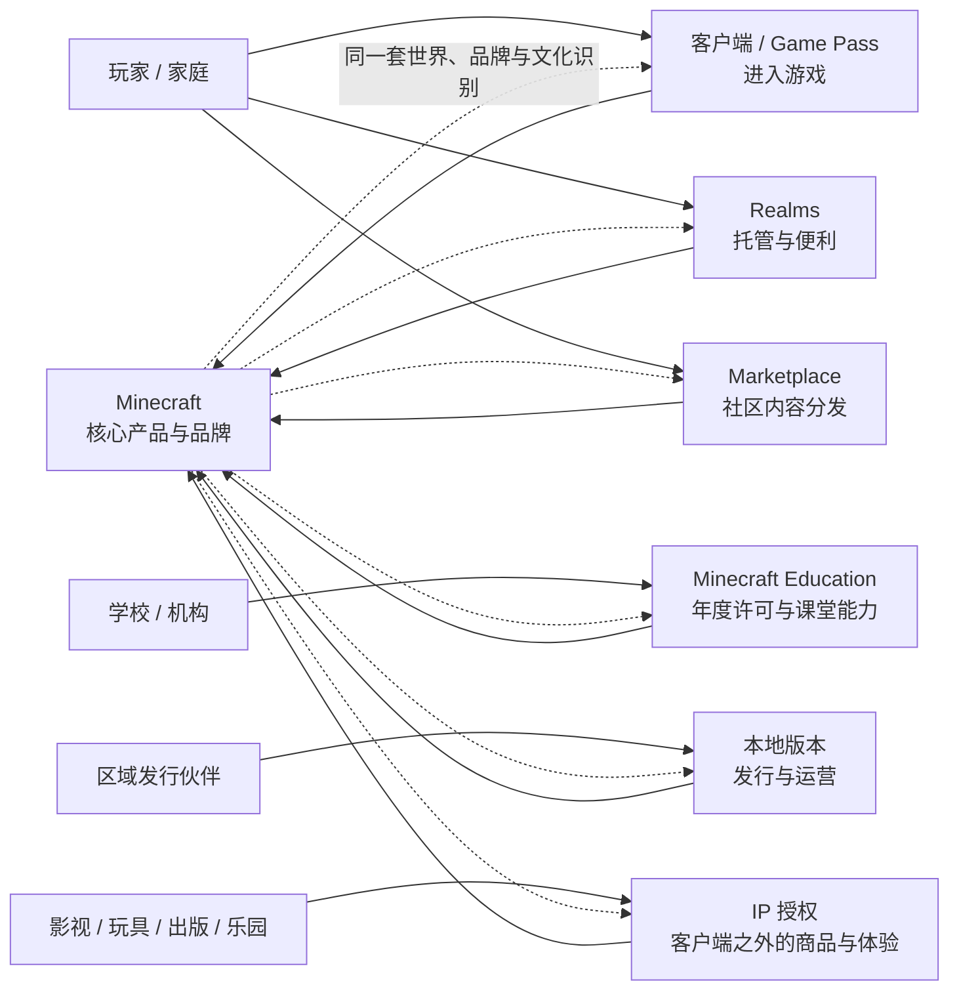

如果只看商店页面，Minecraft 很容易被理解成一款传统的买断游戏：付一次钱，拿到客户端，之后继续更新。

这句话今天仍然成立，但已经不足以描述它的生意。

玩家还可以订阅 Realms；Bedrock 里有 Marketplace；学校按年购买 Minecraft Education；不同地区可以采用不同的发行合同；电影、玩具、出版和主题乐园又把 Minecraft 这个名字带到游戏以外。

这些收入并不都由 Mojang 直接收取，也不属于同一种商业模式。微软也没有在财报里单独公布一张“Minecraft 收入表”。所以与其猜一年到底赚了多少钱，不如先把**谁在为什么付钱**分清楚。

| 收入路径 | 主要付费者 | 买到什么 | 与游戏本体的关系 |
| --- | --- | --- | --- |
| 客户端 / 平台订阅 | 玩家、家庭 | 进入游戏的资格 | 最接近本体 |
| Realms | 玩家、家庭 | 官方托管的持续在线世界 | 服务层 |
| Marketplace | Bedrock 玩家 | 地图、皮肤、资源与 Add-On 内容 | 内容分发层 |
| Education | 学校、机构 | 账号、课堂功能与部署许可 | 机构产品 |
| 区域发行 | 当地发行商与玩家 | 本地化版本与运营服务 | 发行模式 |
| IP 授权 | 影视、玩具、出版、乐园合作方与消费者 | Minecraft 品牌与世界观的其他载体 | 游戏之外 |

这张表比“买断还是免费”更接近 Minecraft 今天真正的收入结构。

```mermaid
flowchart LR
  Core["Minecraft<br/>核心产品与品牌"]

  Player["玩家 / 家庭"]
  School["学校 / 机构"]
  Region["区域发行伙伴"]
  Media["影视 / 玩具 / 出版 / 乐园"]

  Game["客户端 / Game Pass<br/>进入游戏"]
  Realms["Realms<br/>托管与便利"]
  Market["Marketplace<br/>社区内容分发"]
  Edu["Minecraft Education<br/>年度许可与课堂能力"]
  Local["本地版本<br/>发行与运营"]
  IP["IP 授权<br/>客户端之外的商品与体验"]

  Player --> Game --> Core
  Player --> Realms --> Core
  Player --> Market --> Core
  School --> Edu --> Core
  Region --> Local --> Core
  Media --> IP --> Core

  Core -. "同一套世界、品牌与文化识别" .-> Game
  Core -.-> Realms
  Core -.-> Market
  Core -.-> Edu
  Core -.-> Local
  Core -.-> IP
```

这张图不是一条从左到右设计好的商业漏斗。Realms、Marketplace、Education、区域发行和 IP 授权来自不同时间、不同需求；它只是把今天围绕 Minecraft 已经形成的几种交易关系放到同一张地图上。

## 买断仍然是入口，但已经不是全部

2022 年起，Windows PC 上的标准产品变成 **Minecraft: Java & Bedrock Edition for PC**：购买一次，同时获得 Java 和 Bedrock，两款游戏仍然各自独立。[^bundle] 同一产品也可以通过 Game Pass 获得。

也就是说，Minecraft 的基础入口并没有变成“免费客户端 + 必须持续付费”。对大量玩家来说，购买游戏仍然是最主要、最容易理解的交易。

这条入口本身规模已经非常大。2023 年 Minecraft Live 上，Mojang 宣布累计销量超过 **3 亿份**。[^300m]

但累计销量不能直接告诉我们 Minecraft 今天每年怎样赚钱。一个买了十年的玩家仍可能继续玩，却不会每年重新购买客户端；一个家庭也可能因为换平台再次购买。销量更适合说明入口有多大，而不是代替收入结构。

<Note title="没有一张公开的 Minecraft 利润表">
微软会在财报和公开活动里披露部分 Minecraft 指标，但并不把这个品牌的客户端、Realms、Marketplace、授权和衍生业务拆成完整的年度损益表。因此本章只讨论能确认的收入渠道与公开量级，不把票房、创作者收入或订阅价格混成“Minecraft 年收入”。
</Note>

## Realms：把服务器托管做成订阅

Realms 是 Minecraft 最直接的持续性收入之一。

它卖的不是另一套游戏规则，而是一项很具体的服务：让一个世界长期在线，不必自己配置和维护服务器。Bedrock Realms、Realms Plus 与 Java Realms 都采用按月订阅；当前美国官方页面列出的价格分别约为 3.99 美元、7.99 美元和 7.99 美元每月。[^realms]

Realms 很早就瞄准了一个普通自建服务器没有完全解决的需求：**降低多人世界的维护成本。**

自己开服意味着端口、存档备份、版本升级、在线时间和管理员责任。对技术玩家来说这些都可以处理，但对想给朋友或家人留一张一直在线的世界的人来说，官方托管本身就有价值。

因此 Realms 和上一章讨论的大型服务器不是同一种商品。Hypixel 一类服务器卖的是自己设计的玩法与社区；Realms 更接近基础设施——玩家仍然主要在自己的世界里玩，只是把“让它一直在线”这件事交给 Mojang。

Bedrock 的 Realms Plus 又把这种订阅和 Marketplace 内容绑在一起：除了十人同时在线的 Realm，还包含一批 Marketplace Pass 内容。[^realms]

这说明订阅并不一定要改变 Minecraft 的基础玩法，也可以围绕**托管、便利和内容目录**发生。

## Marketplace：把社区内容放进官方商店

2017 年上线的 Minecraft Marketplace，是 Bedrock 商业模式里最重要的一层。

它让经过合作计划的创作者能够在游戏内部出售地图、皮肤、资源包以及后来更丰富的 Add-On 内容。玩家不必离开客户端寻找第三方下载，主机和移动平台也可以使用同一套官方分发方式。[^marketplace]

Marketplace 最明显的变化，是把过去主要发生在论坛、网站和整合包平台上的社区创作，部分变成了**有审核、有商店、有支付和更新渠道的数字商品**。

这和 Java Modding 并不是同一件事。[《两条产品线：Java 与 Bedrock》](/history/java-bedrock)已经区分过两边的扩展生态：Java 模组可以深入修改系统，Bedrock Marketplace 更强调平台可分发性与跨设备可用性。

但从商业上看，Marketplace 的意义很清楚：Minecraft 不再只有 Mojang 自己生产内容才能产生收入，第三方创作者也可以在官方渠道里形成交易。

2021 年，Satya Nadella 表示，Minecraft 创作者已经从超过 10 亿次下载的模组、Add-On 和其他体验中产生超过 **3.5 亿美元**收入；他同时强调，这还没有计算 Marketplace 之外的活动。[^creator-350m]

这个数字不能直接当成微软的 Marketplace 收入，也不能说明每类创作者各赚了多少。它至少证明：围绕 Minecraft 的数字内容交易已经大到足以成为一门独立的创作者经济。

下一章会继续讨论它的另一面：Marketplace 之外，服务器、模组、赞助、捐赠和灰色交易还形成了另一套并不完全进入官方账本的经济。

## Education：同一套世界，换成机构许可

Minecraft Education 展示了另一种完全不同的付费逻辑。

普通玩家通常按产品购买游戏，学校采购则更习惯按账号、年度和组织来管理软件。Minecraft Education 因此采用年度许可：当前官方页面列出的合格教育机构直接购买价为 **5.04 美元/用户/年**，面向不符合教育机构资格的营地、俱乐部等组织的商业许可为 **36 美元/用户/年**。[^edu-price]

这里付费的对象不只是“能不能进入方块世界”。

学校需要课堂管理、账号体系、课程资源、部署与支持。这使 Education Edition 成为一个独立的机构产品，而不只是原版里打开一个“教育模式”。

这条收入路径也说明，Minecraft 的价值可以被不同购买者理解成完全不同的东西：

- 对个人玩家，它是一款游戏；
- 对家庭，它可能是一张长期多人世界；
- 对学校，它是一项按年度采购的软件许可。

它们使用相似的世界与操作语言，却不需要采用相同的合同。

## 区域发行：同一个品牌不一定采用同一种定价

中国版是这种差异最明显的历史案例之一。

2016 年，微软、Mojang 与网易宣布合作，由网易在中国大陆发行 Minecraft 的 PC 与移动版本。2017 年全平台公测时，中国版采用了**免费下载**的入口，而不是国际版常见的客户端买断模式。[^china]

这说明“Minecraft 是买断游戏”从来不是一种必须全球统一的技术属性。

平台、监管、支付习惯和发行伙伴都可能改变一款游戏在当地如何进入市场。相同的品牌可以保留方块、生存和多人等核心体验，却采用完全不同的定价和运营方式。

这一点也提醒我们：分析商业模式时，最好区分**游戏设计**和**发行合同**。免费进入并不会自动说明玩法更开放，买断也不会自动说明后续没有其他消费。

具体的中国版商业化与社区生态非常复杂，本章不展开；这里需要留下的只是一个事实：Minecraft 已经证明自己能够在不同市场下使用不同的收入入口。

## IP 授权：当 Minecraft 不再只靠“玩”来赚钱

Minecraft 的收入范围还在继续向游戏以外扩展。

LEGO Minecraft 在微软收购之前就已经出现；之后出版、服装、玩具和各种品牌合作持续扩大。到 2025 年，*A Minecraft Movie* 全球票房达到约 **9.60 亿美元**。[^movie]

票房当然不是 Mojang 的净收入。电影制作、发行与授权涉及 Warner Bros.、Legendary 等多方，公开票房只能说明消费者在电影院花了多少钱，不能拿来推算微软最终分到多少。

但它能说明另一件事：Minecraft 已经拥有足够强的角色、视觉和文化识别度，可以在**不运行游戏客户端**的情况下产生商业价值。

这种 IP 延伸还在继续。2026 年 Merlin Entertainments 与 Mojang Studios 宣布，首个完整的 Minecraft 主题乐园区域 **Minecraft World** 将于 2027 年在英国 Chessington World of Adventures 开放，项目投资约 5000 万英镑。[^park]

电影和主题乐园与 Realms 完全不是一种生意，却都依赖同一个前提：用户已经认识 Creeper、Steve、方块草地和 Minecraft 这套视觉语言。

所以当 Minecraft 从游戏变成品牌以后，收入结构也会自然从“卖软件”扩展到“授权一个已经被认识的世界”。

## 不要把这些渠道想成一套精密设计好的漏斗

把上面的收入放在一起，很容易得到一个过于整齐的故事：Mojang 先决定保护买断本体，然后有计划地把所有收费移到托管、皮肤、学校和电影。

历史并没有这么工整。

Realms 来自多人托管需求，Marketplace 与 Bedrock 的跨平台分发紧密相连，Education 建立在教师早已使用 Minecraft 的基础上，中国版来自区域发行合作，电影和 LEGO 则属于 IP 扩张。它们在不同时间、面对不同问题出现。

它们最后确实形成了一个很有特点的结构：**Minecraft 本体仍然可以长期更新，而更多持续收入发生在服务、内容、机构与品牌层。**

但这更适合被看作多年产品扩张形成的结果，而不是一开始就写好的商业蓝图。

这也解释了为什么玩家对不同收费方式的反应并不一样。

给自己的 Realm 付托管费，和在 Marketplace 买一张地图，和学校采购 Education，和电影院买票，虽然都和 Minecraft 有关，却不会被理解成同一种“内购”。它们离玩家已经拥有的存档和规则越远，越容易被视为另一项商品；越直接改变服务器公平性或游戏内能力，就越容易引发争议。

后一类边界，正是下一章[《模组、服务器与灰色经济》](/history/grey-economy)要处理的问题。

## 这一章留下什么

- **爱好者**：Minecraft 今天既是买断游戏，也是订阅服务、内容商店、教育软件和跨媒介 IP。说“它还是买断制”没有错，说“它只靠卖客户端赚钱”就已经不够了。
- **开发者**：长期产品不一定要把所有持续收入塞进核心循环。托管、内容分发、机构许可和品牌授权都可以成为独立产品层；但这些渠道为何能成立，取决于真实需求与平台条件，不能只抄一个“本体买断 + 周边收费”的表面结构。

[^bundle]: 2022 年 6 月 7 日起，Windows PC 上推出 *Minecraft: Java & Bedrock Edition for PC*，已有其中一版的玩家免费获得另一版；官方同时强调 Java 与 Bedrock 仍然是独立游戏。见 <https://www.minecraft.net/en-us/article/java---bedrock-edition-pc-out-june-7>。

[^300m]: 2023 年 Minecraft Live，Mojang 宣布 Minecraft 累计销量超过 3 亿份。见官方回顾：<https://www.minecraft.net/en-us/article/minecraft-live-2023--the-recap->。

[^realms]: Minecraft 官方 Realms 页面当前列出的美国价格为：Bedrock Realms 3.99 美元/月、Realms Plus 7.99 美元/月、Java Realms 7.99 美元/月；价格与具体方案会因地区和时间变化。见 <https://www.minecraft.net/en-us/realms>。

[^marketplace]: Mojang 于 2017 年宣布 Minecraft Marketplace，为合作创作者提供在 Bedrock 生态内销售皮肤、地图、材质等内容的官方渠道。见 <https://www.minecraft.net/en-us/article/its-time-discover-marketplace>。

[^creator-350m]: 2021 年 6 月 Xbox Wire 转述 Satya Nadella：Minecraft 创作者已从超过 10 亿次下载的 mods、add-ons 和其他体验中产生超过 3.5 亿美元收入，并指出这不包括 Marketplace 之外的活动。见 <https://news.xbox.com/en-us/2021/06/10/satya-nadella-and-phil-spencer-on-gaming-at-microsoft/>。

[^edu-price]: Minecraft Education 当前许可页面：合格教育机构直接购买价为 5.04 美元/用户/年；商业组织直接许可为 36 美元/用户/年。见 <https://education.minecraft.net/en-us/licensing>。

[^china]: 2016 年微软、Mojang 与网易宣布合作，由网易在中国大陆发行 Minecraft PC 与移动版本；2017 年中国版全平台公测时采用免费下载入口。见网易公告：<https://ir.netease.com/news-releases/news-release-details/minecraft-will-officially-enter-china-mobile-and-pc-netease>、<https://game.163.com/news/2017/10/12/18467_717849.html>。

[^movie]: *A Minecraft Movie* 于 2025 年上映，Box Office Mojo 记录的全球票房约为 9.60 亿美元。该数字是全球票房，不代表 Mojang 或微软的净收入。见 <https://www.boxofficemojo.com/title/tt3566834/>。

[^park]: 2026 年 Merlin Entertainments 与 Mojang Studios 宣布 Minecraft World 将于 2027 年在英国 Chessington World of Adventures 开放，项目投资约 5000 万英镑。见 Merlin 官方新闻稿：<https://www.merlinentertainments.biz/newsroom/news-releases/2026/minecraft-chessington/>。
