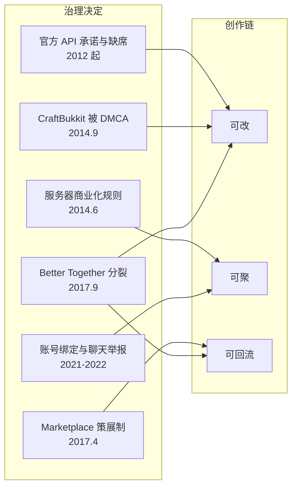

# 商业与治理：链条为何断裂

> **第一卷 · 枢纽章**
>
> 本章命题：切断创作链的不是任何一个坏决定，而是十几年里一连串各自合理的决定。它们每一个都能被辩护，累积起来却把"你也可以改它"换成了"你可以买它"。

## 问题

[《本书的命题》](../prelude/thesis)提出了一个假说：Minecraft 的护城河是一条从"玩"到"造"到"传"再到"玩"的闭环，它今天的问题是这条链被逐节切断。

那就必须回答一个尖锐的反问：**证据在哪？**这个游戏的销量、月活、周边收入和票房都比 2014 年更高。任何以"衰落"为前提的论述，第一句话就会被数据打掉。

所以这一章不谈体感，只谈可查的决定。我要证明的是一件比"衰落"更具体的事：**在这十几年里，创作链的六节中有四节被治理层面的决定实质性地改写了；而做出这些改写的人，几乎每一次都有充分的理由。**

这也是全书唯一一处我需要格外克制的地方。把它写成一份控诉很容易，也很没意思。真正值得写下来的是另一件事——一家公司如何在每一步都做出可辩护的选择，最后仍然弄坏了自己最宝贵的东西。

## Minecraft 怎么做的

先把事实排出来。下面每一条都有出处，列在本章末尾。

### 2012 年 2 月：买下 Bukkit，承诺官方 API

Mojang 从 Curse 手里买下了 Bukkit 项目，并雇下了它的团队。公开目标非常明确：做一个官方的 Minecraft API，同时覆盖服务端和客户端的修改，让 mod 开发不必再依赖脆弱的非官方方案。

这个承诺此后被反复提及，从未在 Java 版上交付。2013 年，Mojang 开发者 Nathan "Dinnerbone" Adams 在推特上说得很直白：

> 提醒一下：Minecraft 没有官方的 mod 方式，我们也仍然不官方支持 mod。我们还在做 plugin API。

有人请他澄清是"代码还不支持"还是"公司不支持"，他的回答是：

> 不，我们不支持。你可以自由地做，但我们没有任何义务帮你做。

同一时期，Dinnerbone 还描述过一个计划中的官方 mod 分发平台——作者把作品上传到网站，其余的交给官方处理，玩家可以在线和游戏内直接获取。这个平台最终确实出现了，但不是给 Java 版的 mod 作者，而是五年后基岩版上的一个商店。

### 2014 年 6 月：服务器可以赚钱了，但只能这样赚

Mojang 发布《Let's talk server monetisation!》。这篇文章的开头常被误引，值得原样看清楚：

> 在法律上，你不允许从我们的产品上赚钱。到目前为止这条规则只有一个例外——Minecraft 视频。我们即将给出第二个例外——Minecraft 服务器。

也就是说，这不是一次收紧，而是一次授权。在此之前，服务器盈利处于灰色地带；这篇文章第一次明确允许了它。

被允许的是：收取进服费用（对所有人同价）、接受捐赠（不得给捐赠者独享回报，但可以设置全服解锁的捐赠目标）、游戏内广告与赞助、出售不影响玩法的物品。被禁止的是：用真钱出售游戏内货币，以及任何影响玩法、造成竞争优势的售卖。

这两条禁令精准命中了当时绝大多数大型服务器的实际收入来源。Mojang 自己把动机说得很清楚：

> 我们讨厌服主把 Minecraft 的功能限制给那些已经买过我们游戏的玩家。这看起来真的很不厚道。

十余年后，这套规则被合并进统一的《Minecraft Usage Guidelines》，但两条核心判据始终没有被定义："毁坏其他玩家的体验"和"在游戏中获得竞争优势"，两者都没有阈值、没有例子、没有豁免条款。文档同时写明：Mojang 对什么算 mod 有最终解释权，对服务器盈利方式保留评估权，且相关许可可由 Mojang 自行决定撤销。

### 2014 年 9 月 5 日：一份 DMCA 通知

CraftBukkit 的构成是这样的：Bukkit 的 API 部分以 GPLv3 授权开源，而可运行的服务端 jar 里同时打包了 Mojang 反编译得来的专有服务端代码。GPL 明确要求与其链接的代码同样开源。这个矛盾存在了好几年，没有人追究。

2014 年 9 月 5 日，从 2012 年起就是核心贡献者、向项目提交了超过一万五千行代码的 Wesley "Wolvereness" Wolfe，对 CraftBukkit 及其衍生项目（包括 Spigot）提起了 DMCA 下架通知。他的论据不复杂：我的代码是 GPL 的，你们把它和不开源的专有代码打包分发，那么要么把专有部分也开源，要么就是侵犯我的著作权。

他在通知中直接引用了 Mojang 首席运营官 Vu Bui 的书面答复：

> Mojang 未授权将其任何专有 Minecraft 软件（包括其 Minecraft 服务端软件）纳入 Bukkit 项目，或使其受任何 GPL、LGPL 许可，或任何其他开源许可的约束。

有了这句话，事情就没有回旋空间了。CraftBukkit 的下载被撤下，GitHub 锁定了相关仓库。而当时 Bukkit 系服务端的使用量，大约是 Mojang 官方服务端的三倍。

::: details 实现细节 · Spigot 是怎么绕过去的
下架针对的是"分发"这个动作，而不是代码本身。于是 Spigot 把发布物从"编译好的服务端 jar"改成了一个叫 BuildTools 的工具：用户在自己机器上运行它，它去下载 Mojang 官方的服务端 jar、反编译、打补丁、编译，最终产物只存在于用户本地。

没有人再分发含有专有代码的二进制，所以 GPL 的分发条款不再被触发。这个方案至今仍是 Spigot 与 Paper 的安装方式。

它解决了法律问题，也把一个后果固定下来：整个 Java 服务端生态的标准安装流程，从此包含"在你自己的机器上把游戏反编译一遍"这一步。一个官方 API 本可以让这一步根本不存在。
:::

### 2014 年 9 月 15 日：25 亿美元

DMCA 事件十天后，微软宣布以 25 亿美元收购 Mojang。Notch、Carl Manneh、Jakob Porsér 三位创始人同时离开。

Notch 当天发出的公开信里有两句话，构成了这一章后面所有内容的注脚。第一句是他的理由：

> 这不是关于钱的。这是关于我的理智。

第二句是他对这个游戏归属的判断：

> 从某个意义上说，它现在属于微软了。从一个大得多的意义上说，它早就属于你们所有人，而这一点永远不会改变。

而 Mojang CEO Carl Manneh 在官方声明里给出的接续逻辑是：

> Minecraft 玩家把这个游戏变成了超出我们所有预期的东西……随着创始人们去做新项目，我们相信社区的高度创造力会让这个游戏的成功延续到很远的未来。

请记住这句话。**它意味着接手方在第一天就明确认定：社区创造力是这个游戏成功的引擎。**因此本章接下来的评判标准，不是我从外部套上去的，而是他们自己写下的。

### 2017 年 4 月：一个策展的商店

Marketplace 随基岩版 1.1 "Discovery Update" 上线。它的设计选择比它的存在更值得注意——时任 Minecraft Realms 执行制作人 John Thornton 说得毫不含糊：

> 我们挑了九位创作者来首发。这是一个经过策展的商店，它不是开放的。

配套机制包括：付费货币 Minecoins（只能用真钱购买，不能在游戏里挣到）、创作者七成平台三成的分成、以及一个需要以注册企业身份申请、提交作品集、按季度结算并设有最低提现门槛的合作伙伴计划。

七三分成本身是行业里相当体面的比例，比 Roblox 的实际创作者份额高出一大截。问题不在比例，在门槛的形状：Marketplace 是一道门，而不是一段阶梯。

### 2017 年 9 月 20 日：Java 版被加上了后缀

Better Together 更新发布，把口袋版、Windows 10 版、Gear VR 版、Fire TV 版和 Xbox One 上的新版本统一成同一套基于 C++ 的代码库，后来通称基岩版。Switch 在 2018 年 6 月加入，PS4 在 2019 年 12 月加入。

技术上这是一次了不起的工程。但有一个细节在当时被当作命名琐事，今天回头看是这一整章里最有信息量的一件事：**统一之后的基岩版直接叫「Minecraft」，而原本叫这个名字的 Java 版，被改名为「Minecraft: Java Edition」。**

需要加限定词的那一个，不再是默认的那一个。

### 2018 年 12 月：脚本 API 交付了，在另一个版本上

基岩版的脚本 API 进入公开测试，用 JavaScript 编写。Java 版承诺了六年的官方 API 没有兑现，而一个官方支持的扩展接口出现在了另一条产品线上。

这个接口的能力边界和 mod 有本质区别：它能配置游戏，不能改写游戏。基岩版至今没有 Spigot、Paper 那样的服务端插件体系，Add-on 也做不出 Java 版那种量级的整合包。

于是阶梯断成了两截：**用户增长最快的那个版本，恰好是阶梯最矮的那个。**

### 2021 到 2022 年：账号迁移，然后是聊天举报

Java 版账号被要求迁移到微软账号。官方的迁移问答里给了一句承诺：Minecraft: Java Edition 会保持完全不变。

2022 年 7 月 27 日，1.19.1 正式发布，带来了玩家举报系统。玩家可以举报聊天消息，**包括在私人服务器上发生的聊天**；处罚绑定微软账号，封禁期间无法进入任何联机服务器，包括自己的私人服务器，时长从三天到永久。

社区的反弹很猛：#saveminecraft 上了趋势，这个版本被叫作 1.19.84，"No Chat Reports" 模组在 Kotaku 报道时下载量已超过二十万。

不过公平地说，当时流传最广的那种恐慌是错的。这个系统不主动扫描聊天，也没有用机器人巡查，它由举报触发、由人工复核；游戏里那个脏话过滤器是另一个独立功能，不会导致封禁。

真正站得住的反对意见不是隐私，而是**管辖权**。一位服主的说法把它讲清楚了：

> 如果微软想在他们自己提供的 Realms 上执行规则和举报系统，那没问题——但他们不该对我们怎么运营自己的服务器有发言权。

Mojang 社区经理的回应，则给这次冲突加上了一个语气上的注脚：

> 首先，我们知道这套玩家举报系统遭到了反对。我们感谢并重视你们的反馈，但这不意味着反馈总会改变 Mojang Studios 所遵循的设计原则。

这条评论在 Minecraft 的 Reddit 版块被踩超过一千次。

### 2025 年 10 月 29 日：去混淆

然后事情朝着相反的方向动了一次，而且幅度不小。

Mojang 宣布彻底取消 Java 版的代码混淆。从 Mounts of Mayhem 更新之后的第一个快照开始，客户端和服务端 jar 不再混淆，原始的类名、方法名、字段名和变量名全部默认包含在内；版本 json 里不再需要混淆映射表；1.21.11 是第一个去混淆的正式版本。为了给工具链留出适配时间，Mojang 还在过渡期同时提供了未混淆的实验性版本。

官方公告里的这句话，请和 2013 年 Dinnerbone 那句"我们不支持"并排读：

> Mod 是 Java 版的核心——而混淆让 mod 变得更难做。

十二年，从"我们没有义务帮你"到"mod 是 Java 版的核心"。这是本书写作期间发生的最重要的一次转向，我会在本章末尾专门处理它对命题的冲击。

### 2026 年 6 月：一次误封潮

去混淆之后不到一年，管辖权那笔账以最难看的方式被结算了一次。

一小群人发现了举报系统的一个漏洞：用插件在服务器里造一个顶着目标玩家用户名的假玩家，然后用脚本对它发起大量举报，自动化处置流程便会在缺乏人工复核的情况下直接封禁真实账号。这个方法不需要入侵，不需要目标所在服务器的权限，据当事人称对任何账号都有效。

多位知名创作者被波及，部分人丢掉的不只是 Minecraft 权限，而是整个 Xbox 账号。Jens "Jeb" Bergensten 公开确认团队正在调查自动化处置为何失效，Mojang 表示已陆续恢复受影响账号。

这件事的技术细节里藏着本章的全部论点：**攻击之所以可行，正是因为治理权已经从服务器上移到了平台账号。**当一台你自己的服务器上发生的事情能够触发一个全局后果，那么这台服务器就不再是你的辖区，而它的安全性也不再取决于你。

::: info 亲历 · 服主视角的那几年
我初中的时候开过自己的服务器，给它写插件，也写过配套的管理工具。所以这一章里的每一条规则，对我来说都不是新闻稿，而是当年某个晚上必须处理的具体麻烦：某个插件在版本更新后不能用了、某种收费方式忽然变得不能确定是否合规、某个必须自己动手补上的功能。

那几年我学到的东西，后来发现和这一章的论点是同一件事：真正把人留在服务器上的，从来不是我配置的那些内容，而是他们在里面自己动手改出来的东西。而我作为服主能给他们的动手空间有多大，取决于我这一层能拿到多少权限——那一层的宽窄，是别人在很远的地方决定的。

<!-- 可补：服务器的名字与年份、第一个插件解决的具体问题、1.7 到 1.8 迁移时坏掉的插件清单、EULA 规则出来那几天服主圈的具体反应 -->
:::

## 为什么这么做

上面每一条，如果只看后果，都很容易写成指控。所以这一节必须把当时的约束摆出来。这不是为谁开脱，而是因为**如果这些决定都是愚蠢的，那这一章就没有价值了**——真正值得研究的，恰恰是它们都不愚蠢。

**官方 API 为什么难产。** 一个 API 的本质是一份冻结的承诺，而 2012 到 2014 年的 Minecraft 每个月都在改自己的内部结构。要在一个还在剧烈演化的代码库上冻结接口，等于要求团队提前知道游戏三年后长什么样。更麻烦的是，Forge 和 Bukkit 已经通过直接改写字节码提供了近乎无限的能力；任何官方 API 都必然更窄，于是从第一天起就会被拿去和一个不受约束的对手比较。Mojang 后来直接说过：他们做不出比 Forge 更好的东西。这句话经常被当成推卸，但它在技术上是诚实的。

**EULA 那两条禁令是有道理的。** 允许服务器出售玩法优势，等于允许第三方对已经买过游戏的玩家二次收费，而且是按能力差异收费。Mojang 那句"这看起来真的很不厚道"不是公关辞令，它就是这条规则的全部理由。任何一个想保护未成年玩家的公司都会画出类似的线。

**DMCA 不是 Mojang 做的。** 它是生态自身法律结构的一次爆破。但要注意因果方向：这个结构之所以存在——GPL 代码和反编译得来的专有代码打包在一起——恰恰是因为没有官方 API。这一枪是社区自己开的，子弹却是缺席的 API 留下的。

**收购与创始人离开是个人选择。** Notch 说他不想背这个责任。这是他的权利，也是他明确表达过的意愿。任何把这件事讲成背叛的叙述，都得先解释为什么一个人无权退出。

**Marketplace 的策展是被主机平台逼出来的。** 内容要在 Xbox、PlayStation、Switch 上分发，就不可能允许任意的用户代码运行；再叠加一个大量儿童在用的产品所必须承担的内容安全与退款责任，"开放上传"这个选项事实上不存在。策展不是傲慢，是合规。

**基岩版的存在是真实的商业必需。** Java 跑不动主机和手机。不做基岩版，就等于放弃绝大多数买不起游戏 PC 的孩子。而正是这批人构成了后来大部分的用户增长。

**聊天举报同样是合规产物。** 一个未成年用户占比极高的全球产品，在多个司法辖区都面临真实的监管压力。要求平台对其服务上发生的骚扰与仇恨言论负责，是一个正在收紧的普遍趋势，不是微软的发明。

七条决定，七个站得住的理由。这正是这一章想说的事情：**创作链不是被一次决策砸断的，是被七次正确的决策磨断的。**

## 代价与失败模式

现在逐节对照那条链。

**可改：阶梯断成了两截。** 官方 API 缺席，使整个 Java mod 生态建立在反编译与社区维护的映射表之上，每个大版本都要全生态迁移一次；而增长最快的基岩版只提供配置级的 Add-on。结果是那条从"改一张贴图"到"写一个服务端插件"的连续阶梯，在中间断开了：你要么留在能配置但不能改写的那一侧，要么跳到一个需要自己维护工具链的那一侧。中间那几级——原本承接大部分人的那几级——消失了。

**可聚：服主从经营者变成了承租人。** EULA 划定了能怎么收钱，Realms 提供了不用自己搭的选项，Marketplace 提供了不用自己做的选项。每一项单独看都是便利。合起来的效果是，"开一个服"这件事从"折腾出一个自己的世界"变成了"租一间配置好的房间"。而折腾恰恰是通往"可改"那一节的入口。省掉折腾，也就省掉了入口。

**可传：被推广的东西从工具变成了成品。** 一个策展商店的激励结构是卖完成品：地图、皮肤包、材质包。它不奖励工具、库、教程和框架——那些恰恰是让别人能继续往下造的东西。原本承诺给 mod 作者的那个分发平台，最终以商店的形态交付给了内容供应商。它促成了交易，没有促成创作。

**可回流：入口和阶梯错位了。** 新用户主要从基岩版进来，而阶梯的上半段只存在于 Java 版，两者之间还隔着一次付费和一次账号迁移。人还在源源不断地进来，但"进来的人"和"能往上爬的人"从此不在同一个地方。漏斗的口更大了，管子却被接到了别处。

**还有一节账，是关于信任的。** 账号迁移时承诺"Java 版会保持完全不变"，随后这次迁移成为聊天举报的实现基础；举报系统上线时承诺人工复核，2026 年的误封潮显示自动化处置可以在缺乏复核的情况下生效。**信任在创作链里不是软性的东西，它是第三节的必要条件**——一个人愿不愿意在某个平台上投入几百小时去写一个 mod、经营一个服务器，取决于他是否相信这个平台明年还认这套规则。每一次承诺被覆盖，都在把这个判断的期限缩短一点。

## 别人怎么做的

::: tip 另一种可能 · Factorio 把这件事做完了
最有力的反例不是某个大厂，是一支几十人的团队。Factorio 提供官方 mod API（Lua）、官方 mod portal、游戏内的 mod 浏览与一键安装、显式的 API 版本号与迁移说明，以及随版本更新的 API 文档。mod 作者不需要反编译，不需要社区映射表，不需要在每次大版本后重写一遍。

这个对照直接反驳了"太难所以做不到"这个辩解。它当然不能反驳"在一个每月都在变的游戏上更难"——但 Factorio 也在持续更新，也做过大版本重构。真正的区别不在难度，在优先级：Factorio 把 API 当成产品的一部分来排期，Minecraft 长期把它当成一件想做但总排不上的事。

至于其他几条路：Valve 靠官方 SDK 加 Steam Workshop，把 Garry's Mod 这类完全由社区长出来的东西变成了自己的资产；Terraria 的官方团队最终接纳了社区做的 tModLoader，还把它放上了 Steam；Luanti 从第一天就把引擎和游戏内容彻底分开，代价是始终没有一个足够好的默认游戏来吸引人进来；Roblox 把整条创作链平台化到了极致，代价是创作者的实际分成只有大约四分之一。

这些路径的取舍各不相同，但它们至少都承认了同一件事：**扩展接口是产品，不是附属品。**它需要被设计、被排期、被承诺、被兼容。
:::

## 如果我重做

**把扩展接口当作和渲染器同等级别的一等系统来排期，并且对它的兼容性做出可被追责的、带版本号的书面承诺——因为一条创作链上真正稀缺的不是创作者的热情，是他们愿意为之下注的确定性。**

具体怎么做，包括 API 的分层、脚本沙箱的边界、以及一个不把创作者变成供应商的分发机制，写在第四卷[《UGC 契约》](../aether/ugc)。

## 这一章可能错在哪

**去混淆是对我不利的证据，而且很重。** 2025 年那次公告，配上"mod 是 Java 版的核心"这句表述，说明"可改"这一节正在被认真修补。如果这条路继续走下去——比如接着交付稳定的 API 契约和更好的版本迁移工具——那么本章的部分论断会需要改写。我选择把它完整写进来，而不是放在脚注里，因为一个只收集有利证据的论证不值得读。

需要同时说清楚的是它的边界：去混淆降低的是**阅读成本**，它没有提供任何**稳定性承诺**。名字不再是乱码，但下一个大版本依然可以自由地改动内部结构；mod 依然会坏，整合包依然要迁移。它让爬阶梯变得容易了，没有让阶梯变得可靠。这两件事的区别，是第四卷全部论述的起点。

**基岩版的分裂账，我算得偏负面。** 分裂确实削弱了"可改"，但它同时极大地强化了"可回流"——它把几千万台买不起游戏 PC 的手机、平板和主机变成了入口。用创作链的语言说，它加固了第六节又削弱了第三节。这是一次取舍，不是一个错误。我在正文里更强调了后半部分，因为本章的主题是断裂，但一个更平衡的写法应该给前半部分更多篇幅。

**我在算旧账的时候不够对称。** 我拿 2013 年 Dinnerbone 的一条推特和 2025 年的官方公告并排，这在修辞上很有效，在方法上不太干净——那是一位开发者的即时发言，这是一份公司声明，两者的分量不一样。我保留了这个对照，因为它确实标示了立场的转变，但读者应当按其本来的分量来称它。

**2026 年那次误封潮的信源偏弱。** 它主要由社区媒体和创作者视频记录，Mojang 至今没有发布完整的事后说明。Jeb 的公开确认是可靠的，攻击手法的细节则来自当事人自述与转述。我把它写进来是因为它精确地印证了管辖权这个论点，但它的证据等级低于本章其他事实，请据此打折。

::: info 亲历 · 一个我没法自证的偏见
我在这个游戏最好的那几年里正好是个服主。所以当我说"折腾的空间被压缩了"，我说的可能是一件客观发生的事，也可能只是我自己那几年不可复制的运气。

我能给出的只是这一章列出的那些可查的决定。至于它们加起来是否真的构成了我说的那条因果链，你有权自己判断。
:::

## 资料来源

- Mojang，《Let's talk server monetisation!》，2014 年 6 月 — [archive.org 存档](https://web.archive.org/web/20190221061149/https://mojang.com/2014/06/lets-talk-server-monetisation/)
- GitHub DMCA 存档，《2014-09-05-CraftBukkit》 — [github/dmca](https://github.com/github/dmca/blob/master/2014/2014-09-05-CraftBukkit.md)
- Justin Wheeler，《The day open source died: a story about Minecraft, Bukkit, and the GPL》 — [jwheel.org](https://jwheel.org/blog/2020/04/open-source-minecraft-bukkit-gpl/)
- 《The Bukkit Implosion: A History》 — [rdwl.xyz](http://rdwl.xyz/blog/the-bukkit-implosion/)
- Microsoft，《Minecraft to join Microsoft》，2014 年 9 月 15 日 — [news.microsoft.com](https://news.microsoft.com/source/2014/09/15/minecraft-to-join-microsoft/)
- Markus Persson，《I'm leaving Mojang》，2014 年 9 月 15 日 — [BBC 全文转载](https://www.bbc.co.uk/news/technology-29205368)
- Microsoft，《Minecraft fans will soon be able to buy items from the first-ever official marketplace》，2017 年 4 月 10 日 — [news.microsoft.com](https://news.microsoft.com/en-gb/2017/04/10/43566/)
- Mojang，《The Better Together Update is here!》，2017 年 9 月 20 日 — [minecraft.net](https://www.minecraft.net/en-us/article/better-together-update-here)
- Minecraft Wiki，《Better Together Update》 — [minecraft.wiki](https://minecraft.wiki/w/Better_Together_Update)
- Attack of the Fanboy，《Minecraft Developer Explains Mojang's Viewpoint On Mods》（Dinnerbone 推特引述） — [attackofthefanboy.com](https://attackofthefanboy.com/news/minecraft-developer-explains-mojangs-viewpoint-mods/)
- Kotaku，《'Save Minecraft!' Cry Players After Mojang Starts Moderating Private Servers》，2022 年 — [kotaku.com](https://kotaku.com/save-minecraft-private-server-ban-mojang-microsoft-1849345188)
- Vice，《'Minecraft' Players Say '1984' Patch Turns Game Into Totalitarian Dystopia》，2022 年 — [vice.com](https://www.vice.com/en/article/minecraft-players-say-1984-patch-turns-game-into-totalitarian-dystopia/)
- Mojang，《Removing obfuscation in Java Edition》，2025 年 10 月 29 日 — [minecraft.net](https://www.minecraft.net/en-us/article/removing-obfuscation-in-java-edition)
- ADTmag，《Mojang Studios to Remove Code Obfuscation from Minecraft Java Edition》，2025 年 11 月 4 日 — [adtmag.com](https://adtmag.com/articles/2025/11/04/mojang-studios-to-remove-code-obfuscation-from-minecraft-java-edition.aspx)
- NewsMinecraft，2026 年误封潮系列报道 — [报道一](https://newsminecraft.com/minecraft-report-exploit-triggers-creator-ban-wave/)、[报道二](https://newsminecraft.com/mojang-responds-to-2026-minecraft-ban-wave/)

<!-- 待补来源：
     - Mojang 2012 年 2 月收购 Bukkit 的官方公告原文（目前依赖二手转述）
     - 微软账号迁移 FAQ 中「Java Edition will stay exactly the same」的原始页面存档
     - 基岩版脚本 API 2018 年 12 月公开测试的官方公告
     - Mojang 关于「做不出比 Forge 更好的东西」这一表述的原始出处
-->
