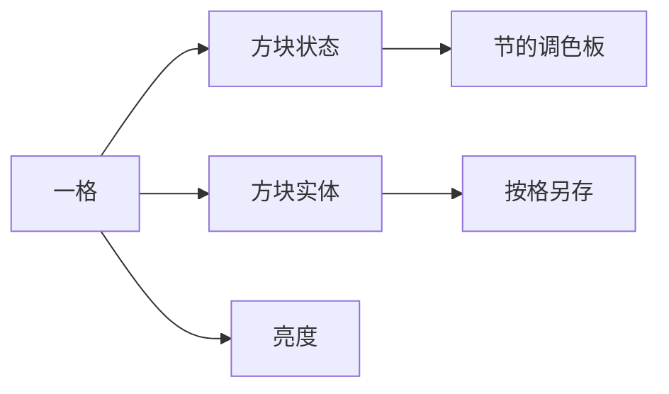

> **本章命题**：空气不是缺席，是一格合法的状态。区块不是画质开关，是无限世界的代价单位。高度能加多少、一格能携带多少法律，先由数据模型批准，再由设计兑现。模型一改，口语里的「建筑限高」和「区块没加载」才会一起改。

## 问题

打开调试，准星对着山洞里的「什么都没有」。Java 仍会写下一个名字：空气，有时是洞穴空气。[^air] 什么都没有，却有身份。对着绿线，家被切成 16 格宽的一刀；漏斗停在边上，史莱姆按另一套格出生，服务器说「那个区块还没加载」。[^chunk] 对着天顶放方块，有时放不上去——不是手滑，是柱子已经走到模型允许的最后一格。

卷二把一米格写成度量衡。[《体素作为设计原语》](/design/voxel-primitive) 格子能指、能挖、能放、能数。本章问的是：格子在机器里是什么。可被证伪的说法是：空气就是空指针，区块只是为了跑得动才切的；玩家真正住的是一张连续的布，裁切不该进口语。只要还存在 F3 把空洞念成方块、只要还存在「区块边界」能让红石和漏斗丢脸、只要建筑限高改一次就有人重新量塔，这句话就不成立。

卷三的命题是：一个能跑的原型，被拖进了不可能的规模。规模的第一笔账，开在格子怎么被存成数据。架构债与设计自由同源——自由是「走下去还有地方」；债是每一格、包括空气，都要付钱。落盘、生成、光照是后文。本章先钉模型。卷四会把稀疏体素和组件再考一次；考试不是开工，本章不代答该换成八叉树。

<Cards>
  <Card title="格子是度量衡" href="/design/voxel-primitive" description="能指、能挖、能放、能数。模型必须保住地址。" />
  <Card title="无限是修辞" href="/design/worldgen" description="种子能念。账单在区块上。" />
  <Card title="两个世界迁不走" href="/history/java-bedrock" description="Anvil 对 LevelDB。格式是产品线。" />
</Cards>

## 玩家看到的方块 vs 内存里的方块

眼睛认的是场面：石头、一扇开着的门、一只装着东西的箱子、一格看起来什么都没有的空气。内存认的不是贴图，是这一格的**法律**。法律至少分成三层，不能合成一项。

| 玩家看见 | 模型里实际是 | 为什么必须分开 |
| --- | --- | --- |
| 「这是石头」 | 一种方块状态：名字加上可数的属性 | 口语要短。机器要能区分朝向、水位、开关 |
| 「门开着」 | 仍是方块状态（开、合、上下扇、铰链） | 开关是物理的一部分，必须能进调色板、能被活塞推 |
| 「箱子里有东西」 | 方块状态只说「这里是箱子」；内容在方块实体里 | 一份库存撑爆 16 种变体。状态装不下，就另开账户 |
| 「什么都没有」 | 空气状态，有时还分洞穴空气、虚空空气 | 空也要参与光照、刷怪、流体。空指针当不了法律 |
| 「这边比较亮」 | 另存的亮度，不是方块的颜色 | 光是格上的数。数必须有格子可住 |

看见的是皮肤。模型里的是地址上的记录。挖掉一格，不是把像素擦掉，是把这个地址上的状态改成空气，并（通常）掉出一个物品。创造模式取消的是稀缺，不是记录。[《创造模式不是关卡编辑器》](/design/creative-mode) 无限的是份数。每一格仍有一份法律。

Java 把这份法律按 F3 念给人听：名字、属性、有时还有方块实体的提示。Bedrock 默认不把同一套词念得这么响，坐标和「这是什么方块」仍在；含水、朝向、箱子内容仍然分家。合写的是合同：一格必须能被寻址。分写的是口音：同一扇门，两边的属性表不必同构。

<Note>
地址、体积、碰撞箱可以不一致。模型认状态；口语认地址；手感认碰撞。三套尺叠在同一格上，正是原语那一章已经钉过的打架。
</Note>

可被证伪的说法是：玩家只关心贴图，状态表是程序员的癖好。只要还存在「门的朝向放反了」「漏斗没对着箱子」「这一格其实是洞穴空气」，癖好就是玩法。玩法寄生在可观察的法律上，不寄生在渲染器上。

## 方块状态、元数据、方块实体

三种词不要混成「方块 ID」。混了，扁平化会听成一次改名，方块实体会听成优化，元数据会听成怀旧彩蛋。它们是三次不同的容量决策。

**元数据是四比特的时代。** Java 在扁平化之前，一格常常是「种类编号 + 四比特附加」。十六种变体是硬上限。羊毛刚好用满十六色。木头要轴、要树种，四比特不够，就拆成更多编号：`log` 之外再来 `log2`。[^meta] 这不是审美。这是容量用尽之后的拆账。拆账能活，口语会变脏：同一类东西，编号不连续，模组要抢剩下的号，数据包难以按名字说话。

**方块状态是扁平化之后的法律。** Java 1.13 把数字编号从正作的口令里拿掉，改成命名空间名字加一组键值：橡木原木可以有轴，门可以有开合，水可以有水位。[^flat] 状态必须可数、可组合、可被节里的调色板收编。收编得进，活塞才能推「这一格的法律」，命令才能说 `oak_door[open=true]`，不必再背「数据值 5 表示什么」。

Bedrock 没有在同一天做同一次「扁平化」仪式。它长期用自己的运行时编号和状态；后来也走向名字加属性，但存档、网络、附加包各走各的表。[《两条产品线：Java 与 Bedrock》](/history/java-bedrock) 删掉句中的 Java 或 Bedrock，状态句子常常不成立。合写的是：一格的法律必须是有限个可点名的变体。分写的是：变体怎么编号、怎么迁移、含水是不是另开一层。

扁平化对第二作者是一次换宪法，不只是换字符串。模组曾经抢数字号；号抢完，工业和魔法在同一份存档里撞车。改成名字之后，冲突从「87 号是谁的」变成「这个命名空间是谁的」。数据包终于能按名字说话。[《命令、数据包与地图》](/design/commands-datapacks) 名字更贵：旧世界、旧模组、旧原理图都要翻译。翻译成功，你得到可扩展的法律。翻译失败，你得到未知方块——遗产章写过的那种语义断裂。[《作为文化遗产的 Minecraft》](/history/heritage) 下一章会把这次改革的账单写成格式。本章只要：状态层一旦从四比特升级成可点名的表，设计才被允许继续加朝向、加含水、加「这扇门的哪一种开法」，而不必再拆 ID。

**方块实体是状态装不下时的另开账户。** 箱子、熔炉、漏斗、告示牌、刷怪笼、命令方块，法律之外还有一份会变的内容：物品、文字、烧炼进度、要生成谁。这份内容不能进调色板——调色板假设同一节里多数格子共享少数几种法律。一千只箱子各装各的东西，共享不了。于是一格变成「这里是箱子」加上「这只箱子的 NBT」。[^be]

另开账户有税。税是：多一份对象，多一次读写，有的还要每刻想一想（漏斗、熔炉）。状态便宜，实体贵。设计上的刀在这里：朝向、开关、水位，能写成状态的，不要写成实体；库存、文本、自定义数据，必须写成实体的，不要假装还能塞进四比特。刀切错，会出现两种病。一种是元数据时代那种「再加一种木头就要新 ID」。一种是「什么都做成方块实体」，世界还没盖完，税先把服务器吃掉。

下一章会写这些账户怎么落成文件。本章只要一句：看见「方块」，至少要问它是状态、是实体，还是两者叠在同一地址上。叠，是正常。混成一个词，迁移和模组都会在错误的层上打架。

## 区块、节、调色板、压缩

无限不是一张无穷大的三维数组。无限是：**按需把世界切成能加载、能保存、能丢掉的柱体**。方法章把这个柱体叫区块：通常是 16×16 的平面，高度随版本长。[《体例与方法》](/prelude/method) 玩家说「卡在区块边界」，程序说「区块已卸载」，说的是同一刀。刀既是体验，也是账单。

**区块是空间单位，也是 I/O 单位。** 视野、模拟距离、领地插件、预生成、区域文件，全都按这 16×16 收税。走远一点，旧柱子卸掉，新柱子生成或从磁盘读回来。修辞上世界没有边；账单上每一根柱子都有价。[《世界生成即内容生产》](/design/worldgen) 把无限写成修辞。本章把修辞收成：你买得起多少根同时亮着的柱子，世界就有多大张。视距加一圈，亮着的柱子按奇数平方涨，不是按心情涨。

区块还是社会单位。Java 给每个区块记「玩家在这里待过多久」，区域难度吃的是这根柱子的居住时间，不是整张地图的心情。[^inhabited] 插件按区块画领地，预生成按区块买明天的探索，Paper 一类服务端用票据决定哪一根柱子值得醒着。玩家口语里的「过来一点，别站在边上」，服主后台里的「这一票还在」，模组里的选区命令，认的是同一把 16。16 不是神秘数字。它是一张能同时服务渲染、模拟、保存和立法的收据。换宽度等于换收据。换收据，无限的价目表要重印。

**节（Java）或子区块（Bedrock）把柱子再切成 16×16×16 的立方。** [^section] 切的理由和切区块一样：整根柱子里，天空和深板岩不会同样稠。一节可以「几乎全是空气」，另一节可以「几乎全是石头」。立方是压缩和光照愿意一次处理的尺寸。再细，索引会碎；再粗，空和实心绑死，洞多的世界付不起。

**调色板是节内部的字典。** 一节有 4096 格。若每格都存一份全世界通用的长名字，空气海会把内存和网线淹死。做法是：这一节实际出现了哪几种状态，列成短表；每格只存表上的序号。整节都是石头，表只有一行，索引数组都可以省。种类一多，序号变长。[^palette]

<Impl title="序号有多长">
设一节里实际出现 $P$ 种状态。每格大约需要 $\lceil\log_2 P\rceil$ 比特去指那张表。Java 写入时，方块状态的索引还有一个常见的下限（四比特），表再大再涨；若表里只有一种状态，整节可以不写索引数组，法律仍是「4096 格都是它」。[^palette] 公式不挡命题：压缩吃的是重复，不是空。空若是一种状态，重复的空气仍然很便宜；空若被删掉，便宜会变成「这一格没有世界」。
</Impl>

**压缩吃的是重复，不是「没有」。** 区域文件、zlib、后来的压缩选项，是下一章的落盘故事。模型上只要记住：一块全是空气的节，仍然是一块合法的节。它可以被写得很短。它不能被写成「此处无格」。无格，光照不知道从哪一格算起，流体不知道往哪一格流，生成器不知道洞还在不在。

Java 把区块写进区域文件。Bedrock 把区块写进 LevelDB。同一把 16×16 的刀，两套柜子。[《两条产品线：Java 与 Bedrock》](/history/java-bedrock) 转换器后来出现，商店页仍把不兼容写成购买说明。模型合同可以合写。柜子不能。柜子是下一章。

<Callout type="warning" title="区块不是画质选项">
把视距听成「画质」，会看丢账单的另一半。卸掉的不只是网格，是法律：红石、漏斗、随机刻、实体。绿线不是调试彩蛋。绿线是代价单位被画出来给玩家看。
</Callout>

<Memoir title="绿线切过厨房">
Java 按 F3+G，绿线从地板竖到天花板。炉子在这边，箱子在那边，漏斗跨过去就不听话。不是红石学错了。是你把一台机器盖在两张账单上。服主说「过来一点，别站在区块边上」，听起来像迷信。迷信的形状，是 16。
</Memoir>

## 稀疏与稠密

体素引擎有一种诱人的干净：只存不是空气的格子。哈希、八叉树、稀疏数组，天空免费，实心才付钱。Minecraft 没有走成「只存实心」。它走的是：**法律稠密，表示可以在节这一级变稀。**

稠密的意思是：每一个合法地址都有一种状态。空气是状态。洞穴空气是状态。虚空空气是 Java 用来标记「这不是你该当成普通空气来住的外面」。[^air] 三种空看起来一样透明。模型不肯把它们收成空指针，因为空指针没有亮度、没有流体邻居、没有「这里能不能放红石粉」。

稀疏的意思是：你可以不把 4096 个长名字写满一节；你可以让整节空气只留一行调色板；某些版本里，完全没东西发生的节可以更短。稀的是字节。不稀的是地址。地址一稀成「没这一格」，挖空就不再是改状态，而是删世界。删世界，刷怪的黑暗、流动的水、坠落的沙，都要另找舞台。另找舞台，等于另做一款游戏。

| 方案 | 空气怎么处理 | 你得到 | 你失去 |
| --- | --- | --- | --- |
| 每格一份完整 ID（最稠） | 空气也占满长字段 | 实现简单 | 空气海先把内存吃完 |
| 节内调色板（原版主路） | 空气是表上的一行，可重复、可压缩 | 空洞仍有法律，重复很便宜 | 一节种类爆炸时，序号变长 |
| 只存非空气（哈希 / 八叉树） | 「没有记录」= 空气 | 天空几乎免费 | 光照、流体、刷怪要为「缺席」另立法；洞多的世界反而变贵 |
| 把空指针当空气 | 未分配即空 | 看起来更省 | 未生成、已挖空、世界外，三种「没有」分不清 |

<Alternative title="若只存非空气">
天空和超平坦的上面会变得很便宜。深板岩洞穴会变得很贵——空洞不再是重复的一行，是大量「缺席」。光照要么每帧问「这一格有没有」，要么为缺席重建一张影子网格。影子网格一旦存在，你其实又把空气请回来了，只是换了个名字。原版把名字叫空气，是为了让缺席和实心走同一套邻居关系。
</Alternative>

所以空气也是数据。不是因为程序员喜欢存零，是因为**挖空必须仍是世界**。世界即库存的另一面：拿走之后，地址还在，法律变成空气，邻居还认这一格。[《体素作为设计原语》](/design/voxel-primitive) 若挖空等于删格，家会在你掏空地下室的时候塌成拓扑事故。塌成事故的沙盒可以很好玩。它不是这套可复述的格子。

Java 与 Bedrock 在空上再次分叉。Java 肯把洞穴空气写成一种能被 F3 念出来的状态；Bedrock 的空更常是同一种空气，含水却常常另开一层存储，让「这一格既是楼梯又是水」不必把调色板胀成每种方块乘以有水没水。分叉证明：空和流体是模型问题，不是贴图问题。两边都拒绝空指针。拒绝的姿势不同。

<Constraint name="空气也是数据" verdict="地基" chain="地址必须有法律 → 空是状态 → 挖空仍是世界">
空指针当不了邻居。没有邻居，光、水、粉、刷怪都要另立法。另立法，格子就不再是那一把尺。
</Constraint>

可被证伪的说法是：把空气从存档里拿掉，只在运行时当缺席处理，光照和洞穴玩起来会一样，世界会更轻。只要还存在「打灯的是空气这一格的亮度」和「水流进的是空气这一格」，缺席就不是空气。轻，可以。轻完之后，洞还是不是洞，要另证。

## 高度上限事件：数据模型如何限制设计

玩家口语里的「建筑限高」，听起来像一条设计军规：塔只能这么高，不然不像 Minecraft。军规下面是柱子有多长。柱子有多长，是节有多少层、区块愿意带多高的空气。

**128。** 早期主世界的柱子很短。塔很快顶到天花板。天花板不是审美上的「天」。它是当时那根 16×16×128 的柱子写满了。Infdev 把水平方向的边拆掉，竖边还在。[《Alpha 的公开开发》](/history/alpha) 无限先发生在走下去，不发生在造上去。

**256。** Java 1.2.1 换成 Anvil，主世界可建造高度加到 256。[^anvil] 旧世界被翻译：原来的地还在，上面多出一大截空气。多出的是数据，不是风景包。玩家得到更高的塔。引擎得到更长的柱子、更多可能全是空气的节。空气再便宜，节的层数仍是账单。这一刀能切，是因为区块已经被切成节——加高等于加节，不等于把整张数组重做。切不了节，加高会像换游戏。

**384。** 洞穴与山崖把主世界再拉长：大约从 Y=-64 到 Y=319，一共 384 格可放。[^height] 卖点是更深的洞、更高的山。[《世界生成即内容生产》](/design/worldgen) 生成当了版本海报。海报能印，是因为数据模型先批准了更长的柱子：再多几节，调色板仍然按节工作，旧存档可以用空气和混合把「下面忽然多出来的世界」接上。批准不是免费。更多空气要参与光照和生成，更多柱子要在视距里同时亮。官方自己写过：鞘翅飞得比区块加载快，高度再加会更糟。[^elytra] 设计想要的垂直戏剧，被加载半径卡住。卡住，不是美术没画完。卡住，是代价单位仍叫区块。

下界和末地没有在同一天领取同一根柱子。Java 里它们仍是另一套高度合同；Bedrock 的下界天花板长期更矮。[^dim] 删掉 Java 或 Bedrock，高度句子会假。主世界的 384 是一次被两边都用来卖「更深更高」的事件。事件暴露的是：限高可改，改的是模型愿意养多高的空气；不是设计师忽然允许你浪漫。

高度还有一层数据包能拧的螺丝。Java 后来把维度的最小 Y 和总高度写成可数据驱动的数，但仍要求对齐到 16 的倍数——对齐的是节，不是灵感。[^dim] 螺丝证明限高是参数。参数仍寄生在节上。拧到引擎付不起，生成和光照会先罢工，海报再漂亮也没有用。

所以数据模型限制设计，不是一句骂实现的话。它是因果：你想要多高的山、多深的洞、多远的视距、多密的红石，先问柱子和节还认不认。认，设计可以改口语。不认，口语会先长出「建筑限高」「区块没加载」「不要盖在边界上」。这些句子不是社区迷信。这些句子是模型泄漏到玩法里的接口。

<Constraint name="区块是无限的代价单位" verdict="地基" chain="16×16 裁切 → 加载/保存/模拟 → 无限可付账">
无限若按格计费，走不远。按区块计费，走得远，但边界会进口语。取消裁切，修辞更干净，规模先死。卷四可以改表示，不能假装代价消失。
</Constraint>

下一章把这些柱子写进文件：区域、NBT、玩家数据和一次格式改革有多贵。世界必须比引擎活得更久——那句话在遗产章里是伦理，在下一章里是格式。本章交的是：活得更久的那一份，首先是带着空气的格子，不是一张没有地址的风景。

## 这一章留下什么

- **爱好者**：山洞里的空不是「没东西」。它是一格仍会算光、仍会进水、仍会让怪物考虑要不要站出来的空气。绿线切过厨房，不是游戏小气，是无限按 16×16 收税。塔顶放不上去，也不是审美，是这根柱子的空气已经买到头了。
- **开发者**：能抄走的是三层法律——方块状态装可数变体，方块实体装装不下的内容，空气作为状态让挖空仍是世界；以及按区块收税的无限，节内用调色板吃重复。抄不走的是：二十年口语已经把 16、建筑限高、洞穴空气听成性格；Java 的 Anvil 节和 Bedrock 的 LevelDB 子区块不是同一柜子。你若把空气当空指针、把区块当画质，会得到更轻的数组，失去可居住的地址。下一章写柜子。柜子比引擎活得久。

[^air]: Java Edition 1.13 加入 `cave_air` 与 `void_air`，属性与普通空气相同：洞穴空气生成在洞穴里；虚空空气用于世界高度之外以及未加载区块。见 [Java Edition 1.13](https://minecraft.wiki/w/Java_Edition_1.13)；空气条目见 [Air](https://minecraft.wiki/w/Air)。

[^chunk]: 区块是 16×16 的柱体，高度随维度与版本变化；主世界在 1.18 之后常被写成 16×384×16。概述见 [Chunk](https://minecraft.wiki/w/Chunk)。Java 可用调试快捷键显示区块边界（F3+G）。

[^inhabited]: 区块 NBT 的 `InhabitedTime` 累计玩家待在该区块的刻数，人越多涨得越快，并参与区域难度。见 [Chunk format](https://minecraft.wiki/w/Chunk_format)；区域难度见 [Regional difficulty](https://minecraft.wiki/w/Regional_difficulty)。

[^meta]: 扁平化前，方块附加数据常用四比特，至多十六种变体；种类与朝向不够用时拆成更多数字 ID。见 [Java Edition pre-flattening data values](https://minecraft.wiki/w/Java_Edition_pre-flattening_data_values)。

[^flat]: Java Edition 1.13（Update Aquatic，2018 年 7 月 18 日）进行「扁平化」：去掉多数数字 ID，改为命名空间标识符与方块状态。见 Mojang，《Update Aquatic is out on Java!》，<https://www.minecraft.net/en-us/article/update-aquatic-out-java>；[Java Edition Flattening](https://minecraft.wiki/w/Java_Edition_Flattening)。

[^be]: 方块实体（旧称 tile entity）为需要额外数据的方块保存 NBT，例如箱子库存、熔炉进度、告示牌文字。见 [Block entity](https://minecraft.wiki/w/Block_entity)。

[^section]: Java 将区块竖切为 16×16×16 的节；Bedrock 对应物是子区块（subchunk），自 Pocket Edition 1.0 起按子区块键存储。见 [Chunk format](https://minecraft.wiki/w/Chunk_format)；Bedrock 侧见 [Bedrock Edition level format](https://minecraft.wiki/w/Bedrock_Edition_level_format)。

[^palette]: 节内用调色板把实际出现的方块状态收成短表，格子存序号；仅一种状态时可省略索引数组。打包规则与四比特下限见 [Chunk format](https://minecraft.wiki/w/Chunk_format) 中 `block_states` 一节。

[^anvil]: Java Edition 1.2.1（2012 年 3 月 1 日）引入 Anvil 格式，可建造高度从 128 增至 256。见 [Java Edition 1.2.1](https://minecraft.wiki/w/Java_Edition_1.2.1)、[Anvil file format](https://minecraft.wiki/w/Anvil_file_format)。

[^height]: Java / Bedrock 1.18（Caves & Cliffs: Part II，2021 年 11 月 30 日）将主世界可建造范围拉到大约 Y=-64 至 Y=319，共 384 格。见 Mojang，《Caves & Cliffs: Part II out today on Java》，<https://www.minecraft.net/en-us/article/caves---cliffs--part-ii-out-today-java>；[Java Edition 1.18](https://minecraft.wiki/w/Java_Edition_1.18)、[Altitude](https://minecraft.wiki/w/Altitude)。

[^elytra]: 官方在洞穴与山崖的实验生成说明里写过：鞘翅加速会让玩家飞得比区块加载快，高度再增加可能更糟。见 <https://www.minecraft.net/en-us/article/new-world-generation-java-available-testing>。

[^dim]: Java 维度类型用 `min_y` 与 `height` 描述可存在方块的竖向范围，且须为 16 的倍数；原版主世界为 -64 / 384，下界与末地为 0 / 256。Bedrock 下界的可建造天花板长期更矮。见 [Dimension type](https://minecraft.wiki/w/Dimension_type)、[Altitude](https://minecraft.wiki/w/Altitude)。
