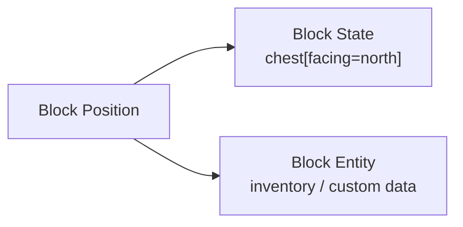
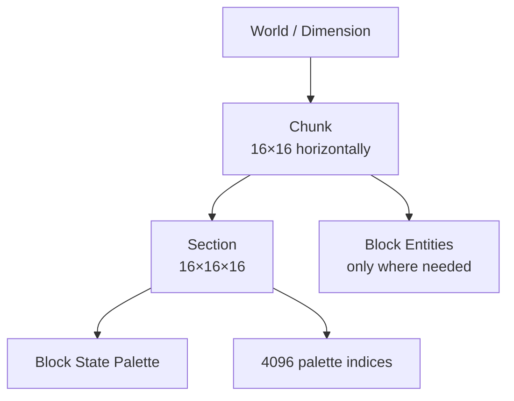
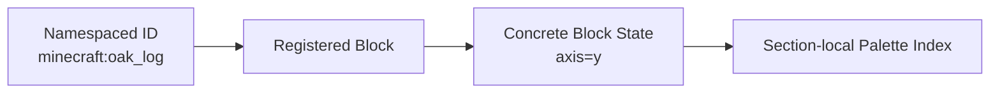

站在 Minecraft 世界里，最自然的理解方式是：这里有一块石头，旁边是一扇门，门后放着一个箱子。

程序却不能只保存“看起来是什么”。

门有朝向、开合、铰链和上下两半；箱子除了“这里是箱子”，还要记住里面放了什么；山洞里看起来什么都没有的位置，也必须能够回答光照、流体和放置规则的问题。再把视野拉远，整个世界又不能真的做成一张从负无穷延伸到正无穷的三维数组。

于是技术卷的第一个问题并不是“Minecraft 用了哪种压缩算法”，而是更基础的：

> **玩家眼里由方块组成的世界，在程序里究竟由哪些数据组成？这些数据为什么要分层？**

这一章先建立数据模型。存档怎样落盘留给下一章，世界怎样生成留给第三章，Chunk 什么时候加载、模拟和卸载则留到后面的[《区块加载、世界流送与性能预算》](/impl/chunk-streaming-performance)。

## 一格方块在程序里是什么

玩家经常用“方块”一个词同时指很多东西，但程序必须把它们拆开。

一块橡木原木和另一块横着放的橡木原木，方块类型相同，状态不同；一个空箱子和装满钻石的箱子，朝向可能完全相同，内部数据却不同。Minecraft 的数据模型首先要回答的，就是**哪些信息属于一个有限的方块状态，哪些信息需要单独保存。**

### Block 与 Block State：类型和当前状态

可以先把一格世界粗略理解成：

```text
坐标 (x, y, z)
    ↓
Block State
    ↓
minecraft:oak_log[axis=y]
```

`minecraft:oak_log` 表示“这是什么类型的方块”，`axis=y` 表示它当前处于哪一种状态。

很多方块都有类似属性：

| 方块 | 可能的 State Property | 它描述什么 |
| --- | --- | --- |
| 原木 | `axis=x/y/z` | 朝哪个轴放置 |
| 楼梯 | `facing`、`half`、`shape`、`waterlogged` | 朝向、上下半层、拐角和含水状态 |
| 门 | `facing`、`open`、`hinge`、`half` 等 | 朝向、开合、铰链与上下部分 |
| 水 | `level` | 当前流体状态 |

这些属性不是渲染器为了选贴图才临时计算出来的。命令、碰撞、红石、流体、放置逻辑等系统都会读取它们。

因此，一个更准确的心智模型是：

> **Block 是类型；Block State 是这个类型所有有限属性的一种具体组合。**

Java Edition 1.13 的 “Flattening” 正是在这一层做过一次很大的历史重构：旧的 block / item data 体系被移除，大量方块和物品重新拆分、命名，方块状态与命名空间标识符成为更明确的数据语言。Mojang 当时甚至直白地说，这次改动会“break everything”，因为它改变的不只是显示名称，而是旧世界、命令、模组和工具理解方块的方式。[^flattening]

### Block Entity：有些数据不适合塞进状态

有限状态适合表示“朝向”“开关”“水位”这种取值范围很小的信息，却不适合保存一只箱子的完整库存。

假设把箱子里的 27 个槽位也编码成 Block State，那么每一种物品组合都可能变成一个新状态，状态数量会迅速失控。Minecraft 因此为一部分方块附加 **Block Entity**，保存不能合理写进普通状态的数据。

例如：

- Chest / Barrel：库存；
- Furnace：烧炼进度、燃料等；
- Sign：文字；
- Command Block：命令与相关数据；
- Spawner：生成逻辑需要的额外配置。

因此“一个箱子”实际上是两层数据叠在同一坐标：


```mermaid
flowchart LR
  Pos["Block Position"] --> State["Block State<br/>chest[facing=north]"]
  Pos --> BE["Block Entity<br/>inventory / custom data"]
```

这也是为什么 **Block Entity 不是另一种 Block State**。前者保存每个实例独有、规模更大的数据；后者适合有限、可枚举的状态组合。当前 Java 的数据格式也仍然把 block state 与 block entity data 作为不同概念处理。[^block-entity-current]

<Callout type="info" title="Block Entity 不是 Entity">
Block Entity 依附在固定方块坐标上；Mob、Item Entity、Minecart、Projectile 等可以独立移动的对象属于真正的 Entity 系统。它们会在后面的《实体、移动与 AI》中单独讨论。
</Callout>

### “空气”是状态，但不等于每格都要写进文件

旧稿很容易从“Air 是一种 Block State”直接跳到“空气也必须逐格保存”，这两个结论其实不是一回事。

从**逻辑模型**看，一个合法的方块坐标需要能够回答“这里是什么”。没有实体方块时，通常得到的是 Air 一类状态，而不是让所有调用方都处理一个不存在的坐标。

但从**物理表示**看，Minecraft 完全可以压缩这种重复。一个 Section 如果只包含一种 Block State，palette 可以只有一个条目，甚至不需要为 4096 个位置保存完整索引；不同版本的 Chunk 格式也允许对空区域进行省略或紧凑表示。[^chunk-format]

所以更准确的说法是：

> **“空气也是状态”描述的是世界的语义；“空气怎么存”是表示与压缩策略。两者不要混为一谈。**

这个区别非常重要。逻辑层希望调用方得到稳定的世界语义，存储层却可以尽可能利用重复、默认值和省略来减少成本。

## 世界不能按单格管理

一格数据解决了“一个坐标是什么”，却没有解决另一个问题：

> 一个理论上可以延伸极远的世界，怎样组织成计算机实际能处理的数据？

如果把整个世界想象成一张一次性分配的三维数组，空间会很快变得不可接受。Minecraft 的基本做法是把水平空间切成 **Chunk**，再把 Chunk 的垂直方向切成更小的 **Section**。

### Chunk：先把世界切成水平区域

Java Edition 中，一个 Chunk 在水平方向覆盖 **16×16 个方块坐标**。它不是“一个 16×16×16 的立方体”；竖直方向会随着维度和版本拥有不同高度，再由多个 Section 组成。

因此位置可以被拆成两层坐标：

```text
世界坐标 (x, y, z)

→ Chunk 坐标 (chunkX, chunkZ)
→ Chunk 内局部坐标 (localX, y, localZ)
```

对于 X / Z：

$$
chunkX = \left\lfloor \frac{x}{16} \right\rfloor,
\qquad
localX = x \bmod 16
$$

Z 同理。实际实现还需要正确处理负坐标，所以通常使用 floor division / floor mod 的语义，而不是简单截断。

这种分区让后续系统拥有一个共同的空间索引：世界生成、保存、客户端传输和运行时加载都可以围绕 Chunk 组织。不过这些系统**并不因此变成同一件事**。

本章只关心 Chunk 作为数据分区。至于“玩家靠近以后 Chunk 为什么加载、离开以后何时卸载、Simulation Distance 怎么决定哪些 Chunk 真正 Tick”，会留到第 11 章。

### Section：Chunk 内再按高度切成 16×16×16

一个 Chunk 仍然可能很高，而且不同高度的数据密度差异极大：天空大部分是空气，地下却可能充满石头、洞穴和矿物。

Java 因此继续把 Chunk 竖直切成 **16×16×16 的 Section**。每个 Section 有：

$$
16^3 = 4096
$$

个方块位置。当前 Java Chunk 格式就在 Section 中保存 block states 的 palette 与索引数据；Biome 数据也按 Section 分组，只是采样粒度不同。[^chunk-format]

这形成了一张非常重要的层级图：


```mermaid
flowchart TB
  W["World / Dimension"]
  C["Chunk<br/>16×16 horizontally"]
  S["Section<br/>16×16×16"]
  P["Block State Palette"]
  D["4096 palette indices"]
  B["Block Entities<br/>only where needed"]

  W --> C
  C --> S
  S --> P
  S --> D
  C --> B
```

Section 不只是“把 Chunk 再切小一点”。它让存储和处理可以利用局部重复：天空里的 Section 与地下矿洞的 Section，不必付出相同的表示成本。

### Palette：不要给 4096 格重复写长名字

假设一个 16×16×16 Section 里只有：

- Air；
- Stone；
- Deepslate；
- Iron Ore。

没有必要给 4096 个格子分别保存 `minecraft:stone` 这样的完整名字。

更自然的做法是先建立局部字典：

```text
Palette
0 → minecraft:air
1 → minecraft:stone
2 → minecraft:deepslate
3 → minecraft:iron_ore
```

然后每格只保存一个 palette index。

如果 Section 中实际出现 $P$ 种 Block State，那么理论上索引至少需要：

$$
b = \lceil \log_2 P \rceil
$$

位。实际 Java 格式还有自己的最小位宽、打包和全局 palette 切换规则，但核心思想不变：

> **世界坐标仍然是规则网格，底层表示却不需要给每一格保存同样昂贵的数据。**

当整个 Section 只有一种 Block State 时，情况甚至更简单：palette 只有一个元素，索引数组可以省略。[^chunk-format]

这也是为什么“规则网格”与“内存中一定存在一个巨大稠密数组”不是同义词。

## 名字、状态与 Registry 怎样对应

讲到这里，还缺一个问题：

> `minecraft:stone` 这样的名字是谁定义的？程序真的每次都拿字符串比较吗？

答案涉及 **Registry**。

### 名字适合持久化，人和工具也能理解

Minecraft 的很多数据使用 namespaced identifier：

```text
minecraft:stone
minecraft:oak_log
minecraft:chest
```

相比早期大量使用固定数字 ID，这种名字更适合：

- 存档和数据文件表达；
- 命令与 Data Pack 引用；
- Mod / namespace 避免命名冲突；
- 人类阅读和调试。

Java 1.13 的 Flattening 正是这段历史的重要分界点。官方 snapshot 明确宣布移除旧的 block data / item data 概念，并拆分、重命名了大量方块与物品，以便未来继续扩展。[^flattening]

### 运行时仍然需要紧凑映射

“有名字”不意味着程序内部每次都靠长字符串工作。

现代游戏通常会在加载时把 Registry 中的对象映射到更适合运行时查找和传输的内部标识。Minecraft 的具体 Registry、runtime ID 与协议细节会随版本和 Edition 变化，因此这里不把某一版内部编号当成永远不变的公共格式。

真正值得记住的是分层：


```mermaid
flowchart LR
  Name["Namespaced ID<br/>minecraft:oak_log"]
  Block["Registered Block"]
  State["Concrete Block State<br/>axis=y"]
  Palette["Section-local Palette Index"]

  Name --> Block
  Block --> State
  State --> Palette
```

也就是说：

- **名字**解决“这个概念叫什么”；
- **Block / Registry** 解决“运行时引用的是哪个类型”；
- **Block State** 解决“它现在处于哪一种有限状态”；
- **Section Palette** 再解决“这一小块世界怎样紧凑地保存大量重复状态”。

这些层级有不同职责，不应该统称为一个“Block ID”。

## 数据模型会反过来限制世界能长成什么样

数据模型听起来很底层，但玩家其实会直接碰到它的边界。

最明显的例子就是世界高度。

### 从 128、256 到 384：高度不是纯粹的设计数字

早期 Java 世界的可建造高度远低于今天；Anvil 时代把高度扩大到 256，Caves & Cliffs: Part II 又把 Overworld 的生成与建造范围扩展到总计 384 个方块。Mojang 在 1.18 发布说明中明确记录了向上和向下各扩展 64 格。[^height]

从玩家视角看，这意味着更高的山、更深的洞和更大的建筑空间。

从数据模型看，则意味着一个 Chunk 需要覆盖更多垂直 Section。

以 Overworld 的 384 格为例：

$$
\frac{384}{16} = 24
$$

也就是跨越 24 个 16 格高的 Section。

这里真正有意思的不是“24 这个数字”，而是模型的**组合方式**：世界不是一根固定长度、永远不能改变的旧数组；Section 提供了可重复的垂直单位，因此高度扩展可以通过改变可用 Section 范围来表达。

当然，1.18 的升级远不只是“多加几层 Section”。Worldgen、旧世界融合、光照、存档迁移和客户端都必须一起适配。官方甚至专门为旧世界提供 World Blending，使已有 Chunk 能与新的高度和地形生成衔接。[^height]

所以更准确的结论是：

> **数据模型不会独自决定设计，但它决定了某种设计变化需要改动多少系统。**

### Chunk 也不是“无限世界”的唯一答案

Minecraft 选择 16×16 Chunk，并不意味着所有体素世界都应该照抄 16。

其他体素引擎完全可以选择不同尺寸、稀疏结构、Octree、Clipmap 或其他空间分区。真正普遍的问题是：

> **怎样把巨大、可修改的空间拆成可以寻址、压缩、保存、生成和流送的有限单元？**

Minecraft 的答案长期围绕 Chunk / Section 建立，因此很多后续系统也逐渐依赖这套边界。改变它的成本就不只在数组本身，还会波及世界格式、Worldgen、网络、渲染、模组和大量玩家工具。

这也是为什么本卷会反复遇到同一个工程现象：

> **一个最初只是实现选择的边界，使用得足够久以后，可能逐渐成为其他系统依赖的接口。**

但是否应该保留、何时值得重构，要到后面的兼容与技术债章节再讨论。本章只需要先认清这些边界在哪里。

## Java 与 Bedrock：概念可以相似，实现不必相同

这一章主要用 Java Edition 建立数据模型，因为公开的 Chunk / Anvil 格式和 1.13 Flattening 历史更容易追踪。

但不要因此把 Java 的具体字段布局当成 Minecraft 的唯一实现。

Java 与 Bedrock 都需要回答类似问题：

- 一格是什么；
- 状态怎样表达；
- 哪些方块需要额外实例数据；
- 世界怎样分区；
- 重复状态怎样压缩；
- 数据怎样在版本之间继续演化。

它们给出的具体答案却可以不同：存档格式不同，Block State 与水等信息的组织方式不同，Runtime ID 与扩展模型也不同。完整比较会留给[《Bedrock：另一套实现》](/impl/bedrock)。

这一点反而很适合作为第一章的收束：

> **我们真正要理解的是数据模型承担的职责，而不是把某一版 Java 的字段表误当成“体素世界唯一正确的结构”。**

## 这一章留下什么

这一章不需要记住每一个 NBT 字段。真正要带走的是一张数据地图：

- **一个世界位置首先对应一个 Block State**：它描述方块类型以及有限、可枚举的状态属性。
- **Block Entity 保存普通状态不适合承载的实例数据**，例如库存、文字和进度；它和可移动 Entity 不是一回事。
- **Air 是逻辑上的 Block State，但逻辑状态不等于逐格物理存储**；底层可以通过默认值、单值 palette 和省略来压缩重复。
- **Chunk 把巨大世界切成有限的水平空间单元，Section 再把垂直方向切成 16×16×16 的局部单元。**
- **Palette 利用局部重复压缩 Block State**：规则网格不意味着必须使用一张巨大稠密数组。
- **Namespaced ID、Registry、Block State 与 Section Palette 处在不同层级**，不能都含糊地叫作“方块 ID”。
- **数据模型不是纯粹的后台实现**：世界高度等设计变化最终都要落到这些结构上，但模型只是约束条件之一，不应该被写成决定一切的单一原因。
- **Java 与 Bedrock 可以共享问题，却采用不同实现**；这一卷关注的是职责和因果，而不是背一份特定版本的内部字段表。

下一章[《存档、序列化与版本迁移》](/impl/storage)会继续追问：这些在内存和逻辑上存在的 Block State、Section、Chunk 和 Block Entity，关掉游戏以后怎样变成文件？一个十年前创建的世界，又为什么还能被今天的客户端继续打开？

[^flattening]: Mojang Studios，Nathan Adams，《Minecraft Snapshot 17w47b》，2017-11-22。该 snapshot 将 1.13 的 “Flattening” 描述为移除旧的 block data / item data 概念，拆分并重命名大量方块和物品，同时强调这会破坏大量既有内容。https://www.minecraft.net/en-us/article/minecraft-snapshot-17w47a

[^chunk-format]: The Minecraft Wiki，《Chunk format》，2026 年访问。当前 Java Chunk 格式按 Section 保存 `block_states` palette 与 packed indices；每个 Section 覆盖 16×16×16 = 4096 个方块位置，单一状态时可省略索引数据。https://theminecraftwiki.com/wiki/chunk-format/

[^block-entity-current]: Mojang Studios，《Minecraft Java Edition 26.3 Snapshot 4》，2026 年。当前数据条件仍明确区分 block state properties 与 block entity NBT / components，说明这两层数据在现代 Java Edition 中仍承担不同职责。https://feedback.minecraft.net/hc/en-us/articles/47424728811149-Minecraft-Java-Edition-26-3-Snapshot-4

[^height]: Mojang Studios，《Minecraft: Java Edition - 1.18》，2021 年。1.18 将世界生成与建造范围向上和向下各扩展 64 格，总范围达到 384；升级旧世界时还需要处理新旧 Chunk 的地形融合。https://feedback.minecraft.net/hc/en-us/articles/4415128577293-Minecraft-Java-Edition-1-18
