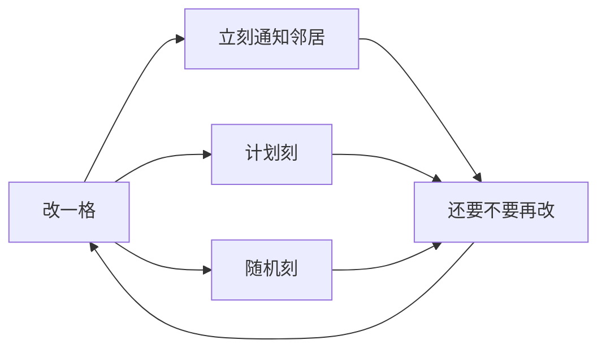

> **本章命题**：卡顿和杜普不是两套系统。它们是同一张隐式更新图的两种漏法：图太大，世界停一刻；边没写清，东西从缝里长出来。

## 问题

关一整面红石灯，游戏顿一下。挖开山洞，有的角落永远黑，放一块再敲掉才亮。两桶水能灌一条河，岩浆却灌不满同一口井。这些场面不是三套特性。它们是同一件事：你改了一格，引擎必须问邻居「你还成不成」。问得广，就是卡。问的顺序和卸载时机对不上，就是漏。[^lag]

上一章（[《世界生成管线》](/impl/worldgen-pipeline)）把柱子从噪声里叫醒，光故意留在梯子末尾——生成期每放一棵树不立刻传光，是为了别把一座山重算一遍。本章从玩家能感到的「亮了 / 流了 / 卡了」进入：叫醒之后，法律怎么在邻居之间走。要回答：卡顿、杜普、连锁更新从哪来？可被证伪的说法是：卡只是电脑慢，杜普只是外挂，光和水是皮肤。只要还存在关灯让整座城排队、只要还存在官方一次次修补「物品从更新顺序里冒出来」，这句话就不成立。

卡顿有时被听成「电脑不行」。杜普有时被听成「游戏坏了」，有时被听成「高手技巧」。两种听法都把机制收成道德或攻略。本章把它们收回邻居：灯为什么会卡，水为什么会无限，东西为什么会从缝里多出来。能说成机制，才不必去搜步骤。

公式和映射名不挡路。爱好者要能把「光照卡顿」「无限水」说成机制。开发者要能抄走：亮度是格上的整数、流体是格上的状态机、邻居通知是一张没画出来的图。步骤——尤其是那些靠缝吃饭的步骤——本章不写。

<Cards>
  <Card title="十五档是可数的夜" href="/design/constraints" description="合同在枢纽章。传播在这里。" />
  <Card title="空气也要算光" href="/impl/data-model" description="空指针当不了邻居。" />
  <Card title="粉也走这张图" href="/design/redstone" description="红石是同一类连锁。实现后文再拆。" />
</Cards>

## 光照传播与重写史

光不是贴图亮一点。它是格子上的两个整数：天空光、方块光，各从 0 到 15。[^light] 看见的亮度常取二者较大的那个。怪物出不出来、作物长不长，认的是这套整数，不是你屏幕上的伽马。卷二把十五档写成可数的夜（[《约束即深度》](/design/constraints)）。本章写成：这套整数必须会走。

传播的规则一句话能说穷：方块光按出租车距离衰减——每跨一格减一，斜着走就减两次。天空光更霸道——正对天的柱子可以一直是 15，横着、往上才开始减。不透明方块把路截断。玻璃几乎不挡。下界和末地没有这根天柱，那边的夜全靠方块光。水在两边不是同一句话：Java 的水不怎么额外吃方块光，却会让天空光往深处淡；Bedrock 的水每一格再多吃一档。[^water-light] 删掉句中的 Java 或 Bedrock，水下那句常常不成立。合写的是：光住在格上，按邻居传。分写的是：谁吃得多。Java 1.14 还让部分方块带方向不透明：土径挡住往下的光，别的方向仍可走。[^dir] 形状开始插手传播。插手，光就不再是「六面同等的灌」，楼梯和台阶会在图上留下影子。

```java
int step(int from, int opacity) {
  return Math.max(0, from - Math.max(1, opacity)); // 示意：每跨一格必减，不透明拦死
}
```

示意不是引擎。它要说明：一次放火把，不是给附近涂一层颜色，是从光源往外灌。灌到 0 停。敲掉火把，还得再灌一次「黑暗」——把旧的 15 收回去，让邻居重新问还剩多少。收回比放下更贵。玩家感到的「关灯卡一下」，常常是黑暗在整座城里排队。

所以光会成为性能史。旧引擎把亮度和区块绑在一起，计算散落在改方块的各个入口。跨区块的灯、生成出来的火把不亮、走过去才刷新，是同一类病：邻居传播没有一张统一的队列——谁改方块谁就地算光，没有单一入口可以排队。Java 1.14 把光照收成独立结构，计算收到一处，服务端可以拿到主线程外面去做。[^rewrite] 官方快照把一长串光 bug 一起勾掉，不是换皮，是承认「邻居传播」必须有自己的队列。生成管线后来把这一步拆成 `initialize_light` 和 `light`：先认出光源，再填数字。填数字可以晚。晚，是为了生成别被光拖死。

重写不是终点。Phosphor 一类优化模组把光引擎再写一遍，Paper 后来干脆收编了 Starlight 的实现当默认——这说明原版图曾经付不起视距里那一圈柱子。付不起，玩家看见的是黑斑、是「放一块再敲掉」。那不是显卡。那是队列还没走到你站的那一格。

<Impl title="天空光为什么夜里仍是 15">
格子上存的天空光不随日落变小。夜里变暗，不是把存档里的 15 改小，而是按时间、天气现算一个折扣，拿这个压过的值去问刷怪、去做渲染。存档里的数白天黑夜可以一样。所以你挖的洞不会因为日落重新灌一遍天空。省下来的，就是那次灌。
</Impl>

<Memoir title="这块永远黑">
走廊尽头少了一格亮。你以为是资源包。放块泥土再敲掉，亮了。不是显卡醒了。是你给那一格补了一次邻居通知，黑暗队列才肯收尾。口令「敲一下就好」能传十年，是因为失败指得着格。
</Memoir>

## 流体：设计与实现耦合

水看起来像流体，法律是方块。源占一格。流动往下能一直走，平地最多横走七格，大约每五刻走一格。[^flow] 桶舀的是源。舀走，邻居重新问「我还是不是源」。问的结果决定这口井是无限还是有限。

无限水不是魔法。它是一条会复制源的规则：流动格若在水平方向挨着至少两个源，并且底下能坐（实心或另一格源），自己就变成源。[^source] 两桶水能灌一条河，是因为你挖掉中间那格，规则立刻再写一格源回来。岩浆在主世界默认不走同一条复制。下界的岩浆海才更像水。刀切在玩法上：水当库存和交通，岩浆当稀缺的热和铸造。不是水文没做完。是设计把「有限 / 无限」写进邻居规则里。

Infdev 曾经把水收成会流干的东西，海里除外。[^finite] 后来的正作把复制规则留在源与源之间。1.13 又加了一层：许多方块可以含水，流动可以写进楼梯里，再在那里变成源。[^logged] Java 把含水收成状态上的属性；Bedrock 更常让水另住一层。上一章的柜子已经分过家。本章只要：复制发生在邻居关系上。邻居关系两边不必同构，无限水的口语却两边都能说——说的是「两格源能养第三格」，不是同一份 schema。

```java
boolean becomesSource(Pos p) {
  return horizontalSources(p) >= 2 && canSitOn(below(p));
}
```

示意。还有别的复制路径（上边一格源、海草把流动收成源），不必列成图鉴。列成图鉴会滑向攻略。机制是：流体每动一格，就给邻居发一张「你再算一次」的票。票是计划刻，不是随机。随机刻管冰化、作物、铜生锈。水要的是可预期的下一步。可预期，电梯才指得着那一格源。不可预期，交通会变成手感。

水碰上岩浆，邻居规则再长出铸造：源对源变黑曜石，流动相遇变圆石，岩浆从上浇到水上变石头。[^cast] 这不是地质学。这是两套状态机在同一条边上撞车。撞车的产物占格，能被挖、被放、被做成传送门框。设计把热写成格，实现就把热写进同一张通知图。

<Alternative title="若水不复制源">
每桶水都是一次性库存。灌渠、造海、救火都按桶计费。你得到更像资源管理的生存。你失去的是：两格源就是一口井，井是交通也是家当。复制规则一旦拿掉，流体还占格，库存合同会变窄。
</Alternative>

设计合同在枢纽章（[《约束即深度》](/design/constraints)）：水不是纳维－斯托克斯。实现合同在这里：复制、流动、含水，都是改一格就通知邻居。通知写进计划刻。计划刻一多，卡顿和「流了半截突然停」是同一张图。

## 三类刻

改一格，引擎至少会问三种时间。

**立刻的邻居通知。** 你放、你挖、活塞推完，相邻的格马上被点名：红石粉该不该灭，沙子该不该掉，观察者该不该眨眼。这不是「等一会儿」。这是同一刻里的图遍历。走得太深，主线程这一刻就超支。沙子掉下来也是这一种：底下那格没了，这一格立刻报名。坠落是邻居通知的产物，不是全局重力场。卷二把坠落写成特例；实现上，特例就是「只有这些状态会在通知里报名」。

**计划刻。** 流体、部分机关、需要「几刻之后再翻面」的方块，给自己在未来某一刻排个号。水大约五刻走一格，是计划，不是掷骰。Java 后来把方块计划刻和流体计划刻分成两条队列，免得水和中继器抢同一条队伍。[^tick] 细节留给游戏循环那一章。本章只要：计划是显式延迟的邻居问题。

**随机刻。** 每一节里抽几格碰运气：作物、树叶、铜、冰、耕土。Java 默认每节每刻抽 3 格，这条速度本身就是一条游戏规则（`randomTickSpeed`）。[^random] 它不负责水往哪流。它负责「世界自己还会长」。玩家把随机刻拧到 0，农田停，树叶不朽，铜不锈——这是把第三种时间关掉。关掉不等于邻居通知停。灯该灭还是会灭。



三种时间可以叠在同一格上。一格含水的楼梯，脚下是计划刻（水还在算下一步），旁边活塞刚推完、欠它一个立刻通知，头顶作物在等随机刻——不是三种系统碰巧放在一起，是三种票塞进同一地址。观察者把「邻居变了」收成红石脉冲，等于给这张隐式图加了一个官方接口。接口合法。把接口当成说明书去清掉未定义边，灯会更老实，机器会变少——那句话已经在红石章里钉过。票一齐兑，图变密。密，就是下一节。

## 连锁更新即图计算

把「改一格」当成节点，把「我变了所以你可能要变」当成边，世界运行时有一张没画出来的图。光灌、水流、粉灭、沙掉、活塞推，都是这张图上的遍历。生成器假装没发生的冲突，有时会变成这张图上的边：半截结构、跨区块的灯、含水的楼梯，第一次被玩家碰到，才把欠着的通知补完。

图是隐式的，所以贵。没有人在编辑器里点「这些格构成一台机器」。引擎只看见：这一格改了，六个邻居，有的再改，再六个。跨过区块边界，灯的队伍会突然变长——旧 bug 名单上，关灯卡顿经常写着 chunk。[^chunk-lag] 视距里柱子一多，图的半径按上一章的奇数平方涨。涨的不是帧率选项。涨的是这一刻要走完的边。

漏也从这里来。遍历若假定「邻居一定在、一定已经是最新状态、一定还没被卸载」，只要有一条假定破了——区块还是原型、活塞推到未加载的边、计划刻在卸载后才到期——因果就会写出一份引擎没准备好的物品或方块。社区把它叫杜普。官方一次次堵缝。堵的是某一条边的顺序，不是图本身。图还在，下一条缝还会长。本章把缝写成机制。不把缝写成步骤。

<Callout type="warning" title="不教那条缝">
能指着「这是更新图的漏口」就够了。能复述的是：卡顿是图太大，杜普是边没闭合。下一格点哪里、哪一刻卸载，留给别的网站。这本书占用的是为什么会有缝，不是怎么用缝。
</Callout>

红石把这张图用成编程（[《红石：把物理做成编程》](/design/redstone)）。粉、中继器、活塞、观察者，是同一类邻居问题的特化：信号也是格上的数，也衰减，也排队。准连接、更新顺序、Java 对 Bedrock，是图的口音，不是另一张图。实现章会把粉和活塞再拆一次。本章不代拆。本章钉的是：红石卡顿和光照卡顿、水流卡顿，账单开在同一类遍历上。

<Constraint name="邻居即账单" verdict="地基" chain="改一格 → 通知邻居 → 队列变长则卡、边未闭合则漏">
显式机器更好测：谁连谁写在文件里。Minecraft 选了隐式图，好让任意一格都能被误用成机器的零件。测得贵，组合才发生在家里的墙上。抄走整数光和复制水，丢掉邻居队列，你会得到更干净的模拟，失去这套能自己长出机关的世界。
</Constraint>

下一章把时间本身收成契约：20 TPS。图要在这一刻里走完。走不完，失去的不是帧率，是因果。三类刻会在那里错位。本章交的是：错位之前，先有一张靠邻居撑起来的图。

## 这一章留下什么

- **爱好者**：关灯卡一下，是黑暗在城里排队，不是显卡赌气。两桶水能灌河，是源会按邻居规则复制，不是水无限。永远黑的角落，常常是通知没走到。有东西从世界上「多出来」，常常是邻居图的边没闭合——不是魔法，也不该当教程。
- **开发者**：能抄走的是三句实现合同——亮度是格上 0–15 的两个整数，用邻居灌和收回；流体是带复制规则的状态机，流动走计划刻，不走随机刻；改一格等于在隐式图上入队。能一起抄走的还有：光必须有独立队列，生成期可以推迟到最后再算。抄不走的是二十年口语已经把「两桶水」「敲一下就亮」听成性格；Java 的含水属性对 Bedrock 的流体层、两边水下衰减、1.14 才收拢的光引擎，不是同一份实现。你若把光做成贴图、把水做成粒子、把更新做成「整块重算」，会得到更好看的演示，失去可数的夜、可指的井，以及那张既长出机关、也长出卡顿与缝的图。因果要写进合同：锁哪一种刻，才许诺哪一种顺序。

[^lag]: 跨区块开关灯造成明显卡顿是长期条目，例如 [MC-1692](https://bugs.mojang.com/browse/MC-1692)（灯跨区块边界过度卡顿）、[MC-11571](https://bugs.mojang.com/browse/MC-11571)（巨大光照更新卡住游戏）。见 [Java Edition 1.14/Development versions](https://minecraft.wiki/w/Java_Edition_1.14/Development_versions) 中 18w43a 勾掉的光 bug 列表。

[^light]: 亮度 0–15；天空光与方块光分存；调试屏 Client Light 为 `max(sky light, block light)`。方块光按出租车距离每米减一。见 [Light](https://minecraft.wiki/w/Light)。

[^water-light]: Java 的水不额外降低方块光，但会让天空光随深度衰减；Bedrock 每一格水再额外降低 1 档光。见 [Water](https://minecraft.wiki/w/Water) 与 [Light](https://minecraft.wiki/w/Light)。

[^rewrite]: Java Edition 1.14 快照 18w43a（2018 年 10 月 24 日）重写光照：存储移出区块、计算收拢、服务端可离开主线程。见 [Java Edition 18w43a](https://minecraft.wiki/w/Java_Edition_18w43a)；[Light](https://minecraft.wiki/w/Light) 历史表。18w46a 起支持方向不透明。

[^dir]: Java 计算光照时会认部分方块的形状（台阶、楼梯、土径、活塞等），光只沿允许的方向传。见 [Light](https://minecraft.wiki/w/Light)。

[^flow]: 水向下可无限蔓延，平地从源横走至多 7 格；蔓延速度为每 5 游戏刻 1 格。见 [Water](https://minecraft.wiki/w/Water)。

[^source]: 流动水若在水平方向邻接至少两个源，且下方为实心或另一格源，则自身变成源。见 [Water](https://minecraft.wiki/w/Water) Source blocks。Java 可用游戏规则 `water_source_conversion` 关闭。岩浆在主世界默认不按同一条规则复制源。

[^finite]: Java Edition Infdev 20100113-2015：水变为有限，海洋仍无限。见 [Water](https://minecraft.wiki/w/Water) 历史表。

[^logged]: Java Edition 1.13（18w16a）起，水可蔓延进可含水方块并在其中形成源。见 [Water](https://minecraft.wiki/w/Water) 历史表；含水作为方块状态见 [Waterlogging](https://minecraft.wiki/w/Waterlogging)。

[^cast]: 水触岩浆源变黑曜石；双方流动相遇变圆石；岩浆从上浇到水上，水变石头。见 [Water](https://minecraft.wiki/w/Water)、[Lava](https://minecraft.wiki/w/Lava)。

[^tick]: 计划刻用于流体与需要可预期延迟的方块；Java 将方块计划刻与流体计划刻分队。见 [Tick](https://minecraft.wiki/w/Tick) Scheduled ticks。

[^random]: Java 每一节每刻按 `randomTickSpeed`（默认 3）抽格做随机刻；1.8（14w17a）加入该游戏规则。见 [Tick](https://minecraft.wiki/w/Tick)。

[^chunk-lag]: [MC-1692](https://bugs.mojang.com/browse/MC-1692) 将跨区块的灯开关卡顿写成可复现条目；1.14 光照重写的动机之一即此类更新。见 [Java Edition 18w43a](https://minecraft.wiki/w/Java_Edition_18w43a)。
