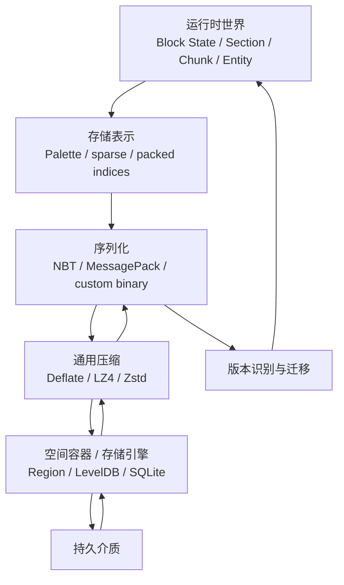
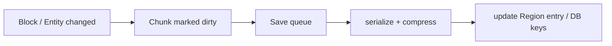
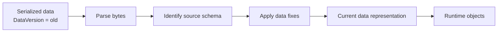

在 Minecraft 里搭完一座房子以后退出游戏，第二天回来，它仍然站在原来的坐标上。这件事看起来理所当然，却意味着程序必须完成一次很长的转换：内存里的 Block State、Section、Chunk、Entity 和玩家数据，要变成硬盘上的字节；下一次启动时，这些字节又要重新变回当前版本能够理解的对象。

如果世界只活几十分钟，最简单的办法也许是把整个对象树一次性写进文件。但 Minecraft 的世界会不断扩大、不断修改，还可能跨越十几年版本。保存系统因此同时面对几个不同的问题：数据怎样编码？一个 Chunk 怎样被快速找到？重复的方块怎样压缩？只改了一小片区域时为什么不必重写整个世界？当旧字段的含义已经改变，新版本又怎样知道自己读到的是什么？

上一章[《体素世界的数据模型》](/impl/data-model)讨论的是“世界在程序里由什么组成”。这一章继续向下追问：

> **一个长期存在的体素世界，怎样从运行时数据变成可以随机读取、增量修改、安全落盘，并在未来版本重新解释的数据？**

理解这个问题，最重要的第一步不是记住 `.mca`、NBT 或 LevelDB 的字段，而是把它们放回各自所在的层。



这几层可以组合，却不能混为一谈。NBT 和 LevelDB 尤其不是同一级的技术；Palette 和 LZ4 也不是同一种“压缩”。

## 内存里的世界怎样变成字节

运行时对象首先要解决的是**怎样表达**。一只箱子在内存里可能是一个带字段、引用和方法的对象，但磁盘并不知道 C++ 指针、Java 引用或某个类当前在堆里的地址。保存时必须把真正需要跨进程保留的状态重新编码。

### Serialization、Schema 与 Storage 是三件事

可以先把最常混在一起的三个词拆开。

**Serialization（序列化）**回答“这份数据怎样编码成字节”。整数是几个字节？字符串怎样表示？嵌套对象怎样开始和结束？NBT、MessagePack、CBOR、BSON、Protocol Buffers 都在这一层提供不同答案。

**Schema（数据模式）**回答“这些字段是什么意思、哪些字段应该存在”。即使一个解析器知道某段 NBT 是一个 Compound，它也不会自动知道 `Pos` 应该有三个坐标、`Items` 是库存，或者旧版数字方块 ID 应该怎样解释。Minecraft 的 Chunk format、Entity format、Item Stack format 才是在序列化格式之上建立的领域结构。

**Storage（存储）**则回答“这些字节放在哪里、怎样找到和更新”。Region File、LevelDB、SQLite 都属于这一层。

因此：

```text
Chunk
  ↓
某一版本的 Chunk Schema
  ↓
NBT / 其他二进制表示
  ↓
压缩后的 bytes
  ↓
Region / Database
```

换掉其中一层，不必把其余层一起推翻。一个 SQLite 数据库里完全可以保存 NBT blob，也可以保存 MessagePack 或自定义 Packed Chunk；同样，NBT 既可以单独成为一个文件，也可以被压缩后塞进 Region File。

### NBT：不是数据库，而是一棵带类型的数据树

NBT（Named Binary Tag）最早就是为 Minecraft 的持久化数据设计的。原始规范把它描述为一种“用较少附加数据承载大量二进制数据”的 tag-based binary format。它提供整数、浮点、字符串、List、Compound，以及 Byte / Int / Long Array 等类型；Compound 可以继续嵌套其他 Tag，于是整个数据自然形成一棵树。[^nbt-spec]

可以把一段 NBT 想成：

```text
Compound
├── DataVersion: Int
├── xPos: Int
├── zPos: Int
├── sections: List
│   ├── Compound
│   └── Compound
└── block_entities: List
    ├── Compound
    └── ...
```

这种格式有几个很实用的性质。字段带名字，工具即使不认识完整业务结构，也可以遍历一棵树；整数有明确宽度；同类型 List 和原始数值数组适合大量游戏数据；新增一个可选字段通常也不要求把整份格式重新设计。

但 **NBT 本身并不是 Minecraft 的 schema**。它只知道“这里有一个叫 `DataVersion` 的 Int”，不知道这个版本号对应哪些游戏规则。它也不是传统意义上的 object graph serializer：NBT 没有对象 identity、共享引用或循环引用，结构本质上仍然是树。更不是世界数据库，因为它没有提供“按 Chunk 坐标查找”“事务提交”“索引”“并发写入”这一类职责。

<Callout type="info" title="不要问“NBT 还是 LevelDB？”">
这两个名字不在同一层。更合理的比较是 **NBT vs MessagePack / BSON / Protobuf**，以及 **Region File vs LevelDB / SQLite / RocksDB**。Bedrock 使用 LevelDB，并不意味着它从此“不用 NBT”。
</Callout>

### 为什么 Minecraft 要自造 NBT

从今天看，很容易反问：为什么不直接使用 BSON、MessagePack 或其他通用标准？

这里不应该反过来编造一个“Notch 做过完整技术选型”的故事。公开资料只能确认 NBT 很早就随着 Minecraft 的存档需求出现，并且它的原始目标非常具体；没有可靠证据表明当时曾系统比较 BSON、MessagePack 等格式后再做取舍。[^nbt-history]

从工程结果看，NBT 的设计恰好贴近当时的问题：实现规模小，类型数量有限，不依赖外部 schema 才能把未知数据树读出来，而且 Java 的 primitive 与数组很容易映射进去。对于一个快速演化中的独立游戏，这种“够用而且自己完全掌握”的格式并不奇怪。

如果今天从零开始做一个新游戏，结论就不同了。MessagePack 已经提供 compact integer、string、binary、array、map 和 extension type，是很成熟的通用二进制序列化格式；BSON 更偏向 document model，类型也更丰富。[^msgpack] [^bson] 对一个不需要兼容 Minecraft 生态的新项目，没有必要为了证明“像 Minecraft”而重新发明 NBT。

不过，换成通用格式也不会自动解决最难的问题。MessagePack 能告诉你“这里是一个 Map”，却仍然不知道旧字段 `block_id: 1` 在新版本该变成什么；BSON 能可靠保存文档，也不会替你设计 Chunk 的 Palette。**序列化库解决的是字节语法，不是游戏数据的长期语义。**

对体素世界尤其如此：大量 Block State 索引通常仍值得使用专门的 Palette 与 bit packing，再把结果作为 binary payload 交给 MessagePack、Protobuf、SQLite 或其他外层。通用格式很适合元数据，不代表 4096 个格子也必须逐项写成 4096 个通用对象。

### Java 的很多文件都使用 NBT，但外层并不相同

Java Edition 中，NBT 长期出现在多种持久化对象里：

- `level.dat` 保存世界级元数据；
- 玩家数据保存位置、库存、状态等；
- Chunk 与 Entity 数据作为 Region File 中的记录；
- 结构模板也使用 NBT 表达可搬运的方块与实体数据。

同样是 NBT，它们的生命周期和容器并不相同。甚至目录结构本身也不是永恒不变的：Java Edition 26.1 把默认维度统一迁入 `dimensions/`，玩家数据也迁入新的 `players/` 子目录。[^java-261] 这正好提醒我们，不应该把某一版本的文件树误认为“Minecraft 持久化的本质”。

真正稳定得多的，是职责：世界需要全局元数据，需要按空间分区的数据，需要玩家数据，也需要某些可单独保存和迁移的数据对象。

## 一个巨大世界怎样被定位和更新

有了序列化格式，还没有解决“世界放在哪里”。

把整个世界序列化成一个连续对象，每次保存都重写一次，在一个不断扩张的体素世界里几乎没有意义。程序需要按空间找到局部数据，并让一小块修改只影响有限的磁盘范围。

### Region / Anvil：给 Chunk 建一个空间目录

Java Edition 很早就已经按 Chunk 保存世界。早期“一 Chunk 一文件”的方式虽然直接，却会产生大量小文件和文件系统元数据开销。Beta 1.3 引入 Region 格式后，一个 Region 把 **32×32 个 Chunk** 聚合进同一个文件；后来 Anvil 改造 Chunk 的内部布局、引入 Section 并使用 `.mca` 后缀，但保留了 Region 作为空间容器的核心思路。[^region]

Region File 的开头是一张小型目录。一个 Region 有 1024 个 Chunk 位置，对应 1024 个 location entries；每个 entry 记录该 Chunk 从哪个 4 KiB sector 开始、占几个 sector。后面再放真正的 Chunk payload。

```text
r.0.0.mca
│
├── location table
│   ├── chunk (0,0)  → sector 8
│   ├── chunk (1,0)  → sector 11
│   └── ...
│
├── timestamp table
│
├── compressed chunk NBT
├── compressed chunk NBT
└── ...
```

因此读取一个 Chunk 不需要从文件头开始扫描：

```text
(chunkX, chunkZ)
      ↓
regionX / regionZ
      ↓
region-local index
      ↓
sector offset
      ↓
read one compressed chunk
```

这就是 **container / index** 的职责。NBT 描述“这个 Chunk 里有什么”，Region 描述“这个 Chunk 的 bytes 在哪里”。

保存时也是一样。如果某个 Chunk 变脏，只需要重新序列化并写回这一条记录。新的压缩结果若不再适合原来的 sector 区域，可以重新分配空间并修改 location entry，而不必重写整个世界。当然，长期增长与移动会留下碎片；Java 后来提供的 `recreateRegionFiles` 就可以重新生成并整理 Region File。[^region-compression]

### Bedrock：LevelDB 是另一条存储路线

Microsoft 的 Creator 文档明确把两版世界格式区分为：Java 使用 Anvil，Bedrock 使用 LevelDB。[^java-bedrock-storage] 但这句话很容易被误读成“NBT 被 LevelDB 取代”。

实际层次不是这样。

Bedrock 世界根目录仍有 `level.dat`，其主体使用 Bedrock 变体的 little-endian NBT；LevelDB 中一些记录，例如 Block Entity、Entity、Pending Tick 等，也会出现 little-endian NBT。与此同时，SubChunk 等高密度数据又使用自己的二进制布局。[^bedrock-format]

Bedrock 更像是：

```text
LevelDB
├── key: chunk coordinate + record type + subchunk index
│   └── value: subchunk binary data
├── key: chunk coordinate + block entity record
│   └── value: little-endian NBT...
├── key: player / map / village / ...
│   └── value: corresponding serialized data
└── ...
```

LevelDB 提供的是一个排序的 key-value 存储引擎：`Put`、`Get`、`Delete`、batch write、日志、SSTable、compaction 等职责由数据库层承担。Bedrock 使用的兼容实现还带有不同于上游 LevelDB 默认配置的压缩适配。[^leveldb-mcpe]

这种路线与 Java Region 最大的区别，不是“一个二进制、一个数据库”这么简单，而是**更新和寻址的抽象单位不同**。Java 的经典模型非常空间化：Region → Chunk blob。LevelDB 则允许世界被拆成更多类型的键值记录，存储引擎自己负责这些键怎样在磁盘文件中组织。

| 层次 | Java Edition | Bedrock Edition |
| --- | --- | --- |
| 世界数据语义 | Chunk / Section / Entity 等 | Chunk / SubChunk / Entity 等 |
| 值的编码 | NBT 为主 | little-endian NBT + 多种内部二进制格式 |
| 空间 / 记录寻址 | Region location table | LevelDB key |
| 底层持久化 | `.mca` 等文件 | log / table 等数据库文件 |
| 增量更新 | 重写对应 Region 记录 | Put / Delete / batch 对应 key |

LevelDB 的选择很适合“世界是大量可独立更新记录”这一问题，但不需要进一步虚构一个单一原因，例如“因为手机一定需要 LevelDB”。跨平台、移动设备和频繁增量写入显然会影响工程取舍；能从公开格式确定的是：**Bedrock 把更多存储管理职责交给了通用 key-value storage engine，而不是继续沿用 Java 的 Region container。**

## Chunk 数据怎样变小

找到 Chunk 以后，另一个问题才是“这些数据怎样少占空间”。

这里至少有三层压缩，顺序非常重要：

```text
利用世界结构减少信息
Palette / default omission / sparse sections
        ↓
把离散值紧凑编码
Packed indices / BitArray
        ↓
对最终字节流做通用压缩
Deflate / LZ4 / Zstd
```

前两层知道“这是一片体素世界”，最后一层只看到 bytes。

### 先利用结构：Palette、默认值和稀疏数据

上一章已经看到，一个 Section 有 4096 个方块位置，却通常只出现很少几种 Block State。如果每格都保存完整的 `minecraft:stone` 或全局状态对象，绝大多数空间都花在重复上。

因此最先应该做的不是 LZ4，而是改变表示：

```text
Palette
0 → minecraft:air
1 → minecraft:stone
2 → minecraft:dirt
3 → minecraft:iron_ore

Indices
1 1 1 1 1 0 0 1 2 1 1 3 ...
```

如果整个 Section 只有一种状态，甚至连 4096 个 index 都没有必要保存；当前 Java Chunk 格式允许单值 palette 省略 `data`。[^chunk-format]

类似的思想还有：

- 默认值不写；
- 完全没有必要的数据结构直接省略；
- 稀疏对象只记录真正存在的位置；
- 不同数据采用不同粒度，而不是所有内容都强迫变成“每格一个对象”。

这种压缩通常比“把一份冗余结构丢给更强的通用 compressor”更重要，因为它直接减少了需要表达的信息。

### Packed BitArray：4096 个索引不需要 4096 个整数

假设一个 Section 里有 $P$ 个不同状态，理论上一个 palette index 至少需要：

$$
b = \lceil \log_2 P \rceil
$$

位。

如果 $P=16$：

$$
b=4
$$

那么 4096 个 index 的理论数据量是：

$$
4096 \times 4\text{ bits}
= 16384\text{ bits}
= 2048\text{ bytes}
$$

相比之下，直接使用 `ushort[4096]` 需要 8192 bytes，`int[4096]` 则需要 16384 bytes。

所以对 16×16×16 Section 来说，**Palette + Packed BitArray 是非常自然的表示**。Java 当前磁盘格式也是同一思路：`block_states.data` 使用 64-bit integer array 存放指向 palette 的紧凑索引；如果 palette 不止一个值，Block State index 至少使用 4 bits。自 1.16 起，单个 index 不再跨越两个 64-bit element，放不下时会从下一个 long 的低位重新开始，因此每个 long 末尾可能留下少量 padding。[^chunk-format]

对一个不跨 long 的通用 packed container，可以这样理解：

```text
bitsPerValue = max(4, ceil(log2(paletteSize)))
valuesPerLong = floor(64 / bitsPerValue)

longIndex = index / valuesPerLong
bitOffset = (index % valuesPerLong) * bitsPerValue
```

读取是移位和 mask，随机访问仍然接近数组语义，不需要从 Section 开头顺序解码。

代价出现在 palette 扩张时。假设当前恰好 16 种状态，需要 4 bits；加入第 17 种以后，需要 5 bits。最直接的方案就是分配一份新的 packed array，把 4096 个 index 重新写一遍。

这听起来很昂贵，但 Section 只有 4096 个位置，而且位宽只在跨过 $2^n$ 边界时改变。自研引擎可以根据 workload 选择：

- 位宽一变就 repack，保持最紧凑；
- 提前留一点位宽余量，减少频繁 repack；
- 局部 palette 大到一定程度后切换为 direct / global ID；
- 运行时干脆使用更宽的数组，只在保存时建立 palette 和 packed indices。

最后一种尤其值得注意。**运行时表示、磁盘表示和网络表示不必完全一样。** 频繁编辑的 voxel storage 可能更看重随机写入；磁盘格式更看重空间与 I/O；网络则还要考虑封包开销和延迟。

### RLE 很适合某些体素，但不是必经步骤

看到：

```text
stone stone stone stone stone stone air air ...
```

很容易想到 Run-Length Encoding：

```text
stone × 600
air × 120
dirt × 37
...
```

对大片连续同值数据，RLE 的确非常有效。问题在于它改变了访问模型。

普通 packed index 可以用位置直接算出 bit offset；RLE 要先找到“这个位置落在哪一段 run”。如果没有额外索引，随机读取可能要扫描多个 run；单格修改还可能把一个 run 拆成三段。世界频繁被玩家挖掘、放置、爆炸和更新以后，run 的数量也可能迅速增加。

更重要的是，Palette 已经先消除了“重复长状态名”的浪费，而 Deflate、LZ4、Zstd 这类通用压缩器又会继续识别最终字节流里的重复模式。于是：

> **Palette + Packed Indices + 通用压缩，通常是更稳健的基线；RLE 更适合作为某类数据的可选 codec，而不是固定塞在 BitArray 前的一道工序。**

如果自己的游戏有大量一次生成后几乎不修改、并且沿存储顺序存在超长连续区域的数据，RLE 当然值得 benchmark。真正应该避免的是仅凭“体素看起来重复很多”就先叠上 RLE、Palette、BitArray 和 Zstd 四层，再发现随机修改成本已经不可接受。

### Deflate、LZ4、Zstd：最后才压字节流

Java Region 长期默认使用 zlib / Deflate。1.20.5 起，专用服务器正式提供 `region-file-compression`，可选择 `deflate`、`lz4` 或 `none`；Mojang 对 LZ4 的说明也很直接：压缩和解压需要更少 CPU，但会占更多磁盘。更改配置不会自动重压旧 Chunk，新写入或更新的数据才使用新算法。[^region-compression]

这个细节非常有价值，因为它说明**压缩算法甚至不必和世界 schema 绑定**。同一个长期世界里可以同时存在不同 compression codec 的 Chunk，只要外层记录知道怎样解码。

如果今天设计新系统，Zstd 也非常值得进入候选。LZ4 的核心优势是极高的解压速度；Zstd 则提供更宽的速度—压缩率调节范围，在较低 level 也能保持很高吞吐。[^lz4] [^zstd] 但这里没有一个脱离 workload 的“最佳算法”。

粗略地说：

| 算法 | 常见优势 | 常见代价 |
| --- | --- | --- |
| Deflate / zlib | 生态成熟、兼容广、压缩率稳定 | CPU 成本相对高 |
| LZ4 | 压缩和尤其解压很快 | 文件通常更大 |
| Zstd | 速度与压缩率可调，低 level 很适合实时场景 | 实现与依赖比传统 zlib 更重 |
| none | 没有压缩 CPU | I/O 与磁盘体积可能反而成为瓶颈 |

真正的答案应该来自**真实 Chunk 样本**：拿玩家已经探索和修改过的世界，分别测压缩率、压缩耗时、解压耗时、随机加载延迟和保存吞吐，而不是只测一块全 Stone 的人工 Section。

还要把网络压缩分开。网络关心带宽、packet size、端到端 latency 和实时 CPU stall；存档关心磁盘占用、随机读、长期保存、写入吞吐和 crash recovery。一个适合归档世界的高压缩 level，不一定适合每 tick 的实时网络包。

## 保存为什么不等于重写整个世界

世界已经被切成 Chunk，存储系统就可以把“哪里变了”继续传递到磁盘。

### Dirty Chunk 与增量保存

玩家打掉一个方块时，最没有必要做的事情就是重新序列化整个世界。更常见的流程是：



Dirty flag 只是起点。实际系统还要决定何时保存、是否把连续多次修改合并、保存线程拿到的是 live object 还是 snapshot、退出游戏时哪些队列必须 flush。这些决定会直接影响卡顿与数据安全，但它们和“用 NBT 还是 MessagePack”仍然是不同问题。

Region File 的增量单位通常是 Chunk record；LevelDB 可以进一步把不同类型、不同 SubChunk 拆成独立 key。粒度越小，单次无关数据重写可能越少，但索引、记录数量和一致性管理也会变复杂。

### 原子性、日志与崩溃恢复

“写入成功”不能只理解为某个 `write()` 返回了。

如果游戏正在更新世界元数据时断电，至少需要知道旧版本和新版本哪一个是完整的。Java 的 `level.dat` 长期采用临时文件与 `level.dat_old` 备份的方式降低替换过程中损坏的风险；当前实现也仍保留这一恢复思路。[^level-dat]

数据库则会把这类职责做得更系统。LevelDB 有 log 与 atomic WriteBatch；SQLite 可以用 rollback journal 或 WAL 保证事务边界。SQLite 的 WAL 模式把新修改先追加到 WAL，commit 通过提交记录完成，随后再 checkpoint 回主数据库；reader 可以在 writer 提交时继续读取旧快照，但同一数据库仍然只有一个 writer。[^sqlite-wal]

这就是为什么“用 SQLite 保存 Chunk”绝不是一个离谱想法。它等于把很多难写的持久化基础设施交给一个已经被反复验证的存储引擎。

不过，**数据库的 crash consistency 不等于游戏语义永远正确**。如果程序自己把错误的 Block State 写进一个完全合法的事务，SQLite 会非常可靠地替你保存这个错误。文件系统层的原子性、数据结构校验、版本迁移和世界备份仍然是不同防线。

### Region 的碎片与数据库的 Write Amplification

没有一种增量存储是免费的。

Region File 中，一个 Chunk 重新压缩后如果变大，可能需要搬到新的 sectors，旧空间留下空洞。长期反复更新会形成 fragmentation，因此 1.20.5 的 `recreateRegionFiles` 既能重写 Chunk，也能生成更紧凑的新 Region。[^region-compression]

LevelDB / RocksDB 这类 LSM-tree 存储把另一个成本藏在 compaction 里：前台看起来只是写入一个 key，后台为了维持有序 table、清理旧版本和控制层级，可能再次重写大量数据。这个现象通常叫 write amplification。

SQLite 则按 page 管理数据库；WAL 带来顺序追加和事务优势，但 WAL 最终仍需要 checkpoint。一个大的 Chunk blob 每次修改后通常会形成一份新的 BLOB 内容，数据库并不会理解“里面只有第 173 个 voxel 改了”。所以**选择存储引擎，并不会替你选择合理的游戏数据更新粒度。**

### 如果自己做体素沙盒，SQLite 完全可以是首选候选

一个非常朴素的世界表就能工作：

```sql
CREATE TABLE chunks (
  dimension    TEXT    NOT NULL,
  x            INTEGER NOT NULL,
  z            INTEGER NOT NULL,
  data_version INTEGER NOT NULL,
  codec        INTEGER NOT NULL,
  payload      BLOB    NOT NULL,
  updated_at   INTEGER NOT NULL,
  PRIMARY KEY (dimension, x, z)
) WITHOUT ROWID;
```

其中 `payload` 完全可以是：

```text
Chunk
↓
Section Palette
↓
Packed indices
↓
versioned binary structure
↓
Zstd
↓
SQLite BLOB
```

SQLite 官方自己就把“application file format”和替代 ad-hoc files 列为典型用途：它提供 transaction、index、跨平台文件格式、增量更新和成熟工具链。[^sqlite-app] 对一个单机或小型联机体素游戏，这些能力非常有吸引力。

SQLite 尤其适合这样的架构：

```text
game / simulation threads
        ↓
immutable save jobs
        ↓
single save writer
        ↓
SQLite transaction
```

因为“同一数据库一次只有一个 writer”在这种设计中未必是缺陷。游戏本来也常需要一个明确的持久化提交顺序。

真正需要警惕的是 workload：

- 如果几十个 worker 都必须同时直接写同一个数据库，单 writer 会成为约束；
- 大 BLOB 高频更新可能增加 page 与 WAL 写放大；
- WAL 需要合理 checkpoint；
- 一个巨型单文件的备份、复制和损坏域与分片 Region 不同；
- SQL 索引只能理解列，不能自动索引压缩 BLOB 内部的 Block State；
- 当世界进入 TB 级、长期高吞吐服务器场景时，运维和数据分片本身可能比“SQLite 理论最大文件有多大”更重要。

SQLite 官方也明确把“device-local、低并发写入”视为强项，并建议在大量并发 writer 或跨网络直接共享数据库时考虑别的方案。[^sqlite-use]

因此更好的问题不是“SQLite 能不能存体素”，而是：

> **你的世界更新是少量大 Chunk blob，还是海量小 key？写入是否能排队？是否需要 SQL 查询？是否愿意维护自定义文件格式？**

不同答案会得到不同选择：

| 方案 | 更像什么 | 适合的条件 |
| --- | --- | --- |
| 自定义 Region File | 空间化 Blob Container | Chunk 是天然 I/O 单元，希望布局可控、实现轻、易按区域分片 |
| SQLite | 事务型本地数据库 | 单机 / 编辑器 / 中小服务器，重视可靠性、工具、索引和 schema 管理 |
| LevelDB / RocksDB | LSM Key-Value Store | 数据天然拆成大量 key、写入频繁，希望存储引擎处理 log / table / compaction |
| LMDB 一类 mmap KV | 本地 B-tree / mmap | 读多写少、追求简单快速读取，并能接受其写入模型 |

这张表没有冠军。Minecraft Java 的 Region 和 Bedrock 的 LevelDB 也不应该被读成“两条道路已经替全行业做完选择”。

如果今天做一个新的独立体素沙盒，**SQLite + versioned Chunk blob + Palette / Packed BitArray + Zstd** 是一套完全值得先做 benchmark 的基线。它不是因为“现代”就一定优于 Region，而是因为在项目早期，它能用成熟事务和工具换掉大量自研持久化风险。等真实 profiling 证明数据库层成为瓶颈，再决定是否值得换成 Region、RocksDB 或更专门的存储。

## 新版本怎样读取旧世界

到这里，一个当前版本的世界已经能够被保存和重新读取。但长期沙盒还有最后一个问题：**读得出 bytes，不等于理解得了旧数据。**

### 格式兼容不等于语义兼容

假设新版本仍然能成功解析：

```text
{id: 1, data: 3}
```

这只能证明二进制 parser 没坏。

如果游戏已经从数字 Block ID 迁移到 namespaced ID + Block State，这两个数字究竟对应哪一种新状态，仍然需要额外规则。1.13 Flattening 就是典型的大规模语义变化；1.20.5 又把 Java Item Stack 的旧 `tag` 体系大幅迁移到结构化 Data Components。[^flattening] [^components]

因此一个长期格式至少要区分三个版本概念：

- **容器 / 存储格式版本**：Region、数据库 key 布局等怎样组织；
- **数据 schema 版本**：字段与对象的语义是什么；
- **compression codec**：这一段 bytes 用什么方式压缩。

它们可以独立演化。Java 1.20.5 更换 Region compression setting 后，不会自动迁移旧 Chunk，正说明“压缩算法变化”和“世界数据语义变化”完全不是一回事。

### DataVersion 给迁移提供起点

当 schema 改变时，读取器首先必须知道：

> 我现在拿到的是哪一代数据？

Java Edition 在多个持久化根对象中记录 `DataVersion`，让读取过程能够选择对应的升级路径。这里的版本号不是装饰，也不是“当前客户端版本”的简单显示值，而是数据解释的一部分。

不过也不要把它神化成“每一个 NBT Compound 都必须自带版本”。一个大对象内部的子树通常继承外层文档的版本上下文。真正需要保证的是：**进入持久化边界的数据，能够可靠确定其源 schema。**

### DataFixerUpper：把版本变化写成数据变换

Mojang 开源的 DataFixerUpper（DFU）就是为 Java Edition 不同版本之间的数据转换建立的工具。它的核心概念包括 `Schema` 与 `DataFix`：Schema 描述系统关心的数据类型及关系，DataFix 描述类型之间的 rewrite rule，构建器再把多个版本的变化组合成转换路径。[^dfu]

可以把读取过程简化成：



这和“能不能解析 NBT”是两个问题。NBT parser 只负责把 bytes 还原成树；DFU 一类系统负责把**旧语义的树变成当前语义的树**。

也不是所有兼容工作都适合塞进 DataFix。世界高度变化以后，旧 Chunk 和新 Worldgen 怎样在边界衔接，还涉及 World Blending 等运行时 / 生成逻辑。一个可靠的迁移系统需要先判断：这是静态数据能一次改完的问题，还是新旧世界相遇时才能决定的问题。

### Lazy Migration 与 Eager Migration

迁移旧世界通常有两条路线。

**Lazy migration** 是按需升级：旧 Chunk 第一次被加载时转换到当前表示，之后保存时写回新格式。它避免启动时扫描整个世界，也让从未再次访问的遥远区域不用支付迁移成本。代价是升级成本会分散到后续游玩中，首次进入老区域时可能出现额外负载。

**Eager migration** 则提前遍历整个世界，一次性转换。Java 的“优化世界”和 dedicated server 的 `forceUpgrade` 属于这种思路；自 24w04a 起，这类优化也覆盖 `entities` 与 `poi` 数据。[^force-upgrade] 好处是之后运行时更统一，代价是迁移可能持续很久，而且一次性触碰大量数据。

很多工程最终会同时提供两者：默认 lazy，重大升级或服务器维护时允许管理员 eager upgrade。

### Backup、Corruption 与不可逆升级

版本迁移最危险的情况，不是“转换慢”，而是**新版本已经写回了旧版本无法理解的数据**。

因此升级流程通常至少需要：

- 升级前完整备份；
- 写入时尽量缩小崩溃影响范围；
- 对关键元数据保留上一份有效版本；
- 能检测结构损坏而不是静默接受；
- 明确 downgrade 是否受支持；
- 对批量迁移提供失败日志与可恢复边界。

Java 的 `level.dat_old` 是局部恢复措施，但它不是整个世界的备份。Region 把世界切成多个空间文件，也意味着单个文件损坏不必天然等于所有维度全部消失；反过来，一个 SQLite 或 LevelDB 世界虽然有更成熟的日志与一致性机制，也仍然需要外部 backup，因为数据库无法替你撤销一次“逻辑正确地提交了错误迁移”的操作。

这也是版本迁移作为本章终点的原因。前面所有层——Palette、NBT、compression、Region、LevelDB、SQLite——都在回答“怎样保存当前世界”；Migration 回答的是更长期的问题：

> **当“当前世界”本身的定义改变以后，过去保存下来的内容还怎样继续成为同一个世界？**

## 这一章留下什么

一个 Minecraft 世界并不是“一个 NBT 文件”，也不是“一个 Region 数据库”。持久化是一组彼此分层的职责：数据模型先利用 Palette、默认值和稀疏性形成适合保存的表示；序列化格式把它变成可解析的字节；通用压缩减少 I/O；Region 或数据库负责定位与增量更新；日志、原子替换和备份负责让写入失败时还有退路；DataVersion 与迁移规则则负责让未来版本继续理解过去。

对爱好者来说，这解释了为什么一个十年前的世界可以在今天继续打开，也解释了为什么某些大版本升级需要“优化世界”、备份甚至漫长转换：游戏读取的不是一张旧截图，而是一整套仍然要继续运行的数据。

对开发者来说，真正能抄走的不是 `NBT + .mca` 这组文件扩展名，而是几条边界：**运行时表示不必等于磁盘表示；Serialization 不等于 Storage；先做结构级压缩，再谈 LZ4 或 Zstd；保存要围绕 dirty unit 增量提交；任何长期世界都要有明确的数据版本与迁移路径。** 不能直接抄走的是 Minecraft 十几年积累下来的具体 Region 布局、Bedrock key space 和 DataFix 表。今天从零开始，SQLite、MessagePack、Zstd 都可能比 2009 年的选择更合适，但它们同样绕不开这些问题。

下一章进入世界生成：当一个 Chunk 在磁盘里根本还不存在时，Seed、Noise、Biome、Feature 与 Structure 又怎样把它第一次变成真正的世界。

[^nbt-spec]: Markus Persson，《Named Binary Tag specification》，Minecraft 早期官方 NBT 规范的存档副本。原规范将 NBT 描述为一种 tag-based binary format，用较少附加信息承载大量二进制数据。见 https://github.com/acfoltzer/nbt/blob/master/NBT-spec.txt

[^nbt-history]: Minecraft Wiki，《NBT format》，2026 年访问。NBT 的历史可追溯到 Indev；原始格式由 Notch 公开过简短规范。见 https://minecraft.fandom.com/wiki/NBT_format

[^msgpack]: MessagePack Project，《MessagePack specification / project documentation》，2026 年访问。MessagePack 提供整数、浮点、字符串、binary、array、map 与 extension types。见 https://msgpack.org/ 与 https://github.com/msgpack/msgpack/blob/master/spec.md

[^bson]: BSON，《BSON Specification Version 1.1》，2026 年访问。BSON 以 document 为基本实体，定义多种二进制字段类型。见 https://bsonspec.org/spec.html

[^java-261]: Mojang Studios，《Minecraft Java Edition 26.1》，2026 年。26.1 重新组织世界存储目录：默认维度迁入 `dimensions/`，玩家数据迁入 `players/` 等。见 https://www.minecraft.net/en-us/article/minecraft-java-edition-26-1

[^region]: Minecraft Wiki，《Region file format》《Anvil file format》，2026 年访问。Region 以 32×32 Chunk 为单位，使用 4 KiB sectors 与 location / timestamp tables；Anvil 延续 Region 容器并改用 `.mca`。见 https://minecraft.fandom.com/wiki/Region_file_format

[^region-compression]: Mojang Studios，《Minecraft Java Edition 1.20.5》，2024-04-23。1.20.5 加入 `region-file-compression` 的 `deflate`、`lz4`、`none` 选项，并提供 `recreateRegionFiles` 以重写、整理和重新压缩 Region Files；修改压缩配置不会自动转换旧 Chunk。见 https://www.minecraft.net/en-us/article/minecraft-java-edition-1-20-5

[^java-bedrock-storage]: Microsoft Learn，《Differences between Minecraft Bedrock Edition and Minecraft Java Edition》，2026 年访问。官方 Creator 文档明确说明 Bedrock 使用 LevelDB 存储世界，Java 使用 Anvil。见 https://learn.microsoft.com/en-us/minecraft/creator/documents/differencesbetweenbedrockandjava

[^bedrock-format]: Minecraft Wiki，《Bedrock Edition level format》，2026 年访问。Bedrock 的 Chunk key 由坐标、维度、记录类型与可选 SubChunk index 构成；BlockEntity、Entity、PendingTicks 等记录使用 little-endian NBT 变体。见 https://minecraft.fandom.com/wiki/Bedrock_Edition_level_format

[^leveldb-mcpe]: Amulet Team，《leveldb-mcpe》，2026 年访问。该项目维护 Bedrock 兼容的 LevelDB fork，并记录 arbitrary byte keys/values、sorted keys、Put/Get/Delete、atomic batch 以及 Bedrock 所需的压缩适配。见 https://github.com/Amulet-Team/leveldb-mcpe

[^chunk-format]: Minecraft Wiki，《Chunk format》，2026 年访问。Java Section 的 `block_states` 由 palette 与 packed 64-bit `data` 数组组成；单值 palette 可省略 `data`，Block State index 最少 4 bits；自 1.16 起 index 不跨 long 边界。见 https://minecraft.fandom.com/wiki/Chunk_format

[^lz4]: Yann Collet 等，《LZ4 README》，2026 年访问。LZ4 的设计重点是高压缩 / 解压吞吐，尤其解压速度很高，并允许用压缩率换速度。见 https://github.com/lz4/lz4/blob/dev/README.md

[^zstd]: Meta，《Zstandard README》，2026 年访问。Zstd 面向实时无损压缩，提供从 fast mode 到高压缩 level 的连续速度—压缩率取舍。见 https://github.com/facebook/zstd/blob/dev/README.md

[^level-dat]: Minecraft Wiki，《Java Edition level format》《存档基础数据存储格式》，2026 年访问。`level.dat` 更新时会通过临时文件替换并保留 `level.dat_old`，损坏时可尝试用旧版本恢复。见 https://minecraft.fandom.com/wiki/Java_Edition_level_format 与 https://zh.minecraft.wiki/w/%E5%AD%98%E6%A1%A3%E5%9F%BA%E7%A1%80%E6%95%B0%E6%8D%AE%E5%AD%98%E5%82%A8%E6%A0%BC%E5%BC%8F

[^sqlite-wal]: SQLite Project，《Write-Ahead Logging》，2026 年访问。WAL 通过追加 commit records 允许 writer 与 reader 并行工作，但同一 WAL 同时只能有一个 writer，并需要周期性 checkpoint。见 https://www.sqlite.org/wal.html

[^sqlite-app]: SQLite Project，《SQLite As An Application File Format》，2026 年访问。SQLite 官方将 atomic transactions、incremental updates、cross-platform、tooling 等列为其作为应用文件格式的优势。见 https://www.sqlite.org/appfileformat.html

[^sqlite-use]: SQLite Project，《Appropriate Uses For SQLite》，2026 年访问。SQLite 定位于 device-local storage；同一数据库一次只有一个 writer，大量并发 writer 或通过网络文件系统直接共享数据库时应考虑其他架构。见 https://www.sqlite.org/whentouse.html

[^flattening]: Mojang Studios，Nathan Adams，《Minecraft Snapshot 17w47b》，2017-11-22。1.13 Flattening 移除旧的 block / item data 体系并重构大量 ID 与 Block State 表示。见 https://www.minecraft.net/en-us/article/minecraft-snapshot-17w47a

[^components]: Mojang Studios，《Minecraft Java Edition 1.20.5》，2024-04-23。1.20.5 将 Item Stack 的许多旧 `tag` 数据迁移到结构化 Data Components。见 https://www.minecraft.net/en-us/article/minecraft-java-edition-1-20-5

[^dfu]: Mojang Studios，《DataFixerUpper》，2026 年访问。官方 README 说明该库用于在不同 Java Edition 版本之间转换游戏数据，并以 `Schema`、`DataFix` 和 `DataFixerBuilder` 组织版本化数据变换。见 https://github.com/Mojang/DataFixerUpper

[^force-upgrade]: Mojang Studios，《Minecraft: Java Edition - Snapshot 24w04a》，2024-01-24。世界优化与 dedicated server `forceUpgrade` 扩展到 `entities`、`poi`，并新增 `recreateRegionFiles`。见 https://feedback.minecraft.net/hc/en-us/articles/23489515647117-Minecraft-Java-Edition-Snapshot-24w04a
