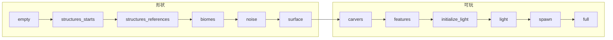

> **本章命题**：种子是输入，不是地图文件。确定性只活在「同一版本、同一产品线、同一套邻居顺序」里。跨出版本、跨过 Java / Bedrock、甚至只是两个人走了不同的路，同一串数字都可以长出另一座山。

## 问题

把种子念给别人听，对方开出来的世界有时像，有时不像。像，是噪声还认这份输入。不像，常常不是你念错了：版本换过、Java 对 Bedrock、数据包开过实验性生成，或者对方先往东走、你先往西走，两棵树抢同一格，后写的赢。[^order]

卷二把合同写成可探索，不是可通关。[《世界生成即内容生产》](/design/worldgen) 公式压到本章。本章不把密度函数写成教材。要回答：同样的种子为何有时会不同？可被证伪的说法是：种子等于地图，算法是纯函数，`(seed, x, z)` 永远吐同一格。只要还存在 1.18 前后两座完全不同的山、只要商店页两边的村庄对不上、只要 Wiki 承认旅行路线能改装饰，这句话就不成立。

上一章把柱子写进文件。[《存储与序列化》](/impl/storage) 柜子装的是已经生成的法律。本章把法律从噪声里叫醒。叫醒有阶段。阶段有邻居。邻居一乱，确定性就露出边界。

<Cards>
  <Card title="可探索不是可通关" href="/design/worldgen" description="合同在卷二。管线在这里。" />
  <Card title="柱子先有地址" href="/impl/data-model" description="16×16 是生成也认的代价单位。" />
  <Card title="两套柜子" href="/history/java-bedrock" description="1.18 地形近似。结构仍分家。" />
</Cards>

## 生成是设计合同的实现

生成器要兑现三件事，不能合成一句「随机地图」。

**噪声**给连续的起伏：哪实心、哪空、哪是水。1.18 之后，主世界用三维密度：某格 `final_density > 0` 放默认石头，否则交给空气或含水层。[^density] 它不讲村庄。它只给走路一块地板。

**群系**在地形还没堆起来之前，就可以先被采样。Java 的步骤里，`biomes` 早于 `noise`：气候参数（大陆性、侵蚀、温度、湿度、奇怪）先涂种类，再决定表面用草还是沙。[^steps] 能说「往南是沙漠」，探索才有口语。

**结构**是稀疏的作者痕迹。特征是局部装饰：树、矿脉、花。Wiki 把能 `/locate` 的叫结构，把树和矿叫特征。特征至多写中心块周围 3×3；结构可以大到以起点为中心约 256 格的立方。[^feat] 大，所以必须先在出生点那一块写下蓝图，再让邻居到装饰阶段时各放自己那一截。点不能密成网。密了，合同从可探索滑向主题乐园。

```java
boolean solid(int x, int y, int z) {
  return finalDensity(x, y, z) > 0; // 示意：密度是形状，不是群系名
}
```

公式藏在数据包的 `noise_router` 里，可以深读，不必挡路。挡路的是另一句：生成必须能被挖、被住、被桶舀。接不住上一章的动词，噪声只是天空盒。

Java 把这三层收成可数据驱动的 JSON：噪声设置、密度函数、表面规则、配置特征、结构集。1.16.2 起数据包能改它们。[^datapack] Bedrock 把近似的职责写进行为包与实验性开关，口径不是同一份 schema。[《命令、数据包与地图》](/design/commands-datapacks) 作者席开在数据层。数据层改得了形状，改不了「失败就当没发生」这条脾气。

<Impl title="密度只要一句">
三维噪声输出一个数。大于 0 实心，否则空，含水层再决定空里是不是水。高度偏见把数往地面挤；放大世界把挤的力度拧松，山变高。洞穴与山崖把「奶酪 / 意大利面 / 面条」三种噪声洞叠进同一套密度，再另用雕刻器挖旧式洞穴。细节在 Wiki 的密度函数页。本章只要：形状是标量场，不是关卡编辑器。
</Impl>

<Figure
  src="/impl/worldgen-pipeline/aquifer.jpg"
  alt="主世界截面：噪声洞穴与含水层叠在同一根柱子里，地表仍是连续的山和海"
  caption="密度先挖空，含水层后补水。雕刻器和村庄还没上场。图见 Minecraft Wiki《World generation》。"
/>

## 管线阶段图

Java 把一块从空变成可玩，排成一条公开写在区块 NBT `Status` 里的梯子。远的柱子可以冻在半截，叫原型区块；玩家走近，再往上爬。爬完变成等级区块，推迟的方块更新一次性倒出来。[^steps]



结构故意排在地形前面——先发蓝图，后堆山。群系在噪声前，是为了让表面规则知道这根柱子该铺什么。雕刻器在表面之后、特征之前，挖的是已经有皮肤的石头。特征把树、矿和结构零件一起叫「装饰」，再分十一小步：从末地小岛、湖泊、紫晶洞，到矿脉、植被、表层结冰。[^deco] 光照故意最后算，而且拆成两步：先认出光源，再填亮度。生成期改方块不立刻传光，免得每放一棵树重算一座山。

```java
enum ChunkStatus {
  EMPTY,
  STRUCTURES_STARTS,      // 只写蓝图
  STRUCTURES_REFERENCES,  // 邻居记下「有人的零件会伸过来」
  BIOMES,
  NOISE, SURFACE, CARVERS,
  FEATURES,               // 放零件 + 树矿花；可写入周围 3×3
  INITIALIZE_LIGHT, LIGHT,
  SPAWN,
  FULL                    // 原型区块转正，倒出推迟的更新
}
```

Java 1.13 把这条梯子重写过一遍。官方快照稿说：先求「能跑」，再求「快」。[^rewrite] 加载世界时那张色块图，是梯子的俯视图：一格像素一块，颜色是状态。1.14 起它取代了「正在准备出生点」的细字。[^colormap] 它不是美化。它是多线程进度条。外圈可以停在噪声，内圈已经 `full`。视距加一圈，要同时推进的柱子按奇数平方涨——上一章的钥匙，在生成期同样收税。

Bedrock 不分这十二个英文枚举，但分趟：先地形，再群系与表面，再特征和结构。微软文档把「洞穴与山崖第二部分」之后的顺序写成：群系会吃高度，地下群系跟洞穴一起考虑。[^be-learn] 合写的是分趟。分写的是趟名和动物：Java 在 `spawn` 步就可能把羊写进新区块；Bedrock 的动物更常走之后的环境生成，不在这一趟里出生。[^spawn]

## 区块生命周期

一块要往上爬，往往先问邻居爬到了哪。结构引用需要周围已经有人写过 starts。特征写入 3×3，本块装饰时，邻居至少得能被写成「这里可以伸进一棵树」。于是调度不是「按坐标从左到右」，是一张依赖图。工人线程可以替主线程爬梯子，主线程少卡在「正在生成地形」。线程是性能。依赖是正确性。正确性优先：邻居没就绪，本块就停在当前 `Status`，冻成原型，写进区域文件也合法——柜子里可以躺着半成品。玩家看见的「世界还没长完」，在磁盘上就是一截没爬到 `full` 的柱子。[^proto]

```java
void tickGeneration(Chunk c) {
  ChunkStatus need = requiredByPlayerDistance(c);
  while (c.status().order() < need.order()) {
    if (!neighborsReady(c, c.status().next())) break; // 冻住，等邻居
    runStep(c, c.status().next());                     // 可在工人线程
  }
  if (c.status() == ChunkStatus.FULL) promoteToLevelChunk(c);
}
```

示意不是调度源码。它要说明：同样的种子，若两台机器让不同的区块先 `FEATURES`，两棵树仍可能抢边。抢边是后文的确定性边界。这里先承认生命周期不是一次性函数，是可暂停的状态机。暂停，是为了远的柱子别把 CPU 吃光。玩家走到哪，哪一圈才配从噪声爬到满。

远看加载色图会画出环：内圈 `full`，往外一圈 `features`，再外停在 `noise`。环不是美术。它是依赖半径的收据——本块要装饰，邻居先得走到能被写成树的那一步。视距拧大一格，环的周长按奇数平方涨，和上一章算过的柱子税是同一笔账。

多人服务器把这张图放大。模拟距离内的柱子必须 `full`，外面可以是原型。预生成插件其实是：强迫一大片地图先把梯子爬完，把旅行顺序从「玩家走过」改成「开机时按网格扫过」。扫的顺序仍是一种旅行。确定性不会因为你换成插件就变成数学恒等。

## 结构与地形的冲突

结构想要一块平地。噪声不保证平地。旧村庄会悬空、埋进山、桥接到悬崖。设计上这不叫失败，叫「假装地形配合过」。零件放下去，底下是空气就空气。玩家把悬空当成风景，把埋进山当成地牢。合同允许错过，也允许尴尬。

1.18 起，密度里出现过「胡须」一类项，让结构周围的石头跟着让一让：该填的填，该挖的挖。[^beard] 让一让，不是把噪声改成关卡编辑器。它是承认：先蓝图后堆山，两套作者会打架，打架要有一条默认的和稀泥。和稀泥仍会漏。矿道可以切进熔岩湖。传送门可以长在树冠里。树可以插进屋顶——特征写入 3×3，检查失败就跳过，跳过等于**假装这次没发生**。

```java
void placeFeature(Feature f, Chunk origin) {
  BlockPos p = f.pick(origin);           // 本块内挑点
  if (!f.canPlace(p)) return;            // 假装没发生
  f.write(p, origin.neighborhood3x3());  // 允许越界，但不许再远
}

void placeStructurePiece(Piece piece, Chunk c) {
  piece.writeIntersection(c);            // 跨界只写本块相交的那一截
}
```

结构集用间距、分隔、频率在网格上掷点；点落在错误群系就整座不放。[^struct] 要塞走同心环，是这条规则的例外。例外证明：大多数名词接受「这颗种子没有」。没有，是可探索。保底，是可通关。生成器默认选前者。

所以冲突不是管线写错。冲突是两套稀疏叠在同一把 16 上：山按密度，村按掷点。掷点不问山是否同意。后来的胡须是道歉。道歉修好的是「山完全不理村」，修不好「村想要的平地噪声没给」。旧存档里的悬空村还在柜子里，走出去才是让过一让的新地形。不要把 1.18 听成冲突消失。冲突从「假装地形配合」变成「地形勉强配合，装饰仍可能抢写」。后写的特征仍能盖住先写的屋顶。

<Alternative title="若生成必须零冲突">
先铺完全图，再在编辑器里摆村，得到主题乐园。每个出生点都公平，每座桥都接得上。你失去「我撞见了」，也失去种子作为口令的轻。Minecraft 把尴尬留给世界，把清单留给进度。清单可以指方向，不该改掷点。
</Alternative>

## 确定性、可复现、实验性生成器

确定性是分层的，不是绝对的。

**同一版本、同一产品线、同一条旅行路线**，噪声和结构蓝图应当能对上。装饰仍可能差一棵树：特征越界写入已装饰的邻居，后完成的区块说了算。这是 Wiki 写明的边界，不是都市传说。[^order]

**换版本**，算法可以换宪法。1.7、1.18 都是地形级的决裂。旧种子变成考古。存档里已生成的柱子还在，走出去是新世界——柜子比引擎久，生成器不必。Bedrock 1.18.0 的测试版还换过一次随机数发生器：同一种子，相邻两个测试版可以是两座山。[^be-rng]

**换产品线**，1.18 把地形和群系往同一套噪声上靠，宣传过种子对等。靠的是山和气候。结构、装饰、旧式雕刻器、生物生成，两边仍可对不上。[^parity] 雕刻器位置不同，已经被当成对等漏洞挂在追踪器上。[^carver] 1.18.30 的更新说明写过：64 位种子可以在两边「产生同一个世界」。[^be-64] Wiki 立刻把「同一个」拆开：山可以近，村不必近。营销句是口令。合同句是分层。Bedrock 的种子曾经是 32 位；这一版才放开完整的 64 位整数，并让非数字口令走和 Java 一样的 `String.hashCode()`。短语种子收成 32 位整数，和你直接键入同一个长整型，本来就不是同一条输入。[^seed]

**换生成器**，才是实验性这一栏真正要钉的。自定义世界、自助餐世界、超级平坦、调试世界，官方早就承认：同一串数字可以喂给另一套宪法。Java 1.16.2 把这张桌子收成数据包目录——噪声设置、密度函数、放置特征、结构集——改 JSON 不必改 jar。[^datapack] 1.18 正式发布前，实验性快照已经让同一颗种子长出新洞穴；有一段甚至把种子有效位拧到 48 位，再拧回 64 位。[^48bit] Bedrock 用实验开关提前打开「洞穴与山崖」一类生成。关了开关，已写下的柱子仍在，走出去才换算法。模组加结构、服务器预生成，是同一类换宪法，不是念错口令。

```java
long decoratorSeed(long worldSeed, int chunkX, int chunkZ, int index, int step) {
  long pop = mix(worldSeed, chunkX * 16, chunkZ * 16); // 装饰常只吃低 48 位
  return mix(pop, index + 10_000 * step);
}
```

示意：每个特征要自己的盐，免得整块装饰共用一个随机流。盐太小会对角线重复。重复是伪随机的齿，不是种子坏了。开发者若把 `Random` 直接绑在世界种子上、不按块、不按步加盐，会得到条纹矿和成排的树。加盐，仍解决不了邻居抢写。

所以「可复现」要先问复现什么。复现山，1.18 之后跨产品线大致能谈。复现村庄，要锁版本、锁产品线、最好锁生成顺序。实验包、模组、预生成插件，每一项都是新的边界。边界不是 bug 名单。边界是这套程序内容的诚实：它承诺可探索，不承诺像素级公证。

<Impl title="数据包改的是宪法">
Java 把 worldgen 收进数据包之后，种子仍只是输入。你换的是密度函数图、表面规则、结构集间距，不是口令本身。Bedrock 的对应物散在行为包的群系、特征与特征规则里，schema 不共用。两边都能让「同一颗种子」长出另一份外面。正作默认宪法仍是那条梯子；实验开关只是允许你提前换。
</Impl>

<Callout type="warning" title="种子不是存档">
把种子当攻略目录，会在第一次大更新后觉得被骗。被骗的是把输入听成了地图。地图在柜子里。输入在加载屏幕上。
</Callout>

<Constraint name="确定性有边界" verdict="地基" chain="种子 → 分趟状态机 → 邻居写入 → 可复现只在锁版本锁路线时成立">
纯函数生成器更好测。Minecraft 选了可暂停的梯子和 3×3 越界。测得贵，世界才铺得开。抄走噪声、丢掉邻居，你会得到更干净的图，失去这套无限。
</Constraint>

<Memoir title="先往东还是先往西">
同一颗种子，两个人直播开荒。一个人的村口多一棵橡树，另一个人的屋顶缺一块。不是种子网站造假。是特征在 3×3 里抢格子，谁先 `FEATURES` 谁先写。口令能复述山。家，仍只存在于走过后的那一份柜子。
</Memoir>

下一章从这些柱子里的黑暗与流水开始：光怎么传，水怎么流，更新怎么连锁。卡顿和杜普从同一张隐式图里长出来。生成器假装没发生的冲突，有时会变成那张图上的边。

## 这一章留下什么

- **爱好者**：种子是邀请，不是公证。换版本、换 Java / Bedrock、甚至只是走了另一条路，山都可以改种。你的家不在加载屏幕的那串数字里，在已经生成并写下的区块里。
- **开发者**：能抄走的是分趟状态机——蓝图先于地形，群系先于表面，装饰写入有限邻居，光照推迟到最后；密度用一个标量决定实心；特征失败就跳过。能一起抄走的还有：工人线程爬梯子、远的柱子冻成原型。抄不走的是二十年口语已经把「这颗种子」听成风景口令；Java 的 `Status` 梯子和 Bedrock 的分趟、1.18 只对等了地形却没对等雕刻器与村庄。你若把生成写成 `(seed,x,z)` 纯函数，会更好测，也会失去这套可暂停的无限。确定性要写进合同：锁哪一层，才许诺复现哪一层。

[^order]: Minecraft Wiki，《World generation》Features / Generation：特征可溢入已经 decorate 过的邻块，规定顺序并不总被遵守；同一种子、同一版本，因玩家走的路线不同，冲突特征谁覆盖谁可以略有差别。见 <https://minecraft.wiki/w/World_generation>。追踪器条目为 [MC-55596](https://bugs.mojang.com/browse/MC-55596)。

[^density]: 1.18 之后主世界用三维密度与 `noise_router`；`final_density > 0` 为实心。见 [Noise router](https://minecraft.wiki/w/Noise_router)、[Density function](https://minecraft.wiki/w/Density_function)；官方说明见 Mojang，《Caves & Cliffs: Part II out today on Java》，2021 年 11 月 30 日，<https://www.minecraft.net/en-us/article/caves---cliffs--part-ii-out-today-java>。

[^steps]: Java 区块生成步骤写在 NBT `Status`：`empty` → `structures_starts` → `structures_references` → `biomes` → `noise` → `surface` → `carvers` → `features` → `initialize_light` → `light` → `spawn` → `full`。未完成称 proto-chunk，完成后转 level chunk。见 [World generation](https://minecraft.wiki/w/World_generation) Steps；[Chunk format](https://minecraft.wiki/w/Chunk_format)。

[^feat]: 特征至多写中心块的 3×3 区块，不能 `/locate`；结构更大、可定位，并可影响周围地形塑形。见 [Custom world generation](https://minecraft.wiki/w/Custom_world_generation)。

[^datapack]: Java Edition 1.16.2（快照 20w28a）加入数据包自定义世界生成。见 [Java Edition 1.16.2](https://minecraft.wiki/w/Java_Edition_1.16.2)、[Custom world generation](https://minecraft.wiki/w/Custom_world_generation)。

[^deco]: 装饰统称 decorations，共十一小步：`raw_generation` 到 `top_layer_modification`。每一步先放结构零件，再放特征；跨界零件只写本块相交的那一截。见 [World generation](https://minecraft.wiki/w/World_generation) Decoration steps。

[^rewrite]: Mojang，《Minecraft Snapshot 18w06a》，2018 年 2 月 9 日：重写世界生成，「先求它能跑，再求它快」。见 <https://www.minecraft.net/en-us/article/minecraft-snapshot-18w06a>。

[^colormap]: Java Edition 1.14 快照 19w02a 在加载画面加入 chunk colormap，每像素一块、颜色对应 `Status`。见 [Loading world screen](https://minecraft.wiki/w/Loading_world_screen)。

[^be-learn]: Microsoft Learn，《World Generation Overview》：生成分多次 pass；洞穴与山崖第二部分之后，群系会吃高度，地下群系与洞穴一起考虑。见 <https://learn.microsoft.com/en-us/minecraft/creator/documents/world-generation>。

[^spawn]: Java 在区块初次生成时就可能写入动物；Bedrock 生成时不刷，靠之后的环境生成。见 [World generation](https://minecraft.wiki/w/World_generation) Mob spawning。

[^proto]: 远区块可冻在较早步骤；玩家靠近再往下走。未完成块称 proto-chunk。见 [World generation](https://minecraft.wiki/w/World_generation) Steps。

[^beard]: 结构可对周围地形做加减（填或挖）。见 [Custom world generation](https://minecraft.wiki/w/Custom_world_generation)；密度函数侧见 [Density function](https://minecraft.wiki/w/Density_function) 中与结构相关的项。

[^struct]: 结构集在网格上按间距、分隔与频率掷点；要塞改走同心环。见 [World generation](https://minecraft.wiki/w/World_generation) Structures；[Structure set](https://minecraft.wiki/w/Structure_set)。

[^be-rng]: Bedrock Edition beta 1.18.0.22 更换世界生成所用随机数发生器，同一种子地形会变。见 [World seed](https://minecraft.wiki/w/World_seed) 历史表。

[^parity]: Minecraft Wiki，《World seed》：1.18 之后 Java / Bedrock 同一种子的地形与群系大体相同，结构、特征、雕刻洞穴与生物生成仍不同。见 <https://minecraft.wiki/w/World_seed>。

[^carver]: Mojira [MCPE-154323](https://bugs.mojang.com/browse/MCPE-154323)：《Parity issue: Carvers do not generate in the same place in Java and Bedrock》（2022 年 4 月 21 日）。噪声洞穴位置接近，传统雕刻器位置不同。

[^be-64]: Bedrock Edition 1.18.30（2022 年 4 月 19 日）支持 64 位种子，非数字输入与 Java 的 `String.hashCode()` 对齐。见 Mojang，《Minecraft 1.18.30 on Bedrock》，<https://www.minecraft.net/en-us/article/minecraft-1-18-30-bedrock>；[Bedrock Edition 1.18.30](https://minecraft.wiki/w/Bedrock_Edition_1.18.30)。

[^seed]: 短语种子经 Java `String.hashCode()` 收成 32 位整数，只能覆盖 $2^{32}$ 份世界；完整空间要键入 64 位整数。见 [World seed](https://minecraft.wiki/w/World_seed) Technical。

[^48bit]: Java 1.18 实验性快照一度把世界生成随机数有效位收到 48 位（[MC-236650](https://bugs.mojang.com/browse/MC-236650)）；21w41a 换回 64 位 RNG，种子被重洗。见 [World seed](https://minecraft.wiki/w/World_seed) 历史表。
