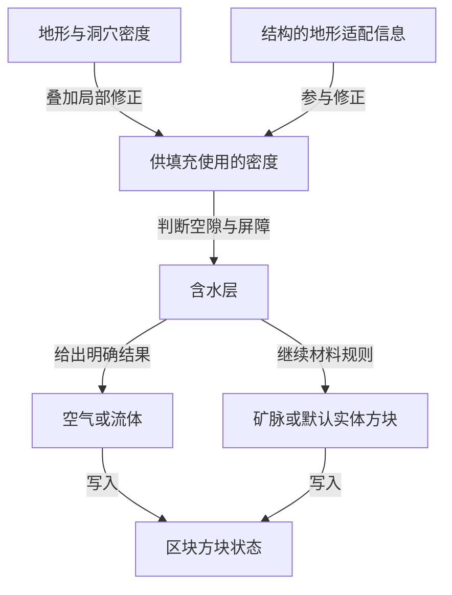
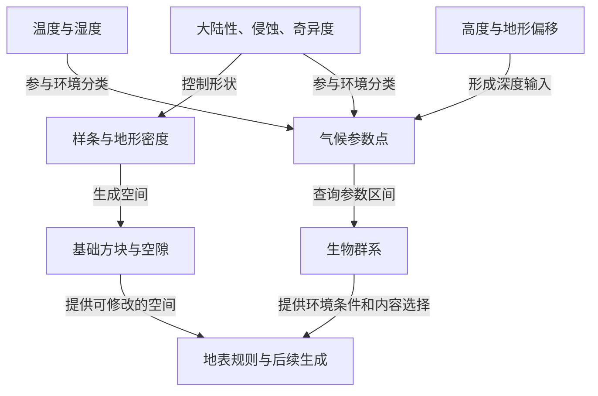
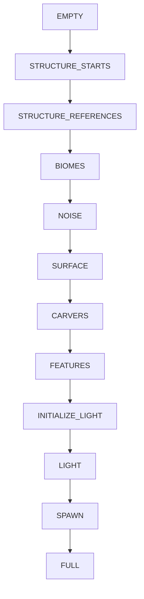
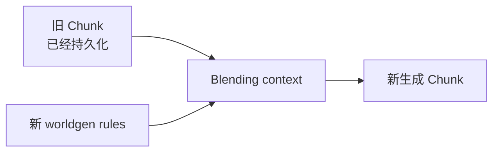

写一个随机起伏的地面并不困难：在水平坐标上采样噪声，把结果当作高度，再填满下方的方块。真正困难的是让海岸、平原和高山有组织地分布，让山体内部出现可探索的洞穴，让地下水与地表环境相容，让矿物、植被和结构落在合理的位置，并且在一个看起来连续的世界里仍然能够只生成当前需要的区块。

上一章[《存档、序列化与版本迁移》](/impl/storage)讨论的是已经存在的世界怎样留下来。本章处理相反的问题：某个坐标范围还没有任何完整方块数据时，程序怎样第一次把它变成世界。

空间上，生成器要从大陆、山脉一直控制到洞穴和方块；工程上，它又必须把一组看似连续、全局的规则，变成可以局部求值、缓存和调度的任务。

> **一个尚不存在的区域，怎样从连续空间规则逐步变成 Block State、Biome、Feature 与 Structure，并且还能按 Chunk 独立执行？**

本文沿着“表达几何 → 塑造地形 → 生成地下空间 → 赋予环境与内容 → 按区块执行”展开。Seed 与伪随机只是确定性的一部分；重点放在不同生成表示为什么存在，以及它们怎样组合成一套可维护的世界生成系统。

<Callout type="info" title="版本与阅读方式">

本文分析 **Minecraft Java Edition 26.2 的普通主世界**，以该版本发行物中的类实现和内置 worldgen 数据为依据，整理于 2026 年 9 月 26 日。26.2 于 2026 年 6 月 16 日发布；这里固定版本讨论，不把结论自动推广到其他版本、下界或末地。[^release]

文中标为“教学模型”的公式用于解释关系；标出配置名或方法名的部分对应原版实现。类名可在该版本游戏 JAR 中定位，worldgen JSON 位于 `data/minecraft/worldgen/`。脚注提供官方发行物入口及具体定位，便于脱离本文重新核对。[^artifact]

</Callout>

## 地形生成器究竟要计算什么？

### 从高度图到三维密度场

高度图把地表写成 $y=h(x,z)$。对于一个水平位置，它只有一个表面高度。这很适合没有悬挑的山坡，却无法独立表达同一位置上的洞底、洞顶和山顶：沿着竖直方向，实体与空隙可能交替出现多次。

把生成问题改写成一个三维函数就容易表达这些结构：

$$
D(x,y,z)\in\mathbb{R}.
$$

我们约定正值表示实体倾向，非正值表示空隙候选。最简单的教学模型是：

$$
D_0(x,y,z)=h(x,z)-y.
$$

它仍然生成普通高度图：低于地面的点为正，高于地面的点为负。这个改写的价值在于，之后可以把三维扰动、洞穴和局部修正加入同一个表达式，而不必为每一种形状更换世界表示。

例如加入三维噪声后：

$$
D_1(x,y,z)=h(x,z)-y+A\,N_3(x,y,z).
$$

当扰动足够强时，同一竖直线上的值可以多次穿过零，形成高度图无法表达的空间。这里的 $A$ 是教学模型中的扰动强度，不是原版某个配置字段。

### 密度的正负表达形状，数值参与组合

“密度”在这里是一种用于生成形状的标量。它不需要等于岩石的物理密度，也不保证等于到地表的距离。

这一区别会影响算法选择：可以用密度值的正负判断实体倾向，却不能直接把它当作具有距离保证的 SDF 来做球面追踪。它的数值大小仍然有用，因为后面的加法、乘法、阈值和插值会改变零值边界的位置。

原版也不能简单总结为“正值一定是石头，负值一定是空气”。`NoiseChunk` 将路由中的最终密度与结构地形修正组合后交给含水层；含水层可能返回空气或流体，也可能让后续规则继续生成实体。矿脉规则和默认方块随后完成材料选择。[^density]



这样分工的好处是：描述形状的函数可以专注于空间关系，材料系统则可以在相同形状上选择不同方块。但两者并非完全单向隔离——含水层的屏障就是材料需求反过来影响实体分布的例子。

### 从连续规则到离散方块

密度场是生成期间的计算表示，方块状态才是这一阶段写入区块的结果。`NoiseBasedChunkGenerator.doFill` 遍历区块中的位置，通过 `NoiseChunk` 获取状态，并写入区块分段，同时更新世界生成用的高度图。[^density]

因此，要区分三种对象：

| 对象 | 表达什么 | 主要用途 |
| --- | --- | --- |
| 密度函数 | 任意坐标上的实体倾向及其变化 | 构造、组合和采样形状 |
| 方块状态 | 某个离散位置最终使用什么方块 | 生成结果与后续世界操作 |
| 高度图 | 按特定条件找到的一列方块高度 | 地表查询和后续放置 |

高度图仍然很有价值，只是它现在也可以从已生成的三维世界中提取。生成器的基础高度查询还能通过采样密度列获得结果，供实际填充前的决策使用。

有了这套表示，下一步就能把问题收窄：**怎样构造一个既有变化、又能控制宏观形态的密度函数？**

## 怎样让随机噪声长成有层次的山川？

### 噪声提供变化：频率、尺度与多层组合

逐点调用随机数会使相邻位置缺少连续关系。空间噪声则让相近位置通常取得相近的值，因而可以把变化组织成连贯的丘陵、区域和通道。

一个解释多尺度变化的教学模型是：

$$
N(\mathbf p)=\sum_{i=0}^{k-1} a_i\,n_i(f_i\mathbf p).
$$

低频分量在较大空间范围内缓慢变化，高频分量补充较小的起伏。频率控制变化的空间尺度，振幅控制每层的影响。多叠几层能增加细节，却没有直接表达“这里应当是大陆内部”“这片区域应当平缓”的能力。

Minecraft 的噪声实现也比这一教学式更具体。`PerlinNoise` 管理多个 octave，`NormalNoise` 组合两组坐标尺度略有差异的 Perlin 噪声，`BlendedNoise` 则用于基础三维地形。理解它们时，应先分清各自服务的信号，再深入随机初始化与归一化细节。[^noise]

宏观控制来自下一层：把某些噪声结果当作**地形参数**，通过明确的映射来使用。

### 地形参数提供控制：大陆性、侵蚀与山脊

普通主世界的地形图中，大陆性、侵蚀以及原始与折叠后的山脊相关信号共同参与塑形。它们可以理解为设计者安排地貌的坐标轴：[^terrain]

| 参数 | 在生成系统中的角色 | 理解时的边界 |
| --- | --- | --- |
| Continentalness，大陆性 | 参与海陆及不同内陆区域的过渡 | 不是测量得到的到海岸距离 |
| Erosion，侵蚀 | 参与平缓、起伏和山地形态的选择 | 这里没有据此运行水力侵蚀过程 |
| Weirdness，奇异度 | 为山脊形态及生物群系变体提供输入 | 是程序化控制量，不是物理量 |
| Peaks and Valleys，峰谷值 | 将 Weirdness 折叠成便于组织峰谷的信号 | 它由 Weirdness 推导，并非独立随机场 |

为什么把参数叫作大陆性或侵蚀，而不直接使用噪声一、噪声二？因为命名能建立稳定的调参意图：开发者可以检查某片区域的大陆性，追踪它如何影响地形映射。参数的空间分布和参数到形状的映射也能分别修改。

原版的峰谷变换可近似写成：

$$
P(W)=-3\left(\left|\,|W|-\frac23\,\right|-\frac13\right).
$$

嵌套绝对值把输入折叠成多个峰谷区间。它把一个已有信号重组为更适合地形规则使用的坐标。源码中的 `ridges` 与 `ridges_folded` 因此需要区分：前者承载原始相关信号，后者是折叠后的峰谷值。[^terrain]

### 样条把参数映射为地形

假设我们希望大陆性从海洋一侧走向内陆时，地形依次经过较低区域、海岸过渡和内陆。但即使大陆性相同，也可能因为侵蚀参数不同而出现平原或高山。一个简单的线性高度映射不容易表达这种条件关系。

Minecraft 使用嵌套样条来组织这些映射。一个控制点的值可以是常数，也可以是另一条读取其他参数的样条。`TerrainProvider` 中的外层大陆性样条就会引用读取侵蚀、山脊等输入的子样条。[^terrain]

可以把它想象成：先根据大陆性确定当前处于哪一组地形规则之间，再让这些规则分别根据侵蚀与峰谷求值，最后在结果间平滑过渡。这里的“先”描述求值关系，并不表示先生成一张完整大陆地图再启动下一轮。

`CubicSpline` 的区间插值使用端点值与导数。用标准三次 Hermite 形式表达其数学结构：

$$
s(t)=(2t^3-3t^2+1)v_0+(t^3-2t^2+t)\Delta x\,m_0
     +(-2t^3+3t^2)v_1+(t^3-t^2)\Delta x\,m_1.
$$

其中 $t$ 是区间内归一化坐标，$v_0,v_1$ 是两个端点的值，$m_0,m_1$ 是端点导数，$\Delta x$ 是区间宽度。控制点既能指定某个参数位置的输出，也能调节过渡的斜率；嵌套样条则让端点输出继续依赖其他环境参数。

这种结构给程序员提供了可以讨论和调节的形状规则。改变一处控制点，可以针对某类参数组合调整地貌；改变噪声频率，则主要改变这些组合在世界中的分布尺度。

### 把控制量组合成基础密度场

原版映射的重要输出是 `offset`、`factor` 和 `jaggedness`。它们最终进入 `overworld/sloped_cheese`；这个名字所指的是洞穴组合前的一项基础地形密度，不能仅凭其中的 `cheese` 就把它理解成洞穴。[^terrain]

忽略缓存包装，并把已经算好的映射输出记为 $O,F,J$，该配置的关系可以写成：

$$
\begin{aligned}
\mathrm{depth}(x,y,z)&=g(y)+O(x,z),\\
D_{\mathrm{base}}(x,y,z)&=4Q\!\left(F(x,z)\left[\mathrm{depth}(x,y,z)+J(x,z)H(N_j(x,z))\right]\right)+N_b(x,y,z).
\end{aligned}
$$

$g(y)$ 是从低处向高处递减的钳制梯度；$N_j$ 是锯齿噪声，$N_b$ 是基础三维噪声。$Q$ 保留正值并将负值乘以四分之一，$H$ 保留正值并将负值减半。公式对应 `sloped_cheese` 的组合结构，但没有展开样条、坐标缩放、旧区块混合和后续洞穴处理。[^terrain]

三个控制量的作用由此变得具体：

| 输出 | 它改变的关系 | 调参时可以观察什么 |
| --- | --- | --- |
| `offset` | 移动竖直梯度的零值位置 | 地形整体抬升或降低的趋势 |
| `factor` | 改变梯度项相对三维噪声的权重 | 地形对三维扰动的敏感程度 |
| `jaggedness` | 调节锯齿噪声进入梯度项的强度 | 特定地形区域的尖锐细节 |

这里最容易误解的是 `factor`。在局部线性教学模型 $D=F(h-y)+N_b$ 中，零值面满足 $y=h+N_b/F$。当 $F$ 为正且增大时，同样的噪声对应的高度偏移反而减小。因此，不能把这个字段直接当作“山越高就调得越大”的高度倍率。真实配置还叠加了非线性与其他信号，但这个推导解释了它为何可以控制三维噪声对形状的影响。

<Callout type="idea" title="将分布与塑形分开调节">

如果所有区域都太碎，先检查信号的空间尺度；如果只有某类内陆地形太低，检查对应样条映射；如果悬挑过强，检查梯度与三维噪声的相对影响。把问题定位到不同层，比同时改动所有噪声振幅更容易判断因果。

</Callout>

这时我们已经能生成连贯且可控的主体地形。下一步是在同一个三维表示中，组织它内部的空间。

## 怎样在山体内部生成洞穴与地下水？

### 用密度函数组合洞室、通道与洞口

洞穴可以通过改变密度的符号分布来表达。设 $D_t$ 是主体地形密度，另构造一个在目标洞穴内部为负的函数 $D_c$。教学模型

$$
D=\min(D_t,D_c)
$$

意味着：只要洞穴函数在某处要求空隙，该点就会成为空隙候选。反过来，如果某个支柱函数在需要实体的位置为正，使用 `max` 就能在那些位置保留实体。正值表示实体这一约定，决定了这些操作的几何含义。

不同洞穴形态需要不同的标量结构。直接给三维噪声设阈值，容易产生体积状区域；若希望得到细长通道，可以考虑两个接近零的噪声薄层的交集。作为教学例子：

$$
D_{\mathrm{tunnel}}=\max(|N_1|-r_1,\ |N_2|-r_2).
$$

只有两个条件同时成立时它才为负。几何直觉是：两张弯曲薄层相交，交集可能成为弯曲的细管。这里用来解释通道构造的思路，原版还包含尺度调制、厚度变化、层高限制和多种分支。

`NoiseRouterData.underground` 将洞室相关噪声、洞口、Spaghetti 相关函数以及支柱组合起来；`overworld` 还通过范围选择、顶部与底部的密度调整和 Noodle 函数继续处理结果。它们不是对整块山体无条件施加一次统一阈值。[^caves]

洞口也由这种组合自然产生：当洞穴空隙与外部空间相接，就形成入口。原版另有入口相关函数来控制这一过渡。相同的密度表示让地下和地上能够相交，而入口规则决定交界处呈现什么形态。

### 雕刻器补充路径式洞穴与峡谷

噪声洞穴通过空间函数描述空隙；雕刻器则可以从起点出发，沿路径改变方向与半径，逐段挖出通道。`CaveWorldCarver.createTunnel` 中就存在步进、旋转变化和分支逻辑，实际雕刻会使用椭球区域。[^carvers]

两种方式的控制优势不同：

| 方式 | 主要描述对象 | 更直接的控制方式 |
| --- | --- | --- |
| 噪声洞穴 | 空间中的连续标量关系 | 区域形态、厚度、频率及函数组合 |
| 路径式雕刻 | 起点与沿途的局部轨迹 | 路径长度、方向变化、分支和截面 |

保留两套方法可以组合出不同尺度和形态的地下空间。Mojang 在引入噪声洞穴时明确说明，旧的洞穴雕刻器和峡谷会继续与新洞穴共同生成；26.2 的实现仍保留这种分工。[^cave-history]

这也解释了后文的执行顺序：噪声洞穴参与 `NOISE` 阶段的方块填充，雕刻器在 `CARVERS` 阶段继续修改已有地形。概念上同属“洞穴”，工程上却发生在两个位置。

### 空隙如何分配空气、水和熔岩？

如果只使用全局海平面规则——低于海平面的空隙全部填水——会使大量地下空间共享同一个水位。为了同时生成干燥洞穴、局部地下湖和被淹没的空间，需要局部流体状态。

含水层可以概括为附近若干带有水位和流体类型的控制点。原版在空间网格中确定带随机偏移的位置，查询附近控制点，再结合地表高度估计、淹没程度和水位变化等噪声计算状态。它还保留全局流体规则，用于相应的海水、深部熔岩等情况。[^aquifer]

真正棘手的是控制点之间的交界。如果相邻区域水位不同，直接按最近点填充，就可能形成大量突兀的流体边界。`Aquifer.computeSubstance` 因此还根据距离关系、流体高度差和屏障噪声计算修正；某些原本非正的密度，在加上屏障项后会让材料规则继续生成实体。

**含水层同时参与“填什么”和“哪里需要隔开”。** 这里的 pressure 是程序化屏障计算中的量，不能据此把它理解成求解地下水动力学的物理模拟。[^aquifer]

另一个容易混淆的概念是地表估计。26.2 的路由字段 `preliminary_surface_level` 提供给含水层等过程使用；它与填充后从实际方块提取的高度图具有不同用途。估计值允许生成器在世界尚未完整写入时，就知道某处大致靠近地表还是位于深部。[^surface-estimate]

<Callout type="info" title="生成流体与更新流体是两件事">

含水层负责选择初始流体状态，并可标记需要后处理的位置。生成器据此登记流体更新；水之后如何流动，属于世界更新系统。局部水位与屏障设计的作用，是让初始布局已经具有结构，而不必依赖后续流动去重新组织整个地下世界。

</Callout>

到这里，世界已有山体、洞穴和流体。要让同样的空间分别呈现森林、沙漠或雪山，还需要环境分类与材料规则。

## 怎样让地形、生物群系与地表内容相互协调？

### 共享环境参数，把形状与分类联系起来

一种直观方案是先选出生物群系，再为每个生物群系指定高度函数。这容易制作“平原”“高山”等固定组合，却会把生态类型与形状紧密绑定。

现代主世界的重要做法是，让形状计算和生物群系选择读取部分相同的连续参数。大陆性、侵蚀与峰谷相关输入参与地形，也参与生物群系匹配；温度、湿度等输入则进一步组织环境差异。这样，相同生态类型可以出现在不同形状上，而需要与峰谷协调的环境仍能读取相同信号。Mojang 对 1.18 的介绍也明确指出，地形形状不再总由生物群系决定。[^biome-history]



图中没有把生物群系画在密度之后，因为这里描述的是数据关系。真实流水线会先填充区块的生物群系数据，再进行噪声方块填充；两者都能直接采样已建立的函数图。

### 六维参数空间怎样选出生物群系？

`Climate.Sampler` 为位置采样六个值：温度、湿度、大陆性、侵蚀、深度和奇异度。源码路由使用的部分名字不同：例如 `vegetation` 进入湿度维度，`ridges` 进入奇异度维度。理解变量时应沿使用关系追踪，避免只按字面推断。[^biomes]

生物群系对应的条目不是简单的一个中心点，而是在各维度上定义参数区间。同一种生物群系也可以出现在多个条目中。查询过程寻找距离当前气候点最近的条目。

若 $q$ 是一个维度上的查询值，到区间 $[a,b]$ 的距离可以写成：

$$
d(q,[a,b])=\max(a-q,\ 0,\ q-b).
$$

处于区间内部时距离为零，越出区间后才产生代价。忽略实现中的定点量化，原版 fitness 的结构是各维度距离平方之和，再加上条目自身的 offset 平方：

$$
\mathrm{fitness}(\mathbf q,R)=\sum_{i=1}^{6}d(q_i,R_i)^2+o_R^2.
$$

这里的 $o_R$ 是生物群系参数条目的 offset，与前面塑形用的地形 `offset` 属于不同对象。实现使用 R-tree 索引加速最近条目查询，而不需要每次遍历全部条目。[^biomes]

深度维度使分类能够随竖直位置变化。同一水平位置可以同时拥有地表与地下生物群系；它也不是简单的绝对海拔，因为其输入包含地形偏移与竖直梯度。结果是一个三维环境分类，而不仅是一张俯视颜色地图。

### 地表规则怎样生成草地、沙层与积雪？

生物群系告诉系统“这里属于什么环境”，还没有完整回答“这个石头方块应该换成什么”。同一环境中的表面、表面下方和水下区域往往需要不同材料。

`SurfaceSystem` 逐列扫描已有方块，为规则准备当前位置、生物群系、水位以及上下实体层厚度等上下文。`SurfaceRules` 通过条件和有序规则选择结果；在一般替换路径中，系统针对默认基础方块应用规则。[^surface]

这比“把最高的一块石头换成草”更有表达力。规则可以区分表层与次表层，结合水、坡度和高度条件处理不同部位。规则序列还表达优先级：前面的特殊情况命中后，后面的通用情况不再接管该位置。

地表阶段也存在专门处理，例如恶地与冰冻海洋的扩展。因此，“地表规则主要负责材料”是理解职责的起点，而不能被扩大成“整个地表阶段绝不改变形状”。[^surface]

### 特征与结构怎样补充矿物、植被和建筑？

树木、矿石团簇和其他局部内容需要解决三类问题：生成什么、在哪些位置尝试、尝试时是否满足条件。原版的特征系统将它们分层表达：[^features]

| 层次 | 负责的事情 | 例子 |
| --- | --- | --- |
| `Feature` 与 `ConfiguredFeature` | 算法及其参数 | 树的生成算法、矿石团簇配置 |
| `PlacedFeature` 与 placement modifiers | 生成、扩展或过滤候选位置 | 次数、高度分布、环境过滤 |
| 生物群系的 features 列表 | 选择哪些特征参加相应装饰步骤 | 某种环境下的树木与植被组合 |

`PlacedFeature` 从一个候选位置流开始，依次应用 placement modifiers。每个修改器可以产生更多位置，也可以过滤位置；最后才调用配置好的生成算法。这样，修改矿石的高度分布通常不需要重写矿石团簇算法，修改一类环境的树种也不需要更换地形密度函数。

矿物还说明了为什么不能按画面上的对象来猜生成阶段：普通矿石特征在后续装饰中放置，而大型矿脉另有 `OreVeinifier`，参与噪声填充期间的材料选择。两者都产生矿物，但处理的空间结构不同。[^features]

结构还有一条更早的依赖。系统先建立结构起点及部件信息，其中要求地形适配的结构会通过 `Beardifier` 影响附近密度；结构方块本身在后续装饰步骤中放置。这样能够在生成地面时为建筑考虑局部地形，而不必等石头全部填好以后才发现建筑与山体互相穿插。[^structures]

现在，形状、流体、环境与内容都有了各自的规则。剩下的挑战是把这些规则按需执行，而不是为整个世界一次性求值。

## 生成规则怎样按区块执行？

### 种子、坐标与随机序列如何支持可重复生成？

如果所有区块共用一条不断前进的随机序列，玩家先向东走还是先向西走，就可能改变某块区域消耗到的随机数。区块调度一旦并行，这种依赖会更难控制。

原版使用多种确定性的随机派生方式。`RandomState` 根据世界种子建立随机工厂，并为噪声、含水层和矿脉等用途派生随机输入；装饰过程还根据位置、生成步骤和特征索引重新设置种子。这里并不是所有系统都调用同一个简单的坐标哈希公式。[^random]

可以用下面的教学关系理解目的：

$$
s_{\mathrm{local}}=H(s_{\mathrm{world}},\ \mathrm{position},\ \mathrm{purpose}).
$$

它让某项生成工作的随机输入尽量绑定到位置和用途，而不是绑定到全局调用次数。不过，固定 seed 并不等于跨版本、跨数据包保证逐方块一致；算法、噪声参数和特征顺序也参与决定结果。后续特征还会读取已有世界状态，因此确定性的随机输入需要与确定的执行依赖一起工作。

对于自己的项目，可重复实验至少应记录种子、生成配置与算法版本。否则看到两张不同地形截图时，很难判断变化来自参数还是代码。

### 插值和缓存如何减少密度函数求值？

普通主世界的噪声设置包含 `min_y = -64`、`height = 384`、`size_horizontal = 1` 和 `size_vertical = 2`。`NoiseSettings` 将后两个尺寸换算成宽 4、高 8 的采样单元；一个完整高度的区块包含 $16\times16\times384=98\,304$ 个方块位置。[^sampling]

如果每个位置都重新计算完整的多层噪声和嵌套样条，许多工作会被重复执行。`NoiseChunk` 对标有 `interpolated` 的函数使用单元角点采样，再沿三个轴做线性插值。一个块内位置需要的插值可理解为：先在四对竖直角点之间插值，再沿另外两个方向组合结果。

以覆盖这一区块的 $4\times8\times4$ 单元网格为例，角点格数是：

$$
\left(\frac{16}{4}+1\right)^2\left(\frac{384}{8}+1\right)=1\,225.
$$

这个推算说明粗网格采样为何有吸引力。**它不是整个区块的噪声调用次数，也不是性能倍数。** 函数图有多个分支与插值器，材料、含水层和后续特征仍有自己的计算。原版沿 X 推进时还复用前后两个采样切片，减少重复计算和临时存储。[^sampling]

缓存解决的是另一类重复：

| 包装 | 复用的结果 | 为什么成立 |
| --- | --- | --- |
| `cache_2d` | 相同 X、Z 的最近一次结果 | 被包装的函数应当不依赖 Y |
| `flat_cache` | 预采样的水平网格值 | 适合相关二维输入的重复读取 |
| `cache_once` | 当前求值位置或批次的结果 | 同一子表达式可能被多条分支引用 |
| `cache_all_in_cell` | 当前单元内的各点值 | 单元计算期间会重复访问 |

这些标记让数据中的函数图同时表达“算什么”和部分“怎样复用计算”。`RandomState` 负责把噪声参数连接到带种子的实例，`NoiseChunk` 再把缓存与插值标记包装成当前区块使用的执行对象。[^sampling]

<Callout type="warn" title="插值改变的是采样结果，缓存要求语义成立">

给一个依赖 Y 的表达式套上二维缓存，可能复用错误的值；把狭窄洞穴强行放到过粗的采样网格上，则可能丢失它的形状。缓存与插值都需要结合函数的空间变化来选择。尤其是 `interpolated`，它定义了一种实际使用的近似场，不能把逐点直接求值当作天然等价的替代。

</Callout>

### 生成阶段与邻区块依赖如何组织执行？

连续噪声可以通过统一的世界坐标在相邻区块间接上，但树冠、洞穴路径和结构部件会跨越区块边界。它们还可能读取邻区块的生物群系或已有方块。因此，分块生成既要管理读取依赖，也要约束写入范围。

26.2 的 `ChunkPyramid` 将阶段、邻域要求与写入半径连接起来。例如 `FEATURES` 要求相邻一圈区块达到 `CARVERS`，并允许一圈区块的方块写入半径；另一些阶段只向当前区块写方块，却需要邻近结构起点信息。读取多远和写入多远由此成为两个独立约束。[^pipeline]

雕刻器提供了一个具体例子：生成当前区块时，代码检查周边可能发起雕刻的源区块，复现其路径对当前区块的影响。路径不必在边界处停止，也不需要依赖那个方向恰好先被玩家探索。实际仍需遵守生成系统提供的依赖与写入规则。[^carvers]

真实阶段顺序如下，每条箭头都表示同一区块的先后关系；邻区块还会额外加入依赖：



为什么不直接按照本文前四章的顺序执行？因为概念上的因果关系与区块中间结果的依赖不是同一件事。生物群系可以先采样保存；结构部件需要提前为地形适配提供信息；特征则要等到地形与雕刻准备好以后，才能可靠地查询和修改空间。

这里讨论的是**生成依赖**，不是完整 Chunk Lifecycle。玩家距离、Ticket、Render Distance、Simulation Distance、客户端发送、保活与卸载会决定“哪些区块现在值得推进到什么状态”，但那些属于后面的[《区块加载、世界流送与性能预算》](/impl/chunk-streaming-performance)，不是 worldgen 本身。本章只保留 worldgen 为了正确生成一个区域所必须知道的阶段和邻域关系。

### 从 Population 到显式生成阶段

早期 Java 世界生成更明显地分成 terrain generation 与后续 population / decoration。基础地形先形成，树木、矿物、湖泊和其他资源再在 population 阶段追加。这个模型很直观，却把不少跨区块访问隐藏在“装饰世界”这一步里：如果生成 A 时读取一个尚未准备好的邻区块 B，B 的生成又可能继续触发更远区域，模组生态中因此长期存在 cascading worldgen 一类问题。[^population]

后来的显式生成阶段、邻域状态和更细的 worldgen 数据驱动，并没有消灭跨 Chunk 依赖，但让**谁需要谁、何时允许写入**更容易被调度系统表达。

对自研生成器来说，这比照抄 Minecraft 当前的 `ChunkStatus` 名称更值得继承：只要某个任务允许跨分块边界读取或写入，就应该明确记录它的前置阶段、读取半径与写入半径，而不是依赖“通常按这个顺序跑，所以应该没问题”。

旧世界交界又增加了一类输入。`Blender` 会根据可用的旧区块混合数据参与地形偏移、密度及生物群系等处理；这是特定的新旧生成区域衔接机制。它也说明在升级世界的边界上，生成结果还可能依赖已有区块，而非只有 seed 和坐标。[^blending]

### 跟踪一个新区块，串起整条路径

以普通主世界中的一个新区域为例，下面按源码职责追踪它的生成。这里不指定某个种子会恰好生成哪座山，而是说明每一步掌握什么信息、产出什么结果。

<Steps>

<Step>

**建立生成规则与随机输入。**

普通世界预设为主世界选择噪声生成器、生物群系来源和 `overworld` 设置。密度函数、噪声参数、地表规则等由注册项连接起来，`RandomState` 为相应噪声接入世界种子。基础随机状态可以被区块生成工作共享，区块再拥有自己的求值上下文。[^preset]

</Step>

<Step>

**准备结构信息与生物群系。**

先建立结构起点与引用，再为区块填充生物群系。虽然方块尚未完成，环境分类已经能通过气候函数采样；需要适配地形的结构信息也已准备好。

</Step>

<Step>

**生成主体空间并选择初始材料。**

噪声填充组合样条塑形、基础三维噪声和噪声洞穴，叠加结构相关修正，再由含水层、矿脉与默认方块规则决定写入状态。生成器在采样单元中推进，更新方块与高度图。

</Step>

<Step>

**处理表层并继续雕刻。**

地表阶段根据环境与局部上下文替换基础材料，并执行相应扩展；后续雕刻器沿路径修改已有地形。地下空间至此结合了噪声洞穴与雕刻的结果。

</Step>

<Step>

**放置结构和局部特征。**

装饰阶段按步骤处理结构部件与特征，候选位置经过数量、高度、环境等规则筛选，再交给具体生成算法。该阶段利用邻区块依赖处理跨边界内容。

</Step>

<Step>

**完成区块后续阶段。**

流水线继续准备与计算光照、执行相应的初始生成生物步骤，并最终进入 `FULL`。到这里，先前的空间函数已落实为可以交给世界系统使用的区块。[^pipeline]

</Step>

</Steps>

这个过程也给出了阅读配置的路径：`world_preset/normal.json` 说明选择了谁；`noise_settings/overworld.json` 连接密度路由、流体和地表设置；`density_function/overworld/` 描述形状；生物群系与特征配置继续决定环境内容。代码则定义这些数据怎样求值，以及在什么阶段消费它们。

如果要在自己的生成器中借鉴这套分工，可以先用一个固定种子的剖面视图观察密度零值边界，再依次加入宏观映射、洞穴和材料规则。Mojang 的开发者也曾介绍用于观察噪声、密度、地形偏移和剖面的内部工具，以及分别切换洞穴、雕刻器和含水层的调试方式。[^debug-tools] 这些观察手段能让每次修改对应到明确的一层：改变的是信号分布、形状映射、环境分类，还是区块执行行为。

## 生成规则改变以后会发生什么

世界生成与存档的职责在这里重新相遇。已经生成的 Chunk 会被持久化系统保存，尚未生成的区域则继续由当前版本的 worldgen 规则决定。于是一个长期世界可以同时包含多个“生成年代”。

### 可重复性必须包含算法与配置版本

Seed 只能固定随机输入的一部分，不能固定整套生成函数。更完整的关系可以写成：

$$
W = F(S, C, R, V).
$$

$S$ 是 world seed，$C$ 是空间坐标，$R$ 是 worldgen 配置与 Registry 数据，$V$ 是算法和数据所处的版本。只有这些条件共同固定时，“同一位置得到同一结果”才是可测试的工程承诺。

1.18 是最明显的现代例子：世界高度、主世界地形、三维生物群系、Noise Cave、Aquifer 与矿物分布都发生了大规模变化。官方也把这次更新明确描述为 terrain generation 的重大重做。[^biome-history] 对自己的项目来说，如果希望跨版本继续保持像素级 worldgen，就必须长期保留旧生成器或维护版本化兼容层；如果只承诺“旧 Chunk 不丢失”，工程成本会低得多。

### 一个存档可以同时包含多个生成年代

假设玩家在版本 A 中只探索了西侧区域：

```text
版本 A：
[已生成 A][已生成 A][未生成][未生成]
```

升级到版本 B 后继续向东：

```text
版本 B：
[保存的 A][保存的 A][新生成 B][新生成 B]
```

左侧不会因为算法变化自动重算，因为它已经包含玩家历史；右侧却会使用新的生成规则。长期沙盒因此必须同时处理 **persistence** 与 **generation compatibility**：前者保护已经发生的世界，后者决定尚未出现的空间怎样加入它。

### World Blending 处理的是边界，不是重生成

当 1.18 改变世界高度和主世界地形后，新旧 Chunk 如果直接拼接，很容易出现垂直断崖、洞穴截断和地下高度不一致。`Blender` 会让旧区块提供的混合信息参与新区域的地形偏移、密度和部分生物群系处理，以缓和边界。[^blending]



这个做法给开发者提供了第三种选择：升级生成算法时，不一定只能“旧区域保持原样”或“整张地图全部重生成”，也可以对新旧边界设计专门的过渡算法。当然，这会增加长期维护成本，而且只能处理明确支持过的版本差异。

## 这一章留下什么

Minecraft 的世界生成不是一套单独的 Noise，也不是一个从 Seed 直接返回 Chunk 的黑盒。它把问题拆成多种表示：连续空间信号负责提供变化，Density Function 与 Terrain Shaping 负责几何，Aquifer、Biome 与 Surface Rules 负责环境和材料，Feature 与 Structure 负责离散内容，最后由带邻域依赖的生成阶段把这些系统组织成可以逐块执行的过程。

**爱好者**可以由此理解：眼前的山并不是从一张预存地图中解压出来，而是生成规则在这个区域第一次被落实成方块；一旦生成并写入存档，它就转而成为这个世界历史的一部分。

**开发者**能直接带走的是职责分离：让随机输入可派生，让信号分布与地形映射分离，让几何与材料分离，让连续场与离散对象各做擅长的事，并显式描述跨分块任务的读取半径、写入半径和前置阶段。不能直接抄走的是 Java 26.2 的具体 Density Function 图、`ChunkPyramid` 阶段名和 Overworld 参数；它们解决的是 Minecraft 当前内容与兼容历史下的问题，而不是所有体素世界的唯一架构。

下一章开始讨论世界生成完成以后发生的事：当玩家改变一个方块，光、流体、火焰、生长和其他局部状态怎样从这个位置继续传播。

[^release]: Mojang Studios / Java Team，[Minecraft Java Edition 26.2](https://www.minecraft.net/en-us/article/minecraft-java-edition-26-2)，2026 年 6 月 16 日。官方发布页确认版本及发布日期；本文固定分析该版本，而非宣称它是最新版本。

[^artifact]: Mojang Studios，[26.2 官方版本元数据](https://piston-meta.mojang.com/v1/packages/3592ebc61c6b6c33bb8228fe5a9e90221df0be68/26.2.json)与[官方客户端 JAR](https://piston-data.mojang.com/v1/objects/2dc72797acbc1b63fc16a11c4ac393605f453754/client.jar)。版本元数据指定该发行物及 SHA-1 `2dc72797acbc1b63fc16a11c4ac393605f453754`；本文实现结论依据其中的游戏类和 worldgen 数据。类实现可通过反编译阅读，以下代码脚注给出定位名称，链接本身是发行物下载而非在线源码浏览页。

[^density]: Mojang Studios，[Java 26.2 官方发行物](https://piston-data.mojang.com/v1/objects/2dc72797acbc1b63fc16a11c4ac393605f453754/client.jar)，`net.minecraft.world.level.levelgen.NoiseChunk` 构造与 `getInterpolatedState`、`NoiseBasedChunkGenerator.doFill`、`Aquifer.computeSubstance`。这些实现支撑密度、结构修正、含水层、矿脉与默认方块之间的处理关系，以及方块写入与高度图更新。

[^noise]: Mojang Studios，[Java 26.2 官方发行物](https://piston-data.mojang.com/v1/objects/2dc72797acbc1b63fc16a11c4ac393605f453754/client.jar)，`net.minecraft.world.level.levelgen.synth` 下的 `PerlinNoise`、`NormalNoise` 与 `BlendedNoise`。`NormalNoise.getValue` 组合两组不同坐标尺度的 Perlin 结果；正文求和式仅用于解释多尺度噪声。

[^terrain]: Mojang Studios，[Java 26.2 官方发行物](https://piston-data.mojang.com/v1/objects/2dc72797acbc1b63fc16a11c4ac393605f453754/client.jar)，`net.minecraft.data.worldgen.TerrainProvider`、`net.minecraft.util.CubicSpline`、`NoiseRouterData.registerTerrainNoises` / `noiseGradientDensity`，以及 `data/minecraft/worldgen/density_function/overworld/` 下的 `depth.json`、`sloped_cheese.json`、`ridges_folded.json`。它们分别支撑嵌套样条、端点导数插值、峰谷变换与基础密度公式；半负值和四分之一负值操作见 `DensityFunctions.Mapped`。

[^caves]: Mojang Studios，[Java 26.2 官方发行物](https://piston-data.mojang.com/v1/objects/2dc72797acbc1b63fc16a11c4ac393605f453754/client.jar)，`NoiseRouterData.underground` / `overworld`、`data/minecraft/worldgen/density_function/overworld/caves/` 和 `noise_settings/overworld.json` 中的 `final_density`。支撑洞室、入口、Spaghetti、支柱和 Noodle 的组合关系；正文薄层交集公式是几何教学模型。

[^carvers]: Mojang Studios，[Java 26.2 官方发行物](https://piston-data.mojang.com/v1/objects/2dc72797acbc1b63fc16a11c4ac393605f453754/client.jar)，`NoiseBasedChunkGenerator.applyCarvers`、`net.minecraft.world.level.levelgen.carver.CaveWorldCarver.createTunnel` 与 `WorldCarver.carveEllipsoid`。代码展示周边源区块检查、确定性的雕刻随机初始化及逐段路径雕刻。

[^cave-history]: Mojang Studios，[Minecraft: Java Edition — Snapshot 21w06a](https://feedback.minecraft.net/hc/en-us/articles/360056479612-Minecraft-Java-Edition-Snapshot-21w06a)，2021 年。官方首次介绍噪声洞穴与含水层时，明确说明旧雕刻器和峡谷继续参与生成。该快照的临时水位限制不作为 26.2 的限制引用。

[^aquifer]: Mojang Studios，[Java 26.2 官方发行物](https://piston-data.mojang.com/v1/objects/2dc72797acbc1b63fc16a11c4ac393605f453754/client.jar)，`Aquifer.NoiseBasedAquifer.computeSubstance` / `calculatePressure` / `computeSurfaceLevel`、`NoiseBasedChunkGenerator.createFluidPicker`。支撑局部流体状态、控制点距离、屏障修正与全局流体规则，以及需要后续流体更新的标记。

[^surface-estimate]: Mojang Studios，[Java 26.2 官方发行物](https://piston-data.mojang.com/v1/objects/2dc72797acbc1b63fc16a11c4ac393605f453754/client.jar)，`NoiseRouter` 的 `preliminarySurfaceLevel` 字段及其编解码名 `preliminary_surface_level`，以及 `NoiseRouterData.preliminarySurfaceLevel`、`NoiseChunk.preliminarySurfaceLevel` 和含水层中的调用。支撑该版本地表估计的用途与字段名。

[^biome-history]: Mojang Studios，[Caves & Cliffs Part II: The Features](https://www.minecraft.net/en-us/article/caves---cliffs-part-ii-the-features)，2021 年。官方说明 1.18 的地形形状不再总由生物群系决定，并介绍三维生物群系与局部含水层；该材料用于解释设计背景，26.2 的具体关系以代码为准。

[^biomes]: Mojang Studios，[Java 26.2 官方发行物](https://piston-data.mojang.com/v1/objects/2dc72797acbc1b63fc16a11c4ac393605f453754/client.jar)，`net.minecraft.world.level.biome.Climate` 中的 `Sampler`、`ParameterPoint.fitness`、`ParameterList`、`RTree`，以及 `MultiNoiseBiomeSource.getNoiseBiome`。代码支撑六维输入、区间距离平方与 offset 项、量化和索引查询；路由输入对应关系见 `RandomState` 与 `NoiseChunk.cachedClimateSampler`。

[^surface]: Mojang Studios，[Java 26.2 官方发行物](https://piston-data.mojang.com/v1/objects/2dc72797acbc1b63fc16a11c4ac393605f453754/client.jar)，`SurfaceSystem.buildSurface`、`SurfaceRules.Context` 及其规则实现。支撑逐列上下文、默认方块替换、序列优先级，以及恶地和冰冻海洋扩展处理。

[^features]: Mojang Studios，[Java 26.2 官方发行物](https://piston-data.mojang.com/v1/objects/2dc72797acbc1b63fc16a11c4ac393605f453754/client.jar)，`PlacedFeature.placeWithContext`、`ConfiguredFeature.place`、`ChunkGenerator.applyBiomeDecoration`、`NoiseChunk` 和 `OreVeinifier`。支撑候选位置流、配置与算法分工、生物群系装饰列表，以及大型矿脉和普通矿石特征所处阶段的区别。

[^structures]: Mojang Studios，[Java 26.2 官方发行物](https://piston-data.mojang.com/v1/objects/2dc72797acbc1b63fc16a11c4ac393605f453754/client.jar)，`ChunkStatusTasks.generateStructureStarts`、`Beardifier.forStructuresInChunk`、`NoiseChunk` 和 `ChunkGenerator.applyBiomeDecoration`。支撑结构信息先于噪声填充准备、参与局部密度调整，并在后续步骤放置结构方块的关系。

[^random]: Mojang Studios，[Java 26.2 官方发行物](https://piston-data.mojang.com/v1/objects/2dc72797acbc1b63fc16a11c4ac393605f453754/client.jar)，`RandomState`、`WorldgenRandom.setDecorationSeed` / `setFeatureSeed` / `setLargeFeatureSeed`。这些实现展示不同用途的随机派生，以及位置、步骤和索引如何影响生成；不构成跨版本结果一致性的承诺。

[^sampling]: Mojang Studios，[Java 26.2 官方发行物](https://piston-data.mojang.com/v1/objects/2dc72797acbc1b63fc16a11c4ac393605f453754/client.jar)，`noise_settings/overworld.json`、`NoiseSettings.getCellWidth` / `getCellHeight`，以及 `NoiseChunk` 的 `NoiseInterpolator`、`Cache2D`、`FlatCache`、`CacheOnce`、`CacheAllInCell`。支撑尺寸换算、三线性插值、切片复用与缓存语义；1,225 是正文按网格尺寸推算的角点数，不是运行性能测量。

[^pipeline]: Mojang Studios，[Java 26.2 官方发行物](https://piston-data.mojang.com/v1/objects/2dc72797acbc1b63fc16a11c4ac393605f453754/client.jar)，`net.minecraft.world.level.chunk.status.ChunkPyramid.GENERATION_PYRAMID` 和 `ChunkStatusTasks`。支撑阶段先后关系、邻区块状态要求、`FEATURES` 的写入半径，以及光照、初始生成生物与 `FULL` 的后续步骤。

[^blending]: Mojang Studios，[Java 26.2 官方发行物](https://piston-data.mojang.com/v1/objects/2dc72797acbc1b63fc16a11c4ac393605f453754/client.jar)，`net.minecraft.world.level.levelgen.blending.Blender` 及 `NoiseChunk`、`NoiseBasedChunkGenerator` 中的调用。支撑旧区块混合信息可参与偏移、密度与生物群系处理；它不表示任何版本边界都自动获得相同的混合行为。

[^preset]: Mojang Studios，[Java 26.2 官方发行物](https://piston-data.mojang.com/v1/objects/2dc72797acbc1b63fc16a11c4ac393605f453754/client.jar)，`data/minecraft/worldgen/world_preset/normal.json`、`noise_settings/overworld.json` 和 `RandomState`。支撑主世界生成器、生物群系来源与噪声设置的组合，以及配置接入随机实例的过程。

[^debug-tools]: Mojang Studios，[Caves & Cliffs Update: Part II Dev Q&A](https://www.minecraft.net/en-us/article/caves---cliffs-update--part-ii-dev-q-a)，2021 年。开发者 Henrik Kniberg 介绍用于查看地形偏移、多噪声值、密度和剖面的内部工具，以及切换雕刻器、噪声洞穴和含水层的调试方式；这些是开发实践的当事人说明，并非公开工具可用性承诺。

[^population]: Minecraft Wiki，《World generation》，2026 年访问。历史条目记录旧版 Java 的 terrain generation、population / decoration 分工及跨 Chunk 装饰行为；这里仅用于解释旧 worldgen 的执行模型，不把社区术语当作现代 26.2 API。见 https://minecraft.wiki/w/World_generation
