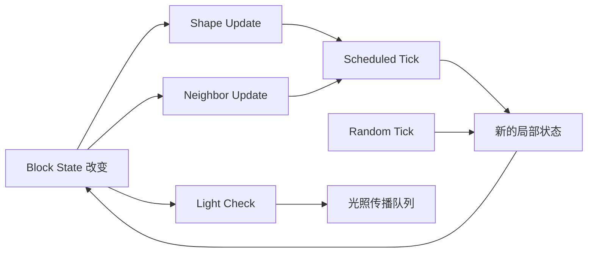
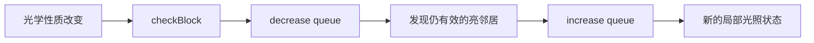
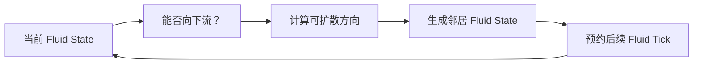
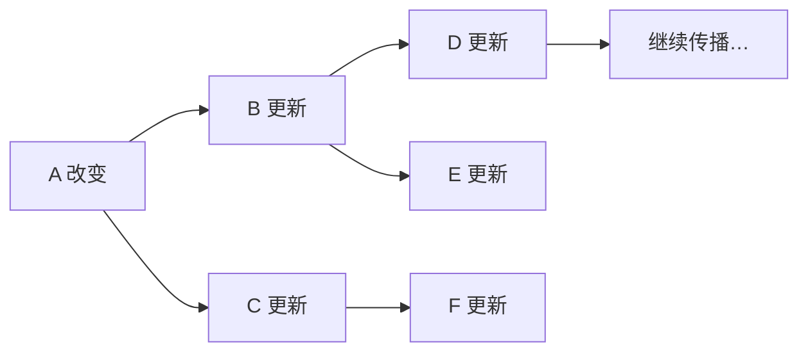
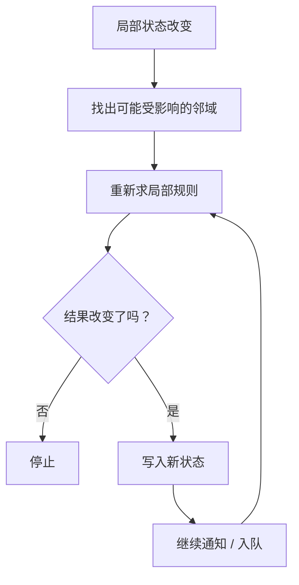

上一章[《游戏循环、Tick 与调度》](/impl/tick)建立了世界的时间框架：服务器按离散 Tick 推进，但并不是所有状态都以同一种方式更新。接下来真正落到方块世界内部，会遇到另一个更基础的问题。

玩家挖掉一格泥土，旁边的火把可能失去支撑；打开一道缺口，水会开始流；移走光源，附近亮度要重新计算；树干被砍掉以后，叶片不会立刻全部消失，却会逐渐确认自己是否还连接着木头。

这些现象看起来属于照明、流体、植物和方块规则几套不同系统，但它们共享一个很重要的实现前提：

> **世界不能在每次变化后重新扫描所有方块。一个位置改变以后，引擎必须只把真正可能受影响的局部状态继续向外传播。**

因此本章不把光照和水理解成两套孤立算法，而是从“局部状态怎样传播”出发，再看不同系统为什么需要不同的传播方式。

本文主要以 **Java Edition 26.3** 的当前实现为参照。26.3 的 Block、NeighborUpdater、LightEngine、FlowingFluid 和相关 Game Rule 已经与早期版本有不少差异，所以正文把当前类名当作实现案例，不把它们当作永久 API。[^release]



## 一个方块改变以后，谁需要知道？

把一个位置从 Stone 改成 Air，在数据层面只是一个 Block State 替换；在运行时层面却可能改变很多邻居原本成立的条件。

火把可能失去附着面，栅栏可能需要重新连接，红石可能重新计算信号，水可能发现新的出口，光线也可能获得新的传播路径。

因此一次 Block State 写入并不只是：

```text
blocks[pos] = newState
```

它还需要回答：

- 哪些邻居需要重新检查？
- 哪些检查应该立刻发生？
- 哪些只需要预约未来某个 Tick？
- 这次变化是否改变了光照？
- 是否需要通知客户端？
- 连锁更新允许继续传播多远？

### Neighbor Update 和 Shape Update 不是同一个回调

“邻居更新”在玩家讨论里经常被当成一个总称，但现代 Java 实际上区分了不同目的的局部通知。

`neighborChanged` 更接近“附近某个方块发生了变化，你可能需要执行行为逻辑”。当前 `Level` 提供 `updateNeighborsAt`、`neighborChanged` 等入口，并通过 `NeighborUpdater` 把通知传向邻居。[^level-neighbor]

`updateShape` 则更接近“某一方向的邻居状态变了，请重新计算我依赖邻居的 Block State / shape”。栅栏连接、植物能否存活、含水状态附近的变化，都可能在这一层做局部判断。Java 26.3 的 `BlockBehaviour.updateShape` 会直接拿到变化方向、邻居位置与邻居状态。[^block-behaviour]

可以把区别粗略理解成：

| 机制 | 更像什么 | 典型问题 |
| --- | --- | --- |
| Shape Update | 重新推导局部状态 | “我还连着这个邻居吗？” |
| Neighbor Changed | 收到邻居事件 | “旁边变了，我要不要执行逻辑？” |
| Scheduled Tick | 将工作推迟 | “现在先别做，几 Tick 后再检查。” |

这不是严格的一一对应分类，因为具体 Block 可以把几种机制组合起来。真正重要的是：**“附近变了”既可能要求重新求状态，也可能要求触发行为，而这两件事不必由同一个回调承担。**

### 更新标志控制的是传播策略

Java 在设置方块时还会携带 update flags。`Block.UPDATE_NEIGHBORS`、`UPDATE_CLIENTS`、`UPDATE_KNOWN_SHAPE` 等标志决定这次写入需要触发哪些副作用。[^block-flags]

这说明“改变方块”和“怎样广播这次改变”是两层决策。

例如世界生成、结构放置、活塞移动和普通玩家放置，可能都在写 Block State，但它们对以下问题的答案并不完全相同：

- 是否立刻通知邻居？
- 是否重新计算 shape？
- 是否发送客户端更新？
- 是否压制掉落？
- 是否把这次变化视为活塞移动？

<Callout type="info" title="局部变化不是自动广播">
一个状态写入是否触发邻居、客户端和其他副作用，是 API 的一部分。自研体素引擎如果只提供一个 `SetVoxel(pos, value)`，以后往往会发现生成、编辑器、网络同步和实时模拟需要完全不同的传播策略。
</Callout>

### 邻居关系形成了一张隐式依赖图

如果 A 改变以后 B 要检查，B 改变以后 C 又要检查，那么世界里实际上存在：

```text
A → B → C → ...
```

这样的依赖边。

这些边没有被预先保存成一张完整图，因为方块规则可以根据当前位置、方向和 Block State 动态决定是否继续传播。引擎保存的是局部规则，运行时才把它们展开成一次更新链。

这就是 Minecraft 方块模拟非常重要的特点：

> **依赖关系大多是隐式的，只有状态真正变化时才沿邻域展开。**

对于绝大多数永远不变的石头，这意味着运行时成本接近零；对于大型红石机器、流体或大面积方块变化，则可能在短时间内展开出很大的更新图。

## 为什么有些变化立刻发生，有些要等以后？

上一章已经区分了 Scheduled Tick、Random Tick 和持续对象 Tick。本章把它们重新放回方块传播里看：它们不是三种“时间术语”，而是三种不同的局部模拟策略。

### 立即更新适合重新建立局部不变量

如果下面的支撑方块刚被移走，一个依赖支撑面的 Block 没有必要等十秒以后再知道。

这类关系通常要求在当前更新链里立即检查：

```text
support removed
      ↓
dependent block receives update
      ↓
recompute state / survival
      ↓
possibly change again
```

“立即”不代表所有代码在同一条调用栈里无限递归。现代 Java 使用 `CollectingNeighborUpdater` 收集并执行邻居工作，它内部维护 stack、当前层新增任务以及链式更新计数，从而控制连锁传播。[^neighbor-updater]

这个区别很重要：逻辑语义可以是“现在就更新”，实现上仍然可以用显式队列 / 栈来避免无边界的直接递归。

### Scheduled Tick 适合明确的未来动作

水发现出口以后，不必在同一个调用链里把整条河一次流完。它可以预约一个未来 Tick：

```text
neighbor changed
      ↓
schedule fluid tick
      ↓
wait several game ticks
      ↓
recompute flow
      ↓
schedule affected neighbors
```

计划刻把一次巨大递归拆成随游戏时间推进的离散步骤。

当前 Java 的 `ScheduledTick<T>` 明确记录：

- type；
- position；
- trigger tick；
- priority；
- sub-tick order。[^scheduled-tick]

因此“几 Tick 后执行”并不是每个方块自己维护倒计时，而是由共享调度器保存未来工作。

流体是最典型的使用者，但并不只有流体。部分需要延迟响应或重新确认状态的方块也会使用 Scheduled Tick。

### Random Tick 适合统计性的自然变化

Random Tick 不表达：

> “我必须在第 1200 Tick 生长。”

它表达的是：

> “当这一片世界被随机抽样到我时，我有机会推进状态。”

Crop、Sapling、SpreadingSnowyBlock、Leaves 等当前 26.3 实现都仍然存在 `randomTick`。[^random-blocks]

这种模型特别适合数量巨大、单体不要求准确时间的自然过程：

- 作物成熟；
- 树苗生长；
- 草地扩散或退化；
- 叶片衰减；
- 冰雪等环境变化。

如果世界中有十万株植物，为每一株维护精确计时器没有太大价值。Random Tick 用固定规模抽样换取长期统计上的变化。

### 同一个 Block 可以同时使用多种机制

Leaves 是一个很好的例子。

叶片需要知道自己距离木头有多远；邻域发生变化时，`updateShape` 可以安排重新计算，`tick` 更新距离状态；而真正满足衰减条件以后，又可以通过 `randomTick` 随机消失。当前 26.3 的 `LeavesBlock` 同时保留了 `updateShape`、`tick` 和 `randomTick`。[^leaves]

因此不要把：

```text
Neighbor Update
Scheduled Tick
Random Tick
```

理解成互斥的三类 Block。它们是同一个 Block 可以同时使用的三种时序工具。

<Alternative title="立即检查与延迟变化可以同时存在">
邻居改变后，方块可能需要立刻判断“我是否还合法”，但把真正昂贵或具有节奏感的后续动作安排到未来 Tick。把验证和演化拆开，常常比让所有规则立即递归完成更容易控制成本。
</Alternative>

## 光照怎样只重算真正受影响的区域？

光照最能说明“局部传播”为什么比全局重算重要。

放下一支火把以后，程序当然可以重新计算整个 Chunk，甚至整个可见世界的亮度；但绝大多数位置根本不可能受这支火把影响。

Minecraft 因此把光照建模成局部传播问题。

### Sky Light 与 Block Light 是两层数据

Java Edition 把光照分为：

- **Block Light**：火把、熔岩等方块发出的光；
- **Sky Light**：来自天空的光照通道。

两者都使用 0–15 的离散等级，但来源与传播规则不同。当前 `LevelLightEngine` 内部仍然分别持有 `blockEngine` 与 `skyEngine`。[^level-light]

这两个值最终会影响渲染和部分游戏逻辑，但不要把它们理解成“屏幕像素亮度”。它们首先是世界网格上的离散模拟数据。

### 增亮和减暗必须分开处理

加入火把比较容易理解：新的高亮度从光源向六个方向传播，经过遮挡和衰减，直到再也不能提高邻居现有的 Light Level。

移走火把更麻烦。

假设某个位置当前亮度是 10，它可能来自：

- 刚移除的火把；
- 另一支仍然存在的火把；
- 两者共同覆盖的区域。

因此不能简单地说：

> 原来是 10，现在全部减 1。

必须先撤销失效来源的贡献，再让仍然有效的更亮邻居重新向空出来的区域补光。

这正是当前 `LightEngine` 明确维护 `decreaseQueue` 与 `increaseQueue` 的原因。`runLightUpdates` 会处理待检查位置，并分别传播减暗和增亮工作。[^light-engine]



这种模式并不限于 Minecraft。任何“值由邻居最大 / 最短 / 最优贡献决定”的局部场，只要支持删除来源，通常都比只处理新增来源困难。

### 方块形状也会影响光是否能穿过

最简单的 flood fill 可以写成：

```text
next = current - 1
```

但实际方块不是统一的不透明立方体。

现代 Java 的 `LightEngine` 还会检查 Block State 的 opacity、light dampening、occlusion shape，以及两个相邻形状在某个方向是否真正遮挡传播。[^light-engine]

因此楼梯、台阶、树叶、玻璃和完整实心方块不需要共享完全相同的光学行为。

这再次体现了第一章的数据模型意义：Block State 不只改变贴图，也可能改变世界模拟使用的派生属性。

### 光照队列可以跨 Chunk，但仍然是局部工作

一支火把离 Chunk 边界只有一格时，传播当然可能进入邻 Chunk。光照系统因此不能假设“一个 Chunk 是封闭盒子”。

当前 Light Engine 以 Section / Chunk 为存储与调度边界之一，但传播规则仍然按照空间邻接继续工作；`LevelLightEngine.runLightUpdates` 会统一消费 Block 与 Sky 两层积压工作。[^level-light]

这和第 03 章世界生成中的邻区依赖有相似之处：

> **Chunk 是管理粒度，不是自然规律的边界。**

至于一个邻 Chunk 当前是否加载、怎样保留光照数据、Chunk 流送怎样协调这些任务，属于第 11 章的 Chunk Lifecycle。本章只关心传播本身。

## 水和熔岩为什么不需要连续流体方程？

Minecraft 的水看起来会流，但 Java 并没有在每个格点求解 Navier–Stokes 方程。

它使用的是一个离散状态系统：每个位置有 Fluid State，流体根据下方和水平方向的邻居、局部障碍、源数量以及流动距离，计算下一步应该变成什么状态。

### Fluid State 和 Block State 有联系，但不是同一个概念

第一章已经区分 Block State 与更复杂的世界数据。流体这里又多了一层：方块位置可以暴露一个 `FluidState`，而普通水 / 熔岩方块由 `LiquidBlock` 把 Block State 映射到对应的 `FlowingFluid` 状态。Waterlogged Block 也可以在保留自身 Block State 的同时暴露水的 Fluid State。[^liquid-block]

所以不能简单写成：

```text
Water == 一个普通 Block
```

更准确的是：

```text
Block State
   ↓ getFluidState()
Fluid State
   ↓
FlowingFluid rules
```

这让“楼梯仍然是楼梯，同时内部含水”成为可能，而不必把所有水都强迫成独占一格的 Block。

### 流体传播是一次次局部重新求解

当前 `FlowingFluid` 会检查：

- 能不能向下通过；
- 哪些水平方向可以进入；
- 某方向距离最近的下落出口；
- 周围有多少同类 source；
- 当前 Fluid State 应该怎样变化；
- 下一次传播应该延迟多久。[^flowing-fluid]

这不是连续速度场，而更像：



每次只计算局部，再通过 Scheduled Tick 把变化逐步向外展开。

这也是水流为什么具有清晰的“格子感”和传播节奏：它不是一次算完整个稳态，而是在离散时间中不断靠近局部稳定状态。

### “无限水”是源转换规则，不是特殊地图资源

水源复制经常被玩家理解成一个神奇例外，但从实现角度，它只是 Fluid State 更新的一条局部规则。

`FlowingFluid` 当前仍有 `sourceNeighborCount`，用于统计相邻 source；Java 26.3 也仍存在独立的 `WATER_SOURCE_CONVERSION` 与 `LAVA_SOURCE_CONVERSION` Game Rule。[^flowing-fluid] [^gamerules]

这意味着：

> **是否允许多个邻居把当前位置转成新的 Source，本来就是规则层的选择。**

水和熔岩因此可以共享大量流动框架，却拥有不同的 source conversion 配置和传播参数。

对自研体素世界来说，这种设计比“水有一套算法，岩浆另写一整套”更容易维护：共享离散流体框架，再把 drop-off、spread delay、source conversion 等差异参数化。

### Waterlogging 展示了“占格”不必只有一层语义

如果流体只能以一个独立 Block 占据位置，那么：

```text
stairs
或
water
```

只能二选一。

Waterlogging 允许：

```text
stairs Block State
+
water Fluid State
```

同时存在。

这不是完整的多材料体素系统，但已经说明一个重要工程事实：

> **视觉 / 碰撞主体与局部介质状态不一定必须共用同一个 ID。**

如果自己做更复杂的沙盒，未来还可能把 gas、temperature、wetness 等状态继续从主体 voxel identity 中拆出来。

### 水与熔岩相遇仍然是局部规则

水和熔岩生成石头、圆石或黑曜石，看起来像一种“化学反应”，实现上依然是邻居状态交互。

当 Liquid Block 放置、更新或传播时，会检查附近流体，满足条件就用新的 Block State 替换当前位置。重点不是记住每种产物，而是看到：

> **两套局部状态机相遇时，可以通过邻域规则生成第三种离散状态。**

这比加入一套全局“地质模拟器”便宜得多，也更符合 Minecraft 的格子世界。

## 火焰、生长与叶片为什么共享同一套基础设施？

局部传播并不只服务于光和流体。许多看起来完全不同的自然变化，本质上只是选择了不同的触发方式和邻域规则。

### 火焰：传播有节奏，也有空间边界

当前 Java 26.3 的 `FireBlock` 仍通过 Scheduled Tick 推进主要火焰更新，并在邻居形状变化时重新确认自己能否存在。[^fire-block]

火焰传播还带有一层产品策略：26.3 当前使用 `minecraft:fire_spread_radius_around_player` Game Rule 控制火焰能够在玩家周围多远的区域传播。这个规则在 25w44a 引入，用来替代旧的 `doFireTick` 与 `allowFireTicksAwayFromPlayer`；0 可以关闭传播，-1 则允许不依赖附近玩家。[^fire-rule]

这是一个很好的例子：

```text
局部传播规则
+
Scheduled Tick
+
世界激活范围策略
```

共同决定最终行为。

“火会不会烧木头”属于本章；“哪些远处 Chunk 当前有资格继续模拟”则属于第 11 章。

### 作物和树苗：随机采样代替成千上万个计时器

`CropBlock`、`SaplingBlock` 在 26.3 都通过 `randomTick` 推进生长。[^crop] [^sapling]

它们通常还要重新检查：

- 光照；
- 下方土壤；
- 周围环境；
- 当前 age / stage。

因此 Random Tick 并不是“随机直接长一级”，而只是给方块一次执行机会；真正是否变化仍由局部规则决定。

可以抽象成：

```text
randomly selected
      ↓
read local environment
      ↓
conditions satisfied?
   ↙             ↘
 yes             no
  ↓               ↓
update state     nothing
```

这种模式特别适合允许“不发生任何事”的自然系统。

### Grass 展示的是局部竞争，而不是全局生态模拟

Grass / Mycelium 一类方块可以读取附近光照和邻居，决定自身是否退化，以及是否尝试向附近合适的 Dirt 传播。当前 `SpreadingSnowyBlock` 仍把这类行为放在 `randomTick` 中。[^spreading]

没有任何“草地系统”每秒统计整片草原。

每一格只在偶尔被抽中时问：

> 我还能活吗？附近有没有适合传播的位置？

宏观看起来像生态扩散，微观实现却只是许多局部随机规则叠加。

### Leaves 同时展示了传播状态与随机结果

叶片距离原木的 `distance` 是一种局部传播状态：附近叶片 / 木头变化以后，距离信息要逐步重新计算。

真正的 decay 又不是立即发生，而是等待 Random Tick。

于是同一个系统里同时存在：

```text
Neighbor change
    ↓
scheduled distance recomputation
    ↓
distance says "unsupported"
    ↓
later random tick
    ↓
decay
```

这比“树干一砍，所有叶子立即 BFS 一遍然后消失”更平滑，也把一次可能很大的工作拆散到后续 Tick。

### Falling Block 只在这里讨论“何时开始掉”

Sand、Gravel 等 Falling Block 在失去支撑后，会通过方块更新 / Scheduled Tick 确认自己应当下落，随后转成 FallingBlockEntity。

一旦真正成为 Entity，它的位置、速度、碰撞和落地属于下一章[《实体、移动与 AI》](/impl/entities)的职责。本章只关心从：

```text
static block
→ local support invalid
→ schedule/check
→ become entity
```

这一段转换。

这也是为什么 Minecraft 不需要一套统一 Physics Engine 每 Tick 对所有方块施加重力。绝大多数方块永远不会检查“我是不是应该往下掉”，只有少数具有 Falling Block 规则的状态会响应支撑变化。

## 当局部变化形成连锁，会发生什么？

局部规则便宜的前提，是一次变化只影响很少的位置。

但“每一步只看邻居”并不意味着总成本一定很小。如果一个变化让六个邻居变化，每个邻居再继续产生新变化，局部传播一样可以迅速变成很大的工作量。

### Update Cascade 是隐式图的一次展开

可以把一次更新链想成：



这里每一条边都只是局部规则，但整个 cascade 的大小取决于最终被触发多少节点，而不是最初只改了几个 Block。

典型放大器包括：

- 大片流体获得新出口；
- 大型红石网络；
- 大规模光源同时添加 / 移除；
- 大量依赖支撑或连接状态的方块；
- 命令或编辑工具一次改变大量位置。

这也是为什么“局部算法”与“低成本算法”不能画等号。

### Java 会限制过长的邻居更新链

现代 Java 用 `CollectingNeighborUpdater` 组织邻居更新链，并维护 `maxChainedNeighborUpdates`。Dedicated Server 的 `max-chained-neighbor-updates` 默认值当前为一百万；超过预算以后，后续链式邻居请求会被停止，而不是允许一条异常更新无限展开。[^neighbor-limit]

这里还有另一个容易混淆的限制：`Block.UPDATE_LIMIT` 用于约束 shape update / nested write 的递归深度，而 `maxChainedNeighborUpdates` 统计的是 NeighborUpdater 收到的更新请求。它们不是同一个数字，也不是同一种保护。[^block-interaction]

这种“双层限制”反映的是不同风险：

- 状态写入递归得太深；
- 邻居事件链展开得太大。

对开发者来说，比记住当前默认数字更重要的是：

> **任何允许用户内容形成反馈环的事件传播系统，都需要明确的终止条件或预算。**

### Chunk Boundary 不应该改变规则，但会改变调度条件

光、水、邻居依赖和结构都可能跨 Chunk 边界。理想情况下，同一条局部规则不应该因为坐标正好从 x=15 跨到 x=16 就换一种物理。

但 Chunk 是加载、保存、线程任务和数据所有权的重要边界，所以跨 Chunk 更新一定会遇到工程问题：

- 邻居数据当前是否可用？
- 这个 Chunk 是否正在 ticking？
- 延迟工作在卸载时怎样保存？
- 重新加载后哪些 Scheduled Tick 需要恢复？
- 光照任务怎样与 Chunk 生命周期协作？

这些问题会在第 11 章[《区块生命周期与世界流送》](/impl/chunk-streaming)中统一讨论。

本章只需要保留一个原则：

> **空间规则应该尽量独立于 Chunk 边界，而运行时调度必须显式处理 Chunk 边界。**

### 更新顺序会成为可观察行为

当 A、B、C 会相互读写时：

```text
A → B → C
```

和：

```text
C → B → A
```

不一定得到同一个中间状态。

因此 Neighbor Update 的方向顺序、Scheduled Tick 的 priority / sub-tick order、Redstone 的专用传播规则，都可能最终成为玩家可观察的行为。

这部分不会在本章展开成红石技术细节。第 08 章[《红石与更新顺序》](/impl/redstone)会专门讨论为什么执行顺序、Observer、Piston、Quasi-connectivity 等历史行为可以成为完整机器的一部分。

但这里必须先建立前提：

> **局部规则不仅定义“会不会更新”，还隐含定义“按什么顺序看到世界”。**

## 这些系统真正共享的是什么？

光照、流体、火焰、作物和叶片并没有共享一套万能 Solver。它们的数据结构和传播规则都不同。

真正共享的是一种更底层的运行时思路。

### 不重新求整个世界，只维护受影响区域

当状态发生局部变化时：

1. 识别可能受影响的位置；
2. 把它们直接执行或放入合适的队列；
3. 读取邻域；
4. 如果结果真的改变，再继续向外传播；
5. 没有进一步变化时停止。



光照的 increase / decrease queue、流体的 Scheduled Tick、Grass 的 Random Tick，看起来不同，本质上都在避免“每 Tick 对全世界做全量求解”。

### 稀疏变化应该拥有稀疏成本

一个巨大世界里：

- 石头通常什么都不做；
- 已经稳定的水池通常什么都不做；
- 没有光学变化的位置通常不参与 Light Update；
- 未被 Random Tick 抽中的作物通常什么都不做。

这使运行成本更接近：

```text
当前活跃变化的数量
```

而不是：

```text
世界已经存在的方块总数
```

当然，Chunk 加载范围和 Random Tick 采样会让这个关系更复杂，但作为架构目标非常重要。

### “局部”是一种可扩展性选择，也是一种玩法选择

这些系统并不追求物理上最真实的结果。

水是离散 Fluid State，不是连续流体；火是概率与局部可燃性规则，不是热传导方程；草地扩散不是植物生态模型；Light Level 是有限整数场，不是完整光传输。

但正因为这些规则：

- 局部；
- 离散；
- 可重复；
- 可组合；
- 容易观察；

玩家才可以预测和利用它们。

Minecraft 的世界因此既不是静态网格，也不是全局物理模拟，而更像：

> **大量局部状态机通过邻居通知、计划工作、随机采样和传播队列持续交换影响。**

这是本章最后才值得抽象出来的结论。

## 这一章留下什么

一个 Block State 改变以后，Minecraft 不会问“整个世界现在应该重新变成什么样”，而是沿有限邻域继续维护受影响的数据。Shape Update 与 Neighbor Update 处理即时依赖；Scheduled Tick 把明确的后续动作放到未来；Random Tick 给大量低频自然过程提供统计更新；Light Engine 使用增亮与减暗队列维护离散光场；FlowingFluid 则通过 Fluid State 和计划刻逐步传播。

火焰、生长、Grass、Leaves 之所以能和水、光放在同一章，不是因为它们共享同一套算法，而是因为它们都把一个宏观看似连续的世界现象拆成了**有限邻域里的状态变化**。

对开发者来说，最值得继承的不是 Minecraft 某个具体 `updateShape` 调用顺序，而是四个边界：**状态写入与传播策略分离；立即依赖与延迟演化分离；局部规则与 Chunk 调度边界分离；单次规则成本与整个 cascade 的总成本分离。**

下一章会离开主要以方块格子为中心的模拟。Mob、掉落物、船、矿车和弹射物需要连续位置、速度、碰撞体和行为状态，它们为什么必须成为 Entity，又怎样在同一个 Tick 框架里移动和决策？

[^release]: Mojang Studios，《Minecraft Java Edition 26.3》，2026-09-15。见 https://www.minecraft.net/en-us/article/minecraft-java-edition-26-3

[^level-neighbor]: Java 26.3 的 `Level` 仍提供 `updateNeighborsAt`、`updateNeighborsAtExceptFromFacing`、`neighborChanged` 与 `neighborShapeChanged` 等入口。见 NeoForge 26.3 映射 Javadoc：https://aldak0.ru/javadoc/26.3.x/net/minecraft/world/level/Level.html

[^block-behaviour]: Java 26.3 `BlockBehaviour` 定义 `updateShape`、`neighborChanged`、`onPlace`、`affectNeighborsAfterRemoval` 等局部状态 / 行为入口。见 https://aldak.netlify.app/javadoc/26.3.x/net/minecraft/world/level/block/state/blockbehaviour

[^block-flags]: Java 26.3 `Block` 仍定义 `UPDATE_NEIGHBORS`、`UPDATE_CLIENTS`、`UPDATE_KNOWN_SHAPE`、`UPDATE_SUPPRESS_DROPS`、`UPDATE_MOVE_BY_PISTON` 等写入标志。见 https://aldak0.ru/javadoc/26.3.x/net/minecraft/world/level/block/Block.html

[^neighbor-updater]: Java 26.3 `CollectingNeighborUpdater` 内部维护 stack、`addedThisLayer`、`count` 与 `maxChainedNeighborUpdates`，用于收集和执行连锁邻居更新。见 https://aldak0.ru/javadoc/26.3.x/net/minecraft/world/level/redstone/CollectingNeighborUpdater.html

[^scheduled-tick]: Java 26.3 `ScheduledTick<T>` 保存 `type`、`pos`、`triggerTick`、`priority` 和 `subTickOrder`，并提供 drain order comparator。见 https://aldak0.ru/javadoc/26.3.x/net/minecraft/world/ticks/ScheduledTick.html

[^random-blocks]: Java 26.3 当前仍有大量方块覆盖 `randomTick`，包括 Crop、Sapling、Leaves、SpreadingSnowyBlock、SugarCane 等。见 `RandomSource` 的类使用索引：https://aldak.netlify.app/javadoc/26.3.x/net/minecraft/util/class-use/randomsource

[^leaves]: Java 26.3 `LeavesBlock` 同时实现 `updateShape`、`tick` 与 `randomTick`，分别参与邻域距离更新和随机衰减。见 https://aldak.netlify.app/javadoc/26.3.x/net/minecraft/world/level/block/leavesblock

[^level-light]: Java 26.3 `LevelLightEngine` 分别持有 Block Light 与 Sky Light 引擎，并通过 `runLightUpdates` 消费光照工作。见 https://aldak.netlify.app/javadoc/26.3.x/net/minecraft/world/level/lighting/levellightengine

[^light-engine]: Java 26.3 `LightEngine` 维护独立的 `decreaseQueue` 与 `increaseQueue`，并以 opacity、occlusion shape、传播方向等信息处理局部光照更新。见 https://aldak0.ru/javadoc/26.3.x/net/minecraft/world/level/lighting/LightEngine.html；当前实现流程的源码级整理可参见 https://minecraftdocs.dev/systems/world/lighting

[^liquid-block]: Java 26.3 `LiquidBlock` 持有对应 `FlowingFluid`，维护 Fluid State cache，并在 `updateShape` / `tick` 等入口参与流体调度。见 https://aldak0.ru/javadoc/26.3.x/net/minecraft/world/level/block/LiquidBlock.html

[^flowing-fluid]: Java 26.3 `FlowingFluid` 当前包含 `sourceNeighborCount`、`getSpread`、`getSlopeFindDistance`、`getSpreadDelay` 与 `tick` 等职责。见 https://aldak0.ru/javadoc/26.3.x/net/minecraft/world/level/material/FlowingFluid.html

[^gamerules]: Java 26.3 `GameRules` 当前包含 `WATER_SOURCE_CONVERSION`、`LAVA_SOURCE_CONVERSION`、`RANDOM_TICK_SPEED` 与 `FIRE_SPREAD_RADIUS_AROUND_PLAYER`。见 https://aldak0.ru/javadoc/26.3.x/net/minecraft/world/level/gamerules/GameRules.html

[^fire-block]: Java 26.3 `FireBlock` 覆盖 `updateShape` 与服务端 `tick`，并根据附近方块的可燃性与环境继续调度火焰变化。见 https://aldak.netlify.app/javadoc/26.3.x/net/minecraft/world/level/block/fireblock

[^fire-rule]: Mojang Studios，《Minecraft Java Edition Snapshot 25w44a》，2025。该版本加入 `minecraft:fire_spread_radius_around_player`，并移除旧 `doFireTick` 与 `allowFireTicksAwayFromPlayer`。见 https://feedback.minecraft.net/hc/en-us/articles/40682495010061-Minecraft-Java-Edition-Snapshot-25w44a

[^crop]: Java 26.3 `CropBlock` 仍通过 `isRandomlyTicking` 与 `randomTick` 推进作物年龄，并根据光照和附近农田计算增长条件。见 https://aldak0.ru/javadoc/26.3.x/net/minecraft/world/level/block/CropBlock.html

[^sapling]: Java 26.3 `SaplingBlock` 仍通过 `randomTick` 和 `advanceTree` 推进树苗阶段。见 https://aldak0.ru/javadoc/26.3.x/net/minecraft/world/level/block/SaplingBlock.html

[^spreading]: Java 26.3 `SpreadingSnowyBlock` 通过 `randomTick` 检查存活与向邻近位置传播的条件。见 https://aldak.netlify.app/javadoc/26.3.x/net/minecraft/world/level/block/spreadingsnowyblock

[^neighbor-limit]: Java 26.3 `CollectingNeighborUpdater` 仍有 `maxChainedNeighborUpdates`。当前源码追踪显示 Dedicated Server 从 `max-chained-neighbor-updates` 读取该预算，默认 1,000,000；Integrated Server 使用相同默认量级。见 https://minecraftdocs.dev/systems/blocks/block-interaction

[^block-interaction]: Java 当前同时存在邻居请求链预算与 `Block.UPDATE_LIMIT` 的 shape / nested-write 深度预算；两者职责不同。见 https://minecraftdocs.dev/systems/blocks/block-interaction 与 https://minecraftdocs.dev/reference/block-update-flags
