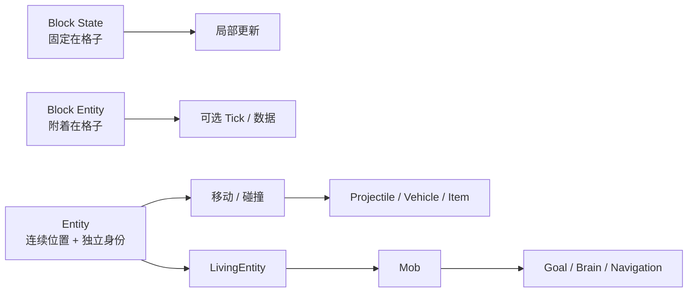
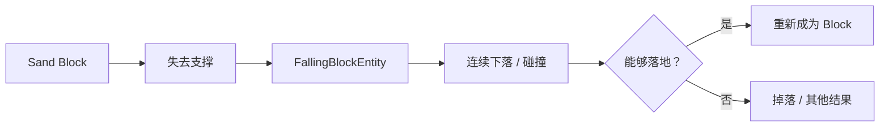
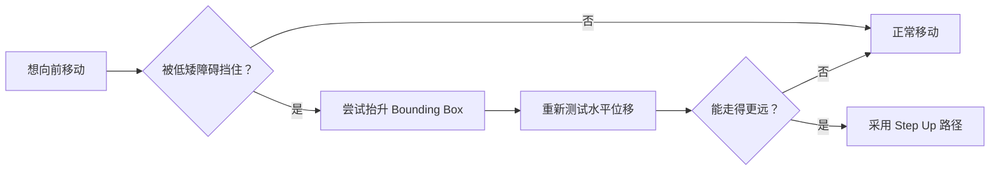
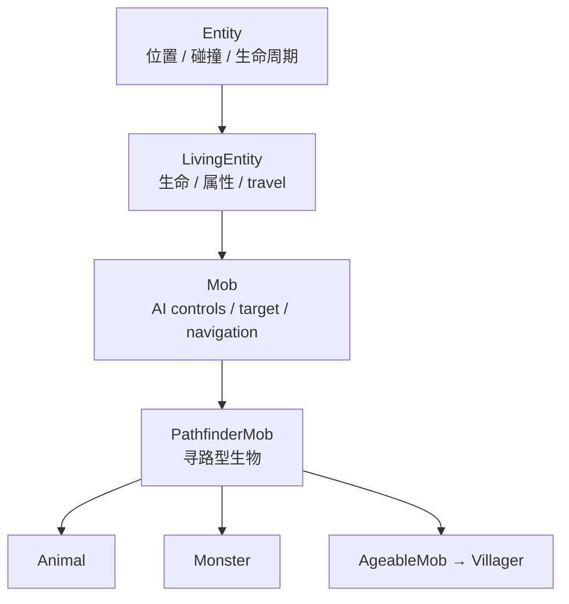
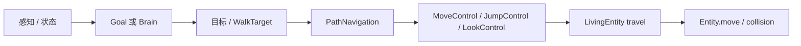
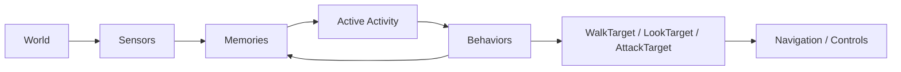

上一章[《方块更新、光照与流体》](/impl/block-updates-light-fluid)主要处理的是**格子里的状态怎样变化**。方块可以长期安静地留在某个整数坐标上，只有附近发生变化、计划刻到期或随机刻抽中时才需要重新计算。

但玩家、箭、掉落物、船和村民不适合只用这种模型表示。它们可以停在两个方块之间，可以连续移动，可以跨越很多格子，还可能有自己的生命期、速度、朝向、乘客和行为状态。

这就是 Entity 存在的根本原因：

> **当一个对象不再只是“某一格现在是什么”，而需要拥有独立身份、连续空间状态和随时间推进的行为时，它就需要另一种运行时表示。**

Minecraft Java 并没有把这些需求交给一套统一的通用 Physics Engine。当前实现更像一组共享基础设施之上的专用模拟：`Entity` 提供位置、碰撞、生命周期等共同能力；`LivingEntity` 加入生命与运动；`Mob` 再加入控制与 AI；Projectile、Boat、Minecart、Falling Block 等对象则在此基础上拥有各自的运动规则。[^entity] [^release]



本章主要以 **Java Edition 26.3** 为实现参照。具体类层次和 AI 数据组织仍在演化，因此重点放在：为什么这些层存在，它们之间怎样传递意图，以及哪些问题必须作为特例处理。

## 什么东西需要成为 Entity？

Entity 不是“会动的方块”。它代表的是一种不同的数据所有权方式。

一个 Stone Block 的身份来自：

```text
world + block position
```

而一只鸡即使从 `(10, 64, 10)` 走到 `(10.4, 64, 10.7)`，仍然是同一只鸡。它的身份不能由所在格子决定。

### Block、Block Entity 和 Entity 解决的是不同问题

可以先把三者放在同一张表里：

| 表示 | 空间归属 | 适合保存 | 典型对象 |
| --- | --- | --- | --- |
| Block State | 固定格坐标 | 小而共享的离散状态 | Stone、Door、Rail |
| Block Entity | 仍固定格坐标 | 该格独有的实例数据 | Chest、Furnace、Hopper |
| Entity | 连续坐标、独立身份 | 位置、运动、生命周期与实例行为 | Player、Mob、Item、Boat |

Block Entity 虽然名字里也有 Entity，但它**不是 `Entity` 的子类**。它仍然依附于一个 BlockPos，只是在普通 Block State 装不下数据时，为那一格挂上一份实例状态。

Entity 则反过来：位置只是它当前的一项状态。它可以移动、被传送、骑乘另一个 Entity，甚至跨 Chunk，而对象本身继续存在。

这也是为什么“箱子”和“掉在地上的箱子物品”属于完全不同的表示。前者是某个方块位置上的容器数据；后者是一个 `ItemEntity`，需要位置、速度、拾取延迟和生命周期。

### 连续位置不是唯一理由，独立生命周期同样重要

有些 Entity 几乎不需要复杂运动，但仍然不能只做成 Block。

例如：

- Experience Orb 会独立存在、移动并被玩家吸收；
- Primed TNT 有自己的倒计时和位置；
- Area Effect Cloud 有半径和剩余时间；
- Lightning Bolt 是短生命周期事件对象；
- Display Entity 主要服务表现与地图创作，但仍需要连续 transform、插值与独立实例。[^entity] [^display]

所以更准确的判断不是：

> 会动 → Entity。

而是：

> **这个对象是否需要脱离某一个格子的所有权，拥有独立的空间、生命周期或实例状态？**

Movement 是 Entity 最常见的能力，但不是定义它的唯一条件。

### Display Entity 说明“成为 Entity”不等于“拥有完整物理”

Java 的 Block Display、Item Display 和 Text Display 都继承自 `Display`，而 `Display` 又继承自 `Entity`。当前实现主要保存 transformation、interpolation、culling box、view range 等表现状态。[^display]

它们说明 Entity 层本身可以只被用来获得：

- 独立身份；
- 连续坐标；
- 网络追踪；
- 客户端插值；
- 独立生命周期。

并不意味着每一种 Entity 都必须拥有 Mob AI、常规碰撞或完整的移动逻辑。

<Callout type="info" title="对象分类最好按需要的能力划分">
如果装饰物只需要位置和渲染插值，就不应该因为“它长得像一个角色”而自动获得 AI、寻路、受伤、推挤等全部运行时能力。Minecraft 后来的 Display Entity 正体现了这种拆分。
</Callout>

### 有些对象会在 Block 和 Entity 之间切换

Falling Block 是特别清楚的例子。

沙子稳定时只是一格 Block State；失去支撑后，`FallingBlock` 会创建 `FallingBlockEntity`。它在空中使用连续坐标和 Entity 移动逻辑，落地以后又尝试重新写回 Block State。[^falling]



这不是为了维持漂亮的类层次，而是因为两种阶段适合不同表示：

- 静止时，用 Block 最便宜；
- 真正运动时，用 Entity 才能表达连续位置；
- 稳定以后，再回到 Block。

这种**按状态切换表示**的思想，比“一切对象永远都是 Entity”更适合大规模体素世界。

## Entity 怎样在方块世界里移动？

Entity 拥有连续坐标，并不意味着世界也变成连续几何。它仍然在一个由 Block State 和 Voxel Shape 构成的离散环境里移动。

因此移动的核心问题是：

> **我想移动一段距离，但这一段路径里世界究竟允许我走多远？**

### Position、Velocity 和 Bounding Box 是不同状态

位置回答：

> 我在哪里？

速度或 `deltaMovement` 回答：

> 如果没有阻挡，我这一 Tick 想继续怎样移动？

Bounding Box 回答：

> 我在空间里实际占据多大范围？

当前 Java `Entity` 维护位置、旧位置、movement、`onGround`、`horizontalCollision`、`verticalCollision`、`fallDistance` 等运行时状态，并以 AABB 作为实体碰撞的基本边界。[^entity]

AABB 是 **Axis-Aligned Bounding Box**：盒子的边始终与世界坐标轴平行。

它的优势很直接：

- 两个盒子是否重叠容易计算；
- 沿 X / Y / Z 能移动多远容易裁剪；
- 查询潜在碰撞方块时可以用包围范围快速缩小候选集。

代价则是它并不精确贴合角色模型。玩家转身时，碰撞盒不会跟着肩膀旋转；一只鸡和它的动画骨骼也不是同一套几何。

这里选择的是**稳定而便宜的游戏碰撞体**，不是渲染网格的物理复刻。

### 方块碰撞并不都是完整立方体

实体本身常用 AABB，但世界里的 Block Collision 可以是 `VoxelShape`。

台阶、楼梯、栅栏、门、活板门都可以提供不同的 Collision Shape。当前 `Entity.move` 会收集附近方块和实体的碰撞形状，再通过 `collideBoundingBox` / `collideWithShapes` 把请求的移动向量裁剪成真正允许的位移。[^entity-collision]

因此一次移动更像：

```text
requested movement
        ↓
collect nearby collision shapes
        ↓
clip movement against shapes
        ↓
actual movement
        ↓
set collision / ground flags
```

而不是先让实体进入墙体，再在下一步把它硬拉出来。

### Tick 中的运动不是一条统一物理公式

教学上可以把一次运动粗略写成：

$$
v_{t+1} = D(v_t + a_t)
$$

$$
x_{t+1} = x_t + C(v_{t+1})
$$

其中：

- $a_t$ 表示这一 Tick 的输入、重力或其他加速度；
- $D$ 表示阻尼、摩擦等速度修正；
- $C$ 表示碰撞约束之后真正允许的位移。

但这只是**理解模型**，不是 Minecraft 所有 Entity 共享的一条源码公式。

不同 Entity 对顺序和参数有自己的实现：

- Living Entity 的走路、游泳、飞行会走不同 travel 分支；
- Projectile 有自己的 gravity / drag 与命中处理；
- Falling Block 使用自己的默认重力；
- Minecart 需要读取轨道；
- Boat 需要处理水面状态与乘客；
- Elytra 又有专门的飞行关系。

所以 Minecraft 更像：

> **共享碰撞基础设施 + 多种运动状态机。**

而不是一个统一 Solver 给所有对象施加完全相同的力。

### Step Up 是“尝试另一条合法路径”

如果实体只把水平位移直接裁剪到碰撞盒前方，那么很矮的台阶也会像墙一样挡住角色。

`Entity.move` 因此还包含 Step Up 逻辑：当水平移动被阻挡，而且实体允许一定的 `maxUpStep` 时，引擎会尝试若干候选抬升高度，比较“先向上再向前”是否能获得更好的有效位移。当前实现甚至有专门的 `collectCandidateStepUpHeights`。[^entity]



这不是“角色腿部 IK 自动迈台阶”，而是碰撞求解里的候选路径。因此玩家感受到的“能自然走上台阶”，首先来自几何规则，动画只是之后的表现。

### Ground 和 Fall 是碰撞结果，不是地图标签

`onGround` 并不是“Y 坐标正好为整数”。

实体向下移动被碰撞形状截断以后，系统可以知道它是否得到下方支撑；`verticalCollisionBelow`、supporting block、fall distance 等状态再据此更新。[^entity-collision]

```text
requested downward movement
          ↓
collision clipped?
          ↓
support detected
          ↓
onGround / fall distance / landing effects
```

这也是为什么半砖、雪层、船等对象会让“站在地上”比单纯比较 Y 值复杂得多。

### 方块还会在碰撞之后继续影响运动

碰撞只回答“能不能穿过去”。

冰、灵魂沙、蜂蜜块、气泡柱、粉雪等还可能改变摩擦、speed factor、jump factor、stuck multiplier 或 entity-inside effect。

现代 26.3 的 `Entity` 甚至会记录本 Tick 的移动路径，再把移动经过的 Block Effects 应用到实体，而不是只看最终落点。[^movement]

这意味着 Entity movement 与 Block world 的关系不只是“墙挡住人”：

> **方块既提供几何约束，也可以提供运动材料属性和经过时的行为。**

## 为什么 Projectile、Boat 和 Minecart 不能只复用一种移动？

共享 AABB 和 position，并没有让所有 Entity 的运动问题变成同一道题。

真正的游戏行为往往来自这些特例。

### Projectile 更关心“一段路径命中了什么”

箭、雪球、末影珍珠移动得快，而且最重要的事件不是“站稳”，而是：

> 从上一位置到下一位置之间有没有击中 Block 或 Entity？

当前 `Projectile` 提供 owner、shoot、hit handling、deflection 等基础能力；不同子类再实现自己的 gravity、drag 和命中结果。[^projectile]

这类对象如果只在每 Tick 结束时检查：

```text
当前位置是否重叠目标？
```

就可能在高速运动时直接穿过很薄的目标。

所以 Projectile 的碰撞更强调**沿本 Tick 位移路径做 hit test**，而不是只依赖角色式“盒子推墙”。

### Item Entity 是“物品数据获得了世界身份”

下一章会详细讨论 Item / Item Stack。这里先区分：

```text
ItemStack in inventory
≠
ItemEntity in world
```

背包里的 Item Stack 没有世界坐标，也不需要重力。

一旦掉在地上，它被 `ItemEntity` 包起来，才获得：

- position；
- movement；
- pickup delay；
- age / lifetime；
- 与附近 Item Entity 合并的机会；
- 被玩家或 Hopper 获取的世界交互。

因此“丢出一个物品”不是只把 Item Stack 的 location 字段改掉，而是**把物品数据挂到另一种运行时容器中**。

这个模式和 Falling Block 很相似：同一份内容在不同阶段使用不同表示。

### Falling Block 把离散世界暂时转换成连续运动

上一章已经讲了 Sand 什么时候开始掉；这一章补完后半段。

`FallingBlockEntity` 保存原来的 Block State、起始位置、下落时间和落地结果，并拥有自己的 gravity 与 fall damage 路径。[^falling]

它的存在证明 Minecraft 的“重力”不是一个遍历所有 Block 的全局物理场：

- Stone 从不检查自己要不要掉；
- Sand 在方块规则判断失去支撑以后才进入 Falling Entity；
- 真正运动的阶段才按 Entity Tick 计算；
- 落地以后又退出 Entity 系统。

<Impl title="静态表示与动态表示可以互相转换">
如果一个对象 99.9% 的时间都静止，不一定值得永久为它保留 velocity、collision body 和 per-tick update。只在进入动态阶段时创建运行时对象，稳定后再折回静态数据，是体素世界很常见的成本控制方式。
</Impl>

### Minecart 的运动首先受轨道拓扑约束

Minecart 是 Entity，但它的主要自由度不是三维空间中的任意方向。

`AbstractMinecart` 当前会读取 `RailShape`、计算轨道出口，并区分 on-track 与 off-track 行为；类本身就包含 `comeOffTrack`、`applyGravity`、`applyNaturalSlowdown` 等专用运动路径。[^minecart]

所以矿车更接近：

```text
continuous entity
+
rail-constrained movement model
```

轨道决定允许的局部路径，Entity 系统负责连续位置、乘客、碰撞和生命周期。

这比“给普通 Entity 加一个朝前的力，然后祈祷它沿轨道走”稳定得多。

### Boat 又是另一套约束

Boat 不按 Rail Shape 行走，而要判断自己相对水面、陆地与空气的位置，还要把乘客控制转成运动。

因此 Boat 与 Minecart 虽然都属于 Vehicle，却没有理由共享一套完整运动方程。

更一般地说：

> **继承同一个 Entity 基类，意味着共享身份、位置和基础碰撞能力；不意味着所有子类必须共享同一种物理。**

这正是为什么把 Minecraft 描述成“有一个统一 Physics Engine”会误导读者。它确实拥有共同的 movement / collision infrastructure，但大量行为由对象类型自己的规则定义。

## Mob 怎样把“想做什么”变成移动？

到这里为止，Entity movement 只需要一个移动意图。

玩家的意图来自输入；Projectile 的意图来自发射速度；Falling Block 主要来自重力。

Mob 还多了一层：

> **它必须自己决定下一步想做什么。**

### 从 Entity 到 Mob 是一层层增加职责

Java 当前常见继承关系可以简化为：



不是每个 Entity 都需要生命值；不是每个 Living Entity 都需要完整 Mob AI；不是每个 Mob 都用同一种寻路或同一种 AI 架构。

这种层次的意义在于**只给真正需要的对象增加职责**。

### AI、Navigation 和 Movement 是三层，不是一层

一个 Zombie 决定追玩家，至少要经过三类问题：

1. **Decision**：现在应该攻击谁？
2. **Navigation**：从这里到目标附近应该经过哪些位置？
3. **Movement**：这一 Tick 的身体实际能移动多少？



这几个层级需要分开。

AI 说“去床边”并不等于直接修改坐标；Navigation 给出路径也不意味着身体一定能通过；最终 movement 仍要面对碰撞、速度、重力和 Block Effects。

因此 AI bug、Pathfinding bug 和 Collision bug 可能表现得很像：

> Mob 卡住了。

但它们发生在完全不同的层。

## Goal 和 Brain 为什么会同时存在？

Minecraft Java 的 Mob AI 并不是一套系统从头统一设计到今天。

当前 26.3 中，`Mob` 仍然拥有 `goalSelector`、`targetSelector`、`MoveControl`、`LookControl`、`JumpControl` 与 `PathNavigation`；与此同时，`LivingEntity` 还拥有 `Brain`，部分复杂 Mob 会真正使用 Sensors、Memories、Activities 和 Behaviors。[^mob] [^brain]

两套架构因此长期并存。

### GoalSelector 适合“现在有哪些行为可以抢控制权”

经典 Goal AI 的基本问题是：

> 哪些 Goal 现在满足条件？如果多个 Goal 都想控制 MOVE、LOOK、JUMP 或 TARGET，谁赢？

`GoalSelector` 当前维护：

- available goals；
- disabled flags；
- 每个 `Goal.Flag` 当前被哪个 Goal 占用；
- 每个 Goal 的 priority。[^goal-selector]

例如一个 Mob 可以同时拥有：

- MeleeAttackGoal；
- RandomStrollGoal；
- LookAtPlayerGoal；
- FloatGoal。

如果 Attack Goal 已经占用了 MOVE，Random Stroll 就不应该同时给腿另一组方向。

所以 Goal priority 并不是“一次只能选一个最高优先级行为”，而更接近**资源仲裁**：

```text
Goal A needs MOVE + LOOK
Goal B needs MOVE
Goal C needs TARGET

A 与 B 冲突
C 可能同时运行
```

这让一些简单行为可以并行，同时防止两个系统争抢同一个控制通道。

### Brain 适合有记忆、感知和活动阶段的行为

Brain 解决的是更结构化的问题。

当前 `Brain<E>` 保存：

- Memories；
- Sensors；
- active Activities；
- 每个 Activity 的行为；
- 行为优先级；
- Activity 的 memory requirements；
- Activity 停止时要清理的 memories。[^brain]

可以把它看成：



Sensor 不直接“控制腿”，而是把它看到的东西写进 Memory。

Behavior 也不必直接完成整个动作。它可以读取 Memory，再写入新的 Memory，例如：

- 最近看到的敌人；
- 想去的位置；
- 工作站；
- 床；
- Attack Target；
- Walk Target。

这种架构更适合需要多个系统共享上下文的 Mob。

### 两套系统不是新旧版本的简单替换关系

不能写成：

> 旧 Mob 用 Goal，新 Mob 全部改用 Brain。

现实更混合。

所有 `Mob` 都保留 GoalSelector 基础设施；不少 Mob 主要使用 Goals。与此同时，Villager、Piglin、Warden、Frog、Allay 等会建立真正有 Sensors / Memories / Behaviors 的 Brain。当前 26.3 仍然存在大量 Goal class，也存在大量 Brain behavior class。[^ai-current]

因此更准确的理解是：

> **GoalSelector 是一种轻量、直接的行为仲裁模型；Brain 是另一种以 Memory / Sensor / Activity 为中心的组织模型。Minecraft 选择了共存，而不是为了架构纯度强行统一。**

<Alternative title="统一 AI 框架不一定更简单">
从引擎设计角度，把所有 Mob 都迁进一套 Behavior Tree、Utility AI 或 Brain 系统看起来更整洁；但成熟游戏的旧行为本身已经是兼容接口。统一架构的收益必须和重写几十种 Mob 的行为差异、Bug 与玩家预期一起计算。
</Alternative>

## 寻路怎样把体素世界重新解释成图？

AI 知道“我要去那里”以后，并不能直接朝目标做直线运动。

中间可能有：

- 墙；
- 门；
- 台阶；
- 水；
- 岩浆；
- 高差；
- 两格高或一格高通道；
- Mob 不愿进入的环境。

因此 Navigation 必须把局部体素世界转换成一种可搜索表示。

### NodeEvaluator 决定哪些位置是什么类型

不同 Mob 的可行空间不同。

地面生物、飞行生物和水生生物分别使用不同的 `PathNavigation` 子类，例如：

- `GroundPathNavigation`；
- `FlyingPathNavigation`；
- `WaterBoundPathNavigation`；
- `AmphibiousPathNavigation`。[^navigation]

Navigation 再使用 `NodeEvaluator` 判断附近位置属于哪种 Path Type、能不能通过，以及相应代价。

`Mob` 还可以给 Path Type 设置 `pathfindingMalus`：某类位置不是完全禁止，但可能比普通地面“更不愿走”。[^mob]

因此 pathfinding 的输入不是“世界上哪里是 Air”这么简单，而是一张**针对这个 Mob 的可通行性图**。

### PathFinder 搜索的是节点，不是移动身体

当前 `PathFinder` 维护 open set、neighbors、maximum visited nodes，并通过 heuristic distance 寻找目标路径。它属于典型的 A*-style 启发式图搜索框架。[^pathfinder]

可以概念化为：

```text
Voxel World
    ↓ NodeEvaluator
navigation nodes + costs
    ↓ PathFinder
Path
    ↓ PathNavigation
next waypoint
    ↓ MoveControl
movement intent
    ↓ Entity collision
actual displacement
```

这里最容易混淆的是：

> **找到 Path，不等于已经移动。**

Path 只是接下来希望经过的一串节点。

身体仍然必须逐 Tick 朝 waypoint 移动，并接受真实 Collision Shape 的裁剪。因此可能出现：

- Path 认为位置可达，但实体实际被卡住；
- 世界被玩家修改，旧 Path 失效；
- Mob 偏离 waypoint；
- Navigation 触发 stuck detection 或重新寻路。

当前 `PathNavigation` 本身就维护 delayed recomputation、stuck check、timeout、target position 等状态。[^navigation]

### 寻路预算必须有边界

如果目标在很远的地方，一个图搜索可以不断扩展节点。

`PathFinder` 因此拥有 `maxVisitedNodes`，`PathNavigation` 还有 max visited nodes multiplier 与最大路径范围等限制。[^pathfinder] [^navigation]

这是一条很普遍的游戏 AI 原则：

> **“找不到最优路径”通常比“这一 Tick 为了找最优路径算不完”更好。**

路径搜索必须有计算预算，尤其当几十或几百个 Mob 可能同时重新寻路时。

### 世界变化会让路径成为短期缓存

Minecraft 世界是可修改的。

玩家可以在 Mob 面前放墙、挖坑、开门、放水或拆桥。因此 Path 不可能像静态导航网格那样长期可靠。

Navigation 会在目标变化、环境变化或卡住时重新计算；26.3 `PathNavigation` 也明确保留 recomputation 与 stuck detection 状态。[^navigation]

体素世界由此带来一个特别重要的约束：

> **Navigation Data 不能假设环境长期静态。**

这也是 Minecraft 没有把“世界导航”简化成一次离线烘焙 NavMesh 的原因之一。方块世界本身就是运行时可编辑的数据。

## 村民为什么需要比“追目标”更复杂的 AI？

Zombie 可以主要围绕“目标是谁、能不能走过去”运行。

Villager 还要处理睡觉、工作、集会、工作站、床、职业、POI、危险、交易、Gossip 与补货。

这让它成为理解 Brain 架构的好例子。

### POI 把世界里的方块变成 AI 资源

Villager 不只是寻找任意 Lectern Block。

服务器会维护 POI（Point of Interest）系统，把 Bed、Job Site、Meeting Point 等具有 AI 意义的位置登记成可查询资源。Villager Brain 再通过 Memories 记录自己已经认领或正在寻找的位置。[^villager]

于是：

```text
Block in world
      ↓
POI classification
      ↓
shared POI manager
      ↓
Villager memory
      ↓
Behavior / Navigation
```

这相当于在“原始方块世界”之上建立了一层 AI 索引。

否则每个 Villager 每次想工作都要重新扫描周围所有 Block，成本和一致性都会更差。

### 1.14 引入“日程”，26.3 又把日程变成 Timeline

Village & Pillage 1.14 明确加入了 Villager daily schedule：村民会工作、在钟附近聚集，并寻找自己的床和工作站。[^village-pilllage]

但如果按今天的源码解释，不能停在旧版 `Schedule` 类。

26.3 已经把这套时间数据迁到通用 Timeline / Environment Attribute 系统。当前 `Timelines.VILLAGER_SCHEDULE` 是一个 24000 Tick 周期的 Timeline；Brain 读取环境中的 Villager Activity，再选择对应的 Activity / Behavior。[^timeline] [^ai-current]

这次变化很有代表性：

> **“村民几点工作”是内容数据；“Brain 怎样根据当前 Activity 运行行为”是 AI 执行机制。**

把两者拆开以后，同一套 Timeline 基础设施还能服务其他环境属性，而不是把“时间表”永远焊死在 Villager 类里。

### Schedule 不等于脚本

即使当前 Activity 是 WORK，也不代表：

```text
08:00 -> walk to exact position
08:05 -> play animation 17
08:06 -> modify inventory
```

Activity 更像选择一组当前允许 / 优先的 Behaviors。

具体能不能工作，仍取决于：

- 是否拥有 Job Site Memory；
- 能否寻路到附近；
- 当前是否被威胁；
- 相关行为条件是否成立。

所以 Villager 的一天看起来像脚本，实际仍由**时间上下文 + Memory + Behavior + Navigation**共同产生。

## 为什么很多 Entity 会成为运行时成本？

前几章已经看过另一种规模问题：一个世界可以有海量 Block，但安静 Block 不需要每 Tick 都执行逻辑。

Entity 不同。很多 Entity 至少需要维护位置、生命周期、碰撞或同步；Mob 还可能加入 sensing、goal、brain 和 pathfinding。

但把结论写成“Entity 一定贵，Block 一定便宜”同样不准确。

### 成本取决于 Entity 实际启用了哪些能力

同样都是 Entity：

- Display Entity 主要付出追踪、插值和渲染相关成本；
- Item Entity 需要移动、合并和拾取判断；
- Projectile 生命周期短，但可能需要高速 hit test；
- Boat / Minecart 有 vehicle movement；
- Mob 还要做 AI、Navigation 和 sensing。

因此更合理的成本模型是：

```text
entity count
×
active capabilities
×
update frequency
×
nearby interaction set
```

而不是只看 Entity 数量。

一百个完全静止的 Marker 和一百个同时重新寻路的 Villager，不应该被当成相同负载。

### AI 本身也可以降频和按条件停用

Minecraft 并不是让每只 Mob 每 Tick 无条件执行所有昂贵行为。

Goal、Sensor、Navigation 本身就存在不同 update cadence；世界范围和玩家距离还会进一步决定哪些行为值得继续运行。

26.3 Snapshot 2 甚至专门调整了 Persistent Mob：当附近没有玩家时，其 random walk / swim behavior 现在也会像普通 Mob 一样停用。[^mob-optimization]

这不是完整的 Entity activation 机制说明——Simulation Distance、Chunk Ticking、玩家加载范围属于第 11 章——但它说明一个原则：

> **“Entity 仍然存在”与“它现在必须执行完整行为”不是同一个状态。**

### 碰撞和查询成本还取决于空间索引

如果每一只 Entity 都要和世界里所有其他 Entity 两两检测，那么 $n$ 个 Entity 会很快走向近似 $O(n^2)$ 的候选比较。

实际引擎会先按空间范围查询附近候选，再做精确 AABB / shape 判断。Minecraft 的 Entity 系统也围绕 Chunk / Section 等空间组织进行追踪与查询，而不是把整个世界做成一张平坦列表。

这一点将在第 11 章和网络同步章节继续出现：

- spatial ownership 决定谁需要 Tick；
- tracking range 决定谁需要被发送；
- nearby query 决定谁需要参与碰撞和 AI 感知。

这里先保留概念：

> **连续对象并不意味着放弃空间分块；恰恰因为 Entity 是连续对象，更需要空间索引来限制局部查询。**

### Pathfinding 是最容易出现脉冲成本的工作之一

普通 movement 往往只查看实体附近的 Collision Shape。

Pathfinding 则可能探索一片更大的节点区域。环境突然改变、目标切换或很多 Mob 同时重新寻路时，就可能产生瞬时的计算峰值。

这也是为什么 `PathFinder` 有最大访问节点限制，Navigation 有 recompute / stuck 机制，而行为系统还会主动减少不必要的随机移动。[^pathfinder] [^mob-optimization]

性能问题因此不应该被写成：

> “鸡比石头贵。”

更有用的说法是：

> **Block 倾向于按变化付费；Entity 倾向于按活跃实例和能力付费。具体成本取决于这一 Tick 真正运行了哪些系统。**

<Callout type="warning" title="性能预算留到第 12 章">
本章只解释 Entity 为什么产生这些工作。Entity / Block Entity / Worldgen / GC / Chunk I/O 各自占多少 MSPT，会在[《性能分析与优化》](/impl/performance)中统一建模；Simulation Distance 怎样决定活动范围则见第 11 章[《区块生命周期与世界流送》](/impl/chunk-streaming)。
</Callout>

## 这一章留下什么

Entity 是 Minecraft 对“不能只属于某一格”的对象给出的运行时表示。它提供独立身份、连续位置、Bounding Box、生命周期和移动基础设施；Living Entity、Mob、Projectile、Vehicle、Display 等再选择自己真正需要的能力。

移动也不是一个统一物理引擎的输出。`Entity.move` 和 Voxel Shape Collision 提供共同的空间约束，但重力、阻尼、轨道、船、水面、Projectile hit test 和 Falling Block 都可以拥有自己的运动规则。**共享的是基础设施，不是完整运动方程。**

AI 则继续在 Movement 之上分层：Goal / Brain 决定意图，Navigation 把体素世界转成可搜索节点，Move / Look / Jump Control 把 Path 转成身体控制，最终位移仍由 Entity Collision 决定。GoalSelector 与 Brain 并存，也说明成熟游戏的技术演化很少沿着一棵整齐的架构树前进。

对开发者来说，最值得继承的是几个边界：**静态格状态与独立对象分离；决策与导航分离；导航与真实运动分离；共享碰撞基础设施与专用运动规则分离；对象存在与完整行为激活分离。**

下一章会处理另一种经常在不同表示之间流动的数据：Item。一个物品可以是 Registry 中的 Item 定义、Inventory 中的 Item Stack、地面上的 Item Entity，也可以进入 Container、Recipe 与网络同步；这些层为什么不能混成同一个对象？

[^release]: Mojang Studios，《Minecraft Java Edition 26.3》，2026-09-15。官方 changelog 见 https://feedback.minecraft.net/hc/en-us/articles/48913133328013-Minecraft-Java-Edition-26-3

[^entity]: Java 26.3 `Entity` 当前仍是多数独立世界对象的共同基类，直接子类包括 `LivingEntity`、`ItemEntity`、`FallingBlockEntity`、`Projectile`、`VehicleEntity`、`Display` 等，并维护 movement、collision、ground 与生命周期相关状态。见 NeoForge 26.3 映射 Javadoc：https://aldak0.ru/javadoc/26.3.x/net/minecraft/world/entity/Entity.html

[^display]: Java 26.3 `Display` 继承 `Entity`，子类包括 `BlockDisplay`、`ItemDisplay`、`TextDisplay`；当前实现主要维护 transformation、interpolation、culling bounding box、view range 等显示状态。见 https://aldak0.ru/javadoc/26.3.x/net/minecraft/world/entity/Display.html

[^falling]: Java 26.3 `FallingBlock` 会在失去支撑后的 Tick 中创建 `FallingBlockEntity`；后者保存 Block State、起始位置、下落时间、重力和落地逻辑。见 https://aldak.netlify.app/javadoc/26.3.x/net/minecraft/world/level/block/fallingblock 与 https://aldak0.ru/javadoc/26.3.x/net/minecraft/world/entity/item/FallingBlockEntity.html

[^entity-collision]: Java 26.3 `Entity.move`、`collideBoundingBox`、`collideWithShapes` 与 Step Up 相关方法共同处理 AABB 对 Block / Entity Voxel Shapes 的运动约束，并更新 horizontal / vertical collision、ground 等状态。见 https://aldak0.ru/javadoc/26.3.x/net/minecraft/world/entity/Entity.html

[^movement]: Minecraft 26.3 当前 movement / collision 的源码级追踪可参见 How Java Minecraft Works，《Movement and collision》；其分析核对了 `Entity.move`、swept AABB、movement path 与 Block Effects 的实际调用链。见 https://minecraftdocs.dev/systems/entities/movement-and-collision

[^projectile]: Java 26.3 `Projectile` 保存 owner、shot state 与命中 / deflection 入口，`ThrowableProjectile` 等子类再定义 gravity、air drag 与 Tick 行为。见 https://aldak0.ru/javadoc/26.3.x/net/minecraft/world/entity/projectile/Projectile.html 与 https://aldak0.ru/javadoc/26.3.x/net/minecraft/world/entity/projectile/ThrowableProjectile.html

[^minecart]: Java 26.3 `AbstractMinecart` 当前仍包含 `RailShape` 出口、`comeOffTrack`、`applyGravity`、`applyNaturalSlowdown` 等专用运动逻辑。见 https://aldak.netlify.app/javadoc/26.3.x/net/minecraft/world/entity/vehicle/minecart/abstractminecart

[^mob]: Java 26.3 `Mob` 当前拥有 `goalSelector`、`targetSelector`、`MoveControl`、`LookControl`、`JumpControl`、`PathNavigation` 与 Path Type malus 等 AI / 运动控制状态。见 https://aldak.netlify.app/javadoc/26.3.x/net/minecraft/world/entity/mob

[^goal-selector]: Java 26.3 `GoalSelector` 维护 available goals、disabled flags 与每个 `Goal.Flag` 的当前锁持有者，并根据 priority 仲裁冲突。见 https://aldak0.ru/javadoc/26.3.x/net/minecraft/world/entity/ai/goal/GoalSelector.html

[^brain]: Java 26.3 `Brain<E>` 当前保存 memories、sensors、active activities、behavior priorities 与 activity requirements。见 https://aldak.netlify.app/javadoc/26.3.x/net/minecraft/world/entity/ai/brain

[^ai-current]: How Java Minecraft Works，《AI: goals and brains》，按 Minecraft 26.3 核对 GoalSelector、Brain、Sensor、Memory、Activity 与 Villager Timeline 的当前调用关系，并明确两套 AI 系统仍同时存在。见 https://minecraftdocs.dev/systems/entities/ai-goals-and-brains

[^navigation]: Java 26.3 `PathNavigation` 有 Ground、Flying、WaterBound、Amphibious 等子类，并维护 path、target、delayed recomputation、stuck detection、max visited nodes multiplier 等状态。见 https://aldak.netlify.app/javadoc/26.3.x/net/minecraft/world/entity/ai/navigation/pathnavigation

[^pathfinder]: Java 26.3 `PathFinder` 使用 `BinaryHeap` open set、NodeEvaluator、neighbors、heuristic distance 与 `maxVisitedNodes` 搜索路径。见 https://aldak0.ru/javadoc/26.3.x/net/minecraft/world/level/pathfinder/PathFinder.html

[^villager]: Java 26.3 `Villager` 当前拥有 `Brain.Provider<Villager>`、POI memories、gossip、restock 与 brain refresh 等状态；其工作站 / 床等位置通过 POI memories 与 Brain 协作。见 https://aldak0.ru/javadoc/26.3.x/net/minecraft/world/entity/npc/villager/Villager.html

[^village-pilllage]: Mojang Studios，《Minecraft - Village & Pillage - 1.14.0》，2019-04-23。官方 changelog 明确写入 Villager daily schedule、独立 bed / work station 与基于 bed、job site、meeting point 的村庄检测。见 https://feedback.minecraft.net/hc/en-us/articles/360027306551-Minecraft-Village-Pillage-1-14-0-Java

[^timeline]: Java 26.3 `Timelines` 当前包含 `VILLAGER_SCHEDULE`，属于通用 Timeline Registry 的一部分。见 https://aldak0.ru/javadoc/26.3.x/net/minecraft/world/timeline/Timelines.html；当前 Timeline / Environment Attribute 调用关系见 https://minecraftdocs.dev/systems/world/environment-attributes-and-timelines

[^mob-optimization]: Mojang Studios，《Minecraft 26.3 Snapshot 2》，2026-06-30。该快照让 persistent mobs 在附近没有玩家时也停用 random walk / swim behavior，与 non-persistent mobs 一致。见 https://www.minecraft.net/en-us/article/minecraft-26-3-snapshot-2
