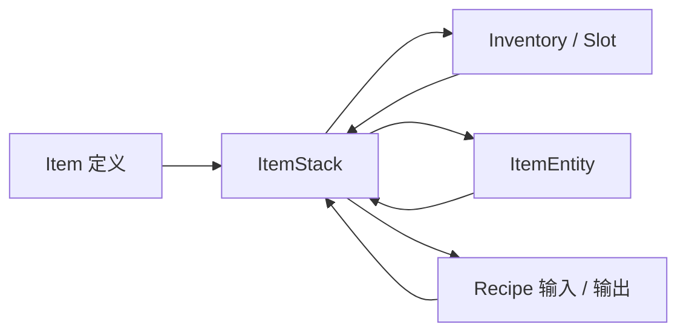
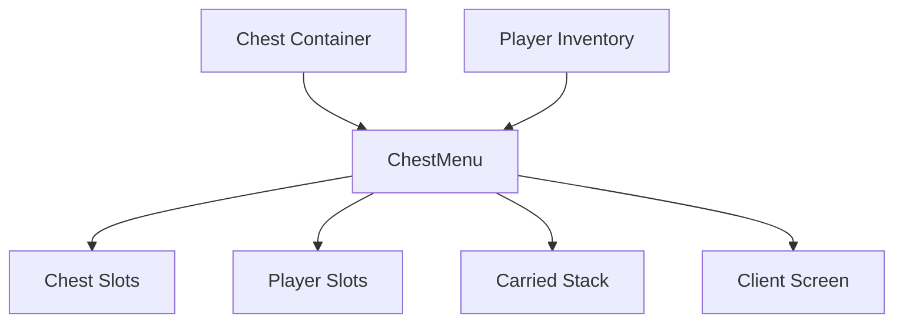
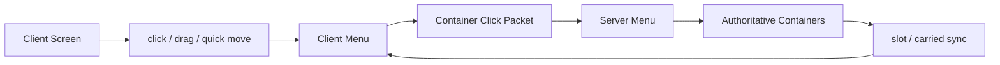
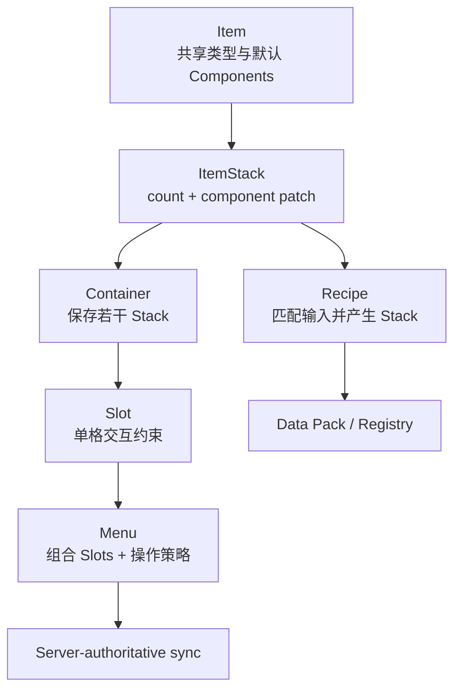

上一章[《实体、移动与 AI》](/impl/entities)里，掉在地上的钻石是一个 `ItemEntity`：它拥有位置、速度和生命周期。但玩家把它捡起来以后，钻石并不会继续作为 Entity 藏在背包里。它失去世界坐标，变成 Inventory 中某个 Slot 里的一份 `ItemStack`。

如果再把这颗钻石丢出去，同一份“物品内容”又会重新被一个 Item Entity 包起来。



这种来回转换揭示了本章真正的问题：Minecraft 所说的“物品”其实不是一个对象类型，而是一组彼此分工的表示。Item 定义“这是什么种类”，ItemStack 表示“这一份具体物品”，Container 保存若干 Stack，Slot 为这些位置增加交互规则，Menu 把多个库存组合成一次交互，而 Recipe 再把一组输入 Stack 映射成新的输出。

因此本章要回答的是：

> **Minecraft 怎样表示“可以被拥有、堆叠、转移、加工和同步”的数据，并让同一件物品在背包、箱子、地面、配方和网络之间保持一致？**

本文主要以 **Java Edition 26.3** 为实现参照。尤其需要注意 1.20.5 以后 Item Stack 已经从任意 `tag` 树迁移到结构化 Data Components；到了 26.3，物品与配方的数据驱动仍在继续扩展，例如酿造配方也正式进入数据包体系。[^components-release] [^release]

## 一件物品在程序里究竟是什么？

玩家眼里“一把钻石剑”是一个完整对象，但实现上至少要区分**物品类型**和**这一份具体物品状态**。

### Item 定义类型，ItemStack 表示实例状态

`Item` 更接近一个注册表中的类型定义。

它描述某类物品共同拥有的默认行为与默认组件，例如：

- 默认最大堆叠数量；
- 默认名称与表现；
- 使用相关能力；
- 工具、食物、武器等属性；
- 一组默认 Data Components。

当前 Java 26.3 的 `Item` 直接暴露 `components()` 和 `getDefaultMaxStackSize()`；真正放进库存、装备栏、Item Entity 或配方输入里的，则是 `ItemStack`。[^item] [^itemstack]

一个 ItemStack 至少需要表达：

```text
Item type
+
count
+
per-stack component differences
```

于是两把 Diamond Sword 可以引用同一个 Item 定义，却拥有不同的耐久、名字、附魔和其他实例数据。

<Callout type="info" title="不要为每一把剑复制整份 Item 定义">
类型级数据应该尽量共享，实例级数据只保存差异。否则十万块完全相同的物品会重复保存十万份名称、最大堆叠数和默认行为。
</Callout>

这和第一章里的 Block / Block State 有某种相似之处，但不要把它们强行等同。ItemStack 还包含数量，并且可以被独立搬运、拆分、合并和嵌入其他对象，它的生命周期与 Block State 完全不同。

### Data Components 把“这一份物品有什么不同”类型化

1.20.5 是 Java 物品数据的一次重要重构。Mojang 把 Item Stack 上长期存在的非结构化 NBT `tag` 替换为结构化 Components，官方给出的动机包括：

- 加载时校验数据；
- 减少未来格式变化时的静默损坏；
- 支持更强的数据驱动内容；
- 改善频繁查询某些物品属性时的性能。[^components-release]

于是过去类似：

```text
ItemStack
└── tag
    ├── Damage
    ├── Enchantments
    ├── display
    └── arbitrary custom fields
```

的结构，逐渐变成：

```text
ItemStack
├── item
├── count
└── components
    ├── minecraft:damage
    ├── minecraft:enchantments
    ├── minecraft:custom_name
    └── minecraft:custom_data
```

关键变化不是“把字段换了名字”，而是 Component Type 本身有明确的类型、Codec 和验证规则。

当前 26.3 的 `DataComponents` 已经包含大量组件，从 `DAMAGE`、`MAX_STACK_SIZE`、`CONSUMABLE` 到 `CONTAINER`、`CHARGED_PROJECTILES`、`ATTRIBUTE_MODIFIERS` 等；`DataComponentType<T>` 也同时定义持久化与网络编码入口。[^data-components] [^component-type]

这让“物品有什么能力”越来越能够通过组合数据描述，而不必全部塞进 Item 子类里的私有字段。

### ItemStack 保存的是默认值之上的 Patch

现代实现还有一个很值得开发者注意的细节。

`Item` 自己拥有一份默认 `DataComponentMap`；`ItemStack` 内部则保存 `PatchedDataComponentMap`。后者不是机械复制所有默认组件，而是持有：

```text
prototype = Item defaults
patch     = this stack's changes
```

最终有效组件可以概念化为：

```text
effective components
=
item defaults
+
stack patch
-
explicit removals
```

`PatchedDataComponentMap` 当前明确拥有 `prototype` 与 `patch`，并能输出 `DataComponentPatch`；ItemStack 的序列化也只需要表达偏离默认值的部分。[^patched-components]

这解决了两个目标之间的张力：

- 默认属性应该由 Item 类型共享；
- 某一份 Stack 又必须允许覆盖甚至移除默认组件。

例如一种 Item 默认可堆叠 64 个，大多数 Stack 不必重复存一遍 `max_stack_size=64`；只有真正覆盖默认值的 Stack 才需要保存差异。

<Impl title="Prototype + Patch 是很实用的物品数据模型">
如果绝大多数实例都和类型默认值相同，不要把完整配置复制到每一个实例。共享 Prototype，再给实例保存 Patch，可以同时获得类型级默认值、实例覆盖与更紧凑的序列化。
</Impl>

### Count 和 Components 共同决定“这一叠是什么”

ItemStack 不是“Item + 一个数量”这么简单。

两叠物品是否能无损合并，至少要考虑：

- Item 类型是否相同；
- 组件状态是否等价；
- 合并后是否超过最大 Stack Size。

当前 `ItemStack` 仍然区分 `isSameItem` 与 `isSameItemSameComponents`。后者明确比较 Item 与组件 patch。[^itemstack]

这意味着：

```text
diamond_sword + damage=10
```

和：

```text
diamond_sword + damage=120
```

虽然是同一种 Item，却不是同一份可交换实例状态。

对于可堆叠物品也是一样。如果两个 Stack 拥有不同 Custom Name、Container Contents 或其他影响身份的 Component，引擎不能只因为 Item ID 相同就把它们的 count 加起来。

这里真正重要的不是 Minecraft 当前有哪些 Component，而是：

> **Stacking 本质上是一条“哪些实例差异允许被合并”的等价关系。**

自研物品系统如果只用 `itemId` 判断能否堆叠，之后加入耐久、品质、随机词条、容器内容或自定义名字时，通常都会重新撞上这个问题。

### ItemStack 和 ItemEntity 仍然是两层

上一章已经提到：

```text
ItemStack in inventory
≠
ItemEntity in world
```

ItemEntity 只是把一个 ItemStack 放进世界运行时，为它增加：

- position；
- movement；
- age；
- pickup delay；
- 合并与拾取行为。

`ItemEntity` 当前直接持有一个同步的 `ItemStack`，并提供 `areMergable` / `merge` 逻辑。[^item-entity]

因此丢出物品不是“给 ItemStack 增加位置”，而是：

```text
Inventory ItemStack
      ↓ remove / split
ItemEntity(ItemStack)
      ↓ pickup
Inventory ItemStack
```

同一份内容数据可以进入不同运行时容器，这是 Minecraft 物品系统贯穿全章的模式。

## 库存为什么不只是一个 ItemStack 数组？

如果只做单机原型，Inventory 完全可以从：

```java
ItemStack[] items;
```

开始。

真正复杂起来以后，会发现“存物品的位置”和“玩家怎样操作这些位置”不是同一件事。

Minecraft 因此把 Container、Slot、Menu 和 Screen 拆成不同职责。

### Container 负责保存一组 ItemStack

`Container` 是最接近“库存数据”的抽象。

玩家背包、箱子、漏斗、熔炉等都需要：

- 按索引读取 Stack；
- 写入 Stack；
- 移除若干数量；
- 判断是否为空；
- 通知内容发生变化。

一个简单容器可以理解成：

```text
Container
├── [0] ItemStack
├── [1] ItemStack
├── [2] ItemStack
└── ...
```

但 Container 本身不必知道这些格子在 GUI 上画在哪里，也不应该承担 Shift-click 的路线。

这是第一层分离：

> **Storage 负责“东西在哪里”；Interaction 负责“玩家能怎样操作它”。**

### Slot 不是数据本身，而是对一个位置的访问规则

`Slot` 通常引用某个 Container 和其中的一个 index，同时增加交互约束：

- 这个 Stack 能不能放进来？
- 玩家能不能拿走？
- 最大数量是多少？
- 拿走物品时是否触发额外逻辑？
- 这是输入槽还是结果槽？

所以两个视觉上相同的格子，规则可以完全不同：

| Slot | 允许放入 | 拿取行为 |
| --- | --- | --- |
| 普通 Chest Slot | 大多数 ItemStack | 普通拿取 |
| Furnace Input | 可熔炼输入 | 普通拿取 |
| Furnace Fuel | 可作为燃料的物品 | 普通拿取 |
| Crafting Result | 通常不能直接放入 | 拿取时消耗输入并处理剩余物 |

当前 26.3 的 `Slot` 仍然提供 `mayPlace`、`mayPickup`、`safeInsert`、`setByPlayer` 等职责。[^slot]

因此 Slot 更像一个**受约束的端口**，而不是 Stack 的所有者。

### Menu 可以把多个 Container 拼成一次交互

打开 Chest 时，屏幕里同时出现：

- Chest 自己的 Slots；
- Player Inventory Slots；
- Hotbar Slots；
- 光标上当前拿着的 Stack。

这些数据不属于同一个 Container，却需要在同一次 Shift-click、拖拽和网络同步中协同。

这就是 `AbstractContainerMenu` 的职责。

当前 26.3 的 Menu 保存：

- `slots`；
- `dataSlots`；
- `carried`；
- `containerId`；
- `stateId`；
- 远端 Slot / Cursor 的同步快照；
- Click / Quick Craft 逻辑。[^menu]



这个模型特别值得自研系统借鉴：

> **一次 UI 交互不一定等于一个存储对象。**

Menu 可以把多个数据源临时组合成一个交互面。

### Carried Stack 是库存操作状态的一部分

玩家用鼠标拿起半组物品以后，那一叠 Stack 已经不在原 Slot，也还没有进入目标 Slot。

它在哪里？

在 Menu 的 `carried` 状态里。

这解释了为什么关闭窗口、断线或发生重新同步时，光标上的 Stack 也必须被认真处理。它不是 UI 上画出来的一张图，而是真正参与物品所有权转移的中间状态。

`AbstractContainerMenu` 当前有独立的 `getCarried`、`setCarried`，全量同步包也会同时携带 Slots 与 Carried Item。[^menu] [^container-content-packet]

所以一次拖拽可以理解成一个小型事务：

```text
source slot
    ↓
carried stack
    ↓
destination slot
```

中间任何一步如果客户端与服务器理解不一致，都可能表现成物品弹回、消失或复制。


### 库存并不要求一定有 GUI

Container 是数据层，因此它可以被其他系统直接读写。

Hopper、Crafter、Command、Loot Table、Mob Equipment 等都可能操作 ItemStack，但它们不需要先“打开一个窗口”。

这让 Minecraft 的库存系统天然成为自动化基础设施：

```text
Container
   ↑       ↑
 Player   Automation
  Menu     Hopper / Crafter / command
```

如果 Inventory 的唯一 API 是“玩家点了哪一个 UI 格子”，红石自动化、服务端逻辑和命令系统都会被迫伪造 UI 操作。

把 Storage API 和 Player Interaction 分开以后：

- 玩家交互可以有权限和点击规则；
- 自动化可以直接做物品转移；
- GUI 只是其中一种访问方式。

这也是为什么下一章红石会读到这里：Comparator 可以读取容器填充程度，Hopper 可以在没有玩家界面的情况下搬运 ItemStack。容器不是 UI 控件，而是世界中的数据结构。

## 配方怎样把“输入变输出”从代码里拆出来？

Inventory 解决的是物品怎样被保存和转移，Recipe 解决的是另一类问题：

> **哪些输入状态可以被识别为某种加工，以及成功以后应该得到什么结果？**

最简单的实现当然可以硬编码：

```java
if (grid.matches("planks", "planks")) {
    return STICK;
}
```

但当配方数量不断增加、地图作者需要修改内容、服务器需要替换结果时，这种方式会迅速变成内容与程序逻辑混在一起的长表。

### Recipe 是 Matcher 与 Transformation

可以先把配方抽象成：

```text
input state
   ↓ match?
Recipe
   ↓ assemble
output ItemStack
```

现代 Java 进一步把输入抽象成 `RecipeInput`，不同加工设备可以提供不同输入结构：

- Crafting Grid 是多格二维 / 一维输入；
- Furnace 是单输入；
- Smithing 有 template、base、addition；
- Brewing 有 input、reagent 等自己的语义。

`RecipeManager` 再统一保存和查询加载后的 Recipe，并为不同 Recipe Type 提供匹配入口。[^recipe-manager]

因此：

> **Recipe 不必知道 GUI 长什么样；它只需要理解一种输入模型。**

这让工作台、自动 Crafter 与其他调用者有机会复用同一套配方逻辑。

### Ingredient 解决“什么算同一种可接受输入”

配方如果只能写：

```text
minecraft:oak_planks
```

那么“任何木板都可以”的配方就要枚举每一种木板。

Ingredient 提供了匹配层。当前 `Ingredient` 本身就是 `Predicate<ItemStack>`，底层可以基于 Item Holder Set / Tag 表达一组可接受物品。[^ingredient]

概念上：

```text
Ingredient: #minecraft:planks
               ↓
oak_planks      ✓
birch_planks    ✓
spruce_planks   ✓
diamond         ✗
```

这里 Tags 的价值不是“给物品多贴几个分类标签”这么简单，而是给配方建立**稳定的集合引用**。新增一种木板以后，只要它进入相应 Tag，依赖这个 Tag 的配方就不必全部改写。

这也是数据驱动系统很常见的间接层：

```text
Recipe
  ↓ references
Tag / Ingredient group
  ↓ contains
Items
```

配方依赖“材料类别”，而不是依赖一份硬编码枚举。

### Shaped 与 Shapeless 其实回答不同的匹配问题

Crafting Recipe 里最容易理解的两类是：

**Shaped Recipe**：

> 输入内容和相对位置都重要。

例如工具通常要求材料形成特定排列。

**Shapeless Recipe**：

> 只关心这一组 Ingredient 是否存在，不关心具体摆放位置。

这两类 Recipe 可以共用 ItemStack、Ingredient、结果 Stack 和 Recipe Manager，但它们的 matcher 完全不同。

因此数据驱动不等于：

> 所有配方都变成一个万能 JSON Schema。

更准确的是：

> **不同算法拥有自己的数据 Schema，而共同的装载、Registry、Ingredient 和结果表示被复用。**

### Recipe 数据可以热更新，算法能力仍然有边界

Java 的大量配方来自 Data Pack。1.20.5 已经允许 Crafting、Stonecutting、Smithing 和 Cooking 等 Recipe 的结果直接带 Data Components；到了 26.3，Potion Brewing Recipe 也正式数据驱动，可以通过数据包增加或覆盖。[^components-release] [^brewing]

这意味着创作者可以在不重新编译游戏代码的情况下改变：

- Ingredient；
- 输出 Item；
- 输出数量；
- 输出 Components；
- 一些加工参数。

但数据驱动并不自动意味着“可以创造任意新机制”。

如果现有 Recipe Type 只会：

```text
match inputs
→ create ItemStack
```

那么 JSON 不会凭空让工作台开始：

- 修改世界地形；
- 召唤一套新模拟系统；
- 执行任意程序；
- 发明一种从未存在的交互设备。

<Callout type="info" title="数据驱动改变的是参数边界，不是计算能力本身">
Recipe JSON 能描述什么，取决于 Recipe Type 暴露了什么 Schema 和执行逻辑。想让内容作者拥有新的“动词”，仍然需要引擎先提供新的算法或可组合机制。
</Callout>

这条边界会在第 12 章《数据包、资源包与数据驱动》里继续展开。本章只关心配方为什么天然适合成为数据：它本质上就是一组结构化输入到 ItemStack 输出的映射规则。

### 26.3 的 Brewing 很能说明“硬编码可以逐渐被数据替代”

酿造长期比普通 Crafting 更特殊。

到了 Java 26.3，Mojang 将 Potion Brewing Recipes 正式改为数据驱动。Recipe 可以声明：

- input Item；
- 可选 Potion Contents 条件；
- reagent；
- output ItemStack 及 Components。[^brewing]

例如“Water Potion + Nether Wart → Awkward Potion”不再必须只存在于硬编码的 Brewing Table 中，而可以表示成数据。

这个变化很适合作为长期架构演化的例子：

> **成熟游戏不一定一次就做到彻底数据驱动。更常见的是先把稳定、重复、内容量大的规则逐步提取出代码，而把真正需要算法的部分继续保留在程序里。**

## 一次库存点击为什么是网络操作？

单人玩家拖动一组木板时，看起来只是 GUI 中一个图标从左边移到右边。

在客户端—服务器架构里，这实际上涉及一份有价值的共享状态：

> **服务器认为这一格里现在有多少 ItemStack？**

如果客户端能够单方面决定答案，那么修改客户端就等于可以直接创造物品。

因此多人库存必须围绕服务器权威设计。

### Screen 负责显示，Menu 承担交互状态

客户端 `Screen` 负责：

- 画背景；
- 画 Slot；
- 处理鼠标位置；
- 显示 Tooltip；
- 把用户输入转换成 Menu 操作。

真正跨客户端—服务器对应的则是 Menu：



这也解释了为什么一个 Screen 不应该直接拥有箱子里的真实物品数据。UI 可以关闭、重建、换皮肤，而 Inventory 状态仍然属于世界和服务器。

### Container ID 和 State ID 用来确定“你操作的是哪一版状态”

当前 26.3 的 `AbstractContainerMenu` 保存 `containerId` 和 `stateId`；服务端发出的单 Slot / 全量 Container 更新也携带 State ID。[^menu] [^container-slot-packet] [^container-content-packet]

客户端发送 `ServerboundContainerClickPacket` 时同样会带：

- container ID；
- state ID；
- slot；
- button；
- input type；
- 发生变化的 slots；
- carried item 的摘要状态。[^container-click]

这不是单纯为了让协议字段变多。

它解决的是一个典型并发问题：

```text
Client thinks state = N
        ↓ click
Server is already at state = N + 1
        ↓
cannot blindly apply stale assumption
```

网络有延迟，Hopper 可能同时改变箱子，另一个系统也可能修改 Inventory。状态版本让双方至少能够知道：

> 这次输入是基于哪一版库存提出的？

这是任何多人可编辑共享状态都会遇到的问题，不只属于 Minecraft。

### 26.3 甚至不必在点击包里重复发送完整 Stack

当前 `ServerboundContainerClickPacket` 对客户端报告的 changed slots 和 carried item 使用 `HashedStack`。`HashedStack` 可以根据 ItemStack 创建摘要并用于匹配。[^container-click] [^hashed-stack]

这件事体现了 Component 化以后的另一个价值。

如果一个 ItemStack 带有大量 Components，客户端每次拖动时都把所有数据完整重复发送，既浪费带宽，也没有必要把客户端副本当作权威。

更合理的是：

```text
客户端：
“我认为这几格现在对应这些 Stack 状态”

服务器：
“我验证操作，并保留真正权威 ItemStack”
```

真正的协议细节会继续变化，但原则相对稳定：

> **客户端发送操作与必要的状态证据，服务器决定最终库存。**

### 同步不能只盯着 Slot，Carried Stack 也必须同步

一个常见的库存同步 bug 是：

- 服务端 Slot 正确；
- 客户端 Slot 正确；
- 但光标拿着的 Stack 不一致。

这依然足以产生看似重复或丢失的物品。

因此当前 `AbstractContainerMenu` 不仅保存远端 Slots，也保存 `remoteCarried`；`ClientboundContainerSetContentPacket` 也把整组 ItemStack 与 Carried Item 一起发给客户端。[^menu] [^container-content-packet]

也就是说，库存同步的真正状态是：

```text
slots
+
carried stack
+
menu-specific data
+
state version
```

而不是一份简单的数组。

### Shift-click 是规则，不是“移动到另一个数组”

Quick Move 看起来只是按住 Shift 点击。

但一个 Menu 可能拼了多个 Slot 区域：

```text
Furnace:
[ input ][ fuel ][ result ]
--------------------------
[ player inventory       ]
[ hotbar                 ]
```

当玩家 Shift-click Coal 时，到底优先进入 Fuel、Input 还是玩家背包？

这不是 ItemStack 自己能回答的问题。

所以 `AbstractContainerMenu` 把 `quickMoveStack` 留给具体 Menu 实现。ChestMenu、FurnaceMenu、HopperMenu、MerchantMenu 等可以根据自己的 Slot 分区定义路由。[^menu]

这再次说明：

> **Slot 是局部约束，Menu 是跨 Slot 的交互策略。**

把这两层拆开以后，新设备可以重新组合相同 Container / Slot 基础设施，而不必修改 ItemStack 本身。

## Item 数据为什么会成为版本兼容的难点？

世界生成算法变化，只影响尚未生成的区域。

Item Stack 格式变化则不同：旧世界里几乎到处都有物品实例。

它们可能存在于：

- Player Inventory；
- Ender Chest；
- Chest / Barrel / Hopper；
- Mob Equipment；
- Item Entity；
- Item Frame；
- Bundle / Container Component；
- Shulker Box 内部；
- Villager Trade；
- 其他 ItemStack 嵌套结构。

因此物品 Schema 一旦发生变化，迁移范围会非常广。

### 1.20.5 的 Components 不是单纯换字段名

Mojang 在 1.20.5 明确说明，这是一次 breaking change：原来的非结构化 Item `tag` 被结构化 Components 替换，旧自定义数据在升级时会迁入 `minecraft:custom_data`。[^components-release]

例如旧概念：

```text
tag.Damage
tag.Enchantments
tag.display.Name
```

分别进入有明确结构的 Component。

这样做的收益包括：

- 类型校验；
- 更清晰的默认值；
- 单独编码 / 比较组件；
- Data Pack / Commands 使用统一语义；
- 新的物品行为可以逐步数据化。

代价就是：

> **所有已经保存的 ItemStack 都必须还能被新版本解释。**

这正是第二章版本迁移问题在具体领域中的一次实例。

### custom_data 保留“系统不知道但用户仍想保存”的数据

结构化并不意味着完全禁止扩展。

`minecraft:custom_data` 继续允许保存任意自定义数据；1.20.5 升级时，无法归入原版结构组件的旧 Item Tag 内容会被放进这里。[^components-release]

这形成一个很实用的双层模型：

```text
Known structured data
→ typed Components

Unknown / custom extension data
→ custom_data
```

如果所有内容都强制进入官方固定 Schema，地图作者和扩展生态会失去逃生口。

如果所有内容都塞进任意 Map，引擎又无法可靠验证核心属性。

两层并存，是 Schema 安全和开放扩展之间更现实的折中。

### 默认值也会影响持久化兼容

现代 ItemStack 的 Components 是 Prototype + Patch。

这意味着默认值变化时，需要非常小心区分：

- 这个旧 Stack 没有保存某 Component，是因为它当时使用默认值？
- 还是因为它明确移除了默认 Component？
- 新版 Item 的默认值变了以后，旧 Stack 应该继承新默认，还是保留旧行为？

`DataComponentPatch` 能表达设置和移除，正是因为“没有 override”和“显式 remove”语义并不相同。[^patched-components]

这是很多配置系统都会遇到的问题：

```text
missing
≠
explicit null / remove
≠
explicit default value
```

如果自己的游戏允许物品类型定义不断更新，又要保存长期世界，这三种状态最好一开始就想清楚。

### Container Item 会让 ItemStack 形成嵌套

Bundle、Shulker Box 一类物品让 ItemStack 里继续保存其他 ItemStack。

当前 Components 中存在 `CONTAINER`、`BUNDLE_CONTENTS`、`CHARGED_PROJECTILES` 等内容型组件。[^data-components]

于是对象结构可能变成：

```text
ItemStack: shulker_box
└── container component
    ├── ItemStack
    ├── ItemStack
    └── ItemStack
        └── components ...
```

这会让序列化、迁移、最大数据量和网络同步都更值得关注。

但不应该因此得出“嵌套库存一定错误”的结论。它提供了非常强的玩法能力，问题只是：

> **一旦允许容器嵌套，ItemStack 就不再是永远很小的值对象。**

编码、复制、比较和传输时都要意识到这一点。

## 这些分层真正解决了什么？

到这里，Item、ItemStack、Container、Slot、Menu、Recipe 看起来像很多名字。

如果重新按职责排列，其实非常清楚：



每一层只多回答一个问题：

| 层 | 回答的问题 |
| --- | --- |
| Item | 这是什么类型？ |
| ItemStack | 这一份具体物品有什么状态、有多少？ |
| Container | 这些 Stack 存在哪里？ |
| Slot | 这个位置允许怎样放入 / 取出？ |
| Menu | 多组 Slot 怎样组成一次玩家交互？ |
| Recipe | 哪组输入可以转换成什么输出？ |
| Network Sync | 客户端和服务器怎样同意当前状态？ |

这也是本章最重要的开发者结论：

> **不要让“物品”一个对象同时承担类型定义、实例状态、存储位置、UI 行为、配方规则和网络权威。**

这些职责在小游戏里可以暂时揉在一起，但随着：

- 自动化；
- 多人网络；
- 数据驱动；
- 长期存档；
- 自定义内容；

逐渐加入，它们一定会开始互相拉扯。

## 这一章留下什么

Minecraft 的 Item 不是背包里那一个图标。`Item` 是共享的类型定义；`ItemStack` 才是可以被拥有和转移的实例状态，它由 Item、Count 与 Components 组成。现代 Components 又进一步采用默认值加 Patch 的结构，让大多数实例复用 Item 默认数据，只保存自己的差异。

库存系统继续把职责拆开：Container 保存 Stack，Slot 给位置增加交互约束，Menu 把来自多个 Container 的 Slots 组合成一次交互，并连同 Carried Stack 和 State ID 一起参与客户端—服务器同步。玩家看到的是一个 Screen，服务器维护的却是一组明确的状态所有权。

Recipe 则建立在 ItemStack 之上，把输入匹配和输出生成变成可加载的数据。Tags / Ingredients 让配方依赖材料集合而不是硬编码枚举；新的 Recipe Type 和 Data Components 又不断扩大数据驱动的范围。26.3 把 Brewing Recipe 也迁入数据包，就是这种长期演进的最新例子之一。

对开发者来说，最值得继承的是几条边界：**类型默认值与实例差异分离；库存存储与 Slot 规则分离；数据容器与 GUI 分离；配方数据与加工算法分离；客户端操作与服务器权威分离。** 当这些边界清楚以后，堆叠、拖拽、自动化、配方和网络同步才不会全部挤进同一个 `Item` 类里。

下一章进入本部最依赖执行顺序的系统：Redstone。方块更新已经告诉我们“变化会传播”，Tick 已经告诉我们“传播有先后”；当信号、Piston、Observer 和历史行为叠在一起时，为什么同一组方块只因为更新顺序不同，就可能得到完全不同的机器结果？

[^release]: Mojang Studios，《Minecraft Java Edition 26.3》，2026-09-15。官方 changelog 见 https://www.minecraft.net/ko-kr/article/minecraft-java-edition-26-3

[^components-release]: Mojang Studios，《Minecraft Java Edition 1.20.5》，2024-04-23。该版本正式以结构化 Item Stack Components 替换旧 `tag`，说明了验证、性能与数据驱动等迁移动机，并保留 `minecraft:custom_data` 作为自定义数据容器。见 https://www.minecraft.net/en-us/article/minecraft-java-edition-1-20-5

[^item]: Java 26.3 `Item` 当前持有默认 `DataComponentMap`，并暴露 `components()` 与 `getDefaultMaxStackSize()` 等接口。见 NeoForge 26.3 映射 Javadoc：https://aldak0.ru/javadoc/26.3.x/net/minecraft/world/item/Item.html

[^itemstack]: Java 26.3 `ItemStack` 是最终实例容器，当前直接持有 `count` 与 `PatchedDataComponentMap components`，并提供 `isSameItem`、`isSameItemSameComponents`、`isStackable` 等实例比较接口。见 https://aldak0.ru/javadoc/26.3.x/net/minecraft/world/item/ItemStack.html

[^data-components]: Java 26.3 `DataComponents` 当前注册大量 Item / Entity / Block 相关结构化组件，包括 `MAX_STACK_SIZE`、`DAMAGE`、`CONSUMABLE`、`CONTAINER`、`BUNDLE_CONTENTS` 与 `CHARGED_PROJECTILES` 等。见 https://aldak0.ru/javadoc/26.3.x/net/minecraft/core/component/DataComponents.html

[^component-type]: Java 26.3 `DataComponentType<T>` 当前具有持久化 Codec、Stream Codec 等结构化编码能力。见 https://aldak0.ru/javadoc/26.3.x/net/minecraft/core/component/DataComponentType.html

[^patched-components]: Java 26.3 `PatchedDataComponentMap` 当前明确由 `prototype` 和 `patch` 组成，可以输出 / 应用 `DataComponentPatch`，并区分默认组件与实例修改。见 https://aldak0.ru/javadoc/26.3.x/net/minecraft/core/component/PatchedDataComponentMap.html

[^item-entity]: Java 26.3 `ItemEntity` 直接保存 ItemStack，并提供 `areMergable` / `merge` 等地面物品合并行为。`ItemStack` 在 Entity、Inventory、Equipment、Recipe 等大量系统间被复用。见 https://aldak0.ru/javadoc/26.3.x/net/minecraft/world/item/class-use/ItemStack.html

[^slot]: Java 26.3 `Slot` 作为 Container 中某一位置的交互封装，提供 `mayPlace`、`mayPickup`、`safeInsert`、`setByPlayer` 等接口。见 https://aldak0.ru/javadoc/26.3.x/net/minecraft/world/inventory/Slot.html

[^menu]: Java 26.3 `AbstractContainerMenu` 当前保存 Slots、DataSlots、Carried ItemStack、container ID、state ID、remote slot snapshots 与 ContainerSynchronizer，并实现 Click、Quick Craft 与同步逻辑。见 https://aldak0.ru/javadoc/26.3.x/net/minecraft/world/inventory/AbstractContainerMenu.html

[^recipe-manager]: Java 26.3 `RecipeManager` 当前实现 `RecipeAccess`，维护 RecipeMap、Recipe Display、Recipe Property Sets，并对不同 `RecipeInput` / `RecipeType` 提供查询。见 https://aldak0.ru/javadoc/26.3.x/net/minecraft/world/item/crafting/RecipeManager.html

[^ingredient]: Java 26.3 `Ingredient` 当前实现 `Predicate<ItemStack>`，基础实现围绕 Item Holder Set / Tag 构成输入集合，并可用于 Recipe matching。见 https://aldak0.ru/javadoc/26.3.x/net/minecraft/world/item/crafting/Ingredient.html

[^brewing]: Mojang Studios，《Minecraft 26.3 Snapshot 3》与 26.3 正式版。26.3 将 Potion Brewing Recipes 改为数据驱动，可由 Data Pack 新增 / 修改，并允许 input / reagent 对 Potion Contents Component 做条件匹配。见 https://www.minecraft.net/en-us/article/minecraft-26-3-snapshot-3 与 https://www.minecraft.net/ko-kr/article/minecraft-java-edition-26-3

[^container-click]: Java 26.3 `ServerboundContainerClickPacket` 当前包含 container ID、state ID、slot、button、`ContainerInput`、changed slots 与 carried item；changed slots / carried item 使用 `HashedStack`。见 https://aldak0.ru/javadoc/26.3.x/net/minecraft/network/protocol/game/ServerboundContainerClickPacket.html

[^hashed-stack]: Java 26.3 `HashedStack` 可以从 ItemStack 生成摘要，并根据 `HashedPatchMap.HashGenerator` 与权威 Stack 进行匹配。见 https://aldak0.ru/javadoc/26.3.x/net/minecraft/network/HashedStack.html

[^container-slot-packet]: Java 26.3 `ClientboundContainerSetSlotPacket` 当前包含 container ID、state ID、slot 与 ItemStack。见 https://aldak0.ru/javadoc/26.3.x/net/minecraft/network/protocol/game/ClientboundContainerSetSlotPacket.html

[^container-content-packet]: Java 26.3 `ClientboundContainerSetContentPacket` 当前同步 container ID、state ID、完整 ItemStack 列表与 Carried ItemStack。见 https://aldak0.ru/javadoc/26.3.x/net/minecraft/network/protocol/game/ClientboundContainerSetContentPacket.html
