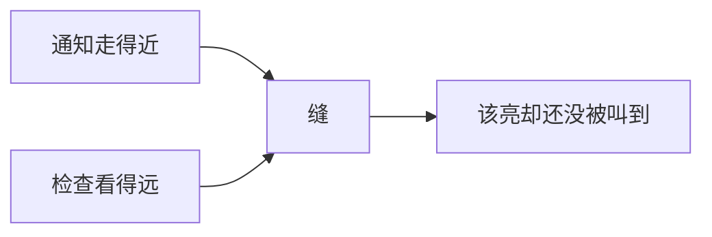

> **本章命题**：红石的「错误」只要稳定、可复述、被写进教科书，就是社区 API。官方一旦按电路图把它修正确，修的不是灰，是语言。兼容性高于正确性时，怪癖会变成平台。

## 问题

某次快照改了活塞的更新通知范围，飞行器停了，农场停了，生存服的核心设施连夜出补丁。聊天里没有人说「终于符合电学」，他们说语言被删了。Wiki 上的红石和游戏里的粉不是一回事。设计合同在卷二（[《红石：把物理做成编程》](/design/redstone)）：可误用。本章写实现：未定义行为如何成为社区 API？

可被证伪的说法是：准连接和 BUD 是还没擦干净的 bug，擦完红石会更公平，社区会感谢诚实。只要 MC-108 还被标成 Works as Intended、只要观察者把「侦测更新」收编成方块之后活塞 BUD 仍在跑、只要同一张 Java 图纸在 Bedrock 上对不上时序，这句话就不成立。

上一章（[《物品、库存与合成》](/impl/items)）把口袋写成权威协议，漏斗把栈衔进红石钟；再上一章（[《游戏循环与刻》](/impl/tick)）把刻写成共享真实，粉（红石粉，下文沿用社区口呼）、中继器、活塞不在同一班；邻居图则是[《光照、流体与方块更新》](/impl/light-fluid-updates)的账单。红石是这张图上最会编程的那一层。本章不要搭建步骤，但准连接和 BUD 必须说清成因。说清成因的意思是：能指着具体机制讲——检查函数多看了一格，更新通知却走不了那么远。指得着，才不是玄学；指不着，社区会继续用口口相传的口令代替规格，官方会继续用「修 bug」代替立法。两种代替撞在一起，就是革命。

<Cards>
  <Card title="可误用是合同" href="/design/redstone" description="官方停在物理。教科书长在外面。" />
  <Card title="游戏刻不是红石刻" href="/impl/tick" description="尺子先分开。时序在这里。" />
  <Card title="两条因果" href="/history/java-bedrock" description="删掉 Java 或 Bedrock，灯常常不成立。" />
</Cards>

## 为什么「修 bug」会引发红石革命

普通游戏修 bug，玩家说谢谢；红石修 bug，有人说革命。差别在于：社区早已把观察结果当成说明书。说明书不在 jar 里，它在 Wiki、在视频、在生存服核心里冻住的旧时序。改通知走多远、改活塞先伸哪一边、改粉会不会在同一刻里把线走完，都等于改指令集。指令集一变，飞行器不是「坏了」，是一段程序在新 CPU 上行为未定义。

观察者的诞生是一次收编。1.11 把「侦测方块变化」做成方块，等于承认 BUD 是需求。[^obs] 收编没有消灭活塞上的那套。需求还在：有人要侦测更新，有人要侦测「该亮却还没被通知」。后者不是观察者的子集。修掉后者，观察者仍在，语言少一块。

所以革命不是矫情。革命是：这套物理没有官方指令表，指令表是玩家从因果里读出来的。读出来的东西一旦稳定，修复就是立法。立法可以。立法时若假装自己在擦灰，聊天会炸。炸的是作者席被收回，不是灯不该更像电。

1.16 的快照把这件事写进了公开记录。20w18a 让粉的**看见的连线**和**真正供电的方向**对齐：看起来连着的才给旁边的方块电，看起来没连的就不给。[^18a] 工单上这是修「视觉与逻辑两套标准」。墙上这是：曾经靠「看起来没连、逻辑上却在供电」省空间造出来的紧凑机器，突然少了一条动词。对齐没有整场撤回——它进了 Java 1.16 正式版。随后加上的是减压阀：孤立粉可在十字和圆点之间切换，圆点不给四周供电。[^dot] 减压阀承认：连「这一格粉朝哪说话」也已经是语言。准连接没有在那一轮被拿掉。修一个地方会在别处裂开，不是阴谋，是这台隐式 VM 没有模块边界。裂开之后有的改留下，有的用新开关补回旧语义。留下和补回都是立法。立法的测试集在墙上，比快照说明大。

新积木同样会改指令集，哪怕没有人喊「修 bug」。粘液块让一只活塞的手一次能带走一串格；蜂蜜块改的是实体怎么跟着走。飞行器口语能膨胀，不是有人解锁了关卡，是手变长了。[^slime] 漏斗和比较器让口袋能被粉读到（上一章[《物品、库存与合成》](/impl/items)已写）。标靶把粉的转向收成方块。合成器把配方收进能被信号驱动的格。[^crafter] 每一次都像在加零件。每一次都在给已经写好的程序换 ALU。零件可以欢迎。换 ALU 仍是立法。立法的账单按已经起飞的那一层计。

Java 与 Bedrock 从一开始就不是同一份指令表。准连接只活在一边。Bedrock 的红石甚至可以不跟主循环同一条队伍。粉的圆点状态、粉的视觉与逻辑是否必须对齐，两边也不是同一场革命。同一张原理图，两边的灯可以不一样亮。分叉让「修正确」无法写成一个版本号。能写成的是：每一边都有自己已经被写进教科书的怪癖。怪癖被修，那一边革命。

<Memoir title="飞行器停了">
快照说明写着修复活塞。生存服的冰道还在。天上的那一层停了。不是有人不会玩。是那一层靠一份从未写进手册的通知顺序起飞。顺序一改，程序还在坐标上，语义断了。口令「又革命了」能当政治，因为停的是语言，不是一盏门灯。
</Memoir>

## 信号模型：强度、充能、准连接

红石不是电。实现上它是格子上的整数：0 到 15。粉每走一格减一；中继器把数补回 15，并跨过两游戏刻；比较器做的是读和减，不是运放。[^dust] 信号穷得只剩一个整数，反而正好当逻辑用。也因为穷，「弱」和「强」必须被发明——两者不是电压高低，是**谁有资格再去点亮旁边的粉**。

粉一身两职：它是线，也是电源。线的形状（十字、边、圆点）会改变它朝哪一格说话。20w18a 之后，Java 更坚持「你看见它连着，它才给那边电」。看见与说话对齐，对新手是诚实。对已经把「没连上也在供电」写成紧凑语法的人，是一次删词。Bedrock 没有把圆点做成同一种可切换的状态。合写的是：粉占格、力是整数、会衰减。分写的是：这一格粉的形状算不算指令。

**弱充能**：粉铺在方块上，这个方块算被（弱）充能，能激活邻接的门、灯、活塞，但通常不能再给邻接的粉供电。**强充能**：中继器或比较器头朝方块，这个方块能给邻接的粉供电。社区说的「硬充 / 软充」就是这件事。官方从没有发过一张电路课；模型是：充能不是方块上存的一个 bit——没有「本格已充电」这种状态被普遍存下来。组件是在被通知的时候，去看邻居够不够格；看的规则因组件而异。正因因组件而异，同一根粉，活塞和门可以得出两个答案。

中继器还多一条锁：侧面被另一只中继器（或比较器）顶住时，它冻结当前输出，不再理输入。[^rep] 锁不是电学里的高阻态。锁是：计划刻那一班被叫停，格上的数暂时变成常量。比较器的减法模式和容器读取，是把上一章的口袋接进这台 VM：箱子多满，信号多强。[^cmp] 漏斗每一刻想物品；比较器把想的结果收成 0–15。财产和因果在同一根粉上见面。见面之处没有官方「库存总线」。见面之处是：有人发现容器能被读，Wiki 把读法写成零件。

火把是另一条会自己停的指令。闪得太勤，它会熄一阵，直到再被通知。[^torch] 这不是电学过载。这是调度器给高频振荡加的保险丝。保险丝会改变钟的时序，于是也进入教科书：有人靠它停，有人被它坑。官方可以当它是保护。社区当它是 opcode。当它是 opcode 之后，拿掉保险丝就是删词。留下保险丝，某些钟必须绕开它。绕开仍是阅读。阅读写进 Wiki，保险丝就升级成平台的一部分。Bedrock 的火把和 Java 的熄灭条件不必同一份。合写的是：高频振荡会被节流。分写的是：节流之后谁还能亮。

**准连接**是这条「去看邻居」多看了一格。活塞、发射器、投掷器判断「我该不该动」时，除了查自己所在的格，还会查**上方那一格**有没有东西处于激活状态——哪怕那一格是空气。于是一个经典的场面可以成立：活塞头顶放一块实心方块，方块顶上铺一根粉，粉隔着方块把下方的活塞点亮。[^qc] 成因不是神秘学。成因是：这些机构复用「这一格该不该亮」的检查时，把检查坐标往上偏了一格——检查函数把这台机器当成了一块普通方块来问：「如果有电源作用在你头顶那格，你会不会亮？」偏完，空气也算被问到的空间。问到了，就准连接。

它为什么常和 BUD 缠在一起：粉和中继器发出的更新通知，历史上多半只走得出大约两格。准连接却能让「该亮」的判定落在三格外。于是活塞可以进入一种状态：**按规则该动，却还没收到通知**；下一次任何方块更新点到它，它才补做那次该做的检查——这次补做，就是后文的更新式 QC。MC-108 把这类现象标成 Works as Intended。[^wai] 标成意图，不是标成电路正确；标成意图，是承认已经有人靠它造墙。制作台没有准连接，说明这不是「所有方块的天性」，是这几个机构的检查函数写远了。远出来的那一格，就是语言。



图不是电路。它只钉死成因：两边半径不一致，状态机就会卡在「该变未变」。把通知补到和检查一样远，准连接式 BUD 会少一条路。把检查收短到只看自己那一格，准连接消失。两条路都是立法。两条路都会让墙上已有的程序换语义。

```java
boolean shouldActivate(Piston p) {
  return isPowered(p.pos()) || isPowered(p.pos().above()); // 示意：上方那格哪怕是空气
}
```

示意不是源码。Bedrock 没有这句或。同一张活塞墙，护照先问你在哪条产品线。

Bedrock 把红石刻拆成产出与消费两段，合起来仍是两游戏刻。粉可以每游戏刻改一次力，看起来却只在其中一段刷新（尺子在那边已经分开，见[《游戏循环与刻》](/impl/tick)）。本章要补的是：两段式让「同一刻里谁先说话」变成另一套口令。Java 的更新顺序教科书不能当译本。译本会把灯点错。合写只剩合同：信号是整数，占格，能推方块。分写从准连接开始，一直写到班次。

<Impl title="没有『方块已充电』这一格状态">
许多「充能」是查询，不是存档字段。查询发生在有人通知的时候。通知走不远，查询看得远，中间那截差就是 BUD 的缝。把充能做成每格一个真正的 bit，准连接会消失，机器会更干净，二十年墙也会重写。
</Impl>

<Note>
删掉句中的「Java」，准连接句子不成立。合写的是：信号是 0–15 的整数，占格，能推方块。分写的是谁去看上方那一格。
</Note>

## 活塞与更新顺序；BUD 作为社会 API

活塞是红石接到世界上的手。信号不只点灯，还改格；改格，计算才有身体——门、飞行器、能把方块当磁带的装置。这只手要分班次，不是分电压。中继器和火把把延迟写进计划刻：预约未来某一刻再醒。活塞被通知时先检查该不该动，再排一条方块事件；真正把格变成「正在移动」、把方块带走，发生在方块事件那一班。检查若恰好落在实体或方块实体那一班之后，事件往往要等到下一刻才开始——于是链式活塞会比「两游戏刻伸完」再晚一截。[^tick] 两截之间，别的粉还可以再改一次。所以「立刻」在循环里是班次。班次对不上，社区叫半刻、零刻：同一游戏刻里电源被放上又被撤走，机构看见一次脉冲，墙上的钟却还没走到下一个红石刻。这里不要步骤，要成因：同一刻里，通知、计划、实体、事件并不是同一个时刻。Bedrock 的活塞更死：启动延迟钉在两游戏刻，而且只在消费那一段红石刻认输入。删掉 Java 或 Bedrock，「这只活塞何时出手」就不是同一个词。

**更新顺序**是隐式图的遍历次序。六个邻居谁先被点名，哪一根粉先减到 0，哪一只活塞先报名。次序是确定的，所以能被读成语言。次序几乎不写在官方说明书里，所以语言长在 Wiki。改次序等于换 opcode 的大小端。飞行器、瞬间线、某些钟，吃的是次序，不是 15 档本身。一次「更合理的邻接遍历」会引发革命，因为合理是电路课的词，次序是这台虚拟机的词。

次序还跟区块接缝有关。粉跨过区块边界，通知可能晚一截，也可能在加载顺序里换一个方向先说话。同一种子、同一朝向，两台机器若跨在不同的区块柱上，仍可能对不上时序。这不是随机，这是：虚拟机的内存按区块分页，页与页之间没有一条官方总线。生存服把核心装置做成区块对齐的，常常不是为了好看，是为了让这台 VM 的页边界别切在程序中间。切在中间，教科书失效；失效的那一夜，也会被叫成革命。

**BUD**（方块更新检测器）是一种状态机：机构已经该变，还在等一次邻居通知。准连接是制造这种状态的常见办法，不是唯一办法。卡住的活塞、某些组件各自的更新半径，都能长出同类的缝。[^bud] 观察者是合法的侦测器：方块变了，它眨眼。BUD 是侦测「变了却还没告诉我」。两种侦测不要收成一种零件。收成一种，你会以为发了观察者身份证，民间那条 opcode 就注销了。没有注销。社会 API 的意思是：Wiki 把它写成零件，视频把它当积木，核心把它当不能破坏的时序。官方没有发布 BUD。社区发布了。发布之后，修缝就是下架零件。下架可以。下架时若只说「那本来就不是功能」，墙上的人会听见「你们读错了说明书」。说明书在他们那边。

观察者没有消灭 BUD，正如配方书没有消灭九格。收编承认需求。需求若只被收编一半，另一半仍在墙上。制作台没有准连接，观察者没有把活塞的检查函数改短。短了，墙会塌。塌完灯更老实。老实不是这台虚拟机的 KPI。

粘液和蜂蜜把这只手乘上一个系数。一只活塞能推的不再是「它正对着的那一格」，而是被粘在一起的一组。飞行器能从玩具变成交通，是因为副作用的半径变了：一次方块事件改的是一片，不是一格。[^slime] 改半径不是加关卡。改半径是让同一套更新顺序能搬一座房子。搬房子的程序仍然写在从未印刷的指令表上。指令表一改，天上那一层停的就不是一盏灯。

<Callout type="warning" title="零搭建">
能指着「该亮却还没被通知」就够了。下一格中继器朝哪、沙子怎么掉，不在本章。成因是检查函数看远了、通知走近了。图纸是攻略。
</Callout>

<Alternative title="若活塞只看自己那一格">
准连接消失。活塞墙要多一圈粉。BUD 少一条路。教程会更像电路。飞行器和某些农场要重写。你得到更可测的机构。你失去的是：空气那一格也被算进语言。语言已经写在十年的服上。
</Alternative>

## 未定义行为变成接口的社会过程

接口不从 Javadoc 来。它走一条很慢的河。

先有可复现的怪。同一种子、同一朝向、同一刻，灯的状态能被截图。能截图，就能教。能教，Wiki 就收条目。条目稳定，视频就用它当积木。生存服不敢更新，不是因为懒，是因为积木已经焊进冰道和农场。工单系统里，有人标 Bug，有人标 WAI。WAI 一旦盖章，怪癖升级成平台：你不能再假装自己不知道有人靠它说话。[^wai] MC-108 不是一张普通工单。它把「活塞去看上方那一格空气」从可修的失误，写成意图。意图一旦公开，社区 API 就有了宪法条文。条文可以废。废条文要走立法，不能走「我们擦了一下灰」。Bedrock 从未签署这条。那边的宪法是另一本：两段式红石刻、没有准连接、另一套活塞启动延迟。同一品牌下两部宪法，误用无法完整跨境传播。跨境失败不是翻译事故。跨境失败证明：社区 API 绑定的是实现，不是商标。

然后出现两种立法者。官方改通知范围，以为在修正确；社区这一边——服务器插件、Carpet 一类调试工具、Paper 的兼容开关——把旧时序冻住，以为在保护语言。两边都对。对的不是电学，对的是：这套程序没有规格书，规格书是社会过程；过程的产物叫社区 API。API 的测试集是世界上还在转的机器，不是单元测试。机器一停，就革命。

测试怎么做，也暴露了这台 VM 脏在哪。回归不是断言函数返回值。回归是把一座结构从原理图贴回世界，看飞行器还飞不飞、看漏斗钟还跳不跳。结构方块、原理图工具、种子录像，都是民间测试架。官方快照说明写「修了粉的连线」，测试架上灭的是十年前一座没人提交过 PR 的冰道。Mojira 是立法会：WAI 盖章，等于把一条民间 opcode 收进平台；Unresolved 挂着，等于这条 opcode 还在试用。YouTube 和 Wiki 是发行渠道：能教的才算稳定。不能教的，只是某个人存档里的奇迹。奇迹不成 API。能截图、能复述、能让别人在另一张图上复现的，才成。

模组把这件事写得更硬。Carpet 一类工具把更新顺序、随机刻、甚至红石的边角冻成可开关的实验。开关的存在本身就是证词：有人需要旧 CPU。Paper 的兼容开关为的是生存服不敢更新时，语言还在。这不是开服手册。这是：第二作者已经在运行时里立法，正作每一次「修正确」，都要和这份运行时对账。对不上，核心留下旧版，或者把开关打开。留下旧版，是用版本号当指令集版本。打开开关，是用配置文件当补丁。两种都在说：墙上的时间比工单上的正确性贵。

兼容性高于正确性，发生在测试集已经比规格大的时候。红石的测试集是十年误用。正确性是「活塞不该看空气」。兼容性是「看空气的那一万台机器还要转」。高于，不是永远不修。高于是：修的成本按机器数计，不按工单数计。存储章把格式改革写成按对象计费。红石把时序改革写成按已建造的虚拟机计费。对象在柜子里。虚拟机在墙上。

Bedrock 走了另一条社会过程：没有准连接，有另一套两段式红石刻，那边的教科书不是这边的译本（[《两条产品线：Java 与 Bedrock》](/history/java-bedrock)）。同一品牌，两台虚拟机。Marketplace 收得动附加包，收不走 Java 墙上那套 WAI。货架不是这台 VM 的运行时。

所以「未定义」是官方视角。社区视角里它早就定义了：定义在可复述的因果里。官方若把未定义清成正确信号，等于宣布那些定义作废。作废可以。作废是立法。立法要付墙上的时间。

「未定义」这个词本身会骗人。编译器里的未定义行为是：你可以当它不存在，下一次编译可以换一种炸法。红石的怪癖不是那种。同一种子、同一朝向、同一刻，灯的对错能被截图十年。能截图的东西，玩家不会叫它未定义。玩家叫它机制。官方叫它未定义，是因为规格书从未承诺。社区 API 就住在这道缝里：一边不承诺，一边已交付。交付的凭证是 Wiki 条目和还在转的核心。凭证比承诺重。重的时候，修 bug 听起来像撕合同。

影像把合同公开（[《影像、教育与一代人的媒介》](/history/media-education)）。教学视频不教过关，教「这一刻谁先被点名」。点名顺序一旦被念成口令，口令就会进生存服：服不敢更新，不是因为管理员迷信旧版，是口令已经焊进冰道。焊进冰道的程序没有版本号——版本号在 jar 上，程序在墙上。两边对不上，就革命。

## 隐式虚拟机的工程现实

红石是虚拟机，却没有程序计数器。没有一份「当前执行到第几行」。程序就是粉和机关在格子上的形状。数据是 0–15。时钟是游戏刻和那把社区尺。副作用是推格、放实体、改亮度。调试器是你的眼睛和 F3。

工程上这很脏。脏在：测试必须启动一座世界；回归是「飞行器还飞吗」；优化必须不改遍历次序。脏在：它和光照、流体、实体抢同一刻。粉一亮，可能触发光照收回、漏斗对账、活塞排进方块事件。隐式图没有模块边界；没有边界，才有误用；没有边界，MSPT 才会被一座红石钟买光（机制见[《游戏循环与刻》](/impl/tick)）。五十毫秒是付款日，红石钟是会自己下单的顾客。

脏还有一层：这台 VM 的内存就是世界。比特写在灯上，磁带写在活塞推来推去的方块上，时钟占格，能被苦力怕炸，能被水冲。炸完还能修，是因为指令和数据共用建造那把尺。干净的脚本语言把内存藏进数组。墙上的语言把内存暴露成你可以挖掉的格。暴露，所以能住。暴露，所以一次「更合理的邻接遍历」会把别人家里的程序改成未定义。未定义在官方嘴里。在玩家嘴里，那是上一版的确定次序。

观察者、比较器、合成器，是官方偶尔把民间 opcode 收成方块。收成方块，等于给这条指令发身份证。没发证的那些——准连接、某些零刻、更新顺序的某一端——仍靠社会过程续期。续期的条件是稳定。稳定靠的不是没人改代码。稳定靠的是改的人付墙上的时间。1.11 给了观察者，BUD 还在。1.16 让粉的连线更诚实，圆点被加回来当减压阀。1.21 给了合成器，工作台那九格还在。收编是加法。加法不会自动把旧指令表作废。作废要另一次立法。

要抄的不是「加一种红石粉」。要抄的是：把一份离散因果嵌进建造用的格子，故意留出检查半径和通知半径之间的缝，然后把缝交给社会过程去命名。缝太小，机器少；缝太大，卡顿和杜普会从同一张图里长出来——那句话在[《光照、流体与方块更新》](/impl/light-fluid-updates)里。红石是这张图上的程序。程序能算，是因为缝稳定；稳定靠的是兼容性压过洁癖。

优化模组把这件事写成产品。Lithium 一类以「算得更快、行为仍像原版」为卖点。[^lith] 卖点本身是证词：更新顺序和班次是 ABI。改 ABI 就能换一台更快的 CPU，也会换一种语言。Paper 曾经用兼容开关把旧时序冻住，不是因为喜欢脏。是因为生存服的测试集比补丁说明大。优化若只保证「灯还会亮」，飞行器仍可能停。要保证的是：六个邻居仍按同一份口令被点名。口令对上，MSPT 才是同一台机器上的账单。口令对不上，你优化掉的是语言。

干净的虚拟机更好测：字节码、规格、版本号。干净的虚拟机很难长在家里的墙上。墙上的 VM 能被水冲、能被苦力怕炸、能和门住在一起。炸完还能修。修完还是那套格。这是产品。产品选择了脏。脏了二十年，脏本身变成平台。平台上能跑计算机，也能跑一门灯。灯不是玩具。计算机不是官方关卡。二者共用同一份未写完的指令表。

计算机是这台 VM 的存在证明，不是玩法清单。有人用灯当比特、用活塞当手、用世界当磁带，算出的东西可以很慢、可以很大、可以只为证明「能算」。能算，是因为 0–15、班次、更新顺序足够稳定，稳定到能当未文档的指令集。官方没有发布这台机器。社区用误用发布了。发布之后，你不能再把红石说成「门上的灯」。灯还在。灯只是这台机器最浅的一层系统调用。

粉一亮还会去买别的账。红石灯改亮度，光照要灌入或收回，流体计划刻可能同时在走。水能把粉冲走，1.13 之后还能和某些机构挤进同一格；挤进同一格，通知图更密。密不是丰富，密是同一刻里水和粉抢队列。抢输了，TPS 先告状。告状的不是「红石太高级」，是高级和低级在付同一笔 50 毫秒。

活塞出手还会生产实体：掉落物、正在移动的那一截、被推出轨道的矿车。红石因此不是纯方块系统，它是把实体的税和信号的因果焊在一起的那一层。焊住，飞行器才像交通；焊住，一座钟才可能一边算逻辑一边把 MSPT 买光。开发者若只抄「0–15 的电线」，抄到的是解谜。解谜不生产实体。这台 VM 生产实体。生产实体，才住得进生存服。

卷四会考：要不要把这台 VM 收成显式调度器。本章不代答。本章钉的是：你若先把怪癖擦掉再谈重写，擦掉的是测试集。测试集在玩家的墙上。墙上的时间比正确信号贵。显式调度器可以更好测、更好写模组、更好让 Bedrock 和 Java 共用一份口令。更好测不是免费。免费的幻觉是：清干净再重写，重写会更轻松。清干净的瞬间，十年飞行器先停。停完你得到的是另一款游戏的电线。电线可以很诚实。诚实要另开一本说明书。这本书写的是：说明书已经写在误用里。

<Constraint name="怪癖即平台" verdict="地基" chain="稳定怪癖 → 被写成教科书 → 修复等于改指令集">
未说明但稳定的因果，就是接口。接口的测试集是还在转的机器。抄走 0–15 和活塞，丢掉 WAI 与更新顺序，你会得到更诚实的电路课，失去这台长在墙上的虚拟机。诚实可以。诚实是立法。立法按墙上的时间计费。
</Constraint>

第二部到此收住：刻是共享真实，实体是税，口袋是财产，粉是隐式虚拟机。下一章把镜头转向看见和听见：画面怎么拼出来，协议怎么骗过手感，其中有多少是谎言。权威仍在这一刻上，谎言在客户端。第三部会把客户端拆开。拆开之前先钉死：模拟已经在这一刻里把因果结完；结完的账，画面可以晚一点画，不能另结一份。另结一份，熔炉和活塞就对不上你看见的白天；对不上，就不是同一座世界。第三部可以讨论怎么骗手感，但骗的前提是这一刻的账已经在服务器上结过。没结过的流畅只是你的显卡。显卡买得走三角形，买不走熔炉、活塞和白天——后三者认刻，不认帧；认刻的，才是共享真实。

## 这一章留下什么

- **爱好者**：准连接不是玄学，是活塞去看了上方那一格空气。BUD 不是作弊，是「该亮却还没被叫到」。修 bug 会革命，因为你的飞行器是程序，程序写在从未印刷的指令表上。Java 的表和 Bedrock 的表不是同一本。粉的圆点、火把的保险丝、墙上的更新顺序，都是这本表上的词。删词就是立法。
- **开发者**：能抄走的是离散信号（0–15、强弱充能是查询不是每格一个 bit）、中继器走计划刻而活塞走方块事件、通知半径与检查半径不一致会长出 BUD。能一起抄走的还有：观察者是收编，WAI 是把怪癖升成平台，兼容性按已建造的机器计费。抄不走的是二十年教科书和墙上的测试集；准连接只活在 Java；Bedrock 的两段式红石刻不是这套口令的译本。你若按电路图清干净，灯会更老实，虚拟机会变回解谜电线。解谜电线很好。它不是这台能算、能飞、能被苦力怕炸的程序。立法时记住：你改的是指令集。

[^obs]: Java Edition 1.11 加入观察者，用于侦测方块更新。见 [Observer](https://minecraft.wiki/w/Observer)、[Java Edition 1.11](https://minecraft.wiki/w/Java_Edition_1.11)。

[^dust]: 红石粉信号强度 0–15，每格衰减 1。见 [Redstone Dust](https://minecraft.wiki/w/Redstone_Dust)、[Redstone mechanics](https://minecraft.wiki/w/Redstone_mechanics)。

[^qc]: 准连接：活塞、发射器、投掷器可被「会激活其上方空间」的信号激活，即使该空间为空气。见 [Tutorial:Quasi-connectivity](https://minecraft.wiki/w/Tutorial:Quasi-connectivity)。制作台不受准连接影响。

[^wai]: Mojira [MC-108](https://bugs.mojang.com/browse/MC-108) 将活塞 / 发射器 / 投掷器的准连接标为 Works as Intended。Bedrock 无此机制，见如 [MCPE-14664](https://bugs.mojang.com/browse/MCPE/issues/MCPE-14664)。

[^tick]: 中继器、红石火把走计划刻；活塞被通知后排方块事件，真正移动发生在方块事件班。Java 活塞启动延迟随通知落在哪一班而为 0 或 1 游戏刻；Bedrock 固定 2 游戏刻且只在消费段认输入。红石刻在 Java 为社区用语（2 游戏刻）。见 [Tick](https://minecraft.wiki/w/Tick)、[Piston](https://minecraft.wiki/w/Piston)。

[^bud]: 准连接与 BUD 不是同一集合：存在不产生 BUD 的 QC，也存在不依赖 QC 的 BUD。见 [Tutorial:Quasi-connectivity](https://minecraft.wiki/w/Tutorial:Quasi-connectivity)；BUD 概述见 [Tutorial:Block update detector](https://minecraft.wiki/w/Tutorial:Block_update_detector)。

[^18a]: Java 快照 20w18a（2020-04-29）调整红石粉：视觉连线与逻辑供电对齐，并修复如 MC-2255。见 Mojang，《Minecraft Snapshot 20w18a》，<https://www.minecraft.net/en-us/article/minecraft-snapshot-20w18a>；[Java Edition 20w18a](https://minecraft.wiki/w/Java_Edition_20w18a)。

[^dot]: 20w21a 起，孤立红石粉可在十字与圆点间切换；圆点不给四周方块供电。该行为进入 Java 1.16。见 Mojang，《Minecraft Snapshot 20w21a》，<https://www.minecraft.net/en-us/article/minecraft-snapshot-20w21a>；[Redstone Dust](https://minecraft.wiki/w/Redstone_Dust)。

[^rep]: 中继器可被侧面的中继器或比较器锁定，冻结输出。见 [Redstone Repeater](https://minecraft.wiki/w/Redstone_Repeater)。

[^cmp]: 比较器可读取容器装满程度并输出 0–15。见 [Redstone Comparator](https://minecraft.wiki/w/Redstone_Comparator)。

[^torch]: 红石火把在短时间内被过快开关会熄灭一段时间，直到再收到方块更新。见 [Redstone Torch](https://minecraft.wiki/w/Redstone_Torch)。

[^slime]: Java 1.8 加入粘液块，可与活塞一起移动相邻的粘液块；1.15 加入蜂蜜块，移动规则不同。见 [Slime Block](https://minecraft.wiki/w/Slime_Block)、[Honey Block](https://minecraft.wiki/w/Honey_Block)、[Java Edition 1.8](https://minecraft.wiki/w/Java_Edition_1.8)。

[^crafter]: Java / Bedrock 1.21 加入合成器：红石信号可驱动自动合成。见 [Crafter](https://minecraft.wiki/w/Crafter)、[Java Edition 1.21](https://minecraft.wiki/w/Java_Edition_1.21)。

[^lith]: Lithium 是面向 Java 版的游戏逻辑优化模组，公开目标包括在保持原版行为的前提下降低 tick 耗时。见 [Lithium](https://modrinth.com/mod/lithium)。
