前几章已经把红石依赖的底层机制拆开了。[《游戏循环、Tick 与调度》](/impl/tick)说明世界不是连续时间，[《方块更新、光照与流体》](/impl/block-updates-light-fluid)说明局部变化通过 Neighbor Update、Scheduled Tick 和队列向外传播，[《物品、库存与配方系统》](/impl/items)则让 Comparator、Hopper 和 Crafter 有了可以读取和操作的数据。

红石把这些机制集中到同一套装置里。

拉下一个 Lever，看起来只是“通电”。程序却必须依次回答：

- 这个 Block 向哪个方向输出多少信号？
- 相邻实心方块会不会继续把信号传出去？
- Redstone Dust 的强度应该更新成多少？
- Repeater 是现在变化，还是预约未来变化？
- Piston 收到通知以后，是立刻移动，还是先排入别的执行阶段？
- 如果两个组件都在同一个 Tick 内发生变化，谁先看到谁？

因此红石真正困难的地方并不是 0–15 这十六个数字，而是：

> **信号值、邻居通知、延迟调度和执行顺序怎样共同决定最终状态？**

这一章只讨论实现，不写搭建教程，也不会一开始就把红石宣布成“虚拟机”或把任何怪癖预设成不可触碰。先把信号和时序讲清楚，再讨论为什么一些历史行为后来很难改变。

本文主要以 **Java Edition 26.3 的默认规则**为参照。需要特别说明的是：Mojang 自 1.21.2 起仍然保留一个可选的 **Redstone Experiments** Feature Flag；26.3 中 `RedstoneWireBlock` 仍同时存在默认与实验性两套 Wire Evaluator，因此实验行为不能和普通世界混写。[^release] [^wire] [^redstone-experiment-flag]

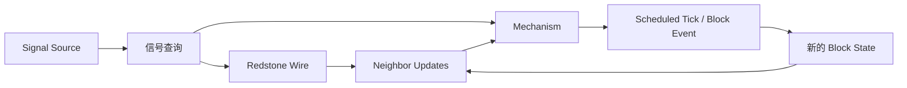
```mermaid
flowchart LR
  Source["Signal Source"] --> Query["信号查询"]
  Query --> Wire["Redstone Wire"]
  Query --> Device["Mechanism"]
  Wire --> Neighbor["Neighbor Updates"]
  Device --> Schedule["Scheduled Tick / Block Event"]
  Neighbor --> Device
  Schedule --> State["新的 Block State"]
  State --> Neighbor
```

## 一个组件为什么会认为自己被供电？

最容易误解红石的地方，是把“充能”想成每个方块内部都保存了一个统一的电量。

Java 当前实现更接近**按需查询**：组件需要知道自己是否有信号时，会查看周围 Block State 向特定方向能提供什么 Redstone Signal，再根据方块是否能够导电等规则组合结果。

### 信号首先是一个 0–15 的整数

Redstone Dust 的 `POWER` 是一个 0–15 的 Block State 属性。信号源可以输出 15，Wire 从邻近 Wire 接收到的强度则逐格衰减。当前 `RedstoneWireEvaluator` 会把来自普通 Block Signal 与邻近 Wire 的结果组合起来，得到该位置新的 Wire Strength。[^wire-evaluator]

概念上可以简化成：

```text
new wire power
=
max(
  signal from non-wire sources,
  strongest neighboring wire - 1
)
```

并把结果限制在 0–15。

这解释了 Redstone Dust 最基本的传播距离，却还没有解释“为什么隔着一个实心方块也能继续供电”。那需要下一层查询。

### “弱 / 强充能”更适合看成两类信号查询

社区通常使用 **weak power / strong power**、软充能 / 强充能来解释红石。

这个模型很有用，但从当前 Java 代码看，更精确的对应是：

- `BlockState.getSignal(...)`：该 Block 向某一面提供的普通 / weak signal；
- `BlockState.getDirectSignal(...)`：该 Block 向某一面提供的 direct / strong signal；
- `BlockState.isRedstoneConductor(...)`：这个方块能不能把进入自身的 Direct Signal 纳入对外查询。[^signal-getter] [^block-state-signal]

`SignalGetter.getSignal(pos, direction)` 的核心关系可以概念化为：

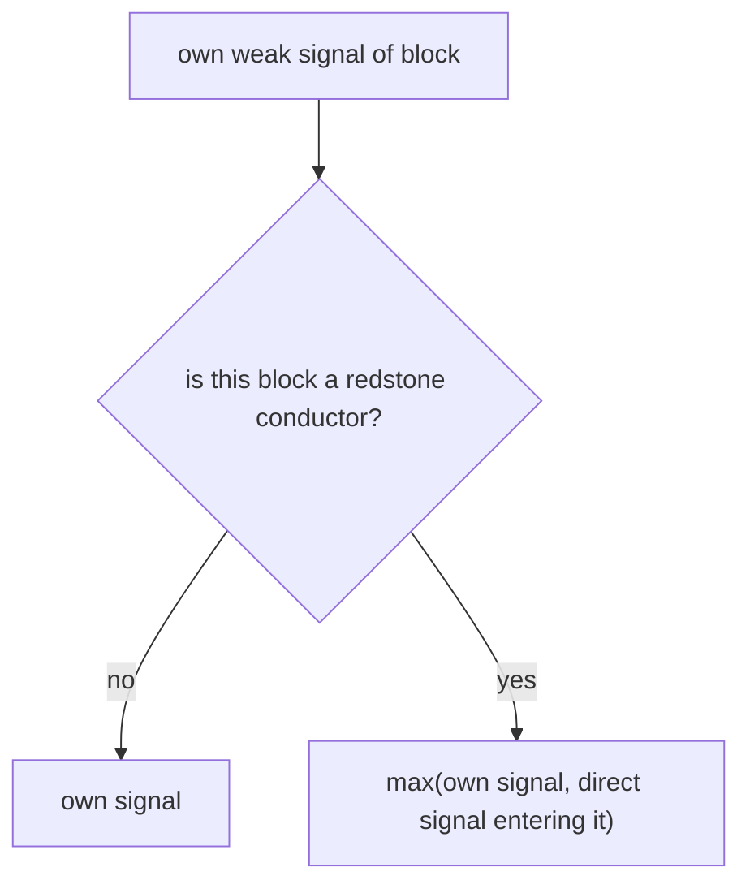
```mermaid
flowchart TD
  Own["own weak signal of block"] --> Conductor{"is this block a redstone conductor?"}
  Conductor -->|no| Weak["own signal"]
  Conductor -->|yes| Combined["max(own signal, direct signal entering it)"]
```

于是所谓“一个实心方块被强充能以后，可以继续让旁边装置读到信号”，不是因为世界给这个方块永久写入了：

```text
powered = true
```

而是下一位读取者查询它时，`SignalGetter` 发现这是一个 Redstone Conductor，于是把进入这个位置的 Direct Signal 也考虑进去。

<Callout type="info" title="供电很多时候是查询结果，不是独立存档状态">
某些红石组件确实会把 `POWERED` 或 `POWER` 保存进自己的 Block State，但“一块普通石头现在被强充能”并不需要给 Stone 增加一个新的 Block State。它可以由周围信号在查询时推导出来。
</Callout>

这也是为什么“强 / 弱”并不是“15 比 7 更强”。它们首先描述**传播能力不同的信号路径**，信号数值本身仍然可以是 0–15。

### 不同 Source 可以对不同方向给出不同答案

Lever、Button、Torch、Repeater、Observer 并不是统一地向六个方向输出同一个值。

例如当前实现中，一个组件可以：

- 普通信号向多个方向输出；
- Direct Signal 只输出到特定方向；
- 完全不向自己的输入面输出；
- 只在 `POWERED` 状态时成为 Signal Source。

因此“这个方块有没有电”本身就是过度简化的问题。

更有用的问题是：

> **从这个方向查询它时，它给出多少 Signal？**

这让方向成为红石语义的一部分，而不仅是方块贴图朝向。

### Comparator 还多了一套 Analog Output

Comparator 并不只读取普通 Redstone Signal。

Container 等方块还可以提供 `getAnalogOutputSignal`；Comparator 会根据面对的方块读取这类模拟输出，再进行 Compare 或 Subtract。当前 `ComparatorBlock` 仍通过自己的 `getInputSignal` / `getOutputSignal` 路径处理这类输入。[^comparator] [^diode-current]

这让箱子填充程度、唱片机状态等世界数据能够被映射到 0–15。

从架构上看，它相当于给 Block 增加另一种接口：

```text
world state
    ↓
analog measurement
    ↓
0..15 signal
    ↓
redstone network
```

红石因此不只是“电源和导线”，也是其他游戏系统把状态暴露给自动化的一条通道。

## Redstone Dust 怎样传播信号？

Redstone Wire 看起来最接近传统电线，但实现上它同时承担三件事：

1. 保存当前 `POWER`；
2. 根据附近环境决定自己向哪边连接；
3. 当强度变化时通知相关方块。

这三个职责彼此关联，却不是同一件事。

### 连接形状会影响它向哪里输出

当前 `RedstoneWireBlock` 保存 North / South / East / West 四个 `RedstoneSide` 属性，以及 0–15 的 `POWER`。连接可以是 `NONE`、`SIDE` 或 `UP`。[^wire]

也就是说，Wire 的视觉形状不是纯客户端装饰。

Mojang 在 20w18a 曾专门调整这一点，让 Redstone Wire 的**视觉连接与实际供电方向更加一致**：看起来连接的一侧会供电，没有视觉连接的一侧则不再按旧行为偷偷供电。[^20w18a]

20w21a 又加入了单格 Wire 在 Cross 与 Dot 之间切换的能力，其中 Dot 不给四周方块供电。[^20w21a]

这两次变化说明一个很重要的实现原则：

> **如果玩家需要从世界几何推断系统行为，显示状态与逻辑状态最好尽量共享同一份数据。**

否则同一根 Wire 会出现“看起来没连，却实际上给电”的双重语义。

### Wire 的强度变化会继续触发 Neighbor Update

Wire 计算出新强度以后，事情还没有结束。

周围的 Repeater、Piston、Lamp、Door 之所以会响应，是因为 Wire 的变化继续引发 Neighbor Update。默认 Java 26.3 的 `DefaultRedstoneWireEvaluator` 仍然按局部递归式方式更新 Wire；`RedstoneWireBlock` 也保留对邻近 Wire 与邻居方块的更新入口。[^wire] [^default-wire]

因此一条长 Wire 的变化不是：

```text
计算一个数组
→ 一次提交
```

而更像：

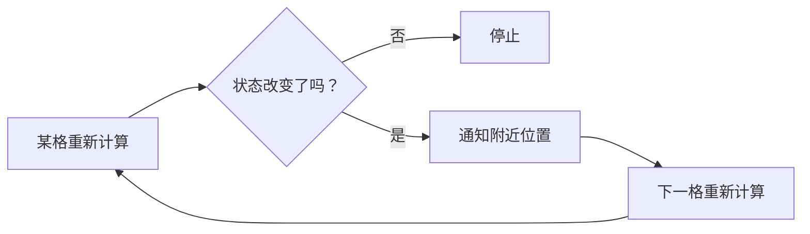
```mermaid
flowchart LR
  Evaluate["某格重新计算"] --> Change{"状态改变了吗？"}
  Change -->|否| Stop["停止"]
  Change -->|是| Notify["通知附近位置"]
  Notify --> Next["下一格重新计算"]
  Next --> Evaluate
```

这正是上一章 Update Cascade 在红石中的具体表现。

### “信号传播”与“邻居被通知”是两张图

这两个概念很容易混在一起。

**Signal Graph** 回答：

> 谁能从谁那里读到多少 Signal？

**Update Graph** 回答：

> 某个状态变化以后，谁会被通知重新检查？

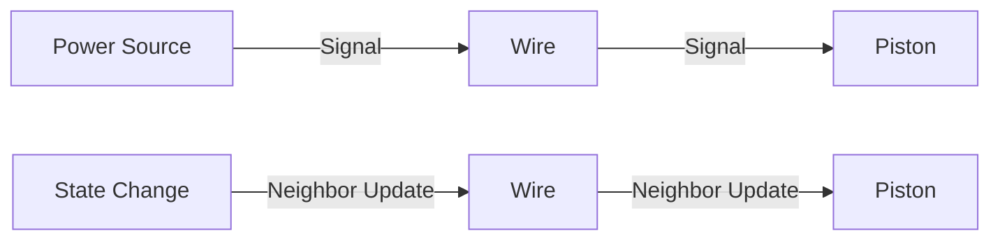
```mermaid
flowchart LR
  A["Power Source"] -->|Signal| B["Wire"]
  B -->|Signal| C["Piston"]

  A2["State Change"] -->|Neighbor Update| B2["Wire"]
  B2 -->|Neighbor Update| C2["Piston"]
```

很多普通电路里，两张图看起来几乎一致，于是玩家感觉“有电就会动”。

但准连接和 BUD 恰恰来自：

> **能读到 Signal 的范围，与能收到 Update 的范围并不总是完全相同。**

这也是为什么红石不能只用一个简单的“信号 Flood Fill”解释。

## 为什么有些组件立刻变化，有些必须等待？

红石把上一章的各种调度方式全部用上了。

Wire 可以在更新链中立即重新计算；Repeater / Comparator 等 Diode 会通过 Scheduled Tick 延迟变化；Observer 把检测到的 Shape Change 转成短脉冲；Piston 则进一步使用 Block Event。

所以“一个 Redstone Tick”不是所有红石组件共享的唯一执行阶段。

### Repeater 把延迟做成 Scheduled Tick

Repeater 的作用不只是把输出恢复到 15。

它还显式保存：

- Facing；
- Delay；
- Powered；
- Locked。

当前 `RepeaterBlock` 继承 `DiodeBlock`。当输入变化时，`DiodeBlock` 会检查是否应该切换状态，再按对应 Delay 安排 Scheduled Tick；Repeater 的侧面输入还能决定 `LOCKED`。[^repeater] [^diode-current]

这意味着 Repeater 的基本语义是：

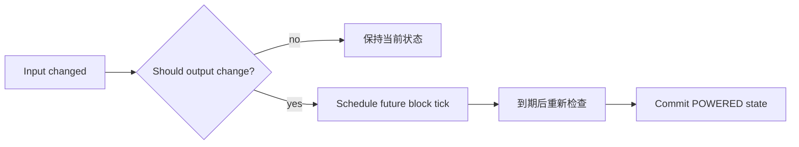
```mermaid
flowchart LR
  Input["Input changed"] --> Decide{"Should output change?"}
  Decide -->|no| Keep["保持当前状态"]
  Decide -->|yes| Schedule["Schedule future block tick"]
  Schedule --> Recheck["到期后重新检查"]
  Recheck --> Commit["Commit POWERED state"]
```

而不是立即把输入复制到输出。

因此 Delay 首先属于**游戏时间调度**，其次才是玩家口中的“电路延迟”。

### Comparator 复用 Diode 时序，但输入语义不同

Comparator 和 Repeater 都建立在 `DiodeBlock` 上，因此共享一部分输入、侧输入、Scheduled Tick 与定向输出基础设施。

但 Comparator 的核心问题不是：

> 输入是否大于零？

而是：

- 主输入是多少？
- 侧输入是多少？
- 当前是 Compare 还是 Subtract？
- 前方方块是否提供 Analog Output？

所以同一种“延迟组件框架”可以承载完全不同的信号运算。

这是一种值得借鉴的分层：

> **调度方式可以复用，计算规则不必复用。**

### Observer 把 Block State / Shape Change 变成脉冲

Observer 更像一个边沿检测器。

当前 Java 的 `ObserverBlock` 会在它观察的方向收到 `updateShape` 时安排后续 Tick，再从背面输出一个短暂 Signal。[^observer-current]

因此 Observer 并不是每 Tick 扫描：

```text
watchedState != oldState ?
```

它复用了方块更新基础设施：

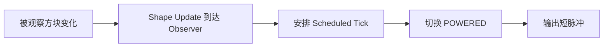
```mermaid
flowchart LR
  Change["被观察方块变化"] --> Shape["Shape Update 到达 Observer"]
  Shape --> Schedule["安排 Scheduled Tick"]
  Schedule --> Toggle["切换 POWERED"]
  Toggle --> Pulse["输出短脉冲"]
```

这和 BUD 有历史关系，但两者不是同一个实现机制。后面会专门区分。

### Piston 使用的不是普通 Scheduled Tick，而是 Block Event

Piston 收到 Neighbor Update 后，会先调用 `checkIfExtend` 判断自己当前是否应该伸出或收回。

真正移动方块并不会在这个函数里立刻完成。服务端会排入 Block Event，随后在 `ServerLevel` 的 Block Event 阶段执行 `PistonBaseBlock.triggerEvent`。[^piston] [^piston-events]

这让一次 Piston 行为天然分成：

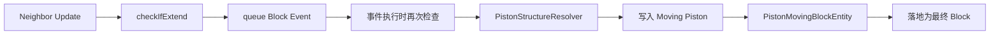
```mermaid
flowchart LR
  Update["Neighbor Update"] --> Check["checkIfExtend"]
  Check --> Event["queue Block Event"]
  Event --> Recheck["事件执行时再次检查"]
  Recheck --> Resolve["PistonStructureResolver"]
  Resolve --> Move["写入 Moving Piston"]
  Move --> Animate["PistonMovingBlockEntity"]
  Animate --> Settle["落地为最终 Block"]
```

因此 Piston 的“响应时间”不能只看 Signal 什么时候变化，还要看 Block Event 在当前 Server Tick 的哪个阶段被排入。

这会直接把我们带到红石最难的一层：**同一个 Tick 内部的顺序**。

## 同一个 Tick 里，谁先更新为什么会改变结果？

上一章已经说明：同一个 Tick 并不等于所有系统同时发生。

红石把这个事实推到了最明显的位置。

如果两个 Piston 同时发现自己应该动作，或者一条 Wire 同时向多个方向传播变化，那么：

- 谁先收到 Neighbor Update；
- 谁先重新计算自己的 Signal；
- 谁先预约 Scheduled Tick；
- 谁先进入 Block Event；

都可能改变中间状态。

### 读取顺序、通知顺序和执行阶段不是同一件事

Java 当前至少存在三类容易混淆的顺序：

1. **Signal Query Order**：某个位置为了判断自己是否有电，按什么顺序查询周围方向；
2. **Neighbor Update Order**：一个 Block 变化以后，按什么顺序通知邻居；
3. **Scheduler / Event Order**：已经排队的 Scheduled Tick 或 Block Event 在什么时候执行。

当前 26.3 的默认实现里，`SignalGetter`、`NeighborUpdater` 和 Block Shape Update 分别拥有自己的方向顺序。技术上它们甚至不是同一个数组。[^signal-order]

这意味着：

> **“先看谁”和“先告诉谁”本来就是两个问题。**

如果把它们都笼统叫作 Redstone Update Order，很容易把一个组件为什么先触发解释错层。

### 更新顺序决定中间状态能不能被观察到

假设 A 和 B 都会影响 C。

如果顺序不同，C 读取到的就可能是两版不同的中间世界：

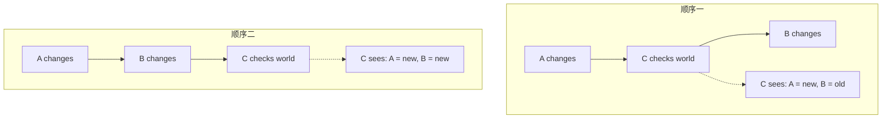
```mermaid
flowchart TB
  subgraph First["顺序一"]
    A1["A changes"] --> C1["C checks world"]
    C1 --> B1["B changes"]
    C1 -.-> Seen1["C sees: A = new, B = old"]
  end

  subgraph Second["顺序二"]
    A2["A changes"] --> B2["B changes"]
    B2 --> C2["C checks world"]
    C2 -.-> Seen2["C sees: A = new, B = new"]
  end
```

最终稳定状态可能完全相同，但 C 在中间是否产生过 Pulse、是否预约过一次 Tick、是否排入过 Block Event，都可能不同。

因此红石时序问题常常不是：

> 最后 Signal 是多少？

而是：

> **在传播过程中的哪个瞬间，哪个组件读取了哪一版世界？**

这正是同步数字电路和事件驱动系统里都会遇到的问题，只不过 Minecraft 没有给所有方块提供一个统一的 Clock Edge。

### 默认 Wire 传播仍然带着历史递归结构

Java 26.3 默认世界使用 `DefaultRedstoneWireEvaluator`。

当前实现会从变化位置开始重新计算单格 Wire Power，再由方块更新继续向外展开。这个过程继承了很多历史时序特性，也意味着网络改变时，中间状态会在递归传播中逐步出现。[^default-wire] [^signal-dust]

这些中间状态通常只存在于同一个 Server Tick 内，客户端甚至可能根本看不到。

但其他服务端组件可以看见。

因此：

> **“玩家没有看到闪一下”不等于这一瞬间没有进入过游戏逻辑。**

这也是为什么某些红石装置会利用极短的状态窗口。

### Redstone Experiments 正是在试验另一种传播顺序

24w33a 引入的 Redstone Experiments 尝试重写 Wire 的这部分行为。

实验模式的主要变化包括：

- 一整条受影响 Wire Network 会先计算新的 Signal Strength；
- 然后再产生 Block Updates；
- Wire 越靠近 Power Source，越早发出更新；
- 邻居更新顺序根据更新传播方向构造 Orientation；
- 目标之一是减少“机器换个方向或换个坐标就变行为”的情况。[^24w33a]

24w34a 又把分叉时的大部分随机选择改成 Left-first，只在缺乏方向上下文时保留少量随机性。[^24w34a]

当前 26.3 的代码仍然同时包含：

```text
DefaultRedstoneWireEvaluator
ExperimentalRedstoneWireEvaluator
```

并由 `RedstoneWireBlock.useExperimentalEvaluator(...)` 根据 World Feature Flag 选择。[^wire] [^experimental-wire]

<Callout type="warning" title="不要把实验 Redstone 当成 Java 26.3 默认行为">
Redstone Experiments 在 26.3 仍然是独立 Feature Flag。普通世界继续使用默认 Wire Evaluator。讨论更新顺序时必须先说明 World 是否启用了实验，否则两套结论会互相矛盾。
</Callout>

这个实验本身很值得开发者观察，因为它把一个长期隐式的设计问题变得非常清楚：

> **为了更高性能和方向一致性，可以先算完整网络再发通知；但改变通知顺序，会直接改变依赖旧时序的机器。**

这不是单纯的优化问题，也不是单纯的玩法问题，而是两者碰在了一起。

## 准连接为什么会出现？

Quasi-connectivity，通常简称 **QC**，是 Java Redstone 最容易被说成“玄学”的行为之一。

但从当前实现看，它的原因非常具体。

### Piston 不只检查自己周围，还会检查上方位置周围

当前 `PistonBaseBlock.getNeighborSignal` 先检查 Piston 自己周围的信号，然后还会检查**Piston 上方那一格周围**的信号。[^piston-qc]

Power Source 并不需要直接接触 Piston。关键在于 Piston 的激活查询覆盖了两层位置：

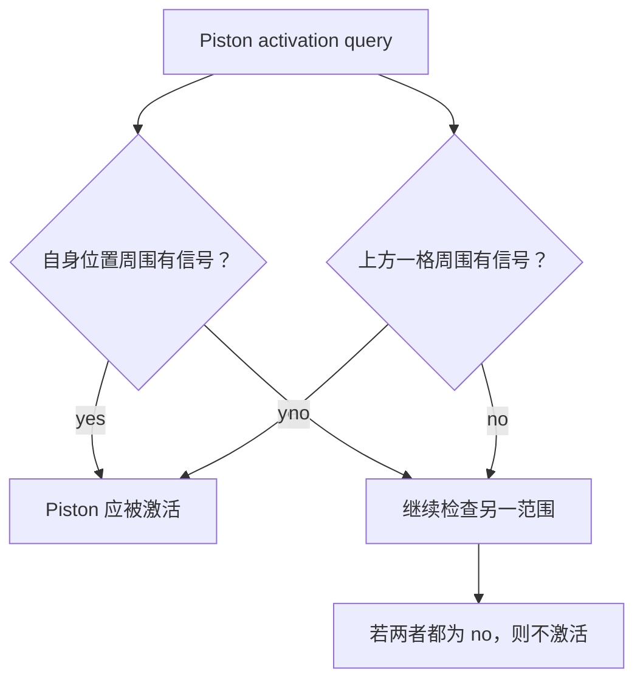
```mermaid
flowchart TD
  Check["Piston activation query"] --> Self{"自身位置周围有信号？"}
  Check --> Above{"上方一格周围有信号？"}
  Self -->|yes| Active["Piston 应被激活"]
  Above -->|yes| Active
  Self -->|no| Continue["继续检查另一范围"]
  Above -->|no| Continue
  Continue --> Inactive["若两者都为 no，则不激活"]
```

这不是所有 Block 的通用规则。当前 Java 中，Piston、Dispenser、Dropper 属于这类会向上多检查一层的少数机制；Crafter 并不因此自动获得 QC。[^piston-qc] [^qc-ticket]

所以更准确的说法是：

> **准连接不是 Redstone 世界的一条全局电学定律，而是少数组件的 Activation Query 范围更大。**

### QC 的关键不是“隔空供电”，而是查询范围

如果把 QC 解释成：

> Signal 可以穿过空气。

会立刻遇到很多反例。

真正发生的只是：Piston 在判断自己是否应该动作时，除了询问“我的位置周围是否有信号”，还会询问“我上方那一格的周围是否有信号”。只要其中一个查询成立，激活条件就成立。

因此“空气被供电”也只是方便描述，不意味着 Air Block 本身获得了新的持久化 Power State。

### MC-108 把这个行为正式留在了 Java

Quasi-connectivity 很早就被报告为 Bug。旧 Mojira 的 MC-108 描述的正是 Piston / Dispenser / Dropper 会被“对其上方空间供电”的 Source 激活。

该 Issue 最终被标记为 **Resolved: Works As Intended**。[^qc-ticket]

这件事的重要性不在于证明：

> 任何 Bug 一旦有人使用，就永远不能修。

它只说明一个现实：

> **当一个实现行为已经长期稳定、可重复，并且官方明确选择保留，它就开始承担兼容接口的角色。**

后面讨论技术债时还会回到这一点。

## QC 为什么经常和 BUD 一起出现？

准连接本身只回答：

> 如果现在检查，Piston 应不应该激活？

它没有保证：

> Power Source 变化时，Piston 一定会立即收到 Neighbor Update。

这两个条件的差异，才会产生很多经典的 BUD 行为。

### “应该变化”不等于“已经知道应该变化”

考虑一个 Piston：

1. 上方某个位置进入了能让它 QC-powered 的状态；
2. 这个变化并没有直接通知到 Piston；
3. Piston 因此仍保留旧状态；
4. 之后附近任意一次相关 Neighbor Update 到达；
5. Piston 再执行 `getNeighborSignal`；
6. 此时它才发现自己早就应该动作。

于是系统会经历一段“逻辑条件已经改变，但组件状态还没追上”的窗口：

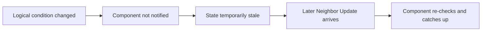
```mermaid
flowchart LR
  Condition["Logical condition changed"] --> Missing["Component not notified"]
  Missing --> Stale["State temporarily stale"]
  Stale --> Later["Later Neighbor Update arrives"]
  Later --> CatchUp["Component re-checks and catches up"]
```

这就是许多 **Block Update Detector** 行为的根。

### Signal Graph 和 Update Graph 的错位在这里真正显现

前面已经区分了两张图。

在 QC BUD 中：

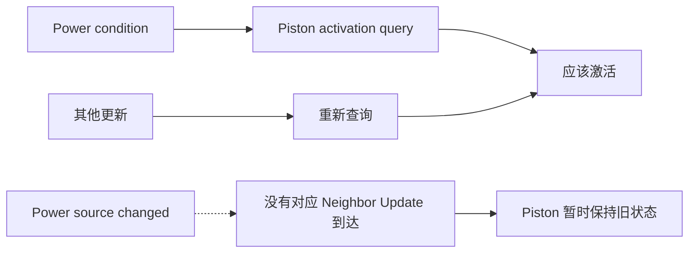
```mermaid
flowchart LR
  Power["Power condition"] --> Query["Piston activation query"]
  Query --> Should["应该激活"]

  Power2["Power source changed"] -.-> Missing["没有对应 Neighbor Update 到达"]
  Missing --> Stale["Piston 暂时保持旧状态"]
  Later["其他更新"] --> Check["重新查询"]
  Check --> Should
```

Piston 的查询能力已经“看见”更大的范围，但 Update Notification 并没有完全覆盖这个查询范围。

所以出现：

> **该变，但还没被叫来检查。**

这比“Piston 有一个神秘的 BUD Mode”更接近真实实现。

### BUD 和 QC 不是同义词

QC 是一种特殊 Activation Query。

BUD 描述的是：

> 利用 Update 到达与状态查询之间的关系，侦测附近某种变化。

QC 很容易制造 BUD 条件，但并不是所有 BUD 都依赖 QC，也不是所有 QC 用法都在做 BUD。Minecraft Wiki 和旧 Bug Tracker 也长期把两者区分。[^qc-wiki]

这一区分很重要，因为 Observer 出现以后：

- QC 没有消失；
- BUD 的需求也没有完全消失；
- Observer 更不是“把所有 BUD Bug 正式化之后旧机制就没用了”。

### Observer 是显式传感器，不是 QC 的替代实现

Java Observer 主要依赖被观察面的 Shape / Block State Update，并通过 Scheduled Tick 输出 Pulse。

它的输入范围、检测事件与输出时序都写在自己的 Block 行为中。

QC BUD 则来自：

- 某组件的 Signal Query 范围；
- Neighbor Update 的传播；
- 两者之间的差异。

因此两者即使都能回答：

> 附近发生变化了吗？

也不是同一个 API。

这正好体现一个成熟系统经常出现的情况：

> **后来的显式功能可以覆盖旧技巧的一部分用途，却不一定复制旧机制的所有语义。**

## Piston 为什么是更新顺序最好的放大镜？

Redstone Lamp 只需要改变亮灭。

Piston 会真正重写世界。

一次 Piston 动作可能：

- 找出一串要推动的 Block；
- 拒绝不可推动对象；
- 破坏某些允许被破坏的 Block；
- 处理 Slime / Honey 粘连；
- 临时创建 Moving Piston；
- 推动碰撞到的 Entity；
- 最后把临时状态落成新的 Block State。

因此时序上的一个微小差异，很容易在 Piston 上变成明显的结构差异。

### 检查 Signal 和执行移动是两个阶段

收到 Neighbor Update 时，`PistonBaseBlock.checkIfExtend` 只负责：

1. 查询现在是否应该伸缩；
2. 如果需要伸出，先让 `PistonStructureResolver` 判断能不能移动；
3. 把对应 Block Event 加入队列。[^piston]

真正执行动作时，`triggerEvent` 还会重新确认条件。

因此它更像一次分成两个阶段的提交：

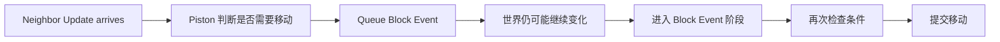
```mermaid
flowchart LR
  Update["Neighbor Update arrives"] --> Decide["Piston 判断是否需要移动"]
  Decide --> Queue["Queue Block Event"]
  Queue --> Gap["世界仍可能继续变化"]
  Gap --> Event["进入 Block Event 阶段"]
  Event --> Recheck["再次检查条件"]
  Recheck --> Commit["提交移动"]
```

这种**两阶段提交**是很多零刻、短脉冲和 Piston 时序现象的基础。

### PistonStructureResolver 负责回答“这一整组方块能不能移动”

Piston 不只是检查正前方一个 Block。

当前 `PistonStructureResolver` 会构建：

- `toPush`；
- `toDestroy`；

并沿 Slime / Honey 的粘连关系继续扩展移动集合。普通 Piston 一次移动最多处理固定上限的 Block，而不同 Block 还能通过 Push Reaction、Block Entity 等规则拒绝移动。[^piston-events]

这里体现的是另一个很通用的架构原则：

> **复杂操作先做可行性分析，再一次性提交，不要移动到一半才发现后面有 Obsidian。**

这与数据库 Transaction 的动机类似，只是对象变成了空间中的 Block 集合。

### Moving Piston 是一种临时运行时表示

和上一章 Falling Block 类似，正在被推动的 Block 暂时不适合继续作为普通静态 Block State。

Minecraft 会写入 Moving Piston 占位，并用 `PistonMovingBlockEntity` 保存真正被搬运的 Block State、进度和运动信息。[^piston-events]

于是一次移动会在静态与动态表示之间往返：

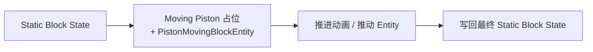
```mermaid
flowchart LR
  Static["Static Block State"] --> Moving["Moving Piston 占位<br/>+ PistonMovingBlockEntity"]
  Moving --> Progress["推进动画 / 推动 Entity"]
  Progress --> Settle["写回最终 Static Block State"]
```

这再次说明：

> **静态世界表示和动态过渡表示可以不同。**

Piston 只是在 Redstone 驱动下大量使用了这一模式。

## Java 与 Bedrock 为什么不能共用一份红石时序说明？

很多基础概念两版相似：

- Signal Strength；
- Dust；
- Repeater；
- Comparator；
- Piston；
- Observer。

但复杂 Redstone Build 并不能因此保证跨版本行为一致。

Microsoft 当前面向 Creator 的 Java / Bedrock 差异文档直接指出：复杂 Redstone Circuit 可能表现不同，其中一个明确原因就是 **Bedrock 不支持 Quasi-connectivity，而 Java 支持**；Piston 行为与 Update 方式也存在差异。[^bedrock-differences]

### QC 就是最清晰的实现分叉

Java：

```text
Piston activation query
includes space above
```

Bedrock：

```text
no Java-style quasi-connectivity
```

旧 Bedrock Issue MCPE-14664 也把“没有 QC”标为 Works As Intended。[^bedrock-qc]

因此不能把 Java 的：

> “只要上方空间被供电，Piston 就会认为自己应该动作”

写成 Minecraft 全产品线共同规则。

### Update Order 也不是可以直接翻译的细节

即使两个版本最后都支持同样的 Block 和 0–15 Signal，一个 Build 仍可能依赖：

- 谁先更新；
- Pulse 保留多久；
- Piston 在哪个阶段响应；
- Observer 检测什么 Update；
- 同 Tick 内是否保留某个中间状态。

这些差异很难靠“把 Java Tick 换算成 Bedrock Tick”解决。

因为问题不是时间单位不同，而是：

> **事件图本身不同。**

所以本书后面的 Bedrock 章节会把它作为“另一套实现”看待，而不是把 Java 的源码规则翻译成 C++ 名字。


## 为什么更新顺序会变成兼容问题？

红石最棘手的长期维护问题，不是每一条规则本身都多复杂，而是这些规则已经被玩家组合成了大量依赖时序的机器。

如果修改的是一个纯视觉效果，玩家重新适应即可。

如果修改的是：

- Wire 通知邻居的顺序；
- Piston 什么时候排入 Block Event；
- Observer 哪类变化能看到；
- 某个机制是否还具备 QC；
- 短 Pulse 是否会被某个阶段捕获；

那么改变的可能不是一个方块，而是一整类机器。

### 20w18a / 20w21a 展示了“修正语义”也会改变机器

20w18a 的 Redstone Wire 改动目标非常清楚：让 Block State、Rendering 和 Behavior 更一致。Wire 看起来连接到哪一侧，就真正向哪一侧供电。[^20w18a]

从 API 设计角度，这是一种很合理的收敛。

但任何依赖旧语义的 Contraption 都可能受到影响。

20w21a 随后允许单格 Redstone Dust 在 Cross 与 Dot 之间切换，并明确 Dot 不向四周供电。[^20w21a]

这不是简单的“官方修错了又改回来”，而更像一次接口重设计：

1. 先让视觉状态与逻辑状态对齐；
2. 再给玩家一个明确可控的状态，表达“这一格 Wire 是否向四周说话”。

相比保留一个看不见的例外，**显式 Block State** 更容易理解、保存和测试。

### Redstone Experiments 把兼容成本直接写进了实验说明

24w33a 的 Redstone Experiments 试图同时改善：

- Wire 性能；
- 更新顺序；
- 旋转 / 坐标相关行为；
- 网络整体重新计算方式。[^24w33a]

官方也明确提醒，这类变化可能影响已有 Contraption。

到了 1.21.2 的正式说明中，Redstone Experiments 仍然是**可选实验**，并直接列出一个 Known Issue：减少 Wire 的额外 Neighbor Updates 会影响依赖 Quasi-connectivity 的装置，官方计划以后再处理。[^redstone-experiment-1212]

这段历史非常有代表性。

从实现角度看：

> 少发不必要的 Neighbor Update，当然更便宜。

从已有世界看：

> 有些玩家恰好就在利用那些“本来不必要”的 Update。

于是性能优化触碰了行为兼容。

26.3 仍然保留默认与实验 Evaluator 两套实现，也说明这个权衡并没有被简单地以“新的一定更正确”结束。[^redstone-experiment-flag] [^experimental-wire]

### 稳定行为会逐渐变成事实上的接口

一个行为是否来自最初设计意图，并不能完全决定它后来是否重要。

更实际的兼容判断通常要问：

- 行为是否 deterministic？
- 玩家是否能稳定复现？
- Wiki / 教程是否把它作为基础机制传播？
- 大量长期世界是否依赖它？
- 官方过去是否明确承诺或选择保留？
- 修正它能得到什么收益？
- 有没有迁移方案或显式替代机制？

QC 就是典型例子。

MC-108 记录了它最初作为 Bug 被报告的历史，但最终 Resolution 是 Works As Intended。[^qc-ticket]

这不需要被升格成：

> “只要是稳定 Bug，就永远不应该修。”

更准确的工程结论是：

> **当 emergent behavior 已经成为外部内容的依赖，修改它的成本就必须按 API change 评估，而不能只按内部代码清理评估。**

### 回归测试不能只测单个 Block

如果只给 Repeater 写测试：

```text
input on
→ after delay
→ output on
```

并不能保证大型机器兼容。

红石真正需要的回归层次至少包括：

```text
Unit:
单个组件规则

Integration:
多个组件的更新顺序

Structure:
典型 Piston / Observer / QC Contraption

Transform:
旋转、镜像、不同坐标后行为是否仍符合目标

Performance:
大型 Wire Network 的更新预算
```

24w33a 的实验甚至把“希望机器不再依赖 global orientation”作为明确目标之一。[^24w33a]

这提醒自研沙盒开发者：

> **可编程式玩法的测试对象不是只有 API 函数，还包括玩家已经搭出来的结构。**

当程序本身就是世界中的几何时，Structure Test 就很接近 Integration Test。

## 从红石系统可以抽象出什么？

如果只看外观，红石像一套简化电路。

如果只看玩家创造，又很容易把它直接叫作编程语言。

从实现角度看，它更具体：

- Block 提供定向 Signal Query；
- Wire 维护离散 Signal Strength；
- Neighbor Update 负责通知；
- Scheduled Tick 提供延迟；
- Block Event 提供另一类提交阶段；
- Piston 把信号转换成世界几何修改；
- Comparator 把其他系统状态映射成模拟值；
- Observer 把 Block State 变化转换成 Pulse；
- Update Order 决定同一 Tick 中哪个中间状态能被看见。

这些机制组合以后，才产生玩家能够利用的逻辑行为。

### 红石没有一个中央“电路求解器”

系统里没有一个每 Tick 都运行的：

```text
solveAllRedstoneCircuits()
```

去扫描整张世界。

它更像上一章描述的局部事件系统：

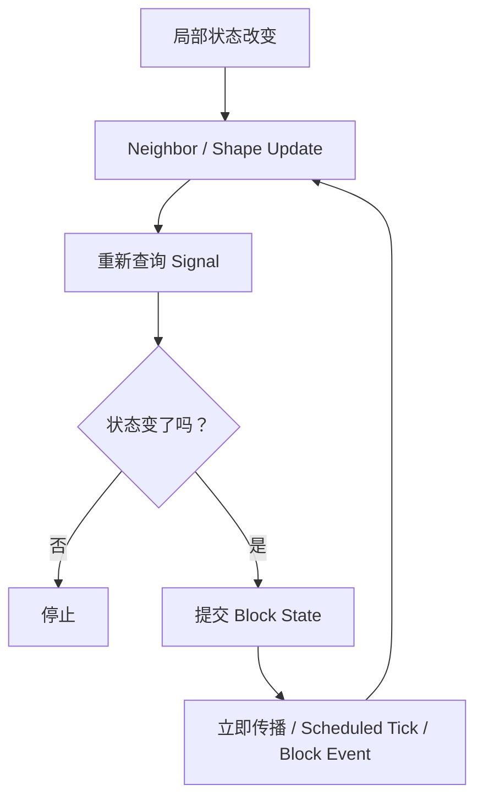
```mermaid
flowchart TD
  Change["局部状态改变"] --> Notify["Neighbor / Shape Update"]
  Notify --> Query["重新查询 Signal"]
  Query --> Different{"状态变了吗？"}
  Different -->|否| Stop["停止"]
  Different -->|是| Commit["提交 Block State"]
  Commit --> Later["立即传播 / Scheduled Tick / Block Event"]
  Later --> Notify
```

这也是它能够存在于巨大世界里的原因：没有活动的 Redstone 网络几乎没有运行时传播成本。

### 但“局部”不等于“简单”

一条 Wire 只读取邻域，一个 Piston 只查询有限范围，一个 Repeater 只预约自己的 Tick。

可当这些局部状态机互相触发以后，就会出现：

- Feedback Loop；
- Clock；
- Pulse；
- Memory；
- Sequencing；
- Conditional Routing。

复杂性来自**组合后的状态空间**，而不是某个组件本身拥有复杂代码。

这和 Cellular Automata、Event-driven System、Digital Logic 都有相似之处，但不必强行把红石归类成其中任何一种。

真正有用的认识是：

> **简单的局部规则，只要拥有稳定的时间和传播语义，就足以构成比单个规则复杂得多的系统。**

### 可预测性来自“规则稳定”，不来自“规则像现实”

Redstone Dust 不需要符合真实电阻定律。

Piston 也不需要符合刚体动力学。

玩家真正需要的是：

- 同样输入能重复得到同样结果；
- Delay 能被计数；
- Signal Strength 能被测量；
- 更新条件能被学习；
- 已经建立的机器不会无缘无故换语义。

因此红石的工程质量不能只用：

> 它像不像真实电路？

来判断。

更合适的问题是：

> **这套离散规则是否可观察、可组合、可复现，并且升级时有明确的兼容策略？**

## 这一章留下什么

Redstone 的“电”不是一个存进世界所有 Block 的统一状态。组件在需要时查询周围 Signal；普通 Signal、Direct Signal 与 Redstone Conductor 共同形成玩家常说的弱 / 强充能。Redstone Wire 再把 0–15 的 Signal 变成能够沿空间传播的局部网络。

真正让 Redstone 变复杂的是时间。Wire 可以立即展开 Neighbor Update；Repeater 与 Comparator 使用 Scheduled Tick；Observer 把 Shape Change 转换成延迟 Pulse；Piston 则先判断，再把真正的世界修改排入 Block Event。**同一个 Tick 内部仍然存在多个执行阶段，而中间状态可以被其他组件读到。**

Quasi-connectivity 也不需要神秘化。Java 的 Piston、Dispenser、Dropper 会把 Activation Query 扩展到上方空间；如果这个“能看见的范围”和 Neighbor Update 实际通知到的范围不一致，就可能出现“按规则应该变化，却还没收到通知”的状态，这正是很多 QC / BUD 行为的来源。Bedrock 没有 Java 这套 QC，因此两版的高级 Redstone 不能共享一份时序说明。[^bedrock-differences]

最后，更新顺序本身也是行为的一部分。Mojang 对 Redstone Wire 的多次重构，以及至今仍以 Feature Flag 存在的 Redstone Experiments，都说明一个成熟沙盒必须同时面对两个目标：**让实现更一致、更高效，也让已经建立在旧行为上的世界尽可能可理解地继续运行。**

对开发者来说，最值得继承的是几条边界：**Signal Query 与 Neighbor Notification 分离；即时传播与延迟调度分离；逻辑判定与世界提交分离；默认规则与实验规则分离；内部实现优化与外部行为兼容分离。** 当这些边界清楚以后，红石就不再是一堆“玄学特性”，而是一套可以被逐层分析的事件驱动模拟。

第二部到这里收束。前五章已经回答了世界生成以后最重要的运行时问题：时间怎样推进，方块变化怎样传播，Entity 怎样移动与决策，Item 怎样被保存与加工，Redstone 又怎样把这些局部系统组织成可编程的因果链。下一章开始进入客户端：服务器中的这份世界状态，怎样最终变成玩家看到、听到并操作到的画面与反馈。

[^release]: Mojang Studios，《Minecraft Java Edition 26.3》，2026-09-15。见 https://feedback.minecraft.net/hc/en-us/articles/48913133328013-Minecraft-Java-Edition-26-3

[^wire]: Java 26.3 `RedstoneWireBlock` 当前保存四向 `RedstoneSide`、`POWER`，并同时引用默认 / 实验 Redstone Wire Evaluator；类中保留 `useExperimentalEvaluator`。见 NeoForge 26.3 映射 Javadoc：https://aldak0.ru/javadoc/26.3.x/net/minecraft/world/level/block/RedstoneWireBlock.html

[^redstone-experiment-flag]: Java 26.3 当前仍保留 `FeatureFlags.REDSTONE_EXPERIMENTS`；对应 World Feature Flag 在服务器 API 中也仍可见。见 https://aldak.netlify.app/javadoc/26.3.x/index-files/index-18 与 https://purpurmc.org/javadoc/org/bukkit/FeatureFlag.html

[^wire-evaluator]: Java 26.3 `RedstoneWireEvaluator` 定义 `getBlockSignal`、`getIncomingWireSignal` 与 Wire Signal 更新接口，子类为 `DefaultRedstoneWireEvaluator` 与 `ExperimentalRedstoneWireEvaluator`。见 https://aldak0.ru/javadoc/26.3.x/net/minecraft/world/level/redstone/RedstoneWireEvaluator.html

[^signal-getter]: Java 26.3 `SignalGetter` 提供 `getSignal`、`getDirectSignal`、`getDirectSignalTo`、`hasNeighborSignal`、`getBestNeighborSignal` 等 Redstone 查询。见 https://aldak0.ru/javadoc/26.3.x/net/minecraft/world/level/SignalGetter.html

[^block-state-signal]: Java 26.3 `BlockStateBase` 当前分别暴露 `isRedstoneConductor`、`isSignalSource`、`getSignal`、`getDirectSignal` 与 `getAnalogOutputSignal`。见 https://aldak0.ru/javadoc/26.3.x/net/minecraft/world/level/block/state/BlockBehaviour.BlockStateBase.html

[^comparator]: Java 26.3 `ComparatorBlock` 继承 `DiodeBlock`，实现自己的 `getInputSignal` / `getOutputSignal` 和 Comparator Mode。见 https://aldak0.ru/javadoc/26.3.x/net/minecraft/world/level/block/ComparatorBlock.html

[^diode-current]: Java 26.3 `DiodeBlock` 当前统一承担定向输入、侧输入、Scheduled Tick、输出和 Neighbor 检查等 Repeater / Comparator 共享基础设施。见 https://aldak0.ru/javadoc/26.3.x/net/minecraft/world/level/block/DiodeBlock.html

[^20w18a]: Mojang Studios，《Minecraft Java Edition Snapshot 20w18a》，2020-04-29。该快照明确将 Redstone Wire 的 Block State、Rendering 和 Behavior 对齐，让视觉连接侧与实际供电侧一致。见 https://feedback.minecraft.net/hc/en-us/articles/360042479372-Minecraft-Java-Edition-Snapshot-20W18A

[^20w21a]: Mojang Studios，《Minecraft Java Edition Snapshot 20w21a》，2020-05-20。该快照加入单格 Redstone Wire 的 Cross / Dot 切换，Dot 不向周围方块供电。见 https://feedback.minecraft.net/hc/en-us/articles/360043476792-Minecraft-Java-Edition-Snapshot-20W21A

[^default-wire]: Java 26.3 `DefaultRedstoneWireEvaluator` 仍作为 Redstone Wire 的默认强度更新实现；`ExperimentalRedstoneWireEvaluator` 是独立实现。见 https://aldak0.ru/javadoc/26.3.x/net/minecraft/world/level/redstone/DefaultRedstoneWireEvaluator.html

[^signal-dust]: How Java Minecraft Works，《Signal and dust》，按 Java 26.3 源码追踪 `SignalGetter`、`RedstoneWireBlock`、默认与实验 Wire Evaluator 的信号计算与更新链。见 https://minecraftdocs.dev/systems/blocks/signal-and-dust

[^repeater]: Java 26.3 `RepeaterBlock` 当前拥有 `DELAY`、`LOCKED`，继承 `DiodeBlock` 的 Scheduled Tick 与信号处理。见 https://aldak0.ru/javadoc/26.3.x/net/minecraft/world/level/block/RepeaterBlock.html

[^observer-current]: Java 26.3 `ObserverBlock` 当前通过 `updateShape`、`startSignal` 与 Scheduled `tick` 处理观察与输出。见 https://aldak.netlify.app/javadoc/26.3.x/net/minecraft/world/level/block/observerblock

[^piston]: Java 26.3 `PistonBaseBlock` 当前包含 `checkIfExtend`、`getNeighborSignal`、`triggerEvent`、`moveBlocks` 与 `PistonStructureResolver` 相关入口。见 https://aldak0.ru/javadoc/26.3.x/net/minecraft/world/level/block/piston/PistonBaseBlock.html

[^piston-events]: How Java Minecraft Works，《Pistons and block events》，按 Java 26.3 源码追踪 Piston 从 Neighbor Update、Block Event、Structure Resolver 到 Moving Piston Block Entity 的执行阶段。见 https://minecraftdocs.dev/systems/blocks/pistons-and-block-events

[^signal-order]: How Java Minecraft Works，《Signal and dust》，按 Java 26.3 核对 `SignalGetter.DIRECTIONS`、`NeighborUpdater.UPDATE_ORDER` 与 `BlockBehaviour.UPDATE_SHAPE_ORDER`，三者分别承担读取、邻居通知与 Shape Update 顺序。见 https://minecraftdocs.dev/systems/blocks/signal-and-dust

[^24w33a]: Mojang Studios，《Minecraft Java Edition Snapshot 24w33a》，2024。Redstone Experiments 首次公开实验 Wire Network 两阶段更新、方向相对的 Neighbor Order 与降低坐标 / 朝向依赖等目标。见 https://feedback.minecraft.net/hc/en-us/articles/29296154589581-Minecraft-Java-Edition-Snapshot-24w33a

[^24w34a]: Mojang Studios，《Minecraft Java Edition Snapshot 24w34a》，2024。实验 Wire Update 在等距分叉时改为 Left-first，减少随机行为。见 https://feedback.minecraft.net/hc/en-us/articles/29460715867277-Minecraft-Java-Edition-Snapshot-24w34a

[^experimental-wire]: Java 26.3 `ExperimentalRedstoneWireEvaluator` 当前仍实现 `calculateCurrentChanges`、`causeNeighborUpdates` 与 Orientation-aware propagation。见 https://aldak0.ru/javadoc/26.3.x/net/minecraft/world/level/redstone/ExperimentalRedstoneWireEvaluator.html

[^piston-qc]: How Java Minecraft Works，《Pistons and block events》，按 Java 26.3 核对 `PistonBaseBlock.getNeighborSignal`：Piston 会检查自身邻域，以及上方位置的邻域；Dispenser / Dropper 也具有对应的上方查询行为。见 https://minecraftdocs.dev/systems/blocks/pistons-and-block-events

[^qc-ticket]: Mojang Bug Tracker，MC-108，《Droppers, Dispensers and Pistons activate when blocks are providing power diagonally or two blocks above》。该 Issue 当前为 Resolved / Works As Intended。见 https://bugs-legacy.mojang.com/browse/MC-108

[^qc-wiki]: Minecraft Wiki，《Tutorial:Quasi-connectivity》。该文区分 Quasi-connectivity 与 BUD，并记录 QC 适用于 Java 的 Piston / Dispenser / Dropper。见 https://minecraft.wiki/w/Tutorial%3AQuasi-connectivity

[^bedrock-differences]: Microsoft Learn，《Differences between Minecraft Bedrock Edition and Minecraft Java Edition》。官方 Creator 文档明确指出 Bedrock 不支持 Quasi-connectivity，复杂 Redstone Circuit、Piston 与 Update 行为可能与 Java 不同。见 https://learn.microsoft.com/en-us/minecraft/creator/documents/differencesbetweenbedrockandjava

[^bedrock-qc]: Mojang Bug Tracker，MCPE-14664，《There is no quasi connectivity》，Resolved / Works As Intended。见 https://bugs-legacy.mojang.com/browse/MCPE-14664

[^redstone-experiment-1212]: Mojang Studios，《Minecraft Java Edition 1.21.2》。正式版说明仍将 Redstone Changes 保持为可选 Experiment，并明确 Known Issue：减少 Wire 的额外 Neighbor Updates 会影响 QC-based contraptions。见 https://www.minecraft.net/en-us/article/minecraft-java-edition-1-21-2
