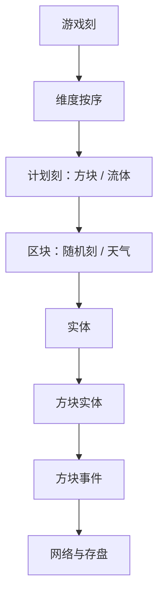

> **本章命题**：Minecraft 的时间不是画面刷新。它是一份全服共用的刻：每秒二十次，每次预算约五十毫秒。刻跟不上墙钟，熔炉、作物、活塞和白天一起变慢。失去的是因果，不是帧率。

## 问题

卡的时候，人会说「游戏变慢了」。变慢的常常不是你看见的帧。帧掉了，转身会一顿一顿，但挖方块的手感还可能在。刻掉了，熔炉要更久才烧好、水走得像糖浆、白天像被拉长，连聊天和开门都会一起晚——因为它们排在同一条队伍里。[^tps]

上一章（[《光照、流体与方块更新》](/impl/light-fluid-updates)）把邻居通知写成隐式图，而图要在某一刻里走完。走不完，不是「画面不好看」，是这一刻的因果还没结算，下一刻已经该开始。要回答：TPS 下降时 Minecraft 在失去什么？可被证伪的说法是：卡顿等于掉帧，世界时间仍按墙上的秒走。只要还存在熔炉在「看起来很流畅」的客户端上煮不熟、只要还存在日志里那句 Can't keep up，这句话就不成立。

TPS 要用玩家语言定义：一秒里，世界应该往前走二十刻。每刻的预算大约五十毫秒。实际算一刻用了多少毫秒，叫 MSPT。MSPT 不超过 50，TPS 才能守住 20；超了，下一刻就得等。等，就是全服共享的时间被拉长。[^mspt]

<Cards>
  <Card title="图要在这一刻里走完" href="/impl/light-fluid-updates" description="光、水、邻居通知是账单。刻是付款日。" />
  <Card title="昼夜是二十分钟" href="/design/survival" description="24000 刻一天。假定刻还在走。" />
  <Card title="粉也按刻说话" href="/design/redstone" description="红石口语另有一把尺。实现后文再拆。" />
</Cards>

## 卡顿时「世界变慢」到底是什么

画面卡和世界卡，玩家常常用同一个词。它们不是一件事。

**帧**是客户端每秒画几次。掉帧，是你的眼睛和鼠标先受伤；方块可能还在按刻走。

**刻**是模拟每秒结算几次。掉刻，是熔炉、作物、实体、红石、昼夜一起受伤。你的画面可以仍然六十帧：视角丝滑，活塞却一格一格地拖。反过来也成立：画面撕了，服务器仍可能在守 20。

所以「变慢」要问慢的是谁。单人档里，集成服务端和画面住在同一进程，两种慢会缠在一起。多人服上，缠得更清楚：你电脑很流畅，整座城的活塞和灯却一起变钝——钝的是服务器那一条主循环。[^loop] 权威在那条循环上。循环慢，所有人的真实一起慢。这不是某人网不好。这是共享时间被拉长。

落后太远，引擎会放弃追赶：不会用快进把错过的刻补回来。[^skip] 快进会把已经卡死的队列再加倍。放弃追赶的代价是：墙钟走了一分钟，游戏里的白天可能没走满一分钟。丢失的刻不会在事后补课；丢失的刻就是丢失的因果——那一刻该长大的甘蔗、该灭的火、该推出去的活塞，有的会晚，有的会像没发生过。

<Callout type="warning" title="TPS 不是 FPS">
F3 上的帧数看的是画。Java 调试屏里的 ms ticks 才接近刻的账单。流畅的画面可以配上一口煮不熟的炉。炉认的是刻。
</Callout>

## 20 TPS 契约与客户端 tick

契约很短：主循环按固定节奏跑，一秒二十次，一次大约 50 毫秒。主世界一天 24000 刻，在 20 TPS 下刚好约二十分钟。[^day] 这组数从早期就钉着，不是后来为了红石才发明的钟。一切用「过了几刻」计时的东西，都寄生在它上面：饥饿、重生、天气、命令里的 `tick`。

客户端也有自己的节拍，但那是渲染的事：输入、手臂摆动、部分动作预测，不必等服务器的刻结算完。手感章会把挖掘停顿和伤害闪烁写成客户端的谎言。本章只要一句：客户端可以先演，演完仍要回到服务端那二十刻上对账。对不上，你看见的是橡皮筋——人物被拉回原位，不是两种物理并存。单人模式并没有取消对账，它只是把服务器藏在本机；协议章会把「单人即本地服务器」写全。这里先承认：你以为的单人时间，已经是一份服务端时间。

```java
void serverLoop() {
  long t0 = now();
  tickWorlds();                 // 走完才算一刻
  long used = now() - t0;       // MSPT
  if (used > WATCHDOG_MS) crash();
  sleep(max(0, 50 - used));     // 预算内就等到下一刻
}
```

示意不是源码。它要钉死的是：刻是串行的结算。一刻里的邻居图、实体、存盘，抢的是同一笔 50 毫秒；抢输了，不是「这一帧少画了三角形」，是下一刻的开门时间被推迟。Java 后来给了 `/tick`，允许查询甚至拨弄这根钟。[^cmd] 拨弄能成立，正因为钟是契约，不是显卡选项。Bedrock 同样以约每秒二十刻为模拟节奏，但模拟距离怎么圈、随机刻默认值多少、红石怎么排班，两边不是同一份实现。删掉句中的 Java 或 Bedrock，下面几节常常不成立。合写的是：模拟有固定刻。分写的是：谁在这刻里、红石是否另开一条队伍。

<Impl title="MSPT 守不住时 TPS 只能降">
TPS 能停在 20，当且仅当平均 MSPT ≤ 50。漏斗每一刻找上面的物品、粉（红石粉，下文沿用社区口语）引发的方块更新和光照、成群的 AI、把随机刻拧到离谱，都是经典的 MSPT 税。[^tax] 税不是罪名名单。税是：这些事都要在同一刻里付完。付不完，TPS 下跌，所有认刻的东西一起变慢。
</Impl>

## 刻的种类

「刻」在口语里是一个字，在循环里却分成好几个先后阶段。下文借用车站的说法，把这些阶段叫「班次」：同一个游戏刻里，各系统按写死的顺序排队被点名，谁先谁后是固定的。名目至少有这些。

**游戏刻**是主循环的一次：计数加一、走天气和昼夜、按维度逐个结算。主世界、下界、末地按固定顺序走，自定义维度跟在后面。[^loop]

**区块刻**决定这一刻里哪些柱子配被点名。Java 里，模拟距离内、达到「能 tick 实体」等级的区块走得最全；随机刻后来放宽到凡是完全加载的区块都可以被抽到，但刷怪和闪电仍通常要求附近有玩家。[^chunk] Bedrock 以模拟距离（外加 `/tickingarea` 命令圈出的常载区）为准。视距是看见，模拟距离才是「世界还在过」。拧大视距却拧小模拟距离，你会看到一座静止的城：风景都在，村民不走了。

**随机刻**是抽奖：每个区块段（16×16×16 的一节）每游戏刻随机抽几个格位，抽中的方块自己长大或老化——作物、树叶、铜的氧化、冰的融化都走这条队。Java 默认每段抽 3 次，Bedrock 的同名规则默认值更低，数值只宜当相对速度看。[^random] 上一章写过：随机刻不负责水往哪流。它负责世界自己还会长。把规则拧到 0，农田停，不等于活塞停。

**计划刻**是预约。流体、火（Java）、中继器，都给未来某一刻排号。Java 把方块计划刻和流体计划刻分成两条队列，还带优先级；每刻最多消化一截，超限就顺延。Bedrock 按区块另有上限。[^sched] 延迟可预期，电梯和钟才指得着时刻。

**实体刻 / 方块实体刻**是会自己想事情的对象：牛要走，漏斗要吸，熔炉要烧。下一章把它们写成税。本章只要一句：它们排在同一刻的后半段。计划刻走完，才轮到多数实体。顺序不是美学。顺序就是因果：先流的水，后掉进水里的物品，不是同一瞬间的两件事。

**方块事件**（活塞真正伸出、音符盒出声）往往还要再晚一截。玩家以为的「红石立刻」，在循环里可能已经跨过计划刻、实体，再进事件队列。细节留给红石章。这里先承认：同一句口语的「立刻」，在循环里落在不同班次。



这张班次图不是源码清单。它要说明的是：错位是设计。水、粉、活塞、漏斗若都在同一瞬间结算，机器会更干净，也更不像这款游戏——这款游戏靠「谁先谁后」长出意外，而意外能被误用。误用的账单是：TPS 一掉，所有班次一起迟到，迟到的比例还不必相同。

## 红石刻与游戏刻的错位

红石玩家说的「一刻」，经常不是游戏刻。Java 里，中继器的四挡延迟是 2、4、6、8 游戏刻；社区把 2 游戏刻叫做「一红石刻」，即十分之一秒，一秒合十个红石刻。这是社区口语，不是引擎里的第二种钟——命令和调试屏认的都是游戏刻。[^rt]

错位从这里开始。粉可以在一游戏刻里改亮灭；中继器默认跨两刻；活塞真正伸出去可能更晚，还要进方块事件那一班。于是同一座钟，粉、灯、活塞各说各话。各说各话不是有人算错，是班次不同。社区把这种错位用成了语言：「半刻」（半个红石刻，即一游戏刻宽的脉冲）、「零刻」脉冲、BUD。语言能传十年，因为失败仍指得着格——灯亮在哪一刻，能被截图、能被复现。把错位清成「正确信号」，灯会更老实，机器会变少（这桩公案见[《红石：把物理做成编程》](/design/redstone)）。

Bedrock 把错位写得更硬：红石可以不跟主循环同一条队伍，而走产出 / 消费两段，合起来仍是两游戏刻一份红石刻。粉甚至可以每游戏刻改一次力，看起来却只在其中一段刷新。[^be-rt] 删掉 Java 或 Bedrock，红石的「一刻」就不是同一个词。合写的是：红石时间寄生在游戏刻上，却故意不和所有方块同一班。分写的是：Java 的社区口语尺，对 Bedrock 的两段式。红石实现章会把准连接和更新顺序再拆。本章只把尺子分开，免得 TPS 那句话被听成「红石也掉到 20 帧」。

<Note>
红石刻是社区尺，游戏刻是契约尺。TPS 掉的是契约。契约一慢，社区尺上的「四刻延迟」也会一起变长——因为那四刻本来就是游戏刻。
</Note>

## 看门狗与玩家可感知的时间

刻不但要走，还要被看见它还在走。

Java 专用服务端有一条看门狗：单刻若超过 `max-tick-time`（默认六万毫秒，即一分钟），就判定为崩溃，杀掉进程并留下崩溃报告。[^dog] 设成 `-1` 可以关掉它。关掉不是修好。关掉是允许某一刻无限长：世界停在那一刻的门口，玩家看见冻结，日志也不再以崩溃的方式终结这场冻结。单人游戏通常没有看门狗来下这记杀手，卡死会变成窗口「未响应」。杀手和未响应在说同一件事：这一刻没有交卷。

玩家可感知的时间，是一串认刻的现象叠在一起。熔炉的进度条、作物的状态、昼夜的亮度、中继器的延迟、命令方块的冷却，都是同一根钟的不同刻度。每过 6000 刻（约五分钟）还要自动存一次盘；存盘抢主循环，人会感到「定期顿一下」。[^save] 那不是随机卡顿，那是契约里写明的付款日。调试屏的 ms ticks 把钟的账单念给人听，帧时间图把 TPS 画成柱；它们只在你当主机或开单人时诚实——数字来自集成服务端。连到别人的服，你看见的流畅是客户端，真实在对面。[^mspt]

多人世界里，这根钟是共享真实。你不能在自己客户端把随机刻拧快，让邻居的农田也跟着快；你也不能因为自己跑 144 帧，就让活塞比别人先伸完。权威在服务端的二十刻上。服务器卡了，所有人的因果一起慢；你电脑好，只是先看见慢。时间旅行式的「我这边已经白天了」若被允许，红石和对账会一起碎。卷四会考：共享时间还在，却不必是全局 20。本章不代答。本章钉住的是：现在这份产品，共享真实就是这二十刻。

<Memoir title="炉子好像慢了">
画面不撕，人还在跳，炉子的箭头却像被胶水粘住。不是饿过头产生的错觉。是这一刻的五十毫秒被邻居图和实体买完了，熔炉排在方块实体那一班，班次晚点。服务器老玩家有句口令——「TPS 掉了」——能直接当诊断用，正因为炉子、白天和活塞一起作证。
</Memoir>

<Alternative title="若时间跟客户端走">
每人一份钟，流畅的人先看见白天，卡的人还在夜里。红石会对不上，交易会对不上，死亡会变成争执。你得到更像「各玩各的联机」的手感。你失去的是：整座城共用一根刻，失败能被所有人指成同一秒。
</Alternative>

<Constraint name="二十刻是共享真实" verdict="地基" chain="固定游戏刻 → 全服同一根钟 → 掉刻则因果一起变慢">
可变帧率让画面好看。可变模拟让因果变成各人各话。Minecraft 把模拟锁在大约 20。锁得死，机器能教；锁不住，熔炉和活塞会先告状。抄走固定步长，丢掉「所有认刻的系统共用这一步」，你会得到能插值的动画，失去可对账的世界。
</Constraint>

下一章把刻里最贵的那些对象请出来：实体。方块便宜，实体昂贵——牛比石头更能把这一刻的五十毫秒买光。

## 这一章留下什么

- **爱好者**：TPS 是「一秒里世界走了几刻」，不是画面几帧。刻不够，炉子、庄稼、水和白天一起慢，画面仍可以很流畅。红石嘴里的「一刻」常常是两游戏刻。看门狗响，是某一刻交不了卷，不是显卡罢工。
- **开发者**：能抄走的是固定步长的主循环——预算约 50 ms，MSPT 守不住则 TPS 降；随机刻、计划刻、实体刻、方块事件分班，班次就是因果；落后太远就放弃追赶，宁丢刻不快进。能一起抄走的还有：看门狗把单刻上限写成死，时间必须是权威侧的共享真实。抄不走的是二十年口语已经把 20 TPS 和「红石刻」当成这个游戏的性格；Java 的社区尺对 Bedrock 的产出/消费两段、两边随机刻默认值、模拟距离怎么圈人，不是同一份排班。你若把模拟绑在帧上、或让每人各走各的钟，会得到更顺的画面，失去可对账的多人世界。卷四可以改调度。改的时候，先问红石还指不指得着同一秒。

[^tps]: 游戏循环通常以每秒 20 刻运行；计算机跟不上则 TPS 下降，多数按刻计时的行为会变慢。见 [Tick](https://minecraft.wiki/w/Tick)。

[^mspt]: MSPT 为服务器实际计算一刻所用毫秒；TPS 维持 20 仅当 MSPT 不超过 50。Java 调试屏以 ms ticks 显示 MSPT，F3+2 帧时间图可看 TPS；数字来自集成服务端，仅单人或主机可见。见 [Tick](https://minecraft.wiki/w/Tick)。

[^loop]: Java 每一游戏循环按固定顺序处理：维度按主世界、下界、末地再自定义维度结算；计划刻、区块随机刻、实体、方块实体、方块事件、网络与存盘依次发生。见 [Tick](https://minecraft.wiki/w/Tick) Game process。

[^skip]: Java 循环在落后预期超过约 2 秒时会重置下一刻时间，不把积压全部快进补完。见 [Tick](https://minecraft.wiki/w/Tick) Game process。跟不上时日志常见 Can't keep up! Is the server overloaded?

[^day]: 主世界昼夜 24000 刻，在 20 TPS 下约 20 分钟。见 [Daylight cycle](https://minecraft.wiki/w/Daylight_cycle)。

[^cmd]: Java Edition 1.20.3（23w43a）加入 `/tick`，可查询与拨弄游戏刻。见 [Tick](https://minecraft.wiki/w/Tick) 历史表；[Commands/tick](https://minecraft.wiki/w/Commands/tick)。

[^tax]: Wiki 将漏斗检索、红石（尤其是粉）引发的更新、生物 AI、过高的随机刻速度列为抬高 MSPT 的常见原因。见 [Tick](https://minecraft.wiki/w/Tick) Game tick。

[^chunk]: Java 以实体 tick 加载类型的区块为区块刻主体，通常含模拟距离；1.21.5 起完全加载的区块都可收随机刻，刷怪与闪电仍常需 8 区块内有玩家。Bedrock 以模拟距离或 `/tickingarea` 为准。见 [Tick](https://minecraft.wiki/w/Tick) Chunk tick。

[^random]: Java `randomTickSpeed` 默认 3，表示每节每区块刻抽取次数；Bedrock `randomTickSpeed` 默认 1，只表示相对速度。Java 1.8（14w17a）、Bedrock 1.8.0 加入该规则。见 [Tick](https://minecraft.wiki/w/Tick) Random tick。

[^sched]: 计划刻用于可预期延迟；Java 分方块计划刻与流体计划刻，并有优先级，每游戏刻至多 65536 条；Bedrock 每区块每游戏刻至多 100 条。见 [Tick](https://minecraft.wiki/w/Tick) Scheduled tick。

[^rt]: Java 的「红石刻」是社区用语，等于 2 游戏刻；引擎与 `/tick` 认游戏刻。中继器挡位为 2/4/6/8 游戏刻。见 [Tick](https://minecraft.wiki/w/Tick) Java Edition's community-made terms；[Redstone mechanics](https://minecraft.wiki/w/Redstone_mechanics)。

[^be-rt]: Bedrock 的红石刻为 2 游戏刻，拆成产出（P）与消费（C）两段，可独立于主循环排班；粉可每游戏刻改力。见 [Tick](https://minecraft.wiki/w/Tick) Redstone tick；[Redstone mechanics](https://minecraft.wiki/w/Redstone_mechanics)。

[^dog]: Java 专用服务端 `max-tick-time` 默认 60000 毫秒；单刻超时则看门狗强制关闭。`-1` 关闭看门狗（14w32a 起）。见 [Server.properties](https://minecraft.wiki/w/Server.properties)。

[^save]: Java 游戏循环每 6000 刻自动存盘（20 TPS 下约 5 分钟）。见 [Tick](https://minecraft.wiki/w/Tick) Game process。
