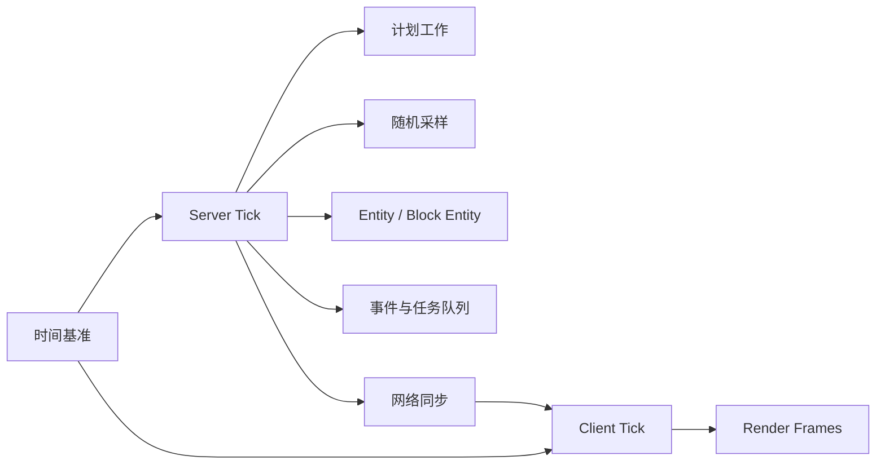
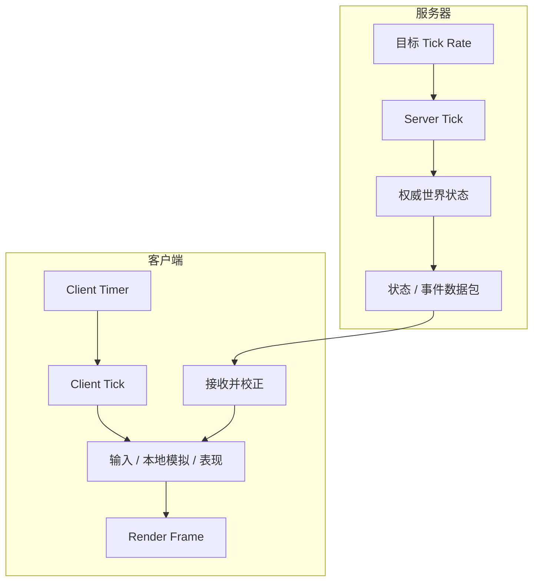
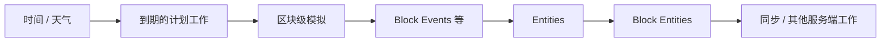

世界生成完成以后，世界并不会自己继续运行。作物要长大，流体要继续流动，实体要移动，熔炉要推进进度，红石要在未来某个时刻触发。对程序来说，这些变化最终都要回答两个问题：

1. **什么时候执行？**
2. **这一轮到底执行多少？**

这就是游戏循环与调度系统的职责。

Minecraft 很容易让人产生一个过于简单的印象：世界“每秒 Tick 20 次”，于是所有东西每秒都更新 20 次。真实实现没有这么粗糙。服务器确实有一个默认以 20 TPS 推进的主模拟节拍，但不同系统使用的调度方式并不相同：有些对象每个 Tick 都被遍历，有些工作预约未来某个 Tick，有些方块只是被随机抽样，有些事件进入额外队列，还有大量区块根本不会参与本轮模拟。

因此本章真正要回答的是：

> **Minecraft 怎样把一个持续运行的世界拆成离散的模拟步，并让不同类型的工作以不同频率、不同顺序和不同范围被推进？**

这一章主要以 **Java Edition 26.3** 的当前实现为参照。26.3 于 2026 年 9 月发布；涉及服务端主循环、客户端计时器和调度容器的具体类名都可能继续变化，因此正文重点放在这些实现背后的职责。[^release]


```mermaid
flowchart LR
  Clock["时间基准"] --> Server["Server Tick"]
  Clock --> Client["Client Tick"]
  Server --> Scheduled["计划工作"]
  Server --> Random["随机采样"]
  Server --> Objects["Entity / Block Entity"]
  Server --> Events["事件与任务队列"]
  Client --> Render["Render Frames"]
  Server --> Sync["网络同步"]
  Sync --> Client
```

## 游戏循环怎样把时间变成离散模拟

实时游戏通常同时面对两种时间需求：画面希望尽可能平滑地刷新，模拟却需要一个稳定、可解释的步长。Minecraft 把这两件事拆开处理。

### Frame 和 Tick 不是同一种更新

**Frame** 是客户端绘制一次画面。它的频率取决于 GPU、窗口、帧率限制和当前渲染负载，可以是 30 FPS、60 FPS、144 FPS，也可能不断变化。

**Tick** 是模拟推进一步。默认 Java 服务器目标为每秒 20 Tick，因此目标步长是：

$$
Delta t = rac{1}{20}	ext{ s}=50	ext{ ms}.
$$

如果客户端以 120 FPS 渲染，而服务器仍以 20 TPS 模拟，那么平均一个模拟 Tick 之间会画出约 6 帧。渲染器不会要求实体只能每 50 ms 跳一次位置，而是使用上一 Tick、当前 Tick 和 partial tick 等信息生成中间视觉状态。

<Callout type="info" title="固定步长解决的是模拟，不是显示">
固定 Tick 让游戏逻辑拥有稳定的时间单位；高帧率则让同一组离散状态看起来连续。把两者绑在一起，会让不同电脑上的移动、AI、计时和物理速度随着 FPS 改变。
</Callout>

这也是为什么 **FPS 下降不等于世界变慢**。如果客户端只能画 30 帧，但服务器仍稳定推进 20 Tick，世界逻辑仍然按原速度运行，只是观察它的画面不够平滑。

反过来，如果服务器只能做到 10 TPS，而客户端依旧能画 120 FPS，那么视角和 UI 仍可能很流畅，但服务器控制的模拟只以原来一半左右的墙钟速度推进。

### 20 TPS 是默认目标，不是不可改变的常数

Java 长期以 20 TPS 作为正常模拟节奏，这也是大量游戏时间参数的默认语境。但从 1.20.3 开始，官方加入了 `/tick` 管理命令，可以查询、冻结、单步、冲刺执行，甚至通过 `/tick rate` 修改目标 Tick Rate。[^tick-command]

所以更准确的表达不是：

> Minecraft 的时间永远等于 20 TPS。

而是：

> **Minecraft 默认以 20 TPS 运行，大量游戏规则和内容都以这个默认尺度设计；Tick Rate Manager 则把“目标模拟速率”本身也变成了可控制状态。**

如果目标速率是 $r$ TPS，那么理论预算是：

$$
B = rac{1000}{r}	ext{ ms/tick}.
$$

默认 $r=20$ 时，$B=50$ ms。把目标改成 40 TPS 后，理论预算只剩 25 ms；把目标改成 10 TPS，则每个 Tick 可以间隔约 100 ms。

这并不意味着把速率翻倍就能自动让服务器“快两倍”。如果每个 Tick 本身需要 35 ms，那么 20 TPS 尚能维持，40 TPS 却要求 25 ms 内完成同样工作，服务器会持续追不上目标。

### 固定步长不意味着“用 sleep(50ms) 就够了”

教学代码常被写成：

```java
while (running) {
    tick();
    sleep(50);
}
```

它的问题是忽略了 `tick()` 本身花费的时间。如果计算已经用了 30 ms，再睡 50 ms，实际就只有约 12.5 TPS。

更接近固定节拍的模型是：

```java
nextTick += targetTickDuration;

tick();

if (now < nextTick) {
    waitUntil(nextTick);
}
```

真正的 Java `MinecraftServer` 当然更复杂：它本身是一个可执行任务的事件循环，维护下一 Tick 时间、Tick Rate Manager、主线程任务，以及在剩余时间里可以继续处理的工作。当前 26.3 的 `MinecraftServer` 仍保留 `runServer`、`tickServer`、`waitUntilNextTick`、`nextTickTimeNanos` 等职责。[^server-loop]

这里值得抽象出的不是具体方法名，而是：

> **模拟循环既负责定时，也负责在安全的线程与顺序中消费工作。**

## 服务器和客户端为什么各自都有 Tick

Minecraft 是客户端—服务器架构。即使在单人游戏里，也存在集成服务器，因此“客户端 Tick”和“服务器 Tick”不是同一个函数的两个名字。

### Server Tick 推进权威世界

服务器负责决定权威游戏状态：世界时间、方块变化、实体状态、AI、伤害、库存结果以及其他需要多人一致的状态，都最终以服务器结果为准。

当前 Java 的服务器主循环会调用 `tickServer`，再推进各个 `ServerLevel` 和服务器级系统。每个维度内部又会处理计划刻、区块相关工作、实体、Block Entity、事件等。[^server-loop] [^server-level]

这里不要把“主线程”理解成“Minecraft 只有一个线程”。现代 Minecraft 还有 worldgen、IO、网络和其他 worker。但**权威世界状态的大量有序模拟仍然集中回服务器拥有者线程**，异步工作通常需要把结果安全地交回这个上下文再生效。

<Impl title="为什么很多游戏逻辑不直接并行">
如果两个线程同时修改相邻方块、实体列表或库存，结果很容易依赖竞争时序。把主要状态变更串到同一拥有者线程上，会牺牲一部分并行空间，却换来更容易推理的顺序与一致性。真正适合异步的通常是可隔离计算、IO、生成或准备工作。
</Impl>

### Client Tick 负责本地世界、输入与表现状态

客户端也有自己的逻辑节拍。Java 26.3 的客户端使用 `DeltaTracker.Timer`，初始化基准仍为 20 Tick/s，并根据服务端目标 Tick 间隔调整游戏时间推进；`Minecraft.runTick` 在一次外层循环中既可能执行若干客户端 Tick，也会继续渲染一帧。[^client-loop]

客户端 Tick 会推进输入、GUI、部分本地实体与 Block Entity、粒子、声音和其他表现或预测相关状态；但它不是多人世界的最终权威。

因此可以把两条循环理解成：


```mermaid
flowchart TB
  subgraph Server["服务器"]
    SClock["目标 Tick Rate"] --> STick["Server Tick"]
    STick --> World["权威世界状态"]
    World --> Packets["状态 / 事件数据包"]
  end

  subgraph Client["客户端"]
    CClock["Client Timer"] --> CTick["Client Tick"]
    CTick --> Prediction["输入 / 本地模拟 / 表现"]
    Prediction --> Frame["Render Frame"]
    Packets --> Reconcile["接收并校正"]
    Reconcile --> Prediction
  end
```

后面的客户端—服务器章节会再讨论 Prediction 与 Confirmation。本章只需要建立一个边界：

> **客户端也会 Tick，但服务器 Tick 才是共享世界时间的主要权威来源。**

### Render 可以比 Tick 更频繁

客户端外层循环不会“Tick 一次就必然 Render 一次”。当前客户端用计时器累计经过的游戏时间，计算本轮应执行多少 Tick，然后再渲染；同时还保留 partial tick，用于表现两个离散状态之间的位置。26.3 客户端甚至有 `MAX_TICKS_PER_UPDATE = 10` 这样的保护上限，避免一次帧循环因为欠下过多客户端 Tick 而无限补算。[^client-loop] [^client-constants]

这和服务器的过载处理并不完全相同，但两者都反映同一个工程问题：

> **真实时间可能前进得比模拟计算更快，系统必须决定积压要不要补、补多少，以及何时放弃追赶。**

## 为什么不同工作需要不同的调度方式

如果每个 Tick 都遍历世界里的每个方块，Minecraft 很快就会失去可扩展性。

一个已经探索很久的世界可以包含数量巨大的方块，但绝大多数方块在绝大多数时间都不需要做任何事情。调度系统的核心价值，就是让“需要变化”成为稀疏事件，而不是每轮扫描全部状态。

Minecraft 至少同时使用几种不同策略。

### 每 Tick 更新：适合持续活动对象

Entity 和一部分 Block Entity 属于典型的**持续更新对象**。

一个生物可能每 Tick 都需要推进移动、AI 状态、伤害无敌时间或其他计时；熔炉、漏斗等 Block Entity 也可能需要周期性处理内部逻辑。

这种模式最直观：

```text
active objects
    ↓
for each tick
    ↓
tick(object)
```

优点是状态机容易写，缺点是成本随活动对象数量增长。因此“哪些对象进入 ticking set”“什么时候可以停止完整 AI”“哪些区块允许 Tick”都非常重要。26.3 甚至继续优化了玩家远离时某些 Mob 的随机移动行为，说明“每 Tick 都做完整工作”并不是理所当然的。[^mob-optimization]

实体的移动、AI 与激活条件会在第 06 章展开。本章只把它归类为一种调度策略：**持续对象遍历**。

### Scheduled Tick：适合“未来某时再做一次”

流体、某些方块和红石组件常常不需要每 Tick 自己检查：

> 我现在是不是该变化了？

它们可以在状态改变时直接预约未来执行：

```text
schedule(position, object, delay, priority)
                    ↓
             future game time
                    ↓
                 execute
```

这就是 Scheduled Tick。

Java 当前把 Block Scheduled Ticks 与 Fluid Scheduled Ticks 分开管理。26.3 的 `ServerLevel` 分别持有 `LevelTicks<Block>` 与 `LevelTicks<Fluid>`；`LevelTicks` 再按 Chunk 维护 `LevelChunkTicks` 容器，记录哪些工作已经到期、下一条工作什么时候到期，并在本轮预算内抽取执行。[^scheduled]

这和“每个方块都有一个倒计时变量”相比有几个优势：

- 没有预约工作的方块完全不占 Tick 遍历；
- 可以按目标时间直接找到即将到期的工作；
- Chunk 加载 / 卸载时可以整体管理该区域的计划；
- 同一位置的重复预约、优先级与执行顺序可以集中处理。

Java 26.3 的 `ServerLevel.MAX_SCHEDULED_TICKS_PER_TICK` 仍为 65536，并分别作为 Block 与 Fluid 队列一次 drain 的上限。[^scheduled-limit] 这个数字不应被理解成“世界每 Tick 最多只能发生这么多变化”，它只是这两类 Scheduled Tick 的保护预算。

<Callout type="warning" title="Scheduled Tick 不是线程定时器">
它不是“50 ms 后在另一个线程回调”。预约的是**游戏时间上的 Tick**。服务器变慢、被冻结或主动修改 Tick Rate 时，墙钟时间与这个延迟会一起变化。
</Callout>

### Random Tick：适合“不要求精确时刻”的自然变化

作物生长、树叶衰减、部分扩散和老化行为不需要精确预约某个时间点。如果给每棵小麦都建立一个未来事件，世界里会积累大量独立计时器。

Minecraft 对这类行为采用 **Random Tick**：每个参与随机刻的 Chunk Section，在 Chunk Tick 时随机挑选若干位置；如果该位置的 Block 支持随机刻，就执行它的随机逻辑。

Java 当前仍通过 `minecraft:random_tick_speed` Game Rule 控制这一采样强度，默认值为 3；这个数表示每个参与 Random Tick 的 Section 每次 Chunk Tick 的随机位置尝试数量。[^random-tick]

随机刻的设计目标不是精确计时，而是：

> **用固定规模的随机采样，让大量静态方块获得统计意义上的缓慢变化。**

如果某类作物平均需要若干次被抽中才生长，那么单株植物的具体时间会有随机性，但整个农田在长期尺度上会呈现稳定的增长速率。

这是 Scheduled Tick 和 Random Tick 最重要的区别：

| 调度方式 | 问的问题 | 典型用途 |
| --- | --- | --- |
| Scheduled Tick | “第 N 个游戏 Tick 后再执行我” | 流体、延迟组件、部分方块状态 |
| Random Tick | “这一轮是否随机轮到我” | 生长、扩散、衰减、氧化等 |
| Per-Tick Update | “只要我是活动对象，每轮都推进” | Entity、部分 Block Entity |

### Event / Task Queue：适合延后到安全阶段

还有一些工作既不是“每 Tick 更新”，也不是“未来 N Tick 后执行”，而只是：

> 这件事已经发生了，但请在主循环的某个安全位置再处理。

Java 的服务器本身继承自可执行任务的 Event Loop，网络线程、异步任务和其他系统可以把需要主线程执行的工作重新投递回来。世界内部还有 Block Event 等专用队列。[^server-loop] [^server-level]

这提醒我们不要把 Minecraft 的所有“延迟执行”都叫 Tick Queue。实际至少有：

- 按游戏时间排序的 Scheduled Tick；
- 每轮随机抽样的 Random Tick；
- 活动对象的 Tick traversal；
- 当前或后续安全阶段执行的任务 / 事件队列。

它们解决的问题不同。

## 一次 Server Tick 为什么还需要内部顺序

“都发生在同一个 Tick”并不意味着“同时发生”。

服务器仍然要按某个次序推进不同系统。顺序一旦固定，就会形成可观察的因果关系：某个 Scheduled Tick 在实体移动之前执行，和在实体移动之后执行，可能得到不同结果。

### Tick 是时间片，也是依赖顺序

当前 Java 的 `ServerLevel.tick` 会按明确阶段处理世界时间、Scheduled Block / Fluid Tick、区块相关工作、Block Events、Entity 与 Block Entity 等系统。具体顺序会随版本调整，因此更适合画成职责图，而不是把当前源码行号写成永久规则。[^server-level]


```mermaid
flowchart LR
  Time["时间 / 天气"] --> Pending["到期的计划工作"]
  Pending --> Chunks["区块级模拟"]
  Chunks --> Events["Block Events 等"]
  Events --> Entities["Entities"]
  Entities --> BlockEntities["Block Entities"]
  BlockEntities --> Sync["同步 / 其他服务端工作"]
```

这里最值得开发者注意的不是“背下这个顺序”，而是：

> **当多个系统会读写同一世界状态时，调度顺序本身就是行为定义的一部分。**

后面的红石章节会看到，这种执行顺序甚至可以变成玩家可利用的技术细节。

### 优先级不能替代阶段

Scheduled Tick 自己还可以有 priority、sub-tick order 等排序信息，但它们只负责**同一调度系统内部**的先后。

不能因为某个 Scheduled Tick priority 很高，就让它跳过整个 Entity Tick 或网络阶段，跑到任意位置。

这是一条很通用的调度设计原则：

```text
全局阶段顺序
    ↓
阶段内部队列
    ↓
队列内部 priority / due time / tie-break
```

把这几层混在一起，最终往往会得到一个“万能优先级队列”，却无法清晰表达哪些依赖必须严格发生在另一些工作之前。

### “下一 Tick”也不是绝对墙钟时间

假设一个方块预约：

```text
delay = 4 ticks
```

默认 20 TPS 时，理想情况下约等于：

$$
4 	imes 50	ext{ ms}=200	ext{ ms}.
$$

但如果服务器实际只运行 10 TPS，那么四个游戏 Tick 可能需要约 400 ms 墙钟时间；如果使用 `/tick rate 40` 且服务器跟得上，则只需要约 100 ms。

因此 Minecraft 内容里的大量 duration，本质上首先是**模拟步数**，其次才是在默认目标速率下换算出的现实秒数。

<Alternative title="为什么不全部改成真实秒">
真实秒适合 UI 超时、网络 timeout、文件操作等墙钟事件；游戏 Tick 适合需要随暂停、慢动作、单步调试和模拟速率一起变化的世界逻辑。把两类时间统一，反而会让暂停后的熔炉继续烧、慢动作里的流体突然按现实速度流动。
</Alternative>

## 当 Tick 预算守不住时发生什么

默认 20 TPS 给每轮约 50 ms 墙钟预算。这里开始出现三个经常混淆的指标：FPS、TPS 和 MSPT。

### TPS 描述推进频率，MSPT 描述单轮成本

**TPS（Ticks Per Second）**回答：

> 一秒墙钟时间里，服务器实际完成了多少个 Tick？

**MSPT（Milliseconds Per Tick）**回答：

> 一次 Tick 平均 / 当前花了多少毫秒计算？

默认 20 TPS 时，关键关系是：

$$
	ext{MSPT} le 50	ext{ ms}
$$

才有条件长期维持目标 20 TPS。

如果 Tick 只需要 12 ms，剩余时间可以等待下一目标时刻，也可以处理适合在间隙完成的主线程任务。如果 Tick 需要 80 ms，那么下一次目标时刻早就过去了，服务器就进入“追不上”的状态。

TPS 和 MSPT 不是完全相同的量：

- MSPT 是成本；
- TPS 是最终实现的节奏；
- Tick Rate 则是希望达到的目标节奏。

所以更完整的关系是：

```text
Target Tick Rate
       ↓
Target MSPT budget
       ↓
Actual work cost (MSPT)
       ↓
Can keep up?
  ↙          ↘
yes          no
 ↓            ↓
target TPS   effective TPS falls
```

第 11 章会进一步把 Entity、Chunk I/O、Worldgen、GC、Block Entity 等拆成预算来源；本章只建立这个时间模型。

### FPS、TPS 和 Ping 分别属于不同问题

| 指标 | 主要描述 | 典型症状 |
| --- | --- | --- |
| FPS | 客户端渲染速度 | 画面卡顿、镜头不流畅 |
| TPS | 服务器模拟推进速度 | 游戏世界整体变慢 |
| MSPT | 一次服务器 Tick 的计算成本 | 判断服务器是否有能力守住目标 TPS |
| Ping | 网络往返延迟 | 操作确认晚、远程玩家更新滞后 |

它们可以同时变差，也可以彼此独立。

例如：

- 20 TPS + 25 MSPT + 20 FPS：服务器正常，客户端渲染慢；
- 10 TPS + 95 MSPT + 144 FPS：客户端很流畅，但服务器世界推进变慢；
- 20 TPS + 10 MSPT + 300 ms Ping：服务器和客户端都算得快，只是网络确认迟。

这也是为什么“卡”不是一个足够好的技术诊断词。

### 服务器不能无限追赶欠下的 Tick

一个固定步长循环如果落后，有三种极端策略：

1. **全部补算**：永远把欠下的 Tick 算完；
2. **完全跳过模拟**：直接把逻辑时间跳到现在；
3. **有限追赶后重置节拍**：在可接受范围补算，过度落后时放弃继续累积债务。

Minecraft 的实际循环属于第三类。服务器维护下一 Tick 的目标时间并处理过载情况；当落后太多时，不会无限地把积压 Tick 一轮接一轮补回来，否则“计算太慢 → 补更多 Tick → 更慢”会形成死亡螺旋。[^server-loop]

这意味着服务器过载时，**墙钟时间和游戏时间会逐渐脱离**。不是把所有遗漏的世界变化一次性快进，而是模拟本身以较低有效频率继续前进。

### Watchdog 处理的是“这一 Tick 可能永远结束不了”

TPS 下降和服务器死锁 / 极长 Tick 还是两种不同级别的问题。

Java Dedicated Server 的 `max-tick-time` 当前默认仍是 60000 ms。单个 Tick 长时间无法完成时，Watchdog 会把服务器视为挂死并强制终止；设置为 `-1` 可以关闭这一保护。[^watchdog]

50 ms 与 60000 ms 不是两个竞争的“Tick 预算”：

- 50 ms 是默认 20 TPS 的**性能目标**；
- 60000 ms 是默认 Watchdog 的**故障阈值**。

一个服务器每 Tick 都花 70 ms 时，会明显低于 20 TPS，但不会触发 Watchdog；一个 Tick 卡住几十秒，则说明系统已经远超普通性能下降的范围。

## 从调度系统可以抽象出什么

Minecraft 的时间系统看起来由许多特例拼成：Server Tick、Client Tick、Random Tick、Scheduled Tick、Entity Tick、Block Event、网络任务。真正有价值的不是把这些名字记住，而是看见它们为什么被分开。

### 不要让所有状态都以同一种频率更新

不同问题需要不同节奏：

- 连续运动适合每 Tick 推进；
- 明确延迟适合 Scheduled Tick；
- 大量低频自然过程适合随机抽样；
- 跨线程结果适合重新投递到拥有者线程；
- 纯视觉变化可以按 Frame 更新或插值。

如果把所有逻辑都写成：

```csharp
void Update()
{
    // every object, every frame, everything
}
```

规模增长后既浪费 CPU，也很难区分模拟时间和显示时间。

### “什么时候执行”本身就是数据

Scheduled Tick 的 due time、priority，Entity 是否进入 ticking set，Chunk 是否参与 Random Tick，本质上都在保存同一类信息：

> 这份状态现在是否有资格被推进？

成熟的模拟系统不会只设计对象数据结构，还会设计**执行资格的数据结构**。

这也是为什么调度容器、活跃集合、距离图和队列常常与游戏对象本身一样重要。

### 固定步长提供可解释性，不提供免费性能

固定步长最重要的优势，是给逻辑提供共同时间单位和稳定的更新边界。它让：

- “4 Tick 后执行”有明确意义；
- 单步调试成为可能；
- 多人服务器有共享模拟时间；
- 渲染可以在离散状态之间插值。

但固定步长不会自动让游戏性能稳定。如果一轮工作超过预算，整个系统仍会落后。

因此真正的设计问题始终是两层：

```text
时间模型：世界应该怎样推进？
        +
预算模型：这一轮允许做多少工作？
```

前者是本章，后者将在第 11 章展开。

## 这一章留下什么

Minecraft 的 Tick 不是一种“每秒调用 20 次所有对象”的简单机制。它首先提供离散的模拟时间，再把不同工作分配给不同调度策略：持续活动对象按 Tick 遍历；精确未来工作进入 Scheduled Tick；大量低频自然变化通过 Random Tick 抽样；线程外结果和局部事件则进入各自的任务或事件队列。阶段顺序继续决定同一个 Tick 内部的因果关系。

默认 20 TPS 只是这套系统最重要的产品尺度，而不是不能改变的数学常数。现代 Java 已经可以通过 `/tick rate`、`freeze`、`step` 和 `sprint` 直接操纵模拟节拍。真正稳定的工程关系是：**模拟时间与渲染时间分离，世界状态在明确的拥有者与阶段中推进，而每一种工作只以它真正需要的频率被调度。**

对开发者来说，最值得继承的不是“20”这个数字，而是四个边界：**Frame 与 Simulation 分离；墙钟时间与游戏时间分离；对象状态与执行资格分离；全局阶段顺序与阶段内部优先级分离。** 这些边界让一个越来越复杂的世界仍然可以被解释、调试和限流。

下一章继续向下进入方块世界内部：当某个 Block State 已经改变，Neighbor Update、Scheduled Tick、Random Tick、光照、流体、火焰和生长又怎样让这种局部变化继续传播。

[^release]: Mojang Studios，《Minecraft Java Edition 26.3》，2026-09-15。见 https://www.minecraft.net/en-us/article/minecraft-java-edition-26-3

[^tick-command]: Mojang Studios，《Minecraft Java Edition 1.20.3》，2023-12-05；`/tick` 在 1.20.3 正式加入，可查询目标速率、修改 Tick Rate、冻结、单步与 sprint。见 https://www.minecraft.net/en-us/article/minecraft-java-edition-1-20-3 与 https://feedback.minecraft.net/hc/en-us/articles/20707371679117-Minecraft-Java-Edition-Snapshot-23w43a

[^server-loop]: Java 26.3 当前映射接口中，`MinecraftServer` 仍是 `ReentrantBlockableEventLoop<TickTask>`，并包含 `runServer`、`tickServer`、`waitUntilNextTick`、`nextTickTimeNanos` 与 `ServerTickRateManager` 等职责。当前 26.3 主循环的 deadline、过载跳过与任务预算可交叉核对 How Java Minecraft Works 的源码追踪。见 https://aldak.netlify.app/javadoc/26.3.x/net/minecraft/server/minecraftserver 与 https://minecraftdocs.dev/systems/server/server-tick

[^server-level]: Java 26.3 `ServerLevel` 当前仍持有独立的 `blockTicks`、`fluidTicks`、`entityTickList` 与 `blockEvents`，并在 `tick` 中按阶段推进维度状态。见 NeoForge 26.3 映射 Javadoc：https://aldak.netlify.app/javadoc/26.3.x/net/minecraft/server/level/serverlevel

[^client-loop]: Java 26.3 客户端 `Minecraft` 创建 `DeltaTracker.Timer(20.0F, ..., this::getTickTargetMillis)`，`runTick` 根据计时器返回的 `ticksToDo` 推进客户端 Tick，并在同一外层循环继续渲染。见 26.3 源码镜像：https://mc-packet-reference.netlify.app/26.x/source/net/minecraft/client/minecraft/

[^client-constants]: Java 26.3 `Minecraft.MAX_TICKS_PER_UPDATE` 当前为 10。见 NeoForge 26.3 Constant Field Values：https://aldak.netlify.app/javadoc/26.3.x/constant-values

[^mob-optimization]: Mojang Studios，《Minecraft 26.3 Snapshot 2》，2026-06-30。Persistent mobs 的 random walk / swim 行为在玩家不靠近时也会停用，与其他 mob 的远距离行为一致。见 https://www.minecraft.net/en-us/article/minecraft-26-3-snapshot-2

[^scheduled]: Java 26.3 `LevelTicks<T>` 以 Chunk 容器维护计划工作，记录下一到期时间、待运行集合和容器 drain 顺序；`ServerLevel` 分别实例化 Block 与 Fluid 两套 `LevelTicks`。见 https://aldak0.ru/javadoc/26.3.x/net/minecraft/world/ticks/LevelTicks.html 与 https://aldak.netlify.app/javadoc/26.3.x/net/minecraft/server/level/serverlevel

[^scheduled-limit]: Java 26.3 `ServerLevel.MAX_SCHEDULED_TICKS_PER_TICK` 当前为 65536；Block 和 Fluid Scheduled Ticks 分别以该值作为一次处理上限。见 NeoForge 26.3 Constant Field Values：https://aldak.netlify.app/javadoc/26.3.x/constant-values

[^random-tick]: Java 26.3 的 `GameRules.RANDOM_TICK_SPEED` 仍为整数规则；当前 Bukkit / Paper API 对原版语义的说明为：每个参与的 Chunk Section 每游戏 Tick 随机选择相应数量的位置，0 会禁用 Random Tick。见 NeoForge 26.3 `GameRules` 映射与 Paper 26.3 API：https://aldak0.ru/javadoc/26.3.x/net/minecraft/world/level/gamerules/GameRules.html 以及 https://paper-jd.masmc05.dev/org/bukkit/GameRule.html

[^watchdog]: Java 26.3 Dedicated Server 的 `server.properties` 仍包含 `max-tick-time=60000`；超过阈值时 Watchdog 会将单个 Tick 视为挂死，`-1` 可关闭。见 Paper server.properties reference：https://docs.papermc.io/paper/reference/server-properties/ 。该默认值也可由 26.3 原版属性表交叉核对。
