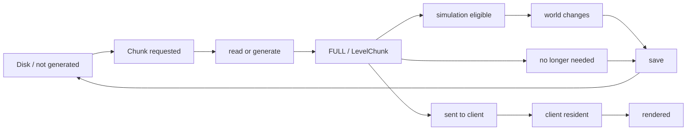
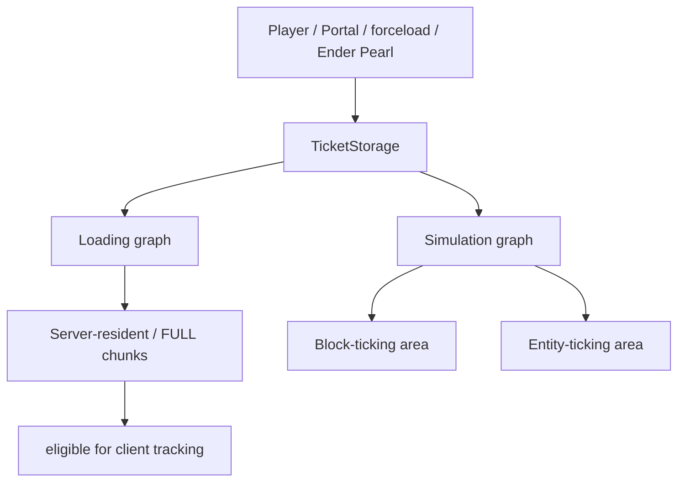
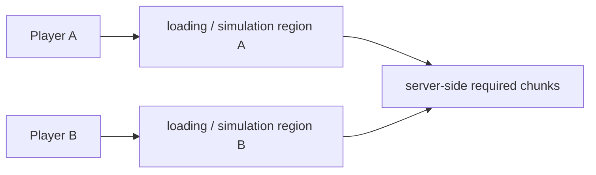
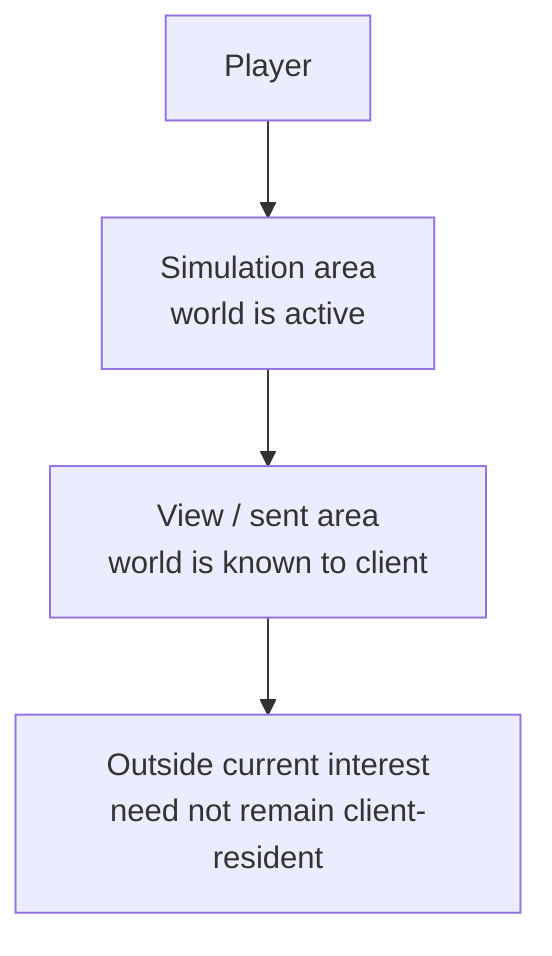
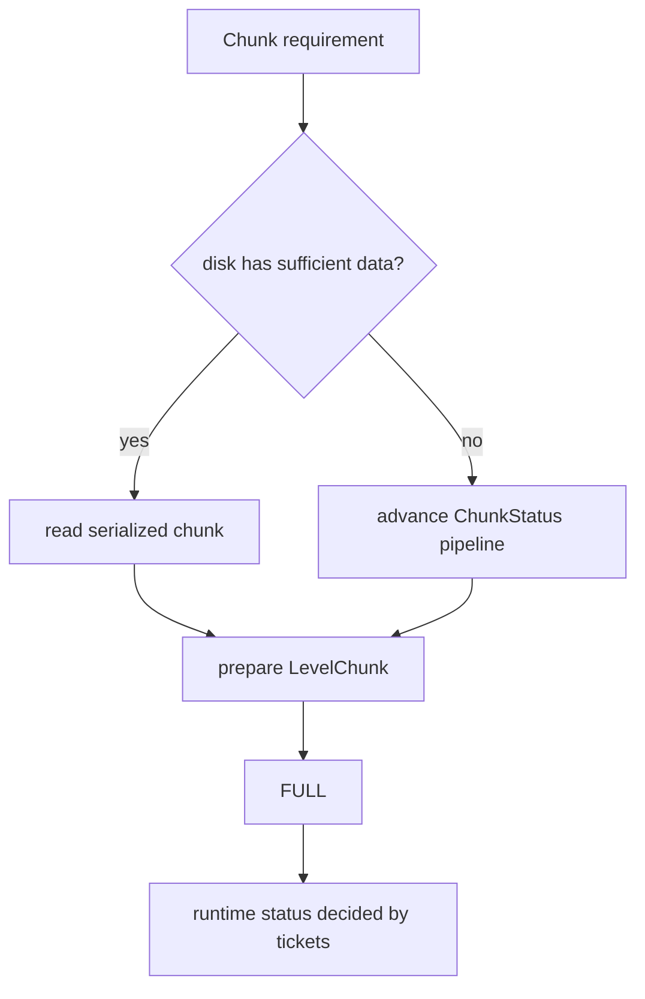
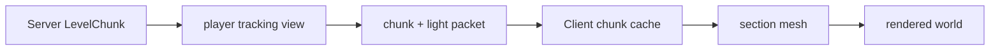
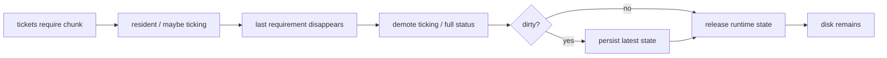
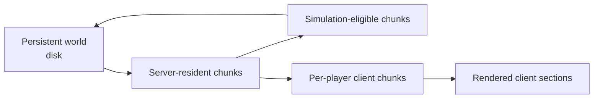

玩家一直向东走时，地平线会不断出现新的山、森林和洞穴。对玩家来说，这是一个连续世界；对运行时来说，前方每一片区域却可能处于完全不同的状态：有的已经存在于存档里，只需要读回；有的从未生成；有的已经在服务器内存中，却不参与 Entity Tick；有的正在模拟，却还没有发送给某个客户端；有的刚刚离开所有人的活动范围，正在等待保存和卸载。

所以“Chunk Loading”其实只描述了其中一小段。

一个长期运行的体素世界真正需要解决的是：

> **哪些 Chunk 现在值得存在于运行时，它们应该推进到什么状态，又什么时候可以退回磁盘？**

这就是 World Streaming。世界本身可以持续扩展，但服务器、客户端、内存、CPU 和网络始终只处理一个不断移动的工作集。

上一章[《网络架构与状态同步》](/impl/networking)已经解释了 Chunk 怎样作为大块状态发送给客户端；第 03 章[《世界生成》](/impl/worldgen)则解释了一个新区域怎样从 Seed 和生成规则得到地形。本章把两端接起来：**谁触发 Chunk 需求，Chunk 怎样进入内存、升级到可模拟状态、进入客户端视野，最后又怎样保存并离开。**

本文主要以 **Java Edition 26.3** 的当前实现为参照。这里尤其不能照搬旧资料：Java 已在 1.21.9 移除了固定常驻的 Spawn Chunks；当前 Ticket 系统也明确区分 Loading 与 Simulation 两类需求。[^spawn-chunks] [^tickets]



这张图故意没有画成一条单线。一个 Chunk 可以已经发给客户端却不参与完整模拟，也可以在服务器上因为 Portal 或 `/forceload` 保持活动而没有任何玩家正在看它。理解这一章的关键，就是放弃“Loaded / Unloaded”两个状态足以描述一切的想法。

## 一个 Chunk 在运行时到底有哪些状态？

日常讨论里，“这个区块加载了吗”通常已经够用；对引擎实现来说却太粗。

同一列世界数据至少可能以**存档记录、生成中的 ProtoChunk、可访问的 LevelChunk、不同 Ticking 等级、客户端副本和渲染 Mesh**几种形式存在。它们共享坐标，却承担完全不同的职责。

### “Loaded”不是一个足够精确的布尔值

可以从几个常见问题看出区别：

- 存档里有这个 Chunk 吗？
- 服务器已经为它建立 `ChunkHolder` 了吗？
- 地形生成推进到哪一步？
- 它已经成为普通 `LevelChunk` 了吗？
- Scheduled Block / Fluid Tick 可以执行吗？
- Entity 会在里面 Tick 吗？
- 某个玩家的客户端已经收到它了吗？
- 客户端已经为它编译好 Section Mesh 了吗？

这些问题不能由同一个 `loaded = true` 回答。

<Callout type="info" title="“加载”最好拆成具体能力">
讨论 Chunk Lifecycle 时，优先说“已存在于服务器内存”“达到 FULL”“允许 Block Ticking”“已发送给客户端”，而不是把所有阶段都压成“已加载”。这能避免大量关于 Render Distance、Simulation Distance 和 Ticket 的歧义。
</Callout>

现代 Java 自己也把这些问题分成多套状态系统。生成进度由 `ChunkStatus` 表示；一个完整 Chunk 当前能承担多少运行时职责，则由 `FullChunkStatus` 与 Ticket Level 决定。[^chunk-status] [^chunk-level]

### ChunkStatus 描述“这块世界生成到哪一步”

在 26.3 中，主要 `ChunkStatus` 顺序仍包括：

```text
EMPTY
→ STRUCTURE_STARTS
→ STRUCTURE_REFERENCES
→ BIOMES
→ TERRAIN
→ FEATURES
→ INITIALIZE_LIGHT
→ LIGHT
→ SPAWN
→ FULL
```

这里的 `TERRAIN`、`FEATURES` 等具体怎样生成，已经属于第 03 章。本章只关心它们作为**依赖阶段**的意义：如果某个请求最终需要 `FULL`，系统必须保证当前 Chunk 以及相关邻区满足这一生成任务要求的前置状态。[^chunk-status]

生成中的对象主要属于 `PROTOCHUNK` 类型；达到完整世界运行所需阶段以后，才会进入普通 `LEVELCHUNK` 表示。26.3 的 `ChunkType` 仍然明确区分这两类。[^chunk-type]

所以：

> **Generation Status 不是“这个 Chunk 有没有”，而是“它已经具备了多少可用世界数据”。**

### FULL 也不等于“所有东西都在 Tick”

即使 `ChunkStatus.FULL` 已经完成，服务器仍然要回答：

> 这个 Chunk 当前应该只是可访问，还是应该真正参与世界模拟？

当前 `FullChunkStatus` 有四个等级：[^full-status]

| FullChunkStatus | 含义可以怎样理解 |
| --- | --- |
| `INACCESSIBLE` | 尚未作为普通 Full Chunk 提供运行时访问 |
| `FULL` | 已成为可用的 LevelChunk，但不代表完整模拟 |
| `BLOCK_TICKING` | 允许对应的方块 / 流体等 Chunk Tick 路径 |
| `ENTITY_TICKING` | 进一步允许 Entity Ticking |

`ChunkLevel` 再把 Ticket Level 映射到这些状态，并分别提供 `isLoaded`、`isBlockTicking` 和 `isEntityTicking`。[^chunk-level]

这就是后面区分 Render / View / Simulation Distance 的基础：

> **“客户端能看见它”与“服务器让它活着”从设计上就是两个问题。**

## 谁决定一个 Chunk 应该留下来？

Minecraft 不能只在玩家跨过 Chunk 边界时写：

```java
load(chunk);
```

因为玩家不是唯一的需求来源。Portal、Ender Pearl、`/forceload`、世界出生准备和生成依赖都可能要求某些 Chunk 暂时存在。

现代 Java 用 **Ticket** 表达这种需求。

### Ticket 更像“我现在需要这片区域达到什么等级”

一个 Ticket 不拥有 Chunk，也不直接执行磁盘读取。

它更像向世界流送系统提交一个约束：

> **在这个 Chunk 附近，我需要至少达到某种加载或模拟等级。**

当前 `Ticket` 保存 Ticket Type、Ticket Level 和剩余时间；`TicketStorage` 负责保存每个位置上的 Ticket，`DistanceManager` 再把这些源扩散成周围 Chunk 的目标等级。[^ticket] [^ticket-storage] [^distance-manager]

因此 Ticket 系统解决的不是单个 `load() / unload()` 调用，而是一个持续变化的空间需求图。

玩家走一步以后，不需要手动列出：

```text
load (11, 3)
load (11, 4)
unload (-10, 2)
...
```

只需要移动玩家对应的需求中心，Distance Manager 会重新计算哪些 Chunk 进入或离开要求范围。

### 26.3 把 Loading 与 Simulation 明确分成两类需求

当前 `TicketType` 已经带有 `FLAG_LOADING` 与 `FLAG_SIMULATION` 等标志，并分别存在 `PLAYER_LOADING` 与 `PLAYER_SIMULATION`。[^ticket-type]

这件事非常关键。

**PLAYER_LOADING** 回答：

> 玩家为了看到和接收世界，需要哪些 Chunk 准备好？

**PLAYER_SIMULATION** 回答：

> 玩家为了让附近世界继续运行，需要哪些 Chunk 参与模拟？

它们最后由不同的距离图处理。26.3 的 `DistanceManager` 同时维护 Loading 与 Simulation 相关 Tracker；同一份 Ticket Store 可以因此产生两张不同的空间结果。[^tickets]



这解释了一个看似矛盾、实际非常合理的状态：

> **一个 Chunk 可以已经生成、加载并发送给玩家，但其中的 Entity 和方块并不需要继续 Tick。**

如果视野半径很大而 Simulation Distance 较小，玩家就能看见远处山脉，却不必为那片山里的所有 Entity AI 和 Block Tick 支付同样的模拟成本。

### Ticket Type 表示“为什么需要”，而不是只有玩家一种来源

26.3 当前原版仍有多种 Ticket Type，包括 `PLAYER_LOADING`、`PLAYER_SIMULATION`、`FORCED`、`PORTAL`、`ENDER_PEARL`、`DRAGON`、`PLAYER_SPAWN` 与 `SPAWN_SEARCH` 等。[^ticket-type]

它们的用途不同：

- 玩家产生日常的 Loading / Simulation 区域；
- `/forceload` 可以让指定 Chunk 在没有玩家时继续被请求；
- Portal 活动可以让相关区域跨维度保持工作；
- 飞行中的 Ender Pearl 可以维持附近 Chunk；
- 玩家加入世界和寻找出生位置时，会产生短期的 Spawn / Search 需求；
- Ender Dragon Fight 也有自己的区域需求。

这比“玩家附近加载，远处卸载”更准确：

> **玩家只是最常见的 Chunk Demand Source，不是唯一来源。**

### 固定 Spawn Chunks 已经不再存在

这是现代 Java 和大量旧教程之间最值得明确区分的一点。

从 **Java 1.21.9** 开始，Mojang 移除了长期固定常驻的 “Spawn Chunks” 概念。官方给出的理由很直接：长期保持出生点附近 Chunk 常驻会为所有玩家持续占用内存和运行成本，而它最初用于快速进入世界的技术目的已经可以由新的加载流程替代。[^spawn-chunks]

当前 26.3 因此不能再写：

> 世界出生点周围永远有一圈固定 Spawn Chunks 在运行。

世界创建、玩家加入、`/forceload`、Portal 与 Ender Pearl 等仍然可以让 Chunk 在没有普通玩家驻留时加载，但它们现在通过**具体需求**工作，而不是依赖一块永远常驻的特殊出生区域。

<Callout type="warning" title="旧版“Spawn Chunk 半径”资料已经过时">
1.20.5 一度把 Spawn Chunk Radius 缩小并做成 Game Rule，但 1.21.9 又进一步移除了固定 Spawn Chunks。讨论现代 26.3 Chunk Lifecycle 时，不应该再把旧的出生区常驻模型当作基础架构。
</Callout>

这次改动反而让 Ticket 模型更容易理解：世界中没有一块区域仅仅因为“这里是出生点”就永久特殊，Chunk 是否保持活动更直接地来自当前仍存在的需求。

### 多玩家世界只是把更多需求叠在同一张图上

两名玩家相距很近时，他们的 Loading / Simulation 区域大量重叠；相距很远时，服务器则可能同时维护两片甚至更多活动岛屿。



重叠 Chunk 并不会因为有两名玩家就保存两份 Server LevelChunk。世界状态仍然只有一份。

但客户端视图是分别维护的：同一个 Server Chunk 可以同时被多个玩家 Tracking，也可以只发送给其中一个玩家。因此多人增加的不只是活动区域，还可能增加同一状态向多个连接发送的 Fan-out。

这部分的**成本**留到下一章；本章只需要看清所有权：

> **Server Chunk 是共享世界状态，Client Chunk 是每个玩家各自持有的世界投影。**

## 看得见、已加载、正在模拟为什么要分开？

“距离”是 Chunk Streaming 最容易被混成一个数字的地方。

玩家设置里有 Render Distance，服务器配置里有 View Distance 和 Simulation Distance，Entity 还有自己的 Tracking Range，自然生成又有另一套与玩家距离相关的条件。它们都围绕“离玩家多远”，却回答不同问题。

### Render / View Distance 决定客户端应该知道多少世界

客户端的 Render Distance 表达：

> 我希望多远的地形可以进入我的客户端世界与渲染候选范围？

服务器仍然有自己的 View Distance 上限。Java 1.20.2 的网络优化之后，官方明确说明：服务器只向客户端发送处于该客户端 Render Distance 内的 Chunk；实际可见范围仍会受到 Server 配置约束。[^network-1202]

在当前实现里，`ChunkMap` 为每个玩家维护 `ChunkTrackingView`，`PlayerChunkSender` 则负责把新进入视野的 Chunk 排入发送队列。[^chunk-map]

因此所谓“Render Distance”在多人游戏中并不是客户端单方面命令服务器加载任意远距离世界，而是 Client Preference 与 Server Policy 最终共同形成一个 Tracking View。

一旦 Chunk 离开这个 View，服务器会告诉客户端 Forget；客户端可以把相应世界副本和渲染缓存释放掉。第 09 章讲的 Section Mesh 正是建立在这份 Client-side Chunk 数据之上。

### Simulation Distance 决定世界多远还需要继续运行

Simulation Distance 是另一件事。

Java 1.18 正式加入这一设置，官方当时给出的目的就是：**让较远 Chunk 可以继续被渲染，但其中的 Entity、Block 和 Fluid 不必都继续 Update，从而把可见距离与 CPU 模拟范围拆开。**[^simulation-distance]

这使下面的组合变得合理：

```text
Render / View Distance = 20 chunks
Simulation Distance   = 8 chunks
```

玩家仍然可以看见远山，但距离较远的区域只需要作为可见世界存在，不需要让 Crop、Fluid、Mob AI 等以同样方式持续推进。



这张图是概念关系，不代表实际实现是三个完美同心圆。Chunk Tracking 使用自己的距离计算，Simulation Graph 又有内部等级；边缘上还会存在不同 FullChunkStatus 的过渡。

### BLOCK_TICKING 和 ENTITY_TICKING 进一步拆开模拟资格

“在 Simulation Distance 内”仍然不是唯一的内部状态。

26.3 的 `FullChunkStatus` 继续区分 `BLOCK_TICKING` 与 `ENTITY_TICKING`；`ChunkLevel` 也分别提供两个判定。[^full-status] [^chunk-level]

这说明 Server Runtime 需要的不是：

```text
active = true / false
```

而是更细的：

```text
can be accessed
can tick blocks / fluids
can tick entities
```

在当前实现中，Block Ticking 的边界比 Entity Ticking 多一层内部过渡。[^server-level-tick]

这种设计的意义不在于玩家记住某个 Ticket Level 数字，而是建立一种更通用的思路：

> **不同子系统可以拥有不同的激活半径，不必为了一个最昂贵的系统把所有系统同时打开。**

### Simulation Distance 也不是所有“附近规则”的总开关

即使已经有 Simulation Distance，Minecraft 仍然存在其他空间条件。

Natural Mob Spawning 会继续考虑玩家距离和专门的 Spawn Candidate 范围；Entity 是否发送给某个 Client 也取决于 Entity Tracking；某些 Game Event、AI 搜索或其他系统还可能有自己的空间查询。

所以不要把：

> Simulation Distance = 世界里一切逻辑的绝对半径

当成真实实现。

更准确的是：

> **它定义 Server Chunk Simulation 的主要活动范围，但具体系统仍可以在这个基础上拥有自己的资格条件。**

这也是为什么“区块有没有 Tick”与“某个 Mob 会不会 Spawn”不能只用同一个距离数字回答。

### 距离设置本质上是在控制不同层的工作集

可以把几个常见设置归纳成：

| 概念 | 主要回答 |
| --- | --- |
| Client Render Distance | 客户端希望保留 / 绘制多远的 Chunk |
| Server View Distance | 服务器最多为玩家追踪和发送多远的 Chunk |
| Simulation Distance | 多远的 Server Chunk 进入主要模拟范围 |
| Entity Tracking Range | 某类 Entity 多远仍需要同步给某个玩家 |
| Forced / Portal Ticket | 即使附近没有普通玩家，某片区域是否仍有运行需求 |

它们不是五个不同名字描述同一件事，而是**五种不同资源所有权问题**。

对于自研开放世界，这种拆分通常比一个万能的 `activeRadius` 更有扩展性：Render、AI、Physics、Network Interest 和 Persistence 的合理半径，本来就未必相同。

## 一个请求怎样变成可用 Chunk？

Ticket 只表达需求。真正让一个 Chunk 变得可用，还要经过读取、生成依赖、状态晋升和线程调度。

这里最重要的区别是：

> **Loading 并不等于 Generation。**

如果存档里已经存在满足要求的 Chunk，系统可以从磁盘恢复；如果从未生成，才需要进入 Worldgen Pipeline；如果磁盘里只保存了较早的生成状态，还可能需要继续推进后续 ChunkStatus。

### 同一个坐标可能走“读取”或“生成”两条入口

玩家第一次走向一片从未探索过的区域时，目标 Chunk 没有完整持久化数据。`ChunkMap` 会建立相应 Holder，并让生成任务从当前可用 Status 继续推进。[^chunk-map]

如果玩家第二天重新回到已经探索过的基地，则更可能从 Region Storage 读回已经保存的 `LevelChunk` 数据。



对上层 Gameplay 来说，两条路径最后都要汇合成同一种可访问世界表示。这样方块更新、Entity、Redstone 不需要关心：

> 眼前这块山刚刚是从 Seed 算出来的，还是五年前就已经写进 Region File。

持久化与生成负责来源，LevelChunk 负责统一运行时接口。

### 生成一个 Chunk 会依赖周围 Chunk 的阶段

Worldgen 并不是 16×16 竖柱之间完全独立的函数。

Structure Reference、Terrain、Features、Lighting 等步骤会读取甚至修改周围区域，因此当前 `ChunkStep` 明确记录 Direct Dependencies、Accumulated Dependencies 和 Block State Write Radius。[^chunk-step]

这意味着请求：

> “我要中心 Chunk 达到 FULL”

不会只建立中心那一个生成任务。

26.3 当前 FULL Generation Task 为了满足整个依赖金字塔，会临时 claim 中心周围多圈 `GenerationChunkHolder`；当前实现的最大依赖半径达到 11 个 Chunk，也就是一个 FULL 请求可以涉及 23×23、共 529 个 Holder，但外圈只需要推进到较低的 ChunkStatus，并不是 529 个都成为 FULL Chunk。[^generation-pipeline]

<Impl title="一个 Chunk 的生成边界比它的存储边界更大">
Chunk 是很好的保存与空间索引单位，却不意味着生成算法只能读取本 Chunk。真正的并行 Worldgen 必须显式描述邻区依赖，否则两个“独立 Chunk Task”可能同时读写对方尚未准备好的数据。
</Impl>

这也是为什么第 03 章把 Worldgen 与本章分开是有价值的：前者解释**一个状态怎样生成**，这里解释**运行时为了得到这个状态需要怎样调度一片依赖区域**。

### ChunkHolder 是“这一个坐标当前正在被要求什么”的运行时句柄

当前 `ChunkHolder` 记录 Ticket Level，并维护 Full Chunk、Entity Ticking Chunk 等 Future；Ticket Level 改变以后，它会晋升或降级这些 Future 对应的运行时状态。[^chunk-holder]

因此一个 Chunk 不需要每次距离变化都销毁再重新创建。

玩家逐渐靠近时，它可以经历：

```text
generation-only dependency
→ FULL
→ BLOCK_TICKING
→ ENTITY_TICKING
```

玩家离开时则可以反方向降级，直到最终没有任何 Loading Demand 才进入真正的 Unload。

这比一个简单的：

```java
if (distance < radius) load();
else unload();
```

更适合多来源、多等级的世界流送。

### 后台任务可以计算，状态所有权仍然需要协调

Chunk Generation、Lighting 和存储都包含可以交给 Worker 的工作。26.3 的 `ChunkMap` 仍有 Worldgen Task Dispatcher，`WorldGenContext` 也显式携带 Executor；很多 Status Task 返回 `CompletableFuture`。[^chunk-map] [^worldgen-context]

但“用了 Future / Worker”不等于：

> Chunk 系统从此与 Server Main Thread 无关。

Ticket 变化、Holder 晋升、把结果接回 ServerLevel、Entity 注册和很多 Gameplay State 仍然需要在拥有世界状态的线程上协调。

这与上一章网络线程的原则相同：

> **昂贵的纯计算可以并行；共享世界状态的最终所有权不能因为有 Worker 就消失。**

有些同步 `getChunk` 路径甚至必须等待目标 Future，Server Thread 会在等待期间泵自己的任务队列，而不是假装所有 Chunk 请求都天然异步。[^tickets]

因此下一章讨论“多线程优化”时，需要区分：

- 哪些工作能够独立计算；
- 哪些工作存在 Chunk 邻区依赖；
- 哪些结果最终必须串回 World Owner Thread。

本章先把这条边界建立起来，不评价具体 Worker 数量是否足够。

## Chunk 怎样在服务器与客户端之间流动？

服务器内部认为 Chunk 可用，并不等于某个玩家已经看到它。

对每个连接，服务器还要维护一份“这个客户端现在应该知道哪些 Chunk”的空间视图，再把新进入范围的 Chunk 发出去，把离开的 Chunk 从客户端世界中撤掉。

### Server Chunk 和 Client Chunk 不是同一个对象

Server 侧的 LevelChunk 属于共享世界。

它包含服务器需要的方块、Block Entity、Tick Container 和其他 Gameplay State；客户端拿到的则只是完成本地表现和交互所需的投影。上一章已经提到，服务器不会把 Ticket Graph、完整 Worldgen 状态或所有 Server-only 数据一起复制过去。

当前初次发送 Chunk 的核心消息仍是 `ClientboundLevelChunkWithLightPacket`，它把 Chunk Data 与 Light Update 一起交给客户端。[^chunk-packet]

客户端接收以后，会把数据放进自己的 Client Chunk Cache；第 09 章的 Section Compiler 再从这份客户端 Block State 建立 Render Mesh。



所以同一片土地至少同时可能有：

- 磁盘上的持久化记录；
- Server LevelChunk；
- 某个客户端里的 Chunk 副本；
- GPU 上从它派生出的 Section Mesh。

它们的生命周期并不相同。

### PlayerChunkSender 负责把“大量要发的 Chunk”变成流

玩家刚进入世界或高速移动时，可能同时有很多 Chunk 进入 Tracking View。

如果服务器简单地一次性把它们全部塞进 Socket，逻辑虽然正确，低带宽客户端却可能被 Chunk Burst 淹没。Java 1.20.2 因此把 Chunk 发送改成较小 Batch，并允许客户端反馈自己适合的接收速度。[^network-1202]

当前 26.3 仍保留这套机制：`PlayerChunkSender` 维护待发送 Chunk，`ClientboundChunkBatchStartPacket` / Batch Finished 标记一批数据，客户端再用 `ServerboundChunkBatchReceivedPacket` 报告期望的 `desiredChunksPerTick`。[^chunk-batch]

这让 World Streaming 多了一层很容易忽略的节流：

> **Server 认为你应该知道这些 Chunk，不等于它必须在这一毫秒把它们全部发完。**

“需求集合”和“传输速率”是两个不同问题。

客户端可以先进入已经收到的世界，剩余地形继续流入，而不是把“完整 Render Distance 到齐”作为开始游戏的唯一条件。

### 离开 View 时，客户端可以忘记；服务器未必卸载

当一个 Chunk 离开某玩家的 Tracking View，Server 可以发送 `ClientboundForgetLevelChunkPacket`，让这个 Client 移除对应 Chunk。[^client-view]

但这并不意味着 Server 同时卸载它。

也许：

- 另一名玩家还在附近；
- 它仍在 Simulation Distance；
- `/forceload` 仍然要求它存在；
- Portal 或 Ender Pearl 仍在维持 Ticket。

所以：

```text
client forgets chunk
≠
server unloads chunk
```

反过来也一样，Server 只有在确定某个 Client 不再依赖这份世界数据以后，才可以安全让客户端忘记它。

这是多人 Streaming 最核心的所有权区别之一：

> **客户端视野属于某个连接；服务器驻留属于整个世界的需求并集。**

### Block Delta 只对已经收到 Chunk 的客户端有意义

一个 Chunk 已经发送以后，后续方块变化可以通过 Block Update / Section Update 等增量消息同步，不需要重新发送整块 Chunk。

但如果 Chunk 还在发送队列里，Server 没必要先发：

```text
stone → air
```

再过一会儿发一份已经包含 Air 的完整 Chunk Snapshot。

当前 Tracking 逻辑会避免把这种 Delta 发给尚未真正收到该 Chunk 的 Client；等完整 Chunk 到达时，客户端直接得到当前状态。[^tickets]

这看起来只是一个小优化，背后其实是 Snapshot + Delta 系统必须遵守的基本规则：

> **Delta 只有在接收方已经拥有它所基于的 Snapshot 时才有意义。**

任何自研 World Streaming / Replication 都会遇到同样的问题。

## 一个 Chunk 什么时候可以保存并卸载？

玩家离开以后，内存里的 Chunk 不能立刻消失。

如果这一片世界刚被修改过，先要保证变化最终进入持久化存储；如果还有后台写入或依赖任务，也需要让生命周期正确收尾。

### Dirty 只表示“持久化副本已经落后”

`LevelChunk.markUnsaved()` 会把 Chunk 标记为有未保存变化。[^level-chunk]

这并不意味着每放一个 Block 都同步执行：

```text
serialize NBT
→ compress
→ write region file
→ fsync
```

否则方块放置的交互延迟会直接绑在磁盘延迟上。

更合理的模型是：

```text
world state changed
      ↓
mark dirty
      ↓
save system chooses a later write opportunity
      ↓
serialize snapshot
      ↓
background encode / region write
```

第 02 章[《存档、序列化与版本迁移》](/impl/storage)已经讨论过 Region / NBT 与增量保存。本章只关心它们和 Chunk Lifecycle 的接点：**运行时 Chunk 是 Source of Truth，磁盘副本可以短暂落后，但在 Chunk 真正退出之前必须进入可恢复状态。**

### 保存并不只发生在 Unload 那一刻

现代 Java 会在 Chunk 仍然驻留期间逐步保存 Dirty Chunk，而不是把所有工作堆到卸载或五分钟一次的 Autosave。

26.3 当前 `ChunkMap` 有 Eager Save / Active Write 控制；Chunk Storage 路径会把运行时数据转成可序列化快照，再由后台路径编码、压缩并写入 Region Storage。[^chunk-storage]

这有两个重要结果。

第一，长期驻留、不断变化的基地也会定期落盘，不需要等玩家离开。第二，Unload 不必承担“从上一次 Autosave 以来所有变化一次写完”的巨大尖峰。

具体多久保存、并发多少写入属于下一章性能分析；生命周期层面只需要记住：

> **Save 与 Unload 是相关但独立的状态转换。**

### Ticket 消失以后，Chunk 会逐步降级，而不是瞬间蒸发

当最后一个 Loading Requirement 消失时，Chunk 的目标 Ticket Level 会升高，Holder 会失去原本的 Full / Ticking 资格。

系统随后可以：

- 停止 Entity / Block Ticking；
- 从 Tracking View 中移除；
- 等待未完成任务；
- 保存 Dirty State；
- 移除 Entity / Block Entity 的运行时注册；
- 最终把 Holder / Chunk 从 Server Working Set 中回收。

`ChunkMap` 当前专门维护待卸载 Chunk 与对应任务，而不是在 Ticket 删除的那一行代码里直接销毁对象。[^chunk-map]



因此 **Unload 不是 Delete**。

玩家走远只是在告诉运行时：

> 现在不值得继续把这份世界留在工作集里。

Region File 里的长期历史仍然存在，下一次有人回来时可以重新 Load。

### Scheduled Tick 和 Entity 也必须跨越这条边界

Chunk 内不只有 Block State。

还有：

- Block Entity；
- Scheduled Block / Fluid Tick；
- Entity；
- Inhabited Time；
- 以及其他需要持久化的局部状态。

`LevelChunk` 当前就持有 Block / Fluid Tick Container，并在进入 Level 时注册、离开 Level 时注销；序列化路径也负责保存这些需要恢复的状态。[^level-chunk]

这说明 World Streaming 的正确目标不是：

> 只把地形方块写回去。

而是：

> **让这一片世界暂停驻留以后，将来重新进入仍能恢复到兼容的长期状态。**

一棵树的叶子、一个正在烧东西的 Furnace、一次 Scheduled Fluid Tick、一个 Named Mob，它们对“离开内存后还能回来”的要求并不完全相同，但都必须经过这条持久化边界。


## 世界流送真正建立了哪些边界？

走完整个 Chunk Lifecycle以后，可以看到 Minecraft 并没有一个统一的“世界已加载集合”。

它更像几层彼此相交的 Working Set。



每一条边解决的问题不同：

**Disk → Server Memory**  
解决长期世界怎样重新进入运行时。不存在于磁盘的 Chunk 才需要走 Worldgen；已经存在的 Chunk 主要走反序列化和必要的迁移。

**Server Memory → Simulation**  
解决“存在”与“继续运行”为什么不是同义词。Ticket 与 Simulation Graph 决定哪些 Chunk 只需保持可访问，哪些还需要 Block / Entity Ticking。

**Server Memory → Client**  
解决每个玩家当前应该知道哪一部分共享世界。Player Tracking View、Chunk Batch 和 Network Flow Control 都属于这一层。

**Client Chunk → Rendered World**  
解决已经收到的数据怎样变成这一帧可见的 Section Mesh。这里由 Render Distance、Frustum、Occlusion 和 Renderer 接管，不再属于 Server Chunk Lifecycle。

这几层分开以后，近乎无限的世界才不需要同时变成：

```text
全部在 RAM
+
全部在 Tick
+
全部发到网络
+
全部画到 GPU
```

无限世界并不是“真的同时存在于机器里的无限数据”，而是**长期持久化空间 + 随玩家和其他需求移动的有限运行时窗口**。

### 世界流送是一种所有权转换，而不只是资源加载

在传统关卡游戏里，Streaming 很容易被理解成：

> 玩家靠近 → Load Asset；玩家离开 → Unload Asset。

Minecraft 的 Chunk 更复杂，因为被流送的是**可修改的世界状态**。

它进入内存以后会：

- 被玩家改变；
- 生成 Entity；
- 排 Scheduled Tick；
- 参与 Redstone；
- 被多个客户端观察；
- 再把新状态写回磁盘。

因此 Streaming 不只是“把只读资源搬进 RAM”，而是在不同系统之间移动 Source of Truth 的工作副本。

```text
persistent snapshot
      ↓ load
mutable server world
      ↓ replicate
client projection
      ↓ derive
render cache
```

这条层级也是为什么前几章必须先分清存档、Server Authority 与客户端表现：Chunk Lifecycle 恰好把三者全部串起来。

### “世界活着”本身也不是只有玩家在线这一种条件

1.21.9 移除固定 Spawn Chunks 的同时，Mojang 还调整了 Dimension Activity：当前世界可以因为玩家活动、Forceload、活跃 Portal 或飞行中的 Ender Pearl 等原因继续处理对应 Chunk 与 Entity。[^spawn-chunks]

这再次说明服务器真正关心的是：

> **是否还有系统对这片空间提出活动需求？**

而不是：

> 有没有玩家的 Camera 正在看这里？

这种需求驱动模型对沙盒尤其重要，因为自动化、跨维度机制和玩家建立的长期机器经常需要“没人盯着时世界仍然做事”。

### 能抄走的是分层，不是 Minecraft 的 Ticket Level

如果今天自己做一个体素沙盒，最值得继承的不是：

- 复制 `ChunkLevel` 的具体数字；
- 照搬半径 11 的 Generation Dependency；
- 把每种 TicketType 名字原样复刻；
- 固定使用 16×16 Chunk。

真正可迁移的是几个问题的拆分：

1. **持久化存在**与**内存驻留**分开；
2. **内存驻留**与**模拟资格**分开；
3. **服务器工作集**与**每个客户端的 Interest Set** 分开；
4. 大块状态使用 **Snapshot**，稳定后再发送 **Delta**；
5. 多种 Load / Simulate 原因用统一的 **Demand Model** 汇合；
6. Chunk 离开工作集前，必须有明确的 **Save / Recovery Boundary**；
7. Worldgen 的邻区依赖必须显式进入 Scheduler，而不是假设 Chunk 天然独立。

不能直接抄走的，则是 Minecraft 今天这些具体阈值和历史语义。你的游戏如果拥有连续物理、车辆、超远程武器、不同 Chunk 尺寸或 Server Meshing，Render / Physics / AI / Network 的合理 Interest Region 都可能完全不同。

## 这一章留下什么

Minecraft 的 Chunk 不是一个“读进来以后就一直 Tick”的文件块。它有生成阶段、运行阶段、模拟资格、客户端追踪和持久化状态；这些阶段由不同系统分别管理。`ChunkStatus` 回答生成推进到哪里，`FullChunkStatus` 回答一个完整 Chunk 当前能承担多少运行时职责，Ticket 则表达世界中哪些系统仍然需要某片区域。

玩家产生的是最常见的 Loading 与 Simulation 需求，但并不是唯一来源。`/forceload`、Portal、Ender Pearl、出生准备等都能产生自己的 Ticket；现代 Java 又已经移除固定 Spawn Chunks，使“为什么这片区域仍在运行”更直接地回到具体需求本身。

Render / View Distance 与 Simulation Distance 的分离则让世界可以“看得更远，却只在附近真正活跃”。服务器维护共享 Chunk 工作集，每个客户端只收到自己的空间投影；客户端再从这份数据建立 Render Mesh。玩家离开以后，Client Forget、Server Demotion、Save 与 Unload 也各有自己的时机，并不是一个瞬间完成的“卸载”。

**对爱好者来说**，你在 Minecraft 里看到的“远方世界停住了”“回来以后机器继续存在”“Portal 能让远处区域保持活动”，背后其实都是同一件事：世界并没有全局同时运行，而是在不断移动活动边界。

**对开发者来说**，最值得带走的是一种 Demand-driven Streaming 结构：让 Storage、Residency、Simulation、Replication 和 Rendering 各自拥有清楚的生命周期，不要试图用一个 `loaded` 布尔值同时控制它们。Minecraft 当前的 Ticket Level 和 Chunk 半径只是这一原则的一种具体实现，并不是必须照抄的答案。

下一章《性能分析与优化》会从这里继续：当工作集已经被限制在“当前需要的世界”以后，为什么它仍然可能跑不动？FPS、TPS、MSPT、Ping、GC、Entity、Worldgen、Rendering 和 Chunk I/O 各自占用的是哪一份预算，又怎样通过 Profiling 判断应该优化哪一层？

[^spawn-chunks]: Mojang Studios，《Minecraft Java Edition 1.21.9 - The Copper Age》，2025。该版本移除固定 Spawn Chunks，并说明 Forceload、Portal、Ender Pearl、玩家加入 / 世界创建等新的 World Loading 条件；当前 26.3 延续这套模型。见 https://feedback.minecraft.net/hc/en-us/articles/39966147272589-Minecraft-Java-Edition-1-21-9-The-Copper-Age

[^tickets]: How Java Minecraft Works，《Tickets and loading》，按 Minecraft 26.3 核对 `TicketStorage`、`DistanceManager`、Loading / Simulation 两张 Graph、`ChunkHolder` 与 `PlayerChunkSender` 的当前关系。见 https://minecraftdocs.dev/systems/world/tickets-and-loading

[^chunk-status]: Java 26.3 `ChunkStatus` 当前包含 `EMPTY`、`STRUCTURE_STARTS`、`STRUCTURE_REFERENCES`、`BIOMES`、`TERRAIN`、`FEATURES`、`INITIALIZE_LIGHT`、`LIGHT`、`SPAWN`、`FULL` 等阶段。见 NeoForge 26.3 映射 Javadoc：https://aldak0.ru/javadoc/26.3.x/net/minecraft/world/level/chunk/status/ChunkStatus.html

[^chunk-type]: Java 26.3 `ChunkType` 当前区分 `PROTOCHUNK` 与 `LEVELCHUNK`。见 https://aldak0.ru/javadoc/26.3.x/net/minecraft/world/level/chunk/status/ChunkType.html

[^full-status]: Java 26.3 `FullChunkStatus` 当前有 `INACCESSIBLE`、`FULL`、`BLOCK_TICKING`、`ENTITY_TICKING`。见 https://aldak0.ru/javadoc/26.3.x/net/minecraft/server/level/FullChunkStatus.html

[^chunk-level]: Java 26.3 `ChunkLevel` 负责 Ticket Level 与 Generation / Full Chunk Status 之间的映射，并分别提供 `isLoaded`、`isBlockTicking`、`isEntityTicking`。见 https://aldak0.ru/javadoc/26.3.x/net/minecraft/server/level/ChunkLevel.html

[^ticket]: Java 26.3 `Ticket` 保存 `TicketType`、`ticketLevel` 与剩余生命周期。见 https://aldak0.ru/javadoc/26.3.x/net/minecraft/server/level/Ticket.html

[^ticket-storage]: Java 26.3 `TicketStorage` 保存各 Chunk Ticket，并管理 Forced / Persistent 等 Ticket 数据。见 https://aldak0.ru/javadoc/26.3.x/net/minecraft/world/level/TicketStorage.html

[^distance-manager]: Java 26.3 `DistanceManager` 当前持有 Simulation Distance、Player Ticket Tracker 与 Ticket Dispatcher，并负责把 Ticket 需求转成 Chunk Level 更新。见 https://aldak0.ru/javadoc/26.3.x/net/minecraft/server/level/DistanceManager.html

[^ticket-type]: Java 26.3 `TicketType` 当前包含 `FLAG_LOADING`、`FLAG_SIMULATION`，并注册 `PLAYER_LOADING`、`PLAYER_SIMULATION`、`FORCED`、`PORTAL`、`ENDER_PEARL`、`DRAGON`、`PLAYER_SPAWN`、`SPAWN_SEARCH` 等原版类型。见 https://aldak0.ru/javadoc/26.3.x/net/minecraft/server/level/TicketType.html

[^network-1202]: Mojang Studios，《Minecraft Java Edition 1.20.2》，2023。官方 Network Optimizations 说明 Chunk 改为按可用带宽分 Batch 发送，并只向客户端发送 Render Distance 内的 Chunk。见 https://www.minecraft.net/nb-no/article/minecraft-java-edition-1-20-2

[^simulation-distance]: Mojang Studios，《Minecraft Java Edition 1.18》，2021。该版本正式加入 Simulation Distance，使 Entity、Block 与 Fluid 可以在较小模拟范围内运行，同时允许使用更高 Render Distance。见 https://feedback.minecraft.net/hc/en-us/articles/4415128577293-Minecraft-Java-Edition-1-18

[^chunk-map]: Java 26.3 `ChunkMap` 当前负责 Chunk Holder、Chunk Tracking View、Worldgen Task、Unload 与玩家 Tracking 等核心职责。见 https://aldak0.ru/javadoc/26.3.x/net/minecraft/server/level/ChunkMap.html

[^server-level-tick]: How Java Minecraft Works，《The level tick》，按 Minecraft 26.3 核对 Block Ticking 与 Entity Ticking 的 Chunk Level 边界及其在 ServerLevel Tick 中的使用。见 https://minecraftdocs.dev/systems/server/server-level-tick

[^chunk-step]: Java 26.3 `ChunkStep` 明确记录 Target Status、Direct / Accumulated Dependencies 与 Block State Write Radius。见 https://aldak0.ru/javadoc/26.3.x/net/minecraft/world/level/chunk/status/ChunkStep.html

[^generation-pipeline]: How Java Minecraft Works，《The chunk generation pipeline》，按 Minecraft 26.3 核对 FULL Generation Task 的依赖金字塔；当前最大依赖半径为 11，单个 FULL 请求会 claim 23×23 共 529 个 GenerationChunkHolder，但外围只要求较低 ChunkStatus。见 https://minecraftdocs.dev/systems/world/chunk-generation-pipeline

[^chunk-holder]: Java 26.3 `ChunkHolder` 当前维护 Ticket Level、Full Chunk Future、Entity Ticking Future，并在 Level 改变时晋升 / 降级 Chunk Status。见 https://aldak0.ru/javadoc/26.3.x/net/minecraft/server/level/ChunkHolder.html

[^worldgen-context]: Java 26.3 `WorldGenContext` 包含 ServerLevel、ChunkGenerator、Light Engine、Executor 与 Main Thread Executor。见 https://aldak0.ru/javadoc/26.3.x/net/minecraft/world/level/chunk/status/WorldGenContext.html

[^chunk-packet]: Java 26.3 `ClientboundLevelChunkWithLightPacket` 当前同时携带 Chunk Data 与 Light Update Data。见 https://aldak0.ru/javadoc/26.3.x/net/minecraft/network/protocol/game/ClientboundLevelChunkWithLightPacket.html

[^chunk-batch]: Java 26.3 仍包含 Chunk Batch Start / Finished 与 `ServerboundChunkBatchReceivedPacket`；后者携带 Client 期望的 `desiredChunksPerTick`。当前流程见 https://minecraftdocs.dev/systems/networking/what-the-client-is-told

[^client-view]: How Java Minecraft Works，《What the client is told》，按 Minecraft 26.3 核对 Chunk Tracking、PlayerChunkSender、Chunk Batch 与 Forget Chunk 的当前行为。见 https://minecraftdocs.dev/systems/networking/what-the-client-is-told

[^level-chunk]: Java 26.3 `LevelChunk` 当前提供 `markUnsaved`、`setLoaded`、Block / Fluid Tick Container 注册与注销、Block Entity 管理等运行时生命周期接口。见 https://aldak0.ru/javadoc/26.3.x/net/minecraft/world/level/chunk/LevelChunk.html

[^chunk-storage]: How Java Minecraft Works，《Chunk storage》，按 Minecraft 26.3 核对 Dirty Chunk、后台序列化 / Region 写入、Eager Save 与 Unload 保存路径。见 https://minecraftdocs.dev/systems/world/chunk-storage
