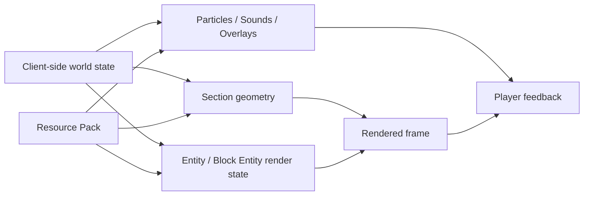
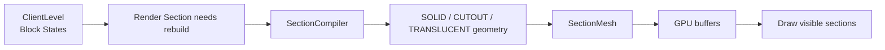
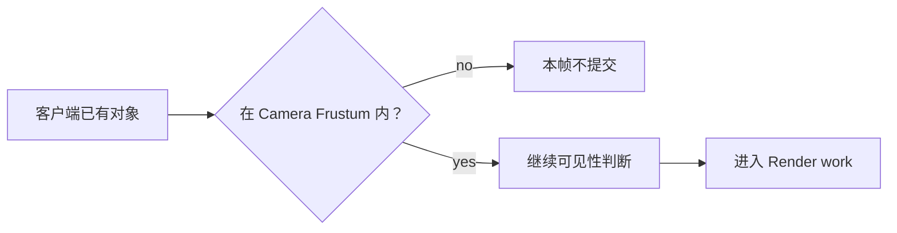
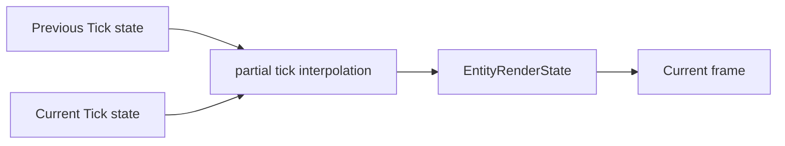
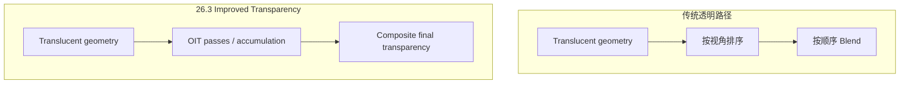
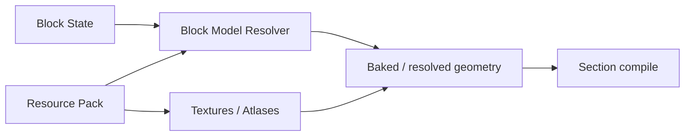
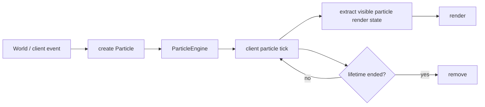
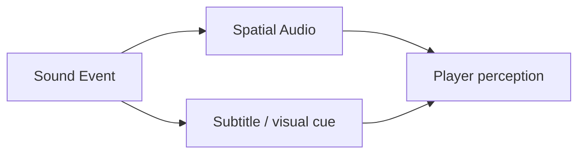
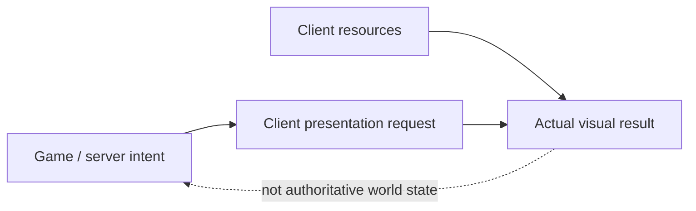
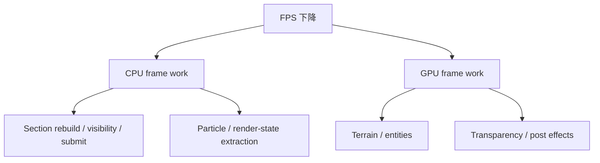

第二部讨论的是世界本身怎样运行：Tick 推进时间，方块更新传播变化，Entity 移动和决策，Item 在不同容器之间流动，Redstone 再把这些规则组合成时序系统。

但这些状态还不是画面。

客户端收到或本地拥有的是 Block State、Entity、Light、Biome、Particle Event、Sound Event 等数据。GPU 最终需要的却是顶点、索引、纹理、Render Pipeline 和 Draw Command；玩家需要的则更进一步——他必须看见方块裂开、听见背后的苦力怕、分辨水和玻璃的前后关系，并在两次 Simulation Tick 之间仍然感到运动连续。

所以这一章真正回答的是：

> **客户端怎样把离散、可修改的世界状态，转换成每一帧可以提交给 GPU、扬声器和 UI 的表现，同时又不把“看见的状态”误当成另一份世界规则？**

这不是一篇渲染器教程。我们不会逐个讲 Shader Stage、矩阵 API 或 OpenGL / Vulkan 调用，而是关注 Minecraft 这种**可修改体素世界**为什么需要 Chunk Mesh、异步重建、可见性裁剪、不同透明层，以及粒子、音频和破坏动画为什么属于客户端表现系统。

本文主要以 **Java Edition 26.3** 为当前实现参照。这个版本的客户端渲染仍在快速演进：Terrain 已经能在支持的设备上使用 MultiDrawIndirect，“Improved Transparency” 也改为新的 Order-independent Transparency；Resource Pack Version 则已经到 97.1。[^release]



## 方块世界怎样变成 GPU 能画的数据？

第一章里的 Section 保存的是 Block State Palette，不是 Triangle List。一个 `minecraft:stone` 的 ID 本身不会告诉 GPU 应该在屏幕哪里画六个面；楼梯、栅栏、门、玻璃和水更不可能只靠“这是哪个方块”直接提交。

客户端首先需要建立一层**渲染表示**。

### Block State 不是 Mesh

可以把最基本的转换写成：

```text
Block State
    +
neighboring states / light / biome context
    +
resource models and textures
        ↓
renderable geometry
```

Block State 决定“这里是什么”，Resource Pack 中的 Model / Texture 决定“它通常怎样被画”，邻居、光照和其他局部上下文则可能继续影响最终几何、颜色或面是否需要出现。

因此 Minecraft 的地形渲染并不是简单地：

```text
1 voxel = 1 cube = 12 triangles
```

有些 Block 没有完整六面体，有些模型会根据状态或连接关系改变，还有些内容根本不走普通地形 Mesh：Chest、Banner 等 Block Entity 有自己的 Renderer，Entity 更有独立的渲染路径。

这也是为什么“Voxel Renderer”在 Minecraft 里只是起点。世界的数据粒度是格子，最终表现粒度却可能是 Model Part、Quad、Entity Render State、Particle，甚至单独的 Post Effect。

### Section 是重建与提交的重要空间单位

现代 Java 客户端以 **Chunk Section** 为地形渲染的重要单位。当前 26.3 的 `SectionRenderDispatcher.RenderSection` 持有自己的 `SectionMesh`、Bounding Box、Compile Task 和 Transparency Resort Task；`SectionCompiler` 会从对应 `RenderSectionRegion` 编译几何，结果再上传到 GPU。[^render-section] [^section-dispatcher]

概念上是一条这样的链：



这样做的意义不是“Chunk 恰好是 Minecraft 的传统单位”，而是为了让变化可以被**局部失效**。

玩家挖掉一格石头时，不需要重建整个世界。客户端只需要让相关 Section 的旧 Mesh 失效，并安排新的 Compile Task；如果变化发生在 Section 边缘，邻区几何也可能因为原本被遮住的面暴露而需要更新。

这和前面几章反复出现的思想一致：

> **世界可以很大，但变化通常很局部，所以派生数据也应该允许局部重建。**

### Compile 和 Draw 是两种完全不同的工作

一个已经编译完成的 Section Mesh，可以连续很多帧重复画。

真正昂贵且不必每帧重复的，是从 Block State / Model 重新生成 Geometry。

所以渲染循环可以粗略分成：

```text
world changed?
    ↓ yes
rebuild / upload geometry

every frame:
    reuse geometry
    ↓
select visible work
    ↓
submit draw commands
```

当前 `SectionRenderDispatcher` 本身就维护 Compile Queue、Buffer Pool、Staging Buffer 与 GPU Upload；`RenderSection` 同时支持异步 Compile Task。[^section-dispatcher]

这解释了一个玩家经常见到的现象：**世界数据已经改变，并不意味着新的 Mesh 必须在同一 CPU 指令里立刻完成。**

渲染表示可以晚一小步更新，只要系统能尽快把失效区域重新构建出来。

<Callout type="info" title="World data 与 Render cache 是两层">
Block State 是世界状态；Section Mesh 是从它计算出的客户端缓存。缓存可以被丢弃、重建或换一种实现，只要重新生成后的画面仍正确表达当前客户端世界。
</Callout>

### 为什么要分 SOLID、CUTOUT 和 TRANSLUCENT？

26.3 当前的 `ChunkSectionLayer` 仍明确分成：

- `SOLID`；
- `CUTOUT`；
- `TRANSLUCENT`。[^chunk-layers]

这不是为了给代码分类得好看，而是因为不同几何需要不同的 Raster / Depth / Blend 规则。

**Solid** 适合普通完全不透明表面。  
**Cutout** 常用于纹理只有“完全显示 / 完全丢弃”两种结果的表面，例如很多叶片或植物。  
**Translucent** 则允许中间 Alpha，需要真正的混色。

如果把它们全部用同一种方式处理，要么会牺牲正确性，要么会付出不必要的 Blend / Sorting 成本。

因此 Section Compile 的输出不是“一个万能 Mesh”，而是按渲染语义拆成不同 Layer 的几何。

### 三角形数量不是唯一的 Mesh 成本

经典 Voxel Meshing 常讨论 Greedy Meshing：把相邻、共面的 Quad 尽可能合并，减少 Vertex / Triangle 数量。

这个思路当然有效，但在 Minecraft 这样的模型驱动世界中，判断“两个面能不能安全合并”不只需要看：

```text
same block?
same texture?
```

还可能涉及：

- 两个面是不是同一 Render Layer；
- Tint 是否相同；
- Light / AO 顶点数据是否兼容；
- UV 和 Model Geometry 是否能连续；
- Transparency 是否要求更细的排序粒度；
- Resource Pack 是否改变了 Model。

所以更一般的评价式不是：

> Triangle 越少，Renderer 一定越好。

而是要同时看：

> **Mesh 大小、Compile 成本、失效范围、上传成本和每帧提交成本。**

一个完全静态的 Voxel 场景，可能非常适合激进合并；一个玩家每秒都在挖、放、推动，而且 Model 可以被 Resource Pack 改写的世界，则更看重重建路径是否稳定。

这不是在证明某一种 Meshing 算法“绝对不适合 Minecraft”，而是在提醒开发者：**优化目标要和内容模型以及修改频率一起讨论。**

### 26.3 继续在减少提交开销

26.3 的官方技术变更明确写到：在支持的设备上，Terrain Blocks 现在会使用 **MultiDrawIndirect** 渲染。[^release-render]

这类优化针对的不是“方块规则”，而是：

> 已经有很多可画 Mesh 以后，怎样用更少的 CPU 提交开销让 GPU 执行更多 Draw。

当前 `LevelRenderer` 也明确保存 `multiDrawIndirectAvailable` / `usingMultiDrawIndirectForTerrain`，`ChunkSectionLayer` 则分别持有普通和 Multi-draw Pipeline。[^level-renderer] [^chunk-layers]

这很好地说明渲染层为什么值得独立出来：

- 世界规则不需要知道 Draw Call 是怎么提交的；
- Render Backend 可以多年持续重构；
- 只要画面和交互语义保持兼容，底层实现就有很大的优化空间。

## 客户端怎样决定这一帧真正要画什么？

即使 Section Mesh 都已经编译完成，也不应该把所有 Mesh 每帧全部交给 GPU。

一个世界可以加载很多 Section，但镜头只看向其中一部分；墙后、身后、远处的对象也未必值得进入本帧。

因此**存在于 ClientLevel**与**进入当前 Frame**仍然是两种状态。

### Frustum Culling 先排除镜头范围之外的对象

Camera 的 View / Projection 可以定义一个可见视锥。

当前 26.3 的 `Frustum` 可以用 AABB 判断对象是否在视锥中，`EntityRenderDispatcher.shouldRender` 也会结合 Frustum、相机位置和 Entity Renderer 来判断某个 Entity 是否值得提交。[^frustum] [^entity-renderer]



Frustum Culling 的好处非常直接：相机背后的 Section 即使已经准备好 Mesh，也没有必要这一帧画。

但它只能回答：

> 在镜头方向里吗？

不能回答：

> 虽然在镜头方向里，但是否被一堵山完全挡住？

### Section Occlusion 继续减少被遮挡的地形

当前 `LevelRenderer` 还维护 `SectionOcclusionGraph`、`visibleSections` 与 `nearbyVisibleSections`。[^level-renderer]

它解决的是比 Frustum 更进一步的问题：对于由大量 Section 构成的体素地形，可以利用 Section 之间的可见连通关系，减少明显被封闭几何遮挡的区域进入 Draw List。

可以概念化成：

```text
loaded / available sections
        ↓
view frustum
        ↓
section visibility / occlusion
        ↓
visible section list
        ↓
render layers
```

这里的 **Render Distance** 只负责限定更大的候选范围；它怎样和 Chunk Loading、Server Simulation Distance、多人玩家位置共同作用，会放到第 11 章统一讨论。

本章只保留客户端视角：

> **Loaded 不等于 Visible，Visible 也不等于最终每个 Pixel 都能通过 Depth Test。**

这是三个不同层级的裁剪。

### Entity 和 Block Entity 不必塞进地形 Mesh

一只 Zombie 每 Tick 都可能移动。如果把它焊进 Section Mesh，几乎每次移动都要让地形重建。

因此 Entity 使用独立的 `EntityRenderDispatcher` / `EntityRenderer`；Block Entity 也有独立的 `BlockEntityRenderDispatcher`。当前 `LevelRenderer` 同时持有这两套 Dispatcher，并单独提交 Entity、Block Entity 与 Terrain。[^level-renderer] [^entity-renderer] [^block-entity-renderer]

这种分层非常自然：

| 表现对象 | 典型更新频率 | 更合适的渲染表示 |
| --- | --- | --- |
| 普通地形 Block | 多数时间静止 | Section Mesh |
| Block Entity | 固定位置但表现可变化 | 独立 Renderer |
| Entity | 连续移动、动画 | 独立 Entity Render State |
| Particle | 短生命周期、大量实例 | Particle Engine |

这和前面的数据模型再次对应起来：**不同运行时所有权，往往也对应不同的渲染缓存策略。**

### Frame 可以在两个 Tick 状态之间插值

第四章已经区分 Tick 与 Frame。

如果 Entity 只在 20 TPS 的状态点上画位置，即使显示器能输出 144 FPS，也会看起来每 50 ms 跳一下。

客户端因此可以在两个离散状态之间计算表现位置。最简单的线性插值是：

$$
p_{render} = (1-\alpha)p_{prev} + \alpha p_{current}
$$

其中 `alpha` 是当前 Frame 位于两个 Tick 之间的比例。

当前 26.3 的 `EntityRenderDispatcher.extractEntity(entity, partialTicks)` 就明确把 `partialTicks` 带入 Entity Render State 的提取；Renderer 得到的是适合这一帧表现的状态，而不必直接把服务端 / Client Tick 的离散坐标原样画出来。[^entity-renderer]



因此：

> **Rendered Position 可以不是任何一个 Tick 真正保存过的位置。**

它只是两个合法模拟状态之间的视觉表示。

这不等于客户端擅自改变世界。它恰恰是在承认：Simulation 是离散的，Display 可以更连续。

<Impl title="把 Render State 从 Simulation Object 中提取出来">
如果 Renderer 每次都任意读取可变 Entity 对象，很容易让渲染线程、插值和模拟状态互相耦合。现代 Java 的 Entity Renderer 已经显式存在 Render State 提取步骤。对自研引擎来说，这种 Snapshot / Extract 思路同样适合把模拟与表现解耦。
</Impl>

## 透明为什么比不透明更难？

不透明表面有一个非常有利的性质：只要 Depth Buffer 正确，很多时候前后绘制顺序并不影响最终结果。

半透明却不一样。

如果两个半透明表面 A、B 重叠，传统 Alpha Blending 的结果通常依赖：

```text
draw A then B
```

还是：

```text
draw B then A
```

因此透明几何长期需要额外的排序或近似算法。

### 传统做法需要关心 Back-to-front Order

从原理上说，半透明面通常希望从远到近绘制。

如果排序单位过粗，会发生：

- 远处的水盖到近处玻璃前面；
- Particle 通过玻璃时顺序错误；
- 两个相交透明物体无法找到一个全局正确顺序；
- 相机移动后，之前正确的排序突然失效。

当前 `RenderSection` 甚至单独存在 `ResortTransparencyTask`，`LevelRenderer` 也会根据 Camera Position 安排 Translucent Section Resort。[^render-section] [^level-renderer]

这说明 Transparency 的问题并不止发生在 Shader 里。**相机移动本身就可能让 Index / Draw Order 需要重新组织。**

### 26.3 的 Improved Transparency 改成 OIT

Java 26.3 是这一问题非常值得记录的版本。

官方把 “Improved Transparency” 的旧实现替换为新的 **Order-independent Transparency（OIT）** 算法。官方说明也直接解释了原因：传统半透明通常要 Back-to-front 排序，而即使逐 Triangle 完美排序，相交 Triangle 仍然无法用单一顺序正确解决。[^oit]

开启 Improved Transparency 后，新 OIT 允许 Translucent Object 以任意顺序提交，再通过额外的 Buffer / Pass 近似组合结果。



它解决了很多“透过某个透明对象看另一个对象时消失”的问题，但不是免费午餐。

官方明确指出：

- OIT 是近似算法；
- 仍可能产生较小的颜色误差；
- 性能成本预计高于旧 Improved Transparency。[^oit]

因此更准确的工程判断不是：

> OIT 比 Sorting 先进，所以永远应该开。

而是：

> **透明正确性、GPU 带宽 / Render Target 成本与设备能力之间仍然存在取舍。**

关闭 Improved Transparency 时，26.3 仍保留更偏向性能的传统路径。[^oit]

### Render Layer 是一种“先把不同问题拆开”的办法

SOLID、CUTOUT、TRANSLUCENT 的价值现在就更清楚了。

Solid Geometry 不必为 Transparency 付费；Cutout 可以依赖 Alpha Test / Discard 一类规则而不进行连续混色；只有真正需要半透明的表面进入最复杂的路径。

这也是实时渲染常见的设计原则：

> **不要因为少数对象需要最贵的规则，就让所有对象都支付同样的成本。**

同一原则在 Entity、Particles、Post Effect 上还会不断出现。

## Resource Pack 为什么会影响渲染架构？

如果 Resource Pack 只能替换 PNG，那么它只是“换皮”。

现代 Java 的 Resource Pack 已经不是这个范围。

它可以参与：

- Block / Item Model；
- Texture / Atlas Sprite；
- Entity Equipment Asset；
- Font；
- Sound；
- GUI Sprite；
- Particle Resource；
- Post-processing Effect；
- 以及一些 Shader 相关资源。[^release-resources]

所以 Renderer 不能假设：

> Stone 永远是某张固定 Texture，某个 Item 永远只有内置 Model。

资源加载本身已经是客户端渲染输入的一部分。

### Model 与 Texture 是运行时输入，不是编译进代码的常数

当 Resource Pack 改变 Block Model 时，同一个 Block State 仍然可以对应不同的几何外观。

因此这条链应该理解成：



这也是为什么更换资源以后，Renderer 需要 Reload / Invalidate。

当前 `EntityRenderDispatcher`、`BlockEntityRenderDispatcher` 都是 Resource Reload Listener；`LevelRenderer` 也有 `invalidateCompiledGeometry`。[^entity-renderer] [^block-entity-renderer] [^level-renderer]

换句话说：

> **资源包不是运行在 Render Pipeline 外面的“最后滤镜”，它会改变 Renderer 生成表现数据时使用的输入。**

### Texture Atlas 减少的是状态切换，不改变世界语义

大量 Block Texture 会被组织进 Atlas。

Atlas 的意义是让很多几何能够共享较少的 Texture Binding / Material State，而不必每画一个方块就重新绑定一张独立图片。

从世界系统角度，它只是一个表现层优化：

```text
minecraft:stone
→ sprite region in atlas
```

Block State、碰撞、掉落、光照规则都不因为 Texture 被重新打包进 Atlas 而改变。

这正是“表现缓存可以换实现”的典型例子。

### Resource Pack 和 Data Pack 改的是不同层

第 12 章会详细解释两者，这里只建立客户端边界。

**Resource Pack** 主要改变：

- 看起来怎样；
- 听起来怎样；
- UI / Font 怎样呈现；
- 某些客户端 Effect 怎样执行。

**Data Pack** 主要改变：

- Recipe；
- Loot；
- Tag；
- Worldgen；
- Function；
- Registry Data 等游戏数据和规则。

两者并不是绝对互不相干——同一个 Item ID 当然可能同时有配方和模型——但所有权不同。

可以粗略理解成：

```text
game meaning / content data
        ↓
Data Pack

presentation resources
        ↓
Resource Pack
```

不要因为它们都叫 Pack，就把它们当成同一个扩展面。

### Core Shader Override 和受支持的 Post Effect 也不是同一级承诺

现代 Resource Pack 已经能触及 Shader，但这里尤其需要注意官方支持边界。

26.3 官方说明明确指出：虽然 Resource Pack 技术上可以覆盖 **Core Shaders**，但这仍然被视为**不受支持、不是预期的 Resource Pack Feature**，内部实现可以随时变化。[^core-shaders]

另一方面，26.3 新增了 `/posteffect`，让 Resource Pack 提供的 Post-processing Effect 成为显式可调用能力；还支持 `minecraft:end_of_frame` 这种 Pack 加载期间持续启用的 Post Effect。[^posteffect]

这两者非常适合作为 API 边界的例子：

| 能力 | 能不能做到 | 官方稳定承诺 |
| --- | --- | --- |
| 替换 Texture / Model / Sound | 可以 | Resource Pack 正式职责 |
| 定义 Post Effect | 可以 | 26.3 提供显式支持 |
| Override Core Shader | 技术上可以 | 官方明确视为不受支持内部实现 |

所以“文件能覆盖”并不自动等于“这是稳定扩展 API”。

<Callout type="warning" title="可修改不等于受支持">
成熟游戏常常存在三层扩展面：正式 Schema、可用但不稳定的内部资源，以及纯实现细节。对 Mod / Pack 作者来说，它们的升级成本完全不同。
</Callout>

## 世界变化怎样变成玩家能感知的反馈？

渲染不只是“把地形画出来”。

如果挖方块时只有最终某一帧突然从 Stone 变成 Air，没有裂痕、声音和碎屑；如果 Creeper 已经开始引爆，却没有任何声音提示；如果玩家受到伤害，但画面、HUD 和音效都完全不响应，那么世界规则虽然还能运行，玩家却很难及时读懂它。

反馈系统做的就是：

> **把模拟事件和状态变化转换成视觉、听觉和界面信息。**

### Block Break Animation 是覆盖层，不是 Block State

挖掘裂痕最能说明表现状态为什么可以独立存在。

方块在完全破坏之前仍然是原来的 Block State，但客户端可以在其表面叠加一层逐级变化的 Crack Overlay。

当前 26.3 的 `LevelRenderer` 仍然有专门的 `submitBlockDestroyAnimation`，服务端侧也存在 `BlockDestructionProgress`，记录位置、进度和更新时间。[^level-renderer] [^break-progress]

于是玩家看到的其实是：

```text
Stone Block State
+
destroy progress overlay
```

而不是：

```text
Stone_20PercentBroken
Stone_30PercentBroken
Stone_40PercentBroken
...
```

这避免了为了表现过程，把临时 UI 状态污染进真正的 Block Registry / Block State。

同一种模式也适用于：

- Entity Hurt Flash；
- Selection Outline；
- Cooldown Indicator；
- Portal Overlay；
- Screen Post Effect。

**表现层可以给同一份世界状态叠加额外解释，而无需把这些解释永久保存到世界里。**

### Particle 是短生命周期的客户端对象

Particle 看起来像 Entity：有位置、速度、年龄，甚至可能做简单碰撞。

但它并不是共享世界里的普通 Entity。

当前 `ParticleEngine` 只存在客户端，维护按 `ParticleRenderType` 分组的 Particle、待加入队列、Tracking Emitter 与 Particle Limit；每个 Particle 自己有 Age、Lifetime、Gravity、Friction 和可选 Physics。[^particles]



它适合表示：

- 方块破碎碎屑；
- Smoke；
- Portal；
- Critical Hit；
- Splash；
- Explosion Visual；
- 环境气氛。

Particle 消失不会让服务器 World 删除一个 Entity，因为它本来就不是那层数据。

这让 Particle 可以拥有更激进的客户端预算策略。26.3 的 Particle Engine 本身就有 Particle Limit / Group Capacity；在高负载时，少显示一些 Particle 通常比让整个 World Simulation 停下来更合理。[^particles]

### Sound 既是反馈，也是空间信息

Sound 也不能简单归类成“装饰”。

脚步、爆炸、Creeper 引信、水流、Minecart、方块破坏都能告诉玩家：

- 发生了什么；
- 距离多远；
- 大概在哪个方向。

当前 `SoundManager` 保存 Listener Transform、Sound Category Volume、设备与活动 Sound Instance；玩家 Camera / Listener 的位置直接参与最终听感。[^sound-manager]

因此：

```text
Sound Event + source position
        ↓
client listener transform
        ↓
distance / direction / volume
        ↓
left-right-spatial perception
```

位置音频不改变 Creeper 是否真的爆炸，但它会改变玩家能否在爆炸前意识到危险。

这说明表现层存在一个重要区别：

> **不决定世界规则，不代表不承载游戏信息。**

粒子数量可以只是氛围；Creeper 的声音却可能是生存决策所依赖的信息通道。

### 字幕把声音事件搬到另一种感官

Java 的 Subtitles 正是对这个问题的另一种处理：把 Sound Event 转换成屏幕上的文本与方向提示。

从系统上看，它不是另一份模拟，只是同一个事件的另一条 Presentation Channel：



这也是无障碍设计里非常重要的一条原则：

> **如果某种反馈实际承载玩法信息，就应该思考能不能通过另一种感官通道表达，而不是只问“这个特效能不能关闭”。**

本章不会展开完整的 Accessibility Feature List，但这一原则值得保留，因为它直接来自表现层的职责。

### HUD 是把世界状态压缩成可读符号

Health、Hunger、Armor、Crosshair、Hotbar、Boss Bar 都不是世界中真实存在的几何物体。

它们把复杂状态压缩成即时可读的视觉符号。

例如玩家生命值可以存在 Simulation State 中，但“十颗心”是 UI 表现；Attack Cooldown 可以是游戏规则里的计时状态，但屏幕 Indicator 是客户端对它的可视化。

因此：

```text
simulation state
      ↓
presentation mapping
      ↓
HUD symbol
```

HUD 的作用不是复制世界，而是**选择哪些状态值得持续展示**。

这和 Particle / Audio 一样，本质上都是信息设计，只是它更稳定、更符号化。


## 客户端表现为什么不等于世界模拟？

现在可以把这一章最重要的边界说清楚了。

客户端当然需要一份 World State，否则它无法渲染。但 Renderer 看到的很多数据并不是“世界规则本身”，而是从世界状态进一步计算出的 **Presentation State**。

### Mesh 可以重建，但 Block State 才是它的来源

Section Mesh 是最直接的例子。

```text
Block States
    ↓
compile
    ↓
Section Mesh
```

如果 GPU Buffer 丢失、Resource Pack Reload、Renderer Backend 切换或几何被标记失效，Mesh 可以全部扔掉再生成。

Block State 却不能因为 Renderer 重载就一起消失。

所以 Mesh 的正确身份是：

> **Derived Cache。**

这类缓存最重要的属性通常不是“永远存在”，而是：

- 能被判定何时失效；
- 能从 Source of Truth 重建；
- 新旧缓存切换时不破坏世界规则。

### Rendered Pose 可以不存在于任何一个 Simulation Tick

Entity Interpolation 是第二个例子。

如果 Tick A 的位置是：

```text
x = 10.0
```

Tick B 的位置是：

```text
x = 10.8
```

中间某个 Frame 完全可以画成：

```text
x = 10.35
```

世界从来没有在一个 Simulation Tick 中把这个 Entity 保存到 `10.35`，但视觉上这样更连续。

同理，动画骨骼、Head Rotation Smoothing、Camera Bob、Screen Shake 都可能在 Simulation State 之上继续做表现计算。

因此：

> **“屏幕上这一帧画在哪里”与“模拟在哪个离散状态”不必逐帧一一对应。**

只要表现层最终仍然表达同一个游戏状态，这种差异就是渲染职责的一部分。

### Particle 和 Post Effect 可以完全是表现层对象

Particle 更进一步：很多 Particle 根本不需要对应一个持久化 World Object。

Post Effect 则更能说明这条边界。26.3 官方对 `/posteffect` 的描述明确指出：Post Effect 存在于客户端 Resource Pack 中，**服务器甚至无法知道某个 Effect 最终是否真的会应用**。[^posteffect]

这意味着服务器可以表达：

> 给这个玩家请求 / 指定某个 Post Effect。

但最终表现仍依赖：

- 客户端是否拥有对应资源；
- Resource Pack 内容；
- 当前 Renderer；
- 客户端实现能否正确执行它。

这是客户端表现层非常典型的关系：



当然，大多数普通方块和实体画面不会允许客户端随意“解释成别的东西”；但架构上必须承认：**Server State 与最终 Pixel 中间还有一整套客户端资源和算法。**

### 两个玩家甚至可以看见不同的“皮肤”

Resource Pack 已经使这个事实日常化。

同一个服务器上的两个客户端，完全可以：

- 使用不同 Texture；
- 使用不同 Font；
- 听到不同资源文件；
- 使用不同 Model / UI 外观；
- 在允许的范围内使用不同 Post Effect 资源。

他们仍然可以共享同一个 Block State：

```text
minecraft:stone
```

这说明 Minecraft 的 Multiplayer Consistency 主要要求：

> **大家对世界语义保持一致。**

而不是：

> 所有人的每个 Pixel 必须完全一致。

这条区分对任何允许客户端换皮、Mod、Accessibility Override 的多人游戏都非常重要。

### 但表现层不能偷偷成为另一份游戏规则

表现可以插值、裁剪、换贴图、减少粒子，也可以把同一 Sound Event 同时变成 Audio 和 Subtitle。

它不能因此单方面决定：

- 玩家其实没有受伤；
- 方块其实没有被放下；
- Inventory 其实多了一组钻石；
- Piston 实际上没有移动；
- Entity 真正的位置由 Renderer 决定。

这些属于 Simulation / Authority。

可以把边界写成：

| 客户端表现可以做 | 不能因此决定 |
| --- | --- |
| 插值 Entity Position | 权威 Entity Position |
| 重建或丢弃 Mesh | Block State 是否存在 |
| 少画 Particle | 对应 Gameplay Event 是否发生 |
| 换 Texture / Sound | Item / Block 的游戏语义 |
| 显示 Crack Overlay | 方块是否真正破坏 |
| 播放 Post Effect | 服务器世界规则 |

这不是要求表现必须“诚实到毫秒”。

恰恰相反，实时游戏常常需要让表现比 Simulation 更平滑、更容易理解。真正的边界是：

> **表现可以重述状态，不能拥有状态。**

### Prediction 属于下一层问题

这里很容易继续走向：

> 玩家按下按键以后，客户端能不能先假设动作成功？

这已经不是纯 Renderer 问题了。

一旦客户端在服务端确认之前主动推进：

- Player Movement；
- Block Interaction；
- Inventory Operation；
- Attack Result；

就进入了 **Prediction / Confirmation / Reconciliation**。

旧 `feel-client.mdx` 中“先演、再对账”的材料会在下一章[《网络架构与状态同步》](/impl/networking)重新处理，因为那里真正需要回答的是：

> **谁拥有权威状态，以及高延迟下客户端可以提前相信自己多少？**

本章停在表现边界：即使没有 Prediction，Render Interpolation、Particle、Audio、HUD、Resource Pack 也已经足以证明客户端不是一台被动截图机。

## 一帧的成本到底花在哪里？

完整性能预算会在第 11 章统一讨论，但在结束客户端渲染之前，需要先建立一张最小成本图。

如果目标帧率是 $f$，每帧墙钟预算近似为：

$$
B_{frame} = 1000 / f
$$

60 FPS 约有 16.7 ms，144 FPS 则只剩约 6.9 ms。

这段时间并不只属于 GPU。

### CPU 需要准备这一帧要画什么

客户端 CPU 可能正在做：

- Dirty Section Compile / Rebuild；
- Visibility / Occlusion 更新；
- Entity Render State 提取；
- Particle Tick / Extract；
- Draw / Submit 数据准备；
- Resource / Animation 更新；
- UI Layout / Text 等工作。

Section Rebuild 尤其容易制造“世界一改就卡一下”的脉冲成本，因为它不是稳定的每帧固定工作，而是由玩家移动、挖掘、Chunk 到达和 Resource Reload 触发。

### GPU 负责真正执行大量可见工作

GPU 侧则会承担：

- Terrain Rasterization；
- Entity / Block Entity；
- Transparency；
- Particle；
- Shadow / Lighting-related Shader Work；
- Post-processing；
- UI Composition 等。

OIT 就是一个很典型的 GPU 取舍：它换来更可靠的透明结果，但需要额外 Pass / Buffer，并明确有更高的性能成本。[^oit]

MultiDrawIndirect 则从另一方向减少 CPU → GPU 提交开销。[^release-render]

于是同一个 FPS 下降，可能来自完全不同的层：



不能因为“画面卡了”，就直接得出：

> GPU 不够快。

更不能得出：

> Server TPS 也一定掉了。

第四章已经建立 FPS / TPS 的区别，第 11 章会再把 Client Rendering、Chunk I/O、Worldgen、Entity、GC 等放进同一个性能诊断框架。

<Alternative title="先问哪一层超预算，再问用什么优化">
降低 Render Distance、减少 Particle、优化 Section Compile、减少 Draw Submission、简化 Shader，解决的是不同瓶颈。一个优化技巧只有在它打中当前预算来源时才有意义。
</Alternative>

## 这一章留下什么

客户端拿到的世界状态不是 GPU 可以直接绘制的东西。普通 Block State 会经过 Model / Resource 解析和 Section Compile，形成按 SOLID、CUTOUT、TRANSLUCENT 等 Layer 组织的 Mesh；Mesh 可以异步重建并上传，再由 Frustum、Section Occlusion 和当前 Camera 选出真正值得进入这一帧的几何。Entity 与 Block Entity 因为更新模式不同，又走独立的 Render State / Renderer 路径。

Transparency 则说明“正确地画出来”本身可以是一道复杂算法题。26.3 用新的 OIT 改写 Improved Transparency，也继续用 MultiDrawIndirect 降低 Terrain Submission 成本。Renderer 并不是 Minecraft 发布多年以后就凝固的地基，而是一层可以持续替换内部实现、同时尽量维持画面语义的客户端系统。

Resource Pack 进一步说明表现资源本身也是输入：Model、Texture、Sound、Font、UI、Particle 与 Post Effect 都可以改变玩家最终看到和听到的结果。但 Core Shader Override 和正式 Post Effect API 又展示了“技术上可修改”与“官方稳定扩展面”之间的差别。

最后，反馈并不是世界模拟的副本。Block Break Crack 可以作为 Overlay，Particle 可以只是客户端短生命周期对象，Entity Rendered Position 可以位于两个 Tick 之间，Spatial Audio 与 Subtitle 则把同一事件翻译成不同感官通道。**表现层负责让状态可见、连续、可理解；模拟层负责决定状态本身。**

对开发者来说，最值得继承的是几条边界：**Source State 与 Render Cache 分离；Simulation Tick 与 Render Frame 分离；静态 Terrain 与动态 Entity 表示分离；Opaque 与 Translucent Pipeline 分离；Gameplay Meaning 与 Presentation Resource 分离；反馈与权威状态分离。**

下一章会穿过这条边界继续向外：客户端手里这份世界状态究竟从哪里来？单人游戏为什么也会有 Client / Server 两边？Chunk、Entity、Inventory 和玩家操作怎样跨 Packet 保持一致，而 Prediction 又为什么会让高延迟世界仍然显得可以操作？

[^release]: Mojang Studios，《Minecraft Java Edition 26.3》，2026-09-15。正式版 Technical Changes 中 Resource Pack Version 为 97.1，并包含本章涉及的 Terrain MultiDrawIndirect、OIT、Shader 与 Post Effect 变化。见 https://feedback.minecraft.net/hc/en-us/articles/48913133328013-Minecraft-Java-Edition-26-3

[^render-section]: Java 26.3 `SectionRenderDispatcher.RenderSection` 当前持有 `SectionMesh`、AABB、Compile Task、Transparency Resort Task，并支持异步 / 同步 Section Compile。见 NeoForge 26.3 映射 Javadoc：https://aldak0.ru/javadoc/26.3.x/net/minecraft/client/renderer/chunk/SectionRenderDispatcher.RenderSection.html

[^section-dispatcher]: Java 26.3 `SectionRenderDispatcher` 当前维护 Compile Queue、SectionBufferBuilderPool、Staging Buffer、GPU Terrain Buffer Upload 与 Camera Position。见 https://aldak0.ru/javadoc/26.3.x/net/minecraft/client/renderer/chunk/SectionRenderDispatcher.html

[^chunk-layers]: Java 26.3 `ChunkSectionLayer` 当前明确包含 `SOLID`、`CUTOUT`、`TRANSLUCENT`，并为 Layer 保存 Pipeline / MultiDraw Pipeline 与 Transparency 信息。见 https://aldak0.ru/javadoc/26.3.x/net/minecraft/client/renderer/chunk/ChunkSectionLayer.html

[^release-render]: Mojang Studios，《Minecraft Java Edition 26.3》Technical Changes：Terrain blocks are now rendered with MultiDrawIndirect on supported devices。见 https://feedback.minecraft.net/hc/en-us/articles/48913133328013-Minecraft-Java-Edition-26-3

[^level-renderer]: Java 26.3 `LevelRenderer` 当前持有 `SectionOcclusionGraph`、`visibleSections`、`SectionRenderDispatcher`、Entity / Block Entity Dispatcher、OIT Targets 与 MultiDrawIndirect 状态，并负责提交 Terrain、Entities、Block Entities、Block Destroy Animation 等世界表现。见 https://aldak0.ru/javadoc/26.3.x/net/minecraft/client/renderer/LevelRenderer.html

[^frustum]: Java 26.3 `Frustum` 根据 Model-view / Projection 构建视锥，并提供 `isVisible(AABB)`、`cubeInFrustum` 等可见性查询。见 https://aldak0.ru/javadoc/26.3.x/net/minecraft/client/renderer/culling/Frustum.html

[^entity-renderer]: Java 26.3 `EntityRenderDispatcher` 当前按 Entity Type 选择 Renderer，并通过 `extractEntity(entity, partialTicks)` 提取当前 Frame 的 `EntityRenderState`；`shouldRender` 接受 Frustum 与 Camera Position。见 https://aldak0.ru/javadoc/26.3.x/net/minecraft/client/renderer/entity/EntityRenderDispatcher.html

[^block-entity-renderer]: Java 26.3 `BlockEntityRenderDispatcher` 当前独立管理 Block Entity Renderer，并同时使用 Block Model、Item Model、Entity Renderer、Sprites 等客户端表现资源。见 https://aldak0.ru/javadoc/26.3.x/net/minecraft/client/renderer/blockentity/BlockEntityRenderDispatcher.html

[^oit]: Mojang Studios，《Minecraft Java Edition 26.3》。正式版将 Improved Transparency 改为新的 Order-independent Transparency：开启时允许透明对象以任意顺序渲染；官方同时明确它是近似算法、会带来较小视觉误差，并预计比旧方案有更高性能成本。见 https://feedback.minecraft.net/hc/en-us/articles/48913133328013-Minecraft-Java-Edition-26-3

[^release-resources]: Java 26.3 Resource Pack 97.1 继续包含 Block / Item Sprites、Models、Equipment Assets、Shaders 与 Post-process Effects 等表现资源；当前格式变化见正式版 Resource Pack Versions 89.0 through 97.1。见 https://feedback.minecraft.net/hc/en-us/articles/48913133328013-Minecraft-Java-Edition-26-3

[^core-shaders]: Mojang Studios 在 Java 26.3 Resource Pack 说明中再次明确：Core Shader Override 虽然技术上可由 Resource Pack 实现，但不属于受支持、预期的 Resource Pack Feature，相关内部 Shader 可以随实现演化而改变。见 https://feedback.minecraft.net/hc/en-us/articles/48913133328013-Minecraft-Java-Edition-26-3

[^posteffect]: Java 26.3 新增 `/posteffect`，允许使用 Resource Pack 中的 Post-processing Effects；官方明确说明 Effect 存在于客户端，服务器无法知道它最终是否实际应用。26.3 也支持 Resource Pack 定义始终启用的 `minecraft:end_of_frame` Post Effect。见 https://feedback.minecraft.net/hc/en-us/articles/48913133328013-Minecraft-Java-Edition-26-3

[^break-progress]: Java 26.3 `BlockDestructionProgress` 记录 Block Position、Progress 与 Updated Render Tick；Level Renderer 另有专用 Block Destroy Animation 提交路径。见 https://aldak0.ru/javadoc/26.3.x/net/minecraft/server/level/BlockDestructionProgress.html

[^particles]: Java 26.3 `ParticleEngine` 位于客户端，当前维护 Particle Render Type 分组、待加入队列、Tracking Emitter 与 Particle Limit，并在 Client Tick 后提取可见 Particle Render State。见 https://aldak0.ru/javadoc/26.3.x/net/minecraft/client/particle/ParticleEngine.html 与 https://aldak0.ru/javadoc/26.3.x/net/minecraft/client/particle/Particle.html

[^sound-manager]: Java 26.3 `SoundManager` 位于客户端，管理 Sound Engine、Listener Transform、Sound Source Volume、设备和活动 Sound Instance。见 https://aldak0.ru/javadoc/26.3.x/net/minecraft/client/sounds/SoundManager.html
