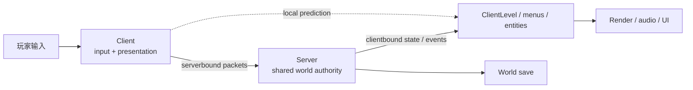
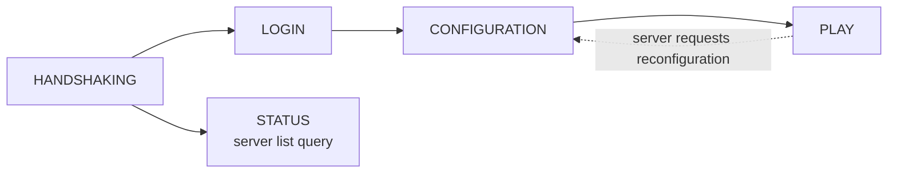
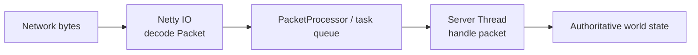
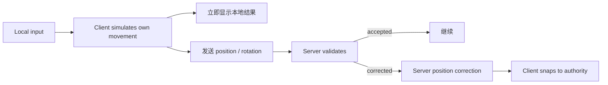
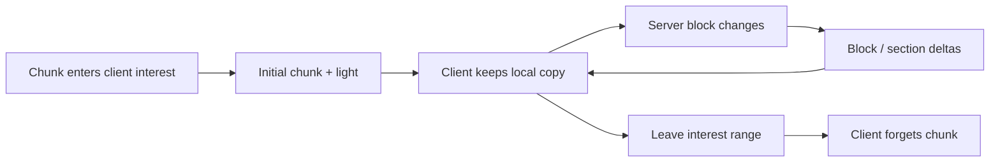
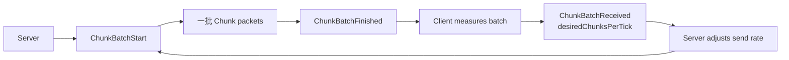
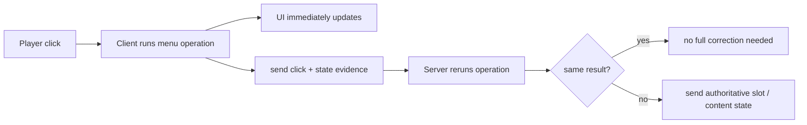
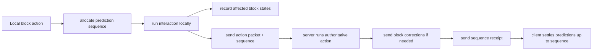
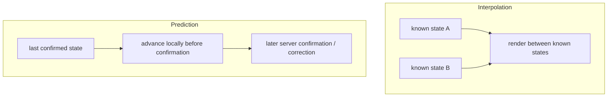
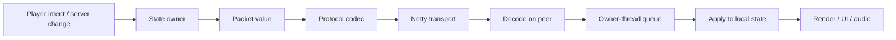

上一章[《客户端渲染与反馈》](/impl/client-render)停在一个边界上：客户端可以把同一份世界状态插值、换模型、播放粒子和声音，但它不能因为“屏幕上看起来如此”就独自决定世界事实。

多人游戏把这个边界变成了必须解决的工程问题。两个玩家同时打开同一个箱子，一个人挖掉方块，另一个人推动活塞，第三个人正在跨越高延迟网络移动。如果每个客户端都把自己的画面当成真相，几秒以后就会出现几个互不兼容的世界。

因此网络系统真正要解决的并不是：

> 怎样把服务器内存完整复制到客户端？

而是：

> **哪些状态由服务器拥有，客户端需要知道多少；客户端的操作怎样抵达服务器；延迟期间哪些结果可以先在本地推进；双方出现差异以后又怎样重新收敛？**

Minecraft Java 的答案不是单一同步算法。Chunk、Entity、Inventory、本地玩家移动和方块交互分别使用不同策略：有的按空间批量发送，有的只发增量，有的客户端先执行再由服务器校验，有的以服务器重算结果为准。只有把这些模式分开，才能准确理解所谓“Server Authority”。

本文主要以 **Java Edition 26.3** 为当前实现参照。历史上也有一个必须先澄清的节点：Java 并不是从最初版本开始就采用今天的单人 Client / Server 架构；**1.3.1 才将 Singleplayer 改为内部运行服务器，并加入 Open to LAN**。[^singleplayer-131]



## 为什么单人游戏后来也要分成 Client 和 Server？

把 Client / Server 理解成“联网时才出现的两个程序”会让后面的很多设计都显得奇怪。

在现代 Java Singleplayer 中，两边确实都存在，只是它们运行在同一个进程里。

### 1.3.1 把单人与多人运行时收成同一条主线

Java 1.3.1 的更新记录明确写着：Singleplayer 开始在内部运行 Server，同时加入把当前世界发布到 LAN 的能力。[^singleplayer-131]

这一步的价值不只是“方便朋友加入”。

在旧模型里，如果 Singleplayer 和 Multiplayer 分别拥有一套世界运行路径，那么同一个功能很容易变成：

```text
singleplayer implementation
+
multiplayer implementation
```

两份代码必须长期保持方块、Entity、Inventory、Command 和 Bug Fix 的行为一致。一旦其中一边漏掉变化，就会出现“单人能用，服务器不行”或反过来的分叉。

Integrated Server 让单人也运行真正的 `MinecraftServer` 子类，于是世界 Simulation、存档和 Server-side Gameplay 可以复用多人服务器的大部分路径。当前 26.3 的服务器层次仍然把 `IntegratedServer` 与 `DedicatedServer` 都放在 `MinecraftServer` 之下。[^anatomy]

这是一种很常见的架构收敛：

> **把“有几个玩家”变成部署差异，而不是两套游戏规则。**

### Integrated Server 和 Dedicated Server 仍然不是同一个运行环境

共享大量 Server 代码，不意味着两者完全相同。

**Dedicated Server** 是独立进程、无本地图形客户端、接受远程连接并自己管理生命周期；**Integrated Server** 则与 Minecraft Client 在同一个 JVM 里，有自己的 Server Thread，由 Singleplayer 生命周期启动与暂停，还可以选择发布到 LAN。

当前 26.3 的 `Minecraft` 持有 `singleplayerServer`，而 `IntegratedServer` 仍在独立 Server Thread 上推进世界。[^anatomy]

所以更准确的模型不是：

```text
Singleplayer = no networking
Multiplayer = networking
```

而是：

```text
Singleplayer = local client + integrated server
Multiplayer = remote client + dedicated/integrated server
```

### 本地连接仍然走 Packet Pipeline，但 Transport 不同

这里还有一个容易被简化过头的事实。

现代 Singleplayer 并不是“Client 直接调用 Server 方法”。当前 26.3 的 Integrated Server 会启动一个 **in-memory Netty channel**；Client 通过 `Connection.connectToLocalServer` 连接它，并继续经历 Handshake、Login、Configuration 和 Play。Packet Encoder / Decoder 也仍然存在。[^memory-connection]

但本地连接又不会假装自己真的走公网：它使用 Local Channel 而不是 TCP Socket，没有远程连接的 Read Timeout，不安装网络压缩，登录也不会走远程服务器那套加密交换。[^memory-connection] [^connection]

这正好体现了分层价值：

> **上层可以共享 Packet / Listener / Game Protocol，底层 Transport 可以针对本机和公网采用不同实现。**

<Callout type="info" title="共享协议不等于必须共享传输成本">
Integrated Server 复用 Client / Server 消息边界，是为了统一运行时语义；Local Channel 可以跳过公网才需要的加密、压缩和 Socket framing。抽象共享的是消息合同，不是每一层实现细节。
</Callout>

### “Open to LAN”改变的是谁可以连接，不是突然创建 Server

在现代 Singleplayer 世界里，Integrated Server 本来就在运行。选择 Open to LAN 更接近：

```text
private local server
        ↓
publish / listen for LAN peers
        ↓
additional remote clients may join
```

而不是：

```text
singleplayer engine
        ↓
convert world into multiplayer engine
```

这个区别解释了为什么 Singleplayer 与 LAN 游戏可以共享同一份正在运行的世界，而不是关闭世界、另起一套 Simulation。

## 一条连接为什么要经历多个协议阶段？

网络协议不是从第一个 Byte 开始就允许发送“玩家移动”和“区块数据”。

客户端还没完成身份确认、Registry 同步和配置准备时，Play Packet 根本没有足够的上下文可以被正确解释。现代 Java 因此把 Connection 分成多个协议阶段。

### 当前连接不是只有 Login 和 Play

26.3 的 `ConnectionProtocol` 包含五个阶段：

- `HANDSHAKING`；
- `STATUS`；
- `LOGIN`；
- `CONFIGURATION`；
- `PLAY`。[^protocol-phases]

其中正常进入世界的路径大致是：



Status 是 Server List 查询使用的旁路，并不会继续进入游戏世界。

Configuration 则是比较新的阶段。**1.20.2** 官方正式把它加入协议，使 Login 完成身份阶段后、真正进入 Play 前，可以先完成 Data-driven Registry、Feature、Tag 和 Resource Pack 等同步。[^configuration-1202]

这说明协议阶段并不是单纯“为了登录界面好看”，而是为了保证：

> **后续 Packet 的 Schema 所依赖的上下文已经准备好。**

### Configuration 解决的是“先约定词典，再开始说话”

假设 Play Packet 里发送：

```text
registry entry id = 143
```

Client 和 Server 必须先对“143 到底代表哪个 Registry Entry”有相同理解。

当前 26.3 的 Configuration 会同步 Data-driven Registries、Tags、Enabled Features 等内容；Play Protocol 甚至要在 Configuration → Play 切换时绑定到这一套 Registry 上下文。[^protocol-phases]

可以把它理解为：

```text
Login
  ↓
Who are you?

Configuration
  ↓
What data vocabulary are we using?

Play
  ↓
Now exchange world actions and state.
```

这是现代 Data-driven Engine 很典型的网络问题：协议不只是传字段，还要先同步字段中引用的“字典”。

### Packet Type 只在正确的阶段和方向有意义

当前 Packet 系统还明确区分 Serverbound / Clientbound、所属 Protocol Phase 和对应 Packet Listener。[^packet-codecs]

例如 `ServerboundMovePlayerPacket` 是 Play 阶段、Client → Server 的消息；`ClientboundLevelChunkWithLightPacket` 是 Play 阶段、Server → Client。Login Listener 不应该突然收到一个 Player Movement Packet。

所以 Packet 本身不只是一个 DTO：

```text
Packet
=
payload
+
direction
+
protocol context
```

这种限制降低了“任何时间任何消息都合法”的状态空间。

### 网络线程解码，世界线程处理

Netty IO Thread 负责连接上的 Frame、Decrypt、Decompress、Decode，以及反方向的 Encode、Compress、Encrypt。

但真正修改世界的 Play Packet 一般不能直接在 Netty Thread 中操作 ServerLevel，因为 Simulation State 由 Server Thread 拥有。26.3 的线程结构仍然把 Serverbound Play Handler 调度回 Server Thread；客户端对世界状态的应用也需要进入拥有 Client State 的线程。[^threads]



这和游戏循环章节形成了直接连接：

> **网络负责把消息送到拥有状态的线程；它不应该因为 Packet 刚到，就在 IO Thread 上随意改世界。**

## “服务器权威”到底意味着什么？

“Server authoritative” 很容易被说成一句口号：

> Client 不可信，Server 说了算。

方向没错，但如果把它理解成“Server 独自计算所有事情，Client 只发送按键”，就不符合 Java 当前的很多实际路径。

更准确的问题是：

> **发生冲突时，哪一方有资格确定共享世界的最终结果？**

### 权威是最终裁决权，不一定是唯一计算者

对于一个多人世界，Server 最终拥有的典型状态包括 Block State、Entity 的 Server-side 状态、Player Health / Effects、Inventory / Container、Game Rule、World Time、权限与 Gameplay Result。

客户端则拥有很多只服务本机的状态，例如 Camera、Render Mesh、Particle、UI Hover、Local Input、Resource Pack 表现和 Interpolation State。

中间还有一类最有意思：

> **客户端可以先计算，但 Server 有权接受、纠正或覆盖。**

本地玩家移动、方块交互和 Inventory 操作都属于这一类，但三者实现并不相同。

### 本地玩家移动不是“服务器只接收 WASD”

当前 Java 的 `LocalPlayer` 会在客户端根据 Input、Movement、Collision 等逻辑推进自己的位置，然后发送 `ServerboundMovePlayerPacket` 的不同变体，把 Position / Rotation / Ground 等状态报告给 Server。[^movement-input] [^move-packet]

Server 的 `ServerGamePacketListenerImpl` 不会简单无条件接受。它保存 last good position、movement packet counts、floating state、pending teleport 等状态，并检查 Invalid Values、位移与碰撞条件。[^server-listener]

如果 Server 不能接受客户端的位置，就可以发送位置纠正，并等待 `ServerboundAcceptTeleportationPacket`。[^movement-input] [^teleport-ack]



这里 Client 确实参与了真实 Movement Calculation。

Server Authority 表现在：

> **Client 可以提出“我现在在这里”，但不能强迫共享世界接受这个结论。**

这比“Server 每 Tick 从 WASD 重新模拟玩家”更准确。

### 其他 Entity 更接近 Server → Client 状态复制

Zombie、Item Entity、Projectile 等 Server-controlled Entity 的常规方向不同。

当 Client 第一次开始追踪某 Entity 时，Server 会发送 Spawn / Pairing 数据；之后 Movement、SynchedEntityData、Attributes、Equipment、Effects 等按各自变化路径继续更新。当前 26.3 仍使用 `ClientboundAddEntityPacket`、`ClientboundMoveEntityPacket`、`ClientboundEntityPositionSyncPacket`、`ClientboundSetEntityDataPacket` 等消息。[^entity-add] [^entity-sync]

客户端上一章讲的 Interpolation 发生在收到这些离散状态之后：

```text
Server entity state
        ↓ packets
Client entity state
        ↓ interpolation
Rendered entity pose
```

客户端可以让画面更平滑，但不会因为插值多走了 0.2 格，就反过来修改 Server Entity。

### 权威边界应该按“谁能最终提交”理解

可以把几种对象放在一起：

| 状态 | 客户端能否本地计算 | 最终冲突由谁裁决 |
| --- | --- | --- |
| Camera / HUD | 是 | Client |
| Terrain Mesh | 是 | Client，根据已知 World State |
| Local Player Movement | 是，而且先执行 | Server 可校验 / 纠正 |
| Block Interaction | 可以预测一部分 | Server |
| Inventory Click | Client 可先运行 UI / Menu 结果 | Server 重算并同步 |
| Other Entity State | Client 主要接收并插值 | Server |
| World Save | 否 | Server |

所以“Authority”不是简单的：

```text
client = dumb
server = smart
```

而是：

> **允许客户端承担哪些低延迟计算，同时保证最终共享状态仍有唯一提交者。**

## 为什么 Chunk、Entity 和 Inventory 不能用同一种同步方式？

如果目标只是“让两边一样”，最直接的办法似乎是每 Tick 把整个世界状态重新发送一遍。

这当然不可行。

网络同步真正要解决的是：

> **不同类型的数据，变化频率、空间范围、大小和一致性要求完全不同。**

因此 Minecraft 不是“一个 Replication System 套所有对象”，而是许多专门同步策略并存。

### Chunk 更像按空间流送的大块初始状态

Chunk 数据体量大，但大多数 Block 在进入客户端以后长时间不变。

Server 因此会在玩家接近某一区域时发送对应 Chunk，当前 26.3 的 `ClientboundLevelChunkWithLightPacket` 仍同时携带 Chunk Data 与 Light Data。[^chunk-packet]

后续少量方块变化则不需要重新发送整个 Chunk，可以通过单 Block / Section Block Update 等增量消息更新客户端已有状态。

于是 Chunk 同步更像：



这是一种典型的：

> **大块 Snapshot + 小块 Delta。**

### Chunk 发送还需要流量控制

大 Chunk 即使“只发送一次”，如果玩家刚进入世界就连续推几十个 Chunk，也可能把低带宽连接塞满。

Java 1.20.2 对这一层做过明确的网络优化：官方说明改为把 Chunk 分成较小 Batch 发送，低带宽客户端可以在一部分 Chunk 尚未到达时先进入世界，而不是被一个巨大连续 Chunk Burst 卡住。[^network-1202]

当前 26.3 仍保留这套反馈回路：



`ServerboundChunkBatchReceivedPacket` 当前直接携带 `desiredChunksPerTick`；`PlayerChunkSender` 根据客户端报告的处理速度控制下一批 Chunk 的发送。[^chunk-batch] [^chunk-flow]

这是一种很重要的网络思想：

> **流送大世界时，Sender 不只要知道“还有什么没发”，还要知道 Receiver 消化得多快。**

否则 Server 可以在逻辑上完全正确，却把 Client 的网络队列和 Decode / Chunk Build 路径压垮。

Chunk 到底何时被加载、Ticket 如何决定保活、Render Distance 与 Simulation Distance 怎样影响这张 Interest Set，会在第 11 章统一讨论。本章只关心：**一旦决定 Client 应该知道某个 Chunk，状态怎样跨网络到达。**

### Entity 更适合“进入追踪范围 + 高频增量”

Entity 和 Chunk 的变化模式几乎相反。

一个 Zombie 的初始状态通常不大，但它可能每几 Tick 都移动、转头、换装备、受效果或改变 Synched Data。Server 因此先在玩家进入 Tracking Range 时发送 Pairing / Spawn 数据，之后只同步真正改变的字段。[^entity-sync]

当前 `SynchedEntityData` 就是典型的 Dirty State Channel：Entity 的某些同步字段只有变化后才会被打包成 `ClientboundSetEntityDataPacket`。位置、速度、装备、Attribute 和 Effect 则有各自的 Packet 路径。[^entity-sync]

所以 Entity Replication 更接近：

```text
enter tracking range
      ↓
spawn + initial non-default state
      ↓
movement / data / equipment / effects deltas
      ↓
leave tracking range
      ↓
remove entity client-side
```

和 Chunk 相比，它更频繁、更细粒度，也更依赖“哪些玩家正在追踪这个 Entity”。

这正是为什么 Entity 数量不仅是 Server Tick 成本，也会变成 Network Fan-out 成本：

```text
one entity update
×
number of tracking players
```

但这里仍不提前做完整性能预算；第 11 章会把 Entity Tracking、Simulation Area 与 Bandwidth 放在一起看。

### Inventory 更像双方重放同一次操作

Inventory 的问题又不同。

玩家点一下 Chest Slot，Client 完全可以本地运行同一套 Menu Click 逻辑，让 Stack 立刻移动；但真实 Chest 仍在 Server 世界中，Hopper、另一个玩家或 Server Plugin 也可能同时改变它。

当前 26.3 的 `ServerboundContainerClickPacket` 会带：

- container ID；
- state ID；
- clicked slot / button；
- input mode；
- Client 认为变化后的 Slot 摘要；
- Carried Stack 摘要。[^container-click]

Server 收到以后，不是把 Client 报上来的 Stack 直接写进 Container，而是对 Server 自己的真实 Menu / Container **重新执行点击逻辑**，再比较结果。稳态情况下双方结果一致，甚至不需要额外把每一格都重新发回来；不一致时 Server 再发 authoritative correction。[^container-sync]



这不是 Chunk Snapshot，也不是 Entity Interpolation。

它更接近一种：

> **Deterministic Operation Replay + State Versioning。**

如果自己设计多人 Inventory，这种思路通常比“Client 告诉 Server 最终每个 Slot 应该是什么”更安全，因为请求表达的是**用户做了什么**，而不是“请相信我已经拥有这些物品”。


## Prediction 为什么不是一种统一的“先演后对账”？

上一章已经把 Render Interpolation 留在表现层；现在进入真正会提前修改 Client-side Game State 的 Prediction。

“Prediction”这个词很容易让人以为 Minecraft 有一套统一的预测框架：

```text
client guesses
→ server says yes/no
→ rollback if wrong
```

当前 Java 实际上更碎，也更有意思。玩家移动、方块交互、Inventory Click 各自拥有不同的提前执行与收敛方式。

### Block Interaction 用 Sequence 记录预测窗口

客户端放置、使用或破坏方块时，不可能每次都等一次网络往返以后才显示结果。

当前 `MultiPlayerGameMode` 会为一部分 Block Interaction 打开 Prediction Window，`BlockStatePredictionHandler` 给它分配递增 Sequence，并记录这个窗口里被 ClientLevel 修改过的位置和 Server 已知状态。[^block-prediction] [^game-mode-prediction]

例如一次右键放门，不一定只改变点击的那一格。Block Hook 和 Shape Update 可能在同一个预测窗口里写入多个位置，这些局部写入都会挂在同一个 Prediction Ledger 上。



这带来非常即时的反馈：放置方块、开门等操作不需要先冻结一个 RTT。

### Block Changed Ack 不是“同意 / 拒绝”布尔值

这里有一个很值得澄清的细节。

`ClientboundBlockChangedAckPacket` 当前只携带一个 `sequence`。它没有：

```text
accepted = true / false
```

这样的 Verdict。[^block-ack]

Server 接受和拒绝动作时都可以发送同类 Sequence Receipt。

真正保证正确性的，是**Packet Ordering**：如果 Server 认为 Client 的预测状态不对，对应 Block Correction 会先进入连接流；随后 Ack 才告诉 Client：

> 这一个 Sequence 以及之前的 Prediction，现在可以结算了。[^prediction-current]

因此模型更接近：

```text
possible authoritative correction
        ↓
ordered before
        ↓
sequence receipt
        ↓
prediction can be retired
```

而不是传统意义上的：

```text
request
→ explicit YES / NO response
```

<Callout type="info" title="Ack 可以只确认“处理到哪里”，不必携带完整 Verdict">
如果传输层保证相关修正先于 Ack 到达，那么 Ack 的职责可以只是推进客户端的已确认序号。这个模式在 Command、Replication 和流处理系统里都很常见：确认顺序本身就能承载状态收敛语义。
</Callout>

### Correction 不一定等于完整 Rollback

很多描述会把预测失败称为 Rollback。

但当前 Block Prediction 更准确的是：Client 在 Prediction Ledger 中保留已知 Server State；收到 Server Block Update 时会更新这份“Server 已确认状态”，等对应 Sequence 结算时再让本地预测状态与最新 Server State 收敛。[^prediction-current]

因此它并不是一个通用的：

```text
snapshot whole world
→ execute
→ undo entire world
```

系统。

它只跟踪预测窗口真正影响到的 Block Position。

这也是局部世界模型再次带来的优势：一次交互通常只需要保存极少数位置的旧 / 已验证状态，而不是为每个 Player Input 做全世界 Snapshot。

### 玩家移动的 Correction 与 Block Prediction 又不同

本地玩家 Movement 没有复用 Block Prediction Sequence。

当 Server 决定玩家位置需要纠正时，它会直接发送 Player Position Correction，并进入 Teleport Acknowledgement 流程；在 Correction 尚未完成期间，Server 还会限制如何接受新的 Position。[^movement-input] [^teleport-ack]

所以：

| 预测类型 | Client 提前做什么 | 收敛机制 |
| --- | --- | --- |
| Block Interaction | 改本地 Block State | Sequence + Server correction ordering |
| Local Movement | 直接移动自己的 Player | Server position correction + teleport ack |
| Inventory | 本地执行 Menu Click | Server 重放 + state/hash correction |
| Remote Entity | 通常不“预测输入” | 收到 Server State 后插值 |

把这些统称成“Rollback Netcode”会丢掉真正有用的结构差异。

## 延迟为什么会变成手感问题？

如果 Client 与 Server 在同一台机器，Packet 往返几乎不会被玩家单独感知。

一旦连接跨越真实网络，输入和权威结果之间就会出现墙钟延迟。

### RTT 和 Tick 是两根不同的时间轴

假设网络往返时间是 $R$ 毫秒。

一个完全不做本地预测、必须等 Server 回答才更新画面的动作，其额外等待大致会受：

$$
T_{response} \approx R + T_{queue} + T_{server}
$$

影响。

其中 Server 还按自己的 Tick / Packet Processing 节奏处理工作。

这就是为什么：

- 20 TPS 并不意味着 50 ms Ping；
- 200 FPS 也不能消除 100 ms RTT；
- Server TPS 正常，远程操作仍然可以感觉迟钝。

FPS、TPS、Ping 分别描述不同预算，第 11 章会把它们完整放到同一张性能图里。

### Prediction 把“显示结果”提前，但没有消灭延迟

本地玩家按 W 后，画面不需要先等 Server 返回：

```text
input
→ local movement
→ frame shows movement
→ packet travels
→ server validates later
```

所以玩家感知到的“按下以后开始移动”可以非常快。

网络延迟并没有消失，只是从：

> **操作什么时候开始显示？**

转移到了：

> **什么时候知道 Server 是否同意？**

如果双方持续一致，玩家几乎感觉不到这个差异。

如果不一致，就会看到：

- Position Snap / rubber-banding；
- Block 短暂出现后改变；
- Inventory Stack 被修正；
- Action 看起来发生了，随后被 Server State 覆盖。

因此 Prediction 的目标不是预测得“永远正确”，而是：

> **让最常见的正确情况不为 RTT 付出完整的交互等待。**

### Interpolation 和 Prediction 解决的是不同方向的问题

上一章的 Interpolation 处理：

> 已经收到两个 Server State，怎样让中间 Frame 看起来连续？

Prediction 处理：

> 新的 Server State 还没回来，Client 能不能先向未来推进？



两者都会让网络游戏看起来更平滑，但一个在**已知状态之间**，另一个在**未知未来之前**。

把它们分开以后，很多“这是客户端预测吗？”的问题就容易回答了：远处 Zombie 在两次 Server Position 之间平滑移动，主要是 Interpolation；自己按 W 立刻向前走，则涉及 Local Simulation 与 Server Reconciliation。

## 为什么反作弊很难和“服务器权威”一起一句话解决？

既然 Server 有最终裁决权，看起来似乎只要：

> 不相信 Client。

就能解决外挂。

真正的问题是，Server 必须从 Client 接收某些信息，否则玩家根本无法操作游戏。

### Server 不能同时拒绝所有 Client Claims

以移动为例，Java 当前不是只发送原始 WASD 再让 Server 完整重算 Local Player。

Server 接收到的是 Client 计算后的 Position / Rotation 等状态，再判断它是否合理。[^movement-input]

因此反作弊面对的不是：

```text
trusted server simulation
vs
obviously fake client simulation
```

而是：

```text
client-reported state
        ↓
is it plausible under current rules and timing?
```

Server 可以检查：

- 数值是否合法；
- 位移是否异常；
- Collision 是否明显不可能；
- 是否长时间悬空；
- Teleport 是否完成确认；
- 当前 Game Mode / Ability 是否允许相应运动。[^movement-input] [^server-listener]

但“异常”往往是阈值问题。

网络抖动、低 TPS、Vehicle、Elytra、Knockback、Plugin Teleport 与新玩法都可能制造看起来很异常的合法运动。

所以检测越严格，越容易误伤；越宽松，又会留下更大的作弊空间。

### 不同系统能做到的权威程度不同

Inventory 相对容易严格：Server 拥有真实 Container，可以重新执行 Click，Client 没有理由单方面创造 Stack。

Block Placement 也相对清楚：Server 可以检查距离、权限、当前 Block State 与 Item，然后真正提交 World Change。

玩家 Movement 更难，因为低延迟体验要求 Client 持续前进，而 Server 又没有逐 Tick 接收到一份完全独立、足以确定重演的输入历史。

这说明“Server Authority”并不是一个开关，而是不同 Gameplay Domain 的设计选择：

| 系统 | Server 验证条件 | 主要难点 |
| --- | --- | --- |
| Inventory | 重放操作、比较真实 Container | 并发修改 / 状态版本 |
| Block Interaction | 距离、权限、世界状态、物品 | Prediction 与 Update Ordering |
| Entity Attack | 目标、距离、时机、状态 | 延迟与快速状态变化 |
| Player Movement | 位置、碰撞、能力、时序 | Client 本地模拟 + 网络抖动 |

### 已经发送给 Client 的信息不能靠权威“收回来”

还有另一类作弊甚至不依赖伪造操作。

如果 Server 为了让 Client 渲染 Chunk，已经把某些世界数据发送过去，那么 Client 进程原则上就能读取那份数据。服务器可以控制**发什么**，却无法要求不可信客户端“收到以后保证不看”。

这也是为什么 Visibility / Information Security 和 Action Validation 是两类问题：

```text
Can the client know this?
        ≠
Can the client change this?
```

Server Authority 对第二个问题非常有效，对第一个问题则必须从 Interest Management、数据裁剪或服务端额外隐藏策略入手。

这类服务器运营与 Anti-cheat 工程会在第 14 章继续出现；本章只建立基础限制：

> **不能把秘密发送给不可信客户端，再依靠客户端自律保持秘密。**

## 协议为什么会随着版本一起变化？

从外部看，Network Protocol 很像一个应该长期稳定的 API。

但 Minecraft Java 的协议长期更接近：

> **当前 Client 与当前 Server 为表达当前游戏状态而共同使用的内部接口。**

当 World Height、Registry、Item Components、Chat、Chunk Format 或 Data-driven Content 发生结构变化时，Packet Schema 也会跟着演化。

### 协议版本首先解决“不兼容时不要硬读”

Handshake 会携带 Client Protocol Version，Server 会在进入 Login 前检查它是否和当前 Build 兼容。当前连接代码仍然在这一阶段完成版本 Gate。[^protocol-phases]

这比让一个旧 Client 继续尝试把新 Packet 当旧 Schema 解码安全得多。

对开发者来说，版本号的基本意义是：

```text
same bytes
+
different schema
=
not the same message
```

因此 Protocol Compatibility 不能只看：

> Packet 名字还在不在？

还要看：

- 字段是否新增 / 删除；
- Codec 是否改变；
- Registry ID 上下文是否变化；
- Connection Phase 是否变化；
- 同一 Gameplay Action 是否改成新的消息组合。

### 1.20.2 的 Configuration Phase 就是一次结构性变化

1.20.2 不是只加了几个 Packet。

官方为了未来更多 Data-driven Content，直接在 Login 和 Play 之间加入了 Configuration Phase，并允许 Server 在 Play 后再次把 Client 拉回 Configuration。[^configuration-1202]

这种变化证明 Protocol Version 需要覆盖的不只是：

```text
packet X field Y changed
```

而可能是：

> **整条连接状态机改变了。**

如果一个 Proxy 或 Mod 只认识：

```text
Handshake → Login → Play
```

那它即使知道所有旧 Play Packet，也不能正确代理：

```text
Handshake → Login → Configuration → Play
```

### Registry-driven Packet 让“翻译”不只是改数字

Configuration 之后，Play Codec 可能绑定当前连接使用的 Registry 上下文。[^protocol-phases]

这意味着跨版本翻译器有时必须做的不只是：

```text
old packet id 42
→ new packet id 47
```

还要理解：

- 旧版本怎样表示某种 Registry Entry；
- 新版本是否把同一概念拆成 Data Component；
- 某个 Packet 是否搬到另一个阶段；
- Client 是否需要补出一个旧版没有的默认状态；
- 新版信息能否无损降级给旧 Client。

所以“Protocol Translation”更接近语义适配，而不是简单的 Byte Remap。

### 26.3 仍然有独立 Protocol Version

Mojang 并不把 Java Network Protocol 当成面向第三方承诺长期兼容的稳定接口。

社区项目必须自行跟踪每版变化。当前 ViaVersion 的 Protocol Registry 将 **Java 26.3 登记为 Protocol 777**，并为前后版本分别维护转换层。[^viaversion-version]

ViaVersion 的存在很能说明生态需求：大量 Server 希望更新自己的 Backend、Plugin 或玩法节奏，而不要求所有玩家同一天升级到完全相同的 Client。

但它也反过来说明：

> **跨版本可连接是额外的软件工程，不是 Vanilla Protocol 自带的兼容承诺。**

<Callout type="info" title="协议可以被生态当成 API，但这不会自动让它变成稳定 API">
只要 Proxy、Mod Loader、Bot、Replay、Anti-cheat 和翻译器需要读写 Packet，协议事实上就会成为外部依赖面。但“有人依赖”与“官方承诺兼容”是两件不同的事。长期维护者必须把这个差距计入升级成本。
</Callout>

### Custom Payload 提供扩展通道，但不消除版本耦合

Java Protocol 允许 Custom Payload，Configuration 和 Play 都存在相应的 Clientbound / Serverbound 通道。[^protocol-phases]

Mod Loader 可以在这条基础设施上定义自己的：

- Mod handshake；
- 自定义 gameplay message；
- capability / registry sync；
- feature negotiation。

这比篡改任意 Vanilla Packet 要更干净。

但它仍然依赖外层 Minecraft Connection：

```text
Minecraft protocol phase
    ↓
Custom Payload transport
    ↓
loader / mod-specific protocol
```

因此 Vanilla 版本改变 Connection 生命周期、Registry 结构或 Mod 所依赖的 Game Code 时，自定义通道并不能让 Mod 自动跨版本。

这部分会在第 13 章《Mod、Mixin 与加载器》中继续展开。

## 一条网络消息真正跨过了哪些边界？

到这里，可以把整个网络路径重新压成一张图。



每一层都解决不同问题。

### Packet 是状态边界，不应该变成业务对象本身

一个 `ServerboundUseItemOnPacket` 可以携带 Hand、Hit Result 和 Prediction Sequence。[^use-item-on]

它表达的是：

> 玩家声称执行了一次什么操作。

它不是 Server 世界里的 Block、Player 或 ItemStack 本身。

这条边界很重要，因为 Packet：

- 生命周期很短；
- 来自不可信网络；
- 需要验证；
- Schema 会随协议变化；
- 不应该在 Decode 后直接成为长期 World State。

更稳妥的路径是：

```text
Packet
→ validate
→ resolve IDs / positions
→ invoke domain logic
→ mutate authoritative state
```

而不是把 Network DTO 直接塞进世界模型。

### Reliable Ordered Transport 简化了很多收敛规则

远程 Java Connection 建立在 Netty 的有序可靠流之上，登录阶段还可以安装 Compression 和 Encryption；本地 Memory Connection 则复用 Packet Codec，但跳过不必要的公网层。[^connection]

有序传输对前面 Block Prediction 的语义尤其重要：

> Server Correction 可以保证在对应 Sequence Ack 之前到达同一条连接。

如果底层消息天然可能乱序，应用层就必须为这类依赖额外携带更多 Ordering / Version 信息。

当然，有序可靠也有成本：后面的数据不能绕过前面尚未完整到达的数据。

所以网络设计仍然是在：

- 实现简单；
- 状态顺序；
- 带宽；
- 延迟；

之间取舍，而不是存在一个对所有实时游戏都最优的 Transport。

### 同步的目标不是让两边内存逐 Byte 相同

Server 和 Client 根本不拥有完全相同的对象集合。

Client 有：

- Renderer；
- Camera；
- Particle；
- Client Chunk Cache；
- Local Prediction Ledger。

Server 有：

- World Save；
- Chunk Tickets；
- authoritative Container；
- Server AI；
- permission / player session state。

因此 Network Replication 不应该追求：

```text
client memory == server memory
```

而应该追求：

> **Client 拥有完成本地输入与表现所需的、足够新且语义一致的世界投影。**

“投影”这个词很重要。

Server 不必发送：

- 每个远处 Chunk；
- 每个未变化 Entity Field；
- 每一帧 Render Pose；
- Particle 内部生命周期；
- Server-only AI Memory。

它只发送 Client 完成本地职责真正需要的那部分共享状态。

## 这一章留下什么

Java Minecraft 的 Client—Server 架构不是从第一天就固定如此。1.3.1 才把 Singleplayer 收到 Integrated Server 路径中；今天的单人世界由 Client 与独立 Server Thread 共同运行，通过本机 Netty Channel 继续使用与 Multiplayer 相近的 Packet / Listener 边界，而不必承担公网才需要的全部 Transport 成本。

一条现代连接也远比“登录以后开始收包”复杂。Handshake、Login、Configuration、Play 把身份、数据词典和 Gameplay 分开；1.20.2 引入 Configuration Phase，正是因为 Data-driven Registry 已经让“先同步怎么解释数据，再传游戏状态”成为协议的一部分。

Server Authority 最重要的含义则是**最终提交权**，而不是 Server 是唯一计算者。本地 Player Movement 先在 Client 模拟，再由 Server 校验；Block Interaction 使用 Sequence 和 Prediction Ledger；Inventory Click 在两边各执行一遍，由 Server 的真实 Container 决定最终结果；Remote Entity 则主要由 Server 状态驱动、Client 插值表现。不同问题需要不同 Replication Model。

Chunk、Entity、Inventory 也因此不能被统一成“每 Tick 广播状态”。Chunk 适合 Snapshot + Delta，并用 Batch Feedback 控制流送速度；Entity 适合 Tracking Range 内的 Spawn + Dirty Updates；Inventory 更像带 State ID 的确定性操作重放。同步系统真正优化的是**发送什么、什么时候发送、发给谁，以及接收端怎样收敛**。

Prediction 并没有消灭延迟，只是把常见操作的视觉 / 本地结果提前。纠正仍然可能以 Block State 修正、Inventory Resync 或 Player Position Snap 的形式出现。反作弊之所以困难，也正因为低延迟操作要求 Client 承担一部分即时计算，而不可信 Client 与合法网络抖动最终都通过同一套输入接口进入 Server。

最后，Protocol Version 不是附属编号，而是整套消息语言与连接状态机的版本。跨版本 Proxy 可以翻译它，却必须理解语义变化本身；这也是为什么协议会自然成为 Server、Mod、Proxy 和 Tooling 生态的重要兼容边界，即使它并不是一个承诺长期稳定的公共 API。

对开发者来说，最值得继承的是几条边界：**Client View 与 Server Authority 分离；消息协议与传输实现分离；网络线程与状态所有者线程分离；Snapshot 与 Delta 分离；Prediction 与 Interpolation 分离；用户意图与最终状态分离；协议可扩展性与协议稳定性分离。**

下一章会处理这套网络架构赖以成立的空间边界：服务器为什么只让一部分 Chunk 处于 Loaded / Ticking 状态，Client 为什么只收到 Render Distance 内的世界，多玩家又怎样扩大这片活动区域；最后把 Chunk I/O、Worldgen、Entity、GC、FPS、TPS 和 Ping 统一进一套性能预算模型。

[^singleplayer-131]: Java Edition 1.3.1 于 2012-08-01 将 Singleplayer 改为内部运行 Server，并加入 Open to LAN。历史版本记录见 https://theminecraftwiki.com/wiki/java-edition-131/；同期香港社区 changelog 也记录 “Single-player now runs a server internally”。

[^anatomy]: How Java Minecraft Works，《Anatomy》，按 Minecraft 26.3 核对 `Minecraft`、`MinecraftServer`、`IntegratedServer`、Server / Render Thread 与本机 Connection 的当前关系。见 https://minecraftdocs.dev/systems/anatomy/anatomy

[^memory-connection]: How Java Minecraft Works，《The connection》，按 Minecraft 26.3 核对 Singleplayer 使用 Netty Local Channel、Packet Encoder / Decoder，以及本地连接跳过 Compression / Encryption / Socket Timeout 的路径。见 https://minecraftdocs.dev/systems/networking/the-connection

[^connection]: Java 26.3 `Connection` 当前提供 `connectToLocalServer`、`isMemoryConnection`、`setupCompression`、`setEncryptionKey` 与入站 / 出站 Protocol 切换。见 https://aldak0.ru/javadoc/26.3.x/net/minecraft/network/Connection.html

[^configuration-1202]: Mojang Studios，《Minecraft Java Edition 1.20.2》。官方 Technical Changes 明确加入新的 Configuration Phase，位于 Login 与 Play 之间，用于 Data-driven Registries、Enabled Features、Tags、Resource Packs 等，并允许 Server 要求已进入 Play 的 Client 重新进入 Configuration。见 https://www.minecraft.net/nb-no/article/minecraft-java-edition-1-20-2

[^protocol-phases]: How Java Minecraft Works，《Protocol phases》，按 Minecraft 26.3 核对 HANDSHAKING、STATUS、LOGIN、CONFIGURATION、PLAY 五个 `ConnectionProtocol` 及 Listener / Codec 切换。见 https://minecraftdocs.dev/systems/networking/protocol-phases

[^packet-codecs]: How Java Minecraft Works，《Packets and stream codecs》，按 Minecraft 26.3 核对 PacketType、PacketFlow、ProtocolInfo 与 StreamCodec。见 https://minecraftdocs.dev/systems/networking/packets-and-stream-codecs

[^threads]: How Java Minecraft Works，《Threads》，按 Minecraft 26.3 核对 Netty IO、Server Thread、Render Thread 与 PacketProcessor 的状态所有权。见 https://minecraftdocs.dev/reference/threads

[^movement-input]: How Java Minecraft Works，《Input to movement》，按 Minecraft 26.3 跟踪 Local Input → LocalPlayer Movement → `ServerboundMovePlayerPacket` → Server Validation → Teleport Correction。见 https://minecraftdocs.dev/systems/player/input-to-movement

[^move-packet]: Java 26.3 `ServerboundMovePlayerPacket` 当前有 Pos、PosRot、Rot、StatusOnly 四个变体，并携带 Position / Rotation / Ground / Collision 状态。见 https://aldak0.ru/javadoc/26.3.x/net/minecraft/network/protocol/game/ServerboundMovePlayerPacket.html

[^server-listener]: Java 26.3 `ServerGamePacketListenerImpl` 当前维护 last / first good position、movement packet counts、floating checks、awaiting teleport 等移动验证状态。见 https://aldak0.ru/javadoc/26.3.x/net/minecraft/server/network/ServerGamePacketListenerImpl.html

[^teleport-ack]: Java 26.3 `ServerboundAcceptTeleportationPacket` 当前携带 Teleport ID、Position 与 Rotation，用于完成 Server Position Correction 的确认。见 https://aldak0.ru/javadoc/26.3.x/net/minecraft/network/protocol/game/ServerboundAcceptTeleportationPacket.html

[^entity-add]: Java 26.3 `ClientboundAddEntityPacket` 当前携带 Entity ID、UUID、Type、Position、Rotation、Movement 与 Type-specific Data。见 https://aldak0.ru/javadoc/26.3.x/net/minecraft/network/protocol/game/ClientboundAddEntityPacket.html

[^entity-sync]: How Java Minecraft Works，《Synched entity data》与《What the client is told》，按 Minecraft 26.3 核对 Entity Pairing、`SynchedEntityData`、Movement、Attributes、Equipment、Effects 与 Tracking Player 的增量发送。见 https://minecraftdocs.dev/systems/entities/synched-entity-data 与 https://minecraftdocs.dev/systems/networking/what-the-client-is-told

[^chunk-packet]: Java 26.3 `ClientboundLevelChunkWithLightPacket` 当前携带 Chunk Data 与 Light Update Data。见 https://aldak0.ru/javadoc/26.3.x/net/minecraft/network/protocol/game/ClientboundLevelChunkWithLightPacket.html

[^network-1202]: Mojang Studios，《Minecraft Java Edition 1.20.2》Network Optimizations：Gameplay Packets 被组合以降低 TCP Header 开销；Chunk 不再一次连续发送，而改为依据带宽分成较小 Batch；低带宽 Client 可以在部分 Chunk 尚未加载时进入世界。见 https://feedback.minecraft.net/hc/en-us/articles/19703470383757-Minecraft-Java-Edition-1-20-2

[^chunk-batch]: Java 26.3 仍包含 `ClientboundChunkBatchStartPacket` 与 `ServerboundChunkBatchReceivedPacket`；后者直接携带 `desiredChunksPerTick`。见 https://aldak0.ru/javadoc/26.3.x/net/minecraft/network/protocol/game/ClientboundChunkBatchStartPacket.html 与 https://aldak0.ru/javadoc/26.3.x/net/minecraft/network/protocol/game/ServerboundChunkBatchReceivedPacket.html

[^chunk-flow]: How Java Minecraft Works，《What the client is told》，按 Minecraft 26.3 核对 `PlayerChunkSender` 的 pending chunks、batch quota、unacknowledged batches 与 Client `ChunkBatchSizeCalculator` 的反馈回路。见 https://minecraftdocs.dev/systems/networking/what-the-client-is-told

[^container-click]: Java 26.3 `ServerboundContainerClickPacket` 当前携带 container ID、state ID、slot、button、ContainerInput、changed slot `HashedStack` 与 carried item。见 https://aldak0.ru/javadoc/26.3.x/net/minecraft/network/protocol/game/ServerboundContainerClickPacket.html

[^container-sync]: How Java Minecraft Works，《Containers and menus》，按 Minecraft 26.3 跟踪 Client Click、`HashedStack`、Server 重放 Menu Operation 与必要时的同步纠正。见 https://minecraftdocs.dev/systems/items/containers-and-menus

[^block-prediction]: Java 26.3 `BlockStatePredictionHandler` 当前维护 prediction sequence、Server-verified Block State 与 Prediction Ledger。见 https://aldak0.ru/javadoc/26.3.x/net/minecraft/client/multiplayer/prediction/BlockStatePredictionHandler.html

[^game-mode-prediction]: Java 26.3 `MultiPlayerGameMode` 当前通过私有 `startPrediction` 包装 Destroy / Use Item / Use Item On 等预测操作。见 https://aldak0.ru/javadoc/26.3.x/net/minecraft/client/multiplayer/MultiPlayerGameMode.html

[^block-ack]: Java 26.3 `ClientboundBlockChangedAckPacket` 只有一个 `sequence` 字段，并不携带 accepted / rejected Verdict。见 https://aldak0.ru/javadoc/26.3.x/net/minecraft/network/protocol/game/ClientboundBlockChangedAckPacket.html

[^prediction-current]: How Java Minecraft Works，《Prediction and acknowledgement》，按 Minecraft 26.3 核对 Prediction Ledger、Sequence Receipt，以及 Server Correction 在 Ack 之前发送的 Ordering 语义。见 https://minecraftdocs.dev/systems/client/prediction-and-acks

[^viaversion-version]: ViaVersion 当前 `ProtocolVersion` Registry 将 Java 26.3 登记为 Protocol 777。见 https://github.com/ViaVersion/ViaVersion/blob/master/api/src/main/java/com/viaversion/viaversion/api/protocol/version/ProtocolVersion.java

[^use-item-on]: Java 26.3 `ServerboundUseItemOnPacket` 当前由 Hand、BlockHitResult 与 Prediction Sequence 组成。见 https://aldak0.ru/javadoc/26.3.x/net/minecraft/network/protocol/game/ServerboundUseItemOnPacket.html
