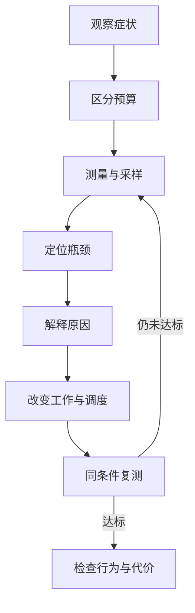

飞过一片从未探索的山地时，画面突然停了一下。回到基地，转动镜头很顺，村民却走得断断续续；打开远程服务器上的箱子，又要等一会儿才能拿出东西。这三种经验都可以被描述成“Minecraft 卡了”，但它们未必需要同一种修复。

第一种可能是客户端来不及建立或上传地形网格，也可能恰好撞上垃圾回收；第二种可能是服务器的模拟工作超过了 Tick 预算；第三种则可能涉及网络往返、发送队列或服务器处理等待。仅凭这几个症状，还不能确定原因。

前面的[客户端渲染](/impl/client-rendering)、[网络同步](/impl/networking)和[世界流送](/impl/chunk-streaming)已经把这些工作拆开。本章继续追问：**当玩家觉得慢时，哪一层没有按时交付结果；怎样测出它为什么慢，再选择真正改变这份开销的优化？**

本文以 Java Edition 26.3 为当前参照。帧、模拟、内存与传输预算的区分可以用于其他游戏，但 JVM 工具与下文的模组案例属于 Java 生态，不能直接套到 Bedrock 的运行时。

## “卡”到底是哪一种卡？

### FPS 与 Frame Time：画面多久更新一次

FPS 是每秒产生的帧数；Frame Time 是一帧所用的时间。目标越高，每帧能用的时间越短：

$$
B_{frame} = \frac{1000}{F_{target}}\text{ ms}
$$

因此 60 FPS 的目标约为 16.67 ms/frame，144 FPS 则约为 6.94 ms/frame。这些是由目标频率换算出的预算，不是 Minecraft 对某台机器的性能保证。诊断时还要问测量位置：记录的是 CPU 组织一帧的时间、GPU 执行命令的时间，还是相邻两次画面呈现之间的间隔？它们不能互相替代。

客户端 CPU 要准备可见对象、提取实体表现状态、处理 UI 并提交绘制；GPU 才执行顶点、像素、混合等工作。两边通常可以流水重叠，不能把 CPU Frame 与 GPU Frame 不加区分地相加。当流水线稳定时，较慢的一段往往限制吞吐；同步、上传和呈现等待又可能制造额外停顿。

如果画面固定在一个帧率上限附近，而 CPU、GPU 都有余量，限制可能来自限帧或垂直同步。反过来，即使平均 FPS 很高，少数长帧也会让转头和移动出现明显停顿。需要优化的是交付节奏，还是持续吞吐，要先分清。

### TPS 与 MSPT：世界多久推进一步

Java 默认以 20 TPS 推进世界，因此每轮约有 50 ms 的墙钟预算。现代 Java 可以通过 `/tick` 改变目标速率，也可以冻结或加速模拟；这里讨论默认、未冻结的运行条件。[^tick]

$$
B_{tick} = \frac{1000}{20} = 50\text{ ms}
$$

TPS 描述实际每秒推进了多少轮，是结果；MSPT 描述一次 Tick 花了多少毫秒，更接近成本。通常所说的 Tick 耗时不包含服务器为等待下一轮而主动休眠的全部间隔，但不同工具的计时边界仍要核对。墙钟耗时也可能包含锁等待、任务等待或暂停，并不等于这段时间里 CPU 一直在计算。

一轮用 15 ms，服务器通常会等到下一轮的时机，而不会自动把世界跑到每秒六十多轮；一轮用 45 ms，也仍可能显示 20 TPS。两者的余量却很不同。持续超过 50 ms，服务器就无法长期维持默认目标；偶尔超预算则可能表现为尖峰，未必立刻拉低较长窗口里的 TPS。

所以“20 TPS”还不能回答服务器是否有充足余量。画面流畅时，熔炉、红石和生物仍可能因为服务器慢而一起迟滞；低 FPS 时，远程服务器也可能正常推进世界。

### Ping 与 RTT：确认为什么还没回来

Ping 通常用于表示某种探测消息的往返时间，RTT 是 Round-trip Time。实际游戏内测得的往返还可能夹带两端调度和处理等待，应确认探测方法；它也不等于每种玩家操作的完整响应时间。

即使服务器保持 20 TPS，远程连接仍要经过链路传播、排队、传输，以及两端处理。客户端提高到 144 FPS，可以更快显示本地反馈，却不能让远端确认瞬间回来。[《网络架构与状态同步》](/impl/networking)讨论的 Prediction 只把部分显示和计算提前，延迟仍会在权威确认或纠正时出现。

| 指标 | 主要观察哪一层 | 典型症状 |
| --- | --- | --- |
| FPS / Frame Time | 客户端显示 | 镜头和画面停顿 |
| TPS / MSPT | 服务器模拟 | 生物、机器与世界推进迟滞 |
| Ping / RTT | 连接往返 | 操作确认迟、状态晚到 |

这张表是调查入口，不是症状判决书。挖掉的方块重新出现，既可能因为确认迟，也可能因为权限或状态校验失败；远处地形迟迟不来，也可能来自生成、磁盘、网络或客户端重建。单人游戏还把 Client 与 Integrated Server 放在同一个 JVM 中，两边会竞争 CPU 和内存，某些 JVM 暂停会同时影响它们。

## 时间和空间花在哪里？

### CPU：计算、协调与等待

服务器一轮 Tick 要承担实体更新、Mob AI 与寻路、需要 Tick 的 Block Entity、Scheduled Tick、方块更新与红石，以及命令、插件和模组逻辑。工作量既与对象数量有关，也与它们正在做什么有关：空闲生物和持续重新寻路的生物，数量相同，成本也可能相差很大。

Chunk 请求还会引入加载、生成以及结果接回世界的协调。生成和存储并非全部在主线程执行，现代 Java 已有后台任务；当前 `ChunkMap` 也分别管理生成调度、保存与卸载。[^chunk-map] 但 Holder 状态转换、世界注册、共享状态提交或同步请求中的等待，仍可能进入主线程的关键路径。**主线程是一条重要预算边界，整个游戏却不只有这一条工作路径。**

客户端 CPU 有另一份账：Section Rebuild / Meshing、可见性判断、Entity Render State 提取、粒子 Tick、UI、网格上传协调和 Draw Submission。[《客户端渲染与反馈》](/impl/client-rendering)已经解释这些职责。画面停一下，可能是重建队列刚好集中完成，也可能是本帧提交太多对象；提高服务器 TPS 不会直接修复这些开销。

还要分清“算得久”和“等得久”。某个线程等待 Chunk Future、锁或 GPU，并不意味着应该先优化它当前停留的那行代码。机器的总 CPU 占用不高，也可能有一个关键线程已经耗尽单核吞吐，其他核却空闲；总占用很高，则可能来自 Worldgen Worker、GC 或其他进程。只有把线程角色和等待关系接起来，才能判断资源究竟花在哪里。

### GPU：提交命令以后还有工作

Terrain、Entity、透明表面、粒子、Shader 和 Post-processing 都会消耗 GPU 时间。几何量只是其中一项；高分辨率增加要处理的像素，多层透明物体可能让同一屏幕区域反复被处理，复杂光影又增加采样和额外 Pass。Fill Rate 关心像素处理吞吐，显存与带宽则限制数据能否及时到达。

26.3 在支持的设备上用 MultiDrawIndirect 绘制地形，并让 Improved Transparency 使用新的近似 OIT 算法。[^render-263] 前者可减少 CPU 提交许多 Draw 的开销；后者改变透明排序与合成的工作方式。它们不保证所有场景都更快：CPU 提交变省以后，像素和光影仍可能成为限制；省去排序也要与 OIT 自身的 GPU 开销一起测量。

降低分辨率后，GPU 时间明显下降，是像素相关瓶颈的一条线索；变化很小，则需要继续看 CPU 提交、同步或限帧。GPU 占用不满本身不足以证明渲染器哪里写错了：GPU 可能在等 CPU，也可能已经及时完成当前帧。Java CPU 火焰图能看到部分提交和等待路径，却不能替代 GPU 时间测量或图形性能捕获。

### Memory：留下多少，与每秒制造多少

内存至少有两种不同成本。**Heap Footprint** 是堆中驻留数据的体量，包括 Chunk、Entity、状态索引和缓存；**Allocation Rate** 是单位时间实际分配到堆上的对象量，包括很快就会丢弃的临时数组、集合或包装对象。常驻体量不大，也可能因高分配率而产生显著回收压力。

GC 要管理对象的生死，有些工作可以并发执行，有些阶段仍需要暂停应用线程。Oracle 的性能诊断文档因此要求观察暂停、分配和线程事件，而不只看“还有多少空闲内存”。[^jfr-diagnosis] 如果长帧与 GC Pause 在时间线上重合，再追查分配来源或存活数据；看到一次 GC，不足以认定它解释了全部卡顿。

Heap 太小，可能没有足够余量容纳存活对象和新分配；增加内存可以缓解这种情况，却不会自动减少寻路次数、Draw Call 或网络延迟。过大的实际内存工作集也可能挤压操作系统文件缓存，甚至导致换页。`-Xmx` 只是堆上限，不等于进程已经使用那么多物理内存，JVM 之外还有本地缓冲、线程栈和图形资源。合理大小取决于对象寿命、收集器与机器余量，不存在脱离负载的万能数字。[^heap]

缓存可以少算，但也会多留。必须同时看命中率、驻留体量和失效频率：把一次短暂探索产生的数据永久缓存起来，可能省下极少计算，却让长期服务器的工作集持续增长。

### I/O 与 Network：队列也会耗尽预算

回到已探索区域，要从 Region File 读取、解压、反序列化，再把对象接回世界；保存则反向经历快照、序列化、压缩与写入。[《存档、序列化与版本迁移》](/impl/storage)解释了这些层。SSD 主要改善存储侧的吞吐与访问延迟，不能直接降低 CPU 压缩成本；备份与世界读写竞争磁盘，又可能让本来很快的读取出现长尾。

存储调查因此既看字节与操作耗时，也看排队长度和完成速度。后台写入避免直接阻塞某次交互，但队列长期积压时，内存中的待写数据仍会增长，退出或卸载也可能等待。保存间隔和并发数应该根据 Dirty 数据增长、写入吞吐、恢复要求来定；不能仅凭“异步保存”四个字推断它已经不占预算。

网络也有类似链条：Packet Encode / Decode、压缩消耗 CPU，传输消耗带宽，应用状态还要进入拥有世界的线程。Chunk Streaming 是突发的大块数据，Entity Update 则有反复向多个观察者发送的 Fan-out。同一群生物被十名玩家观察，与只被一名玩家观察，服务器模拟可以共享，网络发送却不能都共享。

玩家人数因此不是充分的成本指标。玩家集中时，Chunk 工作集重叠更多，但某些更新的观察者更多；玩家分散时，活动区域和新地形需求又可能扩张。Interest Management 控制谁需要收到什么，Batch 控制如何交付；当生产数据长期快于连接消化速度，排队会增加延迟，单纯提高发送批量无法消除瓶颈。

## 为什么平均值不够？

### 少数长帧会被许多短帧冲淡

假设有 100 帧，其中 99 帧各用 15 ms，一帧用 115 ms。总时间为 1600 ms，平均仍是 16 ms；玩家转头时却会遇到一次超过十分之一秒的停顿。这只是算术示例，说明平均值可以接近目标，同时交付节奏很差。

p95、p99 是按耗时排序后的分位数：p99 描述约 99% 样本不超过的耗时。它们帮助观察尾部，却也可能漏掉比所选分位更稀少的尖峰，而且不同统计方法对边界样本的处理不同。还应记录最大值、超预算次数和时间线；窗口越短，少数事件对统计的影响越大。

Frame Time Jitter 描述帧间隔的不稳定。两次测试平均 FPS 相似，其中一次长短帧交替更明显，玩家仍可能觉得更难控制。没有必要把每个统计量都变成一个评分：要解释的是本次体验为什么断了一下。

### Tick 尖峰和流送积压需要保留发生时刻

Server 平均 MSPT 很低，仍可能在探索、保存、GC 或实体集中变化时出现长 Tick。把这一分钟所有栈混成一张平均火焰图，尖峰路径可能被平稳期间的常规工作盖住。spark 提供只记录超过阈值 Tick 的采样模式，正是为了单独调查这些事件。[^spark-spikes]

还存在第三种情况：帧与 Tick 都稳定，地形却逐渐跟不上玩家。后台生成或发送的吞吐小于持续需求时，每项任务未必出现特别大的尖峰，队列却会越来越长。此时要看 Chunk 从请求到可用的延迟、各阶段完成速率与队列，而不仅是 MSPT。

所以稳定性和吞吐要一起看。一个调度器把大任务拆小，可能改善每帧尖峰，却让总完成时间变长；更激进地并行生成，可能提高完成速率，却争走前台线程的 CPU。测量必须覆盖你实际想改善的那一种等待。

## Profiling 怎样把症状变成证据？

### 先让对比拥有同一个场景

“昨天卡，今天不卡”不是可靠对比。世界、路线、实体活动、玩家位置、视距、分辨率、资源包、JVM 和后台负载都可能改变；JIT 预热、已缓存的数据和首次加载也会影响结果。记录这些条件，再选择能触发问题的场景，才能判断改动是否有效。

首次穿过未生成区域，与沿原路返回，是两种负载。测试 Worldgen 应使用可对比的未生成区域或同一基线世界副本，不能把第二次已经生成好的路线当成优化收益；测试稳定渲染则需要让加载和重建趋稳。每次先改变一个关键变量，在相同条件下复测，并检查正常场景与问题场景是否都能接受。

### 游戏内指标用于分层，记录器用于解释

现代 Java 的 F3 已不是一张永远显示相同字段的固定表。1.21.9 加入可配置 Debug Options 与 Performance 预设，26.3 仍使用 `F3 + F6` 打开选项。[^debug-options] 当前条目包括 FPS、TPS、内存、Chunk / Entity / Particle 渲染统计等；显示条件和数据来源不同。[^debug-entries] 渲染数量是当前表现侧的线索，不能当作整个服务器的实体清单。

观察 FPS 时再看帧时间变化；观察世界迟滞时，需要对应服务器的 Tick 耗时。客户端界面里存在 TPS 条目，不意味着任何远程服务器的完整 MSPT 都能直接读取。应从本地 Integrated Server 或远端服务器侧取得实际模拟数据，再与客户端症状对齐。

JFR（JDK Flight Recorder）把 JVM 的采样和事件写入记录，适合联合观察执行样本、分配、GC、线程活动、锁以及文件或 Socket I/O；具体能看到什么取决于记录配置与事件阈值。[^jfr-diagnosis] Minecraft 在 1.18 加入 `--jfrProfile` 与 `/jfr`，以及 Tick 时间、Chunk 生成、网络等自定义事件；26.3 的命令索引仍包含 `JfrCommand`。[^minecraft-jfr] 这让“玩家飞入新区”与“生成任务、暂停、网络流量发生变化”有机会落到同一条时间线上，而不只是留下一个 FPS 数字。

async-profiler 更适合深入采样热点：CPU 模式看执行栈，Allocation 模式看实际堆分配来源，Wall-clock 模式包含运行、睡眠和阻塞状态，Lock 模式调查争用。模式改变了统计对象，不能拿分配火焰图里的宽度解释 CPU 时间。[^async-modes] 当前官方维护的平台为 Linux 与 macOS；分析 Windows 上的 JVM 时，应按实际平台选择工具，不能假定同一采样后端处处可用。[^async-platforms]

spark 则把这类诊断放到 Minecraft 场景中：它提供执行与分配采样、Tick 监控、TPS / 健康信息，以及内存和 GC 数据，也支持客户端、服务器与代理部署。[^spark] 它是 Profiling 工具，采样结果帮助发现要改哪里；安装它本身不会把昂贵的逻辑改成便宜的逻辑。

工具仍会影响被测对象。采样间隔、事件阈值和记录开销决定你能看见多细的现象；某类事件没有出现在记录中，也可能是没有启用或未达到阈值。因而先用开销较低的观测确定问题窗口，再补充有针对性的记录，通常比长时间打开所有诊断更容易解释。

### 火焰图告诉你时间在哪里，调用关系解释为什么

采样火焰图把反复观察到的调用栈聚合起来。在通常自下向上的布局中，纵向是调用深度，横向宽度是样本权重；CPU 采样下可近似理解为执行时间占比。横轴不是时间线，不能从左到右读出某次卡顿的先后顺序。[^flamegraph]

**Inclusive Cost** 包含一个函数及其子调用，**Self Cost** 只看样本落在该函数自身的部分。一个宽大的 `Server Tick` 框往往只是包住了所有下属工作；直接优化这个入口函数，未必减少真正的成本。下面是抽象调用关系，不是某个版本的类名清单：

```text
Server Tick
└── Entity Tick
    ├── Mob AI
    │   └── Pathfinding
    └── Collision
```

如果 Pathfinding 很宽，至少有四个不同假设：单次算法慢、触发次数多、需要寻路的实体多，或者每次搜索空间太大。下一步应补充调用计数、搜索规模、实体分布或受控对比。重复请求同一条路径时，减少无效重算可能比微调搜索循环更有用；只有少数特别复杂路径慢时，又可能需要另一种办法。

CPU 采样也不会完整解释所有等待。主线程在等 Worker 时，热点可能在 Worker 上；Wall-clock 图中的正常休眠很宽，又不代表应该删除限速。按线程和问题窗口观察，才能区分正常等待、关键路径阻塞与实际计算。

最后还要警惕百分比：优化后某段占比变大，可能只是其他部分变小；占比下降，也可能因为新增了更多无关工作。**把火焰图的相对宽度接回毫秒、字节、调用次数和玩家等待，优化目标才算明确。**

## 哪些改动真正减少了开销？

### 少做、降低频率与缩小工作集

可见性裁剪减少本帧需要提交和绘制的对象；缩小 Simulation Distance 减少进入模拟资格的区域；Interest Management 减少某条连接需要接收的状态。它们都在减少工作，却改变不同层。缩小 Render Distance 会减少客户端候选地形及相关缓存，在客户端视距实际限制服务器发送范围时也会减少流送需求；它不会自动关闭所有服务器模拟，更不会取消其他 Ticket 的需求。

有些工作可以降低频率：状态未变时跳过派生数据重建，用 Dirty Flag 或变化通知代替重复检查，让不紧急的任务错开执行。但“每十 Tick 检查一次”会引入最多一段额外发现延迟；减少实体活跃更新，也可能改变农场、AI 或时序。首先确认允许多迟、允许少知道什么，再决定节流方式。

空间分区缩小查询候选集合，Streaming 缩小驻留集合，两者也不等价。世界里已有的数据，仍可以通过索引少查；暂时不需要的数据，则可以离开工作集。少做的前提是能判定哪些工作不会影响当前需要的结果，否则所谓优化只是悄悄删掉了玩法。

### 缓存、复用与改变数据表示

Section Mesh 把相对稳定的方块状态变成可复用的绘制数据，路径或其他派生结果也可以在条件允许时复用。收益来自避免重复计算，代价是内存、查找和失效管理。方块、光照或资源模型变化后，相关 Mesh 必须失效；路径缓存也必须考虑阻挡变化和目标变化。少算了一次，却继续使用错误结果，不能算行为保持的优化。

对象复用可以降低已测出的分配压力，但要管理引用、生命周期和跨线程访问；JIT 已消除的临时对象，也没有必要为了“看起来零分配”再造池。是否复用应由实际分配数据决定，而不是按源码里的 `new` 个数判断。

改变表示则可以同时减少存储、分配和访问间接性。[《体素世界的数据模型》](/impl/data-model)中的 Palette 用短索引表达大量重复状态；紧凑数组、Primitive Collection 与连续布局也可能减少包装对象和指针追逐。但压紧的数据需要解码，扩容和修改也可能更复杂。应一起测量占用、读取、写入和迁移成本，不能只比较文件大小。

### 批处理与并行：少交接，也要守住依赖

批处理把多次固定开销合并：Draw 可以少次提交，Packet 或 I/O 可以更集中地组织，保存工作也可以分批推进。不过 Batch 太大，会让后面的工作多等一会儿，或者一次占住太长时间。网络 Chunk Batch 尤其需要配合接收方消化速度；吞吐增加，不应以无限增长的确认延迟为代价。

并行则适合可独立计算的网格构建、部分 Worldgen、编码和 I/O。它增加调度、同步、争用以及结果合并成本；当 Worker 抢占前台 CPU 或内存带宽时，后台吞吐可能增加，帧或 Tick 的尾部却变差。[《区块生命周期与世界流送》](/impl/chunk-streaming)说明的邻区依赖，还要求生成任务遵守阶段和读写边界。把两个邻接 Chunk 放进线程池，并不能自动使它们独立。

共享状态需要明确所有者。可以让 Worker 根据快照计算，再由拥有世界的线程验证并提交结果；快照若已过期，还要重算或拒绝提交。同步工作简单换成 Future 后，如果主线程立刻等待它，关键路径并没有缩短，反而增加一次交接。并行的收益来自依赖关系允许重叠，不来自异步 API 的名字。

### 用同一份预算验收改动

假设一次问题 Tick 用了 80 ms，其中 60 ms 来自反复寻路。如果受控实验把寻路工作减到 30 ms，其他开销不变，总耗时才降到约 50 ms；若只把原本 2 ms 的序列化变成 1 ms，Tick 仍约为 79 ms。这些是假设数字，作用是说明优化收益受原有成本占比约束。

验收时重新记录相同场景的平均与尾部耗时、超预算次数、内存、队列和完成速率，再检查行为与结果。例如预生成可以把探索时的生成工作移到事前，但要支付准备时间与磁盘空间；缩小模拟范围可以让 MSPT 降下来，却缩小了同时运行的世界。两者都可能有用，报告时应写清收益来自何处，以及付出了什么。

## 优化模组分别改变哪一层？

### 从综合方案到按子系统观察

OptiFine 是 Java 优化生态中的长期综合式案例。作者的官方介绍把性能、HD Texture、Shader 与大量图形选项放在同一个项目中；其官方论坛发布帖可以追溯到 2011 年。[^optifine] 这种组合为玩家提供了一个集中调整显示体验的入口，但其中也有增加画质和工作量的能力，不能把每个选项都理解成无条件减负。

Sodium、Lithium、C2ME 与 FerriteCore 则更容易按主要职责分别观察。这些项目呈现出按瓶颈拆分的生态方向，职责仍有交集，组合也需要适配。下面比较的是优化对象，不是同一版本、同一设备上的性能排名，更不意味着这些项目已经共同支持原版的每个新版本。

| 项目 | 主要预算或角色 | 核心方向 |
| --- | --- | --- |
| Sodium | Client CPU / GPU | 地形渲染组织、可见性与提交 |
| Lithium | Game Logic CPU | AI、碰撞、方块等逻辑热路径 |
| C2ME | Chunk CPU / I/O / 调度 | 生成、加载与存储的并发 |
| FerriteCore | Memory | 紧凑表示与重复数据共享 |
| Entity Culling | Client CPU / GPU | 被遮挡实体的表现侧裁剪 |
| ImmediatelyFast | Client CPU / 提交 | 即时绘制路径的缓冲与批处理 |
| spark | 测量工具 | 采样、Tick 与内存诊断 |
| OptiFine | 客户端为主的综合方案 | 性能选项与图形增强 |

### 渲染案例：少提交与少画

Sodium 官方定位是客户端渲染引擎替换。当前公开实现把 Section 管理、可见列表、Mesh 上传与地形绘制后端组织起来，使优化可以同时涉及 CPU 建网格、Draw Submission 和 GPU 处理的工作量。[^sodium] 这是改变渲染架构的案例，不应由 FPS 收益推断远程服务器的 AI 也变快了。

Entity Culling 通过后台可见性计算跳过被墙体等遮挡的 Entity / Block Entity 绘制，当前还提供客户端 Tick 裁剪；官方明确说明不会影响服务器模拟、农场或生物行为。[^entity-culling] 所以屏幕少画一群墙后的生物，不等于服务器不再更新它们。可见性判断本身也有成本，超出通常边界绘制的模组对象还需要正确处理。

ImmediatelyFast 的官方定位则是优化客户端即时绘制路径，用定制缓冲更有效地批处理 Draw 和上传数据，覆盖实体、Block Entity、粒子、文字、GUI / HUD 等。[^immediately-fast] 这里“即时绘制”指这些动态组织的路径，不能据此把整个现代 Minecraft Renderer 都叫作旧式即时模式。它说明在地形缓存之外，界面与动态表现也有自己的提交预算。

### 模拟、流送与内存案例

Lithium 在客户端与服务器都有适用的逻辑优化，不要求两端同时安装。官方配置说明中的案例包括寻路节点判断与访问缓存、减少重复红石方块访问、碰撞和分配优化等，主要改变逻辑热路径，而非用更快的地形 Renderer 代替模拟。[^lithium] 项目以保持玩法行为为目标，仍需用实际场景和兼容性验证结果。

C2ME 主要针对 Chunk Generation、I/O 与 Loading，利用多核并行改进 Chunk 工作。[^c2me] 它把上一节的依赖问题变成具体工程：邻区阶段、结果发布、随机状态以及模组生成器对线程的假设，都可能限制可并行范围。官方也说明模组生成器的某些设计假设可能在这种环境下暴露兼容问题。生成吞吐提高后，若瓶颈转到压缩、磁盘或客户端接收，继续加 Worker 就未必有效。

FerriteCore 以降低内存占用为主要目标，作者的设计说明用状态转换数据的紧凑表示、模型相关重复数据共享等解释收益来源。[^ferrite-core] 说明中的具体节省数字来自特定历史整合包，不能当作当前任意环境的承诺。这个案例表明：优化可以是让同一份有用数据少占空间；只有内存或相关访问压力确实限制运行时，才有理由继续期待可测的帧或 Tick 改善。

把这些项目放在一起，能得到更准确的提问方式：渲染裁剪、逻辑缓存、并发调度、数据共享分别改变了哪项成本？改善依赖什么负载？是否引入新内存、等待或兼容代价？模组提供了可研究的替代实现，选择与评估仍应回到已经测出的瓶颈。

## 这一章留下什么

一项性能改动需要接起完整证据链：症状属于哪种交付问题，测量捕捉到了什么，哪个工作占据关键路径，为什么它如此昂贵，改动减少了哪些工作，又是否在复测中兑现。找不到这条链时，换工具、加内存或开更多线程都可能只是改变了条件。



有限预算决定了一个世界能同时呈现、运行和传输多少东西。优化不必让所有代码都更快，而应让预算用于当前需要的工作，并把节省的时间、空间与等待落实到玩家体验。

**对爱好者来说**，画面卡、世界慢与确认迟需要分别观察，FPS、TPS 和 Ping 中任何一个漂亮数字，都不足以解释全部体验。

**对开发者来说**，能抄走的是分层测量、解释热点、改变工作量或表示再复测的方法；不能直接抄走 Minecraft 的距离阈值、线程数量、JVM 参数和模组组合，因为合理预算取决于你的状态所有权、玩法时序、内容与硬件条件。

[^tick]: Mojang Studios，《Minecraft Java Edition 1.20.3》，Minecraft 官方版本说明，2023-12-05；说明 `/tick rate` 的默认值为 20，并介绍查询、冻结与加速模拟。见 [官方版本说明](https://www.minecraft.net/en-us/article/minecraft-java-edition-1-20-3)。

[^chunk-map]: NeoForge，Minecraft 26.3 映射《ChunkMap》，Javadoc，2026，查阅于 2026-10-05；用于核对生成任务、保存、卸载与线程协调职责。见 [ChunkMap](https://aldak0.ru/javadoc/26.3.x/net/minecraft/server/level/ChunkMap.html)。

[^render-263]: Mojang Studios，《Minecraft Java Edition 26.3》，Minecraft 官方版本说明，2026-09；说明支持设备上的 Terrain MultiDrawIndirect，以及 Improved Transparency 改用近似 OIT。见 [官方版本说明](https://www.minecraft.net/ko-kr/article/minecraft-java-edition-26-3)。

[^jfr-diagnosis]: Oracle，《Troubleshoot Performance Issues Using Flight Recorder》，Java SE 26 Troubleshooting Guide，2026，查阅于 2026-10-05；涵盖执行采样、分配、GC Pause、线程等待及文件 / Socket I/O，并说明事件阈值与采集开销。见 [官方诊断文档](https://docs.oracle.com/en/java/javase/26/troubleshoot/troubleshoot-performance-issues-using-jfr.html)。

[^heap]: Oracle，《Factors Affecting Garbage Collection Performance》，Java SE 26 Garbage Collection Tuning Guide，2026，查阅于 2026-10-05；区分保留与已提交的堆空间，并讨论堆大小、对象寿命及物理内存压力。具体收集器的行为须参照对应章节。见 [官方调优文档](https://docs.oracle.com/en/java/javase/26/gctuning/factors-affecting-garbage-collection-performance.html)。

[^spark-spikes]: lucko / spark，《Finding the cause of lag spikes》，spark 官方文档，无标注发布日期，查阅于 2026-10-05；解释长 Tick 定向采样与卡顿诊断。见 [Finding lag spikes](https://spark.lucko.me/docs/guides/Finding-lag-spikes)。

[^debug-options]: Mojang Studios，《Minecraft Java Edition 1.21.9》，Minecraft 官方版本说明，2025-09-30；Debug Overlay 部分说明 `F3 + F6`、可配置条目与 Performance 预设。26.3 说明继续使用此入口。见 [1.21.9 官方说明](https://www.minecraft.net/en-us/article/minecraft-java-edition-1-21-9)及前述 26.3 版本说明。

[^debug-entries]: NeoForge，Minecraft 26.3 映射《DebugScreenEntries》，Javadoc，2026，查阅于 2026-10-05；核对 FPS、TPS、Memory 与 Chunk / Entity / Particle Render Stats 等条目的存在，不据此推断默认界面布局或远端数据可用性。见 [DebugScreenEntries](https://aldak0.ru/javadoc/26.3.x/net/minecraft/client/gui/components/debug/DebugScreenEntries.html)。

[^minecraft-jfr]: Mojang Studios，《Minecraft: Java Edition - 1.18》，Minecraft Feedback 官方版本说明，2021-11-30；JFR Profiling 部分介绍启动参数、命令和初始自定义事件。26.3 的命令存在性另按 NeoForge 命令包索引核对。见 [1.18 官方说明](https://feedback.minecraft.net/hc/en-us/articles/4415128577293-Minecraft-Java-Edition-1-18)、[26.3 命令索引](https://aldak0.ru/javadoc/26.3.x/net/minecraft/server/commands/package-summary.html)。

[^async-modes]: async-profiler 项目，《Profiling modes》，官方 GitHub 文档，持续更新，查阅于 2026-10-05；说明 CPU、Allocation、Wall-clock 与 Lock 的不同计量对象。见 [ProfilingModes.md](https://github.com/async-profiler/async-profiler/blob/master/docs/ProfilingModes.md)。

[^async-platforms]: async-profiler 项目，《Async-profiler》，官方 GitHub README，持续更新，查阅于 2026-10-05；Supported Platforms 列出官方维护的 Linux 与 macOS 平台。见 [项目 README](https://github.com/async-profiler/async-profiler)。

[^spark]: lucko / spark，《spark》及《Command Usage》，官方 GitHub README 与文档，持续更新，查阅于 2026-10-05；核对客户端、服务器、代理定位，执行 / 分配采样及 Tick、内存、GC 诊断能力。见 [项目 README](https://github.com/lucko/spark)、[Command Usage](https://spark.lucko.me/docs/Command-Usage)。

[^flamegraph]: async-profiler 项目，《FlameGraph interpretation》，官方 GitHub 文档，持续更新，查阅于 2026-10-05；说明采样调用栈聚合、横轴不保留时间顺序，以及不同分析模式。见 [FlamegraphInterpretation.md](https://github.com/async-profiler/async-profiler/blob/master/docs/FlamegraphInterpretation.md)。

[^optifine]: sp614x，《OptiFine》及《OptiFine HD (FPS Boost, Dynamic Lights, Shaders and much more)》，官方主页与作者发布帖；论坛帖始于 2011，主页持续更新，查阅于 2026-10-05。见 [官方主页](https://optifine.net/home)、[作者发布帖](https://www.minecraftforum.net/forums/mapping-and-modding-java-edition/minecraft-mods/1272953-optifine-hd-fps-boost-dynamic-lights-shaders-and)。本文不采用主页的 FPS 倍率作为通用结论。

[^sodium]: CaffeineMC，《Sodium》，官方 GitHub README 及当前 `dev` 分支实现，持续更新，查阅于 2026-10-05；核对客户端渲染器定位，以及 Section 管理与地形提交职责。见 [README](https://github.com/CaffeineMC/sodium)、[RenderSectionManager](https://github.com/CaffeineMC/sodium/blob/dev/common/src/main/java/net/caffeinemc/mods/sodium/client/render/chunk/RenderSectionManager.java)、[DefaultChunkRenderer](https://github.com/CaffeineMC/sodium/blob/dev/common/src/main/java/net/caffeinemc/mods/sodium/client/render/chunk/DefaultChunkRenderer.java)。

[^entity-culling]: tr7zw，《EntityCulling》，官方 GitHub README，持续更新，查阅于 2026-10-05；说明后台可见性计算、客户端 Tick Culling、服务器模拟边界与特殊渲染对象例外。见 [项目 README](https://github.com/tr7zw/EntityCulling)。

[^immediately-fast]: RaphiMC，《ImmediatelyFast》，官方 GitHub README，持续更新，查阅于 2026-10-05；说明即时绘制路径、自定义缓冲、Draw 批处理与 GPU 上传，以及实体、粒子、文字和 GUI / HUD 等范围。见 [项目 README](https://github.com/RaphiMC/ImmediatelyFast)。

[^lithium]: CaffeineMC，《Lithium》及《Lithium Configuration File Summary》，官方 GitHub README 与配置说明，持续更新，查阅于 2026-10-05；核对两端运行定位、玩法保持目标，以及寻路、红石、碰撞与分配等优化。见 [README](https://github.com/CaffeineMC/lithium)、[配置说明](https://github.com/CaffeineMC/lithium/blob/develop/lithium-fabric-mixin-config.md)。

[^c2me]: RelativityMC，《C²M-Engine》，官方 GitHub README，持续更新，查阅于 2026-10-05；说明 Chunk Generation、I/O、Loading 的多核优化方向及模组生成器兼容边界。见 [项目 README](https://github.com/RelativityMC/C2ME-fabric)。

[^ferrite-core]: malte0811，《FerriteCore》及《summary.md》，官方 GitHub README 与设计说明，持续更新，查阅于 2026-10-05；说明紧凑状态表示、模型相关共享等内存优化，文中基准数字来自特定历史整合包。见 [README](https://github.com/malte0811/FerriteCore)、[设计说明](https://github.com/malte0811/FerriteCore/blob/main/summary.md)。
