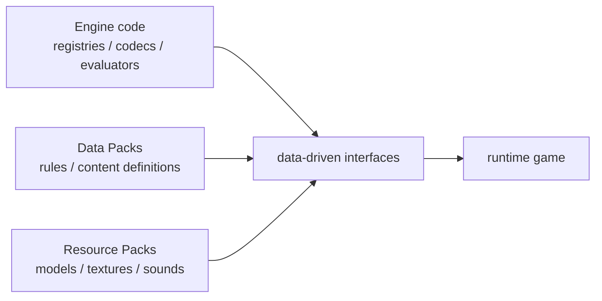
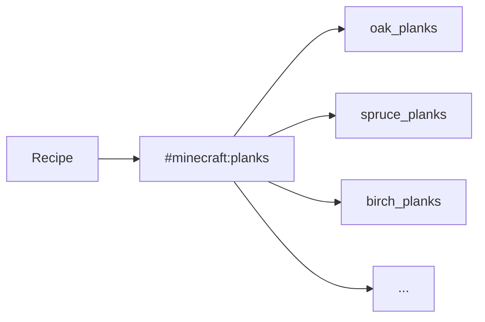

把一把钻石剑的合成配方改掉，不需要重新编译 Minecraft。把石头换成另一张纹理，也不需要。把一个新的生物群系加入世界生成、改掉箱子的战利品、让某组命令在每 Tick 执行，这些事情同样可以在不修改游戏程序的情况下完成。

它们看起来差别很大，却共享一个前提：

> **游戏代码已经先定义好“哪些东西可以由外部数据描述，以及这些数据应该怎样被解释”。**

这就是 Minecraft 所说的数据驱动最值得理解的地方。数据包不是“把 Java 换成 JSON”，资源包也不是简单的“换皮文件夹”。它们共同建立了一层位于硬编码逻辑与具体内容之间的接口：程序负责提供 Registry、Codec、Recipe Matcher、Loot Evaluator、Worldgen Pipeline、Renderer 等解释器；Pack 则为这些解释器提供可以替换和组合的输入。

Java Edition 1.13 正式引入 Data Pack 时，这层接口主要覆盖 Recipe、Tag、Loot Table、Function 和 Advancement。之后越来越多内容被迁入数据：Worldgen、Painting Variant、Enchantment，再到 26.3 中的数据驱动 Potion Recipe 与 Pottery Sherd。[^data-pack-113] [^data-driven-121] [^data-pack-263]

所以这一章真正要问的不是：

> 数据包能不能取代 Mod？

而是：

> **Minecraft 怎样把一部分原本写死在程序里的内容变成有名字、有类型、可校验、可覆盖、可重载的数据；这层接口又为什么始终需要程序来规定表达能力？**

本文主要以 **Java Edition 26.3** 为实现参照。当前 Data Pack Version 为 **121.0**，Resource Pack Version 为 **97.1**；现代 Pack Format 已经带 Major / Minor Version，并通过 `min_format` / `max_format` 声明兼容范围。[^data-pack-263] [^pack-format]



## 一份 Pack 到底被加载成什么？

从文件系统看，Data Pack 和 Resource Pack 都只是目录或压缩包。

真正进入游戏以后，它们不是“一个大配置文件”，而是被拆成许多带有 **Namespace、Path、Type** 的资源，再由不同 Loader 读取成 Registry Entry、Recipe、Function、Model、Texture 或其他运行时对象。

### Data Pack 和 Resource Pack 首先属于两种资源域

当前 Java 的 `PackType` 仍然明确只有两个顶层类型：[^pack-type]

```text
SERVER_DATA
CLIENT_RESOURCES
```

它们对应的典型目录也很直观：

```text
data/<namespace>/...
assets/<namespace>/...
```

**Data Pack** 进入 `SERVER_DATA`。它主要服务于服务器拥有的游戏数据，例如 Recipe、Loot Table、Advancement、Function、Tag、Worldgen Definition 和部分 Data-driven Registry。

**Resource Pack** 进入 `CLIENT_RESOURCES`。它主要提供 Model、Texture、Sound、Font、GUI Sprite、Particle Resource、Post Effect 等客户端表现资源。

这条边界和前两章直接相连：

- [《网络架构与状态同步》](/impl/networking)里的 Server Authority 决定游戏规则和共享状态；
- [《客户端渲染与反馈》](/impl/client-render)里的 Renderer / Sound / UI 消费 Client Resources。

所以“数据”和“资源”不是按文件扩展名区分，而是按**谁消费这份内容、它属于哪一层运行时职责**区分。

### Namespace 解决“这个名字属于谁”

一个 Minecraft Identifier 可以写成：

```text
minecraft:stone
elytra:steel_ingot
example:ruined_factory
```

冒号左边是 Namespace，右边是 Path。

Namespace 的价值并不是让名字看起来更像 URL，而是让多个内容来源能够共享同一套地址空间，而不必争夺全局短名字：

```text
minecraft:planks
my_map:planks
another_pack:planks
```

可以同时存在。

但 Identifier 只回答：

> 这份资源叫什么？

它还没有回答：

> 它是什么类型？

### Registry 给 Identifier 加上类型

`minecraft:stone` 作为 Block，和某个同名 Item / Resource，并不是因为字符串长得一样就成为同一个对象。

更完整的地址其实包含：

```text
Registry
+
Identifier
```

例如：

```text
Block Registry       + minecraft:stone
Item Registry        + minecraft:stone
Recipe Registry      + example:steel_plate
Loot Table Registry  + example:factory_crate
```

Registry 因此更接近一个**有类型的名字表**。

当前 26.3 的 `RegistryDataLoader` 甚至明确区分 `WORLD_REGISTRIES`、`DIMENSION_REGISTRIES`、`RELOADABLE_REGISTRIES` 与 `SYNCHRONIZED_REGISTRIES`。[^registry-loader]

这说明“Minecraft 有 Registry”不等于：

> 所有 Registry 都能被 Data Pack 随意新增。

有些 Registry 在程序启动时固定；有些从世界 Data Pack 读取；有些能在 `/reload` 时重新加载；有些还必须同步给 Client。**Registry 本身是一种组织机制，能否由 Data Pack 驱动是另一个属性。**

### Tag 给一组 Registry Entry 再起一个名字

Recipe 如果接受“任意木板”，最笨的办法是列出：

```text
oak_planks
spruce_planks
birch_planks
jungle_planks
...
```

Tag 提供另一层间接引用：

```text
#minecraft:planks
```

它表示某个 Registry 中的一组 Entry。

于是依赖关系从：

```text
recipe
→ every individual plank id
```

变成：



新增一种木板时，只要把它加入 Tag，所有依赖这个分类的 Recipe、Predicate 或其他系统就可以自动接受它。

Tag 的意义因此不只是“分类方便”，而是**降低内容之间的直接耦合**。

<Impl title="Identifier、Registry、Tag 是三件不同的事">
Identifier 解决名字冲突；Registry 解决类型和查找；Tag 解决“哪些 Entry 属于同一语义集合”。自研数据驱动系统如果只做一个全局字符串字典，后续通常会重新遇到类型安全、集合引用和跨模块冲突的问题。
</Impl>
