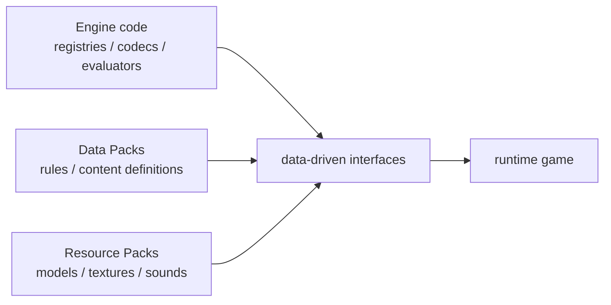
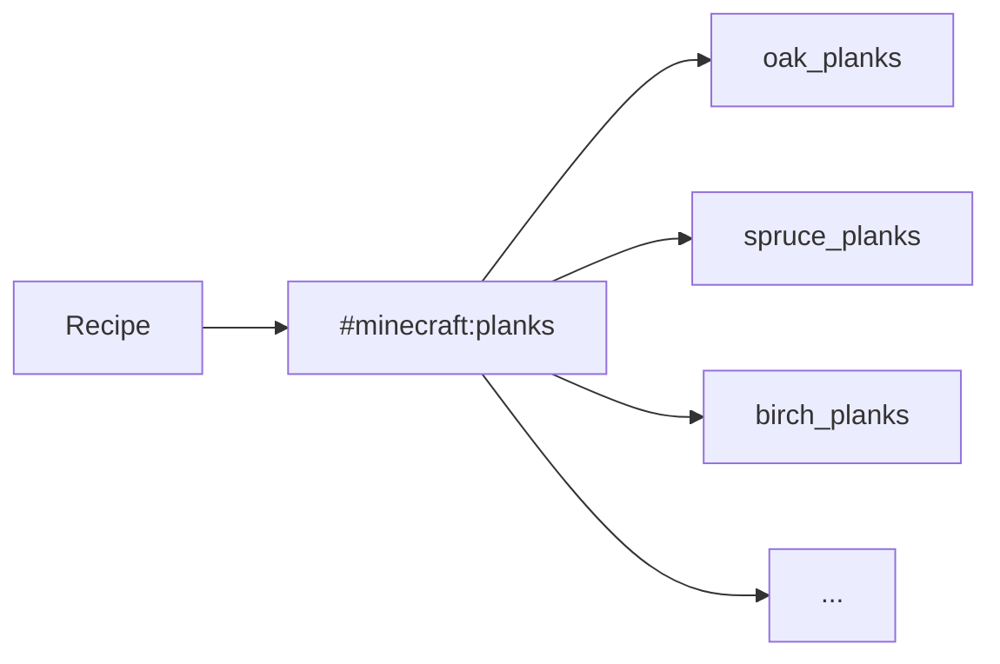
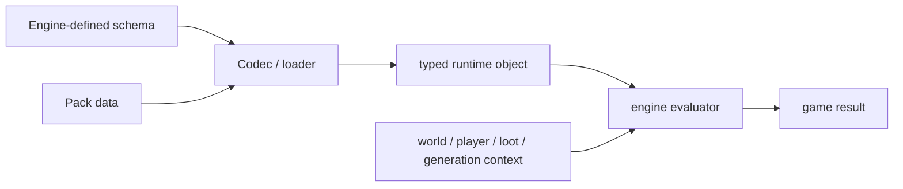
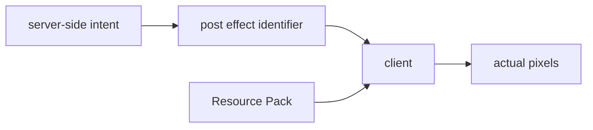
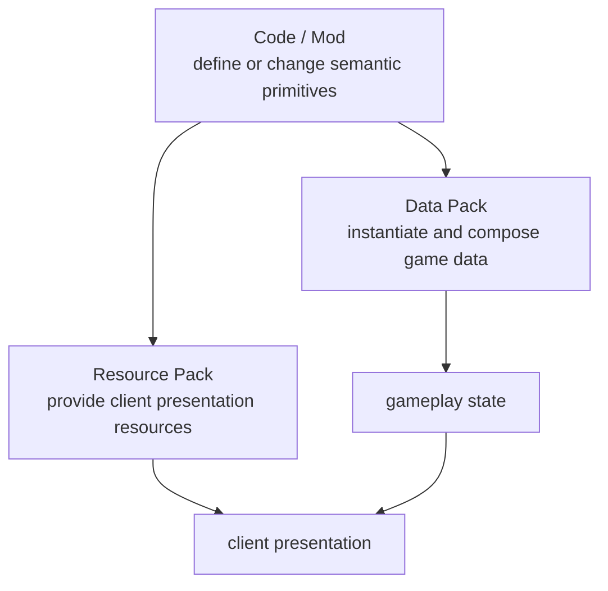

把一把钻石剑的合成配方改掉，不需要重新编译 Minecraft。把石头换成另一张纹理，也不需要。把一个新的生物群系加入世界生成、改掉箱子的战利品、让某组命令在每 Tick 执行，这些事情同样可以在不修改游戏程序的情况下完成。

它们看起来差别很大，却共享一个前提：

> **游戏代码已经先定义好“哪些东西可以由外部数据描述，以及这些数据应该怎样被解释”。**

这就是 Minecraft 所说的数据驱动最值得理解的地方。数据包不是“把 Java 换成 JSON”，资源包也不是简单的“换皮文件夹”。它们共同建立了一层位于硬编码逻辑与具体内容之间的接口：程序负责提供 Registry、Codec、Recipe Matcher、Loot Evaluator、Worldgen Pipeline、Renderer 等解释器；Pack 则为这些解释器提供可以替换和组合的输入。

Java Edition 1.13 正式引入 Data Pack 时，这层接口主要覆盖 Recipe、Tag、Loot Table、Function 和 Advancement。之后越来越多内容被迁入数据：Worldgen、Painting Variant、Enchantment，再到 26.3 中的数据驱动 Potion Recipe 与 Pottery Sherd。[^data-pack-113] [^data-driven-121] [^data-pack-263]

所以这一章真正要问的不是：

> 数据包能不能取代 Mod？

而是：

> **Minecraft 怎样把一部分原本写死在程序里的内容变成有名字、有类型、可校验、可覆盖、可重载的数据；这层接口又为什么始终需要程序来规定表达能力？**

本文主要以 **Java Edition 26.3** 为实现参照。当前 Data Pack Version 为 **121.0**，Resource Pack Version 为 **97.1**；现代 Pack Format 已经带 Major / Minor Version，并通过 `min_format` / `max_format` 声明兼容范围。[^data-pack-263] [^pack-format]



## 一份 Pack 到底被加载成什么？

从文件系统看，Data Pack 和 Resource Pack 都只是目录或压缩包。

真正进入游戏以后，它们不是“一个大配置文件”，而是被拆成许多带有 **Namespace、Path、Type** 的资源，再由不同 Loader 读取成 Registry Entry、Recipe、Function、Model、Texture 或其他运行时对象。

### Data Pack 和 Resource Pack 首先属于两种资源域

当前 Java 的 `PackType` 仍然明确只有两个顶层类型：[^pack-type]

```text
SERVER_DATA
CLIENT_RESOURCES
```

它们对应的典型目录也很直观：

```text
data/<namespace>/...
assets/<namespace>/...
```

**Data Pack** 进入 `SERVER_DATA`。它主要服务于服务器拥有的游戏数据，例如 Recipe、Loot Table、Advancement、Function、Tag、Worldgen Definition 和部分 Data-driven Registry。

**Resource Pack** 进入 `CLIENT_RESOURCES`。它主要提供 Model、Texture、Sound、Font、GUI Sprite、Particle Resource、Post Effect 等客户端表现资源。

这条边界和前两章直接相连：

- [《网络架构与状态同步》](/impl/networking)里的 Server Authority 决定游戏规则和共享状态；
- [《客户端渲染与反馈》](/impl/client-render)里的 Renderer / Sound / UI 消费 Client Resources。

所以“数据”和“资源”不是按文件扩展名区分，而是按**谁消费这份内容、它属于哪一层运行时职责**区分。

### Namespace 解决“这个名字属于谁”

一个 Minecraft Identifier 可以写成：

```text
minecraft:stone
elytra:steel_ingot
example:ruined_factory
```

冒号左边是 Namespace，右边是 Path。

Namespace 的价值并不是让名字看起来更像 URL，而是让多个内容来源能够共享同一套地址空间，而不必争夺全局短名字：

```text
minecraft:planks
my_map:planks
another_pack:planks
```

可以同时存在。

但 Identifier 只回答：

> 这份资源叫什么？

它还没有回答：

> 它是什么类型？

### Registry 给 Identifier 加上类型

`minecraft:stone` 作为 Block，和某个同名 Item / Resource，并不是因为字符串长得一样就成为同一个对象。

更完整的地址其实包含：

```text
Registry
+
Identifier
```

例如：

```text
Block Registry       + minecraft:stone
Item Registry        + minecraft:stone
Recipe Registry      + example:steel_plate
Loot Table Registry  + example:factory_crate
```

Registry 因此更接近一个**有类型的名字表**。

当前 26.3 的 `RegistryDataLoader` 甚至明确区分 `WORLD_REGISTRIES`、`DIMENSION_REGISTRIES`、`RELOADABLE_REGISTRIES` 与 `SYNCHRONIZED_REGISTRIES`。[^registry-loader]

这说明“Minecraft 有 Registry”不等于：

> 所有 Registry 都能被 Data Pack 随意新增。

有些 Registry 在程序启动时固定；有些从世界 Data Pack 读取；有些能在 `/reload` 时重新加载；有些还必须同步给 Client。**Registry 本身是一种组织机制，能否由 Data Pack 驱动是另一个属性。**

### Tag 给一组 Registry Entry 再起一个名字

Recipe 如果接受“任意木板”，最笨的办法是列出：

```text
oak_planks
spruce_planks
birch_planks
jungle_planks
...
```

Tag 提供另一层间接引用：

```text
#minecraft:planks
```

它表示某个 Registry 中的一组 Entry。

于是依赖关系从：

```text
recipe
→ every individual plank id
```

变成：



新增一种木板时，只要把它加入 Tag，所有依赖这个分类的 Recipe、Predicate 或其他系统就可以自动接受它。

Tag 的意义因此不只是“分类方便”，而是**降低内容之间的直接耦合**。

<Impl title="Identifier、Registry、Tag 是三件不同的事">
Identifier 解决名字冲突；Registry 解决类型和查找；Tag 解决“哪些 Entry 属于同一语义集合”。自研数据驱动系统如果只做一个全局字符串字典，后续通常会重新遇到类型安全、集合引用和跨模块冲突的问题。
</Impl>

## 数据包怎样把规则和内容从代码里抽出来？

Data Pack 最容易被误解成“很多 JSON”。

更准确地说，它是一组**服务器数据入口**。不同目录背后对应完全不同的解释器：Recipe Loader 读 Recipe，Loot System 读 Loot Table，Worldgen Registry 读 Biome / Noise / Structure，Function Library 则读取 `.mcfunction` 命令脚本。

格式只是载体，真正重要的是“哪段程序愿意读取它”。

### Recipe、Loot Table、Advancement 是声明式规则

以 Recipe 为例，数据文件不会自己执行合成。

它描述：

- 输入属于哪些 Ingredient；
- 是否要求形状；
- 输出什么 ItemStack；
- 某些 Recipe Type 需要哪些附加参数。

真正执行 Match 和 Assemble 的仍然是游戏中的 Recipe Type。

Loot Table 也一样。JSON 可以描述：

- Pool；
- Entry；
- Condition；
- Function；
- Number Provider；
- Context-dependent Value。

但“怎样抽取权重”“某个 Condition 怎样读取 Loot Context”“某种 Loot Function 怎样修改 ItemStack”，仍然由程序中的 evaluator 实现。

Advancement、Predicate、Item Modifier、Worldgen Definition 都遵循类似结构：



所以数据驱动不是：

> 数据自己拥有行为。

而是：

> **程序把原来写在条件分支里的“具体内容”抽成输入，再用稳定的解释器执行它。**

这也是为什么数据驱动通常最适合**同一种算法拥有大量变体**的地方。

几百个 Recipe 不值得写几百个 Java Class；几十种 Loot Table 也没必要每个都有独立代码。把“变化的参数”移入数据以后，新增内容就不再等同于新增程序路径。

### Worldgen 把这种模式推到了更深的位置

世界生成看起来比 Recipe 复杂得多，但第 03 章已经看到，现代 Java 同样把大量 Worldgen 对象放进 Data-driven Registry：

- Biome；
- Noise / Density Function；
- Configured Feature；
- Placed Feature；
- Structure；
- Dimension / Dimension Type；
- 以及它们互相引用的其他生成对象。

这让数据包可以组合出差异非常大的世界，而不需要为“这个群系的树更多”“这个 Density Function 换一套参数”“这个 Structure Pool 换一组模板”重新写 Chunk Generator。

但这并不意味着 Worldgen 已经没有代码。

`noise`、`range_choice`、`spline` 等 Density Function Type 为什么存在，Feature 怎样修改 Chunk，Structure Placement 怎样选位置，仍然是引擎实现的算法。数据包可以构造这套图，却不能凭 JSON 发明一个 Loader 从未认识的新 Density Function Type。

于是世界生成给出了一个很通用的边界：

> **Data Pack 可以创建新的“实例图”，但能使用哪些节点类型，仍由引擎提供。**

### Function 是数据包里的另一种编程方式

`.mcfunction` 与 Recipe JSON 很不一样。

它不是声明一个对象，而是按顺序执行 Minecraft 已有 Command：

```mcfunction
scoreboard players add @a example.time 1
execute as @a[scores={example.time=200..}] run function example:next_phase
```

当前 `ServerFunctionLibrary` 把 Function 当作可重载服务器资源，`ServerFunctionManager` 还会执行约定的 `minecraft:load` 与 `minecraft:tick` Function Tag。[^functions]

这让 Data Pack 不只有声明式能力，还拥有一层轻量脚本 / orchestration：

```text
declarative data
Recipe / Loot / Worldgen / Advancement

imperative orchestration
Function + Command
```

Function 可以组合已有命令，做出计时器、任务流程、小游戏状态机、区域事件，甚至非常复杂的冒险地图逻辑。

但它执行的仍是 Command Dispatcher 已经提供的操作。

如果没有某个 Command、Component、Predicate、Loot Function 或其他 Engine Primitive，Function 只能通过已有原语绕路模拟，而不能定义一个新的 JVM 方法或新的网络 Packet Type。

这和通常的“脚本语言”边界很像：

> **语言可以非常有表达力，但它仍然受 Host API 限制。**

### 数据驱动的边界会随着版本移动

因此不能把 Data Pack 的边界固定描述成：

> “它只能改内容，不能改行为。”

这个说法在今天已经太粗。

例如 1.21 的 Enchantment 已经被大幅数据驱动；26.3 又加入 `minecraft:block_transformer` Item Component，让物品可以通过数据声明“玩家交互时把方块变成另一个 Block State，并播放 Sound / Particle”。26.3 还把 Potion Recipe 和 Pottery Sherd 继续移入数据层。[^enchantments] [^block-transformer] [^data-pack-263]

这些显然都涉及行为。

更准确的边界是：

> **数据可以调用、组合和参数化引擎已经公开的数据语义；不能仅靠数据定义一种引擎从未提供解释器的新语义。**

今天如果 Engine 新增一种 Component：

```text
minecraft:block_transformer
```

那么昨天必须硬编码的某类交互，今天就能数据驱动。

所以 Data-driven Boundary 不是一道永远不动的墙，而是一条由**当前 Schema + Evaluator 集合**决定的边界。

这也解释了为什么 Minecraft 每次把 Enchantment、Painting Variant、Potion Recipe 等系统迁入数据层，都是真正的架构变化：不是 JSON 文件变多了，而是**原来只能由 Mojang 在代码中添加的变体，现在被开放成运行时可加载的数据实例**。

## 资源包为什么必须和数据包分开？

一把自定义外观的武器通常同时涉及两件事：

1. 它在世界里是什么、拥有哪些游戏数据；
2. 玩家看到、听到它时是什么样子。

把这两层分开以后，服务器规则不需要依赖 PNG，Renderer 也不需要决定这把武器造成多少伤害。

### Resource Pack 提供的是客户端表现输入

26.3 的 Resource Pack 可以参与很多客户端系统，包括：

- Texture / Sprite Atlas；
- Block / Item Model；
- Entity Equipment Asset；
- Font；
- Sound；
- GUI Sprite；
- Particle Resource；
- Shader / Post-processing Resource。[^resource-pack-263]

上一章已经提到 26.3 的 `/posteffect`：Server 可以请求客户端使用某个 Post Effect，但 Effect 本身存在于 Resource Pack 中，Server 甚至无法知道它最后是否真的应用。[^data-pack-263]

这是 Data / Resource 分层非常清楚的例子：



服务器拥有“请求什么”的 Gameplay State；客户端资源决定“这个 Identifier 最终怎样被画出来”。

### 同一个 Namespace 可以跨越数据和资源两边

假设一个地图包使用：

```text
factory:steel_hammer
```

这个 Namespace 可以同时出现在：

```text
data/factory/...
assets/factory/...
```

服务器数据可能规定它参与什么 Recipe、Loot 或 Function；客户端资源则提供 Model、Texture、Sound。

这让**语义 ID 成为两边的接缝**。

数据和资源不必打包在同一个物理文件里，也不必拥有完全相同的生命周期，但只要双方约定同一个 Identifier，就可以在运行时关联。

这也是多人服务器能够发送 / 要求 Resource Pack 的原因：Server 可以保持统一规则，同时让 Client 获得与这些规则匹配的表现资源。当前客户端仍有专门的 Downloaded Pack Source 与 Reload 流程来处理 Server Resource Pack。[^downloaded-pack]

### 换模型不等于注册了新的 Item 类型

Resource Pack 很容易制造一种错觉：

> 既然我能让一根 Carrot on a Stick 看起来完全像一把激光枪，我是不是已经“新增了一种物品”？

从表现上，它当然可以是全新的。

从数据模型上，则要看它是否仍然引用已有 Item Registry Entry，只是通过 Components / Model Selection / Custom Data 获得不同实例表现和规则。

Java 近年来不断增强 Item Components，使 Data Pack + Resource Pack 可以做出越来越像独立物品的内容；但**真正增加一个新的 Item Registry Type / Block Type / Entity Type**，仍然不是 Vanilla Data Pack 的通用能力。

这里不能只看玩家肉眼是否能分辨，而要回到第一章的数据模型：

> **是新增了一个 Registry Entry，还是让已有 Registry Entry 的某个实例拥有了新的数据与表现？**

这两个方案在存档、命令、Tag、Recipe、网络和 Mod Interop 中的语义完全不同。

### Core Shader 展示了“文件可覆盖”与“正式扩展面”的差别

Resource Pack 的边界也不是“assets 目录里能替换的东西都属于稳定 API”。

26.3 官方仍明确说明：Resource Pack 技术上可以覆盖 **Core Shader**，但 Core Shader Override 并不是受支持、预期的 Resource Pack Feature，内部 Shader 可以随着 Renderer 重构而改变。另一方面，Post Effect 则已经获得显式的资源与命令入口。[^resource-pack-263]

这提供了一个很重要的工程区分：

```text
can be modified
≠
documented extension point
≠
compatibility promise
```

下一章讨论 Mixin 和 Loader 时，这个区别会变得更极端：社区当然可以修改游戏内部代码，但“做得到”本身并不会让那个内部实现成为稳定 API。

## 多个包同时存在时，内容怎样组合？

允许用户加载 Pack 以后，新的问题马上出现：

> 两个包都修改同一个东西怎么办？

如果答案只是“后加载的文件覆盖前一个文件”，系统很快会在 Tag、Language、Atlas、Loot 等需要组合的资源上失去表达力。Minecraft 因此把 Pack 看成一个**有优先级的资源栈**，再由不同资源类型决定怎样解释这个栈。

### 普通资源可以被高优先级 Pack 覆盖

当前 `MultiPackResourceManager` 会把多个 `PackResources` 组合成一个按 Namespace 查询的 Resource Manager，并能够同时返回单一 Resource 或同一 Identifier 的 Resource Stack。[^multi-pack]

对于 Model、Texture、Recipe 等通常只有一个最终定义的资源，可以把它理解成：

```text
vanilla
   ↓
pack A
   ↓
pack B
   ↓
effective resource
```

高优先级 Pack 为同一个 Identifier 提供新定义时，调用方最终看到的是覆盖后的版本。

这就是为什么 Resource Pack 可以替换：

```text
minecraft:textures/block/stone.png
```

Data Pack 也可以用同一个 Recipe ID 替换 Vanilla Recipe，而不需要修改原版 jar。

覆盖让“修改已有内容”变成一种正式操作，而不是要求用户先找到并编辑游戏安装目录。

### Tag 这类集合资源需要 Merge 语义

Tag 的需求不一样。

如果两个 Mod / Data Pack 都想声明：

```text
#example:wrenches
```

一个希望加入 Item A，一个希望加入 Item B，那么单纯的 Last Writer Wins 会让扩展生态非常脆弱。

Tag Loader 因此能够聚合同一个 Tag 的多份来源；Tag Definition 也可以显式使用 `replace` 改成替换之前的集合。当前 `TagBuilder` 与 `TagLoader` 仍然保留这套 Merge / Replace 语义。[^tag-loader]

这是一种很值得自研系统注意的差别：

> **标量式资源和集合式资源，不一定应该共享同一种覆盖规则。**

配置系统如果所有 Key 都只能整份覆盖，会让多个扩展很难共同贡献同一个集合；如果所有内容都自动合并，又会让作者无法明确替换旧规则。

Pack Stack 只是提供优先级，**每种数据类型仍需要定义自己的 Composition Semantics**。

### Reload 把文件重新构造成一套运行时状态

Data Pack 的另一个重要能力是 `/reload`。

当前 `MinecraftServer.reloadResources(...)` 会重新建立 Reloadable Resources；Recipe Manager、Advancement、Function Library 等都属于这套可重新加载的 Server Resource Manager。[^server-reload]

这不是说所有世界对象都会被销毁重建。

更准确的过程是：


像 `ServerFunctionLibrary` 本身就是 `PreparableReloadListener`；客户端资源也有对应的 Reloadable Resource Manager，可以在资源选择变化时重新准备 Model、Texture、Sound 等派生状态。[^functions] [^resource-reload]

这让开发者可以把：

> “修改一张 Recipe”

和：

> “重启 JVM、重新注册全部代码”

拆成两种成本完全不同的操作。

但可重载并不是免费的。

数据之间可能互相引用；Model / Atlas / Registry 派生数据需要重新构建；正在运行的系统还必须决定“旧对象应该继续引用旧定义，还是下一次查询就使用新定义”。因此 Data-driven System 一旦支持 Reload，就必须认真设计：

- Parse / Validate 在什么时候完成；
- Reference 怎样解析；
- Apply 是否允许半成品；
- Derived Cache 怎样失效；
- 已经存在于世界里的实例怎样面对定义变化。

这些问题远比“JSON 能不能读出来”更接近真正的数据驱动工程。

### Pack Version 是数据 Schema 的版本

Data Pack 和 Resource Pack 都会随着 Minecraft 版本演化。

26.3 的 Data Pack Version 已经是 **121.0**，Resource Pack Version 是 **97.1**。从 1.21.9 开始，Pack Version 还正式拥有 Major / Minor 两级：Minor Version 的递增被定义为对同一 Major 下旧 Pack 向后兼容，Pack Metadata 则通过 `min_format` / `max_format` 声明接受的版本范围。[^pack-format] [^data-pack-263]

这反映了一个很现实的问题：

> **一旦外部数据成为内容接口，Schema 本身就开始需要版本管理。**

例如一个字段改名、一个 Registry 被拆分、一种 Item Stack 表示从 NBT Tag 迁移到 Components，都可能让旧 JSON 在新版本中不再具有相同语义。

所以数据驱动降低的是：

> 新增内容时修改程序的成本。

它没有消除：

> 长期维护数据 Schema 的成本。

甚至某种意义上，它把一部分兼容压力从 Java Method Signature 转移到了 JSON / Codec / Registry Contract。

<Callout type="warning" title="数据文件也会形成 API">
只要地图、服务器和第三方工具开始生成某种 JSON Schema，字段名、默认值、Identifier 和 Pack Version 就已经成为外部依赖。数据驱动让扩展更温和，不代表格式可以永远无成本地变化。
</Callout>

## 数据包到底能做到哪里？

现在可以重新回答最容易引发争论的问题：

> Data Pack 和 Mod 的边界在哪里？

最稳妥的判断方式不是看“这个效果听起来像不像新玩法”，而是看实现它需要的**语义是否已经存在于 Engine 暴露的数据模型中**。

### 能否数据驱动，取决于有没有对应的解释器

下面这张表比“内容 / 行为”二分更接近现代 Java：

| 目标 | Vanilla Pack 能否直接表达 | 依赖的既有语义 |
| --- | --- | --- |
| 新 Recipe / 修改 Recipe | Data Pack 可以 | Recipe Type / Ingredient / ItemStack |
| 新 Loot Table | Data Pack 可以 | Loot Context / Entry / Condition / Function |
| 新 Advancement / Predicate | Data Pack 可以 | Trigger / Predicate 类型 |
| 新 Worldgen 配置、Biome、Structure 等 | 大量内容可以 | Data-driven Registry + 既有 Worldgen Types |
| 新 Function / Tick 逻辑 | Data Pack 可以 | Command Dispatcher 已有命令 |
| 新 Potion Brewing Recipe | 26.3 可以 | Brewing Recipe Schema |
| 物品按规则转换方块 | 26.3 可用现有 Component 描述 | `minecraft:block_transformer` |
| 换 Model / Texture / Sound / Font | Resource Pack 可以 | 客户端 Resource Loader |
| 自定义外观物品 | Data + Resource 可以做到很深 | 已有 Item + Components + Model System |
| 注册一种全新的 Block / Item / Entity Type | Vanilla Pack 通常不可以 | 需要新的 Registry Entry / Code Type |
| 新的 GUI / Screen 类型 | 不可以只靠 Vanilla Pack | Client code |
| 新 Network Packet / Prediction Rule | 不可以只靠 Vanilla Pack | Protocol / Client / Server code |
| 新的 Worldgen Node / Loot Function / Command Primitive | 需要代码先实现这个 Type | 新 Evaluator / Codec / Registration |
| 改 Renderer 的 Chunk Batching / Main Loop | Resource Pack 不提供这种系统级能力 | Engine implementation |

这张表最重要的不是哪一行属于“可以”。

而是最右边：

> **每一项 Data-driven Feature 背后，都有一套 Engine-defined Semantic Primitive。**

当 Mojang 新增 Primitive，边界就会向外移动；当某个想法需要全新的 Primitive，单独增加一份 Pack File 就不够。

### “做得出来”也不等于“拥有原生语义”

Function 和 Command 尤其容易模糊这条边界。

地图作者可以用：

- Scoreboard；
- Marker Entity；
- Function；
- Predicate；
- Storage；
- Particle；
- Teleport；
- Item Components；

组合出非常复杂的机制。

玩家体验上，它甚至可以像一个完全新的系统。

但工程上仍然值得问：

> 这是一种新的 Engine Primitive，还是用既有 Primitive 编排出的复合行为？

两者没有高低之分。

前者通常拥有更直接的数据模型、更清晰的生命周期和更好的 Tooling；后者拥有更强的可分发性，不需要修改客户端程序，并且常常能在 Vanilla Server 上直接运行。

这正是 Data Pack 有价值的地方：**它让“组合既有系统”本身成为一等创作方式，而不是逼所有高级内容都去修改游戏代码。**

### 数据驱动越深，程序的 Schema 设计责任越大

把系统从代码迁入数据，并不会让设计问题消失。

例如如果一个 Item Behavior 原本是：

```java
if (item == AXE) {
    strip(block);
}
```

改成 Data Component 以后，引擎必须重新回答：

- Component 接受什么字段？
- 多条 Rule 谁先执行？
- 条件失败后继续还是停止？
- Sound / Particle 是 Server Event 还是 Client Resource？
- Block State Provider 返回无结果怎么办？
- 如何序列化和网络同步？
- 旧 ItemStack 怎样迁移？

26.3 的 `block_transformer` 就显式定义了 Rule List、Block State Provider、Sound 与 Particle 等字段。[^block-transformer]

这不是“把代码搬进 JSON”这么简单，而是：

> **把一个隐式代码路径设计成可公开组合的、小型领域语言。**

优秀的数据驱动设计，往往比一次性硬编码需要更清楚地定义边界，因为第三方作者将长期依赖这份 Schema。


## 如果自己设计数据驱动系统，真正需要先决定什么？

Minecraft 的具体目录、Pack Version 和 Registry 名称都会继续变化，但它暴露出来的工程问题很普遍。

如果今天为一个长期运行的沙盒设计扩展层，最先要决定的通常不是：

> JSON 还是 YAML？

而是下面这些更基础的问题。

### 哪些对象需要稳定 Identifier？

凡是会被：

- 存档引用；
- 网络同步；
- 配方引用；
- Script 引用；
- Mod / Pack 扩展；
- 外部工具生成；

的对象，都值得拥有稳定、可序列化的 Identifier。

如果一个系统只靠数组下标或运行时指针连接，短期实现可能很快，但只要进入持久化和第三方扩展，Identifier 几乎一定会补回来。

Namespaced ID 又进一步解决：

> 多个作者怎样在同一个世界里命名而不依赖中央编号分配？

这不是 Minecraft 专属技巧，而是 Plugin / Package / Asset System 很常见的基础设施。

### 哪些变化是实例，哪些变化需要新增类型？

这是数据驱动边界最核心的问题。

假设游戏里已有：

```text
DamageEffect
HealEffect
SpawnEffect
TransformBlockEffect
```

数据文件当然可以创建很多不同参数的实例。

但如果作者想要：

```text
RewindTimeEffect
```

引擎里根本没有对应 evaluator，那么“多写几个字段”不会自动产生时间倒流算法。

因此可以用一条非常实用的判断：

```text
new values / combinations
→ usually data

new semantic primitive / evaluator
→ code first, data second
```

这比“简单功能用 JSON，复杂功能用代码”更准确。一个 Worldgen Density Graph 可以非常复杂，却仍然全部由数据组合；一个很小的新网络握手语义，却可能必须改代码。

### Reload 的单位应该多大？

支持 Reload 以后，还要决定：

- 一张 Recipe 可以单独热更新吗？
- 整个 Recipe Registry 一起替换吗？
- Worldgen Definition 能否在旧 Chunk 已存在时重载？
- Model Reload 是否需要重建全部 Mesh？
- 已经 Spawn 的 Entity 是否继续持有旧配置？
- Reload 失败时保留旧数据还是让世界停止加载？

Reload Granularity 越细，创作迭代越快；状态管理和 Invalidation 也越复杂。

Minecraft 自己也没有把所有数据都做成同一种 Reload 生命周期：当前 `RegistryDataLoader` 就区分 World、Dimension、Reloadable 与 Synchronized Registries。[^registry-loader]

所以：

> **“数据驱动”与“热重载”是相关能力，但不是同义词。**

有些数据适合每次 `/reload` 重建；有些世界级定义更适合在加载世界时冻结。

### Validation 应该尽量在使用前发生

外部数据最大的风险之一，是把错误拖到真正执行时才发现。

如果一个 Loot Table 引用了不存在的 Predicate，一个 Worldgen Object 形成非法引用，一个 Recipe Result 不符合 Schema，最理想的时间通常是 Pack Load / Reload 阶段，而不是某个玩家几个小时后第一次触发它时。

26.3 的 Data-driven Registry Entry 本身就通过 Codec 和 Validator 读取；Loot Data 也有专门 Validation Context。[^registry-data] [^loot-data]

这让错误从：

```text
玩家触发稀有事件
→ 深处 Null / missing id / invalid field
```

提前到：

```text
pack reload
→ decode / resolve / validate
→ report exact resource
```

对创作者来说，这种“尽早失败”通常比运行时容错更有价值。

当然，不是所有引用都必须是 Required。Tag 就允许 Optional Entry；很多扩展系统也需要“如果另一个 Mod 存在才启用”的软依赖。

所以真正需要设计的是：

> **哪些错误应该阻止加载，哪些引用可以缺失，哪些情况应该降级。**

### 数据接口一旦公开，就要给 Tooling 留空间

当一个 Schema 只由官方自己维护时，手写 JSON 的体验还可以被忽略。

一旦社区要大量生产内容，问题会迅速变成：

- 有没有 Schema / Codec 可以生成文档？
- IDE 能不能补全 Identifier？
- 能不能检查 Registry Reference？
- Data Generator 能不能输出合法文件？
- 错误日志能不能指出具体文件和字段？
- 不同 Pack Version 能不能迁移？

Minecraft 1.13 同期就开始公开 Data Generator；现代 Java 和 Mod Loader 生态又进一步大量依赖 Datagen，而不是让作者手工复制几百份 JSON。[^datagen]

这是一个很值得带走的经验：

> **Data-driven System 的成熟度，不只看“能不能读外部文件”，还要看作者能不能可靠地产生、验证、迁移和调试这些文件。**

## 数据驱动改变的究竟是什么？

回头看 Minecraft 的演进，会发现 Data-driven 并没有让代码越来越不重要。

相反，代码开始承担另一种职责。

早期一个内容变体可能直接写成：

```text
if this item
→ do A

if that item
→ do B
```

数据驱动以后，程序更像在定义：

```text
Registry
Schema
Codec
Evaluator
Context
Composition rules
Reload lifecycle
```

然后大量具体内容进入 Pack。

也就是说，变化的是**代码和内容的分工**。

### 对内容作者，数据层降低了分发门槛

Data Pack 可以跟着 World 分发，Vanilla Server 就能解释很多内容；Resource Pack 甚至可以由服务器提供给连接进来的 Client。

这让地图、小游戏、服务器玩法不必因为“改一张 Loot Table”就要求每个玩家安装完全相同的 Mod Loader。

对于内容迭代，这种差别很大：

```text
edit data
→ reload
→ test

versus

edit code
→ compile
→ package
→ restart / redistribute
```

当然，当 Pack 依赖非常复杂的 Command Logic、巨量 Entity 或频繁 Scoreboard 运算时，它仍然可能遇到性能和可维护性问题。数据接口降低了接入门槛，不保证任何实现方式都高效。

### 对引擎开发者，数据层增加了长期接口责任

把一个系统开放为 Data-driven 以后，官方获得的是：

- 更低的内容添加成本；
- 更强的内部数据复用；
- 更开放的地图 / 服务器创作能力；
- 不修改程序即可覆盖 Vanilla 内容的能力。

同时也承担：

- Schema Version；
- Validation；
- Pack Priority；
- Reload Semantics；
- Registry Synchronization；
- 错误诊断；
- 第三方内容兼容。

26.3 一次正式版本就把 Data Pack Version 从本轮 Snapshot 初期的 108.0 推进到最终 121.0，这并不意味着系统“不稳定”，而是非常直观地展示了：**数据格式本身就是活跃开发中的软件接口。**[^data-pack-263]

这也为第 18 章《兼容、重构与技术债》留下了一个重要问题：

> 当外部作者已经依赖某种 Schema 时，重构代码和重构数据格式的兼容成本究竟有什么不同？

### 数据包、资源包和 Mod 是三个不同层级，不是一条简单能力阶梯

很容易画出：

```text
Resource Pack < Data Pack < Mod
```

然后把它理解成“越往右越强”。

从权限上说，这大致有道理；从架构上说却不够。

Resource Pack 操作 **Client Presentation Resources**；Data Pack 操作 **Engine-exposed Game Data / Server Resources**；Mod 则可以修改或扩展**解释这些资源的程序本身**。

更准确的关系是：



Mod 可以新增一种 Data Component Type，再让 Data Pack 去配置它；也可以新增一种 Renderer，再让 Resource Pack 为它提供 Texture。三层不是互斥阵营，而是可以互相提供扩展点。

下一章[《Mod、Mixin 与加载器》](/impl/mod-architecture)就从这里继续：当现有 Schema 和 Evaluator 不够时，Java 社区怎样进一步修改**定义这些边界的程序本身**。

## 这一章留下什么

Data Pack 和 Resource Pack 最重要的价值，不是把 Java 文件换成 JSON 文件，而是让 Minecraft 拥有一层可以被外部作者安全寻址、组合和替换的运行时输入。

Namespace 解决多个作者的名字冲突，Registry 给名字增加类型，Tag 再把一组 Registry Entry 抽象成可复用集合。Recipe、Loot Table、Advancement、Worldgen Definition 等通过 Codec 和 Loader 变成有类型的运行时对象；Function 则提供另一条基于已有 Command 的编排路径。Resource Pack 在客户端一侧提供 Model、Texture、Sound、Font 和 Post Effect 等表现资源，让游戏语义与具体表现保持可分离。

真正的数据驱动边界也不是“内容可以改、行为不可以改”。26.3 的 Enchantment、Potion Recipe、`block_transformer` 等已经说明，只要 Engine 提供了对应的 Schema 与 Evaluator，越来越多行为都可以成为数据。更稳定的判断是：**Pack 可以实例化和组合引擎已经公开的语义，而新的语义原语仍需要先由程序实现。**

Pack Stack、Reload 和 Versioning 又让这层接口从“可编辑文件”变成了真正的软件边界。多个 Pack 要决定覆盖还是合并；Reload 要重新解析、校验和失效缓存；外部作者开始依赖 Schema 以后，字段、默认值和 Identifier 就必须面对长期兼容。

**对爱好者来说**，所谓“纯原版地图能做到很多像 Mod 的事情”，并不神秘：Minecraft 已经把相当大的一部分内容和规则开放成可组合的数据，而 Function 又能把已有系统编排成更复杂的玩法。

**对开发者来说**，最值得带走的不是 Minecraft 当前有哪些 JSON 目录，而是这一组分层：稳定 Identifier、Typed Registry、Tags、Schema / Codec、Pack Layering、Validation、Reload Lifecycle 与 Versioning。能抄走的是“让内容成为数据”的基础设施；不能照抄的是 Minecraft 当前恰好暴露的那组语义——你的游戏应该由自己的玩法、网络和长期兼容需求决定哪些系统值得数据驱动。

[^data-pack-113]: Mojang，《Minecraft: Java Edition 1.13 (Update Aquatic)》，2018。正式版加入 Data Pack，并明确列出 Recipe、Tag、Loot Table、Function、Advancement 等初始范围。见 https://feedback.minecraft.net/hc/en-us/articles/360007323492-Minecraft-Java-Edition-1-13-Update-Aquatic

[^data-driven-121]: Mojang，《Minecraft: Java Edition Snapshot 24w18a》，2024。该快照将 Painting Variant、Enchantment 等进一步迁入 Data-driven Registry。见 https://feedback.minecraft.net/hc/en-us/articles/27439564545677-Minecraft-Java-Edition-Snapshot-24w18a

[^data-pack-263]: Mojang Studios，《Minecraft Java Edition 26.3》，2026。正式版 Data Pack Version 为 121.0、Resource Pack Version 为 97.1，并包含 Data-driven Potion Recipe、Pottery Sherd、Number Provider Registry 等大量数据格式变化。见 https://feedback.minecraft.net/hc/en-us/articles/48913133328013-Minecraft-Java-Edition-26-3

[^pack-format]: Mojang Studios，《Minecraft Java Edition 1.21.9》，2025。Pack Version 自该版本起包含 Minor Version，并通过 `min_format` / `max_format` 描述兼容范围。见 https://www.minecraft.net/en-us/article/minecraft-java-edition-1-21-9

[^pack-type]: Java 26.3 `PackType` 当前明确区分 `CLIENT_RESOURCES` 与 `SERVER_DATA`。见 NeoForge 26.3 映射 Javadoc：https://aldak0.ru/javadoc/26.3.x/net/minecraft/server/packs/PackType.html

[^registry-loader]: Java 26.3 `RegistryDataLoader` 当前分别维护 `WORLD_REGISTRIES`、`DIMENSION_REGISTRIES`、`RELOADABLE_REGISTRIES` 与 `SYNCHRONIZED_REGISTRIES`，并使用 Codec / Validator 构建 Data-driven Registry。见 https://aldak0.ru/javadoc/26.3.x/net/minecraft/resources/RegistryDataLoader.html

[^functions]: Java 26.3 `ServerFunctionLibrary` 是 `PreparableReloadListener`，`ServerFunctionManager` 当前仍管理 `minecraft:load` / `minecraft:tick` Function Tag。见 https://aldak0.ru/javadoc/26.3.x/net/minecraft/server/ServerFunctionLibrary.html 与 https://aldak0.ru/javadoc/26.3.x/net/minecraft/server/ServerFunctionManager.html

[^enchantments]: Mojang Studios，《Minecraft: Java Edition Snapshot 24w18a》，2024。Painting Variant 与 Enchantment 在这一阶段被迁入数据驱动体系。见 https://feedback.minecraft.net/hc/en-us/articles/27439564545677-Minecraft-Java-Edition-Snapshot-24w18a

[^block-transformer]: Mojang Studios，《Minecraft 26.3 Snapshot 2》，2026。新增 `minecraft:block_transformer` Data Component，可以通过规则列表、Block State Provider、Sound 与 Particle 描述物品交互中的方块转换行为。见 https://www.minecraft.net/en-us/article/minecraft-26-3-snapshot-2

[^resource-pack-263]: Mojang Studios，《Minecraft Java Edition 26.3》，2026。Resource Pack 97.1 包含 Texture / Palette、Equipment Asset、Shader / Post Effect 等变化；官方同时明确 Core Shader Override 虽技术上可行，但不是受支持的 Resource Pack Feature。见 https://feedback.minecraft.net/hc/en-us/articles/48913133328013-Minecraft-Java-Edition-26-3

[^downloaded-pack]: Java 26.3 `DownloadedPackSource` 当前管理服务器提供的客户端 Resource Pack、Download Queue 与 Reload Feedback。见 https://aldak0.ru/javadoc/26.3.x/net/minecraft/client/resources/server/DownloadedPackSource.html

[^multi-pack]: Java 26.3 `MultiPackResourceManager` 会组合多个 `PackResources`，按 Namespace 提供单 Resource、Resource Stack 与列表查询。见 https://aldak0.ru/javadoc/26.3.x/net/minecraft/server/packs/resources/MultiPackResourceManager.html

[^tag-loader]: Java 26.3 `TagBuilder` / `TagLoader` 当前保留多来源 Tag Entry 与 `replace` 语义，用于集合型资源的组合。见 https://aldak0.ru/javadoc/26.3.x/net/minecraft/tags/TagBuilder.html

[^server-reload]: Java 26.3 `MinecraftServer.reloadResources(...)` 当前重新建立 Reloadable Server Resources；Server 持有 Resource Manager 与 ReloadableServerResources 组合。见 https://aldak0.ru/javadoc/26.3.x/net/minecraft/server/MinecraftServer.html

[^resource-reload]: Java 26.3 `ReloadableResourceManager` 通过多个 `PreparableReloadListener` 与 Prepare / Apply Executors 构造资源重载流程。见 https://aldak0.ru/javadoc/26.3.x/net/minecraft/server/packs/resources/ReloadableResourceManager.html

[^registry-data]: Java 26.3 `RegistryDataLoader.RegistryData<T>` 为 Data-driven Registry Entry 绑定 Registry Key、Element Codec 与 Validator。见 https://aldak0.ru/javadoc/26.3.x/net/minecraft/resources/RegistryDataLoader.RegistryData.html

[^loot-data]: Java 26.3 `LootDataType<T>` 对 Loot Table、Predicate、Item Modifier、Number Provider 等数据提供 Registry Key 和 Validation Context。见 https://aldak0.ru/javadoc/26.3.x/net/minecraft/world/level/storage/loot/LootDataType.html

[^datagen]: Mojang，《Minecraft Snapshot 18w01a》，2018。1.13 开发期开始公开 Data Generator，并同时强化 Data Pack Function / Reload 相关能力。见 https://www.minecraft.net/en-us/article/minecraft-snapshot-18w01a
