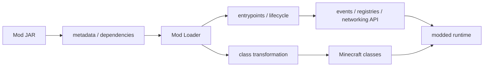
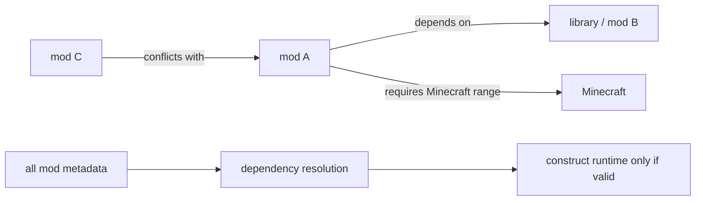
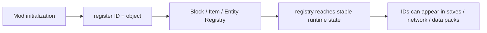
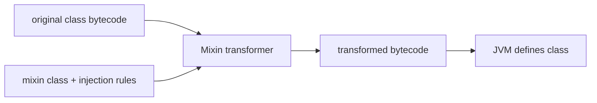
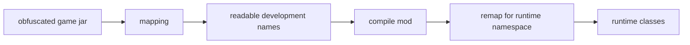
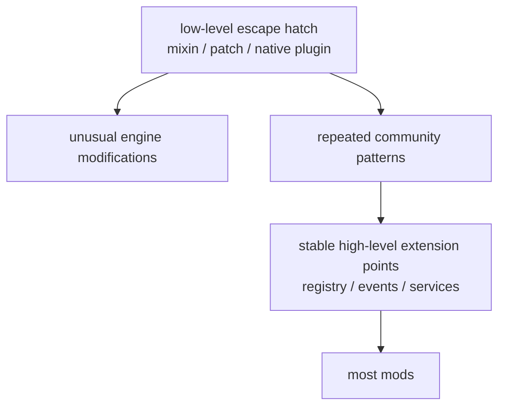

上一章[《数据包、资源包与数据驱动》](/impl/datapacks)把扩展边界停在了一个很具体的位置：Pack 可以实例化、组合和参数化引擎已经公开的语义；如果需要一种引擎从未提供的新语义，首先得有人把对应的程序实现出来。

例如，Data Pack 可以使用已有的 Recipe Type、Loot Function、Worldgen Node 或 Item Component。如果想加入一种新的 Entity 类型、一个新的 Screen、一套新的网络协议，或者修改现有方法内部的判断顺序，就必须进入代码层。

Java Edition 的 Mod 生态正是从这里开始。

它面对的基本问题不是：

> 怎样把一个 JAR 放进 mods 文件夹？

而是：

> **Minecraft 没有把完整游戏代码定义成长期稳定的官方 Mod API 时，第三方代码怎样被发现、加载，并在正确的时间注册新对象、监听事件，甚至修改原版类本身？**

这需要解决多个不同层次的问题：谁启动 Mod、依赖关系怎么检查、客户端和服务端代码怎样分开、什么时候允许向 Registry 注册对象、常见行为有没有稳定 Hook、没有 Hook 时怎样改写已有方法，以及游戏更新以后这些接点还能不能继续工作。

因此 **Mod Loader、Mod API、Mixin、Mapping 和 Build Tool 并不是同一个东西**。它们只是长期一起出现，很容易在玩家口语里被统称为“加载器”。

本章主要讨论 Java Edition 当前仍活跃的 Forge、Fabric 与 NeoForge 路线，并以 **26.x** 的工具链变化作为现代参照。一个重要背景是：从 **Java 26.1** 开始，Minecraft 正式停止对发行代码做混淆；长期围绕 Obfuscation 形成的 Mapping 工作流因此发生了显著变化。[^unobfuscated] 但版本兼容问题并没有因此消失，因为名字稳定和程序结构稳定从来不是同一件事。



## 一个 Mod 是怎样进入 Minecraft 进程的？

普通 Java Library 能被程序调用，是因为程序已经在代码里声明依赖并主动调用它。

Mod 的方向相反：Minecraft 原本并不知道某个第三方 JAR 的存在，却需要在启动时发现它、验证它、把它的代码加入运行环境，再在约定时机调用它。

这就是 Loader 最基础的职责。

### Metadata 先回答“这个 JAR 是谁”

不同生态使用的文件格式不同，但要解决的问题很相似。

Fabric 的 `fabric.mod.json` 会声明：

- Mod ID；
- Version；
- Client / Server Environment；
- Entrypoint；
- Dependencies；
- Mixins。[^fabric-metadata]

NeoForge 的 `neoforge.mods.toml` 同样保存 Mod Metadata、Loading Information 和 Dependencies。[^neoforge-modfile]

Loader 因此可以在真正执行 Mod 代码之前先建立一张依赖图：



Fabric 当前甚至显式区分 `depends`、`recommends`、`suggests`、`breaks` 与 `conflicts`。[^fabric-metadata]

这比等到某个 Class 真正被 JVM 加载时才发现：

```text
NoClassDefFoundError
```

要可靠得多。

> **Loader 首先是运行环境的装配器，才是“让 Mod 启动”的工具。**

### Entrypoint 解决“什么时候第一次调用我的代码”

一个 Mod JAR 被发现以后，还需要入口。

Fabric Loader 采用 Entrypoint 系统。Metadata 可以分别声明 Common / Client 等入口；Loader 在对应阶段创建并调用这些对象。[^fabric-loader]

NeoForge / Forge 则围绕 Mod Constructor 与 Mod Lifecycle Event 建立初始化过程：构造 Mod、注册 Handler、处理 Registry，再进入 Common / Client / Dedicated Server Setup 等阶段。[^neoforge-events] [^forge-lifecycle]

这些名字并不重要，重要的是 Loader 必须为第三方代码建立**明确的时间边界**。

注册新 Block 通常应该发生在 Registry 仍然接受新 Entry 的阶段；Client Renderer 必须只在客户端环境初始化；World 已经运行以后再试图补注册一种基础 Item Type，则可能已经太晚。

所以 Mod Lifecycle 不是仪式性的：

```text
pre-init
init
post-init
```

而是在解决：

> **哪些共享数据结构正在构建，什么时候冻结，哪些操作此刻是合法的？**

### Client、Dedicated Server 和 Common Code 必须区分

Java Edition 同一套 Mod 项目可能运行在：

- Client；
- Integrated Server；
- Dedicated Server。

但 Dedicated Server 不拥有 Renderer、Screen 或 Client Input Class。

如果 Server 启动时因为一个 Common Class 的静态初始化顺手引用了 Client-only Renderer，结果往往不是“这段功能不用”，而是 JVM 直接无法加载对应 Class。

Fabric Metadata 因此可以声明 Environment，Fabric 项目本身也支持拆分 Client / Common Source Set；NeoForge / Forge 则提供相应的 Side-specific Setup / Distribution 边界。[^fabric-project] [^forge-lifecycle]

这再次连接到前面的网络章节：

> Client / Server 不是只有 Packet 层的区别，它也决定一部分代码是否应该进入这个进程。

### Loader、API 和 Build Tool 应该分开理解

以 Fabric 为例，这三个东西尤其容易被混成一个名字：

**Fabric Loader**  
负责发现 Mod、依赖解析、Entrypoint、Class Transformation 等基础加载工作。当前官方文档明确说，Fabric Loader 官方支持的 Class Transformation 方式就是 Mixin。[^fabric-loader]

**Fabric API**  
本身是一组 Mod，提供大量 Minecraft-specific Hook，例如 Event、Networking、Rendering、Lifecycle API。Fabric 官方首页也明确把 Loader 描述为 bare minimum，而把常用游戏 API 放在单独安装的 Fabric API 中。[^fabric-home]

**Loom**  
是 Gradle Plugin，用于建立开发环境、处理 Minecraft 依赖、运行配置、Mixin 编译处理，以及旧版游戏的 Remapping。[^loom]

Forge / NeoForge 把更多能力收在同一个 Platform 体系里，因此边界看起来没有 Fabric 这么明显，但概念仍然存在：

```text
build-time tooling
≠
load-time infrastructure
≠
game-facing mod API
```

如果把它们全部理解成“Loader”，就很难解释为什么更新一次 Minecraft 时，有时只是 Build Script 要改，有时是 Loader 要更新，有时则是 Mod 源码真的需要重写。

## 为什么 Registry、Event 和 Lifecycle 比直接改类更重要？

上一章已经讲过 Minecraft Registry。

Mod 进入代码层以后，一个最常见需求就是：

> 我要让游戏真正认识一个新的 Block、Item、Entity 或其他 Type。

这并不要求每个 Mod 都自己修改原版初始化方法。

### Registry 把“新增对象”变成正式扩展路径

当前 Fabric 26.2 的开发文档仍然直接通过 Vanilla Registry API 注册新的 Block / Item / Entity；NeoForge 则在 Vanilla Registry 之上提供注册生命周期与辅助 API，例如 `DeferredRegister`。[^fabric-block] [^neoforge-registry]

这意味着一个 Mod 想加：

```text
example:copper_machine
```

正常路径不是：

> 找到 `Blocks` 类的构造流程，然后插一段 ASM。

而是：



这比直接修改初始化代码稳定得多，因为 Loader / API 已经替作者承担：

- 正确的注册时机；
- ID 冲突检查；
- Registry 生命周期；
- 某些 Client / Server 同步；
- Missing Entry / Migration 等辅助机制。

NeoForge 甚至允许 Mod 注册自己的 Data Pack Registry，并为它提供 Codec，让**Mod 新增的语义类型继续向 Data Pack 开放**。[^neoforge-registry]

所以前一章和本章不是两条互相竞争的路线。

更常见的关系反而是：

> **Mod 先扩展 Engine Primitive，Data Pack 再创建这个 Primitive 的具体内容。**

### Event 把常见修改点变成协作接口

假设十个 Mod 都想在玩家攻击 Entity 时运行额外逻辑。

最脆弱的方案是十个 Mod 都去修改同一个 Vanilla Method。

Event System 则可以由 Platform 在一个稳定 Hook 上触发：

```text
Vanilla attack path
      ↓
Platform event
      ↓
listener A
listener B
listener C
...
```

Fabric API 当前明确把 Event 定义为常见 Hook 的兼容接口，并指出使用 Event 往往可以替代 Mixin。[^fabric-events] Forge / NeoForge 也有各自的 Event Bus，覆盖 Gameplay Event 和 Mod Lifecycle Event。[^forge-events] [^neoforge-events]

Event 的价值因此不是“写法更优雅”。

它真正减少的是：

> **多个 Mod 同时修改同一个程序位置时的结构冲突。**

如果 Platform 已经提供：

```java
AttackEntityCallback.EVENT.register(...)
```

第三方 Mod 就不需要知道原版攻击方法内部第三个 `INVOKE` 指令在哪。

这会把兼容依赖从：

> Vanilla Method 的内部字节码形状

提升到：

> Platform 承诺的 Event Signature。

后者依然可能变化，但它已经是一个**有维护者、有文档、有版本迁移意图的 API**。

### Lifecycle Event 解决“顺序”而不只是“通知”

Mod 初始化有很多必须排序的行为。

例如：

1. 注册 Entry；
2. Registry Freeze；
3. 建立跨 Mod 引用；
4. 注册 Client Renderer；
5. 开始加载 World。

如果不同 Mod 各自在任意 Class Static Initializer 中执行这些事情，很容易形成隐式初始化顺序。

Forge / NeoForge 的 Mod Event Bus 因此把 Registration、Common Setup、Sided Setup、InterMod Communication 等放进生命周期阶段。部分 Setup Event 甚至允许并行分发，再通过 `enqueueWork` 把需要主线程执行的任务排回正确位置。[^forge-lifecycle] [^neoforge-events]

这和第 04 章 Tick / Scheduler 的问题非常相似：

> **扩展系统也需要一个显式的“什么时候可以做什么”的时间模型。**

<Callout type="info" title="稳定 Hook 的价值高于“能 Hook”">
只要能改字节码，理论上很多地方都能插代码。但一个 Platform 真正有价值的工作，是把高频需求收成 Registry、Event、Lifecycle、Networking 等受管理的扩展点，让 Mod 不必每次重新猜原版内部结构。
</Callout>

## 没有现成 Hook 时，Mixin 到底做了什么？

Registry 和 Event 只能覆盖 Platform 已经预见到的扩展需求。

如果 Mod 想改变某个 Vanilla Method 的条件判断、一个方法调用前后的数据、某个 Return Value，或者一段没有 Event 的内部流程，就需要更低层的能力。在今天的 Java Mod 生态里，**Mixin** 是最重要的这类工具之一。

### Mixin 不是“继承 Minecraft Class”

名字很容易让人想到面向对象里的 Mixin / Trait。

SpongePowered Mixin 实际工作的核心却是 **Class Transformation**：它读取目标 Class 的 Bytecode，通过 ASM 建立指令树，再把 Mixin 描述的字段、方法和注入代码织入目标 Class，最后让 JVM 定义变换后的版本。[^mixin-home] [^mixin-environment]



所以 Mixin 生效的关键时机通常在目标 Class 真正完成加载之前。一旦 JVM 已经把普通 Class 定义完成，再想任意改变其字段和方法结构，就不是同一套简单流程了。

这也是为什么 Mod Loader 与 Class Loading 会紧密相连：Loader 必须让 Transformer 在正确时间看到那些 Class。

### Injection Point 是对方法字节码的查询

最常见的注入并不是“把代码插到第 37 行”。

Java Source 编译以后已经没有可靠的源代码行结构，Mixin 面对的是 JVM Instruction。因此它使用类似：

- `HEAD`
- `RETURN`
- `TAIL`
- `INVOKE`
- `FIELD`
- `NEW`
- `CONSTANT`

这样的 Injection Point 去查询目标方法的 Instruction List。[^mixin-points]

例如，`HEAD` 表示方法入口；`INVOKE` 则寻找某个方法调用指令。Mixin 官方文档甚至直接把 Injection Point 定义成“对方法字节码运行的查询”。[^mixin-callback]

这比整类覆盖精确得多：一个 Mod 可以只在一个小位置插入逻辑，而不需要复制原方法剩余实现。

### 越精确的注入，往往越依赖内部结构

精确也带来另一面。

假设 Vanilla 原本是：

```text
validate()
→ consumeItem()
→ playSound()
→ return
```

某个 Mixin 针对第二个方法调用。

下一版 Mojang 重构成：

```text
validate()
→ result = performInteraction()
→ return result
```

Gameplay 语义也许几乎没变，但原来的目标 Invocation 已经消失。

于是 Mixin 可能无法找到 Injection Point、命中数量改变、Local Variable 不再存在，或者 Method Descriptor 已经不同。更隐蔽的情况是：Mixin 仍然成功应用，却落在了语义不同的位置。

所以 Mixin Compatibility 不能只靠“Class 还叫同一个名字”。

> **Injection Target 实际依赖的是目标方法的结构。**

`HEAD`、`RETURN` 这类位置通常比“第 N 个相同调用”更少依赖内部细节；面向公开 Event / API 又通常比面向 Vanilla Method Interior 更稳定。但稳定性没有绝对排序，仍取决于 Mojang、Loader 和 Mod 自己怎样演化。

### 不同注入方式的侵入程度不同

Mixin 可以做的不只是在方法入口追加 Callback。

它还可以修改参数、局部变量、常量，重定向某次调用，暴露原本不可访问的成员，甚至覆盖整个方法。不同方式对 Vanilla 结构的依赖程度不同：

| 方式 | 大致做什么 | 常见兼容风险 |
| --- | --- | --- |
| Callback Inject | 在已有流程某点追加 / 取消逻辑 | 依赖 Injection Point |
| ModifyArg / ModifyVariable | 改调用参数或局部值 | 依赖 Method / Local 结构 |
| Redirect | 把某个调用换成另一实现 | 对目标调用结构依赖较强 |
| Overwrite | 用 Mod Method 替换原 Method | 很难与其他修改同一方法的 Mod 组合 |
| Accessor / Invoker | 暴露原本不可访问的字段 / 方法 | 依赖成员仍存在 |
| Interface / Method merge | 向目标 Class 增加接口或成员 | 依赖类型结构与命名兼容 |

Mixin 文档本身也专门讨论 Method Signature Conflict、Overwrite 与 Injection。[^mixin-home]

因此“使用了 Mixin”并不能直接判断一个 Mod 兼容性好不好。更有意义的问题是：

> **它依赖目标 Class 的哪一层结构？有没有更高层 Event / API 可以表达同一需求？**

### 多个 Mixin 可以共存，但不能自动消除语义冲突

Mixin 相比早期直接覆盖整个 Class，一个巨大优势就是多个变换可以应用到同一个目标类。

但这并不意味着冲突消失了。

两个 Mod 可能都取消同一条逻辑路径、重定向同一个 Invocation、修改同一个 Constant，或者都假设自己是唯一改变 Return Value 的一方。即使 Bytecode Transformer 能把两份修改都成功织进去，Gameplay Semantic 仍可能冲突。

```text
Can both transformations apply?
        ↓
Do the combined semantics still make sense?
```

第一层是工具问题；第二层是程序组合问题。

Event API 能缓解第一层，也能通过明确 Priority / Result Contract 改善第二层，但只要多个作者可以改变同一个因果路径，就无法靠 Loader 自动证明所有组合都正确。

## Mapping 为什么曾经如此重要，而今天又发生了什么变化？

Mixin 要指向 Class、Method 和 Field。

过去 Java Edition 的发行 JAR 长期经过 Obfuscation，运行时看到的名字可能是：

```text
a
brc
m_12345_
```

而不是：

```text
Creeper
Level
tick
```

这让 Mod Toolchain 还必须解决一个额外问题：

> **开发者写代码时使用什么名字，发布后的 JAR 又怎样找到真正的目标？**

### Mapping 的第一份工作只是“给东西起可读名字”

历史上 Fabric 生态常见三层名称：[^fabric-mappings]

- Obfuscated Name：游戏发行物里的名字；
- Intermediary：跨版本尽量稳定的中间名；
- Yarn：面向开发者的社区可读名。

2019 年 Mojang 又开始提供官方 Obfuscation Mapping，很多工具链开始支持 Mojang Names。NeoForge 后来也全面采用 Mojang Mapping 体系。[^fabric-mappings]

于是开发过程长期包含：



Loom、ForgeGradle 等 Build Tool 很大一部分历史复杂性都来自这里。

### 26.1 之后，“认名字”这笔税大幅下降

Mojang 在 2025 年宣布移除 Java Edition Obfuscation，并从 26.1 开始正式发布不再混淆的游戏可执行代码。官方说明明确提到，未来 Build 会保留 Class、Method、Field、Variable 等原始技术名称。[^unobfuscated]

Fabric 随之停止为 26.1+ 继续维护旧式 Yarn / Intermediary 工作流作为默认方案；当前迁移文档也明确要求 26.1+ 转向 Mojang Names，并提醒 Mixin 迁移仍需人工检查。[^fabric-mappings]

这是 Java Modding 很实质的一次变化。

过去：

> 一个方法名字变了

有时只是 Obfuscation Name 变了，Mapping 能把它重新对应回来。

现在这层噪声少了很多。

但：

> 一个方法被拆成两个方法、参数改了、调用顺序变了

仍然是**真实代码结构变化**。

所以：

```text
obfuscation removed
≠
stable mod API created
```

官方名字更透明，只意味着 Modder 更容易理解和定位代码，不意味着 Mojang 承诺这些 Class / Method 在下一版保持 Binary 或 Source Compatibility。

### Mapping 消失以后，版本适配反而更容易看清本质

Fabric 当前文档特别提醒：自动迁移 Mapping 的结果仍然必须人工审核，尤其是 Mixin。[^fabric-mappings]

原因很直观。

工具可以帮助把：

```text
CreeperEntity
→ Creeper
```

这种名字变化迁移过去。

它无法替作者决定：

> 原来注入的逻辑，在 Mojang 新的 Method Split 之后应该放在哪个阶段？

因此 Mod Porting 最核心的工作一直不是“把红色的类名改绿”。

真正困难的是：

- Vanilla Semantic 是否变了；
- Lifecycle 是否变了；
- Registry 是否换模型；
- Networking 是否重写；
- Renderer 是否换 Pipeline；
- 原来的 Hook 现在应该落在哪。

移除 Obfuscation 让工具链更简单，也让这件事更明显：

> **版本迁移的核心是理解变化后的程序，而不只是恢复名字。**

## Forge、Fabric 与 NeoForge 到底在选择什么？

如果只从玩家安装界面看，它们都像：

> 选一个 Loader，然后把 Mod 放进去。

从开发者角度，它们更像是不同的**扩展平台设计**。

差别不只是“谁支持的 Mod 更多”，而是平台替 Mod 作者预先提供多少公共设施、鼓励怎样的 Hook 风格、怎样组织 Lifecycle 和 Registry，以及哪些问题留给 Mod 自己解决。

### Fabric 倾向把 Loader 和 API 拆开

Fabric 官方长期强调 Loader 本身保持较小，只承担：

- Mod Discovery；
- Dependency Resolution；
- Entrypoint；
- Class Loading / Transformation；
- Environment / Metadata。

Minecraft-specific 的 Event、Networking、Renderer Hook 等则主要放进独立的 Fabric API。[^fabric-home] [^fabric-loader]

这让架构上形成：

```text
Fabric Loader
+
Fabric API
+
Mixin
+
Vanilla Registry / game code
```

的组合。

Mod 可以只依赖 Loader 和 Mixin，也可以依赖 Fabric API 提供的高层 Hook。

这种拆分的好处是：平台核心职责比较清楚，高层 API 可以独立演化；代价则是 Mod 需要更明确地知道自己依赖的是 Loader、API 还是某个第三方 Library。

### Forge / NeoForge 更倾向提供更完整的平台层

Forge 与 NeoForge 则把更多 Mod-facing Infrastructure 放在平台体系中，例如：

- Event Bus；
- Registry Helper；
- Lifecycle Event；
- Capability / Attachment 一类扩展机制；
- Networking Helper；
- Data Generation Support；
- Config / Dist 辅助设施。

NeoForge 当前文档仍然把 Mod Lifecycle、Event Bus、Registry 和 Data-driven Extension 作为平台的一等组成部分。[^neoforge-events] [^neoforge-registry]

这减少了很多 Mod 重复造基础设施的需要，也更容易形成统一约定。

代价是 Platform 本身需要承担更大的 Compatibility Surface：当 Minecraft 底层结构变化时，平台维护者不仅要让 Loader 启动，还要让这些高层 API 继续工作。

### “薄”和“厚”不是优劣排序

很容易把它们写成：

```text
Fabric = lightweight
Forge/NeoForge = heavyweight
```

然后把形容词偷偷当成评价。

这种比较意义不大。

真正的设计问题是：

> **多少公共行为应该由平台统一抽象，多少应该直接暴露 Vanilla 结构给 Mod 作者？**

统一得更多：

- 跨 Mod 协作更容易形成约定；
- 常见功能不必自己找 Hook；
- 平台升级责任更重。

统一得更少：

- 更贴近 Vanilla；
- Mod 可以更自由地选择工具；
- 不同 Mod 更容易形成自己的小生态和重复方案。

两边都能做大型 Mod，也都可以写很小的 Utility Mod。具体项目选择哪条路线，通常还会受到版本、生态依赖和已有代码库影响，而不只是抽象哲学。

### NeoForge 的分叉说明“平台 API 自己也会演化”

NeoForge 在 2023 年从 Forge 社区分出，之后逐渐形成独立平台与命名空间。这个事件本身不需要写成社区史，但它很适合提醒一个工程事实：

> **Mod Platform 也不是永恒稳定的第三方标准。**

一个 Mod 的依赖链可能是：

```text
Minecraft version
→ loader / platform
→ shared libraries
→ other mods
→ your mod
```

任何一层分叉或弃用，都会改变上层的维护选择。

所以平台 API 虽然比直接 Mixin Vanilla Interior 稳定，仍然不是“官方十年 ABI”。

## 为什么 Mod 升级通常比普通 Library 升级更贵？

一个普通 Java Library 如果遵循 Semantic Versioning，升级成本通常主要来自它公开 API 的变化。

Minecraft Mod 则同时依赖多个边界：

- Minecraft 本体结构；
- Loader / Platform；
- Mapping / Names；
- Mixin Target；
- Registry / Data Schema；
- Networking；
- Client / Server Side；
- 其他 Mod 的 Integration API。

因此兼容问题天然是多维的。

### 版本兼容不是一条线，而更像一张矩阵

一个 Mod Release 往往只声明支持有限的：

```text
Minecraft version
×
Loader / Platform
×
Java runtime
×
Dependency versions
```

某些内容 Mod 还会再乘：

```text
optional integration mods
```

所以作者需要决定：

- 同时维护多少 Minecraft 大版本；
- 是否支持多个 Loader；
- 是否共享一份 Common Code；
- 是否为旧存档继续保留 Data Migration；
- 哪些 Integration 值得长期维护。

这并不是“Mod 作者效率低”。

是因为 Mod 的运行环境本身就不是由 Mod 作者单独控制。

### “同一个功能”跨 Loader 也未必只是换 API 名

有些 Mod 可以把核心 Gameplay Logic 放进纯 Java Common Module，再分别写 Fabric / NeoForge Adapter。

但一旦功能依赖：

- Loader-specific Event；
- Registry Lifecycle；
- Network Channel；
- Attachment / Capability；
- Rendering Hook；
- Mixin 特定目标；

差异就可能进入架构层，而不只是：

```text
FabricEvent.register(...)
→ NeoForgeEventBus.addListener(...)
```

因此跨 Loader Framework 的项目常常会引入：

- Common Abstraction；
- Loader-specific Source Set；
- Conditional Compilation / Build Logic；
- Architectury 一类中间层；
- 或干脆维护两个独立实现。

中间层能减少重复代码，也会增加另一层依赖和抽象成本。

### 兼容性不仅是“能不能启动”

两个 Mod 都能成功加载，不代表它们真的兼容。

更完整的 Compatibility 至少包括：

1. **Binary / Class Compatibility**  
   Class 能否加载、Method 是否存在。

2. **Transformation Compatibility**  
   Mixin / Transformer 能否同时应用。

3. **Data Compatibility**  
   Registry ID、Save Data、Components、Config 是否还能读取。

4. **Semantic Compatibility**  
   两个 Mod 修改后的规则组合起来是否仍然合理。

5. **Network Compatibility**  
   Client / Server 是否拥有相同所需 Mod、Packet / Registry 是否一致。

最后一层尤其容易被玩家看到。

客户端只有某个 Cosmetic Mod，可能仍然能进入 Vanilla Server；如果双方的 Block Registry、Entity Type 或自定义 Packet 不一致，连接阶段就需要拒绝或协商。

所以“Mod 能不能只装客户端”不是按 Mod 名字判断，而取决于它修改了哪一层语义。

### Public API 能降低迁移成本，但不能消除底层变化

Loader / Platform 最重要的长期价值之一，就是尽量把 Mod 从 Vanilla Internal Change 隔开。

例如：

```text
Vanilla method changes
      ↓
platform updates its hook
      ↓
Event signature stays compatible
      ↓
many mods need no source change
```

这是标准 Adapter Layer 的收益。

但只要 Vanilla 的真实语义变得足够大，Platform 也不可能永远维持原抽象。

假设 Mojang 把：

- Item 数据模型完全重写；
- Renderer Pipeline 改成另一套 Render State；
- Networking Phase 增删；
- Registry Lifecycle 重新组织；

Platform 要么暴露新模型，要么长期模拟旧模型。

后者短期保护 Mod，长期则可能积累自己的兼容债。

这和第 18 章将讨论的产品技术债是同一种问题，只是维护者从 Mojang 换成了 Mod Platform 团队。

## 如果自己设计可扩展引擎，Mod API 应该停在哪里？

Minecraft Java 的生态很特别，因为大量扩展能力是在没有完整官方 Mod API 的前提下，由社区一点点建立出来的。

这不意味着一个新引擎也应该先封闭，再等社区发明 Mixin。

更有价值的问题是：

> **哪些扩展需求已经足够稳定，值得变成受管理 API；哪些需求太开放，仍然需要低层 Escape Hatch？**

### 高频扩展点应该尽量上移

如果大量 Mod 都在同一个位置做相似操作，通常说明那里已经形成事实上的扩展需求。

例如：

- 注册 Block / Item / Entity；
- 监听 Player Join / Damage / Interaction；
- 增加 Command；
- 增加自定义 Data-driven Type；
- 发送自定义 Network Message；
- 注册 Renderer / UI Extension；
- 保存 Mod-specific Persistent Data。

如果每一个 Mod 都为这些需求自己找 Bytecode Injection Point，生态会反复支付同一种兼容成本。

更好的平台通常会把它们上移成：

```text
registry
event
callback
service
extension interface
lifecycle hook
```

这不会让所有 Mod 永远兼容，但至少把依赖从“某个 Method 内部第几条指令”提升到一个明确声明的扩展合同。

### API 不能提前抽象所有未来需求

反过来，试图在第一版就设计出：

> 可以覆盖未来所有 Mod 的完整 API

也不现实。

Mod 的价值恰恰在于作者会尝试引擎设计者没有预见的东西：

- 改 Terrain Renderer；
- 替换 Lighting Algorithm；
- 重写 Inventory Model；
- 改 Tick Scheduler；
- 做全新的 Physics；
- 改 World Storage；
- 接入外部工具或语言运行时。

如果 Platform 只允许“官方想得到的 Hook”，那么越创新的 Mod 反而越做不了。

因此成熟扩展系统往往需要两层：



低层能力承担实验性，高层 API 承担重复性。

Minecraft Java 的历史恰好展示了这个循环：社区先通过 Coremod / ASM / Mixin 修改内部代码；某些高频需求成熟以后，Loader / Platform 再把它们收成 Registry、Event、Networking API。

### Escape Hatch 越强，冲突责任越难由平台承担

允许任意 Patch 的好处是能力上限很高。

代价是平台很难保证：

> 任意两个 Patch 都能组合。

这不是 Minecraft 独有问题。

任何允许：

- Monkey Patch；
- Runtime Swizzle；
- Method Detour；
- Harmony Patch；
- Bytecode Rewrite；

的扩展系统都会遇到相似边界。

越接近任意代码修改，越无法把 Compatibility 完全变成静态类型检查。

所以如果自研引擎提供低层 Hook，需要明确：

- 注入目标有没有 Stable ID；
- Hook 顺序怎么决定；
- 能否声明 Before / After；
- 是否允许取消原逻辑；
- 多个 Replacement 冲突时怎么办；
- 错误能否在启动阶段暴露；
- Crash Report 能否显示哪些 Patch 改过这个位置。

Mixin 的 `require`、Priority、Injection Point、Conflict 检查等机制，本质上都在尝试给“改别人代码”增加一点可诊断结构。[^mixin-home]

### Stable API 的成本是真实存在的

一旦宣布：

> 这个 API 是我们支持的 Mod Extension Point。

引擎团队就开始承担兼容责任。

删除一个 Event、改变一个 Registry Lifecycle、修改一个 Network Hook，都不再只是内部重构。

因此 API 稳定性和内部迭代速度确实存在张力。

但这不意味着：

> 不提供 API 就没有成本。

成本只会转移到：

- 社区 Mapping；
- Mixin Porting；
- Loader Maintainer；
- Mod Author；
- Modpack Integrator；
- 玩家版本锁定。

Minecraft Java 很适合观察这种成本转移，因为同一个生态里同时存在：

- Mojang 的内部代码；
- Loader / Platform 的半稳定 API；
- Mixin 的低层结构依赖；
- Data Pack 的数据 Schema；
- Mod 之间自己的 Integration API。

每一层都在决定：

> **谁负责吸收下一次变化？**

### Mod 与 Plugin 的边界应该留给下一章

本章只讨论进入 **Minecraft Java 程序本身** 的扩展路径。

Bukkit / Spigot / Paper Plugin 虽然也是 Java JAR，也有 Event、Lifecycle 和 API，但它们的部署合同不同：目标是尽量只修改 Server Software，让原版客户端仍能连接。

这使它们面临的问题从：

> 怎样把新语义装进 Client + Server Runtime？

更多转向：

> 怎样把一台长期公共服务器变成可运营、可观察、可治理的平台？

因此 Bukkit / Paper / Proxy、Backup、Moderation、Anti-cheat 和大型 Multi-server Network 会统一放到下一章[《插件、服务端软件与规模化》](/impl/servers)。

## 这一章留下什么

Data Pack 能组合引擎已经公开的语义，Mod 则进一步进入定义这些语义的程序层。为了做到这一点，Java Mod 生态逐渐建立出一整套不同职责的基础设施：Loader 发现 Mod、解析依赖并建立 Entrypoint；Lifecycle 规定什么时候可以初始化；Registry 让新增对象走受管理路径；Event 把高频修改点变成协作接口；Mixin 则在缺少高层 Hook 时直接变换目标 Class 的 Bytecode。

Mixin 的能力很强，但它依赖的不只是 Class 名字，而是目标 Method 的真实结构。Injection Point、Method Descriptor、Local Variable 和调用顺序都可能成为事实上的依赖。因此 26.1 移除 Obfuscation 是非常重要的改善，却没有突然制造出一个稳定 Mod ABI：Mapping 主要解决“这些代码叫什么”，版本适配仍然必须回答“这些代码现在怎样工作”。

Forge、Fabric 和 NeoForge 的区别也更适合从平台职责理解，而不是简单排成轻量 / 重量排名。Fabric 把 Loader 和大量 Minecraft-specific API 明确拆开；Forge / NeoForge 则在平台体系里提供更多共同基础设施。一个选择让平台抽象更少，一个选择让平台承担更多共同约定；两者最终都要面对 Vanilla 不断变化和 Mod 彼此组合的现实。

版本兼容因此也不是一条“支持 Minecraft 1.x”的直线。一个 Mod 同时依赖游戏版本、Loader、Java Runtime、Data Schema、Mixin Target、其他 Mod API 和 Client / Server Environment。稳定的 Platform API 可以替很多 Mod 吸收底层变化，但它不可能永远模拟所有旧结构；直接 Mixin 则拥有更大的自由，同时把更多适配责任交给 Mod 作者。

**对爱好者来说**，一个 Mod 大版本后暂时不能启动，原因经常不是“作者还没改版本号”，而是它依赖的 Registry、Renderer、Network、Method 或注入位置真的已经变化。Loader 能把很多共同问题解决掉，却不能自动证明任意两个 Mod 的行为都能组合。

**对开发者来说**，值得带走的是两层扩展面：把重复、高频需求提升成 Registry、Event、Lifecycle 和 Service API，同时保留一个明确标注风险的低层 Escape Hatch 给真正无法预见的修改。能抄走的是这种分层；不能照抄的是 Minecraft 十多年里形成的具体 Mapping、Mixin Target、Loader 分叉和版本矩阵——它们更多是这套生态历史演化的结果。

下一章会把视角留在 Server 一侧：当目标不再是给游戏加入客户端也必须理解的新语义，而是运营一个长期公共世界时，Bukkit、Spigot、Paper、Proxy、Plugin API、Backup、Moderation 与 Observability 又为什么形成了另一套扩展栈。

[^unobfuscated]: Mojang Studios，《Removing obfuscation in Java Edition》，2025-10-29。Mojang 宣布在 Mounts of Mayhem 之后的首个 Snapshot 起停止混淆 Java Edition，并保留 Class、Method、Field、Variable 等原始技术名称；26.1 正式版技术变更确认游戏可执行代码不再混淆。见 https://www.minecraft.net/en-us/article/removing-obfuscation-in-java-edition 与 https://www.minecraft.net/en-us/article/minecraft-java-edition-26-1

[^fabric-metadata]: Fabric Documentation，《Creating a Project / fabric.mod.json》与 Fabric Wiki Metadata Specification。Metadata 声明 Mod ID、Version、Environment、Entrypoints、Mixins 与 Dependency 条件；当前依赖键包括 `depends`、`recommends`、`suggests`、`breaks`、`conflicts`。见 https://docs.fabricmc.net/develop/getting-started/creating-a-project 与 https://wiki.fabricmc.net/documentation:fabric_mod_json_spec

[^neoforge-modfile]: NeoForge Documentation，《Mod Files》。NeoForge Mod JAR 通过 `META-INF/neoforge.mods.toml` 描述 Mod Metadata、Dependencies 与 Loading Information。见 https://docs.neoforged.net/docs/gettingstarted/modfiles/

[^fabric-loader]: Fabric Documentation，《Fabric Loader》。Fabric Loader 负责 Mod Loading、Entrypoints、Class Loading / Transformation 等基础设施；官方文档说明 Loader 支持的 Class Transformation 方法为 Mixin。见 https://docs.fabricmc.net/develop/ 与 https://fabricmc.net/wiki/documentation:fabric_loader

[^fabric-project]: Fabric Documentation，《Project Structure》。Fabric 项目可以拆分 Common / Client Source Set，并使用 Environment / Entrypoint 约束 Client-only Code。见 https://docs.fabricmc.net/develop/getting-started/project-structure

[^fabric-home]: Fabric 官方首页将 Fabric Loader 描述为最小化的 Mod Loader，并把常见 Minecraft-specific Hook 放在独立的 Fabric API 中。见 https://fabricmc.net/

[^loom]: Fabric Documentation，《Fabric Loom》。Loom 是 Gradle Plugin，负责建立 Minecraft 开发环境、运行配置、Mixin Tooling 与旧版 Remapping；26.1+ 无混淆版本使用新的 Loom 路线。见 https://docs.fabricmc.net/develop/loom/

[^fabric-block]: Fabric Documentation，《Creating Your First Block》。当前 Fabric 开发仍直接向 Minecraft Registry 注册新的 Block / Item，再由 Fabric API 提供更多生命周期与事件辅助。见 https://docs.fabricmc.net/develop/blocks/first-block

[^neoforge-registry]: NeoForge Documentation，《Registries》。NeoForge 提供 `DeferredRegister` 等 Registry Helper，也允许 Mod 定义自己的 Registry 与 Data Pack Registry。见 https://docs.neoforged.net/docs/concepts/registries/

[^fabric-events]: Fabric Documentation，《Events》。Fabric API Event 为常见 Hook 提供 Callback 接口，官方文档明确指出 Event 常常可以替代 Mixin。见 https://docs.fabricmc.net/develop/events

[^forge-events]: MinecraftForge Documentation，《Events》。Forge Event Bus 提供 Gameplay Event 与 Mod Event 分发。见 https://docs.minecraftforge.net/en/latest/concepts/events/

[^forge-lifecycle]: MinecraftForge Documentation，《Mod Lifecycle》。Forge 在 Mod Loading 中提供 Common Setup、Client Setup、Dedicated Server Setup、InterMod Communication 等生命周期阶段。见 https://docs.minecraftforge.net/en/latest/concepts/lifecycle/

[^neoforge-events]: NeoForge Documentation，《Events / Mod Lifecycle》。NeoForge 区分 Game Event Bus 与 Mod Event Bus，并通过 Lifecycle Event 处理注册和 Setup。见 https://docs.neoforged.net/docs/concepts/events/ 与 https://docs.neoforged.net/docs/gettingstarted/modfiles/

[^mixin-home]: SpongePowered，《Mixin Wiki》。Mixin 基于 ASM 对目标 Class Bytecode 进行变换，并提供 Injection、Overwrite、Accessor / Invoker 等能力及冲突处理机制。见 https://github.com/SpongePowered/Mixin/wiki

[^mixin-environment]: SpongePowered Mixin Javadoc / Wiki，《Introduction to Mixins》。Mixin Transformation 在目标 Class 被 JVM 定义前应用到 Class Node。见 https://github.com/SpongePowered/Mixin/wiki/Introduction-to-Mixins---Understanding-Mixin-Architecture

[^mixin-points]: SpongePowered Mixin Wiki，《Injection Point Reference》。Injection Point 用于查询目标 Method 的 JVM Instruction，包括 HEAD、RETURN、INVOKE、FIELD、NEW、CONSTANT 等。见 https://github.com/SpongePowered/Mixin/wiki/Injection-Point-Reference

[^mixin-callback]: SpongePowered Mixin Wiki，《Advanced Mixin Usage - Callback Injectors》。Callback Injector 根据 Method 与 Injection Point 在目标 Bytecode 中定位并插入 Handler 调用。见 https://github.com/SpongePowered/Mixin/wiki/Advanced-Mixin-Usage---Callback-Injectors

[^fabric-mappings]: Fabric Documentation，《Migrating Mappings》。文档回顾 Obfuscated、Intermediary、Yarn、Mojang Mapping，并说明 Minecraft 26.1 已无混淆、迁移仍需人工检查，尤其是 Mixins。见 https://docs.fabricmc.net/develop/porting/mappings/
