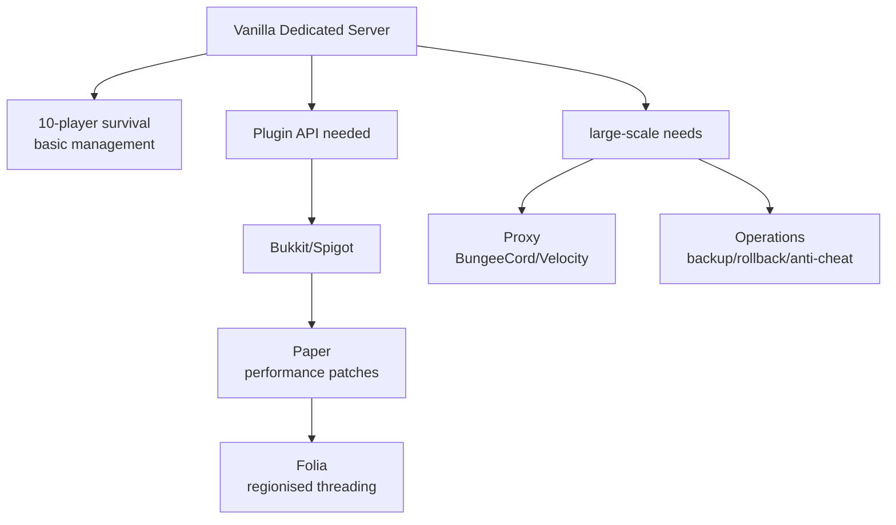
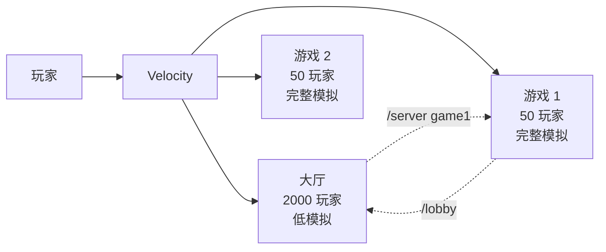

十个人的生存服和一千人的服务器网络，用的可能是同一份 `server.jar`。但它们面对的问题已经完全不同。

十个人的服务器，原版 Dedicated Server 通常够用：世界保存在一个文件夹里，玩家彼此认识，op 权限可以手动管理，偶尔卡顿可以重启，备份只需要定时复制存档目录。

一千人的网络则必须解决：怎样把大厅、生存、小游戏分到不同进程却让玩家以为自己仍在同一个服务器？怎样在不停服的情况下回滚某个区域的破坏？怎样检测并阻止飞行、透视、自动挖矿？怎样让 Simulation Distance 缩到 4 Chunks 以后服务器仍然不在每 Tick 超过 50 毫秒？怎样让插件作者可以增加自定义命令、经济系统和领地保护，却不必重新编译服务器？

这些问题，原版 Dedicated Server 几乎都没有直接提供答案。

因此上一章[《Mod、Mixin 与加载器》](/impl/mod-architecture)讲的客户端 Mod 生态之外，Java Edition 还形成了另一条扩展路径：**服务端软件与 Plugin API**。它们的目标不是让客户端也安装新内容，而是只修改服务器规则、增加运营工具，让原版客户端仍然可以连接。

本章要回答的核心问题是：

> **当 Minecraft 从几个人一起玩变成长期公共服务器或大型网络，哪些职责已经超出原版 Dedicated Server？服务端软件、Plugin API、Proxy 和运维工具又分别在解决什么问题？**

我们会看到，这不只是"安装一个加速包"。Paper 等服务端软件通过修改 Tick 调度来优化性能，代价是某些 Vanilla 行为会改变；Proxy 把多个服务器进程焊成统一入口，让玩家可以在大厅和游戏服之间传送；备份、回滚、反作弊和监控工具则构成完整的运维栈。大型服务器的真实引擎，早已不是单个 `server.jar`，而是这一整套基础设施。

本文主要以 **Java Edition 26.3** 为当前参照。历史节点会在相关小节标注，例如 Bukkit 的 2014 年许可危机、Paper 2024 年从 Spigot 的硬分叉，以及 1.20.5 新增的 Transfer Packet 与 Cookie。



## 原版 Dedicated Server 能做什么、不能做什么？

在讨论 Bukkit、Paper 和 Proxy 之前，先建立一个清楚的基线：原版专用服务端到底提供了哪些能力，又把哪些问题留给了运营者？

### Dedicated Server 的基本职责

Java Edition 的 `server.jar` 自 2010 年 Alpha 多人测试开始提供，最初叫 `minecraft_server`；它的核心职责从那时到现在都很稳定：[^dedicated-server]

- 运行服务器端的世界 Tick；
- 管理玩家连接；
- 保存世界到磁盘；
- 处理基础命令；
- 通过 `server.properties` 提供配置入口。

第 10 章[《网络架构与状态同步》](/impl/networking)已经解释过，1.3.1 之后单人游戏也在内部运行 `IntegratedServer`，让 Singleplayer 和 Multiplayer 共享同一套世界模拟代码。Dedicated Server 则是独立进程、无本地客户端、接受远程连接的版本。

### 原版提供的管理能力

`server.properties` 和内置命令提供了一些基础管理工具：

**权限管理**  
- `op` 给予管理员权限；
- `whitelist` 限制谁可以进入；
- `ban` / `ban-ip` 封禁玩家。

**世界配置**  
- `gamemode`、`difficulty`；
- `view-distance`、`simulation-distance`（后者在 1.18 前后才从视距中独立出来）；[^simulation-distance]
- `spawn-protection` 限制出生点附近的修改。

**基础运维**  
- `/save-all` 保存世界；
- `/stop` 停服；
- `/list` 查看在线玩家。

这些能力对小型服务器够用，但它们仍然很粗。

### 原版不提供什么

一旦服务器规模扩大，或者运营者想提供更丰富的玩法，就会发现原版缺少：

**细粒度权限**  
`op` 是全或无；没有"允许使用传送但不能修改游戏规则"这种中间状态。

**备份与回滚**  
原版只能 `/save-all`，不能"回到昨天 15:00 的状态"或"撤销某个玩家破坏的建筑"。

**领地保护**  
玩家无法声明"这块区域只有我能修改"。

**反作弊**  
客户端可以作弊（飞行、透视、加速），服务器只能依赖有限的移动验证。

**经济系统**  
没有货币、商店或交易框架。

**自定义命令**  
想增加 `/home`、`/tpa` 这类命令，必须修改服务器代码。

**跨服传送**  
原版假设一个服务器 = 一个世界；没有"传送到另一个服务器进程"的能力（直到 1.20.5 新增 Transfer Packet）。[^transfer-packet]

**性能监控**  
没有内置的 Profiler、TPS 监控、Entity 统计或 Chunk 分析工具。

**数据持久化扩展**  
Plugin 想保存自己的数据（例如玩家的家坐标、经济余额），没有官方 API。

### 为什么原版选择"最小可用"？

这不是 Mojang 偷懒或"功能不完整"。

原版 Dedicated Server 的职责定位很明确：

> **提供一个能够运行 Minecraft 世界、让玩家连接的服务器，但不预设具体的服务器类型（生存 / 创造 / 小游戏）和治理模型。**

把权限、经济、领地、反作弊做成内置功能，意味着 Mojang 必须为所有服务器决定"什么是合理的治理方式"。但一个十人白名单生存服和一个千人小游戏网络需要的治理完全不同。

因此更合理的边界是：

- 原版提供**可以运行的服务器**；
- 运营者根据自己的需求选择**扩展工具**。

这个边界也和卷一第 05 章[《服务器即新游戏》](/history/servers)讨论的服务器文化一致：服务器运营者本身就是游戏规则的设计者，他们需要的是扩展面，而不是一套固定的治理方案。

## Bukkit / Spigot / Paper：为什么服务端需要自己的扩展栈？

当原版 Dedicated Server 不够用时，社区开始建立自己的服务端软件。这条路径和上一章讲的客户端 Mod 有一个根本区别：

> **Plugin 的目标是只修改服务端规则，让原版客户端仍然可以连接。**

### Bukkit：Plugin API 的起点（~2010）

Bukkit 项目大约在 2010 年前后出现，目标是为 Minecraft 服务端提供稳定的 Plugin API。[^bukkit-history]

它解决的核心问题是：

> 服务器运营者想扩展服务器功能（增加命令、修改规则、管理玩家），但不想让玩家也安装 Mod。

Bukkit 提供了：

**Plugin 加载系统**  
- `plugin.yml` 声明 Plugin 元数据；
- 依赖关系检查；
- 生命周期管理（`onEnable` / `onDisable`）。

**Event System**  
- `PlayerJoinEvent`、`BlockBreakEvent`、`EntityDamageEvent` 等；
- Priority 与 Cancellation 机制，让多个 Plugin 可以监听同一事件。

**Command API**  
- 注册自定义命令；
- Tab Completion。

**Scheduler API**  
- 同步 / 异步任务；
- 延迟与重复执行。

这些能力让 Plugin 作者可以在不修改服务器源码的情况下增加功能。

Bukkit API 本身只定义接口；CraftBukkit 则是实现，它基于反编译的 Minecraft 服务器代码，把 Bukkit API 连接到真实的游戏逻辑。

### 2014 年的许可危机与 Spigot

2012 年 2 月，Mojang 雇佣了几位 Bukkit 核心开发者，Bukkit 项目本身也转由 Mojang 管理。[^bukkit-mojang]

但 2014 年 9 月，前 Bukkit 开发者 Wesley Wolfe (Wolvereness) 对 CraftBukkit 发起 DMCA 下架请求，声称自己贡献的代码被未经授权使用。CraftBukkit 的主要分发渠道因此被迫下线。[^bukkit-dmca]

这次危机的技术后果是：社区需要一个不依赖 Bukkit 官方分发的替代方案。

**Spigot** 正是在这个背景下成为主流。它最初是 CraftBukkit 的高性能分支，在 Bukkit 危机后成为事实上的标准服务端实现。Spigot 继续提供 Bukkit API 兼容，同时增加了自己的性能补丁和配置选项（`spigot.yml`）。[^spigot]

### Paper：性能优化作为日常（2016–）

Paper 在 2016 年作为 Spigot 的分支启动，目标是更激进的性能优化和现代化改进。[^paper]

Paper 的核心改进包括：

**Chunk System 改写**  
- 异步 Chunk Loading 与 Generation；
- 更高效的 Chunk Ticket 管理。

**Entity 与 Redstone 优化**  
- Entity Activation Range：远离玩家的实体减少 Tick 频率；
- Redstone 更新顺序优化（但会改变某些 Vanilla 行为）。

**配置能力扩展**  
- `paper-global.yml` / `paper-world-default.yml`（26.x 合并了旧的多层配置）；
- 更细粒度的性能调优选项。

**API 扩展**  
- Adventure Chat Component API；
- Registry / Data Component API（尤其在 2024 年硬分叉后）。

Paper 的优化不是免费的。很多改进会改变 Gameplay 行为，尤其是：

- Redstone 时序可能不同（某些 Vanilla 机器失效）；
- Entity Spawning / Despawning 算法改变（刷怪塔效率受影响）；
- Hopper 传输行为调整。

因此技术玩家社区常常需要在性能和 Vanilla 兼容性之间权衡，有些服务器会为了保持红石机器稳定而冻结在特定版本。

### 2024 年：Paper 从 Spigot 硬分叉

2024 年 12 月 13 日，Paper 团队宣布从 Spigot 硬分叉，自 Minecraft 1.21.4 开始不再基于 Spigot 构建。[^paper-hard-fork]

主要原因包括：

- Paper 已经携带接近 1600 个额外补丁和超过 13 万行额外代码；
- 继续跟随 Spigot 的版本更新节奏拖慢了 Paper 自己的开发；
- 独立后可以更快实现缺失的 API，例如 Registry 和 Item Data Component API。

对 Plugin 开发者的影响：

- 现有 Plugin 仍然可以工作，Spigot API 的遗留方法会保留；
- Paper 不会自动引入 Spigot 在分叉后新增的 API；
- 强烈建议编译时依赖 Paper-API 而不是 Spigot-API；
- 使用服务器内部类的 Plugin 需要准备迁移到 Mojang Mapping（自动 Remapping 会继续提供一段时间）。

这意味着从 1.21.4 开始，Paper 和 Spigot 开始真正成为两个独立平台，而不只是上下游关系。

### Folia：区域化多线程（2023–）

Folia 是 Paper 的实验性分支，在 2023 年引入**区域化多线程**：把世界划分成独立区域，每个区域拥有自己的 Tick 循环，运行在独立线程上。[^folia]

传统服务器的全局 20 TPS 在大型服务器上会成为瓶颈：所有区块、实体和玩家共享同一条主循环，一个区域卡顿会拖慢整个服务器。

Folia 的做法是：

- 附近的加载区块组成一个区域；
- 每个区域有自己的 Tick Thread；
- 区域之间不共享数据，跨区域操作必须通过异步调度。

对 Plugin 的影响：

- Plugin 必须在 `plugin.yml` 中声明 `folia-supported: true`，否则不会被加载；
- 必须使用 Folia 的 `RegionScheduler`、`EntityScheduler` 替代传统的 `BukkitScheduler`；
- 大量依赖"主线程"假设的 Plugin 会失效（例如 Scoreboard API、部分传送 API）。

Folia 的目标场景是：玩家数量多、且自然分散在世界各处的服务器（如大型 SMP 或空岛服）。如果玩家集中在同一区域（如小游戏大厅），区域化的收益会很有限。

Folia 是一个重要的证据：

> **原版的全局 20 TPS 在万人规模下不够用。当"谁应该被 Tick"成为瓶颈时，调度模型本身必须改变。**

但它也说明了这种改变的代价：Plugin 生态必须重写，因为"总有一条主线程"的假设被打破了。

<Callout type="warning" title="服务端软件不只是加速包">
Paper、Folia 等不是"安装后自动变快"的工具。它们通过修改 Tick 调度、Entity 激活策略、Redstone 更新顺序来优化性能，代价是某些 Vanilla 行为会改变。运营者必须在性能和兼容性之间权衡。
</Callout>

### 服务端软件的真正职责

回头看这条演化路径，服务端软件解决的核心问题不是"Vanilla 太慢"，而是：

1. **提供 Plugin API**，让运营者可以扩展功能而不修改源码；
2. **优化性能**，让服务器可以承载更多玩家和更大的世界；
3. **提供运维工具**，例如更好的日志、监控和配置；
4. **保持与原版客户端兼容**，让玩家不需要安装 Mod。

这和上一章的客户端 Mod 形成对比：

| 维度 | 客户端 Mod | 服务端 Plugin |
| --- | --- | --- |
| 目标 | 增加新的游戏内容和语义 | 修改服务器规则和运营工具 |
| 客户端要求 | 必须安装对应 Mod | 原版客户端即可连接 |
| 扩展能力 | 可以增加新 Block/Item/Entity | 只能在已有语义内工作 |
| 典型用途 | 工业、魔法、RPG 模组 | 权限、经济、领地、小游戏 |

## Plugin API 与服务端扩展边界

Bukkit API 及其后继者（Spigot API、Paper API）为 Plugin 提供了什么能力？它们又在哪里停下？

### Plugin 的加载与生命周期

一个 Plugin 是一个 JAR 文件，包含：

**plugin.yml**  
```yaml
name: ExamplePlugin
version: 1.0.0
main: com.example.ExamplePlugin
api-version: '1.21'
depend: []
softdepend: []
```

**Main Class**  
继承 `JavaPlugin`，实现 `onEnable()` 和 `onDisable()`：

```java
public class ExamplePlugin extends JavaPlugin {
    @Override
    public void onEnable() {
        // Plugin 启动逻辑
    }
    
    @Override
    public void onDisable() {
        // Plugin 关闭逻辑
    }
}
```

服务器启动时，Plugin Loader 会：

1. 扫描 `plugins/` 目录；
2. 读取每个 JAR 的 `plugin.yml`；
3. 解析依赖关系；
4. 按依赖顺序加载 Plugin；
5. 调用每个 Plugin 的 `onEnable()`。

这比上一章讲的 Mod Loader 简单得多，因为 Plugin 不需要修改游戏类的字节码，只需要监听事件和注册命令。

### Event System：扩展点的协作接口

假设十个 Plugin 都想在玩家破坏方块时做额外检查（领地保护、经济扣费、日志记录等），最脆弱的方案是每个 Plugin 都去修改服务器的方块破坏逻辑。

Event System 提供了更稳定的方式：

```java
@EventHandler
public void onBlockBreak(BlockBreakEvent event) {
    Player player = event.getPlayer();
    Block block = event.getBlock();
    
    // 检查权限
    if (!hasPermission(player, block.getLocation())) {
        event.setCancelled(true);
        player.sendMessage("你没有权限破坏这里的方块");
    }
}
```

Bukkit API 提供了大量事件：

- Player: `PlayerJoinEvent`, `PlayerQuitEvent`, `PlayerMoveEvent`, `PlayerInteractEvent`
- Block: `BlockBreakEvent`, `BlockPlaceEvent`, `BlockBurnEvent`
- Entity: `EntityDamageEvent`, `EntityDeathEvent`, `EntitySpawnEvent`
- World: `ChunkLoadEvent`, `ChunkUnloadEvent`, `WorldSaveEvent`
- Inventory: `InventoryOpenEvent`, `InventoryClickEvent`

Event 的关键机制：

**Priority**  
```java
@EventHandler(priority = EventPriority.HIGH)
```
决定多个 Listener 的执行顺序。

**Cancellation**  
```java
event.setCancelled(true);
```
阻止事件继续执行（例如阻止方块被破坏）。

**ignoreCancelled**  
```java
@EventHandler(ignoreCancelled = true)
```
这个 Listener 只在事件未被取消时执行。

Event System 的价值和上一章讲的 Mod Event 类似：

> **把常见修改点变成协作接口，让多个 Plugin 可以监听同一事件，而不是都去修改同一段代码。**

### Command API：增加自定义命令

Plugin 可以注册新命令：

```java
@Override
public boolean onCommand(CommandSender sender, Command command, 
                        String label, String[] args) {
    if (command.getName().equalsIgnoreCase("home")) {
        if (sender instanceof Player player) {
            Location home = getHome(player);
            player.teleport(home);
            player.sendMessage("已传送到家");
            return true;
        }
    }
    return false;
}
```

还可以提供 Tab Completion：

```java
@Override
public List<String> onTabComplete(CommandSender sender, Command command,
                                 String alias, String[] args) {
    if (args.length == 1) {
        return List.of("set", "delete", "list");
    }
    return null;
}
```

这让服务器可以增加 `/home`, `/tpa`, `/shop`, `/warp` 等原版没有的命令。

### Scheduler API：异步任务与延迟执行

Plugin 经常需要定时执行任务（例如每分钟保存数据、延迟 5 秒后执行传送）：

```java
// 延迟 20 ticks（1 秒）后执行
Bukkit.getScheduler().runTaskLater(plugin, () -> {
    player.sendMessage("延迟消息");
}, 20L);

// 每 100 ticks 执行一次
Bukkit.getScheduler().runTaskTimer(plugin, () -> {
    // 定时任务
}, 0L, 100L);

// 异步任务（不在主线程）
Bukkit.getScheduler().runTaskAsynchronously(plugin, () -> {
    // 耗时操作（如数据库查询）
});
```

Scheduler 的关键约束：

- **同步任务在服务器主线程执行**，可以访问世界、实体、方块；
- **异步任务在独立线程执行**，不能直接修改游戏状态，但可以执行耗时操作（I/O、数据库）。

Folia 改变了这个模型：不再有单一主线程，必须使用 `RegionScheduler` 和 `EntityScheduler`。

### Plugin 的能力边界

Plugin 可以做什么：

- 监听游戏事件并修改行为（取消、修改数据）；
- 注册自定义命令；
- 存储持久化数据（文件、数据库）；
- 修改服务器配置（Gamemode、Difficulty、World Settings）；
- 管理玩家（踢出、封禁、传送）；
- 增加虚拟 GUI（Inventory 作为菜单）。

Plugin 不能做什么：

- **增加新的 Block、Item、Entity 类型**（客户端不认识）；
- **修改客户端渲染**（客户端仍是原版）；
- **改变网络协议**（除非客户端也装了对应 Mod）。

这个边界很清楚：

> **Plugin 只能在服务器已有的游戏语义内工作，不能创造客户端理解不了的新语义。**

如果想增加新的方块类型，必须走上一章讲的客户端 Mod 路线。

### 典型 Plugin 类型

**权限管理**  
- LuckPerms：细粒度权限系统，可以给不同玩家/组分配不同命令和功能权限。[^luckperms]

**领地保护**  
- WorldGuard：区域保护，防止破坏、PvP、生物生成等；
- GriefPrevention：基于声明的领地系统。

**经济系统**  
- Vault：经济 API 抽象层；
- EssentialsX：提供货币、商店、传送等基础功能。

**运维工具**  
- CoreProtect：记录方块修改历史，支持回滚；
- WorldEdit：强大的世界编辑工具。

**小游戏框架**  
- MiniGames、BedWars、SkyWars 等。

**反作弊**  
- 检测飞行、加速、透视等作弊行为。

这些 Plugin 共同构成了服务器的"游戏规则层"，让同一个 Minecraft 客户端可以进入完全不同规则的服务器。

## Proxy、Multi-server 与进程外兴趣管理

当单个服务器进程不够用时，运营者会面对一个新问题：

> **怎样把大厅、生存、小游戏分到不同进程，却让玩家以为自己仍在同一个服务器？**

这就是 Proxy 的职责。

### 为什么需要 Proxy？

单个 `server.jar` 进程的限制包括：

**CPU 瓶颈**  
即使优化得很好，一个进程仍然受限于主线程（或 Folia 的区域线程）的 Tick 预算。

**内存限制**  
整个世界都在同一个 JVM 堆里。

**隔离性差**  
一个区域的卡顿或崩溃会影响整个服务器。

**难以水平扩展**  
不能简单地"再开一台服务器"来分担负载。

大型服务器网络的典型架构是：

```text
玩家连接
    ↓
Proxy (统一入口)
    ↓
├─ 大厅服务器 (2000+ 玩家，几乎不模拟)
├─ 生存服务器 1
├─ 生存服务器 2
├─ 小游戏服务器 1
├─ 小游戏服务器 2
└─ 创造服务器
```

玩家以为自己在"同一个服务器"，实际上在多个独立进程间切换。

### BungeeCord、Waterfall 与 Velocity

**BungeeCord** 在 2012 年前后成为标准的 Minecraft Proxy 实现，它提供：

- 统一入口：玩家连接 Proxy，Proxy 转发到后端服务器；
- 服务器切换：玩家可以在不断开连接的情况下切换服务器；
- 共享聊天：跨服消息广播。

**Waterfall** 是 BungeeCord 的 Paper 团队维护的分支，增加了性能优化和安全改进。但 Waterfall 在 2024 年宣布停止维护，团队建议迁移到 Velocity。[^waterfall-eol]

**Velocity** 是 Paper 团队从头编写的现代 Proxy，设计目标包括：

- 更好的性能；
- 现代化的 Plugin API；
- 更安全的玩家信息转发（Modern Forwarding）；
- 更好的协议支持。[^velocity]

Velocity 的一个重要改进是 **Modern Forwarding**：BungeeCord 早期使用的 IP Forwarding 容易被绕过（攻击者可以伪造玩家 IP），Modern Forwarding 使用加密的 HMAC 签名来验证玩家信息。

### 进程外兴趣管理

Proxy 的本质是把"兴趣管理"从进程内推到进程外。

第 11 章[《区块生命周期与世界流送》](/impl/chunk-streaming)讨论的 Simulation Distance 是进程内兴趣管理：服务器决定哪些 Chunk 应该参与模拟，哪些只需要发送给客户端。

Proxy 则是进程外兴趣管理：

- **大厅服务器**：大量玩家，但几乎不模拟（低 Simulation Distance，或者世界本身很小）；
- **游戏服务器**：少量玩家，完整模拟。

玩家在大厅排队时，不会占用游戏服务器的 Tick 预算；传送到游戏服务器后，才真正进入完整模拟。



### Multi-server 的代价

Proxy 架构的代价是：不同服务器进程之间无法直接共享游戏状态。

**无法跨服的东西**  
- Redstone 信号不能跨服传递；
- 实体不能跨服移动；
- 漏斗不能跨服传输物品；
- 区块加载范围在服务器边界停止。

**需要额外同步的东西**  
- 玩家背包（通常存入数据库或 Redis）；
- 权限和经济数据；
- 聊天消息；
- 好友列表、组队信息。

这不是 Bug，而是：

> **从"一个世界一根 Tick"变成"一个品牌多根 Tick"的必然结果。**

玩家仍然认为自己在玩 Minecraft，但底层已经是联邦化的多个进程。

### 1.20.5 的 Transfer Packet

传统 Proxy 架构中，玩家切换服务器需要 Proxy 主动断开并重连。

Java Edition 1.20.5（snapshot 24w03a）新增了 **Transfer Packet**，允许服务器直接告诉客户端"连接到另一个服务器"。[^transfer-packet]

Transfer Packet 的特点：

- 服务器可以直接发送 Transfer，客户端会重连到新地址；
- 目标服务器需要在 `server.properties` 中设置 `accepts-transfers=true`；
- 资源包会保留；
- 配合 **Cookie Packet**（同样在 24w03a 加入），服务器可以在客户端存储最多 5 KiB 的数据，Transfer 后下一个服务器可以读取。

这让服务器可以在不依赖传统 Proxy 的情况下实现跨服传送，但 Proxy 仍然提供了更多能力（统一入口、负载均衡、全局聊天等）。

## 运维层：Backup、Rollback、Moderation 与 Observability

长期运营一个公共服务器，还需要一整套基础设施。

### Backup 与灾难恢复

原版只提供 `/save-all`，但运营者需要：

**自动备份**  
- 定时备份（每小时、每天）；
- 增量备份（只保存变化的文件）；
- 压缩与存档。

**灾难恢复**  
- 存档损坏；
- 误操作（管理员错误地执行 `/kill @e`）；
- 恶意破坏。

常见方案：

- 使用脚本定时复制 `world/` 目录；
- 使用专业备份工具（如 Bacula、Restic）；
- 云存储（S3、Azure Blob）。

### Rollback：可撤销的世界

备份只能恢复整个世界到某个时间点，但运营者经常需要：

> 撤销某个玩家对某个区域的破坏，而不影响其他地方。

**CoreProtect** 是最流行的 Rollback 插件，它记录：[^coreprotect]

- 谁放置/破坏了哪个方块；
- 何时发生；
- 方块的具体位置和数据。

管理员可以：

```text
/co rollback u:PlayerName t:1d r:50
```

撤销 PlayerName 在过去 1 天内、半径 50 格内的所有修改。

这种能力对原版来说是不存在的：

> **原版只有"现在"，没有"昨天"。**

Rollback 把世界变成了可司法的对象：破坏可以撤销，建筑可以恢复，治理有了时间维度。

### Moderation 工具

公共服务器需要管理玩家行为：

**封禁系统**  
- 临时封禁（Temp Ban）；
- IP 封禁；
- UUID 封禁（换 IP 也无效）。

**聊天管理**  
- 禁言（Mute）；
- 聊天过滤（屏蔽脏话、广告）；
- 聊天日志。

**行为监控**  
- 记录玩家命令使用；
- 追踪物品来源（防止刷物品）。

### Anti-cheat：客户端不可信

第 10 章[《网络架构与状态同步》](/impl/networking)讨论了服务器权威性，但客户端仍然可以作弊：

**移动作弊**  
- 飞行（Creative Flight in Survival）；
- 加速（Speed Hack）；
- NoClip（穿墙）。

**交互作弊**  
- 透视（X-Ray）；
- 自动挖矿（Auto Mine）；
- 攻击距离超限（Reach）。

原版服务器有基础的移动验证（检查速度、重力），但容易绕过。

第三方反作弊插件（如 NoCheatPlus、Matrix、Vulcan）通过更严格的检测来阻止作弊：

- 移动速度统计分析；
- 攻击距离验证；
- 方块破坏速度检查；
- 行为模式识别。

反作弊是一场持续的对抗：

- 客户端修改客户端代码；
- 服务器只能通过间接证据推断；
- 协议更新可能让旧的反作弊插件失效。

### Observability：性能监控与诊断

运营者需要知道服务器为什么卡、哪里是瓶颈。

**TPS / MSPT 监控**  
- 实时显示 TPS（Ticks Per Second）；
- MSPT（Milliseconds Per Tick）显示每 Tick 耗时；
- 第 04 章[《游戏循环、Tick 与调度》](/impl/tick)讨论了 20 TPS 与 50 ms/tick 的意义。

**性能分析工具**  
- **spark**：现代化的性能分析工具，生成火焰图（Flame Graph），显示哪些代码路径最耗时；[^spark]
- **Timings**：Paper 内置的性能报告（已被 spark 取代）。

**Entity / Chunk 统计**  
- 哪些 Chunk 有最多实体；
- 哪些区域有最多 Tile Entity（箱子、熔炉、漏斗）；
- 哪些 Plugin 占用最多 Tick 时间。

**日志聚合与告警**  
- 收集多个服务器的日志；
- 检测异常模式（大量玩家同时掉线、TPS 持续低于 15）；
- 发送告警（Discord、Slack、邮件）。

### 1.21.9 的 Server Management Protocol

Java Edition 1.21.9（snapshot 25w35a）新增了 **Minecraft Server Management Protocol (MSMP)**，这是一个基于 WebSocket 的 JSON-RPC 2.0 API，允许外部工具管理服务器。[^msmp]

MSMP 提供的能力包括：

**玩家管理**  
- 列出在线玩家；
- 踢出玩家。

**权限管理**  
- 管理 Allowlist、Ban、Operator。

**服务器控制**  
- 查询状态；
- 保存世界；
- 停止服务器。

**设置管理**  
- 修改 Difficulty、View Distance、Simulation Distance 等；
- 修改 Gamerule。

**实时通知**  
- 玩家加入/离开；
- Allowlist / Ban / Operator 变化；
- 服务器启动/停止/保存。

MSMP 需要在 `server.properties` 中启用：

```properties
management-server-enabled=true
management-server-port=25575
management-server-secret=<40字符密钥>
management-server-tls-enabled=true
```

客户端通过 WebSocket 连接，使用 Bearer Token 或 `Sec-WebSocket-Protocol` 进行认证。

这让运维工具可以通过标准 API 管理服务器，而不必解析日志或发送控制台命令。

## 性能约束怎样反过来改变玩法

Paper、Spigot 的性能优化不是中立的。它们通过修改 Tick 策略来提升性能，代价是某些 Gameplay 行为会改变。

### Entity Activation Range

Paper 和 Spigot 实现了 **Entity Activation Range**：远离玩家的实体会减少 Tick 频率，甚至完全停止 Tick。

影响：

- 刷怪塔产量可能降低（生物不 Tick 就不会移动和掉落物品）；
- 村民交易可能变慢（村民 AI 不 Tick）；
- Hopper 传输可能中断（Hopper 属于 Tile Entity，但物品实体需要 Tick）。

### Redstone 优化与时序变化

Paper 对 Redstone 更新顺序进行了优化，某些情况下会改变更新顺序。

第 08 章[《红石与更新顺序》](/impl/redstone)讨论了 Redstone 时序的脆弱性：很多机器依赖特定的更新顺序，改变顺序会让机器失效。

Paper 的优化可能导致：

- 某些 Vanilla 红石机器不工作；
- 时序敏感的电路行为改变；
- 准连接性（Quasi-Connectivity）行为不同。

因此技术玩家社区常常需要在 Paper 和 Vanilla 之间选择：

- 选 Paper：更好的性能，但需要测试所有红石机器；
- 选 Vanilla：保证兼容性，但牺牲性能。

### Mob Spawning 算法

Paper / Spigot 修改了生物生成算法，以提升性能：

- 生成频率调整；
- Despawn 距离改变；
- 生成上限计算方式不同。

影响刷怪塔的效率和生物密度。

### 为什么不能只说"优化"？

"优化"听起来是免费的改进，但实际上：

> **优化 = 改变 Tick 策略 = 改变 Gameplay**

Paper 团队很清楚这一点，所以提供了大量配置选项让运营者调整行为。但即使有配置，也无法完全恢复 Vanilla 语义。

<Constraint name="性能优化不是中立的" verdict="凑合" chain="原版 Tick 全局诚实 → 大规模下太慢 → Paper 改调度 → 农场/红石行为改变 → 技术玩家冻结版本">
原版 Tick 对小服务器够用，对大型服务器则是瓶颈。Paper 等通过改变 Entity / Redstone 调度来优化性能，代价是某些 Vanilla 行为改变。这不是 Bug，是权衡。服务器运营者必须在性能和兼容性之间做选择。
</Constraint>

## 大型服务器作为另一种引擎用法

通过几个极端案例，可以更清楚地看到大型服务器如何重新定义了 Minecraft。

### Hypixel：小游戏网络

Hypixel 是最大的 Minecraft 服务器之一（峰值同时在线人数超过 10 万），它的架构是：

```text
Proxy (统一入口)
    ↓
├─ 大厅服务器 (数千玩家排队)
├─ BedWars 游戏服 1 (16 玩家/局)
├─ BedWars 游戏服 2
├─ SkyWars 游戏服 1
├─ ...
└─ 数百个游戏服务器实例
```

每局游戏：

- 运行在独立进程；
- 游戏结束后销毁世界；
- 玩家数据（等级、金币）存入数据库。

对比单人游戏：

| 维度 | 单人游戏 | Hypixel |
| --- | --- | --- |
| 世界持久性 | 永久保存 | 游戏结束即销毁 |
| Tick 调度 | 一个世界一根 Tick | 数百个独立 Tick |
| 玩家视角 | 我的世界 | 一局游戏 |

Hypixel 把 Minecraft 从"持久世界模拟器"变成了"可重置的竞技场"。

### 2b2t：永不重置的无政府服

2b2t 是另一个极端：

- 世界从 2010 年 12 月开始，从未重置；
- 无政府：没有规则，允许破坏、偷窃、欺骗；
- 低 TPS：服务器长期运行在 15-18 TPS；
- 排队：高峰时需要排队数小时才能进入。

2b2t 证明了：

> **同一内核可以拒绝分片，让卡顿成为游戏的一部分。**

它的价值不在性能，而在历史：

- 十几年的建筑遗迹；
- 玩家之间的战争历史；
- 世界边缘的探索记录。

### 两种用法的共同点

Hypixel 和 2b2t 看起来完全相反，但它们证明了同一件事：

> **大型服务器的真实引擎不是单个 `server.jar`，而是 Proxy + 多个服务器进程 + Plugin + 数据库 + 运维工具。**

玩家仍然认为自己在玩 Minecraft，但：

- 共享：方块、物品、实体的语义；
- 不共享：Tick 调度、兴趣管理、世界生命周期。

卷一第 05 章[《服务器即新游戏》](/history/servers)从玩法和文化角度讨论了这些服务器，本章则从技术实现角度说明：它们已经是**另一种引擎用法**。

## 这一章留下什么

从原版 Dedicated Server 到 Bukkit Plugin API，再到 Paper 性能优化、Proxy 架构和完整运维栈，服务端生态解决的核心问题是：

> **当 Minecraft 从几个人的生存服变成长期公共服务器或大型网络时，原版提供的基础能力已经不够。**

上一章讲的客户端 Mod 目标是增加新的游戏内容和语义，服务端 Plugin 则是修改服务器规则和运营工具，让原版客户端仍能连接。Bukkit Event System、Command API 和 Scheduler API 为 Plugin 提供了扩展点；Paper 通过优化 Tick 调度提升性能，代价是某些 Vanilla 行为会改变；Proxy 把多个服务器进程焊成统一入口，实现进程外兴趣管理；备份、回滚、反作弊和监控工具则构成完整的运维层。

Folia 的区域化多线程说明：原版的全局 20 TPS 在大规模下不够用，调度模型本身必须改变，但这会破坏"总有一条主线程"的假设，Plugin 生态必须重写。Paper 从 Spigot 的硬分叉（1.21.4）则说明，服务端平台本身也在演化，不是永恒稳定的 API。1.20.5 的 Transfer Packet 和 1.21.9 的 Server Management Protocol 是原版开始正式支持跨服传送和外部管理的信号，但它们仍然没有替代 Proxy 和运维工具栈。

性能优化不是免费的：Entity Activation Range、Redstone 时序改变和 Mob Spawning 算法调整都会影响 Gameplay，技术玩家社区常常需要在性能和兼容性之间权衡。大型服务器（如 Hypixel 的小游戏网络、2b2t 的永久世界）已经是另一种引擎用法：它们从原版 Dedicated Server 演化而来，玩家仍然认为自己在玩 Minecraft，但底层已经是 Proxy + 多服务器进程 + Plugin + 数据库 + 运维工具的分布式系统。

**对爱好者来说**，服务器卡顿不一定是"配置不好"，可能是 Tick 调度在大规模下的限制。Paper 等不是"官方加速包"，而是对 Tick 策略的重写，可能改变农场和红石行为。大型服务器背后是多个进程和 Proxy，不是单个 `server.jar`。View Distance 决定看得多远，Simulation Distance 才决定世界在运行。

**对开发者来说**，能抄走的是：Plugin API 的设计（Event System、Command API、Scheduler）；Proxy 架构（进程外兴趣管理）；运维层工具的必要性（Backup、Rollback、Anti-cheat、Observability）；性能优化必然改变 Gameplay 的认知。不能照抄的是：Bukkit 的历史与许可危机；Paper 的具体优化补丁（它们是对 Vanilla 实现的响应）；反作弊的具体实现（协议相关）。真正值得继承的是：**兴趣管理必须是一等公民**——原版只有 Simulation Distance（进程内），大型服务器需要 Proxy（进程外）和 Folia（区域化线程）；**扩展面分层**——Plugin 改规则、Mod 改语义、Proxy 改拓扑；**性能与语义的权衡**——优化不是免费的，必须明确代价。

[^dedicated-server]: Minecraft Wiki，《Server》。Java Edition 专用服务端自 Alpha 开始提供，负责运行服务器端世界模拟、管理玩家连接与保存世界。见 https://minecraft.wiki/w/Server

[^simulation-distance]: Minecraft Wiki，《Server.properties》。`simulation-distance` 在 1.18 前后从 `view-distance` 中独立出来，控制哪些区块参与完整模拟。见 https://minecraft.wiki/w/Server.properties

[^transfer-packet]: Minecraft Wiki，《Java Edition 24w03a》。Snapshot 24w03a（2024年1月）新增 Transfer Packet 与 Cookie Packet，允许服务器将玩家转移到另一服务器，并通过 Cookie 传递数据；目标服务器需设置 `accepts-transfers=true`。见 https://minecraft.wiki/w/Java_Edition_24w03a

[^bukkit-history]: Bukkit 项目约在 2010 年出现，为 Minecraft 服务端提供稳定的 Plugin API；CraftBukkit 是基于反编译 Minecraft 代码的实现。

[^bukkit-mojang]: 2012年2月，Mojang 雇佣了 Bukkit 核心开发者，Bukkit 项目转由 Mojang 管理。

[^bukkit-dmca]: 2014年9月，前开发者 Wesley Wolfe 对 CraftBukkit 发起 DMCA 下架请求，导致主要分发渠道下线，推动 Spigot 成为主流。

[^spigot]: SpigotMC 官网，https://www.spigotmc.org/。Spigot 最初是 CraftBukkit 的高性能分支，在 Bukkit 危机后成为事实标准。

[^paper]: PaperMC 官网，https://papermc.io/。Paper 自 2016 年作为 Spigot 分支启动，提供更激进的性能优化。

[^paper-hard-fork]: PaperMC，《The future of Paper - Hard fork》，2024年12月13日。Paper 自 1.21.4 起从 Spigot 硬分叉，成为独立项目。见 https://papermc.io/news/the-future-of-paper-hard-fork/

[^folia]: PaperMC，《Folia》。Folia 是 Paper 的实验性分支，实现区域化多线程；目标场景是玩家分散的大型服务器。见 https://github.com/PaperMC/Folia

[^luckperms]: LuckPerms，https://luckperms.net/。细粒度权限管理系统。

[^waterfall-eol]: PaperMC 在 2024 年宣布 Waterfall 停止维护，建议迁移到 Velocity。

[^velocity]: PaperMC，《Velocity》。现代化的 Minecraft Proxy，提供更好的性能和安全性。见 https://papermc.io/software/velocity

[^coreprotect]: CoreProtect，https://coreprotect.net/。记录方块修改历史并支持回滚的 Plugin。

[^spark]: spark，https://spark.lucko.me/。现代化的 Minecraft 性能分析工具，生成火焰图。

[^msmp]: Minecraft Wiki，《Minecraft Server Management Protocol》。Java 1.21.9（25w35a）新增的 JSON-RPC 2.0 WebSocket API，允许外部工具管理服务器。见 https://minecraft.wiki/w/Minecraft_Server_Management_Protocol
**
