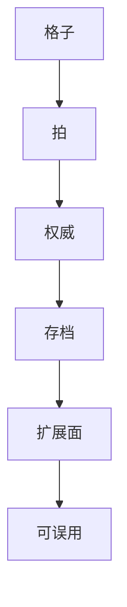

> **本章命题**：不能被再开发的 Minecraft 只是一个客户端。完整产品是同一份世界文件上的游戏、协议、数据与工具链。实现把卷二的口令收成柜子、拍和切口；有些债是资产。最小内核可以抄走。抄走之后仍要考试，考试在卷四，不在本章判毕业。

## 问题

货架上的 SKU 叫 Minecraft。许多人真正打开的，是某一版加载器、某一份核心、某一包数据和某一张从未印刷的红石表。把 SKU 当成产品，模组会变成周边，服务器会变成联机功能，Wiki 会变成攻略站。周边可以很热闹。热闹解释不了为什么拿走第二作者席之后，剩下的东西会突然变薄——薄得像 2009 年那个能跑的循环，而不像一座还能住十年的世界。

要回答：为何必须当成同一产品来写？可被证伪的说法是：引擎是 Mojang 的程序，模组是粉丝创作，协议是联机电线，数据包是高级设置；四者分开优化、分开出售、分开关掉，游戏仍然完整。只要还存在没有 Fabric / Forge 就进不去的工业世界、只要还存在没有 Paper 就不像同一台万人引擎、只要还存在没有数据包就写不成的地图、只要还存在协议号一变模组全灭，这句话就不成立。关掉其中一层，你不是少了一个 DLC。你是少了作者席。

上一章把先卖再修的神话拆开。[《技术债作为产品策略》](/impl/tech-debt) 民间官方实现是漏写的那一半。本章把一半补回产品定义，并回头照亮卷二：设计口令在实现里变成哪一种不可省的结构。卷四会考哪些是本质、哪些是偶然。本章不代考。本章只交最小内核——若你只读这一卷技术，走时至少带走这几条。带走不是毕业证。带走是考生材料。

<Cards>
  <Card title="原语是格子" href="/design/voxel-primitive" description="口令能指，实现才有柜子。" />
  <Card title="可误用是合同" href="/design/redstone" description="物理停在官方。语言长在外面。" />
  <Card title="单人即服务器" href="/impl/protocol" description="权威从连接数为 1 就开始。" />
</Cards>

## 不能被再开发的 Minecraft 只是一个客户端

客户端负责画、听键、把点击送上去。送上去之后，世界在不在、规则能不能改、第二个人能不能住进来，都不由这一层单独决定。决定发生在权威模拟、存档格式、协议形状、以及有没有人被允许切开或改写下一拍。

再开发不是「支持 UGC」这句品牌。再开发是：同一份世界还能被写成另一种游戏，而不必先导出成另一套引擎。材质包改皮。数据包改内容和一部分规则。模组改动词和物理。插件改法律。服务器把法律跑成 24 小时的社会。[《模组作为第二作者》](/history/mods-as-authors) [《服务器即新游戏》](/history/servers) 连续的作者席，才是总命题里那个「再开发」。席一撤，剩下可玩的循环。循环可以很好看。好看的循环仍是客户端加一份只读世界。只读世界是关卡。关卡不是这款媒介。

Bedrock 把这句话写成对照，不是写成反派。附加包和脚本能改很多内容，审核友好，能进房间。[《Bedrock 作为另一次实现》](/impl/bedrock) 切不进活塞检查，就养不出同一台墙上的 VM；进不了加载器河，工业包就不是同一类作者席。Marketplace 把再开发收成商品。商品可以繁荣。繁荣的是货架。货架不是「同一份世界文件上的第二条立法」。立法被收走之后，品牌还在，媒介窄一圈。窄掉的那一圈，正是 Java 这边必须把模组河算进产品的原因：不算进去，Java 也会在自己的收银台里变成「一个会更新的客户端」。会更新，不够。还要能被打开。

工具链同样不是周边。映射词典、DataFixer 梯子、结构方块、原理图、Wiki、启动器里并排的二十个版本，决定第二作者明天还能不能上班。上班是产品功能。功能坏了，表现为整合包发布夜。发布夜不是社区脾气。发布夜是完整产品的验收仪式——验收的不是龙，是接头。

所以四件东西必须写在同一张产品图上：

| 层 | 它管什么 | 关掉之后剩下什么 |
| --- | --- | --- |
| 游戏 | 格子、拍、因果、权限 | 演示：能看，难住 |
| 协议 | 权威如何说话，单人如何也是服务器 | 两套因果，模组死在接头 |
| 数据 | 名字、配方、进度、世界格式 | 内容冻在 jar 里，迁档变成拆迁 |
| 工具链 | 加载器、核心、词典、说明书 | 官方仓库，像完整，实则半成品 |

四层可以分仓库、分许可证、分公司。分，不等于产品可以拆卖。拆卖之后，玩家口头仍叫 Minecraft。口头很宽。宽会把半成品听成原版纯度。纯度若等于「只有官方仓库」，你会失去已经住进去的那一半文明。文明不在 SKU 里。文明在可被再开发的那几层上。

## 对照卷二：实现如何照亮设计

卷二说格子是度量衡。实现把度量衡收成状态、节、调色板、空气也占位。[《体素世界的数据模型》](/impl/data-model) 口令能指，是因为地址是整数；整数能卖到无限，是因为代价单位是区块。拿掉区块谈「无限世界」，只是修辞。修辞在生成章已经拆过。[《世界生成即内容生产》](/design/worldgen) 管线章把它收成确定性的边界。[《世界生成管线》](/impl/worldgen-pipeline)

卷二说七个动词，不加建造模式。实现把手感写成客户端先演的谎：挖掘停顿、伤害闪烁、破碎粒子，服务器还没点头。[《最小动词集与手感》](/design/verbs-feel) [《音频、粒子与手感谎言》](/impl/feel-client) 谎必须可被权威拉回。拉不回，工地和家会分家。分家就是编辑器。创造章不肯分家。[《创造模式不是关卡编辑器》](/design/creative-mode) 权限拧的是人，不是另一份物理。

卷二说生存把目标外包，世界比命长。实现把这句话写成 20 TPS 契约和死亡掉落：掉拍掉的是因果，不是画面；掉的是栈，不是柱子。[《生存作为意义机器》](/design/survival) [《游戏循环与刻》](/impl/tick) 熔炉认拍。认拍，家才不是一局比赛。

卷二说成长在物上。实现把物写成必须能对账的栈：窗口协议、组件化、迁移按件计费。[《合成、物品与库存》](/design/crafting-inventory) 贵，因为财产不能丢在「以后再说」里。贵，反证设计：强必须能交出去。交不出，深度会爬到角色卡上。角色卡不是这套柜子。

卷二说红石是可误用系统。实现给出成因：通知走得近，检查看得远，缝里长出 BUD；稳定之后，怪癖升成平台。[《红石的实现》](/impl/redstone) 设计合同在物理。实现合同在兼容。两份合同叠在同一根粉上，才有计算机，而不是门上的灯。

卷二说数据包把作者席部分收回，新动词仍要写系统。[《命令、数据包与地图》](/design/commands-datapacks) 实现画出边界表：内容走 JSON，切口走类。[《数据包、资源包与数据驱动》](/impl/datapacks) 模糊是政治。政治的牙齿是：温和河养地图，养不出第二种挖掘。

卷二说战斗足够用。实现说实体才是税。[《生物、战斗与威胁》](/design/mobs-combat) [《实体与碰撞》](/impl/entities) 足够用，因为威胁的职责是催建造，不是雇一套动作游戏的提交预算。预算一雇满，拍会先于「手感不够帅」告状。

卷二说多人是默认状态。实现说单人即本地服务器：Esc 的礼貌，只在连接数为 1 时成立。[《多人是默认状态》](/design/multiplayer) 家具朝向第二个人，协议朝向同一份权威。朝向不是联机功能。朝向是运行时从一开始就按将会被看见来写。

卷二说终局没有句号。实现说存档必须比 jar 活得久。字幕可以滚。`DataVersion` 还在走。走，终局才能被冰道和服务器日历占领。[《维度、进度与终局》](/design/dimensions-endgame)

对照不是为了炫耀章节目录。对照是为了证明：设计判断若不能落成柜子、拍、包和切口，它只是口味。口味改不了 TPS，也挡不住一次扁平化。实现若不能指回口令，它只是重构。重构可以让灯更老实，让飞行器停在「终于正确」里。

## 哪些债是资产

不是所有债都该还。有些债是买来的自由度，还掉会丢作者席。

**可切开的字节。** Java 卡住了启动和停顿，换来加载器河。[《Java 版运行时》](/impl/java-runtime) 切开是 2009 年的副作用，后来变成资产。资产的利息是末日矩阵。利息可以骂。骂完，河还在。河不在，再开发会塌成商城或塌成破解。两边都出现过近亲。近亲提醒：这层债还干净的时候，完整产品会变薄。

**未签名的协议。** 每个快照都能改包。改，官方快。跟，第二作者疼。疼出来的是 ViaVersion、多版本代理、以及「协议即公共 API」这句被迫的诚实。若一开始就十年不变，正作会变慢，模组会好过。慢和好过都是选择。选择至今站在「快」这边，于是债成为生态的关节。关节可以换成人造髋。换的时候要重装所有走路的人。

**空法律与粗兴趣。** 原版不给领地，不给万人点名。空，插件才成为政权；粗，Paper 才成为民间官方服务端。若正作把公寓和法律一次做完，生存社会会更像产品。更像产品，会少一种被误用成城邦的空。空是设计。空在实现里叫范围漏写。漏写养出 Hypixel，也养出 2b2t。两端都不是安装包。两端都依赖这层债没被还成「正确的社交平台」。

**被升成 WAI 的怪癖。** 准连接、某些更新顺序、火把保险丝，按电路图是错的。按语言是词。词是资产：可误用系统需要稳定的错。错若每年擦干净，误用会退化成解谜。解谜可以很好。它不是这台能飞、能算、能被苦力怕炸的程序。资产有护照：Java 有的，Bedrock 可以没有。没有，就不是同一份资产。不得把资产写成全品牌圣经。

**翻译器本身。** DataFixer 梯子很贵，贵证明有人拒绝拆迁。拒绝拆迁是伦理，也是资产：世界比引擎活得久，这句话才有牙齿。牙齿会咬发布列车。咬，是居住权在工程上的形状。

<Note>
债是资产的判据只有一句：还掉它，会不会把某一条已经成立的作者席一起还掉。会，就先别还。不会，窗口可以开。窗口怎么开，上一章写过。
</Note>

语言运行时、双产品线、全局 20 TPS 是不是偶然，本章不判。判了就是提前替卷四答题。这里只把「不要把资产当垃圾清掉」钉在实现层。清垃圾的冲动很像正确工程。正确工程面对的若是语言，会变成拆迁队。

## 最小内核：数据模型、刻、权威服务器、扩展面

若只读卷三，请带走下面六条。六条是内核，不是仓库里的类名。少一条，你会做出能跑的方块游戏；那六条叠在一起，才有机会叠上居住、误用、再开发。机会仍要考。考卷在下一卷。

1. **可操作的离散格子。** 状态可点名，空气也是数据，代价单位是区块。口令能指，库存能数，红石能占同一把尺。[《体素作为设计原语》](/design/voxel-primitive)
2. **共享真实的刻。** 模拟有拍。掉拍掉因果，不掉「画面有点卡」。熔炉、活塞、白天认这一拍。客户端可以另有一帧钟，不能另结一份账。
3. **权威服务器，含连接数为 1。** 单人即本地服务器。画面可演，格子、口袋、生命以服务端为准。没有这份权威，多人是外挂，单人是另一套物理。
4. **比引擎活得更久的存档。** 格式带着版本号走。升级是翻译，不是清空。读不起旧档，就是宣布玩家的时间作废。
5. **分层的扩展面。** 数据层改内容与一部分规则；系统层（代码、注入、或同等能力的切口）才能加新动词。两层缺一，作者席会塌成商城或塌成破解。[《数据包、资源包与数据驱动》](/impl/datapacks) [《模组与插件架构》](/impl/mod-architecture)
6. **稳定可复述的未说明行为，允许被当成社会 API。** 不是鼓励写 bug。是承认：可误用系统一旦被读成语言，兼容要进产品范围。进范围的方式可以是 WAI、可以是新积木、可以是仿真层。不可以是假装在擦灰。

六条里，Java 与 Bedrock 已经分叉的是第 5 和第 6 的形状：一边是 Mixin 与墙上的 VM，一边是附加包、脚本与另一份红石。分叉证明内核不是「必须用这种加载器」。内核是：必须有扩展面，必须说清未说明行为算不算语言。形状留给考试。考试不许从「卡」跳到「换语言」，也不许从「能进商店」跳到「已经完整」。

<Constraint name="完整产品含再开发" verdict="地基" chain="权威世界 → 可改的数据与切口 → 第二作者席">
抄走格子、拍和服务器，丢掉扩展面，你会得到一个能卖的客户端。客户端可以很精。精不是媒介。媒介要求别人能在同一份世界上继续立法。立法可以温和（数据包），可以切开（模组），可以只改法律（插件）。三种都算。一种都不给，产品停在演示。
</Constraint>

<Alternative title="若只把官方仓库当产品">
版本说明会变短，责任会变清，发布夜会少。你得到可辩护的工程边界。你失去的是已经用 Wiki、核心和加载器把原型拖进不可能规模的那二十年。边界清爽。规模会缩回能跑。能跑曾经够。够的日子在 Infdev 之前。
</Alternative>

## 卷三结语

本卷起笔于空气也是数据，收束于可被模组的引擎。中间走过柜子、管线、光照、拍、实体税、口袋、隐式 VM、网格、协议、谎言、加载器、数据包、虚拟机、另一次实现、万人用法、以及把债当成策略的那一章。走过之后，技术史那句命题应当能被指着说：一个能跑的原型，被官方和民间一起拖进了不可能的规模。拖的力气来自架构债，也来自设计自由。两者同源。同源的意思是：你不能只要无限、可误用、可再开发，却要求内部形状每年一尘不染。不染，语言长不出来。语言长出来，内部形状就会被焊在墙上。

爱好者不必记住调色板的比特下限。要记住的是：卡顿、杜普、TPS、未知方块、模组末日，都可以说成机制。说成机制之后，你才不会把利息单听成原版纯度，或听成某一家核心的广告。

开发者不必从本卷带走语言选择。要带走的是最小内核，以及那张四层产品图。图上的工具链不是礼貌。礼貌做不出 Paper，也做不出准连接教科书。下一卷把偶然从本质里剥开。剥开是考试，不是开工令。卷二的可迁移清单若还没写完，考试会等。等不是停工。等是：不变量没有冻结之前，重写只是换皮。换皮已经发生过一次，叫 Bedrock。发生过，仍不够当毕业。

总命题没有在实现层改口。居住要求存档和拍。误用要求可被阅读的物理。再开发要求扩展面被算进产品。三句话现在都有柜子可指。指得着，才配把书合上之前说：完整的 Minecraft 从来不是那个客户端。客户端只是入口。入口后面是一座允许被打开的引擎。打不开的引擎，无论多快，都只是另一份会卖的关卡。关卡可以精。精不是这本书要证明的对象。

## 这一章留下什么

- **爱好者**：你装的模组、你进的服、你读的 Wiki，不是游戏外面的粉丝活动。它们是产品漏写却必须存在的那几层。拿掉它们，货架上的名字还在，你住过的那种 Minecraft 会变回一个客户端。
- **开发者**：能抄走的是四层同一产品（游戏、协议、数据、工具链），以及最小内核六条：格子、拍、权威（含单人）、活过引擎的存档、分层扩展面、可被当成语言的稳定怪癖。抄不走的是二十年切口、墙上的测试集、两条产品线已经分叉的因果。你不得从本章读出开工令，也不得读出「官方仓库即全文」。完整产品含再开发。再开发不在周边栏。再开发在引擎的定义里。
