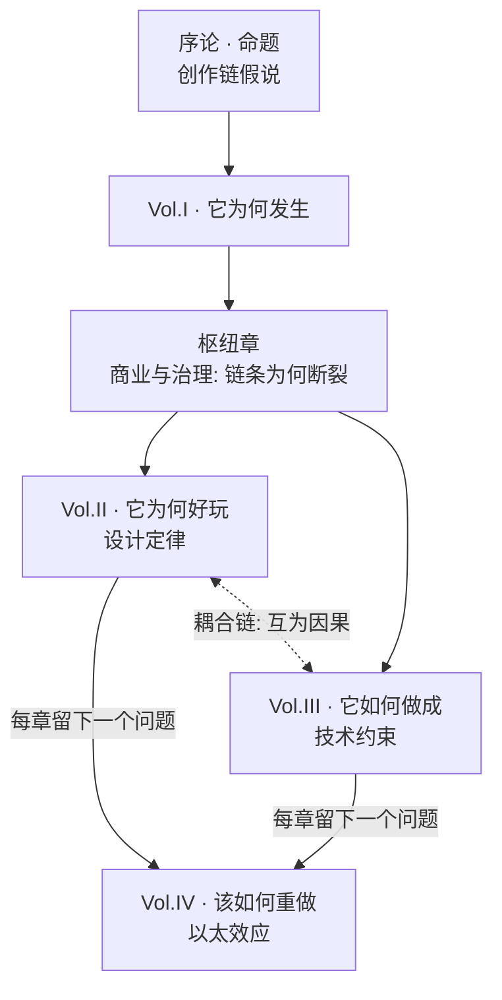

# 本书的命题

如果这本书只留一句话，是这句：

> **Minecraft 的护城河不是方块，是一条创作链。它的技术约束粗糙到玩家必须动手，又规整到玩家动得了手；于是玩的人变成造的人，造的人变成传的人，传的人又带来新的玩的人。它今天的问题不是玩法过时，而是这条链被逐节切断了。**

这个命题决定了全书的写法。它意味着我不能把历史、设计、技术分开写完就交差——因为链条恰好是横穿这三者的。它也意味着这本书必须有一个结论，而不是停在"Minecraft 真伟大"上。

## 那条链

把它画出来是一个闭环：

六节的意思分别是：

1. **可读**——世界由离散、对齐、可命名的单元构成。所以你能一眼看懂陌生人造了什么，也立刻知道该怎么复制它。这是整条链的前提，也是最容易被"画面升级"破坏的一节。
2. **可造**——造东西的工具就是玩游戏的工具，同一只手，同一个方块。没有"编辑器模式"和"游戏模式"的割裂，所以创作不需要一个决定去启动。
3. **可改**——游戏本体是可被改写的，而且门槛是连续的阶梯：改一张贴图、改一个数值、写一个数据包、写一个 mod、写一个服务端插件。任何一级都能停下来，也都能往上一级走。
4. **可聚**——多人服务器让创作有观众，也让创作有社会后果。有人会住进你造的房子，会拆掉你的墙，会在你的规则下生活。
5. **可传**——因为可读，视频和教程能有效传播；因为坐标是整数，"照着造"是真的可行。传播的不是欣赏，是可执行的指令。
6. **可回流**——传播带来的新人重新进入第一节，其中一小部分人会爬到第三节，成为 mod 作者和服主，为整条链继续供货。

闭环意味着复利。这就是为什么在 Minecraft 之后画面更好、系统更深的沙盒一个接一个出现，却没有一个变成基础设施：它们做的是一条线段，不是一个环。

## 链条断在哪

我把主要的断点列在这里，作为全书第一卷的路线图。每一条都会在对应章节展开举证。

- **可改这一节最先出问题。** 官方 Mod API 从 2012 年前后被反复提及，至今没有在 Java 版上交付。整个 mod 生态因此建立在逆向工程之上，每次大版本更新都是一次全生态迁移；2014 年一名贡献者的 DMCA 通知让 CraftBukkit 的分发陷入停顿，也第一次暴露了这条链的法律脆弱性。生态活着，靠的是志愿者一次又一次替官方补课。
- **可聚这一节被商业化重写。** EULA 对服务器盈利方式的收紧改变了服主的生存模型；Realms 和 Marketplace 把"开服"从"自己搭一台"变成"向平台租一间"。托管更省事，也顺手拿走了服主折腾的余地——而折腾正是第三节的入口。
- **Java 版与基岩版的分裂同时打断了可改和可聚。** "一份 mod 服务所有玩家"从此不可能。基岩版有 Add-on，但 Add-on 不是 mod：它能配置游戏，不能改写游戏。占据了绝大多数新增用户的那个版本，恰好是阶梯最矮的那个。
- **可传这一节的变化不是 Mojang 的错。** 推荐流取代了订阅与浏览，短视频取代了长教程。可被照着执行的内容在新的分发机制里天然吃亏。这一节说明链条不完全握在开发者手里，也说明重建它需要考虑今天的传播形态，而不是 2012 年的。
- **可回流这一节于是变成了漏斗而不是循环。** 今天的新人进入的是一个内容由官方和商店供给的世界，而不是一个"你也可以改它"的世界。人还在进来，但爬到第三节的比例掉了。

第一卷的最后一章[《商业与治理》](../history/business)是整本书的枢纽，就是因为上面这些断点大部分发生在那里。

## 先排除三个更省事的解释

一个命题如果没法排除竞争解释，它就只是一种情绪。所以先处理三个最常见的说法。

**"玩家长大了。"** 可是每年都有新的小孩进来，销量和月活都还在涨。年龄能解释某个人的离开，解释不了那台创造机器的降速——机器的燃料是新人，而新人一直不缺。

**"更新不够多。"** 恰恰相反。2014 年之后加进游戏的方块、生物、生物群系和结构，总量远超 beta 到 1.0 的全部。数量从来不是问题。要问的是另一个比例：新增内容里有多少是可以被玩家继续往下创作的，有多少只是被消费一次就完了。这个比例的变化，才是第二卷要量的东西。

**"画面过时了。"** 如果画面是关键，高清材质和光追整合包早就该把它救回来；而实际情况相反——越写实的整合包，社区反而越小。

这条正好戳中我自己：《以太效应》目前走的是写实方向。但它是不是对的方向，我还没有定——之前做写实主要是为了差异化、视觉效果和技术验证，这三件事都成立，都不等于它更好玩、更正确。所以这不是一个可以糊过去的反驳，而是全书唯一一处我必须当作未决问题来对待的地方：判据放在[《地基与凑合》](../foundations/)，结论留给第四卷[《写实化的代价》](../aether/realism)。

## 为什么第二卷和第三卷必须互相咬住

Minecraft 最值得研究的性质是：**技术约束和设计涌现常常是同一件事的两面。**很多被当作天才设计的东西，起点其实是一个为了跑得动而做的实现决定；而很多看起来只是实现细节的东西，最后决定了整个玩法的形状。

几个例子，它们会在第三卷各章展开：

- **区块是 16×16。** 原因是要按块加载和存盘。后果是：它成了玩家的长度单位，成了建筑的尺度感来源，农场按区块边界设计，刷怪机制围着区块转。一个 IO 决策塑造了空间审美。
- **光照存成 0 到 15 的整数，一个方块半个字节。** 原因是要塞得进去并且能增量传播。后果是：洞穴是真的黑，火把成为核心动作，"点亮"变成一种领土宣示，怪物生成与照明绑定——整套防怪照明玩法，从一个存储格式里长出来。
- **红石信号一次更新耗两个游戏刻。** 原因是 tick 调度就那么写的。后果是 0.1 秒成了红石工程的时间单位，一整个时序电路社区建立在这个数字上。
- **准连通性是个实现意外。** 活塞、发射器和投掷器会被任何"本该激活它们上方那一格"的东西激活，不管那一格实际上是什么。它没有被修，反而被官方认定为"按预期工作"，整个 BUD 开关与飞行器社区在它上面长了起来；但 1.21 加入的合成器没有这个行为。一个缺陷变成了社区的共有资产，也变成了一块只能就地封存、不再向新东西扩散的技术债。
- **用 Java 写，因为 Notch 熟悉它。** 后果是字节码容易反编译，Bukkit、Forge、Fabric 才得以存在。Minecraft 最重要的生态特征，来自一个纯粹的个人习惯选择。

所以这本书里，第二卷每一章会先问"这个体验背后压着什么约束"，第三卷每一章会以"这个技术决定造成了什么设计后果"收尾。两卷从两头挖同一条隧道。

## 四卷是怎么互相举证的

- **第一卷**证明这条链真的存在过，并交代它是怎么断的。
- **第二卷**解释链条为什么能咬住人——把 Minecraft 的设计提炼成几条可复用的定律，而不是一堆值得赞美的细节。
- **第三卷**解释链条的物理基础，以及哪些约束是它的地基、哪些只是当年的凑合。这个区分极其重要：把凑合当地基会做出一个假古董，把地基当凑合会做出一个不生长的世界。
- **第四卷**是我的答案，也是唯一一卷可以被证伪的。

## 每一章都长一个样

这是故意的。全书每一章都按同样六段走：

1. **问题**——这一章要回答什么。
2. **Minecraft 怎么做的**——事实层，尽量不夹判断。
3. **为什么这么做**——当时压着什么约束：技术的、时间的、人的、商业的。
4. **代价与失败模式**——这个选择让什么变得不可能，以及它在什么条件下会崩。
5. **别人怎么做的**——横向对比。
6. **如果我重做**——一句话，并且直接链到第四卷的对应小节。

第六段是把四卷焊在一起的东西：每一章都留下一张欠条，第四卷逐张兑付。如果你读到某一章的第六段觉得"这个想法很可疑"，请记住它，然后到第四卷去找它——那正是我希望被审查的地方。

## 三种旁注

正文之外有三类框。它们语气不同，可信度也不同，请分开对待。

::: info 亲历 · 高中那个平滑版
我用 Marching Cubes 做过一个没有棱角的 Minecraft。地形连续起伏，跑起来确实很漂亮。

按这本书的判据，它应该出问题：你无法一眼判断两个位置差多少，无法把一个结构记住并复述给别人，也无法照着视频复刻——也就是说，我可能亲手删掉了"可读"那一节。但这只是推论，不是我当年真实的记录。这条推论到底成不成立，是全书最关键的一个未决问题，我在[《地基与凑合》](../foundations/)里把它摊开了，没有替自己给答案。

这一类框是我的第一手经历：开服、写插件、四次重写引擎。它是这本书的可信度来源，但也是它偏见的来源——我是当事人，不是观察者。而且当事人最容易做的一件事，就是把后来学会的道理追认成当年的感受。
:::

::: tip 另一种可能 · 别人是怎么处理这个问题的
Vintage Story 用同样的方块尺度做出了远比 Minecraft 硬核的生存链；Terraria 在二维里把"可读"做到了极致；Luanti 从第一天就把引擎和游戏内容分开，代价是没有一个足够强的默认游戏；Roblox 把创作链整个平台化，也顺手把它变成了一门生意。

这一类框是横向对比加改进设想。它们是第四卷的伏笔——每一个"另一种可能"，最后都要在第四卷里给出取舍。
:::

::: details 实现细节 · 光照为什么是 0 到 15
每个方块的光照存成一个 nibble，半个字节，天光和方块光各一份。之所以是 4 位而不是 8 位，是因为光照数据要跟着区块走：既要塞进内存和存档，又要在方块变化时增量地重新传播出去。取 16 级的直接后果是衰减必须够快——每格衰减 1，于是一支火把的照明半径就是十几格，这个数字进而决定了矿洞里火把的间距、刷怪的判定边界，以及玩家对"安全区"的空间直觉。

这一类框放代码、格式和伪代码，默认折叠。跳过它们不影响读懂论证；但如果你打算自己动手写一个，它们才是这本书真正有用的部分。
:::

## 你可以只读一部分

- **只想弄懂它为什么好玩**——读序论加第二卷，第三卷各章末尾的"设计后果"那一段可以捡着看。
- **要做一个体素游戏**——读第三卷加第四卷，第二卷当需求文档读。
- **开过服、写过插件**——从第一卷的[《服务器与社区》](../history/community)和[《商业与治理》](../history/business)开始，那两章写的是你我共同的经历。
- **想直接看我的主张**——跳到第四卷。但那样你会看到一堆结论而看不到它们的代价，而代价恰恰在前三卷。

## 这本书可能错在哪

写下来，好过让读者自己发现。

**创作链可能是过度解释。** 把若干个独立的原因串成一条漂亮的链子，是写作上的诱惑。真实情况也许更零散：几件互不相关的事恰好同时发生。我会尽量在每个断点给出可独立检验的证据，但这个风险不会消失。

**我的记忆掺在证据里。** 我在这个游戏最好的那几年里正好是个小孩，"黄金年代"这个判断里有多少是它真的变了、有多少是我真的长大了，我没有办法完全分开。第一卷里可查的部分我会给出来源，「亲历」框里的部分请当作证词，不是数据。

**第四卷还没有被验证。** 《以太效应》没做完，也可能失败。如果它失败了，第四卷就变成一份写在开工之前的失败原因记录——那样也有价值，只是价值和我期望的不一样。

那么，从头开始：这个游戏是怎么来的。
