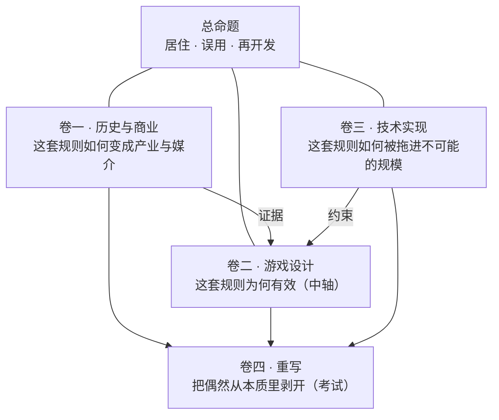

> **本章命题**：Minecraft 不是一套被消费的关卡，而是一套允许被居住、误用、再开发的规则。

## 问题

先看两个数字。2014 年，微软以 25 亿美元收购 Mojang[^msft]；2023 年，Minecraft 宣布累计销量突破 3 亿份[^sales]，是电子游戏史上最畅销的作品。这两个数字被引用过无数次，但它们什么都没解释。

销量是结果，不是原因。它解释不了为什么玩家的停留以「年」计，解释不了为什么一个 2009 年的独立游戏成了几代人的共同语言，更解释不了为什么此后画面更好、系统更深的沙盒一个接一个出现，却没有一个复制这个位置。要解释这些，必须先解释它的形态本身：**为什么一个看起来永远「没做完」的游戏，赢得了所有「做完了」的。**

这本书的回答只有一句话，就是上面的命题。全书剩下的篇幅只做两件事：把它说清楚，以及把它放在可以被反驳的位置上。

## 为什么「最畅销」什么都没解释

把 Minecraft 和其他畅销作品放在一起，销量数字区分不了两种完全不同的占有方式。

一种叫**消费**：内容被吸收，进度被走完，然后离开。它的定义特征是有终态——通关画面、赛季结束、内容池见底。另一种叫**居住**：玩家不断投入劳动去维护和扩展一个处所。它的定义特征是劳动不产出「完成」，产出「家」——房子越盖越大，农场越来越自动化，仓库越理越有序，没有哪一天这些劳动「结算」了。

《泰拉瑞亚》是个好的对照：它同样卖了几千万份，同样有大量建造。但它的设计重心是 Boss 序列驱动的进度阶梯，建造被这套进度组织着——世界的使命随通关完成。于是有一个可证伪的表述：**把进度目标全部移除，如果建造与探索随之失去组织，它是消费型游戏；而 Minecraft 的创造模式干脆移除了全部生存目标，玩法反而更纯粹。**消费完的东西会贬值，住进去的东西会增值——这是两类产品的分水岭，销量照不出这条线。

## 总命题：三个动词

「居住、误用、再开发」不是修辞排比，是三个可以被逐个检验的动词。每个动词给一个例子，并给出它的反驳入口。

**居住**：玩家把规则当作处所，而不是当作内容。最好的证据是床。机制上它只是重生点加跳过夜晚；但多人服务器上，床的规则是「所有人都躺下，天才会亮」——**时间被做成了共有财产**。没有人强迫 Mojang 把「共同入睡才天亮」写进规则，可这条规则恰好把「一家人的夜晚」变成了制度。反驳入口：如果你认为床只是存档点，请解释为什么玩家在没有危险时也遵守「睡觉礼仪」，以及为什么十几年来对床的调整只围绕跳夜语义、从来没人提议把「睡觉」这层皮去掉。

**误用**：系统被用于设计者从未给出过的目的。最响的例子是红石计算机——用游戏里的材料搭出能运算的机器。误用的判据不是「是否官方功能」，而是**社区是否为这个用法发展出了独立术语**：BUD（方块更新感应）、零刻（zero-tick）、准连接（quasi-connectivity）——这些词不出现在任何官方文档里，它们是误用者的黑话。反驳入口：有人会说活塞门是正常用法。是的，把活塞当门是使用；用活塞的时序怪癖造飞行器是误用。判据始终是：用途是否出现在设计意图的陈述里。

**再开发**：玩家改变的不是世界里的内容，而是规则本身——模组改物理，服务器改法律，数据包改数据。反驳入口：所有游戏都有模组。区分度有三层：Minecraft 的再开发改变的对象是规则而非关卡；再开发者与玩家是同一群人（从玩游戏到装模组到写模组，身份是连续的）；以及最关键的——官方对再开发做**选择性收编**，活塞本是模组，被收进正式版[^piston]。收编这个动作本身，说明官方承认玩家是第二作者。

三个动词是递进的：居住否定了消费，误用是居住的极端形态（住进去的人开始改造家具），再开发是误用的制度化（改造被承认为产品的一部分）。全书的一切论证都挂在这条链上。

## 三卷分工与关系

- **卷一**回答「如何成为」：不是英雄史，是媒介形成史——一套规则如何获得人口，又如何被社区、平台与资本反复再开发。它是命题的证据卷。
- **卷二**回答「为何有效」：全书中轴。极少数规则如何在体素世界上组合出爆炸，目标如何外包给玩家，系统如何被做成可误用的工具。
- **卷三**回答「如何实现」：实现与设计同源。区块、刻、存档格式——许多被当作「天才设计」的东西，起点是实现约束；而实现怪癖又反过来定义了玩法的形状。

为什么必须分三卷？因为单卷论证各有失败模式。只写设计，原则会失去时间性，变成放之四海的鸡汤；只加历史，会变成更新日志文学；只写技术，是回答不了「为什么」的实现笔记。三卷互相供血：没有卷三，你不知道 1 米立方体是设计还是 I/O 妥协——答案是**都是**，而这个「都是」正是 Minecraft 最深的性质：它的好设计常常是好约束的另一面。

## 第四卷：思想实验

第四卷做一次考试：如果今天重写 Minecraft，哪些是必须保留的设计不变量，哪些是可以抛弃的历史偶然？Java 运行时、全局每秒二十刻、双端分裂——哪些属于本质？

这一卷写在不变量冻结之后（卷二第 16 章与卷三第 18 章），并且明确**是考试，不是开工令**：不选语言，不画路线图，不推销任何具体项目。它的产出是一份本质属性清单，以及一个更好的问题：重写是为了看清原作。

## 只读十分钟应带走的一句话

如果你只读十分钟，带走这句：

> **关卡会被消费完，规则会被住进去。Minecraft 卖的不是一段可以通关的内容，而是一套允许被居住、误用、再开发的规则——所以它没有「打完」的那一天，也就没有离开的那一天。**

检验标准也放在这里：全书任何一章的结论若与这句话冲突，优先怀疑那一章，并欢迎用机制反例修正本书。

[^msft]: 微软官方公告，2014 年 9 月 15 日：以 25 亿美元收购 Mojang。
[^sales]: Minecraft Live 2023 官方宣布：全平台累计销量超过 3 亿份。
[^piston]: 活塞由社区作者 Hippoplatimus 先做成模组，官方于 Java Beta 1.7（2011 年）将其收编进正式版。
