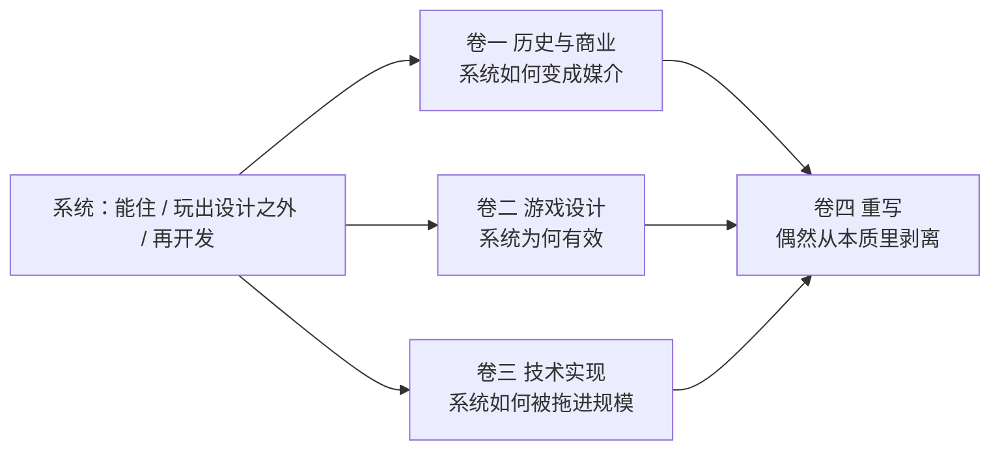

> **本章命题**：Minecraft 不是通关即弃的内容，而是一套能住进去、能玩出设计之外、还能被再开发的系统。三卷从三个方向证明同一件事；第四卷把偶然从本质里剥开。

## 问题

Minecraft 不缺头衔。最畅销、玩过的人最多、被模组过最久、被做成过课堂、电影、主题公园。这些句子都对，也都几乎什么都没解释。

「最畅销」解释不了人们为什么愿意在同一个世界里连续住十年，也不解释为什么有人把游戏拆开重写成服务器、模组加载器和红石计算机。同期有画面更好的沙盒，系统更密的生存，宣发更猛的开放世界。它们卖得出去，却很少变成一种别人能住进去、玩出作者没写的用法、再拿去给别人住的东西。

所以这本书不从销量起笔。销量是结果。要问的是：Minecraft 究竟是一种什么对象？如果它只是内容更丰富的游戏——关卡更多、物品更多、剧情更长——后面所有「社区奇迹」都只能写成附录趣闻。如果它是一套**系统**——硬到能住、空到能玩出设计之外、开放到能被再开发——那么历史、设计和实现就不是三个话题，而是同一件事的三个截面。

内容与系统是这组对举。通关即弃说的是产品结构：打完这份东西，你就结束了。它不说剧情游戏不精彩，也不说打完就会忘掉。一款一次性的故事可以记一辈子；记一辈子，仍然是打完一份内容。Minecraft 的对象不是这份内容，是那套还能继续待着、继续发明、继续被改写的系统。

规则仍在后文里出现：挖要时间、红石要通、格子能指。规则是零件。总句的主语是系统。

这本书要证明的是后一种。

## 住进去、玩出设计之外、再开发

三件事分开说。每一件都给出一个玩家可以当场反驳的例子；反驳成立，命题就要改。这不是修辞，是后文所有判断的地板。后文仍会把它们收成三个短词：居住、误用、再开发。短词是绰号。绰号第一次出场，先说人话。

**住进去。** 系统把世界做成一个可以待着的地方，而不是一段必须打完的流程。家、箱子、床、命名的狗、门口那棵一直没砍的树——这些对象几乎没有「通关价值」，却构成了大多数人真正的存档。可被证伪的说法是：如果关掉进度、不打龙、不升级装备，游戏会迅速无趣。大量单人档和生存服证明这句话不成立。反过来，如果有一天官方把「你的世界」收成赛季制、定期清空、用通行证驱动下一阶段，住就会塌成消费。那不是风格变化，是对象变了。

「居住」听起来像房子，对这本书不是副作用。要和通关对举的，正是家：待着就成立。Hypixel 上只打起床战争的人，并没有住进主世界。这不推翻命题，它换了住所：小游戏服住的是另一套系统，同一引擎上的另一种社会。卷一会把这件事写成史实，卷二会把它写成设计。

**玩出设计之外。** 系统留给玩家的是物理和因果，不是玩法清单。红石被做成「电线」，玩家拿它搭门、搭时钟、搭飞行器、搭能跑程序的机器。官方从未把「计算机」列为内容。可被证伪的说法是：红石的高级用法其实都在设计意图之内，只是教程没写。只要还存在一类玩法——官方要是按「正确行为」把它修掉，社区会认为游戏坏了，而不是 bug 没了——「玩出设计之外」就成立。准连接、BUD、更新顺序，后面都会回到这句话。后文把这件事叫做**误用**：不是玩家用错了，是系统被用出了说明书。

它也不是**涌现**。涌现是：简单规则缠在一起，组合自己长出深度——活塞门、农场、冰道，许多是规则允许的，官方甚至乐见。那是卷二要证明的「极少数规则在体素世界上的组合」。玩出设计之外偏的是另一条缝：说明书没把这件事当内容，玩家却把它玩成了内容。涌现可以是设计意图；中间这项要保住的，是意图和实际用法之间那条缝。

不是只有红石。水电梯、冰道、刷怪塔、船的碰撞、凋灵破家，都是同一类现象：系统比作者的想象力更硬，也更空。作者写下的是世界怎么传导因果；玩法是玩家发明的。发明发生在原版系统里，还没有改程序。改程序，是下一项。

**再开发。** 游戏承认自己可以被改写成别的游戏。材质包、数据包、模组、插件、地图、服务器，是连续的作者席，不是周边商品。可被证伪的说法是：Minecraft 的社区创造和任何 UGC 平台无异，只是画风不同。Roblox 是真正的对照。它走的是平台化：世界是商品，工具在编辑器里，分成在商城里。Minecraft 走的是游戏化：世界是能住进去的系统，工具就是玩家手上那几个动词，作者席长期无法被平台抽成。两者都能长出生态；不是同一品类的两个竞品。卷一第 12 章专门处理这件事。

三件事绑在一起才够。只住，它是沙盒玩具；只玩出设计之外，它是漏洞合集；只再开发，它是引擎中间件。Minecraft 的奇特之处是三者互相供血：因为能住，才有人愿意把系统用出说明书；因为能用出说明书，模组和服务器才有东西可改；因为能再开发，下一批人才会把新的住所和新的用法送回来。

## 为什么必须分三卷

只写历史，成功看起来像运气：赶上了 YouTube，赶上了独立游戏窗口，赶上了微软需要一个入口。运气是真的，但它解释不了红石为什么能被发明成计算机，也解释不了为什么那么多 Minecraft-like 赶上了更肥的市场，却抄不成媒介。

只写设计，原则看起来像永恒真理：最小动词、世界即库存、目标外包。原则需要证据。Beta 1.8 为什么撕裂社区、活塞为什么能进原版而工业模组不能、创造模式为什么必须寄生在生存规则上——这些判断离开史实和实现，会变成品味。

只写实现，技术看起来像考古：区块、NBT、20 TPS、Mixin。没有设计的价值排序，就分不清哪些怪癖是必须保住的资产，哪些是 2009 年的凑合。没有历史，就看不懂模组为什么比引擎更难维护。

三卷证明的是同一个对象：

卷二是中轴。不先冻结「Minecraft 味」是什么，历史判断会滑成怀旧，技术判断会滑成优化清单。所以正文的写作顺序是原语先于年表；阅读顺序可以按你的职业分叉，但原语仍是所有分叉的公共地基。

还有一条贯穿三卷的口径：**Java 与 Bedrock 是两次实现，不是一个游戏的两个皮肤。** 红石、战斗、世界格式、模组能力上的分叉，会反向决定能设计什么、能卖什么、能兼容什么。后文说「Minecraft」时默认指 Java 版，凡有例外会标明；凡是分叉本身成为论点，两边分开写。

## 第四卷是考试，不是开工令

重写卷回答的不是「用什么语言再做一版更现代的」。它回答：哪些属性拿掉它就不再是 Minecraft，哪些只是 2009 年 Java、全局 20 TPS、双端分裂留下的伤疤。

原版体验、模组平台、服务器平台、创作工具——这四件事经常被一个名字捆住，并不能互相替代。兼容 Minecraft 和继承其思想，是两条路。Paper、Fabric、优化模组已经是局部重写；克隆和未完成的继任者是另一类样本。

第四卷必须写在前三卷把不变量冻结之后。提前写，会把尚未论证的本质当成前提，重写就只是又一次克隆。它也不是开工令：本卷的产品是一份本质属性清单。若永不重写，清单仍然值得有——那是看清原作的方法，不是新游戏的立项书。

## 只读十分钟

如果这本书只留一句：

**Minecraft 不是通关即弃的内容，而是一套能住进去、能玩出设计之外、还能被再开发的系统。**

英文同一句：

**Minecraft is not disposable content, but a system you can inhabit, play beyond its design, and redevelop through mods and servers.**

`disposable` 在这里不是「内容很烂所以丢掉」。它对应通关即弃：打完这份内容，产品结构就结束了。精彩的剧情也可以通关即弃。`play beyond its design` 不是 emergence：涌现是规则的组合爆炸，放在卷二；这里要的是说明书没写成内容的用法。`redevelop through mods and servers` 把再开发钉在模组与服务器上，也挡住「做一版更现代的原版」。

销量、怀旧、像素风、甚至「沙盒」这个品类标签，都是这句话的下游。上游是系统：硬到能住，空到能玩出设计之外，开放到能被别人拿去再开发。三卷分别证明这句话在产业里成立、在体验里成立、在机器里成立。第四卷检查：去掉哪些东西，这句话会假。

下一篇写方法：凭什么相信后文的判断，以及这本书明确不写什么。前言里的路径表告诉你读完可以跳哪一卷；跳之前，这句话必须还在。

<Cards>
  <Card title="体例与方法" href="/prelude/method" description="判断怎么开篇、怎样才算能被拆穿。" />
  <Card title="卷一从起源进" href="/history/infiniminer" description="这套系统如何变成媒介。" />
  <Card title="卷二从体素进" href="/design/voxel-primitive" description="全书中轴。味从这里冻住。" />
</Cards>

## 这一章留下什么

- **爱好者**：你不是「还在玩一个老游戏」。你住在一套系统里，一直在把它用出说明书，也一直在改写它。后面各章只是把这件事说清楚。
- **开发者**：能抄的是原则，抄不走的是这套系统长成媒介的条件。不要带着「做一个 Minecraft」开工；先问你到底要做四个产品里的哪一个。
