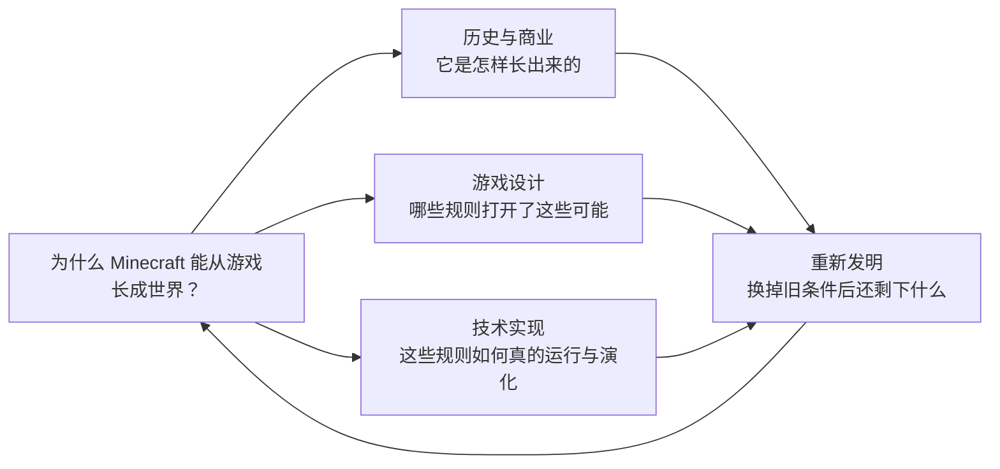

Minecraft 不缺漂亮的头衔。销量、活跃玩家、YouTube 影响力、模组数量、教育版、电影、主题乐园，都可以证明它很大。

但“大”并没有回答我真正好奇的事情。

为什么有人打完末影龙以后，还会回去把那条路修完？为什么一个本来只用来传递信号的红石系统，最后能被玩家拿去做门、时钟、飞行器甚至计算机？为什么一个商业游戏会长出 Forge、Fabric、Bukkit、Paper、整合包、服务器规则、冒险地图和无数作者工具？

这些现象放在一起时，Minecraft 已经不太像一份“玩完就结束的内容”。它更像一个长期存在的世界：玩家会在里面留下历史，会不断发明新的用法，也会直接改写这个游戏本身。

真正值得追问的，不是给这种现象先取一个漂亮的名字，而是：**为什么偏偏是 Minecraft 把这些事情同时容纳了下来？**

## 三个反复出现的现象

第一件事，是**世界会积累历史**。

房子、道路、箱子、矿坑、朋友留下的建筑，都会改变下一次进入游戏时你面对的世界。玩家并不只是从系统里消费一串任务；很多时候，过去做过的事本身就成为未来继续玩的理由。

这也是为什么“家”在 Minecraft 里那么重要。它没有明确的通关价值，却是很多存档最稳定的中心。当然，这不意味着所有玩家都在长期定居——速通、小游戏服、周期性开荒同样成立。问题恰恰是：为什么这些完全不同的时间尺度可以共存？

第二件事，是**规则经常被玩出说明书之外的用途**。

红石、流体、碰撞、刷怪、更新顺序，本来都有相对简单的局部规则，但玩家会把它们组合成农场、交通、计算机、机器和竞技玩法。这里有时是涌现，有时是对 Bug 或边界行为的利用，有时只是开发者从未想到过的组合。

它们之间到底该怎样区分，卷二和卷三会慢慢处理。现在只需要注意到一个事实：Minecraft 的系统经常比它列出来的玩法更大。

第三件事，是**游戏本身会被继续开发**。

模组、插件、数据包、资源包、地图、服务器，把玩家从“使用规则的人”变成了“改规则的人”。很多重要的 Minecraft 体验并不只来自 Mojang：工业、魔法、小游戏、服务器经济、冒险地图、性能优化乃至新的开发工具，都曾经从社区里长出来。

这也让 Minecraft 和一般意义上的 UGC 平台产生了一个很有意思的对照：玩家究竟是在一个游戏里继续创作，还是在一个平台里生产新的产品？两者看起来相近，背后的作者关系却未必一样。

## 它们为什么会同时出现

这三件事之间到底是什么关系，现在并不需要先决定。

也许它们来自同一个更深的设计结构：一个世界既足够稳定，让玩家愿意留下，又足够开放，让规则可以被重新组合；同时它的技术与文化边界又没有把社区创作完全关在外面。

也可能其中一些只是历史窗口造成的结果。2009 年的独立游戏环境、Java、论坛与 YouTube、早期 Mojang 的开发方式、模组生态的偶然形成，都可能是今天无法复制的条件。

甚至有可能我们把几件彼此独立的成功现象过度统一了。

这正是为什么需要把历史、设计和技术放在一起看。

## 这不是一份被遗失的设计文档

“Minecraft 设计思想”并不意味着 Notch 在 2009 年已经想好了今天的一切。

创作意图、实际机制和长期结果是三种不同的东西。开发者当年的访谈可以告诉我们为什么做某个选择，却不能决定这个选择后来产生的全部意义；玩家后来发明出一种玩法，也不能倒推出作者一开始就在等待它出现。

因此，本书更接近一次回溯：一个复杂系统已经运行了十几年，我们再回头看哪些条件曾经一起起作用，哪些规律后来才显现，哪些只是我们事后讲得太顺。

## 四卷怎么接近这个问题

```mermaid
flowchart LR
  Q["为什么 Minecraft 能从游戏长成世界？"]
  H["历史与商业<br/>它是怎样长出来的"]
  D["游戏设计<br/>哪些规则打开了这些可能"]
  T["技术实现<br/>这些规则如何真的运行与演化"]
  R["重新发明<br/>换掉旧条件后还剩下什么"]

  Q --> H
  Q --> D
  Q --> T
  H --> R
  D --> R
  T --> R
  R --> Q
```

**卷一 · 历史与商业**会从 Cave Game、Alpha、Mojang、模组、服务器、影像、微软与商业生态一路往后看。它负责提醒我们：成功从来不只来自设计，很多东西只有放回当时的历史条件里才看得清。

**卷二 · 游戏设计**会回到方块、动作、生存、创造、世界生成、红石、多人和玩家作者性。它要做的不是总结“秘诀”，而是弄清这些系统怎样互相咬合，又在哪里失效。

**卷三 · 技术实现**会打开机器：区块、存档、刻、渲染、协议、模组架构与兼容。很多看起来像设计的东西，其实和实现纠缠得很深；一些看起来只是技术债的怪癖，也可能已经长成玩家依赖的语义。

**卷四 · 重新发明**则故意换掉条件。Smooth Voxel、刚体与机械、Avatar、VR、运行时 UGC、AI NPC……如果我们把这些能力带进新的沙盒世界，哪些 Minecraft 式关系仍然成立，哪些会被彻底改写？

## 问题留到后面

这篇不需要先把 Minecraft 定义完整。

只要先把问题留下：

> **Minecraft 为什么能从一款游戏长成一个可以长期生活、创造、改写，并不断被重新解释的世界？**

等四卷真的走完以后，再看看我们还会不会用同样的方式回答它。

<Cards>
  <Card title="我们怎样研究 Minecraft" href="/prelude/method" description="怎样区分史实、机制、意图与我们的解释。" />
  <Card title="卷一 · 历史与商业" href="/history/infiniminer" description="从 Cave Game 开始，看这个世界怎样长出来。" />
  <Card title="卷二 · 游戏设计" href="/design/modifiable-world" description="从方块与最小动作开始，拆开这些关系。" />
</Cards>
