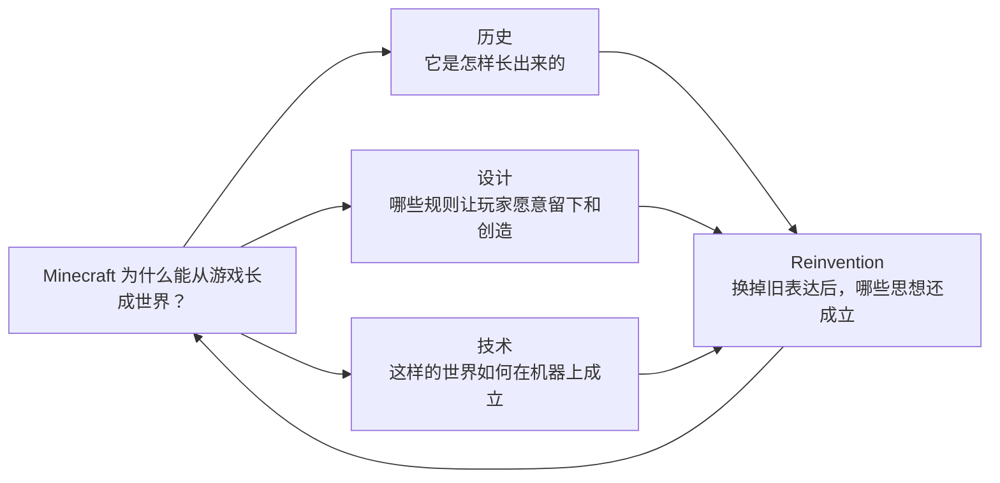

Minecraft 不缺漂亮的头衔。销量、活跃玩家、YouTube 影响力、模组数量、教育版、电影、主题乐园，都可以证明它很大。

但“大”并没有回答我真正好奇的事情。

为什么有人打完末影龙以后，还会回去把那条路修完？为什么一个本来只用来传递信号的红石系统，最后能被玩家拿去做门、时钟、飞行器甚至计算机？为什么一个商业游戏会长出 Forge、Fabric、Bukkit、Paper、整合包、服务器规则、冒险地图和无数作者工具？

这些现象放在一起时，Minecraft 看起来已经不太像一份“玩完就结束的内容”。它更像一个长期存在的世界：玩家可以在里面留下东西，可以把规则用出作者没有列在功能表里的玩法，也可以直接改写这个游戏本身。

## 目前最好用的一副眼镜

所以我现在暂时把全书的 working thesis 写成：

> **Minecraft 不是通关即弃的内容，而是一套能住进去、能玩出设计之外、还能被再开发的系统。**

这里的三个短语都只是工作语言，不是最终定义。

**住进去**，指的是世界会积累历史。房子、道路、箱子、矿坑、朋友留下的建筑，都让过去的行动继续影响下一次进入游戏时的选择。它不要求每个玩家真的长期定居；速通、小游戏和周期性开荒显然也是 Minecraft。

**玩出设计之外**，指的是系统提供的因果关系常常比官方列出的用途更宽。红石、流体、碰撞、刷怪规则、更新顺序都可能被玩家重新解释。但这里到底应该叫“误用”“涌现”“组合性”还是别的词，还需要卷二继续分清。

**再开发**，指的是玩家不只在规则里创造，还会修改规则本身：模组、插件、服务器、数据包、资源包和地图让 Minecraft 长期拥有第二、第三批作者。不过它和 Roblox、VRChat 这类原生 UGC 平台究竟有什么本质差异，也不能在序言里先宣布答案。

如果后面的材料说明这三个词不够，应该改的是这句话，而不是材料。

## 这不是 Notch 的秘密设计文档

“设计思想”很容易被写成一种事后神话：仿佛 2009 年的开发者已经知道二十年后会出现什么，然后一步步照着伟大蓝图执行。

这本书不采用这种写法。

创作意图、实际机制和长期结果是三种不同的证据。开发者当年的访谈可以说明为什么做某个决定，却不能独占那个决定后来产生的意义；玩家后来创造出一种玩法，也不能反过来证明作者一开始就在等待这种玩法出现。

因此，本书更接近一次回溯性研究：**一个复杂系统已经在现实中运行了很久，我们回头看哪些条件曾经共同起作用，又有哪些规律只是后来才逐渐显现。**

## 四卷不是四次证明

四卷会从四个方向靠近同一个问题，但它们不负责给开篇这句话盖四个章。

```mermaid
flowchart LR
  Q["Minecraft 为什么能从游戏长成世界？"]
  H["历史<br/>它是怎样长出来的"]
  D["设计<br/>哪些规则让玩家愿意留下和创造"]
  T["技术<br/>这样的世界如何在机器上成立"]
  R["Reinvention<br/>换掉旧表达后，哪些思想还成立"]

  Q --> H
  Q --> D
  Q --> T
  H --> R
  D --> R
  T --> R
  R --> Q
```

**卷一 · 历史：从游戏到世界**，会看 Cave Game、Alpha、Mojang、模组、服务器、影像、微软、Java / Bedrock 与商业生态是怎样一步步叠起来的。历史可以告诉我们哪些成功条件来自特定时代，避免把结果全部归功于设计天才。

**卷二 · 游戏设计**，会拆解方块、动作、生存、创造、世界生成、红石、多人和玩家作者性。这里会提出一批可迁移原则，但它们只是中间成果，不是十二条不可修改的戒律。

**卷三 · 技术实现**，会把这些设计放进真实的软件约束里：区块、存档、刻、渲染、网络、模组架构与兼容债务。很多“设计特色”可能部分来自技术偶然；一些看起来难看的技术债，也可能已经长成玩家依赖的语义。

**卷四 · 再发明：下一代沙盒世界**，则故意把条件改掉。Smooth Voxel、刚体与机械、Avatar、VR、运行时 UGC、AI NPC……如果这些能力加入以后，原来的原则不再成立，那我们就应该承认自己之前抽象错了。

## 最先写，也最后定稿

这篇是最先写下来的，因为没有研究问题，后面的材料很容易散成百科。

但它应该是整本书最后定稿的文章之一。

写完历史卷，也许“再开发”会变得比我现在想的复杂；写完设计卷，也许“住进去”需要换成更准确的概念；写完技术卷，也许某些被当成设计原则的东西其实高度依赖 Minecraft 的实现；写完 Reinvention，也许最值得继承的东西根本不是方块、红石甚至传统意义上的生存。

这些变化不是失败。相反，如果四卷写完以后开篇一句话一个字都不用改，反而要怀疑是不是整本书只是在替最初的直觉找证据。

## 现在可以先带走什么

如果今天只用一句话描述我为什么想写《Thinking in Minecraft》，我仍然会用这句：

> **Minecraft 不是通关即弃的内容，而是一套能住进去、能玩出设计之外、还能被再开发的系统。**

但请把它理解成一个邀请，而不是答案。

接下来的问题是：**它到底解释得对不对？还缺了什么？如果我们想创造新的沙盒世界，真正值得带走的又是什么？**

<Cards>
  <Card title="体例与方法" href="/prelude/method" description="怎样区分史实、机制、意图与我们的解释。" />
  <Card title="卷一 · 从游戏到世界" href="/history/infiniminer" description="从 Cave Game 开始，看这个世界怎样长出来。" />
  <Card title="卷二 · 游戏设计" href="/design/voxel-primitive" description="从方块与最小动作开始检验这些直觉。" />
</Cards>
