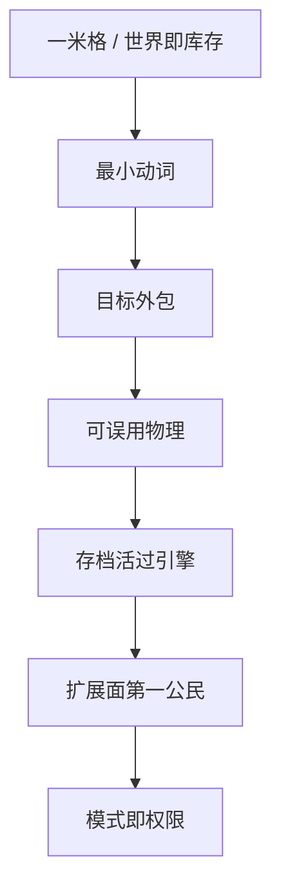

> **本章命题**：Minecraft 味里能当规则的那一部分，是可操作的一米格、能改的世界、很少的动词、外包的目标、可误用的物理、活过引擎的存档、以及被算进产品的扩展面。去掉其中一条，你可以做出更好看的方块游戏。它不再是这句话。

## 问题

「还像 Minecraft」是一句没有牙齿的话。像可以指画风、指怀旧、指主菜单的按钮排布。像也可以指：两个人仍能用「两格高留门」说话，死了家还在，粉仍能被误用成语言，别人仍能在同一份世界上立法。

要回答：去掉哪些东西，它就不再是？可被证伪的说法是：味在像素、在 C418、在某一年版本号；规则怎么换都可以，只要还叫这个名字。只要还存在高清包换皮之后口令不变、只要还存在清掉准连接被听成阉割、只要还存在创造一旦离开生存的尺就不像在玩，这句话就不成立。

上一章禁止「再做一遍」，并把产品分成四格。[《我们到底在重写什么》](/rewrite/what-to-rewrite) 本章发的是四格共享的那张骨。骨来自卷二已经写下的原语，以及卷三交出的最小内核。[《体素作为设计原语》](/design/voxel-primitive) [《可被模组的引擎才是完整产品》](/impl/modifiable-engine) 卷二第 16 章的十二条原则尚未成稿。本章按任务卡与已写论证冻结七条不变量，并与十二条的核对齐：不换核。若第 16 章写成后发生冲突，改的是本卷，并在冲突处注明。不得倒过来用尚未收束的清单给本章充数。

<Cards>
  <Card title="原语是格子" href="/design/voxel-primitive" description="16×16 可换。一米格不能换。" />
  <Card title="可误用是合同" href="/design/redstone" description="物理停在官方。语言长在外面。" />
  <Card title="最小内核六条" href="/impl/modifiable-engine" description="实现层的考生材料。" />
</Cards>

## 「Minecraft 味」哪一部分是规则

味有三层，不要搅在一口里。

**皮肤。** 默认材质、摇篮曲、主菜单全景、某一年的世界生成海报。皮肤能换。资源包换过。换完，人还在说「那一格」。皮肤不是不变量。把皮肤当骨头，重写会变成博物馆复制。博物馆可以很动人。动人的是遗产。遗产章会写保存。本章写的是还能不能继续被住、被误用、被再开发。

**口音。** Java 的准连接、Bedrock 的触控合成、某一加载器的事件名、某一版战斗冷却。口音能分叉。分叉已经发生。口音进入测试集之后很贵，贵不等于本质。本质不能只活在一边的护照上——否则另一条产品线从第一天起就不是。方法要求：删掉句中的 Java 或 Bedrock，句子对另一边仍成立，才可合写。[《体例与方法》](/prelude/method)

**规则。** 能指的格，能改的世界，很少的动词，空的目标，可阅读的因果，比 jar 活得久的存档，允许别人继续立法的扩展面。规则拿掉一条，总命题会假。假的意思很具体：居住、误用、再开发会有一个塌掉。塌掉之后，你仍可自称方块沙盒。沙盒是品类。品类不是这本书的对象。

所以「Minecraft 味」里能进考试的，只有规则。皮肤留给美术。口音留给兼容层。规则逐条写，每条都带「拿掉会怎样」。怎样必须能被资深玩家指着说：对，那已经不像了。

## 逐条不变量 + 拿掉一条会怎样

七条。少一条，你会得到另一款可能更好的游戏。七条叠上，才配继续用总命题里那个名字当考试对象。

**1. 一米可操作格子，世界即库存。** 空间是离散、可破坏、可放置、可计数的。粒度贴着身体：门两格，身一格出头。地址能说。挖下去的东西能进口袋，口袋里的东西能放回世界。拿掉它——改成连续黏土、改成不能拆的关卡网格、改成只可观赏的体素风景——口令死亡。口令死亡，建造、导航、战斗、红石不再说同一种话。更细的格会让口述变贵；更粗的格会让身体对不上缝。16×16 不是这条。一米才是。

**2. 最小动词，工地就是家。** 看、走、挖、放、合成、攻击、使用。工具放大动词，不打开职业。没有单独的建造模式：挖坑的手就是做陷阱的手。拿掉它——加建造模式、加技能树、把放置锁进编辑器——误用要跨过一道门。门一设，深度从现场挪到菜单。菜单能做出「我更强了」，做不出「这座山是我挪来的」。[《最小动词集与手感》](/design/verbs-feel) [《合成、物品与库存》](/design/crafting-inventory)

**3. 目标外包。** 世界催你，不指定你该成为谁。饥饿和黑夜是节奏，不是关卡设计师的第一关。进度是建议。龙是仪式，不是最后一关。[《生存作为意义机器》](/design/survival) [《维度、进度与终局》](/design/dimensions-endgame) 拿掉它——主线任务填满空循环、赛季清空世界、通行证驱动下一阶段——居住塌成消费。消费可以很刺激。刺激的是关卡。关卡不是家。

**4. 红石级的可误用系统。** 官方留下稳定、可观察的因果，不发玩法白名单。未被说明、甚至被当成瑕疵的行为，只要稳定、可复述、被当材料，就是社区 API。修它是立法。拿掉它——电路画在另一张图上、只给脚本、按说明书把怪癖年年擦干净——编程还在，居住者的编程不在。脚本更强，也更容易变成地图作者的游戏，而不是墙上的粉。可误用不是「必须保留准连接」这句护照。准连接是口音。不变量是：建造用的度量上，必须嵌进一份够脏、够稳、够被误用的因果。没有这份嵌进，红石会变成解谜电线。解谜电线很好。它不是这台能飞、能算、能被苦力怕炸的程序。

**5. 世界比引擎活得更久。** 存档是玩家时间。升级是翻译，不是清空。死掉东西，不摧毁柱子。拿掉它——赛季制、读不起旧档、死等于删档——居住变成一局。一局是 Infiniminer 丢掉比赛之前的形状。[《从 Infiniminer 到 Cave Game》](/history/infiniminer) 格式可以换。换的时候必须有梯子。没有梯子，伦理先于工程破产。

**6. 模组与数据包作为第一公民。** 完整产品含再开发。数据层改内容与一部分规则；系统层才能加新动词。两层缺一，作者席塌成商城或塌成破解。拿掉它——只留官方仓库、只留审核货架、只留不能切开的客户端——你得到会更新的 SKU。SKU 可以卖。卖的不是媒介。媒介要求别人能在同一份世界上继续立法。立法可以是数据包、可以是模组、可以是插件。一种都不给，产品停在演示。形状允许分叉：Java 的切口与 Bedrock 的附加包不是译本。不变量是席位，不是某一家加载器。

**7. 同一世界、同一物理上的权限，而不是四个游戏。** 生存 / 创造 / 冒险 / 旁观拧的是人，不另开一套尺。创造必须寄生于生存的格子、流体和身体。拿掉它——创造毕业成独立编辑器、冒险变成另一份关卡文件——家和工地分家。分家之后，展览更快，口令立刻裂成两种。[《创造模式不是关卡编辑器》](/design/creative-mode) 这一条与第 2 条咬合：没有建造模式，是因为权限已经够用。权限若变成四个子系统，最小动词守不住。

七条之外，还有几句设计纪律，拿掉不一定当场「不是」，但会变薄：成长尽量写在物上；程序内容的合同是可探索；不真实的物理往往更好玩；社会契约是设计的一半；新系统应增加动词而不是菜单。它们属于卷二将收束的十二条。本章不把纪律升成不变量，以免考试膨胀成口味清单。纪律可以指导后文提案。不变量只管：假了，总命题就假。

共享真实的拍、权威服务器（含连接数为 1），写在卷三最小内核里。它们是实现层的骨头，服务上面七条：没有权威，就没有「同一世界」；没有拍，可误用的因果无法复述。拍是否必须全局恰好二十，下一章才许抛。抛的时候必须保住：熔炉和活塞认同一份结算，客户端可以另有一帧钟，不能另结一份账。

<Constraint name="不变量是规则不是皮肤" verdict="地基" chain="能指的格 → 能误用的因果 → 能再开发的席">
抄走这七条，丢掉像素和某门语言，你仍可能做出这句话。抄走像素和语言，丢掉这七条，你会得到方块主题公园。主题公园可以很赚。赚不是考试通过。
</Constraint>

## 交给下一章的「非不变量」

非不变量不是垃圾。它是可以进兼容层、不该进内核的东西。进内核，重写会把口音写成宪法，四格产品会焊死在 2012 年某一夜的实现上。

交给下一章的至少有：

- **语言运行时。** Java 证明过可移植和可切开。它不是格子。Bedrock 已经换过一次。换完要另付语义税。税很重。重，仍是偶然的价格，不是骨头的证明。
- **全局恰好 20 TPS。** 共享真实要有。全世界抢同一条 50 毫秒，是规模上的一种写法。万人网络已经用核心和代理把写法撕开。撕开若毁掉红石的可解释因果，就不算成功抛弃。
- **Java / Bedrock 双端。** 两个游戏是产品史，不是设计必然。必然的是：换实现时必须说清测试集在哪一边。
- **某一份未定义行为本身。** 准连接、某一端更新顺序、火把保险丝，是可误用系统长出来的词。词可以进仿真层或兼容层。内核要留的是「允许长出词」，不是「必须保留这几个词」。把词焊进内核，继承之路会变成考古。
- **特例方块清单。** 床爆炸、船的碰撞、某一格含水的 schema，可能是深度也可能是债。债可以挪。挪的时候若把可误用一起挪走，就不算抛弃偶然，算拆迁语言。

皮肤层全部是非不变量：默认包、启动器皮肤、主菜单。换皮已经发生十几年。换皮不是重写。

下一章的纪律与本章对称：每一条「可抛弃」必须写清七条不变量如何仍活。活不成，它就还在内核里，只是你改了名字。改名字不是考试。考试是剥离。剥离之后，四格产品才知道自己共享的是什么，兼容层才知道自己在救什么。救的若是皮肤，你在做主题公园。救的若是规则，你才在重写这句话。

<Note>
卷二第 16 章若把某条纪律升格、或把某条不变量降格，以写成后的清单为准，回来改本章，并留下一句冲突说明。本章不抢收束权。收束权在十二条。十二条的核不得被本卷偷换。
</Note>

## 这一章留下什么

- **爱好者**：像不像，先问口令还在不在、家死了还在不在、粉还能不能被误用、别人还能不能改这个世界。画风可以换。这四问不能换。换了，你玩的是另一款方块游戏，哪怕启动器还印着同一个词。
- **开发者**：能抄走的是七条不变量，以及皮肤 / 口音 / 规则三层拆法。抄不走的是二十年口音已经焊进测试集——那是兼容的价，不是把准连接升成第 8 条不变量的理由。你若为了漂亮拿掉一米格、目标外包或扩展面，请把项目改名。改名是诚实。诚实之后，下一章才配谈哪些偶然可以进兼容层。
