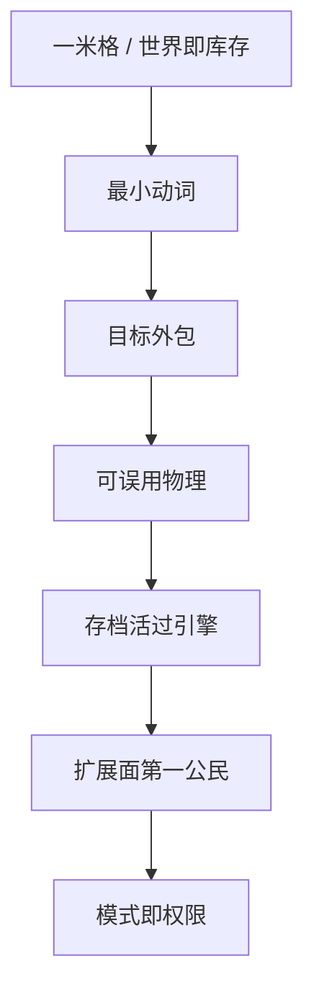

> **本章命题**：Minecraft 味里能当规则的那一部分，是可操作的一米格、能改的世界、很少的动词、外包的目标、可误用的物理、活过引擎的存档、被算进产品的扩展面，以及同一份物理上的权限而不是四个游戏。去掉其中任何一条，你仍能做出更好看的方块游戏；它只是不再是这句话所指的那个东西。

## 问题

「还像 Minecraft」是一句没有牙齿的话。像可以指画风、指怀旧、指主菜单的按钮排布。像也可以指：两个人仍能用「两格高留门」说话，死了家还在，粉仍能被误用成语言，别人仍能在同一份世界上立法。

要回答：去掉哪些东西，它就不再是？可被证伪的说法是：味在像素、在 C418、在某一个版本号上，规则怎么换都行，只要还叫这个名字。只要还有高清材质包换完皮之后玩家口令原样好使，只要还有清掉准连接被社区听成阉割，只要还有创造模式一旦离开生存的尺度就「不像在玩」，这个说法就不成立。

上一章禁止「再做一遍」，并把产品分成四格（[《我们到底在重写什么》](/rewrite/what-to-rewrite)）。本章发的是四格共享的那副骨。骨不是新造的：它来自卷二写下的原语（[《体素作为设计原语》](/design/voxel-primitive)）和卷三交出的最小内核（[《可被模组的引擎才是完整产品》](/impl/modifiable-engine)）。卷二第 16 章已经把可迁移的原则收束成十二条（[《可迁移原则清单》](/design/transferable)）；本章从十二条里冻结七条，当考试用的骨。十二条是设计合同，还包括成长写在物上、生成可探索、停手不加菜单这些纪律——纪律指导提案，不自动升格为不变量。卷四不得偷换卷二的核；后文若发现冲突，改的是本卷，并在冲突处注明。

<Cards>
  <Card title="原语是格子" href="/design/voxel-primitive" description="16×16 可换。一米格不能换。" />
  <Card title="可误用是合同" href="/design/redstone" description="物理停在官方。语言长在外面。" />
  <Card title="最小内核六条" href="/impl/modifiable-engine" description="实现层的考生材料。" />
</Cards>

## 「Minecraft 味」哪一部分是规则

味有三层，不要搅在一口里尝。

**皮肤。** 默认材质、背景音乐、主菜单全景、某一年世界生成的样子。皮肤能换：资源包换了十几年，换完，人还在说「那一格」。皮肤不是不变量。把皮肤当骨头，重写会变成博物馆复制。博物馆可以很动人，动人的是遗产；遗产怎么保存，卷一写过。本章问的是它还能不能继续被住、被误用、被再开发。

**口音。** Java 的准连接、Bedrock 的触控合成、某一加载器的事件名、某一版的战斗冷却。口音能分叉，分叉已经发生。口音一旦进入测试集就很贵，但贵不等于本质。本质不能只活在一边的护照上，否则另一条产品线从第一天起就不算 Minecraft。方法章的规则在这里直接可用：删掉句中的「Java」或「Bedrock」，句子对另一边仍成立，才可以合写（[《体例与方法》](/prelude/method)）。

**规则。** 能指的格、能改的世界、很少的动词、空着的目标、可阅读的因果、比引擎活得久的存档、允许别人继续立法的扩展面。规则拿掉一条，总命题就会假；假的意思很具体：住进去、玩出设计之外、再开发三者里会塌掉一个。塌掉之后，你仍可以自称方块沙盒。沙盒是品类，品类不是这本书的对象。

所以「Minecraft 味」里能进考试的只有规则这一层。皮肤留给美术，口音留给兼容层。规则逐条写，每条都带「拿掉会怎样」；那个「怎样」必须能让资深玩家指着说：对，到这一步已经不像了。

## 逐条不变量 + 拿掉一条会怎样

七条。少一条，你会得到另一款可能更好的游戏；七条叠在一起，才配继续用总命题里的那个名字当考试对象。七条不是凭空挑的，它们逐条对得上卷二第 16 章的十二条；对不进来的那几条，本章明确降回纪律。

| 本章不变量 | 在卷二十二条里的出处 |
| --- | --- |
| 1. 一米可操作格子，世界即库存 | 第 2 条「世界即库存」（一米粒度是它的前提） |
| 2. 最小动词 | 第 1 条「最小动词，深度来自组合」 |
| 3. 目标外包 | 第 3 条 |
| 4. 红石级的可误用系统 | 第 4 条「可误用系统」 |
| 5. 世界比引擎活得更久 | 第 11 条 |
| 6. 模组与数据包作为第一公民 | 第 10 条「模组 / 数据驱动是第一公民」 |
| 7. 模式即权限，不是四个游戏 | 第 8 条「模式是权限，不是四个游戏」 |

留在十二条里、本章不升格的五条：成长附着于物（第 5）、程序内容合同是可探索（第 6）、约束即深度（第 7）、社会契约是设计的一半（第 9）、新系统加动词不加菜单（第 12）。

**1. 一米可操作格子，世界即库存。** 空间是离散的：可破坏、可放置、可计数。粒度贴着身体——门两格高，人一格出头。每个格子报得出坐标，挖下来的东西能进口袋，口袋里的东西能放回世界。拿掉它——改成连续的黏土、改成不能拆的关卡网格、改成只可远观的体素风景——玩家口令里的地址就作废了。地址一作废，建造、导航、战斗、红石不再说同一种话。格子更细，口述变贵；格子更粗，身体对不上缝。注意，16×16 的区块不是这条不变量，一米才是：区块是存储的裁切，可以再议；一米是度量衡，动它就是动语言。

**2. 最小动词，工地就是家。** 看、走、挖、放、合成、攻击、使用。工具放大动词，不制造职业；没有单独的建造模式，挖坑的手就是做陷阱的手。拿掉它——加建造模式、加技能树、把放置锁进编辑器——每一次误用都要先跨过一道界面。门一设，深度就从现场挪进菜单。菜单能给人「我变强了」的感觉，给不了「这座山是我挪的」（[《最小动词集与手感》](/design/verbs-feel)、[《合成、物品与库存》](/design/crafting-inventory)）。

**3. 目标外包。** 世界催你，不指定你该成为谁。饥饿和黑夜是节奏，不是关卡设计师的第一关；进度是建议，龙是仪式，不是最后一关（[《生存作为意义机器》](/design/survival)、[《维度、进度与终局》](/design/dimensions-endgame)）。拿掉它——主线任务填满空循环、赛季清空世界、通行证驱动下一阶段——居住塌成消费。消费可以很刺激，刺激的是关卡，关卡不是家。

**4. 红石级的可误用系统。** 官方留下稳定、可观察的因果，不发玩法白名单。没写进说明书、甚至被当成瑕疵的行为，只要稳定、可复述、被社区当材料用，就是社区 API；修它等于立法。拿掉它——电路画在另一张图上、只给脚本、怪癖按说明书年年擦干净——编程还在，居住者的编程没了。脚本更强，也更容易把游戏变成地图作者的作品，而不是墙上那台粉机器。注意，可误用不等于「必须保留准连接」：准连接是 Java 一侧的口音。不变量是：建造所用的那把度量上，必须长着一份足够脏、足够稳、够被误用的因果。没有这份因果，红石会退化成解谜电线。解谜电线很好，它不是这台能飞、能算、能被苦力怕炸的程序。

**5. 世界比引擎活得更久。** 存档是玩家投入的时间。版本升级是翻译，不是清空；东西会死，柱子不塌。拿掉它——赛季制、读不起旧档、死亡等于删档——居住变成一局，而「一局」正是 Cave Game 当初从 Infiniminer 那里减掉的东西：把比赛装回世界，居住就退回了原型（[《从 Infiniminer 到 Cave Game》](/history/infiniminer)）。格式可以换，换的时候必须有梯子；没有梯子，这条伦理比任何工程都先破产。

**6. 模组与数据包作为第一公民。** 完整产品含再开发：数据层改内容与一部分规则，系统层才能加新动词；两层缺一，作者席塌成商城或塌成破解。拿掉它——只留官方仓库、只留审核货架、只留切不开的客户端——你得到一个会持续更新的 SKU。SKU 可以卖，卖的却不是媒介；媒介要求别人能在同一份世界上继续立法。立法可以是数据包、可以是模组、可以是插件，一种都不给，产品停在演示。形状允许分叉：Java 的切口与 Bedrock 的附加包不是互相的译本。不变量是席位，不是某一家加载器。

**7. 同一世界、同一物理上的权限，而不是四个游戏。** 生存、创造、冒险、旁观拧的是同一份世界上的权限旋钮，不另开一套物理尺；创造必须寄生于生存的格子、流体和身体。拿掉它——创造毕业成独立编辑器、冒险变成另一份关卡文件——家和工地分家。分家之后，展览确实更快，玩家口令立刻裂成两种（[《创造模式不是关卡编辑器》](/design/creative-mode)）。这一条与第 2 条咬合：之所以不需要建造模式，是因为权限已经够用；权限一旦裂成四个子系统，最小动词就守不住。

七条之外还有几句设计纪律，拿掉不一定当场「不是」，但会变薄：成长尽量写在物上，程序内容的合同是可探索，不真实的物理往往更好玩，社会契约是设计的一半，新系统应增加动词而不是菜单。它们全部留在卷二那十二条里，本章不把纪律升成不变量，以免考试膨胀成口味清单。纪律可以指导后文的提案；不变量只管一件事：它假了，总命题就假。

「共享真实的刻」与「权威服务器（连接数为 1 时也算）」写在卷三的最小内核里。它们是实现层的骨头，托着上面七条：没有权威，就没有「同一世界」；没有刻，可误用的因果无法复述。刻是否必须是全局恰好二十，下一章才许动。动的时候必须保住：熔炉和活塞认同一份结算，客户端可以另有一只帧率钟，不能另结一份账。

<Constraint name="不变量是规则不是皮肤" verdict="地基" chain="能指的格 → 能误用的因果 → 能再开发的席">
抄走这七条、丢掉像素和某门语言，你仍可能做出这句话所指的东西。抄走像素和语言、丢掉这七条，你得到的是方块主题公园。主题公园可以很赚，赚不是考试通过。
</Constraint>

## 交给下一章的「非不变量」

非不变量不是垃圾。它是可以进兼容层、不该进内核的东西。塞进内核，重写会把口音写成宪法，把四格产品焊死在 2012 年某一夜的实现上。

交给下一章的至少有：

- **语言运行时。** Java 证明过可移植和可切开，它是历史答案，不是格子本身。Bedrock 已经换过一次语言，换完另付了语义税。税再重，也只是偶然的价格，不是骨头的证明。
- **全局恰好 20 TPS。** 共享真实必须要有；「全世界抢同一条五十毫秒」只是把共享真实落成规模的一种写法。万人网络已经用多核心、多代理把这种写法撕开了。撕开若毁掉红石的可解释因果，就不算成功抛弃。
- **Java / Bedrock 双端。** 两个引擎并存是产品史，不是设计必然。必然的只有一句：换实现时，必须说清语义测试集在哪一边。
- **某一组具体的未定义行为。** 准连接、某一端的更新顺序、红石火把的过载熄灭，是可误用系统长出来的词。词可以进仿真层或兼容层；内核要留的是「允许长出新词」，不是「必须保留这几个旧词」。把旧词焊进内核，继承之路会变成考古。
- **特例方块清单。** 床在下界爆炸、船的碰撞、一格能不能同时含水，可能是深度也可能是债。债可以挪；挪的时候若把可误用一起挪走，那不叫抛弃偶然，叫拆迁语言。

皮肤层全部是非不变量：默认材质包、启动器外观、主菜单。换皮发生了十几年，换皮不是重写。

下一章的纪律与本章对称：每一条「可抛弃」必须写清七条不变量如何继续成立。写不清，它就还在内核里，只是改了名字——改名字不是考试，剥离才是。剥离之后，四格产品才知道自己共享的是什么，兼容层才知道自己在救什么。救的若是皮肤，你在做主题公园；救的若是规则，你才在重写这句话。

<Note>
十二条是设计合同，七条不变量与之逐条对齐，不换核。五条纪律留在十二条里，本章不增设第 8 条不变量。
</Note>

## 这一章留下什么

- **爱好者**：判断像不像，先问四件事——玩家口令还在不在、家死了之后还在不在、粉还能不能被误用、别人还能不能接着改这个世界。画风可以换，这四问不能换；换了，你玩的是另一款方块游戏，哪怕启动器上还印着同一个名字。
- **开发者**：能抄走的是七条不变量，以及皮肤 / 口音 / 规则的三层拆法。抄不走的是二十年口音已经焊进测试集——那是走兼容路的价，不是把准连接升格成第 8 条不变量的理由。你若为了漂亮拿掉一米格、目标外包或扩展面，请给项目改名。改名是诚实；诚实之后，下一章才配谈哪些偶然可以进兼容层。
