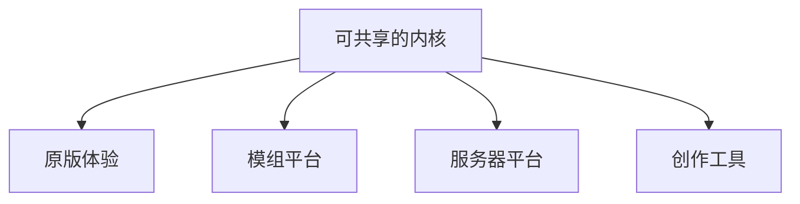

> **本章命题**：四者不能互相替代。重写若从「再做一遍 Minecraft」起笔，会在四个产品里迷路，再用语言选择假装自己已经选边。本卷是考试：先问你要重写哪一层，再问你走兼容还是继承。不是开工令。

## 问题

「重写 Minecraft」是一句听起来已经完成的话。它通常还没开始问：重写的是货架上那个客户端，还是加载器河，还是万人服那台拍，还是工地上那套选区？四件事都能叫 Minecraft。四件事不能互相替代。替代一次，你会得到一个更干净的仓库，和一群找不到家的人。

要回答：四者能否互相替代？可被证伪的说法是：把原版体验做完整，模组、服务器和工具会自动长出来；或者反过来，做一个更强的编辑器 / 更强的 API / 更快的核心，玩家会觉得自己还在玩同一款游戏。只要还存在创造模式不能顶替 WorldEdit、只要还存在原版服务端撑不起大厅、只要还存在没有加载器就进不去的工业世界，这句话就不成立。

前三卷已经把对象钉过一遍。它不是关卡，是允许被居住、误用、再开发的规则。[《全书的命题》](/prelude/thesis) 卷三把完整产品写成游戏、协议、数据、工具链叠在同一份世界上。[《可被模组的引擎才是完整产品》](/impl/modifiable-engine) 本章把那张图转成考试题：你到底要重写哪一格。禁止从这一章读出「用某语言开工」。语言是下一章才允许松开的偶然，不是本题的答案。

<Cards>
  <Card title="完整产品含再开发" href="/impl/modifiable-engine" description="客户端只是入口。" />
  <Card title="创造不是编辑器" href="/design/creative-mode" description="权限与工具不是同一层。" />
  <Card title="服务器即新游戏" href="/history/servers" description="立法权不在 jar 里。" />
</Cards>

## 先禁止「再做一遍 Minecraft」

再做一遍，假定存在一份可以复印的原件。原件不存在。Java 与 Bedrock 已经是两份因果。[《两条产品线：Java 与 Bedrock》](/history/java-bedrock) Wiki 上的红石和游戏里的粉又不是一回事。[《红石：把物理做成编程》](/design/redstone) 货架 SKU、整合包、Hypixel、家庭档，口头都叫 Minecraft，运行时不是同一个产品。

再做一遍还有一句更软的变体：做得更现代、更真实、更顺手，于是「这才是它本来该有的样子」。现代化是卷二会写的停手问题。这里只要挡住开工姿态。姿态会把二十年墙上的测试集听成历史错误，把第二条作者席听成还没来得及做进正作的功能。听成功能之后，重写的第一天就会把准连接清掉、把领地做进内核、把建造做成编辑器。三件事各自可以成立。三件事叠在「再做一遍」里，会做出另一款方块游戏。另一款可以很好。它不是考试对象。

禁止的不是重写。禁止的是不界定对象的重写。对象一旦是「那个叫 Minecraft 的感觉」，感觉没有证伪条件。对象必须落到产品层：你要让人住进去，还是让人改物理，还是让人立法，还是让人在运行时修地形。层可以合作。层不能合并成一个仓库名，然后宣称问题解决了。

## 四产品矩阵

同一引擎上至少住过四个产品。它们共用格子，不共用成功标准。

| 产品 | 它卖的是什么 | 缺了它会怎样 | 不能被谁替代 |
| --- | --- | --- | --- |
| 原版体验 | 可住的规则：挖、放、看，世界比命长 | 剩下工具和大厅，没有家 | 模组加不满「默认世界还叫这个」 |
| 模组平台 | 第二作者席：能加动词、加系统 | 剩下官方内容包，再开发塌成商城或破解 | 原版数据包加不出第二种挖掘 |
| 服务器平台 | 同一套挖和放上的政体：法律、规模、重置 | 剩下单人档和局域网，万人用法消失 | 客户端再快也立法不了 |
| 创作工具 | 运行时或离线的工地加速：选区、结构、预览 | 剩下那只手，大世界会极慢 | 创造权限不是编辑器 |

**原版体验**是居住。它要求格子还能指，门还是两格，创造仍寄生在生存的尺上，死了世界还在。[《体素作为设计原语》](/design/voxel-primitive) [《生存作为意义机器》](/design/survival) 它不要求 Sodium，不要求 Paper，不要求 Axiom。要求这些的人，已经站到别的产品里。站过去可以。站过去之后，不要回头说原版体验「不完整所以失败」。完整在合同上，不在帧数上。

**模组平台**是再开发里改物理的那一层。Forge 与 Fabric 是两扇门，不是两款更好的 Minecraft。[《模组与插件架构》](/impl/mod-architecture) 数据包是官方温和河，停在新动词之前。[《数据包、资源包与数据驱动》](/impl/datapacks) 把模组平台做成「原版加内容商店」，你会得到审核友好的货架，失去工业包那种无法上架的系统。Bedrock 已经演示过窄法。[《Bedrock 作为另一次实现》](/impl/bedrock)

**服务器平台**是再开发里改法律和规模的那一层。原版专用服务端能跑十人。万人网络是另一种引擎用法。[《服务端与规模》](/impl/servers) Hypixel 不是原版体验的 DLC。它是寄生在门票上的另一款游戏。[《服务器即新游戏》](/history/servers) 把服务器平台做成「更好的单人暂停」，你会失去城邦。城邦可以很脏。脏不是理由把它并回客户端。

**创作工具**是加速共同作者，不能顶替创造当居住权限。创造取消稀缺，不取消格子和身体。编辑器取消身体，导出另一份文件。工具可以很强。强完仍要写回同一套方块 ID。写不回，工地搬走了。这一层的细节卷二后文会写。本章只要：工具层与权限层叠在同一存档上，不等于它们是同一个产品。

四格可以共享内核。共享不是替代。替代的幻觉通常长这样：我把编辑器做强，就不需要创造模式；我把 API 做稳，就不需要原版还好玩；我把核心做快，就不需要插件河；我把原版做满，就不需要第二作者。每一句都在用一个产品的成功标准，去验收另一个产品。验收会通过。通过的是仓库。失败的是住在另外三格里的人。

<Callout type="warning" title="不得开始选语言">
矩阵不是技术选型表。C++、Java、Rust、字节码、Lua，都不能从这一节读出来。先选语言的人，是在用偶然回答本质。偶然下一章才许谈。
</Callout>

## 兼容 vs 继承：两条路

「兼容 Minecraft」和「继承其思想」不是程度差。它们是两条路。路一混，考试会变成既要读十年存档、又要丢掉准连接、还要宣称还是同一句话。

**兼容**认测试集。旧档能开，协议能握手，飞行器还能飞，整合包的切口还对得上。兼容的对象是已经写下的时间：箱子、墙、Wiki、加载器矩阵。[《存储与序列化》](/impl/storage) [《红石的实现》](/impl/redstone) 兼容很贵。贵，因为它把偶然焊进范围。焊进去之后，Java 虚拟机、包形状、更新顺序都不再免费可抛。可抛，但要另写兼容层。层是后文的题。本题只要：走兼容，你是在重写一份活着的文明的运行时。文明比你的仓库大。

**继承**认不变量。格子还能指，世界还能改，目标还外包，系统还能被误用，存档还能比引擎活，第二作者席还在。继承可以换语言、换协议、换掉准连接、换掉全局 20 TPS。换完，口令可能还在，墙上的旧程序会停。停，是立法。立法时不要说「我们更诚实所以还是 Minecraft」。诚实是一回事。护照是另一回事。继承之路产出的是思想实验里的新引擎，或另一款方块游戏。它可以很配总命题。它不必能进 2012 年那份存档。

两条路都合法。合法的前提是写在封面上。封面写兼容，却把红石清成电路课，是欺诈。封面写继承，却用商标和主菜单骗玩家「你的家还在」，也是欺诈。Bedrock 用品牌走了一条像兼容、语义上像继承失败的路：内容对齐，因果分叉。分叉比跑分致命。致命，是因为玩家以为自己买的是同一句话。

Java 与 Bedrock 不能在这里合成第三条「全兼容全继承」。全，等于两份测试集。两份测试集没有一份共同的未定义行为宪法。没有宪法，全是口号。

## 失败样本

失败不是「卖得不好」。失败是：抄了能看见的皮，丢掉了让皮活着的那一层，还宣称自己在重写。

第一种，**任务把空填满。** 格子还在，画风还在，第一晚变成教程关，第二天变成技能树。深度从组合挪到菜单。菜单可以很好玩。好玩的是 RPG。RPG 不是目标外包。[《最小动词集与手感》](/design/verbs-feel) 每年都有这样的方块生存。它们证明画风可抄。它们不证明媒介可抄。

第二种，**建造搬进编辑器。** 世界更光滑，笔刷更强，导出更快。住回去的时候，尺已经不是那把。口令作废。创造章写过证伪句：去掉生存的方块、尺度和物理，若玩家仍觉得在玩 Minecraft，命题要改。至今，官方自己都把更强的编辑做成另一套工具，不是游戏模式。

第三种，**兼容当宗教，思想当装饰。** 协议对齐到能进某个版本的服，红石却被清成「正确信号」，扩展面收成商城。表面上比克隆更像。结构上它走的是货架。货架能繁荣。繁荣的不是再开发。

不点名鞭尸。点名会变成排行榜。排行榜是卷一竞争章的禁区。这里要的是机制类型：皮可以像，骨在格子的可操作性、目标的空、物理的可误用、作者席的位置。骨一丢，克隆无论多勤快，都只是又一次 Infiniminer——赛场还在，比赛被换成了别的目标，居住没有发生。

<Alternative title="若四格并成一个超级客户端">
编辑器、API、大厅、生存家装在同一个主菜单里，用权限开关切换。你得到更短的安装说明。你失去的是：每一格产品自己的成功标准。大厅会要求重置，家会要求不重置，API 会要求稳定，原版会要求能改内部形状。开关假装解决了冲突。冲突会在第一份万人存档里回来。
</Alternative>

## 局部重写已经发生

考试不是从零开始的思想实验。现场已经有答卷，只是答在不同的格子上。

**Paper** 重写的是服务器平台上的点名策略。它还债，尽量不改挖和放的合同。改口型的时候，生存服会冻版本——那就是局部重写的账单。[《服务端与规模》](/impl/servers)

**Fabric** 重写的是模组平台的加载哲学：薄启动器，电池另装。Forge 是另一份已经发生的平台立法。两边都不替代原版体验。两边都在证明：第二作者席可以换门，不能从产品图上撕掉。[《模组与插件架构》](/impl/mod-architecture)

**Sodium** 重写的是看见。纪律是「这一格看起来还是那一格」。纪律一破，它就毕业成另一款游戏的显示器。[《客户端与渲染》](/impl/client-render)

**Minetest（后更名为 Luanti）** 重写的是引擎层：开源体素运行时，Lua 当扩展面，上面再跑各种游戏包。[^luanti] 它继承了「世界由格子构成、能挖能放、能被模组」。它没有继承 Java 的红石教科书、也没有继承那份十年箱子的护照。这是继承之路上已经交卷的样本。样本成功与否，不看它像不像主菜单，看它是否还承认第二作者席。承认，它就是局部重写。不承认，它只是又一个客户端。

**Bedrock** 是换语言已经发生过的那一次。它证明语言可抛。它同时证明：抛的时候若没有同一份语义测试集，品牌会把分叉藏进「同一款游戏」。局部重写可以诚实。诚实的写法是：我们改了哪一格，哪一格的测试集作废。

这些答卷禁止两种读法。一种把它们当成「官方无能的补丁」，于是重写只要把补丁吃进正作。吃进正作是加法，加法会把利息记回第一作者——上一章写过。一种把它们当成「已经重写完了」，于是本卷不必考。没有考完。它们只覆盖矩阵的一格或两格。四格同时继承、又对旧档兼容，现场还没有这样的交卷。没有，不是邀请你去交。没有，是题目还成立。

## 本卷是考试，不是开工令

考试的产出是本质属性清单：拿掉哪些，总命题会假；留下哪些偶然，要另写兼容层。清单若永不被任何团队执行，仍然值得有。值得，是因为它是看清原作的方法，不是新游戏的立项书。[《全书的命题》](/prelude/thesis)

开工令会长出预算、语言、里程碑、兼容承诺。那些东西会逼你在考完之前选边。选边之后，不变量会变成倒推：凡是你已经写的，都是本质；凡是你不想养的，都是债。倒推是情怀的工程版。方法章不允许情怀当推理规则。[《体例与方法》](/prelude/method)

因此本卷的禁令很短：

- 不得用「再做一遍」代替产品层选择。
- 不得用一个产品替代另外三个。
- 不得把兼容和继承写成同一条路。
- 不得在不变量写清之前选语言、选公司、选商标。
- 不得把局部重写当成全文答案。

下一章开始发卷心：去掉哪些东西，它就不再是。再下一章把偶然从内核里搬到兼容层。搬的时候必须说清不变量怎么活。活不成，偶然就还不是偶然。那是考试的牙齿。牙齿不指向仓库。牙齿指向总命题还在不在。

## 这一章留下什么

- **爱好者**：有人说要重写，你先问他重写的是家、模组、服务器还是工地。四件事都能叫 Minecraft，不能互相顶替。你的十年档走的是兼容；下一款方块游戏走的是继承。两条路都正经。正经的前提是别骗你「还是同一份家」。
- **开发者**：能抄走的是四产品矩阵，以及兼容 / 继承必须写在封面上。抄不走的是已经发生的局部答卷（Paper、Fabric、看见层、Luanti、Bedrock）各自只覆盖一格。你不得从本章带走语言和开工日期。你若现在就「再做一遍」，你做的是克隆。克隆抄皮。考试抄骨。骨在下一章。

[^luanti]: Minetest 于 2024 年起更名为 Luanti，定位为开源体素游戏引擎，模组与游戏包使用 Lua API。见 <https://www.luanti.org/en/>；源码 [luanti-org/luanti](https://github.com/luanti-org/luanti/)。它继承「格子可挖可放、能被模组」，不继承 Java 红石测试集与十年存档护照。这是继承之路上的局部重写，不是官方继任。
