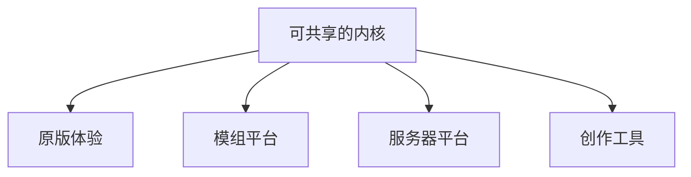

> **本章命题**：四者不能互相替代。重写若从「再做一遍 Minecraft」起笔，会在四个产品里迷路，再用语言选择假装自己已经选边。本卷是考试：先问你要重写哪一层，再问你走兼容还是继承。不是开工令。

## 问题

「重写 Minecraft」听起来像一句已经说清的话。它通常还没开始问：要重写的是货架上那个客户端，是让模组得以存在的加载器河，是撑起万人服的那台服务端，还是工地上那套选区工具？这四件事都能叫 Minecraft，却不能互相替代。替代一次，你会得到一个更干净的仓库，和一群找不到家的人。

要回答：四者能否互相替代？可被证伪的说法是：把原版体验做完整，模组、服务器和工具会自己长出来；或者反过来，做一个更强的编辑器、更强的 API、更快的核心，玩家就会觉得自己还在玩同一款游戏。只要创造模式仍然顶不了 WorldEdit 的活，只要原版服务端仍然撑不起一座大厅，只要仍然有整片模组世界不装加载器就进不去，这个说法就不成立。

前三卷已经把对象钉过一遍：它不是通关即弃的内容，是一套能住进去、能玩出设计之外、还能被再开发的系统（[《全书的命题》](/prelude/thesis)）。卷三又把完整产品写成游戏、协议、数据、工具链叠在同一份世界上（[《可被模组的引擎才是完整产品》](/impl/modifiable-engine)）。本章把那张图转成考试题：你到底要重写哪一格。禁止从这一章读出「用某语言开工」——语言是本卷后面才允许松开的偶然，不是本题的答案。

<Cards>
  <Card title="完整产品含再开发" href="/impl/modifiable-engine" description="客户端只是入口。" />
  <Card title="创造不是编辑器" href="/design/creative-mode" description="权限与工具不是同一层。" />
  <Card title="服务器即新游戏" href="/history/servers" description="立法权不在 jar 里。" />
</Cards>

## 先禁止「再做一遍 Minecraft」

再做一遍，假定存在一份可以复印的原件。原件不存在。Java 与 Bedrock 已经是两份因果（[《两条产品线：Java 与 Bedrock》](/history/java-bedrock)），Wiki 上的红石和游戏里的粉又不是一回事（[《红石：把物理做成编程》](/design/redstone)）。货架 SKU、整合包、Hypixel、家庭档，口头都叫 Minecraft，运行时不是同一个产品。

再做一遍还有一个更软的变体：做得更现代、更真实、更顺手，于是「这才是它本来该有的样子」。现代化到哪儿该停手，卷二已经给过判据；本章只要挡住这个开工姿态。这个姿态会把二十年墙上仍在运转的机器听成「历史错误」，把第二条作者席听成「还没来得及做进正作的功能」。一旦这么听，重写的第一天就会把准连接清掉、把领地做进内核、把建造做成编辑器。这三件事分开看各有各的论证：清怪癖是一场红石立法，社会功能下沉是本卷自己的题，编辑器官方也已经做了一版。但三件事叠在「再做一遍」里一天做完，你得到的是另一款方块游戏。另一款可以很好，它不是这场考试的对象。

禁止的不是重写，禁止的是不界定对象的重写。对象一旦是「那个叫 Minecraft 的感觉」，感觉没有证伪条件。对象必须落到产品层：你要让人住进去，还是让人改物理，还是让人立法，还是让人在运行时里修地形。层与层可以合作，不能合并成一个仓库名，然后宣称问题解决了。

## 四产品矩阵

同一套引擎上住着至少四个产品。它们共用格子，不共用成功标准。

| 产品 | 它提供什么 | 缺了它会怎样 | 不能被谁替代 |
| --- | --- | --- | --- |
| 原版体验 | 可居住的规则：挖、放、看，世界比命长 | 只剩工具和大厅，没有家 | 模组加得再多，「默认世界还是这个家」也加不出来 |
| 模组平台 | 第二作者席：能加动词、加系统 | 再开发塌成官方内容包，或塌成商城与破解 | 数据包加不出第二种挖掘 |
| 服务器平台 | 同一套挖和放之上的政体：法律、规模、重置 | 只剩单人档和局域网，万人用法消失 | 客户端再快，也替万人服立不了法 |
| 创作工具 | 运行时内或离线的工地提速：选区、结构、预览 | 只剩那只手，大工程慢到做不动 | 创造模式的权限，顶不了编辑器的活 |

**原版体验**是居住。它要求格子还能指，门还是两格高，创造仍寄生在生存的尺度上，死了世界还在（分别见[《体素作为设计原语》](/design/voxel-primitive)与[《生存作为意义机器》](/design/survival)）。它不要求 Sodium，不要求 Paper，不要求 Axiom；要求这些的人，已经站到别的产品格里去了。站过去可以，站过去之后不要回头说原版体验「不完整所以失败」。这一格的完整写在合同上，不在帧数上。

**模组平台**是再开发里改物理的那一层。Forge 与 Fabric 是进这一层的两扇门，不是两款更好的 Minecraft（架构见[《模组与插件架构》](/impl/mod-architecture)）。数据包是官方修的一条温和的河，停在新动词之前（[《数据包、资源包与数据驱动》](/impl/datapacks)）。把模组平台做成「原版加内容商店」，你会得到一个审核友好的货架，同时失去工业包那种永远无法上架的系统。这条路收窄之后长什么样，Bedrock 已经演示过（[《Bedrock 作为另一次实现》](/impl/bedrock)）。

**服务器平台**是再开发里改法律和规模的那一层。原版专用服务端够十人小服诚实运转；万人网络是同一条河的另一种引擎用法（[《服务端与规模》](/impl/servers)）。Hypixel 不是原版体验的资料片，它是凭门票进场、另立法律的另一款游戏（[《服务器即新游戏》](/history/servers)）。把服务器平台做成「更好的单人暂停」，你会失去城邦。城邦可以很乱，乱不是把它并回客户端的理由。

**创作工具**是给共同作者提速的那一层。它顶替不了创造模式，因为创造模式管的是权限，工具管的是速度。创造取消稀缺，不取消格子和身体；编辑器取消身体，导出另一份文件。工具可以很强，强完仍要写回同一套方块——写不回去，工地就从世界里搬走了。这一层的细节本卷后面有一章专写（[《渲染与创作工具》](/rewrite/render-tools)）。本章只要一句：工具层与权限层叠在同一份存档上，不等于它们是同一个产品。

四格可以共享内核。共享不是替代。替代的幻觉通常长这样：我把编辑器做强，就不需要创造模式；我把 API 做稳，就不需要原版好玩；我把核心做快，就不需要插件河；我把原版做满，就不需要第二作者。每一句都在用一个产品的成功标准，去验收另一个产品。验收会通过——通过的是仓库；失败的是住在另外三格里的人。

<Callout type="warning" title="不得开始选语言">
矩阵不是技术选型表。C++、Java、Rust、字节码、Lua，哪一个都读不出来。先选语言的人，是在用偶然回答本质。偶然要等不变量写清、非不变量交出去之后才许谈。
</Callout>

## 兼容 vs 继承：两条路

「兼容 Minecraft」和「继承其思想」不是程度上的差别，是两条路。路一旦混着走，考试会变成：既要能读十年前的存档，又要丢掉准连接，还要宣称自己仍然是同一句话。三个要求互相打架。先说清走哪条，才不会同时许下做不到的愿。

**兼容**认测试集。旧档能开，协议能握手，飞行器还能飞，整合包的切口还对得上。兼容的对象是已经写下的时间：箱子、墙、Wiki、加载器矩阵（存档这边的账在[《存储与序列化》](/impl/storage)，红石这边的账在[《红石的实现》](/impl/redstone)）。兼容很贵，贵在它把偶然一并焊进了产品范围：Java 虚拟机、包的形状、更新顺序，从此都不再是免费可抛的东西。仍然可抛，但要先写好兼容层——层是本卷后面的题。本题只要说清一件事：走兼容，你重写的是一份还活着的文明的运行时，而文明比你的仓库大。

**继承**认不变量。格子还能指，世界还能改，目标还外包，系统还能被误用，存档还能比引擎活得久，第二作者席还在——认的是这些。继承之路可以换语言、换协议、换掉准连接、换掉全局 20 TPS。换完，玩家共同语言里的词可能还在，墙上那批按旧语义写下的程序会停。停，就是立法。立法的时候不要说「我们更诚实，所以还是 Minecraft」：诚实是一回事，护照是另一回事。继承之路产出的是思想实验里的新引擎，或者另一款方块游戏。它可以非常符合总命题，但它不必能打开 2012 年那份存档。

两条路都合法，合法的前提是写在封面上。封面写兼容，却把红石清成电路课，是欺诈；封面写继承，却用商标和主菜单骗玩家「你的家还在」，也是欺诈。Bedrock 走的就是一条没写清封面的路：品牌上像兼容——同一个名字、对齐的内容；语义上却是没把旧语义全带走的继承——内容对齐，因果分叉。分叉比跑分致命，因为玩家以为自己买的是同一句话。

Java 与 Bedrock 也不能在这里合成第三条「全兼容又全继承」的路。「全」意味着同时背两份测试集，而两份测试集之间没有一部共同的未定义行为宪法。没有宪法，剩下全是口号。

## 失败样本

失败不是「卖得不好」。失败是：抄走了看得见的皮，丢掉了让皮活着的那一层，还宣称自己在重写。

第一种，**用任务把空填满。** 格子还在，画风还在，第一晚被改成教程关，第二天变成技能树，深度从格子上的组合挪进了菜单。菜单可以很好玩，好玩的是 RPG；RPG 不是目标外包（[《最小动词集与手感》](/design/verbs-feel)）。每年都有这样的方块生存游戏上市。它们证明画风可抄，不证明媒介可抄。

第二种，**把建造搬进编辑器。** 世界更光滑，笔刷更强，导出更快。但住回去的时候，量世界的尺已经不是原来那把，玩家口令里的地址跟着作废。创造模式那章写过证伪句：去掉生存的方块、尺度和物理之后，若玩家仍觉得在玩 Minecraft，那句话要改。至今官方自己也把更强的编辑能力做成另一套工具，而不是一种游戏模式——这条线他们没有跨。

第三种，**把兼容当宗教、思想当装饰。** 协议对齐到能进某个版本的服，红石却被清成「正确信号」，扩展面收成商城。表面上比克隆更像原作，结构上走的还是货架。货架能繁荣，繁荣的不是再开发。

这里不点名。点名会把类型写成排行榜，排行榜是卷一竞争章定过的禁区。这里要的是机制类型：皮可以像，骨在格子的可操作性、目标的空、物理的可误用、作者席的位置。骨一丢，克隆再勤快，也只是一次 Infiniminer 的重演——赛场还在，比赛被换成了别的目标，居住没有发生。

<Alternative title="若四格并成一个超级客户端">
编辑器、API、大厅、生存装进同一个主菜单，用权限开关切换。你得到更短的安装说明。你失去的是每一格产品自己的成功标准：大厅要求重置，家要求不重置，API 要求稳定，原版要求内部形状仍能被改。开关假装解决了冲突，冲突会在第一份万人存档里回来。
</Alternative>

## 局部重写已经发生

考试不是从零开始的思想实验。现场已经有答卷，只是各答在不同的格子上。

**Paper** 重写的是服务器平台上的点名策略。它在还原版的性能债，并且尽量不动挖和放这份合同。可一旦改动碰到点名的语义——农场产量变了、红石时序变了——生存服的选择是冻结版本。那份冻结，就是局部重写开出的账单（[《服务端与规模》](/impl/servers)）。

**Fabric** 重写的是模组平台的加载哲学：启动器做得很薄，模组要另外安装。Forge 则是同一层上另一份已经发生的平台立法。两边都不替代原版体验，两边共同证明：第二作者席可以换门，不能从产品图上撕掉（[《模组与插件架构》](/impl/mod-architecture)）。

**Sodium** 重写的是「看见」这一层。它的纪律是：渲染可以全部重写，游戏语义一格都不能变——优化前能飞的机器，优化后必须还能飞。纪律一破，它就毕业成另一款游戏的显示器（[《客户端与渲染》](/impl/client-render)）。

**Minetest（后更名为 Luanti）** 重写的是引擎层：开源的体素运行时，用 Lua 当扩展面，上面再跑各种游戏包。[^luanti] 它继承了「世界由格子构成、能挖能放、能被模组」，没有继承 Java 的红石教科书，也没继承那份十年箱子的护照。这是继承之路上已经交卷的样本。样本成功与否，不看它像不像原作的主菜单，看它是否还承认第二作者席：承认，它就是局部重写；不承认，它只是又一个客户端。

**Bedrock** 是换语言已经发生过的那一次。它证明语言可抛，也证明：抛的时候若没有携带同一份语义测试集，品牌就会把分叉藏进「同一款游戏」的说法里。局部重写可以诚实，诚实的写法是：我们改了哪一格，哪一格的测试集作废。

这些答卷有两种禁止的读法。一种把它们当成「官方无能的补丁」，于是重写只需把补丁吃进正作。吃进正作是加法，而加法会把维护的利息记回第一作者账上——卷三把这笔账写成过产品策略（[《技术债作为产品策略》](/impl/tech-debt)）。另一种把它们当成「已经重写完了」，于是本卷不必考。也没有考完：它们各自只覆盖矩阵里的一格或两格。四格同时继承、又对旧档兼容的答卷，现场还没有。没有，不是邀请你去交卷；没有，说明题目还成立。

## 本卷是考试，不是开工令

考试的产出是一份本质属性清单：拿掉哪些，总命题会假；留下哪些偶然，要另写兼容层。这份清单哪怕永不被任何团队执行，仍然值得写。值得，因为它是看清原作的方法，不是新游戏的立项书（[《全书的命题》](/prelude/thesis)）。

开工令会长出预算、语言、里程碑、兼容承诺。这些东西会逼你在考完之前选边。选边之后，不变量就会变成倒推：凡是你已经写出来的，都是本质；凡是你不想养的，都是债。倒推是情怀的工程版，而方法章不允许情怀当推理规则（[《体例与方法》](/prelude/method)）。

因此本卷的禁令很短：

- 不得用「再做一遍」代替产品层选择。
- 不得用一个产品替代另外三个。
- 不得把兼容和继承写成同一条路。
- 不得在不变量写清之前选语言、选公司、选商标。
- 不得把局部重写当成全文答案。

下一章开始发卷：去掉哪些东西，它就不再是。再下一章把偶然从内核里搬出去，搬的时候必须说清不变量怎么活。活不成，那个偶然就还不是偶然。这就是考试的牙齿。牙齿不指向某个仓库，牙齿指向总命题还在不在。

## 这一章留下什么

- **爱好者**：有人说要重写，你先问他重写的是家、模组、服务器还是工地。四件事都能叫 Minecraft，不能互相顶替。你的十年老档走的是兼容那条路；下一款方块游戏走的是继承那条路。两条路都正经，正经的前提是不骗你「还是同一份家」。
- **开发者**：能抄走的是四产品矩阵，以及「兼容还是继承必须写在封面上」这条纪律。抄不走的是已经发生的局部答卷——Paper、Fabric、Sodium、Luanti、Bedrock——它们各自只覆盖一格。你不得从本章带走语言选型和开工日期。你现在就「再做一遍」的话，做出来的是克隆：克隆抄皮，考试抄骨。骨在下一章。

[^luanti]: Minetest 于 2024 年起更名为 Luanti，定位为开源体素游戏引擎，模组与游戏包使用 Lua API。见 <https://www.luanti.org/en/>；源码 [luanti-org/luanti](https://github.com/luanti-org/luanti/)。它继承「格子可挖可放、能被模组」，不继承 Java 红石测试集与十年存档护照。这是继承之路上的局部重写，不是官方继任。
