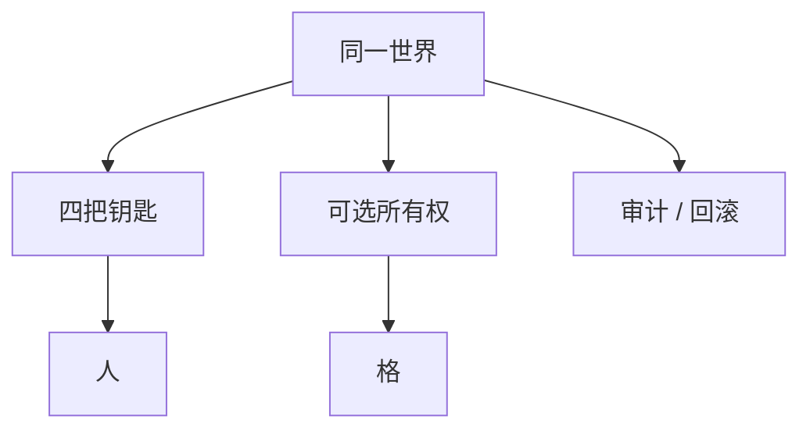

> **本章命题**：缺省仍是未上锁的公共格子。引擎却必须提供登记、审计、回滚这些法律零件，而不是强迫每个服主从零立法。零件可以关掉。关掉是 2b2t。没有零件，十人以上的居住只能外溢成插件城邦。下沉的是工具，不是社交网络。

## 问题

每一台生存服都在重写同一部法典：谁的墙不能拆，谁昨天拆过，拆坏了如何回到前天。WorldGuard、日志、备份、核心保护，名字换来换去，职责稳定。[《服务器即新游戏》](/history/servers) 原版给了床和箱，没给产权。[《多人是默认状态》](/design/multiplayer) 没给不是疏忽。没给，是把立法权留给运营者。运营者人数一过信任半径，立法权变成刚需。刚需若只住在插件里，2014 年那种桌子一塌，法律编译不过去。

要回答：领地、备份、回滚为何不该只交给插件？可被证伪的说法是：这些是服务器玩法，放进引擎会变成公寓游戏，背叛开放世界；或者反过来，引擎应当默认上锁，友谊才安全。只要还存在没有领地插件就无法开公开生存、只要还存在 2b2t 把空法律当真、只要还存在回档是司法而原版只给 `/clone`，这句话就不成立。

卷二的权限模型是四把钥匙开同一扇门。[《创造模式不是关卡编辑器》](/design/creative-mode) 规则由谁制定那一章尚未成稿。本章不抢三层立法表。本章只把已经写下的空法律，收成引擎可以提供、世界可以关闭的零件。不发明好友动态、点赞、通行证赛季。那些是另一品类。

<Cards>
  <Card title="单人即服务器" href="/impl/protocol" description="权威从连接数为 1 就开始。" />
  <Card title="缺省是不信任" href="/design/multiplayer" description="安全来自半径，不来自箱子。" />
  <Card title="四把钥匙" href="/design/creative-mode" description="拧的是人，不是另一套物理。" />
</Cards>

## 每个服主都在重写同一套法律

空循环允许空法律。空法律在房间半径里靠瞪一眼。瞪一眼扩不进公开进程。于是民间把法律写进插件文件夹：保护、日志、回滚、经济、传送。写完，Minecraft 的多人看起来像城邦。城邦寄生在格子上。格子不认识城邦。不认识，每一次换核心、换大版本、换托管，法律都要再编译一遍。编译失败，家还在磁盘上，进不去——和整合包发布夜是同一类验收失败，只是失败在服务器平台这一格。

重复劳动证明需求稳定。稳定的需求还留在插件里，是引擎把社会功能当成「不是游戏」。不是游戏的读法，来自 SKU 是客户端。完整产品含再开发，也含让人能在同一张图上过夜。[《可被模组的引擎才是完整产品》](/impl/modifiable-engine) 过夜需要的最低法律零件：这块是谁的、发生过什么、如何回到上一份真实。零件可以很薄。薄过 WorldGuard 全家桶。薄，但要在内核里有钩。没有钩，插件只能继续切开尚未签名的事件。切开，又是矩阵。

下沉不是把 Hypixel 做进正作。大厅、匹配、商店是服务器产品。下沉的是所有政体都会用到的地板。地板重复出现，就该从立法风俗变成引擎能力。风俗可以继续长。能力不该缺席。

## 权威、同步、所有权

权威仍在服务端。单人仍是本地服务器。客户端预测可以挖、可以挥，格子以权威为准。[《网络协议》](/impl/protocol) 提案不改这句。改的是：权威要认识所有权，而不只认识「谁在这一拍点了这格」。

**增量同步**按兴趣走。调度章的兴趣裁剪，协议必须跟着裁：不在兴趣里的鸡，不必广播。租约里的机器，必须广播给需要看见因果的人——管理员、附近的玩家、回放器。看不见的结算可以发生。看见是协议问题。结算是调度问题。两件事不要合成「没人看就别算」。

**所有权**是格上的可选登记：谁能挖、谁能开容器、谁能用机关。默认无主。无主等于今天的原版：任何有许可证的手权力相同。有主，是半径变大之后的奢侈品。奢侈品由世界政策打开，不是由内核强制。强制，开放世界变成公寓。公寓可以很好。公寓不是缺省。[《多人是默认状态》](/design/multiplayer)

末影箱仍是例外口袋。例外证明默认公共。提案保持例外，并允许把「这只箱」登记为有主容器。登记是法律零件。零件不自动产生经济插件。经济是服务器产品。

Java 与 Bedrock 的账号层不同。账号能回答「你是谁」。所有权回答「这一格认谁」。两问不要合成：合成之后，家庭档会要求每个人先登录商店。家庭档是房间半径。房间半径不该被账号宪法吞掉。吞掉是产品伦理后文的题。本章只要：所有权钩子认的是世界内身份，可以绑定账号，不必绑定货架。

## 反作弊作为系统设计

反作弊难，因为协议从未当公共 API，客户端必须先演手感。[《音频、粒子与手感谎言》](/impl/feel-client) 先演，就有撒谎窗口。窗口关死，挖掘会等服务器，手感死。窗口大开，飞行和瞬挖会成真。

提案把反作弊当成系统设计，不是插件市场。设计包括：权威对账的槽位与位置、所有权减少「任何人都能拆」的攻击面、租约让关键机器的状态有审计、兴趣让看不见的区域少被探测。这些会让作弊更贵。更贵不是消失。消失需要把客户端变成哑终端。哑终端没有挖掘节奏。节奏是不变量第 2 条附近的手感。手感与安全互相限制。限制要写明：引擎提供对账和审计；运营者决定严到哪一档。档是世界政策。政策可以关掉，像所有权一样。

不写反作弊配置。不写检测阈值。考试只判：若协议和权限模型不把「谁改了哪一格」写成第一等事件，任何核心都在猜包。猜包是未承认 API 的下游。下游不该再当唯一的司法。

## 社会功能清单下沉

薄清单。每项都可以关。关是合法世界政策。缺席不是政策，是引擎没做完。

| 零件 | 做什么 | 关掉之后 |
| --- | --- | --- |
| 所有权登记 | 格 / 容器可有主、可授权 | 回到同等的挖和放 |
| 审计日志 | 谁在何时改了哪一格 | 熊只能靠证人 |
| 快照 / 回滚 | 按实例回到某一版本钩子 | 备份仍可外置，司法变慢 |
| 回放 | 重放一小段结算（调度章的因果） | 只能口头复述 |
| 实例隔离 | 对局结束不碰永续家 | 回到清场插件 |

回放不是电影模组。电影是创作工具下一章。这里的回放认结算，不认镜头。镜头可以后加。结算没有钩，镜头只能演假的。

备份若只存在服主的 crontab 里，回滚是运维神话。神话可以很强。强过不了「玩家时间在存档里」这句伦理。伦理后文会写。本章把钩子放下：实例有版本，快照是版本上的点。点可以稀。稀过没有点。

<Callout type="warning" title="下沉不是默认公寓">
内核提供登记。世界默认可以不登记。把默认改成全图保护，开放世界的缺省就变了。变了要写在封面上，当作另一种游戏，而不是「更文明的 Minecraft」。
</Callout>

## 权限模型推广

四把钥匙仍在：生存、创造、冒险、旁观。拧的是人在这一份物理里能做什么。提案在钥匙之外加**授权**：在某一兴趣或某一批格上，把挖、放、开容器、用机关、传送，发给某个身份。冒险模式的物品标签是授权的雏形——作者发给你许可证。推广之后，许可证可以从「这把镐」走到「这块地」。走到地，仍是同一世界，不是地皮游戏另开物理。

硬核仍是锁，不是第五把钥匙。旁观仍是看。创造仍寄生生存的尺。工具层可以很强，不能顶替创造当居住权限——创作工具章会写。本章只要：管理员不必靠「给所有人创造」来修墙。修墙可以是一条窄授权，修完收回。收回，家还是家。

多人默认状态要求家具朝向第二个人。授权是半径变大之后的零件。零件不取消朝向。朝向仍是门两格、箱可交。可交的成长在物上。物若被所有权锁死到无法移交，第 1 条附近的世界即库存会变薄。锁死可以是某一服的宪法。宪法用零件来写。零件默认不锁死。

<Constraint name="法律零件可关不可缺" verdict="地基" chain="默认无主 → 可选登记 → 服主不再从零立法">
抄走下沉，丢掉「可关」，你会得到强制公寓。抄走零件，丢掉下沉，你会得到永远的插件城邦和一张一塌就停的法律桌。完整的服务器平台不是大厅皮肤。是过夜的地板。
</Constraint>

<Alternative title="若做成社交平台">
好友、动态、赛季通行证会很好卖。你会失去空循环：目标再次被平台填满。填满是另一品类。品类对照在总命题里已经写过。本卷不立项那款产品。
</Alternative>

## 这一章留下什么

- **爱好者**：公开生存里你要的「别拆我家」「拆了能回去」，不该只有某一家插件才懂。引擎可以提供这些钩子，世界仍可以决定今晚不上锁。不上锁的极限叫无规则。上锁的日常叫城邦。两边都该能在同一内核上活。
- **开发者**：能抄走的是权威 + 增量同步按兴趣、所有权默认关、审计与快照挂在实例版本上、四把钥匙加窄授权。能一起抄走的还有：反作弊是对账与事件设计，不是事后猜包。抄不走的是每一家服的宪法，以及账号层已经存在的联邦法。你不得从本章发明社交网络，也不得把默认改成全图保护还称为尊重开放世界。下沉的是零件。零件为了不再让每个运营者从零立法。立法权仍在运营者手里。手里没有零件，立法权只是空话。
