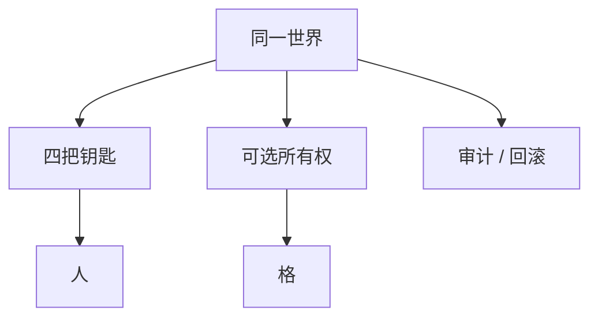

> **本章命题**：缺省仍是未上锁的公共格子。引擎却必须提供登记、审计、回滚这些法律零件，而不是强迫每个服主从零立法。零件可以关掉——全关是 2b2t。没有零件，十人以上的居住只能外溢成插件城邦。下沉的是工具，不是社交网络。

## 问题

每一台生存服都在重写同一部法典：谁的墙不能拆、谁昨天拆过、拆坏了怎么回到前天。WorldGuard、CoreProtect、各家备份插件——名字换来换去，职责稳定（[《服务器即新游戏》](/history/servers)）。原版给了床和箱子，没给产权；卷二说过，多人是默认状态，而默认状态里没有一道锁（[《多人是默认状态》](/design/multiplayer)）。没给不是疏忽：原版把立法权留给运营者。运营者管的人一超过信任半径——在场的人都认识、靠熟人和目光就能维持秩序的规模——立法权就从礼貌变成刚需。刚需若只住在第三方插件里，地基一塌，法律整批作废：2014 年 CraftBukkit 因 DMCA 事件停摆，无数服务器的插件地基一夜悬空。法律没能编译过去——家还在磁盘上，进不去。

要回答：领地、备份、回滚为何不该只交给插件？可被证伪的说法有两个：这些是服务器玩法，放进引擎会变成公寓游戏、背叛开放世界；或者反过来，引擎应当默认上锁，友谊才安全。只要还有公开生存服不开领地插件就开不下去、只要 2b2t 还把「无法律」当成认真的产品、只要回档仍是司法刚需而原版只给一把 `/clone`，这两个说法就都不成立。

卷二给过四把钥匙的权限表：改地形、稀缺、身体、目标从哪来，逐行写在同一份物理上（[《创造模式不是关卡编辑器》](/design/creative-mode)）。服务器治理的完整立法分层，后文另有章节；本章不抢那笔账，只做一件事：把已经写下的「空法律」，收成引擎可以提供、世界可以关闭的零件。不发明好友动态、点赞、赛季通行证——那些是另一品类。

<Cards>
  <Card title="单人即服务器" href="/impl/protocol" description="权威从连接数为 1 就开始。" />
  <Card title="缺省是不信任" href="/design/multiplayer" description="安全来自半径，不来自箱子。" />
  <Card title="四把钥匙" href="/design/creative-mode" description="拧的是人，不是另一套物理。" />
</Cards>

## 每个服主都在重写同一套法律

空的世界允许空的法律。空法律在信任半径之内靠瞪一眼维持；瞪一眼扩不进公开进程。于是民间把法律写进插件文件夹：保护、日志、回滚、经济、传送。问任何一个开过公开生存服的人，开服清单都长得差不多：先装领地，再装回滚，再配备份——十年来内容几乎没变，变的只有插件名和适配的版本号。写完，Minecraft 的多人生态看起来像一群城邦——产权、司法、经济全部住在第三方插件里的政体。城邦寄生在格子上，格子不认识城邦。不认识的意思是：每一次换核心、换大版本、换托管商，法律都要重新编译一遍。编译失败的那一次，叫 2014。

重复劳动恰恰证明需求稳定。稳定的需求至今还留在插件里，理由是引擎把社会功能当成「不是游戏」。这个读法来自把产品等同于客户端。卷三的结论相反：完整产品含再开发，也含让人能在同一张图上过夜（[《可被模组的引擎才是完整产品》](/impl/modifiable-engine)）。过夜需要的最低法律零件只有三样：这块是谁的、发生过什么、怎么回到上一份真实。零件可以很薄，薄过 WorldGuard 全家桶；但薄也要在内核里有钩。没有钩，插件只能继续切开尚未签名的事件——切开，又是兼容矩阵。

下沉不是把 Hypixel 做进正作。大厅、匹配、商店是服务器产品，各家自便。下沉的是所有政体都用得到的那块地板。地板在每一个服里重复出现，就该从立法风俗升格成引擎能力。风俗可以继续长在地板上；能力不该缺席。

## 权威、同步、所有权

权威仍在服务端，单人仍是本地服务器，客户端可以预测挖掘和挥手，格子以权威为准（[《网络协议》](/impl/protocol)）。提案不改这句。改的是：权威要认识所有权，而不只认识「谁在这一刻点了这格」。

**增量同步按兴趣走。** 调度章的兴趣裁剪，协议必须跟着裁：不在兴趣里的鸡，不必广播。租约里的机器反过来，必须广播给需要看见因果的人——管理员、附近的玩家、回放器。看不见的结算照样可以发生；看见是协议问题，结算是调度问题，两件事不要合并成「没人看就别算」。

**所有权是格上的可选登记**：谁能挖、谁能开容器、谁能用机关。默认无主。无主等于今天的原版：任何一只拿得起镐的手权力相同。有主是半径变大之后的奢侈品，由世界政策打开，不由内核强制。强制，开放世界就变成公寓。公寓可以做得很好，但公寓不是缺省——缺省变更是封面级的变更，不是设置里的一行（[《多人是默认状态》](/design/multiplayer)）。

末影箱仍是例外口袋：人人的末影箱只有自己打得开，这个例外本身证明默认是公共的。提案保持例外，并允许把「这只箱子」登记为有主容器。登记是法律零件；零件不自动生成经济插件——经济是服务器产品。

Java 与 Bedrock 的账号层不同。账号回答「你是谁」；所有权回答「这一格认谁」。两问不要合成一问：合成之后，家庭局域网档会要求每个孩子先登录商店账号。家庭档是信任半径之内的世界，不该被账号宪法吞掉。本章只要一条：所有权钩子认的是世界内的身份，可以绑定账号，不必绑定货架。

## 反作弊作为系统设计

反作弊难，是因为协议从未当公共 API，而客户端必须先演手感（[《音频、粒子与手感谎言》](/impl/feel-client)）：先播挖掘动画、先闪伤害，再等服务器对账。先演，就有撒谎窗口。窗口关死，挖掘要等服务器确认，手感死；窗口大开，飞行和瞬挖成真。今天的服务器在两窗之间拉一条橡皮筋：给玩家的位移和交互留出可信余量，超出才往回拉。余量定多少，每家核心自己定——同一份协议，一百个服有一百种松紧，而玩家把这份松紧叫「这个服的手感」。

提案把反作弊当系统设计，不当插件市场。设计包括四件事：权威对账的位置与槽位、所有权收窄「任何人都拆得动」的攻击面、租约让关键机器的状态可审计、兴趣让看不见的区域少被探测。这些让作弊更贵。更贵不是消失——消失需要把客户端变成哑终端，哑终端没有挖掘节奏，节奏是第 2 条不变量附近的手感。手感与安全互相设限，这条限制要写明：引擎提供对账与审计，运营者决定严到哪一档。档是世界政策，像所有权一样可以关。

本章不写反作弊配置，不写检测阈值。考试只判一条：如果协议和权限模型没有把「谁改了哪一格」写成第一等事件，任何核心都只能在网络包里猜。猜包是未承认 API 的下游；下游不该再独占司法权。

## 社会功能清单下沉

薄清单。每项都可以关——关是合法的世界政策；缺席不是政策，是引擎没做完。

| 零件 | 做什么 | 关掉之后 |
| --- | --- | --- |
| 所有权登记 | 格 / 容器可有主、可授权 | 回到同等的挖和放 |
| 审计日志 | 谁在何时改了哪一格 | 追责只能靠目击者 |
| 快照 / 回滚 | 按实例回到某一版本钩子 | 备份仍可外置，司法变慢 |
| 回放 | 重放一小段结算（调度章的因果） | 只能口头复述 |
| 实例隔离 | 对局结束不碰永续家 | 回到清场插件 |

回放不是电影模组：电影归下一章的创作工具。这里的回放认结算，不认镜头；镜头可以后加，结算没有钩，镜头只能演假的。

备份若只活在服主的 crontab 里，回滚就是运维神话。神话可以很强，强不过「玩家时间存在存档里」这条伦理——伦理账单后文兼容章再算。本章把钩子放下：实例有版本，快照是版本轴上的点。点可以稀疏；稀疏的点仍好过没有点。

<Callout type="warning" title="下沉不是默认公寓">
内核提供登记。世界默认可以不登记。把默认改成全图保护，开放世界的缺省就变了。变了要写在封面上，当作另一种游戏，而不是「更文明的 Minecraft」。
</Callout>

## 权限模型推广

四把钥匙仍在：生存、创造、冒险、旁观，拧的是同一个人在同一份物理里能做什么——卷二的表格逐行写过：谁能改地形、身体是什么、目标从哪来（[《创造模式不是关卡编辑器》](/design/creative-mode)）。提案在钥匙之外加**授权**：在某个兴趣或某批格子上，把挖、放、开容器、用机关、传送，发给某个身份。冒险模式的物品标签是授权的雏形——地图作者用标签发给你「这把镐可以拆这几块」的许可证。推广之后，许可证从「这把镐」走到「这块地」。走到地，仍是同一世界、同一物理，不是另开一套地皮游戏。

硬核仍是生存上的一把锁，不是第五把钥匙；旁观仍是只看；创造仍寄生在生存的尺度上。工具层可以很强，不能顶替创造当居住权限——下一章写创作工具时再收紧这句。本章只要一件事：管理员不必靠「给所有人开创造」来修一堵被炸的墙。修墙可以是一条窄授权：给谁、在哪批格子、多久，修完收回。收回，家还是家。

卷二说过，多人是默认状态：设计要默认面前还有第二个人。授权是半径变大之后的零件，不取消这份默认——门仍是两格，箱子仍可以交给朋友。可移交的成长写在物上；物若被所有权锁死到无法移交，第 1 条不变量附近的世界即库存会变薄。锁死可以是某一个服的宪法——宪法用零件来写；零件的默认不锁死。

<Constraint name="法律零件可关不可缺" verdict="地基" chain="默认无主 → 可选登记 → 服主不再从零立法">
抄走下沉，丢掉「可关」，你会得到强制公寓。抄走零件，丢掉下沉，你会得到永远的插件城邦和一张一塌就停的法律桌。完整的服务器平台不是大厅皮肤。是过夜的地板。
</Constraint>

<Alternative title="若做成社交平台">
好友、动态、赛季通行证会很好卖。你会失去空循环：目标再次被平台填满。填满是另一品类。品类对照在总命题里已经写过。本卷不立项那款产品。
</Alternative>

## 这一章留下什么

- **爱好者**：公开生存里你要的「别拆我家」「拆了能回去」，不该只有某一家插件才懂。引擎可以提供这些钩子，世界仍可以决定今晚不上锁。不上锁的极限叫无规则。上锁的日常叫城邦。两边都该能在同一内核上活。
- **开发者**：能抄走的是权威加按兴趣的增量同步、所有权默认关、审计与快照挂在实例版本上、四把钥匙加窄授权。能一起抄走的还有：反作弊是对账与事件设计，不是事后猜包。抄不走的是每一家服的宪法，以及账号层已经形成的联邦规则。你不得从本章发明社交网络，也不得把默认改成全图保护还称为尊重开放世界。下沉的是零件。零件为了让运营者不必从零立法。立法权仍在运营者手里。手里没有零件，立法权只是空话。
