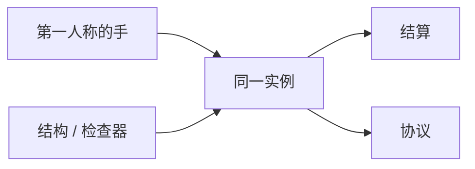

> **本章命题**：手感是第一人称里那只还在现场的手；工具是同一份世界上的加速器。网格可以更现代，只要重建跟得上挖和放。结构编辑与数据检查器应当是引擎产品。做成另一套 DCC，家就变成文件。工具层可以很强，但不能顶替创造当居住权限。

## 问题

装上 Sodium，帧数回来了；打开选区模组，一座山被整段复制；切到正交视角，工地提速，家却更不像家。这三件事常被收进同一句口号：「现代一点」。现代可以。现代若把挖掘节奏换成笔刷、把准星换成场景树、把创造换成必须导出的工程，第 2 条（最小动词）和第 7 条（模式即权限）不变量会一起假（[《必须保留的设计不变量》](/rewrite/invariants)，[《创造模式不是关卡编辑器》](/design/creative-mode)）。

要回答：手感与工具如何同时保住？可被证伪的说法是：要现代渲染就必须牺牲吸附和第一人称；要强工具就必须离开正在住的世界。只要优化模组还在「这一格看起来仍是那一格」的纪律下把帧数救回来、只要结构方块还在把工地写回同一套方块 ID、只要创造模式里飞着的人仍用「两格门」说话，这些说法就都不成立。

四产品矩阵里，本章这一格是原版体验和创作工具叠在同一份存档上（[《我们到底在重写什么》](/rewrite/what-to-rewrite)）。叠，不是替代。替代的失败样本上一章已经禁止：编辑器再强，也不该宣布创造多余。创造取消稀缺，编辑器取消身体；身体一取消，口令就换语言。

<Cards>
  <Card title="手感是规则的时间" href="/design/verbs-feel" description="挖掘节奏和吸附不是包装。" />
  <Card title="网格必须跟得上变" href="/impl/client-render" description="焊得最大，次于挖得起。" />
  <Card title="谎必须能被拉回" href="/impl/feel-client" description="先演，仍要对账。" />
</Cards>

## 手感仍是产品

看、走、挖、放发生在第一人称里。放置吸附在格上，挖掘有时间；时间是节奏装置，不是没来得及做完的进度条（[《最小动词集与手感》](/design/verbs-feel)）。时间是工具的一部分：同一块石头，空手、木镐、铁镐挖起来的等待不一样，玩家据此读出「工具等级」，不需要任何菜单提示。吸附和时间一起构成手感的语法；提案换掉的是渲染它的方式，不是这条语法。提案允许工具把「挖一百格」收成一次选区操作，但默认那只手必须仍在：默认视角一换成正交摄像机，你经营的就不再是家，而是另一个软件里的工地。

客户端可以先演：先播破碎动画、先闪伤害红光、先摆手臂。演完，权威把真实状态拉回（[《音频、粒子与手感谎言》](/impl/feel-client)）。工具操作遵守同一条合同：选区预览可以是谎，落盘必须是权威实例上的状态迁移。预览若能直接当真实，复制漏洞（dupe）会从背包蔓延到地形——地形级复制比物品级复制威力大得多，那不是功能，是漏洞。

无障碍不是债的边角料：字幕、可调的镜头晃动、不依赖颜色也能读的红石信息，都是同一只手的许可范围。这些检查项可以进检查器；检查器看见的仍是格，不是滤镜。

Java 的手在鼠标上，Bedrock 的手在触控上。动词合写，映射分写。提案不把某一边的键位升格成不变量；不变量是：现场仍有一只对准格的手。没有这只手，工具再强也是另一款软件。

## 渲染原则（不是选购指南）

不写 API 等级，不写哪一家光线追踪。原则只有三条，每条对着原版已经签过的一份合同。

**世界可变，网格重建必须跟得上变。** 挖一格，所在小节的网格要重编。玩家其实见过重编的代价：一次放置几百个方块，帧率会抖一下——那是这一片网格在成批重建。抖动不是渲染器偷懒，是「世界可变」这四个字的价格。合并得越激进的贪婪网格，如果让单格修改的重编变成可感卡顿，就输给朴素的按格出面。原版长期停在按格出面，不是没听过合并算法，是有模型合同和重建成本要还（[《客户端与渲染》](/impl/client-render)）。提案允许合并、批处理、更好的剔除——纪律与 Sodium 这类优化模组相同：这一格看起来仍是那一格。楼梯缺的角还在，飞行器还是那些方块。对上层的稳定承诺是「格子」，不是三角形数量。

**流式加载跟着兴趣走。** 看见的圈可以比结算的圈大一点，不能大到把另一份战场的网格也编进来——编进来，是协议税叠 CPU 税再叠渲染税。调度章的兴趣是结算单位；本章的流式加载是它在客户端的皮肤。皮肤可以骗远景，不可以改近处的吸附。

**光照是格上的数，算法可以换。** 换算法若改了「这一带夜里会不会生怪」，那就不是渲染，是模拟。渲染可以更漂亮；漂亮若倒灌成另一套光的法律，生存节奏就被美术部门立法了。要改模拟，走模拟的正门，写进版本说明——不能藏在着色器包里当默认。

资源包仍是官方模组：换皮、换模型、在格子上细化，不废除格子。提案把资源包收进资产图（下一节），不取消「玩家能换皮而不换物理」。取消换皮，皮肤层就被焊死；皮肤层不是骨头。焊死皮肤，重写会变成博物馆。

<Callout type="warning" title="不是显卡购物清单">
核心配置、升采样、某代 API，随硬件年轮走。年轮不是考试。考试是：可变世界的网格还认不认一米尺。
</Callout>

## 内置工具：结构、函数、检查器

工具链不内置，作者席会再次外溢：WorldEdit、投影、数据查看器、函数调试器，各自长成民间官方实现。外溢可以；把外溢当产品策略，又是先卖再修，修补的主语又回到社区的深夜。

提案把三件最低限度的工具做成引擎产品，并让它们认同一份实例。

**结构。** 选区、复制、旋转、存成可迁移的片段；片段写回的是状态和账户，不是另一个引擎的网格。结构方块已经指明了方向；方向要变成不必背命令就能用的工地语言，同时仍可用命令和数据层调用。

**函数。** 数据层的函数要能在游戏里跑、能看报错、能单步到「这一刻」。单步接到调度章的可解释队列上。函数作者不该只有一份日志文件。

**检查器。** 准星所指之处：状态键值、组件、光照、所有权、这一格在哪个兴趣或租约里。F3 调试屏是检查器的原始形态；原始形态长期被当成作弊彩蛋。提案把它写成作者席的眼睛——眼睛看见法律，不看见混淆名。

为什么是这三件？它们对应作者回路的三个动作：改世界（结构）、改规则（函数）、看世界（检查器）。少一件，作者就得为那个动作回到民间工具——民间工具各自长在模组平台上，装一次、适配一次、版本夜失效一次。多一件，比如笔刷和地形生成器，就该留给模组平台的正当外溢，内核不必替所有美术风格背书。

三件工具默认可以关，像上一章的法律零件可以关。创造里开；生存里可以只发给有授权的人——授权是上一章的窄许可证。许可证不自动等于创造：创造仍是那把无限的钥匙。

## 从资源包到资产图

原版资源包是文件夹合同：贴图、模型、声音，按路径覆盖。合同简单，组合会炸——两个包改同一条路径，后加载的赢，玩家只看到「装完不对劲」。模组平台用命名空间把炸挪到加载时。提案把资源收成图：谁依赖谁、哪一代 schema、冲突在进世界之前就失败。失败得早，是数据包已经证明过的进步。

图仍只覆盖格子上的皮肤，不覆盖结算。光影若只改看见，走客户端资产；光影若想改「亮到能刷怪」，必须声明它在改模拟——多数情况应当拒绝，模拟留在权威侧。拒绝是手感谎言那章画下的边界：谎可以美，不能另立法。

Bedrock 的资源包与 Java 的资源包不是同一份合同，提案不要求合并文件夹——Java 的包靠 `pack.mcmeta` 自报格式版本，Bedrock 的包靠 `manifest.json` 自报依赖，两份文件同名不同义，搬过去就要重写。要求的是：两边的资产都挂版本，都能被检查器指出「你现在看见的草来自哪一张图」。指得出来，迟到的访客才知道自己眼前的草，和房主截图里的是不是同一张。

## 工具与运行时同一世界模型

这是整章的牙齿。工具改的对象，必须是调度正在结算、协议正在同步、存档正在翻译的那一份状态。导出成独立工程再导入，是关卡管线；管线很值钱，管线不是居住。居住要求：飞着修完，拧回生存，邻居用同一双脚走进来。

强工具——选区、笔刷、实时预览、多人同时看工地——允许存在，而且应当内置到够用，免得作者席只活在模组里。够用之后仍可以继续外溢，外溢是模组平台的正当工作；正当的前提是内核已经承认工具层，而不是假装只有那只空手。

正交摄像机、图层、撤销栈，可以当工具模式。工具模式不是游戏模式——Bedrock 的编辑器官方说明就把这句话写在明面上：它不是新的游戏模式，是给创作者的工具。提案把这句话升成考试纪律。纪律破了，第 7 条不变量死：四个权限变成四个软件。软件可以很强；强完，Minecraft 只剩启动器图标还共用着。

<Constraint name="工具写回正在住的世界" verdict="地基" chain="同一状态 → 预览可谎落盘须真 → 创造仍是权限">
抄走内置检查器和结构，丢掉同一模型，作者席会连夜外溢。抄走第一人称默认，丢掉身体，你会得到更好的 DCC。DCC 不教「两格高留门」。不教，口令死在视口里。
</Constraint>

<Alternative title="若把创造做成完整关卡编辑器">
摆岛会更快，Marketplace 会更像货架。你会失去寄生：水还流、TNT 还炸、红石还占格。失去寄生，展览还在，家不在。家不在，工具再强也只是在做另一句话。
</Alternative>

<Note>
Axiom、WorldEdit、Replay 模组是已经发生的工具层局部重写。本章不评哪一个该被官方收编；收编的分寸属于模组方法章的议题。这里只要求：收编进来的，必须是写回同一世界的加速器，不是第二套物理。
</Note>

## 这一章留下什么

- **爱好者**：帧可以更高，山可以一下复制过来。你默认仍该用那只手走路、留门、看检查器里「这一格的法律」。若有一天必须先打开工程文件才能回家，家已经搬走了。
- **开发者**：能抄走的是三条渲染纪律（网格跟得上变、流式跟兴趣、光照算法不倒灌刷怪规则），以及三件内置工具（结构、函数、检查器）写回同一实例。能一起抄走的还有：工具模式不等于游戏模式；预览可谎，落盘须权威。抄不走的是 Sodium 的网格实现和二十年资源包路径。你不得从本章选购渲染器，也不得把强工具写成创造的替代。手感是产品。工具是同一产品上的加速器。加速器不内置，作者席会再溢出去，完整产品又会只剩一个会画方块的客户端。
