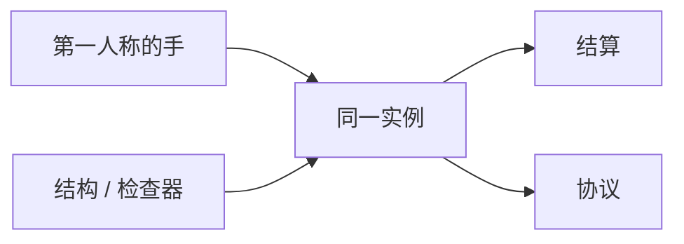

> **本章命题**：手感是第一人称里那只还在现场的手；工具是同一份世界上的加速器。网格可以更现代，只要重建跟得上挖和放。检查器和结构编辑应当是引擎产品。做成另一份 DCC，家就变成文件。工具层可以很强，不能顶替创造当居住权限。

## 问题

装上 Sodium，帧回来了。打开某个选区模组，一座山被复制。打开正交视角，工地更快，家更不像家。三件事常常被收成一句「现代一点」。现代可以。现代若把挖掘节奏换成笔刷、把准星换成场景树、把创造换成必须导出的工程，第 2 条和第 7 条不变量会一起假。[《必须保留的设计不变量》](/rewrite/invariants) [《创造模式不是关卡编辑器》](/design/creative-mode)

要回答：手感与工具如何同时保住？可被证伪的说法是：要现代渲染就必须牺牲吸附和第一人称；要强工具就必须离开正在住的世界。只要还存在优化模组在「这一格看起来还是那一格」的纪律下把帧救回来、只要还存在结构方块把工地写回同一套 ID、只要还存在创造里飞着仍用两格门说话，这句话就不成立。

四产品矩阵里，这是原版体验和创作工具叠在同一存档上。[《我们到底在重写什么》](/rewrite/what-to-rewrite) 叠，不是替代。替代的失败样本上一章已经禁止：编辑器再强，也不该宣布创造多余。创造取消稀缺。编辑器取消身体。身体一取消，口令换语言。

<Cards>
  <Card title="手感是规则的时间" href="/design/verbs-feel" description="挖掘节奏和吸附不是包装。" />
  <Card title="网格必须跟得上变" href="/impl/client-render" description="焊得最大，次于挖得起。" />
  <Card title="谎必须能被拉回" href="/impl/feel-client" description="先演，仍要对账。" />
</Cards>

## 手感仍是产品

看、走、挖、放发生在第一人称里。放置吸附在格上。挖掘有时间。时间是节奏装置，不是没来得及做的进度条。[《最小动词集与手感》](/design/verbs-feel) 提案允许工具把「挖一百格」收成一次选区。允许之后，默认那只手仍在。默认一换成正交摄像机，工地毕业，家退学。

客户端可以先演破碎、先闪伤害、先摆手臂。演完，权威拉回。[《音频、粒子与手感谎言》](/impl/feel-client) 工具操作同样：选区预览可以是谎，落盘必须是权威实例上的状态迁移。预览若能当真实，杜普会从背包长到地形。地形杜普比物品杜普更像神。神不是产品。

无障碍不是债的反面彩蛋。对照、字幕、可调的镜头晃动、不必靠颜色才能读的红石，是同一只手的许可范围。许可范围可以进工具检查器。检查器看见的仍是格，不是滤镜。

Java 的手在鼠标右键上。Bedrock 的手在触控上。合写的是动词。分写的是映射。提案不把某一边的键位写成不变量。不变量是：现场仍有一只对准格的手。没有这只手，工具再强，也是另一款软件。

## 渲染原则（不是选购指南）

不写 API 等级，不写哪一家光线追踪。原则只有几条，对着原版已经付过的合同。

**世界可变，网格必须跟得上变。** 挖一格，这一节要重编。焊得最大的贪婪合并，若让重编变成卡手，就输给「每一格一张面」。原版长期停在按格出面，有模型合同和重建成本，不是没听过算法。[《客户端与渲染》](/impl/client-render) 提案允许合并、批处理、更好的剔除——纪律与 Sodium 相同：这一格看起来还是那一格。楼梯缺的角还在。飞行器还是那些方块。ABI 是格子，不是三角形数量。

**流式加载跟着兴趣走。** 看见的圈可以比结算的圈大一点点，不能大到把另一张战场的网格也编进来。编进来是协议税和 CPU 税叠在渲染上。调度章的兴趣是结算单位。这一章的流式是它的皮肤。皮肤可以骗远景。骗不可以改近处的吸附。

**光照是格上的数，可以换算法。** 换算法若改了「这一带会不会生怪」，那是模拟，不是渲染。渲染可以更漂亮。漂亮若倒灌成另一种光的法律，生存节奏会被美术部门立法。立法要走模拟，要进版本说明，不能藏在着色器包里当默认。

资源包仍是官方模组：换皮、换模型、在格子上细化，不废除格子。提案把资源包收进资产图（下一节），不取消「玩家能换皮而不换物理」。取消换皮，皮肤层会被焊死。皮肤层不是骨头。焊死皮肤，重写会变成博物馆。

<Callout type="warning" title="不是显卡购物清单">
核心配置、升采样、某代 API，随硬件年轮走。年轮不是考试。考试是：可变世界的网格还认不认一米尺。
</Callout>

## 内置工具：结构、函数、检查器

工具链不内置，作者席会再次外溢：WorldEdit、投影、数据查看器、函数调试，各自成为民间官方实现。外溢可以。当产品策略，又是先卖再修。修的主语又在夜间。

提案把三件最低工具做成引擎产品，并让它们认同一份实例。

**结构。** 选区、复制、旋转、存成可迁移的片段。片段写回的是状态和账户，不是另一引擎的网格。结构方块已经是方向。方向要变成不必靠命令才能用的工地语言，同时仍可用命令和数据层调用。

**函数。** 数据层的脚本要能在游戏里跑、能看报错、能单步到「这一拍」。单步接调度章的可解释班次。函数作者不该只有日志文件。

**检查器。** 准星所指：状态键值、组件、光、谁有所有权、这一格在哪一个兴趣 / 租约里。F3 是检查器的原始形态。原始形态长期像作弊彩蛋。提案把它写成作者席的眼睛。眼睛看见法律，不看见混淆名。

三件工具默认可以关，像法律零件可以关。创造里开，生存里可以只给授权过的人。授权是上一章的窄许可证。许可证不自动等于创造。创造仍是那把无限的钥匙。

## 从资源包到资产图

原版资源包是文件夹合同：贴图、模型、声音，按名字覆盖。合同简单，组合会炸——两个包改同一条路径，后加载的赢。模组平台用命名空间把炸挪到加载时。提案把资源收成图：谁依赖谁、哪一代 schema、冲突在进世界前失败。失败得早，是数据包已经证明过的进步。

图仍覆盖格子上的皮肤，不覆盖结算。光影若只改看见，走客户端资产。光影若改「亮不亮能刷怪」，必须声明它在改模拟——多数情况应当拒绝，让模拟留在权威。拒绝，是手感谎言的边界：谎可以美，不能另立法。

Bedrock 的资源包与 Java 的资源包不是一份合同。提案不要求合并文件夹。要求：两边的资产都挂版本，都能被检查器指出「你现在看见的草来自哪一张图」。指得出，延迟的多人才知道自己在跟哪一季视频的草说话。

## 工具与运行时同一世界模型

这是整章的牙齿。工具改的对象，必须是调度在结、协议在同步、存档在翻译的那一份状态。导出成独立工程再导入，是关卡管线。管线很值钱。管线不是居住。居住要求：飞着修完，拧回生存，邻居用同一双脚走进来。

强工具（选区、笔刷、实时预览、多人同时看工地）允许存在，并且应当内置到够用，免得作者席只活在模组里。够用之后，还可以再外溢——外溢是模组平台的正当工作。正当的前提是：内核已经承认工具层，而不是假装只有那只空手。

正交摄像机、层、撤销栈，可以当工具模式。工具模式不是游戏模式。官方已经把这句话写在 Bedrock 编辑器上：它不是新的游戏模式。提案把这句话升成考试纪律。纪律破了，第 7 条死：四个权限变成四个软件。软件可以很强。强完，Minecraft 只剩启动器图标还在共用。

<Constraint name="工具写回正在住的世界" verdict="地基" chain="同一状态 → 预览可谎落盘须真 → 创造仍是权限">
抄走内置检查器和结构，丢掉同一模型，作者席会连夜外溢。抄走第一人称默认，丢掉身体，你会得到更好的 DCC。DCC 不教「两格高留门」。不教，口令死在视口里。
</Constraint>

<Alternative title="若把创造做成完整关卡编辑器">
摆岛会更快，Marketplace 会更像货架。你会失去寄生：水还流、TNT 还炸、红石还占格。失去寄生，展览还在，家不在。家不在，工具再强也只是在做另一句话。
</Alternative>

<Note>
Axiom、WorldEdit、Replay 是已经发生的工具层局部重写。本章不评哪一个该官方收编。收编原则在未写成的模组方法章。这里只要求：收编进的是写回同一世界的加速器，不是第二套物理。
</Note>

## 这一章留下什么

- **爱好者**：帧可以更高，山可以一下复制过来。你默认仍该用那只手走路、留门、看检查器里「这一格的法律」。若有一天必须先打开工程文件才能回家，家已经搬走了。
- **开发者**：能抄走的是渲染纪律（网格跟得上变、流式跟兴趣、光照算法不倒灌刷怪法）、以及三件内置工具（结构、函数、检查器）写回同一实例。能一起抄走的还有：工具模式 ≠ 游戏模式；预览可谎，落盘须权威。抄不走的是 Sodium 的网格实现和二十年资源包路径。你不得从本章选购渲染器，也不得把强工具写成创造的替代。手感是产品。工具是同一产品上的加速器。加速器不内置，作者席会再溢出去，完整产品又会只剩下一个会画方块的客户端。
