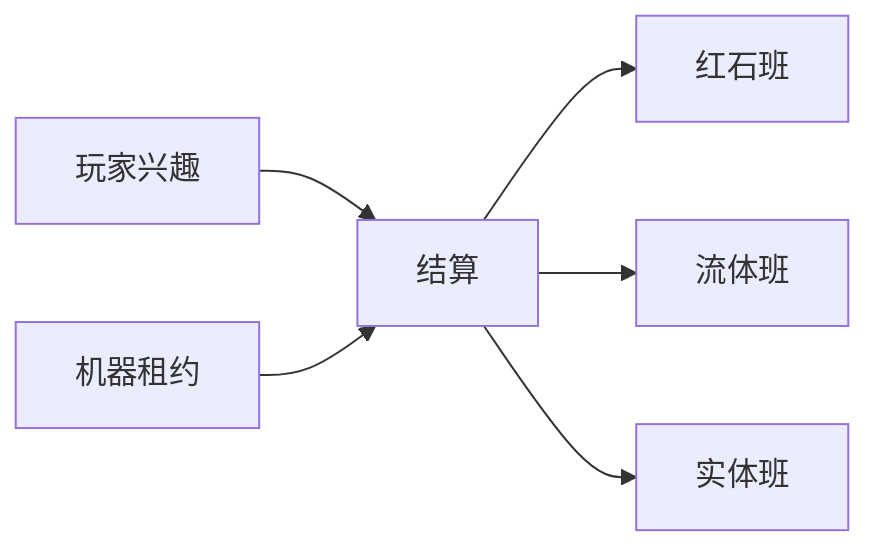

> **本章命题**：单人与万人可以走同一内核，只要调度单位从「全世界一条拍」改成「兴趣 + 租约」。共享真实仍要有。全局恰好二十不是骨头。红石的因果必须能指、能教、能不被「没人看着」拆碎。拆碎了，可误用系统只剩脚本。

## 问题

单人档里，家门口的鸡和你共用二十拍。万人网络里，大厅里挥手的人和战场里的漏斗不该共用你这一份 50 毫秒。[《游戏循环与刻》](/impl/tick) [《服务端与规模》](/impl/servers) 原版用同一条主循环点名所有该动的东西。点名名单一长，所有人的炉子一起慢。第三方核心用政策撒谎。撒谎成功后，玩家仍说自己在玩 Minecraft。跑的已经不是那份朴素的全局拍。

要回答：如何让单人与万人走同一内核？可被证伪的说法是：机器够好就能线性扩；或者兴趣管理必然毁掉红石，所以万人必须是另一种物理。只要还存在模拟距离已经从视距里长出来、只要还存在 Folia 按区域开拍、只要还存在没人加载的区块上飞行器会停——而社区把这种停当成语言而不是特性，这句话就不成立。

上一章把世界收成可有多种寿命的实例。[《世界表示》](/rewrite/world-rep) 本章给实例发拍。拍是共享真实。二十这个整数已经判为偶然。[《可以抛弃的历史偶然》](/rewrite/accidents) 偶然抛掉之后，第 4 条不变量还要能复述：这一拍谁先说话。[《必须保留的设计不变量》](/rewrite/invariants)

<Cards>
  <Card title="掉拍掉因果" href="/impl/tick" description="炉认拍，不认帧。" />
  <Card title="万人是另一种用法" href="/impl/servers" description="兴趣管理至今长在核心里。" />
  <Card title="修 bug 会革命" href="/impl/redstone" description="班次是指令集。" />
</Cards>

## 全局 20 TPS 的限度

契约曾经很短：一秒二十次，一次大约 50 毫秒，一天两万四千拍。短，所以能教。教的是节奏：熔炉、昼夜、活塞延迟。限度不在「要有节奏」。限度在：所有实例、所有实体、所有远方的农场，抢同一条预算。十人生存里，这条预算像诚实。万人里，诚实变成连坐。

客户端另有一帧钟。帧可以高。帧高不等于世界快。原版已经把两种钟分开过。提案把分开写成内核：模拟钟按实例走，呈现钟按眼睛走。单人档里两口钟住在同一进程，看起来像一口。万人里必须能分开，否则你的 144Hz 会假装成别人的熔炉。

限度还有一张嘴：看门狗。主循环跑不完就崩。崩是保护。保护假定全世界只有一条循环。循环一分片，看门狗必须认「这一片兴趣」而不是「这个进程里所有的鸡」。认错，单人档会无故崩溃，万人服会该崩不崩。

所以提案的第一句不是「取消 20」。第一句是：20 可以当默认节奏标签，当教学口语，当兼容层里旧机器的仿真拍。内核认的是**结算**，不是这个整数。结算必须可暂停（连接数为 1 时的礼貌）、必须可落后（来不及就不快进补课）、必须可被指（这一拍发生了什么）。

## 兴趣管理与分片

兴趣是调度单位。原版用视距和后来的模拟距离当半径。半径是兴趣的一种形状，不是唯一形状。

**单人档的兴趣**可以很大：你附近的柱子，加上你用区块票钉住的农场，加上下界那条冰道。极限情况，兴趣等于整份已加载世界。这是居住。居住允许贵。

**万人的兴趣**是许多个不相交的圈，外加几乎不模拟的皮（大厅）。圈在上一章的实例里：战场是对局实例，家是永续实例。分片沿着实例走，比沿着「同一张主世界里硬切」干净。实例内仍可再切区域——Folia 那种。切完，插件若假设「我一定在主线程」，应当在加载时就被拒绝，而不是运行时崩溃当说明书。

异步区块服务生成和 I/O，不服务「这一拍的因果已经结完」。生成可以在后台铺。结账必须在该兴趣的结算线程上发生。把活塞推进去后台，口型会变成竞态。竞态不是可误用。可误用要稳定。稳定的脏，和不稳定的脏，不是同一种脏。

跨兴趣的红石默认不成立。不成立要诚实：粉走到兴趣边上，就是断路，像原版走到未加载区块。若要跨，必须是第一等的链接（显式的跨实例信号），不能靠「碰巧两个圈叠在一起」。碰巧是原版联邦里的鬼。鬼会变成社区 API，然后你再修一次革命。

## 红石 / 流体专用调度器

兴趣按人走，机器会停在没人看着的地方。原版已经这样：区块卸载，飞行器落地。社区用区块加载器把「看着」伪造出来。伪造是民间官方实现。提案把伪造收成**租约**：一块空间可以向调度器申请持续结算，不依赖玩家站在附近。租约有预算、有主人、有到期。农场和冰道付租约。没人付的装饰，跟着兴趣走。

租约是红石不被兴趣管理拆碎的关键。拆碎的形状是：你一转头，时钟停，回来又走，口型错相位。错相位不是 LOD。错相位是语言被剪辑。租约让语言在无人时仍按自己的班次说话。班次必须可解释：计划刻、方块事件、信号传播，仍是能写进教科书的队列，而不是「引擎内部优化过、请看源码」。

流体与粉抢邻居图。原版已经在同一拍里打架。[《光照、流体与方块更新》](/impl/light-fluid-updates) 提案允许专用调度器：水走水的班，粉走粉的班，两班的会合点写明——哪一格先更新、跨班的通知如何变成可复述的边。写明，Java 与 Bedrock 可以继续分叉成两套仿真。内核只要求：会合点能指。指得着，Wiki 才能当说明书。指不着，可误用死在性能补丁里。

观察者、活塞、漏斗仍占建造用的格。专用调度器不是把电路画到另一张图上。画走，第 4 条死。调度器只改「谁在哪一班被点名」，不改「粉是不是墙的一部分」。

<Constraint name="兴趣裁剪不得剪相位" verdict="地基" chain="租约独立于视线 → 班次可复述 → 无人时语言仍在">
抄走分片，丢掉租约，你会得到很快的万人服和一堆「回头就停」的机器。快是服务器产品。停是对可误用违约。违约之后，红石玩家会冻版本。冻版本，是调度考试没过。
</Constraint>

## 实体预算与 LOD

实体是税。方块便宜，鸡贵。万人用法必须承认预算：这一兴趣里能养多少份权威生命。超过的，不是「再优化一下」，是规则该出场——生成上限、激活范围、对局实例的短寿命。

LOD 是远方的谎。谎可以：远处的游荡者少算 AI，少发协议。谎不可以：你看见的农场产量来自没被结算的鸡。产量是共享真实。真实被 LOD 吃掉，就是另一种杜普——时间上的杜普。提案把 LOD 限制在「不进入经济与红石」的对象上。进入漏斗的实体，必须付全价，或明确标成「此农场在简化模拟下产量不作数」。不作数可以。偷偷作数不行。

展示用的装饰走上一章的短寿命对象。短寿命对象可以跟兴趣走，不必租约。租约留给会改变世界法律的东西：推动的活塞、流动的水、产物流进箱子的生物。分类是设计。分类不是渲染器的事。

## 时间旅行调试：因果可解释

红石革命的一半，来自「修了但说不清改了哪一班」。提案把可解释写成调度器的验收，不是调试器彩蛋。

每一兴趣、每一租约，应能回答：这一拍点了谁的名、通知走了多远、哪一条边跨班。回答可以是结构方块加日志，可以是回放上一章留下的版本钩子。形式不指定。合同指定：资深玩家不必读混淆名，就能复述「为什么这盏灯晚了一拍」。复述不了，兴趣管理就还在拆语言。

时间旅行不是无限悔棋。悔棋是社会功能（回滚），下一章下沉。这里只要：因果能重放一小段，用来教、用来测、用来证明兼容层的仿真拍还在说话。小游戏用它做死亡回放。生存用它做「这次更新有没有删词」。删词可以。删词必须能被指着看。

单人与万人同一内核的意思到此收束：同一套兴趣 + 租约 + 可解释班次。单人把兴趣开大、租约便宜。万人把兴趣切开、租约标价。标价可以是算力，可以是规则。规则仍是同一句挖和放。不是两套物理。

<Alternative title="若万人另做一套无红石内核">
大厅会更容易。你会失去「同一只手从家里走进战场」，以及冰道、漏斗、时钟这些已经是服务器文化的语言。另做一套是两个游戏。两个游戏可以。请写在封面上，不要写在「同一内核」里。
</Alternative>

<Callout type="warning" title="本章不写怎么调 JVM">
分片、租约、班次是合同。线程库、队列实现、某门语言的 actor 模型，都不是本题答案。答案是：无人看着时语言还在不在。
</Callout>

## 这一章留下什么

- **爱好者**：人走远了机器不该偷偷换口型。农场要么明着付「继续跑」的租约，要么明着停。停可以。偷改相位，才是把红石当背景装饰。
- **开发者**：能抄走的是兴趣作为调度单位、租约让机器独立于视线、红石 / 流体专用且会合点可指、实体 LOD 不得进入经济结算。能一起抄走的还有：20 是默认口语和仿真拍，不是内核整数。抄不走的是墙上已经写成教科书的班次，以及 Paper / Folia 已经用政策补上的那一层。你若用兴趣管理把飞行器剪成「没人看就停」，红石因果就被拆碎了。拆碎，单人与万人就不是同一内核，只是同一个商标。
