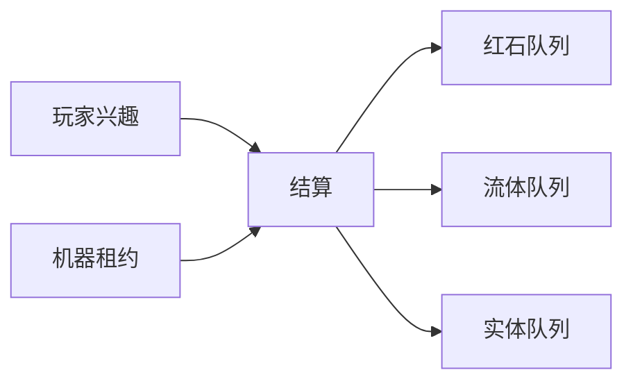

> **本章命题**：单人与万人可以走同一内核，只要调度单位从「全世界共享一条刻」改成「兴趣 + 租约」。共享真实仍要存在，但全局恰好二十不是骨头。红石的因果必须能指、能教、能不被「没人看着」拆碎——拆碎了，可误用系统就只剩脚本。

## 问题

单人档里，家门口的鸡和你共用每秒二十刻的同一份预算。万人网络里，大厅里挥手的人和战场里的漏斗，不该共用你这台机器每刻 50 毫秒的预算（机制见[《游戏循环与刻》](/impl/tick)与[《服务端与规模》](/impl/servers)）。原版用同一条主循环点名所有该动的东西；点名名单一长，所有人的熔炉一起慢。第三方核心用可配置的政策解围：把实体激活范围、区块加载规则调成「能跑就行」。政策生效之后，玩家仍说自己在玩 Minecraft——尽管底层跑的已经不是那份朴素的全局刻。

要回答：如何让单人与万人走同一内核？可被证伪的说法有两个：机器够好就能线性扩；或者兴趣管理必然毁掉红石，所以万人必须是另一种物理。只要模拟距离还得单独从视距里拆出来调、只要 Folia 还得按区域各自开刻、只要没人加载的区块上飞行器照样会停——而社区把这种「停」当成语言在用而不是当成特性在夸，这两个说法就都不成立。

上一章把世界收成可有多种寿命的实例（[《世界表示》](/rewrite/world-rep)）；本章给实例安排刻怎么结。刻是共享真实，这个共享不能丢；但「二十」这个整数已经判为偶然（[《可以抛弃的历史偶然》](/rewrite/accidents)）。偶然抛掉之后，第 4 条不变量还要继续成立：红石玩家仍能复述这一刻谁先说话（[《必须保留的设计不变量》](/rewrite/invariants)）。

<Cards>
  <Card title="掉刻掉因果" href="/impl/tick" description="熔炉认刻，不认帧。" />
  <Card title="万人是另一种用法" href="/impl/servers" description="兴趣管理至今长在核心里。" />
  <Card title="修 bug 会革命" href="/impl/redstone" description="更新顺序就是指令集。" />
</Cards>

## 全局 20 TPS 的限度

原版的契约很短：每秒二十次，每次约 50 毫秒，一个游戏日两万四千刻。短，所以能教：熔炉烧完一件物品是两百刻，中继器按红石刻延迟，昼夜在刻上翻页——新手背得下来，教材写得出来。限度不在「要有节奏」，在预算结构：所有维度、所有实体、所有远方的农场，抢的是同一条预算。十人生存服里，这条预算像诚实；万人网络里，诚实变成连坐。连坐是玩家背得下来的体验：有人在出生点附近堆了一船实体，全服的熔炉和庄稼一起变慢，而肇事现场可能远在几千格外。账单是全局的，找不到局部责任人——这是同一条主循环的直接后果。

客户端另有一只帧率钟，卷三已经把两只钟分开写过。帧可以高，帧高不等于世界快。提案把这次分开写进内核：模拟钟按实例走，呈现钟按眼睛走。单人档里两只钟住在同一进程，看起来像一只；万人网络里必须能分开，否则你 144Hz 的流畅会假装成别人熔炉的速度。

限度还有一张嘴：看门狗。主循环卡住太久就崩掉进程——崩是保护。但保护的前提是全世界只有一条循环；循环一旦分片，看门狗必须认得「这一片兴趣出了问题」，而不是「这个进程里所有的鸡都有嫌疑」。认错对象，单人档会无故崩溃，万人服会该崩不崩。

所以提案的第一句不是「取消 20」。第一句是：二十可以继续当默认节奏标签、当教学口语、当兼容层里模拟旧机器行为的仿真刻；内核认的是**结算**，不是这个整数。结算必须可暂停（连接数为 1 时，单人该有暂停的礼貌）、必须可落后（来不及就不快进补课，宁可慢而诚实）、必须可被指（这一刻发生了什么，问得出答案）。

## 兴趣管理与分片

兴趣是调度单位：只结算有人在意的空间。原版用视距、后来的模拟距离当半径——半径是兴趣的一种形状，不是唯一形状。两个半径的区别玩家看得见：视距外是雾和未加载的黑洞；模拟距离外的动物干脆站在原地——世界还画在屏幕上，钟已经停了。这就是兴趣管理的素颜形态：看见不等于结算。

**单人档的兴趣**可以很大：你附近的柱体、你用区块票钉住的农场、下界那条冰道，全算在内。极限情况，兴趣等于整份已加载世界。这是居住。居住允许贵。

**万人网络的兴趣**是许多个不相交的圆，外加几乎不参与结算的展示区（大厅的风景）。圆都落在上一章的实例里：战场是对局实例，家是永续实例。分片沿着实例的边界切，比「在一张主世界里硬切坐标」干净。实例内部仍可以再切区域——Folia 做的就是这件事。切完之后，插件若假设「我一定在主线程上跑」，应当在加载时就被拒绝，而不是等到运行时崩溃、再把崩溃当说明书。

异步区块服务生成和 I/O，不服务「这一刻的因果是否已经结清」。地形生成可以在后台铺；结账必须发生在该兴趣自己的结算线程上。把活塞的结算丢进后台线程，更新顺序就成了竞态。竞态不是可误用——可误用要稳定。稳定的脏和不稳定的脏不是同一种脏：前者是社区能背下来的语言，后者是谁也复述不了的事故。

跨兴趣的红石默认不成立。不成立要诚实：红石线走到兴趣边界，就是断路，和原版里电路伸进未加载区块一样。若要跨，必须是第一等的显式链接（跨实例信号），不能靠「碰巧两个兴趣圈叠在一起」。碰巧叠出来的边，是原版多进程联邦里的偶然产物；偶然一旦被社区当成语言，你再修它，就是又一次「修 bug 引发革命」。

## 红石 / 流体专用调度器

兴趣按人走，机器就会停在没人看着的地方。原版已经这样：区块一卸载，飞行器停在半空。社区用区块加载器把「有人看着」伪造出来——伪造用得足够广、足够久，就成了民间官方实现。提案把伪造收编成**租约**：一块空间可以向调度器申请持续结算，不依赖任何玩家站在附近。租约有预算（占多少刻）、有主人（谁申请的）、有到期（何时收回）。农场和冰道付租约；没人付费的装饰，跟着兴趣走。

租约是红石因果不被兴趣管理拆碎的第一半。拆碎的形状是：你一转头，机器的刻停了；你一回来，刻又接着走，相位已经错开。相位错乱不是 LOD——LOD 是明码标价的简化，相位错乱是语言被偷偷剪辑。租约让语言在无人时仍按自己的队列说话。队列必须可解释：计划刻、方块事件、信号传播，仍是一条能写进教科书的队列，而不是「引擎内部优化过了，请看源码」。

第二半是专用调度器。流体和红石粉抢同一张邻居更新图，原版让它们在同一刻里打架（[《光照、流体与方块更新》](/impl/light-fluid-updates)）。提案允许拆成专用调度器：水走水的队列，粉走粉的队列，两队的**会合点**写明——同一格里谁先更新、跨队通知如何变成可复述的边。注意方向：专用是按对象类型各排一条**有序**队列，不是给红石开多线程乱序。红石队列内部仍一笔一笔按序结账；专用只是把水和粉从同一条队伍里分出来，免得一场大水把全服电路的点名拖到下一刻。写明之后，Java 与 Bedrock 仍可以各自分叉成两套仿真；内核只要求一件事：会合点能指。指得着，Wiki 才能当说明书；指不着，可误用就死在性能补丁里。

观察者、活塞、漏斗仍然占建造用的那格。专用调度器不是把电路画到另一张图上——画走，第 4 条不变量就死了。调度器只改「谁在哪条队列里被点名」，不改「红石粉是不是墙的一部分」。

<Constraint name="兴趣裁剪不得剪相位" verdict="地基" chain="租约独立于视线 → 队列可复述 → 无人时语言仍在">
抄走分片，丢掉租约，你会得到很快的万人服和一堆「回头就停」的机器。快是服务器产品。停是对可误用违约。违约之后，红石玩家会把版本冻在旧版上不再升级。冻版本，是调度考试没过。
</Constraint>

## 实体预算与 LOD

方块是静态数据，实体是要持续喂养的权威生命——方块便宜，鸡贵。万人用法必须承认预算存在：这一份兴趣里能养多少份权威生命，是有上限的。超限的不是「再优化一下」能救的，是规则该出场：生成上限、激活范围、对局实例的短寿命。

LOD 是对远方的简化。简化可以：远处的游荡者少算 AI、少发协议包。简化不可以：你看到的农场产量，来自根本没被结算的鸡。产量是共享真实；真实被 LOD 偷吃掉，就成了时间上的复制漏洞（dupe）——机器一刻没算，产出照单全收。提案把 LOD 限制在「不进入经济与红石」的对象上。产出要流进漏斗的实体，必须付全价结算，或者明确标出「此农场在简化模拟下产量不作数」。不作数可以，偷偷作数不行。

展示用的装饰走上一章的短寿命对象：短寿命对象跟着兴趣走，不必租约。租约留给会改变世界法律的东西——推动的活塞、流动的水、产出正流进箱子的生物。什么该租、什么该跟兴趣走，这个分类本身就是设计决策，不是渲染器的事。

## 时间旅行调试：因果可解释

红石社区一半的革命记忆，来自「修了一个 bug，但说不清改的是哪一步」。提案把可解释写成调度器的验收标准，不是调试器的彩蛋。

每一份兴趣、每一张租约，都应能回答三个问题：这一刻点了谁的名、通知走了多远、哪一条边跨了队。答案可以是结构方块加日志，可以是回放上一章留下的版本钩子。形式不指定，合同指定：资深玩家不必去读混淆名，就能复述「为什么这盏灯晚了一刻」。复述不了，兴趣管理就还在拆语言。这个要求不抽象：红石玩家排故障时说的口语——「先看观察者动没动，再看活塞那格有没有信号」——就是可解释性的民间版本。调度器若能按实例导出这一刻的通知清单，这句口语就有了官方对账单；导不出，每一次性能修复都像抽签。

时间旅行不是无限悔棋。悔棋是社会功能（回滚），下一章才下沉。这里只要：因果能重放一小段，用来教新手、用来测兼容层、用来证明仿真刻还在说话。小游戏用它做死亡回放；生存用它查「这次更新有没有删掉某个词」。删词可以——删词必须能被指着看。

单人与万人同一内核，到这里收束：同一套兴趣 + 租约 + 可解释队列。单人把兴趣开大、租约便宜；万人把兴趣切开、租约标价。标价可以是算力，也可以是规则上限。规则仍是同一句挖和放，不是两套物理。

<Alternative title="若万人另做一套无红石内核">
大厅会更容易。你会失去「同一只手从家里走进战场」，以及冰道、漏斗、时钟这些已经是服务器文化的语言。另做一套是两个游戏。两个游戏可以。请写在封面上，不要写在「同一内核」里。
</Alternative>

<Callout type="warning" title="本章不写怎么调 JVM">
分片、租约、队列是合同。线程库、队列实现、某门语言的 actor 模型，都不是本题答案。答案是：无人看着时，语言还在不在。
</Callout>

## 这一章留下什么

- **爱好者**：人走远了，机器的相位不该被偷偷改动。农场要么明着付「继续跑」的租约，要么明着停。停可以。偷改相位，才是把红石当背景装饰。
- **开发者**：能抄走的是兴趣作为调度单位、租约让机器独立于视线、红石与流体走专用队列且会合点可指、实体 LOD 不得进入经济结算。能一起抄走的还有：二十是默认口语和仿真刻，不是内核整数。抄不走的是已经写成教科书的更新顺序，以及 Paper / Folia 已经用政策补上的那一层。你若用兴趣管理把飞行器剪成「没人看就停」，红石因果就被拆碎了。拆碎，单人与万人就不是同一内核，只是同一个商标。
