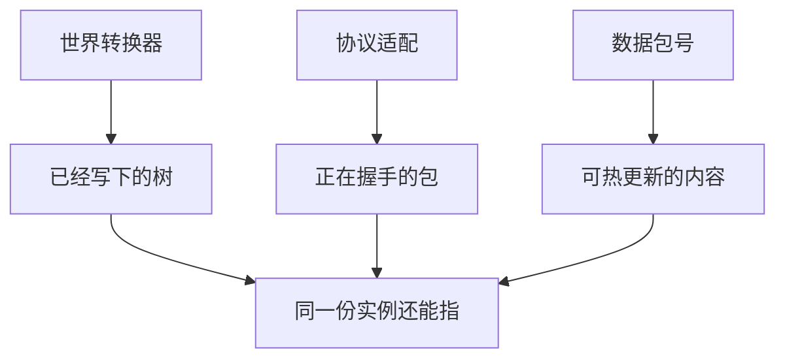

> **本章命题**：能读旧档首先是伦理，其次才是工程特性。伦理不是「每一个怪癖都必须进内核」，而是：走兼容，梯子必须写进范围；走继承，必须把「不读你的家」写在封面上。假装无代价，是用特性话术宣布过去作废。

## 问题

点开一个十年前的世界，启动器先喊一句必须转换。墙还在。漏斗还衔着昨天的物品。工业模组变成未知方块。未知方块占着位置，总好过空气假装什么都没发生。[《存储与序列化》](/impl/storage) 喊的不是新丛林。喊的是：你的时间要被翻译一遍，翻译按已经写下的对象计费。

要回答：能读旧档是伦理还是特性？可被证伪的说法是：读旧档只是导入向导里的可选项，做不做看工期；或者反过来，尊重玩家就必须把 2012 年某次通知顺序焊进新内核，否则就是背叛。只要还存在商店页写明 Java 与 Bedrock 互不兼容、只要还存在扁平化让箱子换护照、只要还存在封面写兼容却把红石清成电路课，这句话就不成立。[^store]

第一部把兼容和继承分成两条路。[《我们到底在重写什么》](/rewrite/what-to-rewrite) 第二部把旧档写成表示法的职责，把仿真拍留给调度。[《世界表示》](/rewrite/world-rep) [《模拟调度》](/rewrite/scheduler) 本章把账单收成产品范围：梯子怎么挂、红石走哪一条、命名空间承诺什么、哪些代价必须印在封面上。不是转换器源码。是：你到底在救谁的时间。

<Cards>
  <Card title="存档按格计费" href="/impl/storage" description="翻译器扫的是已经写下的时间。" />
  <Card title="修 bug 会革命" href="/impl/redstone" description="墙上的程序没有印刷说明书。" />
  <Card title="遗产活在层里" href="/history/heritage" description="引擎还在更新，层可以先死。" />
</Cards>

## 玩家的时间存在存档里

关卡游戏的存档是进度指针。指针短，赛季清空在商业上说得通。Minecraft 的存档是世界本身：哪一格是门，哪一只箱子还认你的名字，哪一段粉还在按某一版口型走。[《必须保留的设计不变量》](/rewrite/invariants) 第 5 条不是工程偏好。它是：居住把时间写成格子和栈，格子和栈就必须能被下一版认回来。认不回来，居住塌成「请开始新游戏」。开始新游戏对关卡像下一季。对家像拆迁。

所以「能读」不是情怀开关。开关可以关。关开关的人，必须承认自己走的是继承：新引擎认新世界，旧家请停在旧客户端里。承认可以很体面。体面的前提是封面诚实。封面印着同一只苦力怕、同一句「你的世界还在」，读起来却是另一份物理——那是用品牌把特性话术做成欺诈。Bedrock 已经演示过商店页上的诚实：两边都叫 Minecraft，存档迁不走。[^store] 诚实没有取消悲剧。诚实让悲剧可以被指。

伦理还有一截容易被听成无底洞：是不是每一份个人奇迹都必须被下一版认成 API？不是。遗产章写过：层没有单一主人，模组世界常常打不开。[《作为文化遗产的 Minecraft》](/history/heritage) 官方梯子救的是原版对象。第二作者的语义挂在当时的加载器和当时的默契上。默契散了，考古是社区的活，不是把所有 jar 焊进第一作者的范围。焊进去，兼容会变成无限厚的假官方。假官方养不起。养不起之后，会反过来连原版梯子一起赖掉。

纪律是：

- **原版对象**必须有梯子。方块、物品、实体、玩家、结构、游戏规则，凡是第一作者写下的树，升级是翻译，不是清空。
- **第二作者对象**必须有逃生口。未知状态、未知物品、未知方块占着位置；能指，能当障碍，能以后再认。空气假装，是拆迁。
- **对局实例**可以声明不进梯子。声明必须是实例政策，不能变成引擎默认。[《世界表示》](/rewrite/world-rep) 默认仍是居住：读得起昨天。

Java 的梯子挂在 `DataVersion` 和 DataFixerUpper 上。Bedrock 的柜子是 LevelDB，护照另一份。[^dfu] 合写的是：版本字段是伦理的句柄。分写的是：两套柜子没有一份共同的翻译宪法。宪法没有，跨产品线「全兼容」是口号。口号进不了范围。

<Constraint name="读旧档是伦理不是开关" verdict="地基" chain="时间写成格子 → 升级必须翻译 → 读不起等于宣布作废">
特性可以延期。伦理不能改名叫性能彩蛋。延期必须出现在范围里：这一版读到哪一级，下一级何时付。不出现，就是赖账。
</Constraint>

## 转换器与协议适配

存档梯子和协议梯子不是同一根。混在一起，会用「能进服」证明「家还在」，或用「世界能开」证明「模组还活」。

**世界转换器**认树。它按 schema 阶梯改写已经落盘的对象：数字号收成名字，`tag` 收成组件，高度从 256 接到 384。账单按对象数乘阶梯。没生成的柱子可以晚点付。箱子里的每一件物品不能。[《存储与序列化》](/impl/storage) 转换器成功的标准不是「新表示更正确」。标准是：玩家能指着某一格说还是门；指不着的，变成显式未知，而不是空气。

**协议适配**认包。单人内部也在跑服务端，接头从进世界的第一包就开始。[《网络协议》](/impl/protocol) ViaVersion 一类翻译器证明：包形状可以被当成语言。必须翻译，证明语言没有稳定方言。[^via] 生存服不敢更新，有时是红石，有时是这一层：插件把字段焊进了某一版的字节。适配成功的标准不是「所有客户端都能进所有服」。标准是：翻译层写进范围，版本号当 ABI 涨，而不是每个快照都让第二作者从零挖缝。

两条梯子可以共享版本字段的精神，不能共享一张表。存档的 `DataVersion` 和协议号会一起跳，跳的对象不同。扁平化那年，柱子要换护照，进服的包也要换形状。两笔账都按已经写下的时间计。计完，才允许说「我们做了一次正确的内部重构」。重构若只改内存表示、不改落盘和接头，那是你自己的仓库卫生。卫生很重要。卫生不是兼容。

数据包是第三条较轻的梯子。`pack_format` 跟着游戏版本涨，旧地图要改文件才能继续用。[《数据包、资源包与数据驱动》](/impl/datapacks) 轻，是产品上的优待：优待关卡作者，不优待加新系统的人。轻仍是账。账若不写进范围，教育包和冒险图会在某一号上卡死，而发行说明只写「数据驱动更强了」。更强的是旋钮。旋钮拧尽，旧包仍要有一级级能走的号。

<Impl title="梯子必须一级级走">
能跳的改革看起来现代。跳过的那几级里，藏着已经住进去的护照。官方的 fixer 库选择串起来走，不是因为工程师喜欢慢。是因为跳级会把十年箱子收成空气。空气很干净。干净等于宣布过去作废。
</Impl>

Java 与 Bedrock 在这里最不能合写。Anvil 对 LevelDB，wiki.vg 对 RakNet，数据包对行为包。翻译器必须同时懂两套柜子，懂了地形映射，仍不懂准连接。跨线迁移可以当研究或当商业工具。当产品承诺「一个引擎读所有护照」，你是在买两份测试集。两份测试集没有一份共同的未定义行为宪法。[《可以抛弃的历史偶然》](/rewrite/accidents)

## 红石双路径：仿真层 / 新语义

红石是兼容最贵的一笔，因为墙上的程序没有印刷说明书。官方按电路图修正确，聊天里不说谢谢。他们说语言被删。[《红石：把物理做成编程》](/design/redstone) [《红石的实现》](/impl/redstone) 所以本章禁止第三条路：假装无代价——内核既干净，旧飞行器还飞，封面还写「我们更诚实所以还是 Minecraft」。

**仿真层。** 给旧机器一条「按某一版、某一端红石说话」的模式。模式可以慢，可以可选，必须可复述。可复述，Wiki 才能当这一层的说明书。调度章把 20 收成仿真拍，把租约留给机器，就是给这条路径留钩。[《模拟调度》](/rewrite/scheduler) 仿真救的是测试集：准连接、某一端更新顺序、火把保险丝、已经被写进教科书的口型。救测试集，不把口型焊进新内核。焊进内核，继承之路变成考古。考古可以很动人。动人的是博物馆。博物馆不是四格产品里的原版体验。

**新语义。** 内核可以没有准连接，只要第 4 条不变量还在：建造用的度量上，仍嵌进一份够脏、够稳、够被误用的因果。新语义允许长出新词。修词时承认自己在立法，不假装在擦灰。新语义的成功标准不是灯更像电。标准是：口令还能在格子上发明，发明还能被复述。清成电路课，编程还在，居住者的编程不在。

两条路径都合法。合法的前提仍是封面。封面写兼容，仿真层是范围里的产品，不是周末插件。封面写继承，新语义可以扔掉 Java 的词，必须扔掉「你的 2012 年飞行器还在」这句话。两条都写、两条都做满，等于两份测试集。两份都做满还宣称无代价，是把偶然偷渡回内核，再把内核的利息记成诚实。

Java 与 Bedrock 从第一天就不是同一份指令表。准连接只活在一边。Bedrock 的红石甚至可以不跟主循环同一条队伍。同一张原理图，两边的灯可以不一样亮。因此仿真层不能只有一份。走兼容的人必须说清：仿真的是哪一端、哪一版、哪一套通知顺序。说不清，玩家会把「红石还能亮」听成「我的机器还在」。亮和在，差的是语言。

<Callout type="warning" title="禁止假装无代价">
仿真会慢，会可选，会让新调度先通过海关。新语义会让旧程序停。停是立法。立法可以。立法时若用「正确」遮住停，范围里就少了一行：我们删了哪些词。
</Callout>

<Alternative title="若把怪癖全部焊进新内核">
飞行器永不会停。你得到考古级兼容。你失去继承：任何新表示、任何新班次，都要先通过某一夜通知顺序的海关。海关会让时间不能再往前住。尊重玩家时间，不是让时间冻在测试集里。
</Alternative>

## 命名空间的长期兼容

扁平化把冲突从数字号挪到前缀。`minecraft:` 仍是第一作者的词根。自定义前缀仍是社区口头约定，没有中央登记处。[《数据包、资源包与数据驱动》](/impl/datapacks) 长期兼容要承诺的，不是「永远不改名字」。是：改名字必须走梯子；梯子必须把旧名字认成翻译，而不是认成另一件东西。

三条纪律。

**不复用。** 一个标识符退休之后，不要立刻把同一字符串发给另一种对象。复用会让旧档里的箱子变成合法的新物品，比未知更脏。未知至少诚实。复用是伪造护照。

**未知优于空气。** 表示法已经把这句话写成职责。兼容策略把它写成验收：迁完，指不着的格必须仍能被活塞当障碍、被检查器点名、被以后的翻译器再认。空气假装没发生，是把第 5 条听成导入失败。

**前缀是政治，也是范围。** 两个包抢同一名字，失败发生在加载时，是进步。进步没有取消产权。走模组平台这一格的产品，必须把「名字怎么活过版本」写进作者体验：映射词典、弃用警告、示例包。[《脚本与模组的双层》](/rewrite/scripting) 不写，命名空间只是字符串。字符串很便宜。便宜的冲突会在十年后的整合包夜里爆炸。

`pack_format` 是内容层的 `DataVersion`。号要涨，旧包要有一级级能走的路，或一条明确的「停在此号」。停可以。停必须能被地图作者指着看。指不着，教育包会在某一学年集体死亡，而发行说明只庆祝新旋钮。

皮肤层——默认材质、摇篮曲、主菜单——不是这条梯子。换皮已经发生十几年。换皮不是重写。把皮肤当兼容对象，会把博物馆复制听成第 5 条。第 5 条管的是规则对象：格、栈、因果、扩展面的护照。皮肤留给美术。口音留给仿真。规则留给内核。

## 把代价写进范围

范围是产品文件，不是心情。走兼容，下列各项不是彩蛋：

| 代价 | 不写进范围会怎样 |
| --- | --- |
| 世界转换器按对象计费 | 改革夜把箱子收成空气，却写「内部重构」 |
| 协议翻译或冻结 ABI | 第二作者每个快照从零挖缝，模组比引擎先死 |
| 红石仿真层（含哪一端、哪一版） | 封面写兼容，墙上的程序停了，还说更诚实 |
| 命名空间梯子与未知状态 | 旧名字变成另一件东西，或变成假空气 |
| 对局实例可丢、居住实例默认可读 | 大厅重置删了别人的家，或家的无限柱子拖死大厅 |

走继承，范围里必须出现另一行：**我们不承诺读你的旧档 / 不承诺旧飞行器还飞 / 不承诺进某一版的服。** 出现了，继承是考试允许的路。不出现，启动器皮肤会替你说谎。

四产品矩阵在这里再次分开。原版体验付居住梯子。模组平台付切口与 schema。服务器平台付协议与法律快照。创作工具付结构文件与检查器读同一份树。[《我们到底在重写什么》](/rewrite/what-to-rewrite) 一格付清、三格赖账，仓库仍会绿。住在另外三格里的人会听见：过去作废了，只是作废发生在他们那一层。

先卖再修证明过循环可以先于柜子。[《技术债作为产品策略》](/impl/tech-debt) 它没证明梯子可以永远不进范围。梯子出现之后，周更会变成立法窗口。立法窗口的测试集在墙上、在整合包、在十年箱子里。测试集比 CI 大。大，所以贵。贵，仍然必须写下来。不写下来的贵，会在封面变成「特性可选」。可选，就是宣布有人的时间不算数。

<Memoir title="Must be converted!">
选世界的屏幕先喊一句。喊的不是新生物。喊的是：你的柱子要换内部布局。点下去，才是翻译。翻译完，旧文件有时还躺在旁边。官方不敢立刻烧掉上一份文本。不敢，是因为文本比这一次更新珍贵。本章把那一声喊收成范围行：喊过，就要付。不喊就迁，或喊了不付，都是同一类赖账。
</Memoir>

下一章问谁有权重写。梯子是职责。职责不是许可证：能读旧档，不等于能用商标卖这份阅读。能开源规则，不等于能复印默认包。三件东西会在下一章拆开。拆开之前，本章只要钉死：伦理在存档里，特性在范围里。范围不写，伦理会变成营销。

## 这一章留下什么

- **爱好者**：你的家不在启动器的皮肤里。它在一份能被下一版认回来的树上。认不回来，无论画面多新，都是在对你说：过去作废了。作废可以。作废必须写在封面上，不能写在「我们更现代」里。
- **开发者**：能抄走的是三根梯子（世界转换器、协议适配、数据包号）和红石双路径（仿真层救测试集，新语义保可误用）。能一起抄走的还有：未知优于空气；代价必须出现在范围里。抄不走的是二十年 fixer 表、两套柜子、墙上已经写下的指令集。你不得从本章带走「无代价全兼容」，也不得把读旧档听成开关。走兼容，付仿真税。走继承，封面诚实。两条都正经。正经的前提是别骗那一份已经住过的时间。

[^store]: Xbox / Microsoft Store 商品页注明：Java 版存档与 Bedrock 版不兼容。见 <https://www.xbox.com/en-us/games/store/minecraft-java-bedrock-edition-for-pc/9nxp44l49shj>。

[^dfu]: Mojang 开源库 DataFixerUpper：用 schema 与 fix 在版本之间改写游戏数据；README 写明其用途是转换 Java 版存档。见 <https://github.com/Mojang/DataFixerUpper>。

[^via]: ViaVersion 等翻译器让不同协议号的客户端与服务端互连，证明包形状可被当成语言、且没有官方稳定方言。见 [ViaVersion](https://github.com/ViaVersion/ViaVersion)。
