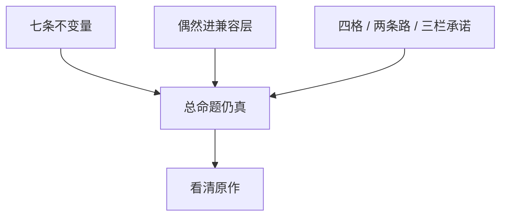

> **本章命题**：前三卷钉住的那句话，剥开偶然之后仍然成立。本卷的产品是一份清单，不是下一款游戏。若永不重写，清单仍值得有——那是看清原作的方法。

## 问题

写到这里，容易起两种错觉。一种：既然七条骨已经钉死，就该有人按表开工。一种：既然官方还在卖、社区已经局部重写过，本卷是空谈。两种都把考试听成立项书，或把考试听成多余。

要回答：前三卷命题是否仍然成立？可被证伪的说法是：Minecraft 其实是关卡加像素风，居住、误用、再开发只是社区情怀；或者：不变量其实是 Java、是整整二十拍、是那一套默认材质，拿掉这些它就不是。只要还存在高清包换皮之后口令不变、只要还存在死了家还在、只要还存在官方按「正确信号」修粉会被听成删语言、只要还存在没有第二作者席的货架长不出工业包，这句话就不成立。

序章把对象写成规则，不是关卡。[《全书的命题》](/prelude/thesis) 卷二把规则收成合同。[《可迁移原则清单》](/design/transferable) 卷三把合同拖进规模，并交出最小内核。[《可被模组的引擎才是完整产品》](/impl/modifiable-engine) 本卷禁止再做一遍，把骨和偶然剥开，把四格产品、梯子和承诺写清楚。现在交卷。交卷不是推销。交卷是看：剥完之后，原作还在不在。

<Cards>
  <Card title="全书的命题" href="/prelude/thesis" description="居住、误用、再开发。第四卷是考试。" />
  <Card title="七条骨" href="/rewrite/invariants" description="拿掉一条，那句话会假。" />
  <Card title="十二条合同" href="/design/transferable" description="能抄走的尺。抄不走窗口。" />
</Cards>

## 交卷：清单定稿

清单分三叠。叠在一起才是本卷的产品。拆开，会把纪律升成骨头，或把窗口误当成原则。

**第一叠：不变量。** 拿掉一条，总命题假。假的意思很具体：居住、误用、再开发会有一个塌掉。

1. **一米可操作格子，世界即库存。** 离散、可破坏、可放置、可计数。地址能说。挖下去的能进口袋，口袋里的能放回世界。
2. **最小动词，工地就是家。** 看、走、挖、放、合成、攻击、使用。没有另开的建造模式把误用关在门外。
3. **目标外包。** 世界催你，不指定你该成为谁。进度是建议。龙是仪式，不是最后一关。
4. **红石级的可误用系统。** 官方留下稳定、可观察的因果，不发玩法白名单。准连接是口音。不变量是允许长出词。
5. **世界比引擎活得更久。** 存档是玩家时间。升级是翻译。读不起，就是宣布过去作废。[《兼容性策略》](/rewrite/compat)
6. **模组与数据包作为第一公民。** 数据层改内容；系统层加动词。两层缺一，作者席塌成商城或塌成破解。
7. **同一世界、同一物理上的权限。** 生存 / 创造 / 冒险 / 旁观拧的是人，不另开一套尺。创造寄生于生存。

七条是考试用的骨。骨来自卷二原语和卷三最小内核。十二条不换这七条核。多出来的是纪律：成长尽量写在物上；程序内容的合同是可探索；不真实的物理往往更好玩；社会契约是设计的一半；新系统应增加动词而不是菜单。纪律指导提案，指导停手。拿掉一条纪律，游戏会变薄，总命题不一定当场假。所以它们不定为第 8 到第 12 条不变量。不定，不是它们不重要。是考试不能膨胀成口味清单。

**第二叠：偶然。** 可以进兼容层，不该进内核。[《可以抛弃的历史偶然》](/rewrite/accidents)

- 语言运行时。Java 证明过可移植和可切开。它不是格子。Bedrock 已经换过一次。
- 全局恰好 20 TPS。共享真实要有。全世界抢同一条 50 毫秒，是规模上的一种写法。
- Java / Bedrock 双端作为设计必然。两个游戏是产品史。继承之路可以只做一份内核；兼容之路可以挂两套仿真。
- 某一份未定义行为本身。词进仿真层。内核留「允许长出词」。
- 特例方块清单。增加动词的可以留在内核附近。必须背下来的菜单，进数据或进仿真。

每一抛都必须写清七条如何仍活。活不成，它就还不是偶然。活法常常是梯子和仿真，不是「删掉就变干净」。

**第三叠：产品纪律。** 不是骨头，但是考场规则。

- 四个产品不能互相替代：原版体验、模组平台、服务器平台、创作工具。[《我们到底在重写什么》](/rewrite/what-to-rewrite)
- 兼容认测试集，继承认不变量。两条路都合法，封面必须诚实。
- 架构提案只动柜子和班次，不换一米尺，不选语言。
- 协议、资产、品牌不能混。谁能承诺什么，写在三栏里。[《谁有权重写》](/rewrite/who-rewrites)
- 本卷是考试，不是开工令。不得从任何一章带走指定语言和立项日期。

<Constraint name="清单是看清的方法不是开工表" verdict="地基" chain="骨还在 → 偶然可抛 → 封面诚实">
按表可以衡量任何仓库。衡量过关，你得到配得上那句话的游戏。过关不发给商标，也不发给窗口。窗口卷二已经写过：抄不走。
</Constraint>

与十二条的对齐写在这里，免得两张表打架。十二条是设计合同，面向「开发者到底能拿走什么」。七条是考试骨，面向「拿掉什么，它就不再是」。合同比骨宽。宽出来的部分，本卷保持为纪律。窗口、工具链、已被收成 API 的未定义行为，十二条标成不可复制条件。本卷把其中「某一份词」标成可抛的口音，把「允许长词」留在骨里。不换核。若你看见两张表语气不同，不同在用途：一张教你抄什么，一张教你什么不能拆。抄的时候请同时读。拆的时候请只认七条。

## 回到总序

总序说：Minecraft 卖的不是关卡，是一套允许被居住、误用、再开发的规则。三卷从三个方向证明同一件事；第四卷把偶然从本质里剥开。

卷一证明它如何成为媒介：公开施工、模组作为第二作者、服务器变成新游戏、影像和课室把格子教成口语、收购把入口买走、遗产活在层里而不是光盘里。成为媒介，不是因为像素可爱。是因为规则硬到能住、空到能误用、开放到能被别人拿去再开发。窗口关了。座位还在原来那套规则上。

卷二证明它为何有效：深度来自极少数规则在格子上的组合爆炸；目标外包给玩家；系统做成可被误用的工具；模式是权限；社会契约是设计的一半。有效寄生在约束上。约束被现代化填满、被真物理还清、被菜单雇佣，有效会变成「我们曾经空过」。

卷三证明规则如何被拖进规模：区块是无限的代价单位，拍是共享真实，协议是未承认的 API，模组比引擎难养，先卖再修没证明你可以没有二十年社区替你扛债。完整产品是游戏、协议、数据、工具链叠在同一份世界上。客户端只是入口。

剥开之后，那句话还在。还在的意思是：你仍然可以用居住、误用、再开发来解释，为什么家不是关卡进度，为什么修粉会革命，为什么原版从来不是完整产品。不能用这句话解释的，是偶然：为什么是 Java，为什么恰好二十拍，为什么会有两条因果还共用一个词。偶然很贵。贵，仍是偶然。把贵听成本质，重写会变成博物馆复制。把本质听成偶然，重写会变成另一款方块主题公园。

Java 与 Bedrock 在交卷时仍然不能合成一个皮肤。分叉本身是产品史的证据：同一套品牌下可以有两份物理，玩家会用品牌验收，墙上会用护照说话。考试的合写句删掉产品线仍成立：格子、外包、可误用、存档、席位、权限。考试的分写句必须带着护照：红石的词、战斗的手、柜子的信封、扩展面的宽窄。方法章的纪律到最后一页仍有效。[《体例与方法》](/prelude/method)

## 若永不重写，为何仍值得写

永不重写是默认。默认很健康。活着的游戏不需要被一份考试逼着换仓库。

仍值得写，因为看清和开工不是同一件事。

看清，是为了在下一次「修复」到来时，分得清删的是灰还是语言。是为了在下一次 Minecraft-like 的预告片里，分得清抄走的是皮还是骨。是为了在下一次有人说「开源继任」时，分得清他承诺的是接头、是默认包、还是那个词。是为了在下一次官方加菜单、加通行证、加审核货架时，有一把尺说：薄了，还是假了。薄了，是纪律。假了，是骨头。

看清，也是为了服主和模组作者少做一次无效的等待。等待官方把 Paper 吃进正作、把准连接写成电路课、把创造升级成编辑器，常常是在等另一款游戏。另一款可以很好。它不是你现在住的这一份。局部重写已经发生。发生了，不等于考完。它们覆盖矩阵的一格或两格。四格同时继承、又对旧档兼容，现场还没有这样的交卷。没有，题目仍成立。成立不是邀请你去交官方继任方案。成立是：清单还有用。

若有一天真的有人按这张清单做引擎，请把本卷当考卷，不当设计文档。考卷不选语言，不画里程碑，不发商标。设计文档要另写，要付范围里的梯子，要在封面上写清三栏承诺。那份文档不是这本书的最后一章。这本书的最后一章到看清为止。

<Alternative title="若把本卷当成立项书">
你会得到预算、语言、兼容承诺，然后倒推：凡是已经写的都是本质，凡是不想养的都是债。倒推是情怀的工程版。方法不允许情怀当推理规则。立项可以。立项请换一本仓库的 README。不要把 README 订进这页。
</Alternative>

<Note>
附录仍在。年表、人物、对照表、术语是查阅用，不承担论证。论证到这一页停。
</Note>

## 全书结语：居住、误用、再开发

三个词绑在一起才够。只居住，它是沙盒玩具。只误用，它是漏洞合集。只再开发，它是引擎中间件。Minecraft 的奇特之处是三者互相供血：因为能住，才有人愿意误用；因为能误用，模组和服务器才有东西可改；因为能再开发，下一批人才会把新的住所和误用送回来。

居住写在存档里。门两格，床还在，门口那棵一直没砍的树没有通关价值。死掉东西，不摧毁柱子。赛季清空、读不起旧档、死等于删档，居住会塌成一局。一局可以很好玩。好玩的是比赛。比赛不是家。

误用写在墙上。官方写下世界怎么传导因果；玩法是玩家发明的。粉被做成电线，玩家拿它搭门、搭时钟、搭飞行器、搭能跑程序的机器。修它是立法。立法可以。立法时假装在擦灰，革命就会来。可误用不是必须保留某一个 bug 的护照。它是：建造用的尺子上，必须嵌进一份够脏、够稳、够被误用的因果。

再开发写在第二条作者席上。材质包、数据包、模组、插件、地图、服务器，是连续的席，不是周边商品。席可以分叉：Java 的切口与 Bedrock 的附加包不是译本。不变量是席位在，不是某一家加载器。席位被收成唯一货架，产品停在演示。演示能卖。卖的不是媒介。媒介一旦停止被再开发，就只剩 IP。遗产章写过这句。本卷把它收成第 6 条骨。

四卷读完，若只留一句，仍是序章那一句：

**Minecraft 不是一套被消费的关卡，而是一套允许被居住、误用、再开发的规则。**

销量、怀旧、像素风、甚至「沙盒」这个品类标签，都是这句话的下游。上游是规则。规则硬到能住，空到能误用，开放到能被别人拿去再开发。偶然可以换。骨头不能换。换骨头，请改名。改名是诚实。诚实之后，你做的可以是很好的方块游戏。很好，不再是这本书的对象。

这本书不在此推销任何具体项目。没有指定语言，没有继任仓库，没有「现在去 fork」。若你是爱好者，你带走的是一把能拆穿「更像」的尺。若你是开发者，你带走的是能抄走的合同，和抄不走的窗口、测试集、商标。尺还在，空还在，那只手还抓得住格子，原作就还在——无论下一次启动器的皮肤换成什么。

## 这一章留下什么

- **爱好者**：有人要重写、要修复、要出下一款更像的。你问家还在不在、粉还能不能被误用、别人还能不能改这个世界。三问还在，那个词还值得用。三问塌了，画风可以继续方块。你住的已经不是原来那句话。
- **开发者**：能抄走的是定稿的三叠清单——七条骨、可抛的偶然及其活法、四格与两条路与三栏承诺。能一起抄走的还有：十二条合同比骨宽，宽出来的是纪律；窗口仍抄不走。抄不走的是二十年存档、墙上的教科书、已经被家庭说会的入口，以及那个商标。你不得从本章带走开工令。若永不重写，你仍可以用这张清单看清原作。看清，是这本书最后愿意承诺的那一件事。
