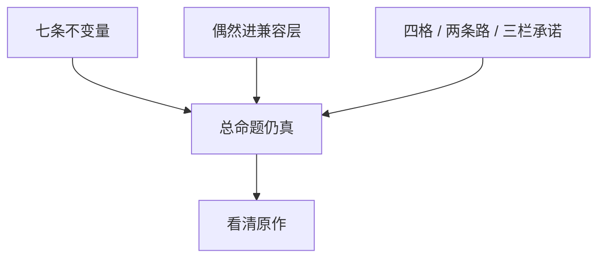

> **本章命题**：前三卷钉住的那句话，剥开偶然之后仍然成立。本卷的产品是一份清单，不是下一款游戏。若永不重写，清单仍值得有——那是看清原作的方法。

## 问题

写到这里，容易起两种错觉。一种：既然七条骨已经钉死，就该有人照着清单开工。另一种：既然官方还在卖、社区已经局部重写过，本卷是空谈。前者把考试听成了立项书，后者把考试听成了多余。

要回答：前三卷命题是否仍然成立？可被证伪的说法有两个：Minecraft 其实是关卡加像素风，能住、能玩出设计之外、能再开发只是社区情怀；或者，不变量其实是 Java 本身、是全局每秒二十刻的节拍、是那一套默认材质，拿掉这些它就不是。只要以下现象还存在，这两个说法就都不成立：高清材质包换完皮，玩家口令照旧好使；角色死了，家还在；官方按「正确信号」修红石粉，会被听成删语言；没有第二作者席的审核货架，长不出工业模组。

序章把对象写成系统，不是通关即弃的内容（[《全书的命题》](/prelude/thesis)）；卷二把系统收成合同（[《可迁移原则清单》](/design/transferable)）；卷三把合同拖进规模，并交出最小内核（[《可被模组的引擎才是完整产品》](/impl/modifiable-engine)）。本卷不再重复证明，只做一件事：把骨和偶然剥开，把四格产品、梯子和承诺写清楚。现在交卷。交卷不是推销，交卷是看：剥完之后，原作还在不在。

<Cards>
  <Card title="全书的命题" href="/prelude/thesis" description="能住、玩出设计之外、再开发。第四卷是考试。" />
  <Card title="七条骨" href="/rewrite/invariants" description="拿掉一条，那句话会假。" />
  <Card title="十二条合同" href="/design/transferable" description="能抄走的尺。抄不走窗口。" />
</Cards>

## 交卷：清单定稿

清单分三叠，叠在一起才是本卷的产品。拆开，就会把纪律升成骨头，或把窗口误当成原则。

**第一叠：不变量。** 拿掉一条，总命题就假。假的意思很具体：住进去、玩出设计之外、再开发会有一个塌掉。

1. **一米可操作格子，世界即库存。** 空间离散：可破坏、可放置、可计数，地址报得出。挖下去的能进口袋，口袋里的能放回世界。
2. **最小动词，工地就是家。** 看、走、挖、放、合成、攻击、使用。没有另开的建造模式把误用关在门外。
3. **目标外包。** 世界催你，不指定你该成为谁。进度是建议，龙是仪式，不是最后一关。
4. **红石级的可误用系统。** 官方留下稳定、可观察的因果，不发玩法白名单。准连接是口音；不变量是允许长出词。
5. **世界比引擎活得更久。** 存档是玩家时间，升级是翻译，读不起就是宣布过去作废（[《兼容性策略》](/rewrite/compat)）。
6. **模组与数据包作为第一公民。** 数据层改内容，系统层加动词。两层缺一，作者席塌成商城或塌成破解。
7. **同一世界、同一物理上的权限。** 生存、创造、冒险、旁观拧的是权限旋钮，不另开一套物理。创造寄生于生存。

这七条是考试用的骨，来自卷二的原语和卷三的最小内核。卷二的十二条合同不换这七条的核，多出来的部分是纪律：成长尽量写在物上；程序内容的合同是可探索；不真实的物理往往更好玩；社会契约是设计的一半；新系统应增加动词而不是菜单。纪律指导提案，也指导停手。拿掉一条纪律，游戏会变薄，总命题不一定当场变假——所以它们不被定为第 8 到第 12 条不变量。不定，不是它们不重要，是考试不能膨胀成口味清单。

**第二叠：偶然。** 可以进兼容层，不该进内核（[《可以抛弃的历史偶然》](/rewrite/accidents)）。

- **语言运行时。** Java 证明过可移植和可切开。它是历史答案，不是格子本身；Bedrock 已经换过一次。
- **全局恰好 20 TPS。** 共享真实必须有，但「全世界抢同一条 50 毫秒」只是把共享真实落成规模的一种写法。
- **Java / Bedrock 双端作为设计必然。** 两个引擎并存是产品史。走继承可以只做一份内核；走兼容可以挂两套仿真。
- **某一份具体的未定义行为。** 词进仿真层，内核留「允许长出新词」。
- **特例方块清单。** 增加动词的可以留在内核附近；必须死记硬背的菜单项，进数据层或进仿真层。

每抛掉一样，都必须写清七条如何仍然成立。写不清，它就还不是偶然。活法常常是梯子和仿真，不是「删掉就变干净了」。

**第三叠：产品纪律。** 不是骨头，但是考场规则。

- 四个产品不能互相替代：原版体验、模组平台、服务器平台、创作工具（[《我们到底在重写什么》](/rewrite/what-to-rewrite)）。
- 兼容认测试集，继承认不变量。两条路都合法，封面必须诚实。
- 架构提案只动存储格式和调度写法，不换一米格，不指定语言。
- 协议、资产、品牌不能混，谁能承诺什么写在三栏里（[《谁有权重写》](/rewrite/who-rewrites)）。
- 本卷是考试，不是开工令。不得从任何一章带走指定语言和立项日期。

<Constraint name="清单是看清的方法不是开工表" verdict="地基" chain="骨还在 → 偶然可抛 → 封面诚实">
按这张表可以衡量任何仓库。衡量过关，你得到一款配得上那句话的游戏。过关不发给商标，也不发给窗口。窗口卷二已经写过：抄不走。
</Constraint>

与十二条的对齐写在这里，免得两张表打架。十二条是设计合同，面向「开发者到底能拿走什么」；七条是考试骨，面向「拿掉什么，它就不再是」。合同比骨宽，宽出来的部分，本卷保持为纪律。窗口、工具链、已被收成 API 的未定义行为，十二条标成不可复制的条件；本卷把其中「某一份具体的词」标成可抛的口音，把「允许长出新词」留在骨里。核没有换。如果你觉得两张表语气不同，不同在用途：一张教你抄什么，一张教你什么不能拆。抄的时候请同时读，拆的时候请只认七条。

## 回到总序

总序说：Minecraft 不是通关即弃的内容，而是一套能住进去、能玩出设计之外、还能被再开发的系统。三卷从三个方向证明同一件事；第四卷把偶然从本质里剥开。

卷一证明它如何成为媒介：公开施工让世界当众长出来，模组作者成了第二作者席，服务器长成新游戏，影像和课室把格子教成一代人的口语，收购把入口买走，遗产活在层里而不是光盘里。成为媒介，不是因为像素可爱，是因为系统硬到能住、空到能玩出设计之外、开放到能被别人拿去再开发。窗口关了，那个位置仍被原来那套系统占着。

卷二证明它为何有效：深度来自极少数规则在格子上组合出的大爆炸；目标外包给玩家；系统做成可被用出说明书的工具；模式是权限而不是四个游戏；社会契约是设计的一半。有效寄生在约束上。约束被「现代化」填满、被真实物理还清、被菜单接管，有效就只剩一句「我们曾经空过」。

卷三证明系统如何被拖进规模：区块是无限世界的代价单位，刻是共享真实，协议是没有承认书的 API，模组比引擎更难养，而「先卖再修」没有证明你可以缺那批替你扛了二十年债的社区。完整产品是游戏、协议、数据、工具链叠在同一份世界上；客户端只是入口。

剥开之后，那句话还在。还在的意思是：你仍然可以用住进去、玩出设计之外、再开发解释，为什么家不是关卡进度，为什么修红石会革命，为什么原版从来不是完整产品。不能用这句话解释的，是偶然：为什么是 Java，为什么恰好是全局每秒二十刻，为什么会有两份因果共用一个名字。偶然很贵；贵，仍是偶然。把贵听成本质，重写会变成博物馆复制；把本质听成偶然，重写会变成另一款方块主题公园。

Java 与 Bedrock 在交卷时仍然不能合成一个皮肤。分叉本身是产品史的证据：同一套品牌下可以有两份物理，玩家用品牌验收，存档用版本号说话。考试里可以合写的句子，删掉产品线仍然成立：格子、外包、可误用、存档、席位、权限。必须分写的句子，都得带着各自的护照：红石的词、战斗的手感、柜子的信封、扩展面的宽窄。方法章（[《体例与方法》](/prelude/method)）的纪律到最后一页仍然有效。

## 若永不重写，为何仍值得写

永不重写是默认，默认很健康：活着的游戏不需要被一份考试逼着换仓库。

仍值得写，因为看清和开工不是同一件事。

看清，是为了在下一次「修复」到来时，分得清删掉的是灰还是语言；是为了在下一次 Minecraft-like 的预告片里，分得清抄走的是皮肤还是骨头；是为了在下一次有人喊「开源继任」时，分得清他承诺的是接头、是默认资源包、还是那个名字；是为了在下一次官方加菜单、加通行证、加审核货架时，有一把尺说得出：这是薄了，还是假了。薄了，坏的是纪律；假了，断的是骨头。

看清，也是为了服主和模组作者少做一次无效的等待。等官方把 Paper 吃进正作、把准连接写成电路课、把创造升级成编辑器，常常是在等另一款游戏。另一款可以很好，但它不是你现在住的这一份。局部重写已经发生，发生了不等于考完：它们覆盖矩阵的一格或两格，四格同时继承、又对旧档兼容——这样的交卷现场还没有出现。没有出现，题目就仍然成立。成立不是邀请你去交一份官方继任方案，成立是：这张清单还有用。

若有一天真的有人照这张清单做引擎，请把本卷当考卷，不要当设计文档。考卷不选语言，不画里程碑，不发商标；设计文档要另写——要付范围里的梯子，要在封面上写清三栏承诺。那份文档不是这本书的最后一章，这本书的最后一章到看清为止。

<Alternative title="若把本卷当成立项书">
你会得到预算、语言、兼容承诺，然后倒推：凡是已经写的都是本质，凡是不想养的都是债。倒推是情怀的工程版，而方法章不允许情怀当推理规则。立项可以，立项请换一本新仓库的 README，不要把 README 订进这一页。
</Alternative>

<Note>
附录仍在。年表、人物、对照表、术语是查阅用，不承担论证。论证到这一页停。
</Note>

## 全书结语：住进去、玩出设计之外、再开发

三个词绑在一起才够。只住，它是沙盒玩具；只玩出设计之外，它是漏洞合集；只再开发，它是引擎中间件。Minecraft 的奇特之处是三者互相供血：因为能住，才有人愿意把系统用出说明书；因为能用出说明书，模组和服务器才有东西可改；因为能再开发，下一批人才会把新的住所和新的用法送回来。

住写在存档里。门两格，床还在，门口那棵一直没砍的树没有任何通关价值。东西会死，柱子不塌。赛季清空、读不起旧档、死亡等于删档，住都会塌成一局。一局可以很好玩，好玩的是比赛；比赛不是家。

玩出设计之外写在墙上。官方写下世界怎么传导因果，玩法是玩家发明的：红石粉被做成电线，玩家拿它搭门、搭时钟、搭飞行器、搭能跑程序的机器。修它是立法。立法可以；立法时假装在擦灰，革命就会来。这不是必须保留某一个 bug 的护照，它是：建造用的尺子上，必须嵌进一份够脏、够稳、够被用出说明书的因果。后文仍把这件事叫做误用。

再开发写在第二作者席上。材质包、数据包、模组、插件、地图、服务器，是连续的作者席，不是周边商品。席可以分叉：Java 的模组切口与 Bedrock 的附加包不是互相的译本。不变量是席位在，不是某一家加载器在。席位被收成唯一货架，产品就停在演示；演示能卖，卖的不再是媒介。媒介一旦停止被再开发，就只剩 IP——遗产章写过这句，本卷把它收成第 6 条骨。

四卷读完，若只留一句，仍是序章那一句：

**Minecraft 不是通关即弃的内容，而是一套能住进去、能玩出设计之外、还能被再开发的系统。**

销量、怀旧、像素风、甚至「沙盒」这个品类标签，都是这句话的下游。上游是系统：硬到能住，空到能玩出设计之外，开放到能被别人拿去再开发。偶然可以换，骨头不能换。换骨头，请改名；改名是诚实。诚实之后，你做的可以是一款很好的方块游戏——很好，但不再是这本书的对象。

这本书不在此推销任何具体项目：没有指定语言，没有继任仓库，没有「现在去 fork」。若你是爱好者，你带走的是一把能拆穿「更像」的尺；若你是开发者，你带走的是能抄走的合同，和抄不走的窗口、测试集、商标。尺还在，空还在，那只手还抓得住格子，原作就还在——无论下一次启动器的皮肤换成什么。

## 这一章留下什么

- **爱好者**：有人要重写、要修复、要出下一款「更像」的，你问三件事：家还在不在，粉还能不能被误用，别人还能不能改这个世界。三问还在，那个词还值得用；三问塌了，画风可以继续方块，但你住的已经不是原来那句话。
- **开发者**：能抄走的是定稿的三叠清单——七条骨、可抛的偶然及其活法、四格与两条路与三栏承诺。能一起抄走的还有：十二条合同比骨宽，宽出来的是纪律；窗口仍然抄不走。抄不走的是二十年存档、墙上的教科书、玩家已经说熟的共同语言，以及那个商标。你不得从本章带走开工令。若永不重写，你仍可以用这张清单看清原作。看清，是这本书最后愿意承诺的一件事。
