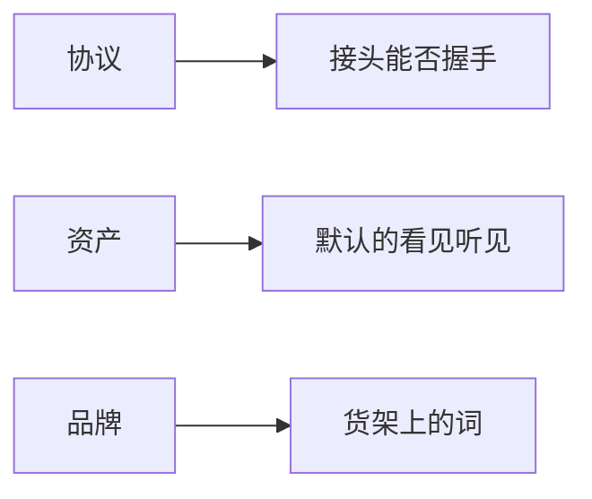

> **本章命题**：谁能承诺什么，取决于他把三件不能混的东西——协议、资产、品牌——拆开了没有。社区能续命接头，官方能续命商标，开源能复印规则。没有人能用其中一件，把另外两件一起买走。本章不是法律意见。

## 问题

有人做一个能进某一版生存服的客户端，就说自己重写了 Minecraft。有人换了默认包和主菜单，也这么说。有人把格子和第一夜抄进另一款游戏，商店页写「精神续作」。三句话都在用同一个词，承诺的根本不是同一份东西。

要回答：谁能承诺什么？可被证伪的说法是：能跑方块、能联机、能开源，就取得了继任权；或者反过来，只有权利人才能思考不变量，社区项目只配当插件。只要还存在 Luanti 能活成引擎却占不住口语、只要还存在 ViaVersion 能翻译协议却搬不走商标、只要还存在官方换实现却迁不走存档，这句话就不成立。[^luanti] [^via] [^store]

上一章把读旧档收成伦理，并把代价写进范围。[《兼容性策略》](/rewrite/compat) 伦理回答「你欠玩家的时间什么」。本章回答「你欠词什么」。词可以指接头、指默认的看见和听见、指货架上的名字。三指一混，考试会变成商标战，或者变成「开源等于无罪复印」。两条都会让不变量没人考。

<Callout type="warning" title="不是法律意见">
后文区分协议、资产、品牌，是为了把产品承诺写清楚。许可、版权、商标、EULA 的效力以权利人文本和适用法律为准。本书不代替律师，也不给任何项目发放继任许可证。
</Callout>

<Cards>
  <Card title="四格不能互相替代" href="/rewrite/what-to-rewrite" description="先问重写哪一层，再问谁能承诺。" />
  <Card title="第二条作者席" href="/history/mods-as-authors" description="完整产品长期写在 jar 外。" />
  <Card title="立法权不在一个办公室" href="/design/who-makes-rules" description="引擎、插件、宪法是三层设计师。" />
</Cards>

## 三件不能混的东西：协议、资产、品牌

**协议**是接头。握手时的版本号、区块怎么切成包、窗口点击怎么变成立法请求。它可以被翻译。ViaVersion 证明翻译能续命。[^via] 续命的是进服。进服不是家还在，也不是你可以用这个名字卖客户端。协议适配写进兼容范围，是工程伦理。工程伦理不自动变成品牌授权。

**资产**是默认的看见和听见：材质、模型、音效、皮肤、那几首已经被一代人听成「进世界」的曲子。换皮已经发生十几年，资源包河证明皮肤不是不变量。[《必须保留的设计不变量》](/rewrite/invariants) 皮肤能换，不等于默认包是公共领域。社区项目用自己的方块和自己的声音，走的是继承或局部兼容。社区项目把官方默认包打进发行包，走的是另一条必须单独面对的路。本书不在这条路上给过关戳。要说的只有：资产兼容和协议兼容不是同一个承诺。

**品牌**是货架上的词、标志、启动器的那张脸，以及玩家以为自己买到的那句话。官方能承诺品牌，因为品牌是他们的产品入口。社区不能靠「更像」把入口搬走。更像是观感。观感不是许可证。Bedrock 用品牌走了一条像兼容、语义上分叉的路：内容对齐，因果不同，商店页仍诚实写了存档迁不走。[《两条产品线：Java 与 Bedrock》](/history/java-bedrock) 品牌能把两份因果捆在同一个词下。捆住之后，玩家会用「还是 Minecraft」验收另一套物理。这是官方才付得起、也必须自己承担的混乱。社区项目若再借这个词去验收另一套物理，混乱会变成欺诈。

三件可以合作。合作必须写在封面上：我们兼容哪一版协议；我们不用官方资产 / 我们按授权使用某部分；我们与商标权利人是什么关系。不写，下载页会替你把三件焊成一句「Minecraft 重制」。焊成一句之后，考试对象消失了。剩下的是诉讼风险和失望。失望来自玩家以为家还在。风险来自权利人认为名字被挪走。本书对后者只标边界，不写判决。

<Constraint name="三件拆开才能承诺" verdict="地基" chain="接头可翻译 → 默认包另有主人 → 词是入口不是骨头">
拆开，社区、官方、开源引擎各自能说清自己交的是哪一格。焊在一起，「重写」会变成抢名字。抢名字不是考试。
</Constraint>

## 三种主体能承诺什么

主体不是道德等级。是能力边界。

**社区项目。** Paper、Fabric、Sodium、ViaVersion、无数核心和加载器，已经是局部重写。[《我们到底在重写什么》](/rewrite/what-to-rewrite) 它们能承诺的，通常是一格产品上的接头或性能：点名策略仍尽量像挖和放，加载器仍给第二作者席，网格仍让「这一格看起来还是那一格」，翻译器仍让不同协议号握手。它们不能承诺品牌。它们通常也不能承诺默认资产。它们更不能承诺「官方会把你的补丁收进正作」。收编是挑选动词，不是接收整套新陈代谢。[《模组作为第二作者》](/history/mods-as-authors) 社区项目的诚实封面是：我们重写了哪一格、兼容到哪一版、哪一些行为故意改了。改了还宣称「完全原版」，是用社区声望做第三条无代价路。上一章禁止过。

**官方继任。** Mojang / 微软能承诺品牌、能承诺默认资产的下一份、能承诺启动器里的版本列表继续变长。能承诺不等于会承诺读所有旧档、冻住红石、或把模组河收进正作。官方换实现已经发生一次：Bedrock 是另一次实现，不是 Java 的皮肤。[《Bedrock 作为另一次实现》](/impl/bedrock) 官方继任若再写一份内核，仍要面对同一张考卷：四格里重写哪一格，兼容还是继承，梯子进不进范围。商标不能替你答。商标只能让答错的时候，更多人以为自己还在玩同一句话。所以官方的责任更重，不是更轻。更重，因为封面已经印好了。

**开源引擎。** Luanti 一类项目证明：格子、挖放、模组席位可以离开商标活成引擎。改名是为了摆脱影子，不是为了宣布自己是官方继任。[^luanti] 开源能复制规则的形状：一米格、可破坏、可扩展。开源不能复制二十年存档、不能复制已经被家庭说会的口语、不能复制墙上那一套只对某一版 Java 红石成立的教科书。规则可抄。测试集不可抄。把开源听成「所以我们可以当 Minecraft 的继任仓库」，是把第三条主体焊回品牌。焊回去，开源的优点——能改、能分叉、能被教育机构再开发——会被商标战吃掉。

没有第四种主体叫「思想继承人」。思想不颁发执照。不变量是考试尺。尺可以量任何仓库。量过关，你得到一款配得上总命题的游戏。过关不发给你那个词。词在品牌那一栏。

## 三种用户的不同需求

模组作者、服主、教育者都会说「我希望有人重写」。他们要的不是同一个承诺。

**模组作者**要的是扩展面：世界 / 内容 / 系统三块能指的 API，崩溃域分开，热重载有班次边界。[《脚本与模组的双层》](/rewrite/scripting) 他们可以接受换语言，不能接受每年接头作废还没有映射词典。社区加载器已经在付这张账单。官方若重写模组平台，承诺的应是席位和稳定面，不是「所有旧 Mixin 还咬得上」。咬得上是兼容层。兼容层要写进范围。不写，作者席会再溢回破解。

**服主**要的是法律和规模：权威还在、旧档能迁、协议能翻译、领地 / 备份 / 回滚不必每个进程从零立法。[《网络、权限与社会功能下沉》](/rewrite/network-perms) [《规则由谁制定》](/design/who-makes-rules) 他们可以接受新内核，不能接受大厅重置删了生存家，也不能接受封面写兼容、红石仿真却是周末插件。服主的测试集是进程里的人。人比 CI 吵。

**教育者**要的是能进课室的许可、能指的格子、不一定要准连接。课室常常走房间半径，走数据层，走「不要在课上拆家」那句不成文宪法。他们可能更需要继承：干净的因果、可审查的扩展、明确的资产许可。把教育需求听成「所以官方必须开源全部资产」，会把课室变成版权战场。把教育需求听成「所以可以没有第二作者席」，会把课室变成演示。演示能教一节课。教不了「别人还能接着改这个世界」。

三种需求可以共享内核。共享不是合并封面。给模组作者的稳定面，可能故意不稳定协议字节。给服主的仿真层，可能对课室太脏。给教育者的许可清单，可能让万人服觉得不够用。矩阵再一次生效：一格的成功标准，不能拿去验收另外两格。

<Alternative title="若用一个超级客户端满足三种人">
主菜单里同时放模组加载器、大厅、课堂开关、官方皮肤。安装说明会变短。冲突会在第一份既要冻红石、又要过审核、还要热更新配方的存档里回来。开关假装解决了主体边界。边界在承诺里，不在按钮上。
</Alternative>

## 开源的边界

开源能做的，是把规则变成可被再开发的文本：模拟怎么走、扩展面怎么切、梯子怎么挂。这与总命题里的再开发同向。同向不等于把原作的磁盘变成公共财产。

边界至少有四条。

**规则 ≠ 存档。** 你可以把「一米格、世界即库存」写进自己的引擎。你不能把别人十年箱子里的对象变成你的演示世界，还说这是开源的自然权利。存档是玩家时间。玩家时间不属于许可证模板。

**规则 ≠ 默认包。** 你可以画自己的方块。你不能把官方默认的看见和听见当成引擎的单元测试夹具，除非你另有许可。单元测试夹具很方便。方便不是边界消失。

**规则 ≠ 品牌。** 你可以在文档里讨论 Minecraft，本书就在讨论。你不能把讨论听成改名权利。Luanti 改名，是看见了这条线。[^luanti]

**开源 ≠ 官方继任。** 官方可以开源工具库（DataFixerUpper 已经开过一部分格式梯子）。[^dfu] 开源一个库，不是把四格产品和二十年测试集捐出去。社区可以开源另一份引擎。另一份引擎过关，过的是不变量，不是继任仪式。

卷二把窗口写成抄不走的条件：时机、口语、工具链、已被收成 API 的未定义行为。[《可迁移原则清单》](/design/transferable) 开源更不能复制窗口。窗口关了。关了之后，开源的价值是让规则能被课室、模组作者和服主继续改，而不是让某个人在商店里坐下一代人已经说会的那个座位。座位是品牌和媒介史。规则是考试。

<Memoir title="能跑的克隆和能住的引擎">
每年都有更像的方块生存。像在预告片里。开源引擎里真正活下来的，往往先丢掉那个词，再老老实实养模组席和世界文件。丢掉词，不是认输。是把承诺从品牌栏挪回规则栏。挪回去，用户才知道自己下载的是什么。
</Memoir>

## 判定标准：不变量仍在

成功标准不是「更像」。像是皮肤和口音。皮肤能换。口音能进仿真层。考试只认规则。[《必须保留的设计不变量》](/rewrite/invariants)

拿一份自称重写的仓库，问七句：

1. 格子还能指吗？门还是两格吗？挖下去的东西还能放回世界吗？
2. 动词还是那几只手吗？有没有另开建造模式把误用关在门外？
3. 目标还空着吗？还是通行证在指定你该成为谁？
4. 建造度量上还有能被误用的因果吗？还是只剩脚本机关包？
5. 存档还能比这次引擎活吗？梯子写进范围了吗？还是请开始新游戏？
6. 第二作者席还在吗？数据层和系统层都在吗？还是只剩审核货架？
7. 创造还寄生在生存的尺上吗？还是工地已经搬走成文件？

七句都过，总命题还可以用在这份产品上。过关之后，再看封面：协议承诺到哪一版，资产从哪来，名字是不是那个商标。封面诚实，社区项目、官方继任、开源引擎都能各自交卷。封面撒谎，再像也只是又一次描摹。描摹可以很好玩。好玩不是继任。

谁有权重写？任何能把承诺写清楚的人，都有权重写**自己那一格**。没有人有权用一格的答卷，把另外两件东西和另外三种用户一起宣布毕业。毕业权在用户的时间里。时间在存档里。存档上一章已经写过：读不起，就是宣布作废。作废可以。作废加上借来的名字，是本章要挡住的那一种重写。

下一章交卷。交卷不是推销下一款游戏。交卷是看清原作：前三卷钉住的那句话，剥开偶然之后还在不在。

## 这一章留下什么

- **爱好者**：有人说重写了 Minecraft，你问三件事：能不能进你现在的家，看见的是不是那套默认的方块和声音，货架上的词是不是同一个。三件事可以分开答应。分开答应才老实。捆成一句「就是它」，你要先问自己的存档还算不算数。
- **开发者**：能抄走的是三栏承诺表——协议、资产、品牌必须分写；社区 / 官方 / 开源各自只能填其中几格；模组作者、服主、教育者的验收不能合并。抄不走的是商标、默认包、二十年测试集，以及已经被说会的口语。你不得从本章读出「开源等于继任」，也不得读出「只有权利人才能思考不变量」。判定标准仍是七条骨。骨过关，改名是诚实。骨不过关，更像没有用。本章不是法律意见。法律意见请去问律师，不要问一本考试。

[^luanti]: Luanti 官方博客，2024 年 10 月 13 日《Introducing Our New Name》：承认常被问是否 Minecraft 克隆，改名是为摆脱影子。见 <https://blog.luanti.org/2024/10/13/Introducing-Our-New-Name/>。

[^via]: ViaVersion 等翻译器让不同协议号的客户端与服务端互连。见 [ViaVersion](https://github.com/ViaVersion/ViaVersion)。

[^store]: Xbox / Microsoft Store 商品页注明：Java 版存档与 Bedrock 版不兼容。见 <https://www.xbox.com/en-us/games/store/minecraft-java-bedrock-edition-for-pc/9nxp44l49shj>。

[^dfu]: Mojang 开源库 DataFixerUpper。见 <https://github.com/Mojang/DataFixerUpper>。
