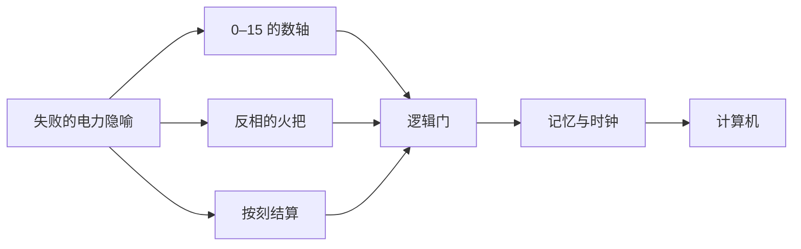

> **本章命题**：红石的成功来自电力隐喻的失败——设计者交付的是可组合的物理规则而非玩法清单，玩家便把零件一个个误用成逻辑门、时钟、飞行器与计算机，误用不受系统惩罚，反而被收编为玩法；满足「物理而非清单、正解由社区发明、误用不受惩罚」三条的系统，本书称为**可误用系统**。若官方把红石的怪癖按文档修正干净而社区觉得更诚实而非被阉割，或玩法的正解最终由官方钦定，本命题即不成立。

## 问题

一个刚挖到红石矿石的新玩家，多半走过同一段弯路。红石是 Minecraft 里一种暗红色的矿石，挖开会掉出发光的红色粉末——红石粉。他把粉末撒在地上，粉末亮了：这不就是游戏里的电线吗？他接上拉杆（一个扳动后就会发出信号的开关）和一盏红石灯，一拉，灯亮了。一切顺利，直到他把「电线」拉长——走出十几格，灯怎么都不亮了。他检查半天，找不到任何断口，因为红石粉上根本没有「断」这个东西，只有「弱到不足以点亮」。

大多数人到此为止，把红石归入「高级玩意」，从此绕着走。直到某一天，他们在视频网站上刷到另一群玩家用同一种粉末造出的机器：能做加减法，面板上有数码管，输入数字，它真的会算。这时再回头看当年那盏没点亮的灯，中间隔着的不是技巧，是一整门没有名字的学科。

换个场面。一个红石老玩家去看别人贴出来的活塞门图纸——活塞是能推动方块的机械臂，玩家常用它做暗门。外行看到的是一堆方块怎么摆；老玩家扫一眼就开口：「输入在这里，这里反相一下，这里延时两拍。」那张图在他眼里是电路图。有符号，有读法，有对错；而且这套读法全行业通用——任何一个老玩家画出来的图，另一个老玩家都看得懂。

一件游戏素材，怎么就变成了一门工程学科？本章的回答分五步走：先分清 Wiki 上的红石和游戏里的红石各指什么；再看电力隐喻败在哪里、败掉的隐喻为何偏偏长出逻辑电路；然后追问「官方不教」意味着什么；接着检视玩家发明的四种计算；最后把红石放回「可编程」的全部道路里，看它到底站在什么位置。

## Wiki 上的红石和游戏里的「红石」不是一回事

游戏里的红石，是一组素材。核心是红石粉，官方给它的第一条身份是「一种矿物，用于合成、酿造、修饰，以及作为可放置的导线」——注意这个排序，导线排在最后，和合成材料、药水材料并列[^dust]。围绕它有一族零件：红石火把，一个常亮的小光源，也能给线路供电；拉杆和按钮，发出信号的开关；铁门，一种用手打不开、只能由红石信号操纵的门。这批东西在 2010 年 7 月一起进入游戏。有两个细节值得记住：其一，红石粉上线时还没有正式名字；其二，它进游戏的方式是顶班——替换了此前搁置的「齿轮」，旧世界里已经摆好的齿轮方块一夜之间变成红石粉，因为两者共用同一个物品编号[^alpha-v101]。一个连名字都没定下来的系统，从第一天起就没携带说明书。

游戏愿意教的，到素材为止：粉能合成东西，能给药水延时，能铺在地上传信号。再往上的问题——这些零件能拼出什么——游戏一个字都不说。

打开社区维护的 Minecraft Wiki，「红石」是另一个词。它的主条目像一本工科教材的目录：传输电路、逻辑门、脉冲电路、时钟电路、记忆电路，各成一章，各有术语和标准画法[^circuits]。记忆电路的命名直接借自现实电子学——RS 锁存器、T 触发器——Wiki 自己的解释是，这些电路「与现实中的同名电路行为相似」。条目甚至收录了一整套设计目标词汇：追求「平」（整体贴地）、追求「静」（运行无声）、追求「无缝」（藏进墙面看不见），乃至一个专门形容「故意用冷门零件实现常规功能」的词。顺着目录往深处走，终点是一篇教你造计算机的教程，开篇第一句：「这篇文章极其复杂，写给书呆子。」[^computers]

词汇是学科最硬的标志。当一群玩家开始用「准连接」「锁存器」「时钟」这样的行话精确交流，而不必每次都从头描述现象时，说明这门知识已经完成了整理和标准化——剩下的只是扩充。而标准化的规模远超游戏本体的供给：游戏那一侧，红石的内容量很小，几种材料、十来个零件、一条「信号会衰减」的规则，按内容量衡量只是一次普通的更新；Wiki 这一侧，同一个词展开成一本厚教材。两侧的体量差，就是玩家作者性的体量。这个分工没有任何人规划过——官方造零件时没想到教科书，社区写教科书时也没等官方点头。是谁、用什么方式把材料铺成学科的，是接下来三节的真正话题。

## 它不是电：隐喻为什么失败

红石初看确实像电：有源（拉杆、火把），有线（红石粉），有负载（灯、门、活塞）。玩家拿日常用电的直觉来理解它，头三分钟是灵的，之后步步落空。落空集中在三处，每一处都值得单独看。

**信号强度不是电压。**红石粉上的信号分十五级，最强为 15，每走过一格强度减 1，十五格之后归零；想让信号走得更远，得用中继器——一个把信号重新拉满、顺带附加固定延迟的方块——来接力[^dust]。真实的电压不会这样一格一格地掉。更要紧的是这个设计的正确读法：电压是连续的物理量，人没法拿电压数数；红石的十五级是离散的整数，能被读出来、比大小。后来官方加入的比较器（一个读取信号强度、比较强弱的零件），读的正是这个数——箱子装得满不满，也能变成一格一格的读数。所以玩家以为自己在用电，其实是在数数：他们拿到手的不是电，是一条从 0 到 15 的数轴。回头想本章开头那盏不亮的灯：它不亮，不是「电压不足」，是数轴读完了。按用电直觉问「为什么没电」，永远问不出答案；换成「数到哪里了」，问题立刻可算。隐喻的失败不是抽象的美学判断，它就落在玩家每一次错误的预期上。

<Constraint name="十五格就走完" verdict="地基" chain="红石粉衰减 → 中继器续力 → 比较器读数">
约束：信号沿红石粉最多走十五格，且强度逐格递减。评判：表面像缺陷，实际是接口——它逼出中继器与比较器两层发明，让红石握有游戏里唯一的「模拟量」。约束即深度，卷二第 15 章把这个论题正面展开（见[《约束即深度》](/design/constraints)）。
</Constraint>

**火把不是电源，是反相器。**红石火把看上去最像电池：插在地上就亮，能给线路供电。但它的真实行为是——它附着的方块一旦带电，它就熄灭；方块断电，它重新点亮。输入「开」则输出「关」，输出永远是输入的反面。这个行为在逻辑学里叫反相，做成元件就是非门：把「是」变成「不是」的东西。现实里的火把没有这个职业，现实里的电池更不会。那个把自己当电池的火把大概不知道，它真正的岗位是逻辑元件[^torch]。更妙的是，若切换得太快，它还会「烧毁」——熄灭一小会儿，再自己缓过来。一节自带过热保护的电池。隐喻行至此处，已经公开破产。

**时序是刻，不是物理时间。**游戏世界按固定的节拍运行：每秒二十拍，一拍称为一个刻。红石的变化不连续传播，而是按刻结算——中继器的延迟是整数个刻，火把的翻转也踩着节拍走。所以红石网络不是一套连续的电流，而是一个被均匀切片的同步系统；它更像钟控的芯片，不像墙里的电线。对搭机器的人来说，这个差别是好消息：所有零件听同一个节拍器，谁先谁后、隔几拍动手，都变成可以设计的东西——「先后」在红石世界里不是玄学，是可数的资源。（各版本的节拍细节并不一致：比如「准连接性」这种怪癖只在 Java 版存在。双版本的总体分野见[《两条产品线》](/history/java-bedrock)，工程层的账目归[《红石的实现》](/impl/redstone)；本章只讲各版本共有的设计层。）

三处失败各留下一样残骸：一条 0 到 15 的数轴，一个现成的反相器，一个离散的节拍。单看哪一样，都是对电的粗糙模仿。但三样残骸，恰好是逻辑电路的三样原料——数据、判断、时钟；拼起来，形状像极了另一门学科的地基。

逻辑门——对信号做判断的基本元件——需要的原料，红石一样不缺。或门，两股红石粉汇成一股，任一股来电、整股就亮；非门，一根火把，现成的；与门，由或门加两个非门组合而成，两种输入都到齐才有输出。这些「标准画法」没有一个是官方颁布的，全是玩家试出来的，后来被 Wiki 收录成典[^circuits]。有了门，再引入反馈——把输出绕回输入，让某个状态自己咬住不放——就有了记忆；这种能锁住状态的电路，玩家照着电子学的样子叫它锁存器。有了门、记忆和统一的节拍，计数器、运算器、存储器就只剩工程量的问题了。

顺带说破一个词：图灵完备。它的白话意思是——一套东西只要能做判断（与、或、非），能记住状态，再给足空间，原则上就能搭出任何可计算之物，从加法器直到能按程序运行的机器。现实里达到这个门槛的是编程语言和处理器。红石在没有任何人有意设计的情况下，用矿粉、火把和推方块的手臂，撞进了这个行列。

因果链现在可以写直了：隐喻失败，所以没有现成的「用电玩法」可抄，玩家只能俯身去读那套物理；规则可组合，所以读出来的每个小发现都能无限拼接。失败的隐喻加上可组合的规则，玩家手里就多出一门没有作者的语言。这不是 2010 年那位设计者的深谋远虑——那批零件上线时连名字都没有——但它确实发生了。

可以再做一个反事实检验，把两个条件各自拆开。假如隐喻成功了——红石真的像电，玩家点亮电灯、接通电动门就心满意足——谁还会俯身去读衰减曲线和反相火把？正是「用电直觉处处碰壁」，才逼出一次重新阅读。假如规则不可组合——每个零件只有一种钦定用法，火把只能照明，活塞只能开门——那再多的零件也只是更大的一袋工具，长不出逻辑：逻辑的生命在于把小发现无限拼接。两条缺一，后文那台计算机都不存在。

## 官方不教意味着什么

先把「不教」确认成事实，而不是修辞。游戏内没有红石教学：没有引导任务，没有图鉴，没有说明面板；玩家能从游戏本身得到的提示，只有材料用途和几张合成表。官方对红石的姿态，十多年里可以概括成九个字：加零件，立物理，不解释。唯一一次接近表态的举动，是 2013 年把整个 1.5 版本命名为「红石更新」，一口气加入比较器、漏斗（能自动搬运物品的方块）等一整批零件——零件加了不少，教材依然一个字没有[^redstone-update]。命名是承认，不教是立场：官方用一整个版本号说了「这东西重要」，又用沉默守住了「我们不钦定用法」。

更有意思的是方向。红石史上最重要的零件之一——活塞——压根不是官方发明的。它最初是一位玩家发布在论坛上的模组；这位名叫 Hippoplatimus 的玩家把代码交给了 Mojang，活塞于 2011 年进入游戏本体，他的名字至今列在游戏的制作名单里[^piston]。这个先例立起一条双向的回路：社区发明零件，官方收编；官方发布零件，社区发明用法。教科书自始至终只写在一侧——社区那一侧。

旁证有一根：微软 2016 至 2018 年给 Windows 10 的五次大型更新，内部代号就叫 Redstone，并公开说明援引自 Minecraft[^dust]。一个游戏素材的名字能脱离它的材料继续旅行，是它已经变成某种公共事物的旁证——那时已没人把它当成「某种红色的矿石」看待了。

「不教」至少有三层含义。

**第一层是权力。**教材在谁手里，修订权就在谁手里——这件事平时看不出来，版本交替时看得最清楚。红石的教材在社区手里，于是每次官方发布快照（公开测试用的预览版本），社区的第一反应不是等待权威解读，而是自己上手点验：教材要自己改，答案要自己出。这门知识不寄存在官方服务器上，它寄存在玩家中间。

<Memoir title="快照发布日">
每逢快照日，技术玩家社区会像质检部门一样行动：逐条读更新日志，进测试存档把依赖各种怪癖的机器一台台开机验收，几个小时之内，「哪类装置在新版失效」的清单就会挂上论坛。官方改一行物理，社区连夜对账——教材是社区写的，改教材的也只能是社区。
</Memoir>

**第二层是合法性。**设想官方哪天开教，出一份《红石标准用法》。会发生什么？写进去的用法成为正解，没写进去的用法自动降格为歪门邪道——火把的职业是照明，拿它做非门从此就成了「错用」。而红石全部的生命力，恰恰在这种「错用」上。不教，等于不钦定；不钦定，等于一切用法生而平等。官方的沉默不是怠慢，是这套系统得以成立的前提。

修不修怪癖，是同一枚硬币的另一面。

<Constraint name="准连接性：修，还是不修" verdict="地基" chain="MC-108 → 十年机器的地基 → 按文档修等于拆机器">
Java 版有个著名怪癖：活塞能被比常规高一格位置上的信号驱动，照规则推演本不该成立，早年有玩家正式上报了 bug，编号 MC-108。社区把它用了十年，无数机器拿它当地基。修，等于静默拆掉十年积累；不修，等于文档和行为永远不一致。官方选择了不修。这是「不教」的姊妹决定——不钦定，也不修正。机制细节见[《红石的实现》](/impl/redstone)，此处只记设计判断：当怪癖成为接口，修正本身就是破坏性变更。
</Constraint>

**第三层是代价，必须如实承认。**没人教，门槛就真实存在：入门靠 Wiki、视频和口口相传，劝退率不会因为本章把它说得动人就降低；两个版本行为有差异，教材还得标注版本号。赞美这套系统，不必否认它的陡峭——把这笔账记着，第五节谈三层结构时，才能讲清脚本层为什么必须存在。

现在可以正面立起这个概念了。本书把红石这类系统称为**可误用系统**，判定三条，缺一不可。

一，**设计者交付的是物理规则，不是玩法清单。**零件自带的「本职」只覆盖其用途的一小半——火把的本职是发光，没人规定它能做非门；设计者既不解释，也不禁止。

二，**玩法的正解由社区发明，并反哺规则。**正解不在官方教材里，在社区十几年的试错里；试错的产出还会流回游戏——活塞从模组进入本体，就是社区的玩法反向改写了规则的实例。

三，**误用不受系统惩罚，还能沉淀为新玩法。**没有反作弊盯着你「不规范地使用火把」，没有一堵墙写着「此处非设计用途」；误用和正用在物理面前完全平等，只要摆出来合法，就享有同样的运行权。而一个误用一旦被足够多的玩家复制，就会进入图例、进入教程，成为下一批玩家的「常规」——飞行器就是从误用毕业成的玩法。

三条判定各对应一方：第一条约束设计者，第二条承认社区，第三条约束系统本身。缺任何一条，概念都会退化。只有第一条，得到的只是「可摆弄的物理」——不少沙盒游戏也给了电线和机关，却没有长出学科，因为用法早被说明书固定死了；只有第三条，得到的只是「宽容的沙盒」——乱来不会被罚，但乱来也沉淀不出正解。可误用系统说的是三者的乘积，不是其中之一。

反过来，「红石是可误用系统」这句话怎样算错？三种情形，任一成立即错：官方把准连接这类怪癖按文档修正干净，而社区的普遍反应是「游戏更诚实了」而非「机器被拆了」；新零件附带的钦定用法被强制执行，比如火把真的只许用来照明；社区发明的玩法永远得不到规则的回音。本卷后续章节还会出示别的样品，判定一律沿用这三条——而红石，是其中分量最重的一件。

## 发明的计算：门、时钟、飞行器、计算机

概念立完，看实物。下面四样东西，游戏一样都没有直接提供；它们全部由「本职之外」的零件拼成。每一样都是对物理的一次重新解释，而不是对教程的一次复述。本节只讲它们各自误用了什么，不教怎么搭。还要提前说明一点：这四样东西，没有一样出现在任何一次更新公告里——它们的「发布渠道」从来都是论坛帖、视频和 Wiki 条目。

### 门：把亮灭读成真假

第一次误用最基础：把火把和红石粉的「亮、灭」读成「真、假」。火把的本职是照明与供电，玩家把它读成反相器；红石粉的本职是传导，它的衰减曲线被读成一条数轴。亮灭一旦对应真假，红石就与布尔代数——一门研究真假如何运算的数学，十九世纪就有了——接上了轨，玩家的业余发明从此站在一门现成学科的地基上。今天老玩家看活塞门图纸，扫一眼便知哪里是输入、哪里在反相、哪里在延时：那张图本来就是电路图，用的还是社区自己定的图例[^circuits]。这一代玩家多数没在学校学过电路。他们自己发明了一遍。

### 时钟：把延迟读成节拍

第二次误用更刁钻：把「慢」读成「节奏」。信号在线路上传递要花时间，中继器天生自带延迟——这本是物理欠下的债。玩家让几个中继器首尾相接围成一圈，信号在里面永远绕圈跑，输出端就得到稳定的亮灭交替：一个节拍器。红石玩家叫它时钟电路。它是所有自动装置的心跳：没有它，机器只有「开」和「关」两种状态；有了它，机器才有「下一步」。Wiki 为它单独立页，与逻辑门、记忆电路并列[^circuits]。把物理的债转成节奏的资源，没有任何教程教过这个动作——它是对规则的重新解释，不是对规则的执行。

### 飞行器：把推拉读成推进

第三次误用最大胆。活塞的本职是推方块，单次上限十二格——官方在反馈站明确答复过：这个上限「出自设计」，并非技术做不到[^piston]。2014 年，1.8 版本加入黏液块，一种能把相邻方块黏成一团、还能把生物弹起来的方块；官方的更新说明里没有一个字提到飞行。但玩家很快发现：活塞推得动整团被黏住的方块，再配合观察者（一个侦测到方块发生变化就发出信号的零件，本来为自动化农场而生），让两组「活塞加黏液块」互相推着走——机器就离开地面了。游戏里没有「载具」这个类目，没有推进器物品，也没有任何飞行规则；飞行器是玩家发明的第三种移动方式，与走路、坐船并列。Wiki 后来把它收录为精选教程——一次误用，就这样毕业成了玩法。

### 计算机：把物理读成指令

误用的终点，是下面这张照片。

<Figure src="/images/redstone-computer.png" alt="沙漠平地上的红石计算机：成排重复的逻辑电路模块沿直线铺开，黑色面板上的七段数码管亮出一个数字" caption="一台红石计算机。黑色面板上是七段数码管——用发光方块拼出的数字显示器；身后成排重复的模块，是它的运算与存储电路。这台机器没有一行代码，它的「程序」是用方块摆出来的。图源：Minecraft Wiki。" />

社区造出的红石计算机能做算术、能点亮数码管显示数字，更复杂的同类还能载入指令、按程序逐步运行——Wiki 的专门教程开篇第一句就是自嘲：「这篇文章极其复杂，写给书呆子。」[^computers] 值得注意的不是「玩家真能造出计算机」这个壮举，而是壮举的原料单：运算靠火把和矿粉，存储靠锁存器，显示靠一排灯——每个零件都在履行本职之外的第二职业。上一节说图灵完备时加了「原则上」三个字；在这张照片里，原则落了地。

更有分量的是这门手艺的传承方式。社区的计算机教程不劝退也不玄化，而是把路切成台阶：一位加法器、四位、八位，然后是内存、译码、显示，最后才是整机。每级台阶都有人写讲解、录视频、答疑。一门学科成熟的标志，不是它出了多少天才，而是它能把天才的成果转成普通人可以攀爬的坡道——红石的计算机教程就是这样的坡道，而且完全长在游戏之外。

四个例子排成一列，斜率清晰：门，是重新解释单个零件；时钟，是重新解释零件之间的关系；飞行器，是发明系统里本不存在的类目；计算机，是把整套物理当成另一台机器的语言。误用一路升级，系统一路放行——这正是可误用系统第三条判定在实践中的样子。

## 三种可编程：机械 / 电路 / 脚本；Minecraft 选了哪条

「可编程」这个词，前文已经用了很多次，现在把它拆开。一个游戏想让玩家在它身上「写程序」，路其实只有三条。

**机械可编程。**程序写进空间的形状。活塞门、水路分拣（用水流把掉落的物品按落点分成几堆）、升降机，全部逻辑编码在几何里：水往哪里流，活塞往哪里推，墙上留几个口。要改程序，就得拆房子。它先于红石存在：不等任何电路，一桶水、几组活塞就能开工——许多玩家的第一台「机器」，不过是一条挖对了斜度的水沟。它没有信号、没有时序，是用石头写代码。

**电路可编程。**红石这条路。程序写进信号与时序，铺在方块表面上，工作方式接近电子工程：导线要占格，走线要绕楼，连审美都换成了工程词——「平」「静」「无缝」。这是一块三维的电路板。

**脚本可编程。**程序写进文本。命令方块——游戏内自带、能执行游戏指令的方块——和数据包（官方提供的数据层扩展）走的是这条路，模组（直接改动游戏程序的扩展）走得更远；那是另外两种手艺，卷二第 8 章与第 13 章分别展开。这条路接近软件工程：有语法，有报错，有版本。

三条路 Minecraft 后来都通了，但修通的次序很说明问题：游戏本体先修好的是前两条——它交付的是物理可编程。脚本层是官方后来补上的，补得相当克制；模组层则完全是社区自己凿出来的。多数游戏走的是反方向：先给脚本接口，物理交互浅尝辄止。先给物理，等于把「编程」放进一种人人摸得到、却没有语法的介质里。

「把编程当功能给」和「把编程当物理给」，是两种设计哲学。前者假定玩家想要的是写代码，于是内嵌一门脚本语言了事；后者不假定任何东西，只交付规则和零件，让「编程」这个用法自己从物理里长出来。红石属于后者，而且是在设计者并不自觉的情况下属于后者——这大概是本章最反直觉的一点：最成功的一门「游戏内编程语言」，从未被当作编程语言设计过。

门槛的差异就藏在这里，而它是可误用系统的心理前提。脚本有语法：错一个字符，程序拒绝运行，报错本身就是一道门。红石没有语法：摆错只会「不亮」，不会有系统弹窗纠正你「这不是火把的用途」。犯错便宜到可以反复挥霍，误用才有机会从手滑长成发明。

<Note>红石粉会随信号衰减而变暗：老玩家看一眼颜色，就知道信号走到了第几格。等于每人免费领了一台调试显示器——虽然官方从没提过「调试」这个词。</Note>

所以「Minecraft 选了哪条」的准确答案是：它没有三选一，而是把三条叠成了三层——机械是零件层，电路是逻辑层，脚本是语言层。红石住在中间那层：比机械多抽象，信号代替形状来编码逻辑；比脚本低门槛，没有语法，错误不惩罚。这个三层结构对重写者有一条硬要求：可误用性是不变量，不是怪癖清单。重写的引擎若把「物理规则」改成「官方钦定的用法清单」，红石就死了——把这条写进考卷的是卷四[《必须保留的设计不变量》](/rewrite/invariants)。

现在回答本章开头的问题：失败的电力隐喻，如何成为成功的逻辑电路？完整答案是四个条件的咬合。隐喻失败，玩家拿不到现成的「用电玩法」，只能俯身读物理；物理可组合，读出的每个碎片都能拼接；官方不教，读法就没有钦定答案；误用不惩罚，读错的代价只是「不亮」。四个条件少一个，这门学科都长不出来。这也解释了为什么模仿者多、长成者少：交付零件不难，难的是忍住不教，以及在玩家把怪癖当地基的那些年里忍住不修。它不是被设计出来的，是被**留**出来的——在这件事里，设计者的克制与设计者的能力同样重要。

## 这一章留下什么

- **爱好者**：你学红石的经历就是一部误用史——火把教你的第一课不是照明，是反相；下次看到活塞门图纸，你读的其实是一行用方块写成的程序。
- **开发者**：能抄走的是三条判定（交付物理而非清单、正解由社区发明并反哺规则、误用不受惩罚），以及「失败的隐喻也可能长成逻辑」这条路径；抄不走的是写了十几年的社区教科书，和早已被收编进物理的、玩家与设计者之间的默契。

[^alpha-v101]: Minecraft Wiki，《Java Edition Alpha v1.0.1》（2010 年 7 月 2 日发布，即 Seecret Friday 3：加入红石粉、红石矿石、红石火把、拉杆、按钮、压力板与铁门；红石粉当时未命名，并顶替了共用编号 55 的「齿轮」），minecraft.wiki，检索于 2026-09-18；见 https://minecraft.wiki/w/Java_Edition_Alpha_v1.0.1
[^dust]: Minecraft Wiki，《Redstone dust》（红石粉的官方描述为「用于合成、酿造、修饰与作为可放置导线的矿物」；红石线信号最强 15 级，每格衰减 1，需中继器续力；Windows 10 于 2016–2018 年的五次大更新以 Redstone 为代号，援引 Minecraft——The Verge，2015-04-07），minecraft.wiki，检索于 2026-09-18；见 https://minecraft.wiki/w/Redstone_dust
[^torch]: Minecraft Wiki，《Redstone torch》（红石火把在附着方块被充能时熄灭，因而可作反相器使用；切换过快会烧毁并短暂熄灭），minecraft.wiki，检索于 2026-09-18；见 https://minecraft.wiki/w/Redstone_torch
[^piston]: Minecraft Wiki，《Piston》（活塞源自玩家 Hippoplatimus 发布于论坛的模组，代码交付 Mojang 后于 Beta 1.7 进入本体，作者列名制作名单；单次推动上限 12 格，Minecraft 反馈站 2019-01-03 答复称「当前的限制出自设计」；黏液块于 1.8 快照 14w18a/14w19a 加入），minecraft.wiki，检索于 2026-09-18；见 https://minecraft.wiki/w/Piston
[^circuits]: Minecraft Wiki，《Redstone circuits》（收录传输、逻辑门、脉冲、时钟、记忆等电路分类；记忆电路「以现实电子学电路命名，因行为相似」；页面述及可在游戏内搭建计算器、数字钟与基础计算机），minecraft.wiki，检索于 2026-09-18；见 https://minecraft.wiki/w/Redstone_circuits
[^computers]: Minecraft Wiki，《Tutorial:Redstone computers》（开篇自述「这篇文章极其复杂，写给书呆子」），minecraft.wiki，检索于 2026-09-18；见 https://minecraft.wiki/w/Tutorials/Redstone_computers
[^redstone-update]: Minecraft Wiki，《Java Edition 1.5》（1.5 是「红石更新」的首个正式版，2013 年 3 月 13 日发布，加入比较器、漏斗等），minecraft.wiki，检索于 2026-09-18；见 https://minecraft.wiki/w/Java_Edition_1.5
