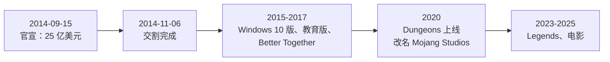

> **本章命题**：微软买下的是「入口」和「IP」，而不是一款游戏的拷贝收入；正因为如此，「让原版照旧免费更新」才是对买家最划算的选择。如果收购之后 Java 版停更、向老玩家收费、或被降格成二等版本，本章的判断就错了。

## 问题

2014 年 9 月 15 日，玩家打开新闻，看到的标题大同小异：微软将以 25 亿美元收购 Mojang。Minecraft 背后那家瑞典工作室，被一家做操作系统和办公软件的公司买下了。财经媒体把它当科技公司新闻来报；玩家却读出了另一层意思——自己天天住进去的世界，成了别人资产负债表上的一行。

当天，Reddit 的 r/Minecraft 版置顶了收购讨论帖，回复持续刷了几天。

<Memoir title="2014 年 9 月 15 日的社区">置顶帖的评论区里，「RIP Minecraft」是高频词；YouTube 上，几乎每个 Minecraft 频道都发了反应视频，标题从「游戏完了」到「也许没那么糟」不等。此后几周，「微软会把这个游戏改成什么样」成了社区所有讨论的默认开场白。</Memoir>

这些恐惧不是无缘无故的。2014 年，玩家对「平台公司接管一款游戏」的想象，有一份明确的清单：

- 买断制会不会变成订阅制或内购？
- 游戏里会不会塞进广告？
- Java 版（PC 上那条最早的、可以自由开服和装模组的产品线）会不会被砍掉？
- 自由开服、免费改装，会不会被律师函终结？
- PlayStation 版会不会停售？

恐惧的另一头，是微软当时的形象。就在一年多前，Xbox One 刚因为「强制联网、限制二手光盘」的发售计划翻了车；更早的 Windows 8 试图把应用分发收进自家商店，PC 玩家记忆犹新。让这样一家公司接手一个以自由著称的游戏，玩家想不出好结局，合情合理。

五条问题，当天没有一条有答案。而本章要回答的是另一句话：这笔交易买下的到底是什么——游戏、平台，还是一代人的入口？

办法是先不控诉、也不辩护：把当年的恐惧逐条列出来，再逐条对照后来实际发生的事——哪些发生了，哪些没发生，哪些以变形的方式发生了。这份对照清单，就是本章的骨架。

## 「卖身」叙事为什么太浅

「卖身」的说法当年到处都是：天才作者向大公司低头，亲手交出了自己的孩子。这个叙事好传播，但它太浅，因为它默认了一个前提——2014 年的 Minecraft 仍是一件 Notch 一人说了算的作品，卖与不卖是作者的品味问题。

前提不成立。到 2014 年年中，全平台付费销量已接近 5400 万份，主机版销量第一次超过 PC 版——其中 PC/Mac 版约一千六百万份，其余大头在主机与手机[^sales-2014]。玩家主体正在从「论坛极客」变成「家里有游戏机的孩子」。而且大量活跃根本不经过 Mojang：玩家联机在第三方服务器上，内容视频放在视频网站上，模组和材质包出自社区作者，Mojang 一个字节也不参与分发。

Mojang 本身却只是斯德哥尔摩一家几十人的工作室（这是量级表述，公司当时未公开精确员工数）。它要面对的问题是：每个主机版本都要过索尼和微软的认证流程；在德国卖和在北美卖，年龄分级各有一套规则；手机商店里挂着成百上千个仿冒克隆，商标要在各国逐一追讨；数万台收费运营的服务器，法律边界没人画清。

这些工作没有一件是「会写游戏」就能解决的。它们需要分发网络、法务团队、合规经验——要么自己雇一整套人从头学，要么找一个已经有的东家。这是能力问题，不是品味问题。

摆在桌面上的选项其实很少。上市不现实：一家只有一款产品的公司撑不起公开发行；不卖、改雇职业经理人打理，是第三条路，但方向盘名义上仍在创始人名下，压力不会消失；剩下的就是找一个东家。

Notch 的离开，用官方的说法就够了：Mojang 公告写明，他不愿再承担拥有这样一家公司的责任；同日，他与 CEO 卡尔·曼内（Carl Manneh）、联合创始人雅各布·波尔瑟（Jakob Porsér）一起宣布离开[^mojang-pr]。为什么离开、之后如何，不影响这笔交易的性质，本章不再展开。

为什么买方是微软？第一，合作基础可查：两家公司自 2012 年起就在 Xbox 版上合作，主机版正是 Mojang 增长最快的产品线之一[^mojang-pr]。第二，时机：2014 年 2 月纳德拉刚接任微软 CEO，新管理层把「云与服务」放在核心；Xbox 新负责人菲尔·斯宾塞主张「玩家在哪个平台，微软就跟到哪个平台」。买下 Minecraft 这样一个跑在 iOS、Android 和 PlayStation 上的游戏，却不把它变成独占，本身就是这份战略的注脚。

最后把账摊开：25 亿美元，换一个买断制游戏。哪怕按 5400 万份销量、每份二十多美元的量级粗算，光卖拷贝也要很多年才能填平。微软自己的新闻稿只要求这笔交易在 2015 财年「打平」，没有许诺高增长[^ms-pr]。如果这 25 亿买的是拷贝收入，它就是一笔败笔；所以答案一定在别处。

## 交易：结构、动机、时间线

先给可查的时间线：

交易结构本身并不复杂：全现金，25 亿美元；交割后 Mojang 成为微软游戏部门（Microsoft Studios，今 Xbox Game Studios）的全资子公司，瑞典法律实体保留，开发团队整体留任，三位创始人离开[^deal-close]。真正值得写的是动机——微软在为哪三样东西付钱？

第一样是**入口**。这里说的入口是一个具体的位置：一代玩家与数字世界的关系从哪里开始。孩子先认识苦力怕，再认识 Xbox；先在 Minecraft 里学会联机、管理服务器、装模组，再成为任何平台的长期用户。新闻稿里的数字说明这个入口有多密：PC 端下载量超过 1 亿次；近九成 PC 付费玩家在过去 12 个月里登录过——一款 2009 年发布的游戏，五年后仍留住几乎全部付费用户；仅 Xbox 360 一个平台，两年内累计游玩超过 20 亿小时[^ms-pr]。对一家平台公司，这是买得到的最好的用户关系。

入口的逻辑还解释了本章命题的另一半。入口的价值在「进门」，不在「门票涨价」：原版照旧、人人进得起，后来的人流才不会断。涨价或锁门，省下的是眼前的小钱，毁掉的是客流本身。

<Note>「下载 1 亿次」是 PC 端下载与注册的口径，不是付费销量；付费销量当期约 5400 万份。两个数字在当年的报道里经常被混用。</Note>

第二样是**IP 保险**。Minecraft 没有剧情主角，没有既定的世界观冲突，方块的视觉语言可以套进任何载体——课堂、玩偶、电影、衍生游戏，都谈不上「毁原著」，因为原著的规则本来就是「你自己搭」。很少有 IP 能这样低摩擦地跨媒介复制。想想相反的情形：一个剧情强绑定的 IP 拍电影，原著党要先吵三个月选角像不像；Minecraft 的电影只需回答「方块世界长什么样」，争论天然少一层。

第三样是**平台卡位**。Minecraft 规模巨大、全平台运行，离任何一家公司都「不够近」。放着不管，它迟早被某个竞争者握走；自己握住，则等于向整个行业表态：微软的玩家战略不再依赖独占。2014 年还有一个更具体的背景：Xbox One 刚输掉与 PS4 的首发之争。把 Minecraft 握在手里，等于无论主机战争谁赢，玩家都绕不开微软的一个入口。后来 PlayStation 版在收购后继续更新至今，兑现了跨平台这句话。

三条动机——入口、IP、卡位——共同指向同一个结论：这笔钱买的不是游戏本身，是游戏周围那个生态里的位置。它也有证伪条件：如果微软买的只是拷贝收入，第一动作该是收缩跨平台、榨取存量；实际走向相反。

## 「保护 Minecraft」保护了谁

先把用词校准。微软新闻稿里其实没有「保护（protect）」这个词。纳德拉的原话是：「Minecraft 不只是一款伟大的游戏系列——它是一个开放世界平台，由一个我们深怀敬意的活力社区驱动。」斯宾塞的原话是：「我们将以今天人们喜爱的一切方式，维持（maintain）Minecraft 及其社区。」[^ms-pr]

「维持」是个比「保护」更冷淡、也更可执行的词：它承诺的是条款不变，不是情感担保。社区当年脑中的「保护」，一半是自己补上去的。

这不是抠字眼：一句话承诺了什么、没承诺什么，日后都是玩家检验的凭据。事实证明，被兑现的正是「维持」这一档，不多，也不少。

现在逐条对照那份恐惧清单。

**「Java 版会被砍掉。」** 没有发生。收购后 Java 版照常更新：2016 年的 1.9 重做战斗，2018 年的 1.13 重做海洋与命令系统，2021 年的 1.18 重做地形生成，2024 年的 1.21 照常上线。十年间没有一次版本更新向老玩家收过一分钱。今天，Java 版仍是唯一可以绕开官方服务器自由建服、自由改装的版本。还有一层更硬的证据：模组生态没有萎缩，反而比 2014 年更繁荣——加载器与社区内容，仍是这个游戏最大的一块「免费内容部」。

**「买断制会变成订阅或内购。」** 在 Java 版上没有发生。变形发生在另一条产品线上：从手机版一路合并而来的 Bedrock 版建起了官方内容商城（Marketplace），玩家在商城里为社区作者做的地图、皮肤、材质付费。商业化没有消失，但它被装进了新生的那条线，Java 版被留作「原样」。两条线的分工本身，就是收购后最重要的一次产品设计（细节见[《Java 与 Bedrock》](/history/java-bedrock)）。

**「游戏里会出现广告。」** 没有以最直接的方式发生：原版游戏至今没有弹窗广告。但它变形发生了：IP 授权全面铺开——玩具、图书、课程、电影。游戏内没有广告，游戏外的货架和银幕上全是 Minecraft。

**「账号会被拿走。」** 半发生，最值得诚实记录的一条。2021 年 6 月起，Java 版玩家被要求把 Mojang 账号迁入微软账号；2023 年 9 月起，未迁移的旧账号无法登录[^migration]。你的游戏资格存在谁家的数据库里，确实归了微软。官方给的理由是双重验证和家长控制——理由本身大概成立，但「数据库换了主人」这件事，不因理由成立而变得不重要。边界在这里：迁移没有要求你为已购内容再付一分钱，玩法与内容没有被改动。所有权渗透到了账号层，没有渗透到玩法层。

**「跨平台会被阉割。」** 没有发生。PlayStation 版收购后继续更新至今；2017 年的「同在一起」更新（Better Together）反而把手机、Windows 10 和多台主机联成了一张互通的网络——PlayStation 版自己也在 2019 年 12 月加入了这张网。

对照结果：清单里最坏的三条——砍版本、改收费、拆跨平台——都没有发生；变形的是商业化的位置（商城装进 Bedrock，变现移到游戏外）；半发生的是账号。怎么解释？答案不是微软善良，而是利益一致：Minecraft 的入口价值建立在开放之上——可以自由建服、自由改装、买一次用十年。锁死开放，等于亲手毁掉入口。「原版照旧、变现走新轨」不是仁慈，是买家的理性。

<Constraint name="原版照旧" verdict="地基" chain="入口价值依赖开放与稳定 → 锁死原版等于自毁入口 → 免费照旧更新是买家的理性，不是恩情" />

顺带一提，商业化的第一枪也不是微软开的：2014 年夏天，就在收购官宣前几周，Mojang 自己收紧了用户协议，限制商用服务器的收费方式，那场风波的余波至今未平（见[《灰色经济》](/history/grey-economy)）。微软进场时，边界已经画了一半。

最后重申本章的证伪装置：哪天 Java 版宣布停更，或老玩家被要求补票，「温和」这个结论立即作废。

## Jeb 时代的风格转变

主设计师的交接其实发生在收购之前。2011 年 12 月，Minecraft 正式版发布的同时，Notch 把开发主导权交给了副手延斯·伯根斯坦（Jens Bergensten，社区称 Jeb）。「Jeb 时代」因此不是微软的安排，而是 Mojang 自己的换代；收购只是延续了它。

Jeb 时代的风格与 Notch 时代判然有别，主要差在三处。

其一，从「加东西」到「敢重做」。Notch 时代的更新以增加内容为主，祖传手感不容触碰——「鼠标点得越快，打得越快」这个战斗逻辑从 Alpha 时代就没动过。2016 年的 1.9 战斗更新给攻击加了冷却时间，等于宣告：作者席有权修改手感。争议大到今天 Java 与 Bedrock 的战斗系统仍是两套——Java 版守着冷却时间，Bedrock 版大体保留旧手感——但「重做」从此成为常态：2018 年重写命令系统，2021 年重做地形生成，每代大版本都动一块祖传地基。

其二，从个人口味到流程治理。更新的节奏从「想做什么做什么」变成主题制大版本：先公布主题——下界更新、洞穴与山崖、足迹与故事——再分季度推进，快照（提前数周公开的测试版本）全程试错。玩家与作者的关系随之改变：从「等神更新」变成「审计季度计划」。2017 年起的生物投票也是这个时代的产物——社区第一次拿到（有限的）选择权，「作者该不该听玩家的」第一次成了公开争论。

其三，双轨一致性成了新的工程负担。同一个设计要同时落进 Java 与 Bedrock 两条技术路线，每个决策里都多出一层「另一边能不能实现」的考量。这条约束收购前已存在，收购后被急剧放大。它具体到琐碎：一个攻击冷却的数值，Java 改了，Bedrock 的移动端跟不跟？跟了，手机玩家抗议手感变了；不跟，两边的参数表开始分叉。这样的选择题，Jeb 团队每周都在做。

人事层面只有一句值得写的事实：三位创始人离开后，没有清算，没有重组，Jeb 至今仍在负责 Minecraft 的创意方向。对一个被大公司收购的「独立」工作室，这样的人事稳定极少见——它是「维持」承诺被兑现的最直接证据。

作者席从一个人变成一套流程，这个变化与同一时期模组社区内部「个人作者→团队」的转移是同一件事的两面，见[《模组，作为作者》](/history/mods-as-authors)。

## 产品线扩张：教育、Dungeons、Legends、电影

收购之后，这个家族不再只有「原版与移植」。从 2015 年起，新产品陆续出现，逻辑惊人地一致：每种产品开一个新入口，服务一群原版够不到的人。判断这场扩张是清醒还是盲目，标准不在「做没做」，而在每一种产品有没有回答同一个问题：它把谁带进门？

《Minecraft：故事模式》（Story Mode）是第一发。2015 年 10 月首章上线，开发外包给叙事游戏名厂 Telltale Games[^story-mode]。它证明了方块 IP 能装进「别人家的游戏」，也暴露了授权模式的命门：2018 年 Telltale 倒闭，2019 年 6 月故事模式的服务器关闭，此后多数平台无法再下载已购章节[^story-mode]——玩家手里的东西一夜之间变成「曾经拥有」。这一课直接改写了后续策略：核心体验必须攥在自己手里。

<Constraint name="IP 外包授权" verdict="凑合" chain="叙事衍生超出自团队能力 → 外包 Telltale 走通了产品 → Telltale 倒闭、已购内容下架 → 自研成为后续默认" />

教育版走的是另一条路：把野生长出来的入口产品化。收购之前就有老师自发用原版上课；2016 年 11 月正式上线的 Minecraft Education Edition 把这件事官方化——基于 Bedrock，加上课堂管理工具与课程内容，买单方是学校预算而不是玩家钱包[^education]。这是入口逻辑最直白的一次兑现：游戏进了课表，新玩家从讲台上进来。

《Minecraft Dungeons》（2020 年 5 月 26 日，登陆 Windows、Xbox、PlayStation、Switch[^dungeons]）与《Minecraft Legends》（2023 年 4 月 18 日，与 Blackbird Interactive 联合开发）是两次「IP 加新玩法」的自研实验：一个做动作闯关，一个做动作策略。前者商业成功，证明方块 IP 撑得起全新品类；后者反响平平，提醒所有人 IP 能放大品类，却不能点石成金。

2025 年 3 月底在伦敦首映、4 月 4 日登陆院线的《A Minecraft Movie》（华纳兄弟出品），全球票房约 9.6 亿美元，在游戏改编电影里仅次于《超级马力欧兄弟大电影》[^movie]。值得注意的是观众构成：买票的大多是早已认识苦力怕的人。电影不是把路人变成玩家的一次性广告，而是入口资产的变现出口——先有一代人进场，才有一代人买票。

把这几条产品线放在一起看，结论与命题重合：入口仍在扩张——学校与影院都是新入口；IP 可以复用——玩法、叙事、教育、影像各取所需；而原版玩法本身几乎没被动过。买家要的恰恰是「原版不动」，动了，入口就贬值了。

这些产品线如何拼进 Mojang 的收入报表——授权、商城、订阅各占什么位置——见[《收入结构》](/history/revenue)。

## 这一章留下什么

- **爱好者**：Java 版活下来不是运气，也不是恩情，而是买家利益的一部分。理解这一点，下次再看到「微软要动手」的传闻，就知道该去核哪几件事。
- **开发者**：能抄走的是入口视角——评估任何项目，先问用户从哪进来、账号归谁、分发通道谁控制，再看玩法本身。抄不走的是 25 亿美元背后那套法务、合规与跨平台运营机器。

[^ms-pr]: Microsoft, *Minecraft to join Microsoft*, Microsoft News，2014-09-15；见 <https://web.archive.org/web/20141101000000/http://news.microsoft.com/2014/09/15/minecraft-to-join-microsoft/>。

[^mojang-pr]: Owen（Mojang）, *Yes, we're being bought by Microsoft*, Mojang 官方博客，2014-09-15；见 <https://web.archive.org/web/20141001000000/http://mojang.com/2014/09/yes-were-being-bought-by-microsoft/>。

[^deal-close]: Minecraft Wiki, *Mojang Studios*,「History」部分；见 <https://minecraft.wiki/w/Mojang_Studios>。

[^sales-2014]: Engadget, *Minecraft reaching 54 million sold, console editions pass PC*, 2014-06-26；见 <https://www.engadget.com/2014-06-26-minecraft-reaching-54-million-sold-console-editions-pass-pc.html>。

[^migration]: Minecraft Wiki, *Java account migration*；见 <https://minecraft.wiki/w/Java_account_migration>。

[^story-mode]: Minecraft Wiki, *Minecraft: Story Mode*；见 <https://minecraft.wiki/w/Minecraft:_Story_Mode>。

[^education]: Minecraft Wiki, *Minecraft Education*；见 <https://minecraft.wiki/w/Minecraft_Education>。

[^dungeons]: Minecraft Wiki, *Minecraft Dungeons*；见 <https://minecraft.wiki/w/Minecraft_Dungeons>。

[^movie]: Wikipedia, *A Minecraft Movie*（票房数据引 The Numbers 与 Box Office Mojo）；见 <https://en.wikipedia.org/wiki/A_Minecraft_Movie>。
