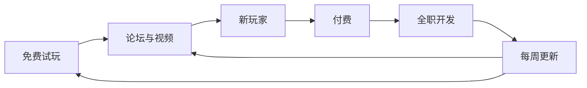

> **本章命题**：付费 Alpha 卖出的不是一款未完成的游戏，而是一份「世界会持续变化」的承诺——玩家因它变成共同作者，作者因它背上必须持续交货的债。

## 问题

2010 年的某个周五，你打开 Minecraft 官网，发现游戏又变了一个样子：也许多了船，也许多了铁轨，没有人告诉你改了什么——更新说明通常只有一句故弄玄虚的话。想知道发生了什么，你得自己进世界转一圈，或者去论坛看别人晒出的新玩意。当天晚上，第一批讲解视频就已经挂上了网。

这个场景在 2010 年几乎每周重复一次。它频繁到让人忘记一件怪事：这款游戏当时没有做完，而且它是收钱的。

本章要回答两个问题。一个是更早的问题：为什么有人愿意给没做完的游戏付钱？另一个是贯穿全书的问题：早期更新如何把玩家变成共同作者？

## 为什么有人愿意给未完成游戏付钱

先看当时的默认做法。2009 年前后，一款游戏的正常卖法是：做完，宣传，发售。玩家付钱买的是完成品，未完成的部分属于开发者的办公室，不属于货架。

Minecraft 把这个顺序倒过来卖。2009 年 9 月 1 日，Survival Test 上线，一开始只对付费会员开放，价格 9.95 欧元[^st]。这时候离「Alpha」这个牌子挂出来还有九个月，离游戏的正式发售还有两年多。

付钱的人买到了什么？清单很短：一条血槽、几种会攻击你的怪物、一把弓、二十支箭和一个分数。你死了，这个世界就再也进不去了。没有合成，没有装备，谈不上经营一个家。

<Note>Alpha、Beta 是当时流行的开发阶段叫法：Alpha 能玩，但缺很多东西；Beta 功能大体齐了，正在打磨。这不是官方认证，只是大家约定的刻度。</Note>

那为什么付钱？拆开看，这笔交易有三个说得通的成分。

第一，之前已经免费玩过了。Classic 此前就一直免费挂在官网上，打开浏览器就能玩。付费不是从零开始的赌博，而是对一段已有体验的追认：你已经知道拆方块、垒方块好玩，付钱是想看它还能长成什么样。

第二，价格写在明处：越早越便宜，越晚越贵。后来 Beta 阶段涨到 14.95 欧元，正式版更贵，而老买家不用再付一分钱[^alpha]。早来的信任有折扣，这把「等它做完再说」变成了一笔算得过来的账。

第三，也是最容易忽略的一点：付钱给谁，看得见。Notch 在博客上连载开发过程，下一步做什么、收到的钱去了哪，都摊在桌面上。为一个没有发行商、没有广告的游戏付钱，与其说是购买，不如说是资助——你出钱，让他可以继续做下去。

顺带看一眼当时游戏业的「正规答案」：众筹平台 Kickstarter 2009 年才上线，「先收钱再做」在游戏业仍被当成异想天开。Minecraft 没有发起众筹——它直接把众筹变成了日常：没有一次性的目标金额和回报清单，只有一份持续营业的生意。玩家不是支持者，是顾客；顾客比支持者更挑剔，但也更长久。

这个判断可以被证伪：如果玩家付钱买的是当时的完成度，那么每次涨价都应该压低销量。事实相反，后来公布的数字显示，绝大多数销量恰恰发生在最便宜、最不完整的时候[^1m]。人们买的确实不是成品。

## Survival Test → Indev → Infdev：从有限到无限

<Note>本章的时代只有 Java 版——Bedrock 及其前身要再过好几年才出现，所以后文说「游戏」时不再分述两个版本。</Note>

Survival Test 要解决的问题很窄：验证「活下来」能不能撑起一个游戏的核心循环。血条、怪物、死亡惩罚都到位了；计分板暴露了它的出身——当时的它更像一个竞技场，还不是一个世界。

真正的分水岭在两个冬天之间。

Indev，2009 年 12 月 23 日上线，只对付费玩家开放[^indev]。它带来了三样改变游戏身份的东西：合成（把木头做成木板、木板做成工具）、熔炉（把矿石烧成金属）、火把与光照（黑暗里会出怪物，所以你要点灯）。玩家第一次开始「攒家当」：囤木头，囤煤，修一个像样的基地。世界本身仍是有限的——一张有边界的地图，形状和主题可选，几分钟就能从中心走到边。

有限世界决定了游戏问题的形状：这是一块给定大小的地，你的任务是「在里面活得久」。它是竞技场，只是规模大一点。

值得留意的是顺序：先把生存循环放进一块小地，验证它好玩，然后才拆掉边界放大空间。顺序不能反——无限只是放大器，放大已经存在的东西。循环不好玩，无限只是无限地无聊；循环好玩，无限才意味着无限的可能。

Infdev 打破了这个前提。2010 年 2 月 27 日，Notch 在博客上贴出新版本，原话是：「还有很多 bug，还缺很多功能，但是来，先给你一些无限的地图。」[^infdev]

注意这句话的成色。它不是在宣布一项技术成果，而是在发一个半成品。无限地形此刻能做的事远比 Indev 少，门、矿车这些内容是之后几个月一件件搬进来的。但设计上关键的一步已经迈出去了：世界的边界没有了。

为什么说这是设计事件，而不是技术成就？因为它改掉了玩家问的问题。有限世界里，你问「今天怎么活下去」；无限世界里，这个问题很快不够用了，你会开始问「我要住哪儿」「山那边有什么」「要不要走远一点，找块更好的地方」。世界不再向你汇报总量——你永远清不完它，也就永远有下一座山。你的基地从「地图上的一格」变成「无限中的原点」：不是世界围着你转，是你在无垠里钉了一根钉子。

这也不是换个说法的修辞，行为真的变了。玩家开始为选址走很远，开始修路、修仓库、修地标，开始把「回家」当成游戏内容的一部分。如果无限只等于「更大的地图」，这些行为就不会出现——这是本节判断可以被证伪的地方。

挖与放的动作来自 Infiniminer，来历见[《从 Infiniminer 到 Cave Game》](/history/infiniminer)。这一章关心的是下一环：动作有了，世界无限了，剩下的问题是怎么让它一直变下去。

<Impl title="无限世界是怎么塞进内存的">一句话版：把世界切成一格一格的「区块」，玩家走到哪，就到哪生成，看不见的部分交给磁盘。这套流水线的细节——生成顺序、光照重算、更新调度——是卷三的主题，见[《无限世界生成》](/impl/worldgen-pipeline)。</Impl>

<Constraint name="无限世界" verdict="地基" chain="边界消失 → 家的意义改变 → 内容永远有下一座山">无限不是尺寸参数，是规则改写：探索没有了清单，建造有了坐标原点，此后的内容设计——洞穴、遗迹、生态群系——都默认「玩家总可以再往前走一步」。后来整个内容体系都建在这块地基上。</Constraint>

## 反馈闭环：论坛、YouTube、口碑，而非广告

为什么不打广告？一半原因是没钱：没有发行商，没有预算。另一半原因是它不需要。这个产品的形状恰好和人际传播的形状重合——它持续变化，每次变化都是新话题，而话题的传播渠道，玩家自己就有。

闭环长这样：

每个环节都没有奇迹，环在一起就有了。

论坛是第一环。Minecraft 从诞生起就活在论坛上，Notch 读反馈，而且常常直接照单执行——Indev 的第一个版本，就是应社区「想试试新功能」的要求放出去的[^indev]。

但共同作者不止「提需求、被满足」这一条路。苦力怕（creeper），那种走近就嘶的一声炸开的绿色怪物，来自一个做歪了的猪模型：体型参数弄错了，Notch 觉得这个错误产物本身有意思，留了下来[^st]。需求被响应，意外被拥抱，两条路通向同一个结果：玩家能在游戏里认出自己的痕迹，作者也能把事故变成内容。

也要说清另一半：共同作者不等于社区投票。Notch 大量采纳反馈，但取舍权始终在他手里——论坛上喊得最响的愿望未必被实现，他自作主张加的东西也并非人人叫好。作者保留否决权，共创才没有退化成设计委员会。这是早期关系里很脆弱、也很关键的一条平衡。

YouTube 是第二环，也是 2010 年最大的一环。这年的 Minecraft 视频已经自成一派：录屏加解说，有人教学，有人展示建筑，有人就是带着观众闲逛。对创作者，这个游戏近乎完美——它每周都在变，永远有新东西可拍；世界无限，每个人的世界都不一样，看别人玩等于看别人的世界。对观众，视频顺手解决了一个官方从没解决的问题：这个游戏几乎没有内置教学，配方、技巧、注意事项全靠社区流传。

<Memoir title="学这个游戏没有任何官方教材">2010 年，新玩家学会 Minecraft 的路径几乎只有一条：看别人的视频和帖子。游戏里没有教程，没有配方书，火把怎么合成、第一晚该干什么，全靠社区口口相传。官方把配方书做进游戏，是很多年以后的事。</Memoir>

更新的发布方式也在给这个闭环上油。Alpha 时期的常规操作是「秘密周五更新」：周五一更，几乎不写更新说明，改了什么让玩家自己进游戏找[^alpha]。一次更新被做成一场集体解谜——论坛里有人列清单，视频作者抢首发，观望的人点进来围观热闹。

这一节同样可以被证伪：如果增长另有引擎，闭环论就只是装饰。但当时它没有别的引擎——没有发行商，没有广告预算，没有平台推荐位。到 2011 年 1 月，游戏公布的累计付费用户超过一百万，传播成本接近于零[^1m]。

## 早期多人：和别人住在同一个世界

多人比付费来得更早。Classic 阶段就有了多人建造：服务器软件发给玩家，谁都可以开一台，把地址发给朋友。于是早在 Survival Test 验证「活下来」的时候，网上已经有一批免费的、玩家自己开的服务器，里面积累了玩家自建的世界。

玩家在上面玩出的东西，超出了任何设计清单，最有名的一个装在下面这个框里。

<Memoir title="Spleef：玩家自己发明的运动">Classic 多人时代，几个玩家在一台服务器上发明了 Spleef——规则一句话能说完：拆掉别人脚下的方块，自己别掉下去，最后站着的人赢。它没有出现在任何设计文档里，却成了那个时代服务器上的保留节目，有人修赛场，有人定规则，有人办比赛。玩法是玩家写的，作者事后追认。</Memoir>

设计含义在这里：多人把 Minecraft 从「游戏」变成「地点」。

单机生存是一款游戏，有进度、有目标、有一条越走越远的成长线。多人服务器是一个地点：你的存档不再只是进度条，而是一个别人可以走进来的地方——朋友知道你家在哪，记得你修的桥，约好下次一起去挖矿。本书反复说的「能住进去」，在这里第一次有了字面意义。

生存模式的多人版来得晚一些，Alpha 开跑一个多月后才把生存搬上服务器[^alpha]。从「一起盖」升级成「一起活」：一起点灯，一起下矿，一起在夜里守着门口。

还有一个不那么温馨的副产品：别人能进你的世界，意味着别人也能拆你的世界。搞破坏——玩家叫它 griefing——从 Classic 时代起就是服务器生活的一部分，服主不得不自定规矩、设防线、拉黑名单。「谁有权定规则」这个问题不是外人强加给 Minecraft 的，是多人上线那天就长出来的。它有多大，设计卷再展开。

## 付费 Alpha：信任与锁定同时发生

2010 年 6 月 30 日，Minecraft 正式挂出 Alpha 的牌子：从这一版起，游戏只卖不送，9.95 欧元[^alpha]。同月，Notch 辞掉了正职，全职做 Minecraft[^persson]。这两件事其实是同一件事：付费玩家的钱，替代了工资单。

交易结构值得抄在黑板上：一次付费，之后所有更新免费；价格将随开发进度上涨，Beta 卖 14.95 欧元，正式版更贵[^alpha]。这条价格曲线把时间变成了货币——早来的信任有明确的折扣，「再等等看」也有明确的代价。

真正的引擎仍是更新。Alpha 时期更新的密度大得反常，每周五的秘密更新雷打不动，改了什么不写清楚，留给社区自己去发现[^alpha]。销量曲线跟着更新走：七月中旬的一个版本，上线 24 小时卖出 1000 份，Minecraft Wiki 至今用「1K IN 24h」标注那个版本[^alpha]。九月认证服务器出了一次故障，Notch 干脆把它变成免费周末，媒体跟进报道，事后反而带来一批新买家[^alpha]。连事故都被更新节奏消化成了增长。

最诚实的一笔落在秋天。生态群系（biomes，把世界分成沙漠、森林、雪原等不同风貌的系统）是 Notch 整个夏天都在预告的功能，也整整跳票了一个夏天。9 月 18 日，那周更新的博客标题自己招了：《秘密周六 1！但是生态群系又失败了！》——那一版实际交货的是潜行（按住 Shift 走得慢、没声音、不会从边缘摔下去），生态群系再次欠着，文末顺手预告「地狱生态群系将用于另一个快速旅行的维度」[^ss1]。六周后，10 月 30 日，万圣节更新上线：十二种生态群系和下界（the Nether），一次交清[^halloween]。

把这三步连起来看：预告，跳票自嘲，如约交付。更新在这里不是维护，是连载——有伏笔，有断更，有爆更。追过连载的人都懂这种忠诚是怎么来的：你追过它，它就欠着你，而它还了。

<Figure src="/images/alpha-v1.2.6.png" alt="Minecraft Alpha v1.2.6 的游戏画面：沙滩、海洋与远处的树林，左上角显示版本号，下方是血条与物品栏" caption="Alpha v1.2.6 的世界：万圣节更新之后的沙滩、海洋与远处的树，左上角是版本号，下方是血条与物品栏。图源：Minecraft Wiki。" />

现在可以说「锁」了。信任与锁定同时发生，锁的不是合同，是机会成本。

对玩家，存档是世界。你在 Alpha 里攒下的每座基地，都长在一个还在生长的游戏里。离开不是卸载软件，是放弃一片你已经熟悉的、还在变化的地形。时间投入也是货币：一百小时的世界比十小时的世界更难放下，后来无数「再玩一晚」的决定，都是这笔投入在投票。世界越大，离开越贵——这把锁是玩家自己给自己上的，没人逼。

对作者，承诺是债。一旦「每周都有可见的变化」成为习惯，它就不再是福利，而是义务：更新一放缓，信任立刻开始计息；跳票不再是内部进度问题，而是社区事件——那个自嘲的标题既是幽默，也是利息清单。后来玩家熟悉的「更新即节日」和随之而来的跳票焦虑，都签在同一份合同上：更新节奏从此是政治，见[《版本政治》](/history/version-politics)；而无限世界欠下的工程账，也在同一时间开始计息，见[《技术债》](/impl/tech-debt)。

这套循环什么时候会破产？两种情形：老买家被要求为新版本再付一次钱；或者更新长期停摆，而玩家并不在意。任何一种发生，「共同作者」的说法就是自我美化。到 2011 年 1 月 12 日，累计付费用户 1,003,151 人，其中绝大多数在最便宜、最不完整的阶段入场，收入超过一千三百万美元[^1m]——第一种情形没有发生。至于第二种，本章之后的历史会一直给这个判断出题。

<Constraint name="边收钱边开发" verdict="地基" chain="现金流替代投资人 → 作者只对玩家负责 → 更新节奏成为产品">Alpha 的定价结构让开发资金直接来自玩家：不需要投资人，也就不需要为任何人修改方向。代价同样真实——作者背上一份不能停更的隐性合同。这是地基，但地基自己会长出债来。</Constraint>

## 这一章留下什么

- **爱好者**：你熟悉的许多东西——合成、无限地形、下界、潜行——都不是某天「更新了」，而是当着第一批玩家的面长出来的；玩 Alpha 的人看的不是成品，是草稿。
- **开发者**：能抄走的是交易结构——免费进入、涨价预期、买断未来更新、让更新本身成为传播；抄不走的是单人作者直接读完全部反馈的带宽，团队一大，这个闭环就开始走样。

[^st]: Minecraft Wiki，《Java Edition Survival Test》，检索于 2026-09-17；见 https://minecraft.wiki/w/Survival_Test 。Survival Test（Classic 0.24_SURVIVAL_TEST）2009 年 9 月 1 日上线，起初仅对付费会员开放，价格 9.95 欧元，2009 年 10 月 24 日起对所有人免费；玩家死亡后世界无法再进入；苦力怕源自做错的猪模型。

[^indev]: Minecraft Wiki，《Java Edition Indev》，检索于 2026-09-17；见 https://minecraft.wiki/w/Java_Edition_Indev 。Indev 2009 年 12 月 23 日上线，仅对已购买游戏的玩家开放；地图有限，形状、类型与主题可选；引入合成、熔炉与动态光照；首个版本 0.31 是应社区试玩请求而放出的。

[^infdev]: Markus Persson，《Here, try some infinite maps》，The Word of Notch（Tumblr），2010-02-27；见 https://web.archive.org/web/20140427012038/http://notch.tumblr.com/post/415398931/here-try-some-infinite-maps 。原话：「There's a lot of bugs and a lot of missing features, but here, have some infinite maps.」另见 Minecraft Wiki，《Java Edition Infdev》，https://minecraft.wiki/w/Java_Edition_Infdev ：Infdev 首个阶段为 2010 年 2 月 27 日至 3 月 25 日，加入矿车、门、告示牌等，目标是让无限地形追平 Indev 的内容，随后被 Alpha 取代。

[^alpha]: Minecraft Wiki，《Java Edition Alpha》，检索于 2026-09-17；见 https://minecraft.wiki/w/Java_Edition_Alpha 。Alpha 自 2010 年 6 月 30 日起开始，售价 9.95 欧元；Beta 自 2010 年 12 月 20 日开始，价格升至 14.95 欧元；其间每周五发布「Seecret Friday」更新，改动留给玩家自行发现；Alpha v1.0.15 首次加入生存多人；版本 v1.0.13_01 被标注为「1K IN 24h」（24 小时售出 1000 份）。

[^persson]: Minecraft Wiki，《Markus Persson》，检索于 2026-09-17；见 https://minecraft.wiki/w/Markus_Persson 。Persson 在 jAlbum 先由全职转为兼职，2010 年 6 月离职，全职开发 Minecraft。

[^ss1]: Markus Persson，《Seecret Saturday 1! But I failed Biomes AGAIN!》，The Word of Notch（Tumblr），2010-09-18；见 https://web.archive.org/web/2011/http://notch.tumblr.com/post/1144331509/seecret-saturday-1-but-i-failed-biomes-again 。该版本加入潜行；作者自述生态群系再次制作失败，并预告「地狱生态群系将用于一个替代性的快速旅行维度」。

[^halloween]: Minecraft Wiki，《Java Edition Alpha v1.2.0》，检索于 2026-09-17；见 https://minecraft.wiki/w/Java_Edition_Alpha_v1.2.0 。万圣节更新于 2010 年 10 月 30 日发布，加入 12 种生态群系、下界维度、钓鱼，以及恶魂、僵尸猪人等生物。

[^1m]: GamesIndustry.biz，《Minecraft hits 1m sales》，2011-01-13；见 https://www.gamesindustry.biz/minecraft-hits-1m-sales 。文中记录累计付费用户 1,003,151 人，此前 24 小时售出 7,438 份；Alpha 售价 9.95 欧元，进入 Beta 后升至 14.95 欧元；对应收入至少 1300 万美元。
