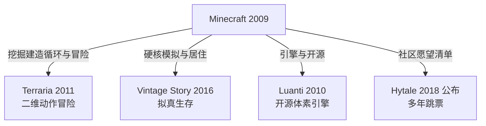

> **本章命题**：「下一个 Minecraft」之所以难出现，不是因为它的玩法没被抄走——玩法早已被抄走——而是因为它崛起时的处境无法复制。

## 问题

每隔一两年，游戏新闻里就会出现一款新的「Minecraft 杀手」。名单很长：有的靠画面更精细，有的靠战斗更爽快，有的干脆还没发售就先领到了这个称号。然后呢？然后它们消失在下一轮新闻周期里。称号空出来，发给下一个候选者。十几年过去，Minecraft 自己还在：截至 2023 年销量已超过三亿份，是电子游戏史上最畅销的作品[^wiki-minecraft]。

玩家对这个循环熟悉到反过来消费它。手游广告里常年有一种「假 Minecraft」广告：画面里挖矿、建房、合成，样样都会，点进去往往是另一个游戏，有时和方块毫无关系。

<Memoir title="假广告成了固定段子">
玩家社区里流传最久的抱怨之一，就是这种名不副实的广告：视频素材直接借用 Minecraft 的画面与玩法，装进完全不同的产品里。吐槽它的帖子年复一年地出现，后来吐槽本身也成了社区文化的一部分——玩家之间会互相提醒「那个广告别信」，仿冒品的泛滥由此成了一代玩家共同的经验。
</Memoir>

本章要回答的问题是：这些模仿与挑战年年都有，为什么「下一个 Minecraft」始终没有出现？先把问题的口径定准。如果「下一个 Minecraft」指的只是「又一款有方块、有合成、有生存的游戏」，那它根本不用等——每年都有。所以真正的问题是：为什么玩法早已四散到无数产品里，接班者却从未出现？

## 每年都有 Minecraft-like

先定义。本书所说的 Minecraft-like，指同时满足两个条件的游戏：视觉上，世界由规则的方块拼成；玩法上，挖掘、放置、合成构成核心循环。按这个标准，每年都有新作符合。手机应用商店里，名字带 craft 的产品长年成片出现，泛滥到无法统计出有意义的精确数字，只能给出「成片」这个量级。

但「多」不等于「同」。这些产品分两种，命运截然不同。

第一种是整体复刻：把 Minecraft 的机制清单尽量照搬，换一套美术与命名。这类产品多数无声无息。原因不难理解——它们选定的竞争维度是「像」，而在「像」这个维度上，Minecraft 不可能被超过。你的方块越像，玩家越会想到：既然一样，为什么不玩原版？原版那边有十几年攒下的服务器、模组、教程视频和一代人的操作记忆。复刻做得越好，越是在替原版打广告。

第二种是谱系：取走 Minecraft 的某一层，把它推到底，长成另一种生物。这一类活得很好：Terraria 把循环搬进二维，卖出七千万份[^wiki-terraria]；Vintage Story 把生存拟真推到极端；Luanti 把引擎开源推到极端；Hytale 想把社区愿望直接变成游戏。它们没有一个是「更好的 Minecraft」——它们竞争的从来不是「像」。

两种命运的分岔，Re-Logic 团队成员的一句话可以概括。Terraria 长期被拿来与 Minecraft 比较，他们的回答是：人们需要明白，Minecraft 已经不再是一个游戏，而是一个类型[^wiki-terraria]。类型的意思是：它可以有无数成员，但类型定义者只有一个位置。模仿者挤在定义者的位置上，谱系成员各自另立山头。

怎样算这段话说错了？如果将来有一款整体复刻的产品，靠「更像」夺走了 Minecraft 的主体玩家群，「复刻必死、谱系才活」的判断就是错的。到目前为止，这件事没有发生。

## 谱系：各继承了哪一层

把四位对照物放在同一张图上，它们各自从 Minecraft 取走哪一层、长成了什么，一眼可见。注意 Roblox 不在图中：它不是从 Minecraft 分出的支系，而是另一条路，下一节单独讲。

### Terraria：继承了循环与冒险

Terraria 是 Re-Logic 开发的二维挖掘、建造与战斗游戏，2011 年 5 月 16 日在 Steam 发售[^wiki-terraria]。发售前，Notch 在 Twitter 上向自己的关注者介绍了这款还在开发中的游戏[^wiki-terraria]。被模仿者亲手给模仿者导流——这段公案提醒我们，早期两个社区的关系远比「杀手」叙事温和。

Terraria 从 Minecraft 带走的是「挖矿—合成—变强—去更深的地方」这个循环，以及 Boss 与事件串起来的冒险结构；丢掉的是三维空间和自由建造的沙盘。它是侧视二维：建造是装饰，战斗是主体。在自己选的路上，它走了很远——发售十几年仍在更新，销量超过七千万份[^wiki-terraria]。

它的存在证明一件事：Minecraft 的核心可以不是方块这个形式，而是「资源变成能力、能力打开更大世界」这个循环。方块只是载体。载体的形状可以换，循环换掉了，游戏就换了祖先。

### Vintage Story：继承了硬核模拟与居住

Vintage Story 是 Anego Studios 开发的生存游戏，2016 年 9 月开始公开销售，至今仍处于抢先体验[^wiki-vintagestory]。它做的事情可以用一句话说清：把 Minecraft 式生存里的每个抽象步骤还原成具体工序。找矿要先读懂地质，烧铁要自己垒窑，食物会腐败，季节与气候真实流转。

它继承的是生存的重量与居住的深度：不把生存当作进度的门槛，而把过日子本身当作内容。丢掉的是大众门槛——上手曲线劝退了大多数人，留下的人极度忠诚。

对谱系问题来说，它的价值在于像一条 Minecraft 没有选择的方向的推演。Minecraft 的合成是即拿即用的抽象：三块圆石加两根木棍等于一把镐。Vintage Story 追问的是，如果把「做一把镐」还原成选矿、熔炼、锻造的完整工序，生存会变成什么？答案是一小群玩家的深度居住。它在自己选的路上走得极深，也甘愿极窄。

### Luanti：继承了引擎与开源

Luanti 原名 Minetest，2010 年 10 月由芬兰程序员 Perttu Ahola（网名 celeron55）发起，是一个自由开源的体素游戏引擎[^wiki-minetest]。它的激进之处在于：这个项目如今连「官方玩法」都没有——发行版不附带默认游戏，一切内容来自社区维护的子游戏与模组。

它继承的是可再开发性这一层。Minecraft 让玩家改造世界，Minetest 更进一步，让玩家改造游戏本身；丢掉的是「游戏」这个包装。2024 年 10 月，项目更名为 Luanti，部分原因正是担心新玩家把它误当成一个 Minecraft 克隆，而它其实是一个引擎[^wiki-minetest]。

谱系四支里，它走得最远：Terraria 换了内容形态，Vintage Story 换了拟真深度，Luanti 干脆不要内容。「能被再开发」本身成了产品。

### Hytale：继承了「社区想要的样子」

Hytale 由 Hypixel Studios 开发。Hypixel 本身是 Minecraft 上最大的服务器之一，这家工作室 2018 年 12 月公布 Hytale 时，玩家普遍把它理解为「Minecraft 社区想要的那款游戏」：更多样的生态、更利落的战斗、内置的模组与服务器工具——愿望清单几乎就是设计文档[^wiki-hytale]。

它继承的不是某一层机制，而是社区的集体愿望。这恰恰是最难兑现的一层。预告片带来巨大期待之后，开发范围不断膨胀，发售一再推迟；2020 年 4 月工作室被 Riot Games 全额收购，2025 年 6 月项目被取消、工作室关停；同年 11 月，创始人买回了 IP 并回聘部分开发者，2026 年 1 月游戏才进入抢先体验[^wiki-hytale]。从公布到可玩，八年过去。

<Constraint name="愿望清单当设计文档" verdict="凑合" chain="社区愿望直接变成设计目标 → 范围只增不减 → 发售无限推迟 → 资方失去耐心关停" />

教训不是「社区想要的东西不该做」。Hytale 的愿望清单本身没有错，错的是把愿望清单当成一份可以按愿望顺序兑现的工程计划。社区知道自己想要什么，但不知道自己愿意等多久。谱系的另外三层——循环、深度、引擎——是设计资产；「社区想要的样子」这一层，是设计负债。

## Roblox：平台化 vs 游戏化

现在轮到真正的分叉。Roblox 不是谱系的一员，按本章开头的定义它甚至不是 Minecraft-like。它是 Roblox Corporation 运营的游戏平台与创作系统：玩家用平台提供的创作工具 Roblox Studio 做出游戏，给其他玩家玩，2006 年对公众开放[^wiki-roblox]。Minecraft 的玩家在游戏里造房子，Roblox 的玩家在平台里造游戏。一个是游戏，一个是平台——这条界线就是本节的对照主轴。

Minecraft 走的是游戏化路线：官方维护一个规则世界，玩家在其中生存与建造；进阶玩家越出官方边界，做模组、开服务器，长出第二作者群（见[《模组作为第二作者》](/history/mods-as-authors)）。内容生产的主体是玩家，但生产工具与规则仍握在官方手里，生态长在产品之外。

Roblox 走的是平台化路线：平台方自己不做内容，只提供三样东西——创作工具（Roblox Studio 与 Luau 语言）、经济系统（Robux 货币与创作者提现分成）、分发渠道（首页推荐与年龄分级）。创作从玩家的爱好，变成平台之内的职业与生意，生态长在产品之内、规则之内。

对照之下，三条轴全变了。内容由谁生产：一边是官方加灰域社区，一边是平台内的职业创作者。规则由谁定：一边是 Mojang 定物理与合成，一边是平台定引擎与抽成、每个体验的作者定玩法。钱怎么流：一边是一次买断，一边是虚拟货币加分成。规模上两家都是巨头：Roblox 在 2025 年初日活约 8530 万，2021 年上市时估值约 450 亿美元，公司自称月活玩家覆盖超过半数美国 16 岁以下儿童；创作者分成 2017 年约 3000 万美元，2019 年约 1 亿美元，2020 年约 2.5 亿美元[^wiki-roblox]。Minecraft 同期月活以亿计，2019 年 9 月官方口径为一亿一千二百万[^wiki-minecraft]。但两个体量不在同一条赛道上，放在一起比日活，好比比较两种器官的血液循环。

所以说「类 Roblox」与「类 Minecraft」是两条不同的路，不是同一目标的两种做法。前者的竞争对象是开发者：谁的工具好写、分发好拿、分成更高，创作者就去谁那里。后者的竞争对象是玩家：谁的世界值得住、记忆深，玩家就在谁那里落脚。两条路的护城河完全不同：游戏卖的是一个值得记忆的世界，平台卖的是一个无穷世界的货架。

Roblox 没有杀死 Minecraft，看起来也无意于此。但它做了一件对模仿者影响深远的事：把「克隆」这个生态位收编了。Roblox 平台上长期存在大量 Minecraft 风格的体验，方块、挖掘、合成样样都有；它们不再需要单独发行，也不再有自己的店面。下一个 Minecraft-like 的最佳栖身之所，竟然是 Roblox 自己。

<Alternative title="平台还是游戏，先选边再动手">
给开发者的分流测试：如果你的设想里，玩家每天进来是住进同一个世界，那是游戏化路线，重心在世界的手感与规则的诚实；如果玩家每天进来是挑选下一个新世界，那是平台化路线，重心在创作工具、经济系统与推荐算法。两条路的东西不可互相替代——想走平台化，却先花三年打磨某一关的剧情，或者想走游戏化，却把力气花在抽成体系上，都是把力气花在了对手的护城河里。
</Alternative>

怎样算本节的判断错了？如果 Roblox 的主流用法变成玩家长期居住在同一个世界里，游戏化与平台化的界线就模糊了，这条对照主轴随之失效。目前没有这个迹象：平台的日常用法仍是进入一个个不同的体验。

## 对开放世界、生存、沙盒、UGC 的具体影响

泛泛地说「影响深远」没有信息量。值得写的是具体机制的扩散。挑四样看得最清的，一样一样看。

**体素：从权宜之计到体裁承诺。** Minecraft 用方块，最初只是让一个人写得动的引擎撑得起一个可改造的世界。之后，体素从技术选型变成了面向玩家的信号：画面里出现方块，等于告诉玩家「这个世界可以被你拆改」。移动端上，craft、sandbox、方块画风成了品类关键词，应用商店一搜一大片。其中多数品质平平，但它们的成片存在本身就是影响的证据：一种视觉语法被当成了市场信号来使用。

**合成：进度语法的通用化。** 「徒手打树得木头，木头做工作台，工作台做木镐，木镐挖石头」，这条曲线如今是生存游戏的通用开场白。合成的形态也一路变形：Minecraft 是网格拼图，Terraria 简化成清单，多数游戏干脆长成科技树。「资源—中间品—工具—更大世界」从一套具体规则，上升为类型的通用语法。

**饥饿：一个开关的标准化。** 2011 年 9 月，Minecraft 在正式版发布前夕的 Beta 1.8「冒险更新」中加入饥饿条，食物从直接回血改成维持饱食[^wiki-minecraft]。此后，饥饿条成了生存游戏的默认开关：加它，未必好玩；不加，玩家反而会问「这也配叫生存游戏」。开关该不该开是每个游戏自己的设计问题，但「这个开关存在」本身，就是这个类型被 Minecraft 定义过的痕迹。

**程序生成：从技术到大权衡。** 用算法生成世界不是 Minecraft 的发明，roguelike 更早。Minecraft 的贡献是把它变成大众经验：每个玩家的世界都不同，而且世界可以用一串种子字符分享与重现。此后，开放世界游戏开始被要求回答一个新问题：你的内容是手工的，还是生成的？近年多款销量巨大的生存游戏干脆以程序生成为默认。手工内容的独特性与生成内容的规模，成了开放世界立项时的第一道权衡。

**UGC：从灰域到商业模式。** Minecraft 证明了玩家产出的内容可以大过任何内容团队——服务器经济、模组、地图、教学视频。Roblox 把这个证明兑换成商业模式，随后 Fortnite 的创作模式、Core、Dreams 等一批「游戏即平台」的产品跟上。到今天，「让玩家造内容」已是商业提案的常用词；但多数提案只抄走了这个词，没抄走它的前提——玩家愿意造，是因为世界先值得住。

五样合起来，扩散的其实不是方块皮肤，而是一条语法：世界可改造，进度可自定，社区可再生产。哪些语法能搬进你的产品、哪些搬不动，[《可迁移原则清单》](/design/transferable)有逐条展开。

## 不可复制条件

回到本章的问题：既然机制早已四散，为什么「下一个 Minecraft」还没有来？因为竞争者能抄走机制，抄不走这四样东西。

**第一，时机。** Minecraft 崛起的 2009 到 2011 年，独立游戏的数字发行渠道刚刚成熟，一台普通电脑就够开发、够游玩。更重要的是，YouTube 的游戏区恰在同期成形：方块画面的可读性让 Minecraft「看别人玩」也成立，视频带来玩家，玩家产出视频，增长与传播互为因果——这层机制在[《影像、教育与一代人的媒介》](/history/media-education)里有完整展开。今天同样的游戏面世，面对的不是空白的信息环境，而是被推荐算法切碎的注意力；它不会被口口相传，只会被十分钟热度淹没。

**第二，媒介窗口。** 2010 年前后，Minecraft 是很多孩子第一个「拥有」的游戏：不需要游戏机，家里那台电脑就能跑；一次购买，此后所有更新免费。它因此占住了一代人的入口位置。入口一次只属于一款游戏——窗口开着的时候，后来者进不来；窗口关上之后，同样的产品只会是「又一款」。第二代人已经有了自己的入口，而多数入口不会空出来两次。

**第三，二十年工具链。** 今天的老玩家离开 Minecraft 的成本，不是学会另一款游戏，而是重建全部下游：服务器、模组、数据包、命令、教程、皮肤、地图。Mojang 十几年攒下的官方与社区工具链，让「再造一个世界」的边际成本趋近于零，这套可再造性正是重写卷讨论的对象（见[《我们到底在重写什么》](/rewrite/what-to-rewrite)）。竞争者第一天没有任何下游。玩家比较的从来不是两款游戏的规则，而是两个生态的纵深。

**第四，未定义行为被收编为 API。** 刷石机不是哪个设计师的作品，是玩家在流体与方块的交互缝隙里发现的；红石电路的时序特性、刷怪塔的运作方式，一半是设计，一半是既成事实。Mojang 在几次改动引发社区抗议之后，学会了把这些「不是设计的设计」当作事实标准来维护。于是 Minecraft 的规则里沉淀出一层别处没有的东西：玩家与规则十几年的合谋史。新游戏可以复制规则手册，复制不了合谋史——没有历史就没有「不能动的东西」，也就没有这层护城河。

四条合起来，答案成形。「下一个 Minecraft」难，不是难在做出方块与合成——每年都有——而是难在同时占住一个新语法、一个空白生态位、一代人的入口，以及让下游生态在你身上扎根的十几年。抄走其中任何一条都可行；同时占住全部四条，需要的不只是产品能力，还有历史运气。Minecraft 的成功条件里，运气至少占一半。

本章的判断可以被推翻，方式很明确：如果未来出现一个产品，同时在这四条上成立——哪怕它不是游戏，而是某个别的形态的创造平台——「处境不可复制」就是错的。这样的推翻并非没有先例：Roblox 自己就成功了一次。它没有在 Minecraft 的定义里赢，它换掉了定义。下一个 Minecraft 若真出现，多半也不长着方块的脸。

## 这一章留下什么

- **爱好者**：别再问谁杀死了 Minecraft——每个继承者都只带走了它的一层，而带走的那层长成了别的生物；谱系比杀手有趣得多。
- **开发者**：机制可抄，处境不可抄；能带走的是可迁移的语法（[《可迁移原则清单》](/design/transferable)），抄不走的时机与生态写不进立项书——动手前先想清楚，你要的是一款游戏，还是一个处境（[《我们到底在重写什么》](/rewrite/what-to-rewrite)）。

[^wiki-terraria]: 《Terraria》，维基百科条目，检索于 2026-09-18，https://en.wikipedia.org/wiki/Terraria （Re-Logic 开发、505 Games 发行，2011-05-16 在 Steam 发售；Notch 在开发期间的推文带来早期关注；截至 2026 年 5 月销量超过 7000 万份；「Minecraft 已经不再是一个游戏，而是一个类型」为 Re-Logic 团队成员对《卫报》所言，转引自该条目）

[^wiki-minecraft]: 《Minecraft》，维基百科条目，检索于 2026-09-18，https://en.wikipedia.org/wiki/Minecraft （截至 2023 年总销量超过 3 亿份，为史上最畅销电子游戏；Beta 1.8「冒险更新」于 2011-09-14 发布，加入饥饿条，食物从直接回血改为维持饱食；2019 年 9 月全版本月活玩家 1.12 亿——销量与月活数字在该条目中分别引 BBC 与 Engadget 的当时报道）

[^wiki-vintagestory]: 《Vintage Story》，维基百科条目，检索于 2026-09-18，https://en.wikipedia.org/wiki/Vintage_Story （Anego Studios 开发并发行，创始人为 Tyron 与 Irena Madlener；2016-04-05 开始开发，2016-09-27 公开销售，长期处于抢先体验）

[^wiki-minetest]: 《Minetest》，维基百科条目，检索于 2026-09-18，https://en.wikipedia.org/wiki/Minetest （Perttu Ahola，网名 celeron55，2010 年 10 月发起，11 月 2 日发布 0.0.1；社区驱动的自由开源体素游戏引擎；官方发行版已不附带默认游戏，内容全部来自社区子游戏与模组；2024-10-13 官宣更名为 Luanti，名称取自 Lua 与芬兰语 luonti（创造））

[^wiki-hytale]: 《Hytale》，维基百科条目，检索于 2026-09-18，https://en.wikipedia.org/wiki/Hytale （2015 年开始开发，2018-12-13 公开；原计划 2021 年可玩，因范围扩大多次推迟；2020-04 被 Riot Games 全额收购；2024-07 宣布迁移至新引擎；2025-06-23 宣布取消开发并关停 Hypixel Studios；2025-11-17 联合创始人 Simon Collins-Laflamme 宣布从 Riot 买回 IP 并回聘 30 名开发者；2026-01-13 进入抢先体验）

[^wiki-roblox]: 《Roblox》，维基百科条目，检索于 2026-09-18，https://en.wikipedia.org/wiki/Roblox （David Baszucki 与 Erik Cassel 2004 年开始开发，2006 年对公众开放；2021-03 上市，估值约 450 亿美元；截至 2025 年 2 月平均日活 8530 万；公司称月活玩家覆盖超过半数美国 16 岁以下儿童；创作者合计分成 2017 年至少 3000 万美元、2019 年约 1 亿美元、2020 年约 2.5 亿美元——开发者收入数字在该条目中引自历年 Roblox 开发者大会与 TechCrunch、Screen Rant 的报道）
