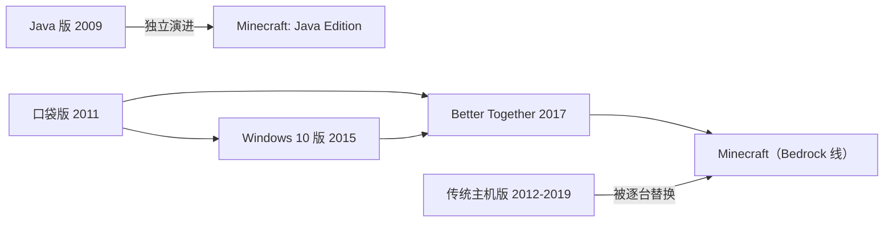

> **本章命题**：两个 Minecraft 并存不是技术失误，而是产品逻辑的正常结果；但产品逻辑每解决一个问题，就在技术面与社区面各欠一笔债，而这些债最终反过来限制了产品。

## 问题

先摆一个你可能亲历过的场面。一个朋友群，一半人在手机上玩，一半人在电脑上玩。约好周末联机，语音开了，游戏进了——然后发现，两边根本进不了同一个世界。手机上看不见电脑开的世界，电脑也搜不到手机的房间。名字都叫 Minecraft，图标都是那块草方块，就是碰不上面。

很多人的第一反应是当网络故障处理：换个 Wi-Fi？开个热点？都不是。这是两份独立演化的游戏。电脑上那份是 2009 年起步的原版，用 Java 语言写成，大家叫它 Java 版；手机上那份，早期叫 Pocket Edition（口袋版），2017 年统一命名后官方就叫 Minecraft，社区为了区分，按它底层共享引擎的名字叫它 Bedrock（基岩）版。本书沿用社区的叫法：Java 版与 Bedrock 版。

两版连脾气都不一样。Java 版玩家照着网上教程搭的活塞机关，搬到手机上可能原地不动——不是搭错了，是两边连「红石信号怎么传播」都没有完全对齐。这不是同一件衣服的两个皮肤，是两套身体。

分裂也不是铁板一块。两版有大量一致的部分：方块、合成、世界生成的基本思路、生存的骨架——因为它们实现的是同一份设计。分歧集中在机制的边角与系统的深处，而这些边角恰恰是玩家停留最久的地方。本章要讲的，正是分歧如何被制造、被命名、被定价。

如果你只在其中一个版本里玩过，另一半对你来说近乎另一个游戏。读完本章，「两个 Minecraft」对你就不再是一句修辞，而是一张清单。

本章回答两个问题：为什么会有两个 Minecraft？分裂是怎么从「一个事实」长成「一笔债务」的？

## 「买一份能玩全部」为何做不到

2011 年，Minecraft 爆红。它当时的全部家当就是 Java 版：一个跑在桌面电脑上的游戏，前提是你的电脑装得上 Java 运行时（可以理解为游戏赖以站立的底座软件），你也愿意照着论坛帖子去折腾它。

然后手机来了。十几个人的 Mojang 面对所有同行都要面对的问题：要不要上移动平台？要上，就必须先回答「用哪份代码」。

直觉的答案是「把 Java 版搬过去」。搬不动，原因有三层。第一层是门禁：没有哪台游戏主机允许你把一个 Java 运行时环境打包进游戏再过审上架，iOS 对第三方运行时也层层设限——平台根本不给这条路走。第二层是硬件：Java 版从操作到性能都按鼠标键盘和桌面电脑设计，触屏和当年的手机硬件接不住它。第三层是人：2011 年的 Mojang 没有余力把桌面版逐行移植过去，只做得起一次按手机限制从零设计的实现。

于是 2011 年 8 月 16 日，Pocket Edition 在索尼 Xperia Play 上首发——一台滑开后露出实体按键的「PlayStation 手机」。选这台机器首发，本身就是一个声明：这是给手机的新实验，不是桌面版的延伸[^pe]。同年 10 月 7 日，它登陆全部 Android 设备；11 月 17 日，登陆 iPhone 与 iPad。

<Note>严格说，Android 自带一种 Java 方言的运行时，但它既不是桌面 Java，也帮不上主机和 iOS。</Note>

容易把这次重写想成「换一种语言，说同样的话」。不是。重写真正的后果是：世上从此有了两份各自理解的「游戏说明书」。Java 版是一份，Pocket Edition 是另一份，两边都声称自己实现的是 Minecraft。而「什么是 Minecraft」的对齐，从此只能靠人肉对照——对照永远滞后，误差从第一天就开始积累。

有人会问：那为什么不等到技术上想清楚了再统一？因为市场不给这个窗口。2011 年前后的移动浪潮是一扇一次性打开的门——等 Java 版想明白怎么搬的时候，手机用户的注意力早被别的游戏占满了。Mojang 面对的选择，不是「统一的 Minecraft」和「分裂的 Minecraft」二选一，而是「分裂的 Minecraft」和「缺席移动市场的 Minecraft」二选一。看清这一点，后面的债才好理解：那些债是入场费，不是罚款。

那为什么不反过来，把 Java 版也重写掉，只留一份代码？因为 Java 版的资产恰恰是它自己：几年积累下来的旧存档要继续能打开，正在成形的模组生态挂在这份代码上。把 Java 版推倒重来，等于烧掉存档兼容和一整个创作生态，换来的只是「代码看起来统一」。这笔账怎么算都不划算。所以「买一份能玩全部」做不到，不是采购问题，是结构问题：两份代码各自绑着一批无法牺牲的东西，谁也不该先消失。

玩家的不满也不是凭空的。在主机游戏行业，「买一份、全家一起玩」通常不叫问题：厂商只出一版代码，所有人玩同一个游戏。Minecraft 做不到这一点，是因为它比大多数游戏更早、更深地撞上了「平台不接受统一运行时」这堵墙——而撞上的时候，它已经是全球玩家最多的游戏之一，没法装作没看见。

<Constraint name="手机先行的代码库" verdict="地基" chain="主机与 iOS 不接受 Java 运行时 → 按手机限制用 C++ 从零重写 → 一份引擎覆盖所有非 Java 平台 → 与 Java 版从此各自漂移" />

这个判断怎么算错？如果当年存在「一份代码跑全部」的现实路径——比如主流平台都接受 Java 运行时——而 Mojang 弃之不用，那么「分裂是产品逻辑的正常结果」就不成立。证据站在本章这边：那条路径当时并不存在。

## PE → Bedrock：跨平台逻辑

先把家谱理清。

Pocket Edition 出生的头几年，和 Java 版的关系是「小弟」：世界小、方块少、没有生存后期那些内容，定位是让没有电脑的人也能摸到 Minecraft。但它手里握着一件 Java 版没有的东西：一份从第一天就按「屏幕各式各样、性能五花八门、没有键鼠」设计的 C++ 代码库。

整个 2012 到 2016 年，口袋版都在补课：红石、下界、末地这些 Java 版的基本盘，它是一块一块补出来的。补课期两边的差距大到社区默认「口袋版不算完整的 Minecraft」，这个印象延续了很多年，成了 Bedrock 后来在老玩家那里口碑的历史利息。

<Memoir title="从玩具到主流">在很长时间里，Java 社区把口袋版当玩具：画质糙、功能少、触屏操作别扭，是「给小孩在车上打发时间」的版本。转折说不清是哪一天，但方向明确：统一之后，这条线成了更新最快、铺得最广的一条。老玩家再抬眼时，它已经站在货架正中央。</Memoir>

2015 年 7 月 29 日，Windows 10 版开启公测[^win10]。这条新闻在当时不显眼，回看却是分水岭：Windows 10 版和手机版是同一份代码——Mojang 开发者当时的原话是，它「基本上就是 0.12」（当时手机版的版本号）。这份跨设备的代码库，后来被称作 Bedrock 引擎。名字是双关：基岩，既是游戏里最底层挖不穿的那种方块，也是所有非 Java 平台脚下共用的那层代码。作为一次完整的重写，这条 C++ 实现线的工程细节，见[《Bedrock 作为另一次实现》](/impl/bedrock)。

此后节奏明显加快：2016 年 12 月 19 日，手机版与 Windows 10 版同步进入 1.0；2017 年 6 月，1.1.0 引入游戏内商店 Marketplace（下一节细说）。然后是决定性的一天：2017 年 9 月 20 日，「Better Together」（更好的同乐）更新上线，手机、Windows 10、Xbox One 等版本合成同一个游戏，并且全部去掉副标题——不再叫「Minecraft: Pocket Edition」，就叫 Minecraft[^bedrock]。Java 版在同一轮更名里变成「Minecraft: Java Edition」。「Bedrock 版」从此成为官方与社区对这条产品线的通称。

统一也不只是换个名字，它改变的是更新这件事本身：从那以后，这条线上的所有平台——手机、Windows 10、Xbox One——同一个功能在同一天上线。对开发者，这意味着新内容只写一次、只测一遍，就能铺到每一块屏幕；对玩家，这意味着不再有「我的平台要等到下个月」。跨平台的承诺，落到工程上就是这两句话。

这里要停下来，从 Java 玩家这边看一眼同一时刻：你没有被合并，也没有谁动你的游戏。但「官方的 Minecraft」这个名分，从这一天起归了另一条产品线。此后你在商店页、新闻稿和闲聊里，都得多问一句：哪个 Minecraft？品牌是一个，所指从此有两个。

更名还有现实的一面：商店里那个叫 Minecraft 的图标，在不同设备上是两个不同的游戏。给孩子买游戏的家长，和在论坛答疑的老玩家，从此都多了一道必答题：先问清楚，你说的是哪一版。

主机这边还有一条并行的旧线要交代。Xbox 360 版 2012 年 5 月 9 日发售，PS3 在 2013 年底跟上，Xbox One 与 PS4 版于 2014 年 9 月上架。这些传统主机版长期是第二梯队：更新慢，各玩各的，不能和手机联机。那是另一条完整的产品线：同一套内容，按主机的习惯另起炉灶；它们后来渐渐淡出，如今很多玩家已经不记得，客厅里曾有过另一个 Minecraft[^legacy]。旧主机版没有消失，只是停更：买过的人至今还能打开那些世界，只是那里不再长出新东西。

Bedrock 成型之后，这条线被逐台替换：2017 年 9 月 20 日，Xbox One 版当天被 Bedrock 版取代下架；2018 年 6 月 21 日，Switch 换上 Bedrock；2019 年 12 月 10 日，PS4 完成切换。从 2019 年底起，「非 Java 的 Minecraft」终于只是一份代码库。

跨平台统一的真实收益要写足，因为它对普通玩家是实打实的：手机上的孩子和主机上的家人，终于能进同一个世界；世界存在账号之下，今天在手机上挖的矿，明天在 Windows 10 电脑上接着挖。游戏本体仍按平台各买一次，但联机、好友、商店在一个账号体系里打通了。这是 Minecraft 商业化以来欠了多年的一笔用户体验旧账，2017 年还上了。

值得把这笔账算得更细。对一个 2017 年的普通家庭：孩子用平板，父亲用 Xbox，母亲用 Windows 笔记本——统一之前，这是三个互不相通的世界；统一之后，一个账号、一份好友列表、一间商店。便利是真实的，不该因为它同时服务了微软的平台战略，就说它不存在。

但统一的边界也在这里：统一发生在「非 Java 世界」的内部，Java 版留在墙外。两个 Minecraft 的格局，在 2017 年不是被解决，而是被正式命名。

## Marketplace：商业化与社区反弹

统一之后，Bedrock 必须回答一个 Java 版从未被这样问过的问题：玩家怎么改这个游戏？

Java 版的答案用了十几年：随便改。模组（mod）是玩家写的扩展程序，装进游戏就能加新方块、新机器、新世界；没有官方商店，作者把作品放在论坛和社区站点，任何人免费下载。这条路线养出了一整个创作文化——它是如何长起来的，见 [《模组作为第二作者》](/history/mods-as-authors)。

Bedrock 的答案是另一套，两件套。第一件叫附加包（add-on）：官方定的扩展格式，把「改游戏」拆成资源包（管外观和声音）与行为包（管方块和生物怎么表现）两类数据文件，游戏直接读取，不碰程序本体，后来又加入了用 JavaScript 写逻辑的脚本接口[^marketplace]。作者不写 Java、不改引擎，也能加出新生物。对地图作者尤其重要：Java 的地图作者做自定义生物，长期要靠命令方块和各类技巧；Bedrock 的作者直接写几个行为包文件就能达成。

第二件叫 Marketplace（市场）：游戏内置的官方商店，卖皮肤、材质包、地图、整合包和附加包，用一种叫 Minecoin 的代币结账——先用真钱充值，再换代币，应用商店时代的标准设计。代币的意义不在方便，在距离：花钱时看到的不是价格，是余额——这是所有平台商店的通用心理学，Minecraft 只是把它搬进了方块世界。不是谁都能上架：只有与官方签约的创作者能进，内容由 Minecraft 团队逐件审核。这些签约创作者大多是小工作室；内容上架要过审，更新也要重新过审；大部分内容收费，少数免费。商店 2017 年 4 月 10 日宣布，先以测试形式进入部分版本，6 月随 1.1.0 正式版全面上线[^marketplace]。

规模一句话：2021 年 4 月 27 日，微软 CEO 纳德拉在财报电话会上宣布，创作者从超过 10 亿次下载中累计获得超过 3.5 亿美元[^payout]。注意口径：这是商店流水（原文 generated），不是创作者到手的钱——微软说过创作者分成超过一半。即便打对折，这也是电子游戏里第一次有人把「玩家向玩家付费买内容」跑进亿美元量级。

这笔钱的另一面也要写：对创作者，商店第一次提供了稳定的收入——不必靠捐赠、广告和用爱发电，做内容本身就能养活一个小团队。把玩家创作商业化，不是一句讽刺，也是一群人新的生计。

为什么 Marketplace 在 Bedrock 站得住？看玩家构成。Bedrock 玩家主要在手机和主机上：没有装文件的习惯，很多孩子甚至没有自己的邮箱。对这些人，商店不是抽成的税，是服务——它替你解决三件事：找到能信任的内容，一键装好，换设备不丢。同时，附加包是数据文件，天生可审核：上架前能逐件检查有没有越界内容，这与主机的分级审核制度天然兼容。

为什么同一件事放到 Java 就会被抵制？两个原因，一软一硬。软的是身份：Java 版的社区文化建立在「改游戏免费、传播无门槛」上，十几年模组生态把这一点从习惯熬成了伦理，官方商店在 Java 语境里会被读成围墙。硬的是技术：Java 模组是任意代码——一个模组原则上能做任何事，而「能做任何事的程序」没法放进审核流程。Java 版上官方也从未真正建成商店，原因不在意愿，在格式。

一个具体的对照是皮肤。Java 版玩家想把角色换成自己喜欢的样子，自己画一张、上传一张图片就行，分文不花；Bedrock 版玩家打开的是更衣室（Dressing Room）：里面大部分皮肤标价 Minecoin，少数免费；想自己上传一张图片，要么平台不支持，要么藏在很深的入口里，随设备而变。同一件事，一边是文件操作，一边是货架消费——两版玩家的日常，从这里就分岔了。

反弹要直写，两边都写。Better Together 公告后，最大的 Java 玩家社区里刷屏的不是新功能，是一个担忧：「Java 版是不是要被放弃？」官方此后多次重申 Java 版继续更新——事后看是真的，但当时的恐慌不是矫情：被收走的正是「官方 Minecraft」这个名分。反过来，Bedrock 玩家也长期承受另一头的轻视，老玩家圈子里流行把 Bedrock 叫「付费版」「阉割版」——尽管 Bedrock 玩家买到的是低门槛和售后，Java 玩家守住的是自由和深度，两边拿的都是真实的东西。

反弹还有一个具体的抓手：内容本身。Java 玩家的批评落在结构上——商店里的地图再精致，也到不了模组圈的深度：改生物行为、加机械体系、重组世界生成的「工业级」模组，在商店里没有对应物。这不是商店里的东西不好，是能进商店的东西天生矮一截：可审核的格式划出了天花板。还要补一句公道话：在 Windows 和 Android 上，Bedrock 也能绕开商店自行安装附加包，只是路径远不如商店顺；主机上基本没有这个选项。商店是最顺的那条路，不是唯一的路。

<Note>同一间商店，名字也会入乡随俗：PlayStation 平台上的 Bedrock，至今把 Marketplace 叫作 Store。</Note>

<Alternative title="如果 Bedrock 也完全开放">理论上，Bedrock 可以像 Java 一样放行任意扩展。但主机平台不允许游戏加载未经审核的可执行内容，手机端也没有健康的文件分发生态——「可审核的附加包＋签约商店」几乎是被平台制度选出来的唯一解。Java 的自由是桌面开放生态的红利，不是 Mojang 的道德选择；Bedrock 的封闭是平台现实的约束，不是对玩家的敌意。</Alternative>

## 功能分裂表：红石、战斗、世界格式、模组能力

前两节讲两条线怎么来的。这一节讲分裂本身长什么样：同一个名字、同一种方块，行为不同。四组差异逐一说明，最后合成一张表，每行注明差异属于哪一层——玩法规则（游戏怎么运算）、数据格式（世界怎么存储）、扩展生态（怎么改、怎么分发）。

先说红石。Java 版的活塞和发射器有一个出名的行为：它们能被「自己上方那个格子」上的信号激活，哪怕那个格子空着。这个行为叫准连接性（quasi-connectivity），源头是早年实现里的一个巧合；官方后来在 bug 跟踪系统里把它标成「按设计工作」（编号 MC-108），巧合转正成了特性[^qc]。Java 玩家围绕它发展出一整套紧凑机关的设计语言。Bedrock 版没有这个行为：元件只被真实连到的信号激活，同一张图纸在手机上可能原地失效。注意，这不说明谁更「正确」——两版各自内部都是自洽、可依赖的物理，只是互不兼容。顺带一提：当年的传统主机版也有准连接性。它们同样不是用 Java 写的，却把行为对齐了 Java 版——这算是给「分裂并非注定」留了个注脚：换语言不必然换行为，行为差异是每条实现线自己做的决定。红石本身的设计思想，见 [《红石：把物理做成编程》](/design/redstone)。

再说战斗。2016 年 2 月 29 日，Java 版 1.9 更新把攻击从「比谁点得快」改成了节奏游戏：每次攻击后有一段冷却，伤害随冷却充能从两成爬到满额；副手与盾牌也在这次更新登场[^combat]。Bedrock 版保留连点战斗。后果直接：两版的 PvP 是两种运动，练的不是同一种手感，社区办比赛也因此必须标版本——一边是节奏游戏，一边是比谁点得快，同台没有意义；Java 版自己还因为 1.9 分化出一整代坚持旧战斗的怀旧服务器。战斗分裂甚至不止发生在两版之间，也发生在版本之间。

然后是世界格式。Java 版用 Anvil 格式存世界：把地图切成一个个区域文件，后缀 .mca[^anvil]。Bedrock 版用 LevelDB——一种键值数据库，可以理解为一张巨大的「位置到内容」对照表——而且是谷歌 LevelDB 的魔改分支，加了自家的压缩方式[^leveldb]。两版的存档互不认识，把存档文件夹原样拷过去是打不开的；社区转换工具存在，但复杂机器过岸后往往要手工修。玩家最实际的体感是：换设备不换版本，世界跟着走；跨版本，世界就断在岸上。

顺带说 Java 版的一条传统：老存档永远能进。当年从旧格式换成 Anvil 时，游戏会自动转换旧世界——「向后兼容」这个承诺，Java 版守了十几年；它既是玩家的福气，也是 Java 版不敢轻动底层的原因之一。

<Impl title="连字节序都相反">两版底层数据连整数的排列方向都不同：Java 侧的多字节整数按大端序（高位在前）写，Bedrock 侧按小端序（低位在前）写。这类差异永远不会出现在玩家视野里，却从第一天就决定了存档无法直接互读。</Impl>

最后是扩展生态。Java 的模组加载器——Forge 出现于 2011 年前后，Fabric 出现于 2019 年前后——加载的是任意代码，能力上限接近「引擎能做的都能改」：新维度、新资源体系、接外部服务。在这个生态里还长出了整合包这个物种：几十个模组被调配成一个整体，一键进去，几乎是一个新游戏。Bedrock 的附加包是数据加受限脚本，能加新生物、新方块，做不到同等深度；再叠加 Marketplace 的签约与审核，「能改什么」和「能卖什么」都由官方划线。于是出现一个安静的分层：Java 玩家往深处挖引擎，Bedrock 玩家在浅处搭内容。两个方向都有价值，但只有一边通向「重写这个游戏」。

合成一张表：

| 对照项 | Java 版 | Bedrock 版 | 差异所在层 |
| --- | --- | --- | --- |
| 活塞感应上方方块（准连接性） | 存在，官方认定「按设计工作」（MC-108） | 不存在，只认真实连到的信号 | 玩法规则 |
| 攻击节奏 | 攻击冷却，伤害随充能变化（1.9 起） | 连点，无冷却 | 玩法规则 |
| 世界存档 | Anvil 区域文件（.mca） | LevelDB 键值数据库（魔改分支） | 数据格式 |
| 扩展形态 | 模组：加载任意代码 | 附加包：数据文件＋受限脚本 | 扩展生态 |
| 扩展上限 | 原则上无上限，可改引擎级行为 | 数据驱动为主，脚本能力受限 | 扩展生态 |
| 内容分发 | 社区站点自由传播，无审核 | Marketplace 签约准入，逐件审核 | 扩展生态 |
| 官方租用服（Realms） | 不支持模组，只有官方精选地图 | Realms Plus 订阅直接内含 Marketplace 内容 | 扩展生态 |
| 第三方联机服 | 任何人可开服 | 认证的「特色服务器」与 Realms | 扩展生态 |

这张表最值得看的是最后一列。玩法规则层的差异让经验不可迁移：一边练出的手感和机关，在另一边不作数。数据格式层的差异让资产不可迁移：存档过不了岸。扩展生态层的差异让作品不可迁移：模组与附加包互为外语。三层加起来，两个 Minecraft 各自完整，互为平行世界。

对开发者，这张表还有另一种读法：它列出的不是差异清单，而是同步成本清单。每一行背后，都是要在两份代码里分别实现、分别测试、分别修 bug 的工作量——同一家公司养着两支队伍，为同一个名字把同一件事做两遍。功能分裂表的另一种名字，是成本表。

<Note>表里刻意没有「谁更好」一列——每一行都是同一个问题的两种答案，不是正确与错误的对照。</Note>

更细的逐项对照——按键、菜单、生物行为、命令差异——超出本章篇幅，放在附录 [《Java 与 Bedrock 对照表》](/appendix/java-bedrock)。

## 账号与分发如何反过来塑造设计

前四节把分裂讲成已经发生的事。这一节反过来讲：分裂之后的账号与分发安排，如何持续反过来塑造两个游戏本身。

先看 Java 版这边。Java 玩家长期只有一个 Mojang 账号：一个邮箱、一个密码，第三方启动器也能拿它登录。2020 年秋，Mojang 宣布把全部账号迁往 Microsoft 账号；2021 年起分批开放迁移，2022 年春对未迁移账号关闭游戏，收尾拖到 2023 年秋。官方理由是安全——强制两步验证，这个理由成立。但后果超出安全：Java 版从此也住进了微软的账号体系；第三方启动器没有被禁，却都必须改走微软的登录接口。连进度都各记各的账：Java 版的进度记在存档里，跟着世界走；Bedrock 的成就在账号里，跟着玩家代号走——你在哪一边击败末影龙，另一边不会有记录。账号是分发的水坝：水没有变，流向从此可控。

再看 Bedrock 版。它从出生起就长在 Xbox 账号里：玩家代号、好友列表、成就、Minecoin 余额、Realms 订阅（官方出租的联机服务器），是同一个账号的不同侧面。所谓跨平台统一，落到实处就是：所有平台的社交关系，统一在一家公司的账号网络上。产品逻辑与账号逻辑，在这里是同一件事。

主机玩家对这套账号的感知最直接：想给孩子开联机、管好友申请、限语音聊天，走的是 Xbox 账号的家长设置。不少家长第一次注册 Xbox 账号，就是为了给孩子的 Minecraft 开多人游戏权限。「跨平台」落到一个家庭里，就是一套账号权限。

分发渠道接着塑造默认路径。Java 玩家的第一天通常是：选版本、下载启动器、不少人还要再装一个模组加载器——入口是「版本」。Bedrock 玩家的第一天是：登录、进商店、挑一张地图或一套皮肤——入口是「货架」。十年下来，两种入口养出两种玩家：一种习惯自己动手，一种习惯货架购物。没有谁走错了，但设计要跟着入口走，入口还会回流到设计：Bedrock 的主菜单把市场和 Realms 放在显眼处，成就与好友挂在 Xbox 名下；Java 的主菜单多年几乎不动，重要的入口藏在快捷键和 mods 文件夹里。两个游戏连「怎么开始」的气质都不一样：一个替你准备好，一个等你动手。

最明显的是联机：Java 版的服务器要自己抄地址、自己添加；Bedrock 的主菜单里直接列着认证的特色服务器，点一下就进。两个玩家群对「什么叫联机」的理解，从这里开始不同——一边是自建的俱乐部，一边是官方的商场。

<Constraint name="全平台同步上架" verdict="凑合" chain="跨平台联机与商店要求各端版本一致 → 新功能要等最慢的审核与最弱的设备 → 设计先回答能不能在每台设备上跑，再谈想不想做" />

Java 版对应的是另一条约束：不能弄坏十年前的存档，不能弄断挂在这份代码上的模组——每个新版本都在向后兼容的钢丝上走。两条约束方向相反，等于给两版定了不同的重力：Bedrock 的新内容先过平台这一关，Java 的新内容先过兼容这一关。同一家公司里的两个团队，长期被两种不同的物理管着。同一个想法落到两边，路径就不同：给 Bedrock 加一个新生物，要先想它能不能在手机上跑、商店文案怎么写；给 Java 加一个新生物，要先想模组社区会不会因此失去一个生态位、五年前的存档读不读得动。生物还是那个生物，出生在哪个版本，就继承哪个版本的束缚。

2022 年 6 月 7 日起，PC 版改成一份价格同时包含 Java 版与 Bedrock 版[^bedrock]。这是本章最好的注脚：官方用捆绑销售承认了统一做不到——「两个都给你」，而不是「合成一个」。再诚实不过。

落到命题上：分裂是怎么变成债的？三层。品牌债：宣传说「一个 Minecraft」，售后与文档却要永远解释两个版本、两套账号、两种规则——连 Mojang 自己的更新公告都得分开写 Java 版与 Bedrock 版。知识债：玩家的技巧绑定产品线，红石图纸跨版失效，教程必须标注版本。文化债：两边社区互相看低——Java 眼里 Bedrock 是「商店阉割版」，Bedrock 眼里 Java 是「老爷机的自嗨」；这里转述的是真实存在的相互态度，不是替任何一边表态。

利息还在涨：每多一年，两边的存档、作品与习惯就厚一层，将来任何「合并」的代价就大一分。设想明天宣布合并：十几年的两套存档谁来转换？两个商店里买下的内容怎么结算？两群已经互相看不顺眼的玩家，谁并进谁？没有任何一个答案便宜，所以这个问题不再被问。这就是为什么 2017 年的更名没有开启统一，而是给分裂盖了章。

这个判断怎么算错？两种情形。其一：如果两版最终完全对齐、存档互通，「债会反过来限制产品」就是过度悲观。其二：如果分裂没有造成真实成本——教程不用标版本、图纸跨版可用、两边社区毫无摩擦——「债」就根本不存在。截至本书写作（2026 年），观察到的方向相反：两版行为差异仍在，教程仍在标版本，官方方案仍是捆绑，而不是合并。

## 这一章留下什么

- **爱好者**：你的红石技巧、存档和模组都绑在某一条产品线上——下次看到「Minecraft 更新」，先问是哪一条。
- **开发者**：跨平台不是移植问题，是分叉问题：要么把一份实现压进所有平台，要么接受两份实现与永久的对齐成本；扩展格式是数据还是任意代码，决定审核与商业模式有几档可选。对齐成本抄得走；桌面开放生态的那份自由红利，抄不走。

[^pe]: Minecraft Wiki，《Pocket Edition》，minecraft.wiki，检索于 2026-09-18；见 https://minecraft.wiki/w/Pocket_Edition
[^win10]: Minecraft Wiki，《Windows 10 Edition》，minecraft.wiki，检索于 2026-09-18；见 https://minecraft.wiki/w/Windows_10_Edition
[^bedrock]: Minecraft Wiki，《Bedrock Edition》，minecraft.wiki，检索于 2026-09-18；见 https://minecraft.wiki/w/Bedrock_Edition
[^legacy]: Minecraft Wiki，《Legacy Console Edition》，minecraft.wiki，检索于 2026-09-18；见 https://minecraft.wiki/w/Legacy_Console_Edition
[^marketplace]: Minecraft Wiki，《Marketplace》，minecraft.wiki，检索于 2026-09-18；见 https://minecraft.wiki/w/Marketplace
[^payout]: Wes Fenlon，《Minecraft modders have sold a billion mods, made over $350 million》，PC Gamer，2021-04-28；见 https://www.pcgamer.com/minecraft-modders-have-sold-a-billion-mods-for-more-than-dollar350m-since-microsoft-bought-it/
[^combat]: Minecraft Wiki，《Java Edition 1.9》，minecraft.wiki，检索于 2026-09-18；见 https://minecraft.wiki/w/Java_Edition_1.9
[^qc]: Minecraft Wiki，《Quasi-connectivity》，minecraft.wiki，检索于 2026-09-18；见 https://minecraft.wiki/w/Quasi-connectivity
[^anvil]: Minecraft Wiki，《Anvil file format》，minecraft.wiki，检索于 2026-09-18；见 https://minecraft.wiki/w/Anvil_file_format
[^leveldb]: Minecraft Wiki，《Bedrock Edition level format》，minecraft.wiki，检索于 2026-09-18；见 https://minecraft.wiki/w/Bedrock_Edition_level_format
