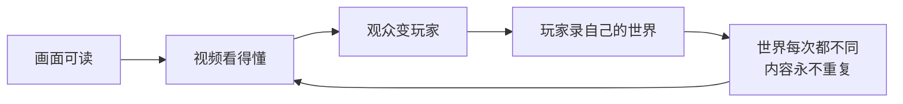

> **本章命题**：Minecraft 先是被看会的，然后才被玩会的。可读的方块画面、永不重复的世界和一度缺席的目标，让玩家的视频成了这个游戏事实上的教学系统；教育版和配方书都是对这个既成事实的追认，不是开端。

## 问题

一个六岁的孩子还没碰过 Minecraft，已经会背口诀：天黑之前要有火把；不要直视末影人的眼睛；听见「嘶嘶」声就跑，能跑多远跑多远。这些知识没有一条来自游戏本体——游戏还没买。它们来自屏幕上别人的游戏：解说视频、实况、教程。

这不是个别家庭的轶事，是一整代玩家的入场方式。2010 年代初，学习 Minecraft 的主要场所不在游戏里，而在视频里：先看别人怎么活过第一晚，再自己按下启动器。一款游戏把「怎么玩」这堂课整体外包给玩家自制的影像，还外包得如此彻底，这在游戏史上少有先例。

本章要回答：它如何从游戏变成一代人的通用语言？这个问题不能靠「视频时代来了」打发——视频没有把所有游戏都变成通用语言。要解释为什么偏偏是 Minecraft，答案得回到设计里找：画面、世界生成、目标结构，各有一样东西在替视频撑腰。然后再看两件追认既成事实的事：教育版把课堂接了进来，配方书把第一课收了回来。

## 很多人是在视频里学会玩的

先解释名词。实况（Let's Play）指把玩的过程录下来、配上解说的长视频，特点是长、慢、陪伴性强；教程视频则短、准，专讲某一步怎么做。两种形态 Minecraft 都占全了，但真正的问题不是「Minecraft 有视频」，而是「Minecraft 的视频为什么成立」。三个设计决定各出了一把力。

**第一把力：画面为可读性服务。** Minecraft 的世界由一米见方的方块拼成，颜色少、轮廓大、运动慢。这种画面被压进低分辨率的视频流之后，观众依然一眼认得出：那是树，那是矿洞，那边塌了一角。同时期画面更精细的游戏，在同样的压缩下往往糊成一片，观众看得见特效，看不清结构。方块不是美术风格上的巧合，它是让游戏「经得起转述」的技术决定：离散、有限、可命名。可命名还有一层用处：方块和生物都有名字，中文社区还顺手给苦力怕起了音译外号。名字是口诀和弹幕的单位——一个画面只有先能被叫出名，讨论才能在评论区聚集。这条可以证伪：如果 Minecraft 的画面换成高频细节、快速镜头，视频传播不会消失，但「看视频学会玩」这条路会窄得多，因为观众认不出画面里发生了什么。

**第二把力：每次生成的世界都不同。** 教程会看腻，实况不会，因为实况的真正内容不是主播，是主播脚下的世界。Minecraft 的地形由算法即时生成，没有两张地图相同（见[《世界生成即内容生产》](/design/worldgen)），于是「别人玩」永远等于「新内容」。内容生产的成本被世界生成器接走了：主播不用写剧本，游戏替他出剧本。

**第三把力：没有目标，看别人玩也成立。** 剧情重的游戏，视频看完等于游戏看完，观众没有理由再买；目标硬的游戏，视频变成攻略，看是为了抄。Minecraft 两头都不占：它没有会剧透的剧情，也没有「通关」这个终点；死亡掉落物品，世界还在，节目不会大结局。于是观看本身成了完整的消费方式——看人盖城、看人探险、看人被苦力怕炸上天，都不欠游戏一个下场。再配上极小的动词集——走、跳、挖、放（见[《最小动词集与手感》](/design/verbs-feel)），看一遍就能模仿，教学视频也因此真的教得会。

三把力合在一起，转成一个轮子：

<Note>
本章的证伪条件一句话就能说完：找一个从没看过任何视频、没读过任何攻略、还玩得下去的新玩家——2017 年之前，这个人几乎不存在。
</Note>

## 类型：实况、教程、动画、音乐改编

四类视频各干各的活，拼起来才是完整的传播。

**实况是陪伴。** 一更一更地录，一录就是几年，观众追的不是技巧，是长期关系；甚至看主播花三个小时慢慢挖矿也能成立——放在剧情游戏里，这是不可想象的内容。YouTube 官方后来盘点 Minecraft 十五年时点过名的几个系列——2010 年代初就开录的长篇实况、按孩子节奏设计并更到 2023 年的 Stampy's Lovely World、2011 年起长期更新的技术向实况——都是这种形态[^ytblog]。它们证明一件事：这个游戏提供不了「通关即弃」的内容，因为它的内容本来就不是官方装进去的，是每一次生成、每一个玩家现做的。

**教程是基础设施。** 「第一晚怎么活」是 Minecraft 视频的第一个大文体：撸树、做工作台、木镐、石镐、天黑前封洞。这些步骤游戏里一步都没教，全靠口传。教程视频接下了原版留下的空白，也顺手定下了社区的默认玩法——后来人人都先撸树，不是游戏要求的，是第一代教程定的。教程旁边还有一层静态知识库：Wiki。视频管演示，Wiki 管查询，两层拼成一套民间教科书，官方一个字没写。

**动画把游戏当摄影棚。** 方块世界自带一套免费的三维布景：角色、道具、光照、镜头都在游戏里。社区用它拍短剧、拍广告、拍久更不衰的「怪物学校」。玩法在这里已经不重要——引擎成了动画软件，玩家成了制片厂。

**音乐改编把游戏写进流行文化。** 最著名的一支是 2011 年 8 月上线的《Revenge》：拿 Usher 的《DJ Got Us Fallin' in Love》的曲子，填上向苦力怕复仇的词，做成 MV[^revenge]。这种「借用热门歌曲、重写成游戏内容」的做法当时批量出现，《Revenge》是留下最深的一支——十几年后，「Creeper, aw man」仍是玩家之间的接头暗号：前半句出现在评论区，后半句等在回复里。一首改编曲能活成社区礼仪，说明这个游戏已经不只是游戏。

规模的里程碑有两个，都出自可查的数据。2014 年底，Google 的年终盘点列出 YouTube 站内搜索词：「music」第一，「minecraft」第二——前十名里唯一的游戏词，而当时 Minecraft 视频的累计观看已经超过 470 亿次[^tf2014]。2021 年 12 月，累计观看突破一万亿，成为 YouTube 历史上观看量最高的游戏；按微软当时的口径，活跃的创作频道超过三万五千个，分布在一百五十个国家[^guardian]。到 2024 年，官方博客再报数，已超过 1.5 万亿[^ytblog]。注意这些数字的出处：不是发行商的战报，是平台和搜索方的统计。把 Minecraft 送上年榜的不是广告投放，是几万个以录屏为业的普通玩家。这个判断同样可证伪：若传播主要靠买量，年终榜上该挤满大发行商的游戏；事实是那年只有这一个游戏词。

## 儿童、家庭与「安全的创造」

视频观众里有一类特殊的：儿童，以及替儿童选视频的家长。Minecraft 能过家长这一关，靠的不是分级也不是宣传，是筛选后的观看体验：像素方块没有血腥表现，打斗是碰撞和红字，死亡是物品散落一地；节奏可以随时暂停，一个人也能玩；创造模式下的孩子就是在搭积木，搭错了拆掉重来（见[《创造模式》](/design/creative-mode)）。家长看到的画面接近乐高，而不是战斗。这个「安全」的印象是传播端筛选出来的，不是官方定位——Mojang 从没把游戏做成儿童游戏，是儿童把它选成了自己的游戏。家庭这一侧还有个容易忽略的事实：游戏天生适合共住。家人把存档放进同一个世界，各自的房子盖在同一张地图上；孩子与父母大概第一次以平等的身份待在同一个数字空间里——你比我熟练，我比你有钱，各干各的。这在客厅游戏机的历史上也不多见。

<Note>
顺便戳破一个误会：生存模式并不温柔，会饿死、会被炸，辛苦攒下的家当可能一夜丢光。「安全」是屏幕外的观看效果，不是游戏内的参数。
</Note>

低龄观众成规模之后，专门做给孩子的频道成了独立类型，Stampy's Lovely World 就是其中最有名的一个：语气、节奏、每集的小目标，都按孩子的注意力设计[^ytblog]。围绕「游戏变小儿科」的争论也随之持续了十年，双方各有道理。家长这边：孩子从视频里学到的第一套语言是方块语言，至少可分享、可一起玩，比许多屏幕时间的去处都强。老玩家这边：社区肉眼可见地低龄化，服务器转向小游戏和跑酷，红石与工程的讨论被挤到角落，有人因此觉得「我的 Minecraft」被稀释了。两边都是真的：家庭得到了一个安全的创造空间，代价是公共讨论的音调变了。

<Memoir title="只看，不玩">
社区里流传最久的一类抱怨出自家长：孩子一下午盯着 Minecraft 视频，游戏本身一天没打开。这不是荒废，是这个媒介的常规用法——观看是完整的消费方式，孩子的口诀、词汇和建筑品味都来自视频，游戏反而是第二现场。后来「云玩家」这个词专门收留这类人：没怎么玩过，对机制却如数家珍。
</Memoir>

## 教育版：课堂沙盒改写了谁的游戏

课堂这个新主场，最早不是微软开的。2011 年，纽约的计算机课教师 Joel Levin 把 Minecraft 带进教室，把课堂经验写成博客；芬兰的教育创业团队看到后找上门，同年 6 月开始开发课堂定制版，11 月成立 TeacherGaming 公司——美国的教师加芬兰的开发者，一共六个人[^mcw-edu]。产品叫 MinecraftEdu：在 Java 版上改造出一套课堂用的客户端，配上教师工具：冻结学生、定点传送、发放方块、圈定活动范围。学校自己买授权，老师自己学着用，到 2016 年，世界各地的课堂已经拿它教编程、城市规划、语言和历史。

2016 年 1 月 19 日，Mojang 宣布从 TeacherGaming 手里买下 MinecraftEdu[^mcw-edu]；4 月 5 日，原版停售；同年 11 月 1 日，官方的 Minecraft: Education Edition 正式发布[^mcw-education]。注意，这不是「给 MinecraftEdu 换个名字」：教育版没有建在 Java 上，而是建在口袋版一系的 C++ 代码库上——也就是后来的 Bedrock 引擎。于是学校在 MinecraftEdu 里攒下的世界，无法迁移进教育版：旧平台是 Java 的存档格式，新平台是 Bedrock 的[^mcw-edu]。一堂课盖出来的教学楼，换一次版本就留不住。官方教育产品的起点，是一次不接旧账的平台更换。

为什么偏偏选 Bedrock？因为课堂要的东西和爱好者正相反。爱好者要的是能改：Java 版可以装模组、换机制，代价是每台设备各装各的、每个版本各修各的。学校要的是能管：几十台设备统一部署、统一版本，教师看得见每个人在做什么，出问题能一键恢复。Bedrock 一系单一代码库、天然跨平台，正好接住这份清单：教育版 2016 年发布 Windows 与 macOS 版，2018 年上 iPad，2020 年 8 月上 Chromebook——欧美课堂里最常见的那类设备[^mcw-education]。Java 版的模组生态再繁荣，也做不到给几十台平板一键下发同一套课堂规则。这个约束可以写成一句话：

<Constraint name="课堂沙盒" verdict="地基" chain="学校要求统一部署与管控 → 教育版建在 Bedrock 单一代码库上 → 换来跨设备可管理，代价是放弃 Java 模组生态">
这个选择可被证伪：如果教育版当年基于 Java 加 Forge，也做得到几十台设备的统一管理，「Bedrock 是课堂的必然」就是错的。史实是它没走这条路——课堂的约束不是「能不能改」，是「能不能管」。
</Constraint>

把教育版写成纯粹的商业善举，同样不诚实。它向学校按授权收费，课堂同时也是渠道：一代学生从学校机房里认识的第一个方块游戏，就是官方版——「谁的 Minecraft」在这个场景里没有任何争议。但教师拿到的也是真东西：课堂管理工具、跨设备联机、现成的课程素材，两边各取所需。收购 MinecraftEdu 的意义不在善举或生意的任何一边，而在定义权：此前 Minecraft 是什么，由玩家社区说了算；此后，学区、教育部和教师培训体系也拿到了一份投票。

## 正作还教什么：进度与配方书是对视频教学的迟到补课

现在把镜头转回游戏本体。2016 年之前，正作对「怎么玩」几乎一言不发：合成表是保密的，木板、工作台、木镐、火把的排列组合，要么问朋友，要么查视频和 Wiki；目标系统薄到只有一个成就页。游戏给出的答案只有一个字：看。看视频，看 Wiki，看别人。这套外包在头几年运转得极好，好到官方没有压力补课——教学的成本被社区媒体扛了八年。

转折发生在 2017 年 6 月 7 日的 1.12：配方书与进度系统同版本上线。配方书把「这个东西怎么做」登记进游戏，按条件逐步解锁；进度取代成就，给玩家一条看得见的路径，同版本还附上了面向新玩家的提示序列[^mcw-112]。这是官方第一次承认：不是每个新玩家身边，都恰好有一个看过视频的朋友。补课的不只 Java 版。口袋版一系的触屏合成界面，从 2012 年起就是列表式的：点开合成界面，能做什么直接列在眼前；2017 年的 Bedrock 1.2 也换上了经典合成加配方书[^mcw-crafting]。在「告诉玩家能做什么」这件事上，Java 版反而向移动端一系补了课。

为什么迟到了八年？有三个原因。其一，Minecraft 出身于「看别人做」的文化：Notch 的世界生成学自 Infiniminer，玩家的建筑学自彼此的存档，教学从一开始就被当成社区自己的事。其二，社区把课扛得很好，每次更新发布几天内就有解读视频，官方感觉不到痛。其三，2016 年前后受众结构变了：新玩家的主体换成看视频长大的一代，学校市场又被教育版打开——2016 年收购 MinecraftEdu，2017 年补配方书与进度，这条时间线不是巧合。

值得琢磨的是这次补课的克制。配方书不等于菜谱大全：配方要按条件解锁，你见过、做过的才会登记进来；它也不解释红石为什么这样连、刷怪塔为什么这样设计。深层的机制知识，2017 年之后依然不在游戏里，依然在视频和 Wiki 里。所以准确的说法是：**正作把「第一小时」收了回来，把「之后的一千小时」继续留给社区媒体。**这个分工不是偷懒。第一小时是硬门槛，过不去就没有然后；之后的知识是社区的内容生产，官方若全收回去，等于掐掉社区的素材。边界划在「不设门槛」与「不抢内容」之间。

<Alternative title="如果当年做成强制新手关">
对照做法是关卡制游戏的路线：强制新手岛、全配方手册、逐屏弹出的教学提示。对 Minecraft 这是坏方案：它的学习乐趣有一半来自「我不知道还有什么」，全配方开放会填平探索空间；强制教学会破坏「无目标」的底色——玩家本来可以像前辈一样，从一场狼狈的第一晚里自己长出知识。1.12 选的「按需解锁的登记簿」，是两头各让一步的方案。
</Alternative>

回到本章的问题：当传播发生在视频里，正作还教什么？答案：教最小动词集和第一晚。这两样是看视频也未必补得齐的底层——动手的手感、失败的成本，必须亲自付过才记得住（见[《最小动词集与手感》](/design/verbs-feel)）；其余的「教」，交给已经教了十年的那套系统。这个分工能否永远成立？未必。如果有一天视频生态对新一代失效，而官方又不接手，外包就会变成断供；反过来，如果官方把全部机制知识内建，视频教学萎缩，「学习发生在社区」这个结构也就没了。本章的判断两头都不押，只押一句：补课是追认，不是开端——若 1.12 的配方书和进度出现在视频生态兴起之前，本命题就是错的。

## 这一章留下什么

- **爱好者**：你的第一课多半不在游戏里。配方书是 2017 年才寄到的入学通知，而你早已在别人的世界里毕过一次业。
- **开发者**：能抄走的是三件事：为可读性设计画面、让生成承担内容成本、把知识外置当成一个要付学费的架构决策。抄不走的是窗口期——恰好压中一代人把视频平台当客厅的那十年。

[^tf2014]: Tubefilter，Sam Gutelle，《Music, Minecraft Lead YouTube's Top Searched Terms Of 2014》，2015-01-07，检索于 2026-09-17，https://www.tubefilter.com/2015/01/07/youtube-top-searches-2014-music-minecraft/ （引 Think With Google 2014 年 12 月报告：YouTube 站内搜索「music」第一、「minecraft」第二（趋势指数 80，第三位「movies」45），前十中唯一的游戏词；当时 Minecraft 视频累计观看已超 470 亿次。经 archive.org 快照核对）

[^guardian]: The Guardian，Keith Stuart，《Minecraft passes one trillion views on YouTube》，2021-12-15，检索于 2026-09-17，https://www.theguardian.com/games/2021/dec/15/minecraft-passes-one-trillion-views-on-youtube （YouTube 累计观看突破 1 万亿，成为平台史上观看量最高的游戏；微软口径：活跃创作频道超 35,000 个，分布 150 个国家）

[^ytblog]: YouTube 官方博客，《Celebrating 15 years of Minecraft》，2024-05-28，检索于 2026-09-17，https://blog.youtube/culture-and-trends/minecraft-15/ （引 YouTube Data 2024：累计观看超 1.5 万亿；点名 2010 年代初的长篇实况、Stampy's Lovely World（2012–2023）与 2011 年起长期更新的技术向实况）

[^revenge]: CaptainSparklez、TryHardNinja，《Revenge — A Minecraft Parody of Usher's DJ Got Us Fallin' In Love (Music Video)》，YouTube，2011 年 8 月，检索于 2026-09-17，https://www.youtube.com/watch?v=cPJUBQd-PNM （Usher《DJ Got Us Fallin' in Love》的 Minecraft 改编 MV，原片可查）

[^mcw-edu]: Minecraft Wiki，《MinecraftEdu》，检索于 2026-09-17，https://minecraft.wiki/w/MinecraftEdu （2011 年 6 月与教师 Joel Levin 接洽后启动开发，10 月售出首批授权，11 月成立 TeacherGaming LLC，团队为美国与芬兰的三名开发者加三名教师；2016 年 1 月 19 日 Mojang 宣布收购；2016 年 4 月 5 日停售；因教育版基于 Bedrock 而非 Java，旧世界无法迁移）

[^mcw-education]: Minecraft Wiki，《Minecraft Education》，检索于 2026-09-17，https://minecraft.wiki/w/Minecraft_Education （2016 年 1 月 19 日公布，6 月 9 日至 11 月 1 日为抢先体验，2016 年 11 月 1 日正式发布 Windows/macOS 版；基于 Bedrock 版代码库、以 C++ 编写；iPad 版 2018-09-06；ChromeOS 公测 2020-06-26、正式版 2020-08-07）

[^mcw-112]: Minecraft Wiki，《Java Edition 1.12》，检索于 2026-09-17，https://minecraft.wiki/w/Java_Edition_1.12 （2017 年 6 月 7 日发布：加入配方书与新手提示，进度系统取代成就）

[^mcw-crafting]: Minecraft Wiki，《Crafting》，检索于 2026-09-17，https://minecraft.wiki/w/Crafting （口袋版 MATTIS 触屏合成界面自 v0.3.0（2012 年）起以列表呈现，0.9.0 起只显示当前可合成项；Bedrock 1.2.0（2017 年）以经典合成加配方书取代 MATTIS）
