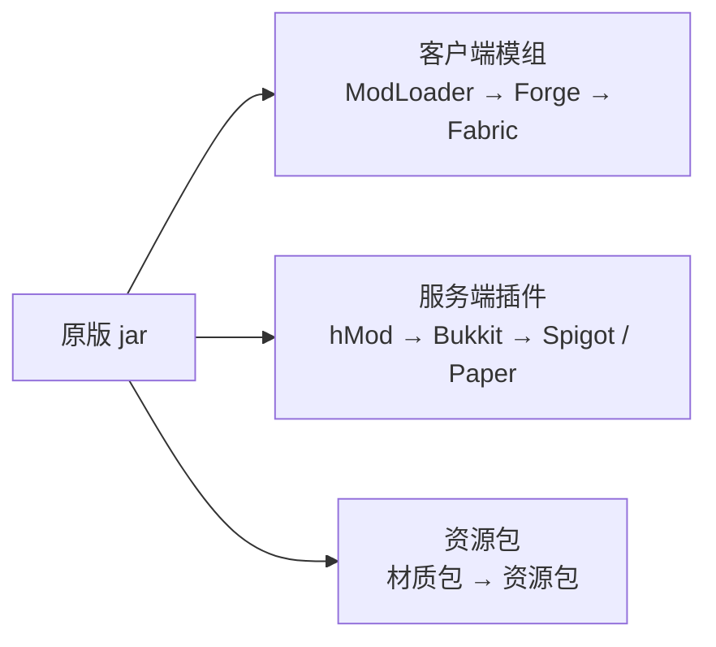

> **本章命题**：模组不是 Minecraft 的赠品或周边，而是与正作同步成长、实际改写了产品边界的第二作者席；Mojang 接受这个席位的存在，却几乎从未为它付过钱。

## 问题

2011 年，一个玩得比较深的 Minecraft 玩家，硬盘里往往装着两个「Minecraft」。

第一个在单机里。游戏本体之外，还有一批叫「模组」的文件：装上发电、输电、加工流水线之后，挖矿盖房的游戏变成了有工业体系的另一个世界。第二个在服务器上。管理员换掉了 Mojang 官方的服务器程序，装上另一套叫「插件」的东西，朋友进来可以玩捉迷藏、领地保护、小游戏竞技——客户端什么都不用装。这两套东西都不是 Mojang 做的，也大多不收钱。同一个游戏，边界被撑大了好几圈。

这件事值得停下来问一句：模组不是等游戏做完才出现的「后续支持」，它几乎和正作同步长大。2010 年游戏还在 Alpha 阶段时，第一代成规模的模组已经出现；2011 年正式版发布时，模组平台已经成型；往后每一个大版本旁边，都站着一排追着版本更新的模组作者。**为什么模组几乎与正作同步成长，并在这个过程中改写了产品边界？**「Minecraft 有什么」这个问题，答案是什么时候开始不由 Mojang 一家写的？

「第二作者席」这个说法需要先立起来。把游戏想象成一张会议桌：谁坐在这张桌子旁，谁就在决定「这个游戏有什么」。传统游戏只有一位作者——公司把内容做完、封盘、发售，别人没有座位。Minecraft 的不同之处在于，桌子边很快多出了一排人：写模组的、写插件的、画材质的、运营服务器的。他们拿不到 Mojang 的工牌，却实打实地往产品里加东西，加的东西玩家实打实地在用。这一章要考察的就是这排座位怎么形成的：谁先坐下，坐的是哪几把椅子，桌子的主人怎么看待这些不请自来的共同作者。

这一章按时间顺序给三条线：客户端模组的河、服务器插件的河、资源包的河；然后看模组补上了哪些原版没有的系统，官方怎么把社区发明的东西有选择地请进正作，以及第二作者席靠什么维持——谁署名，谁治理，谁买单。模组如何反过来成为一种设计方法，留给[《模组作为设计方法》](/design/mods-as-method)；加载器与插件系统怎么搭，留给[《模组与插件架构》](/impl/mod-architecture)；玩家把这套劳动拿去变现的灰色地带，留给[《灰色经济》](/history/grey-economy)。

## 「原版 Minecraft」从来不是完整产品

先说「改得了」的前提。

2009 年 5 月，Notch 把一个没做完的游戏公开发售。这不是修辞：alpha 阶段半价、beta 提价、做完再提价，「在施工中」就是这个产品的销售方式。玩家买到的不是成品，是对一个施工过程的长期入场券。每隔几周，游戏就变一个样：这个月有了火把和矿洞，下个月有了生物和存档。2010 年的玩家逐渐习惯了一种当时很陌生的体验——你买的游戏是活的，它在长。参观的人多了，就有人不满足于看，想自己上手改图纸。

这在当时的游戏行业里几乎没有对应物。主流的商业模式是把内容做完再卖：DLC、资料片、年货续作，全都是「官方做、玩家收」的单向管道。玩家自己往游戏里加东西的事当然存在——PC 游戏的 mod 传统由来已久——但通常发生在游戏发售多年、官方更新停滞之后：mod 社区往往是游戏的「下半场」，接替不再更新的官方。Minecraft 把这个顺序整个倒了过来：mod 与官方更新同时进行，两条线并排跑，互相看着对方。游戏还在施工，第二作者已经在施工队的空地上搭起了自己的工棚。

改图纸在技术上没有上锁，因为 Minecraft 用 Java 写成。Java 程序发布出来是一堆「字节码」：介于源代码和成品之间的一种中间形态，拿现成工具可以把它还原成接近源码的可读文本，这个过程叫反编译。官方当然设了防：发布时故意把代码里的类名、函数名全部替换成 a、b、c 这样的乱码，让人读不懂——这道工序叫混淆。但混淆挡得住眼睛，挡不住工具。最早把这条路走顺的是一个叫 Searge 的玩家（本名 Michael Stoyke，后来进了 Mojang）：他做的 Minecraft Coder Pack，简称 MCP，把官方混淆过的名字一一配回能看懂的名字，相当于给乱码字典配了译文。[^w-modding] 从 2010 年起，做模组的人基本都踩着 MCP 干活。值得回味的是这份「译文」的性质：官方从未授权任何人读它的代码，也从未起诉过读代码的人——第二作者席的第一块地基，是一段双方都不点破的沉默。

于是同步成长有三个条件，凑齐在 2010 年。**第一，商业模式本身就是开放的**：游戏每周到每两周更新一次，边界一直在动，谁想跟着做东西就得盯着最新版本走——「与正作同步」在这里不是文学修辞，是模组作者的日常劳动。**第二，技术门没锁**：Java 可反编译，门槛是「愿意学」而不是「拿到授权」。**第三，需求到位**：2010 年 8 月 4 日，生存模式的多人联机上线，玩家基数几个月内爆开，人一多，想往游戏里装东西的人也多了。[^w-server]

Notch 本人一开始并不高兴。他后来承认，自己最初对模组是怀疑的，怕玩家做的东西会稀释他对这个游戏的设想；到 2012 年他改了口，说模组是「Minecraft 之所以成为 Minecraft 的一大原因」。[^w-modding] 这个转变不是态度问题，是产品事实变了：2010 年末，当游戏正要从 Alpha 转入 Beta 时，IndustrialCraft、Railcraft、BuildCraft 这批后来最有名的模组集中首发，它们加的不是几个方块，是一整层原版没有的系统。[^w-modding] 玩家买到的东西，定义已经变了——不是「Mojang 会做的那个游戏」，而是「Mojang 会做的部分，加上全世界往里装的部分」。

「完整产品」这四个字从此失去了裁判资格。你无法再指着游戏说「这就是 Minecraft」，因为同一个安装目录之外，还有几十个「更大的 Minecraft」在各自的加载器里运行。这个判断可以证伪：如果原版当时已是完整产品，玩家该满足于原版，模组该以换皮、地图这类小修小补为主。史实相反——最早做大的模组全是补系统级的，这一点下一节展开。

## 三条河：ModLoader/Forge、Bukkit、资源包

先把两件最容易被混为一谈的事分清。**客户端模组**（通常就叫 mod）改的是游戏本体：每个玩家都得装，装了才能看见新方块、新机器。**服务端插件**（plugin）只改服务器：玩家什么也不用装，裸客户端直接进服，看到的服务器行为已经变了。前者改「世界长什么样」，后者改「大家怎么玩」。两条河的作者、工具、技术路线都不同，只是在口头上都被叫成「mod」。本章的 Bukkit 属于后者——它是**服务端的作者席**，不是模组清单里的一行。

**第一条河：客户端模组。** MCP 解决了「读」，但两个模组都去改同一段代码时会互相覆盖，装三个就崩。2010 年，一位叫 Risugami 的玩家写了 ModLoader：它统一接管「往游戏里装模组」这件事，规定每个模组从哪里进入、改哪些地方，冲突大幅减少。这是第一个事实上的模组加载器——游戏本体没变，但「怎么往本体上装东西」有了规矩。[^w-modding]

到 2011 年 11 月前后，问题升级了：模组多了，缺的不再是「能装」，而是「能共存」——几十个模组同时跑，方块编号会撞车，模组之间还要互相调用功能。Minecraft Forge 就是为这件事而生：由当时几家大型模组的作者牵头做出，目标和它的 GitHub 仓库描述写的一样直白——「对 Minecraft 基础文件的修改，以帮助模组之间的兼容。」[^w-modding][^gh-forge] Forge 内置了自己的加载器 FML（Forge Mod Loader），把 ModLoader 的活儿也接了过去；原本的 ModLoader 在 Minecraft 1.7 发布前夕停止更新，此后客户端这条河以 Forge 为主流，一主流就是十年。2018 年 12 月，更轻量的 Fabric 出现，成为第二条主要加载路线；2023 年 Forge 社区分裂出 NeoForge。[^w-modding] 河会分岔，但河床是同一个：谁提供一个稳定的「装入规矩」，谁就坐住了客户端的作者席。

Forge 的真正贡献不在「能装」，在「分工」。它给模组作者提供了共同的底座：方块编号的登记、模组之间互相调用的约定、一套大家共享的工具。此后客户端模组的作者不再各自为战——你做的电力模组可以为我做的机器供电，我做的矿物可以被你的工具识别。模组生态从「一堆各自为政的补丁」变成了「一个彼此咬合的系统」，工业、魔法、RPG 能叠着玩，前提正是这条河上有规矩。

<Memoir title="删 META-INF：2012 年的装模组仪式">
2012 年前后，给 Minecraft 装模组有一套社区人尽皆知的动作：解开游戏的 jar 文件，删掉里面一个叫 META-INF 的文件夹——它像贴在封口的封条，专防文件被替换；再把模组文件拖进去，打包回去，启动，祈祷能进到主菜单。装失败的报错截图是当时论坛的日常景观。后来 Forge 用自己的启动器接管了这些动作，仪式消失了，但本质没变：所谓装模组，就是改官方发布的程序文件。
</Memoir>

**第二条河：服务端插件。** 这条河甚至比客户端那条早。2009 年 5 月 31 日多人模式在 Classic 阶段上线，服务端 mod 随即出现；[^w-server] 2010 年 9 月 3 日，一个叫 hMod 的项目开工，它给服务器提供插件接口——插件之间互不打架，都按它的规矩写。今天还在维护的建筑工具 WorldEdit，最初就是 2010 年 9 月 28 日发布的 hMod 插件。[^w-modding][^w-server] hMod 停滞后，它的五位开发者——Dinnerbone、Grum、EvilSeph、Tahg、sk89q——在 2010 年 12 月 21 日立项了继任者 Bukkit，2011 年正式发布。[^w-server]

Bukkit 的结构值得多看一眼，因为「作者席」在这里最清楚。它分两层：Bukkit 本体是插件接口（以 GPL 开源），CraftBukkit 是让 Mojang 官方服务器程序跑插件的包装层。插件作者只面向 Bukkit 接口写代码，完全不用碰 Mojang 的服务器文件——接口稳定，插件就能跨版本活下来。数以万计的服务器靠这套东西运转小游戏、领地、经济系统。

这条河上产出的「作品」和客户端模组完全不同，值得单独描述。插件不增加方块和生物，它增加的是**规则与场所**：领地插件让「保护自己的房子不被拆」成为服务器里的一条法律；经济插件让玩家之间出现货币与商店；小游戏插件把一张地图改造成捉迷藏、跑酷、团队对战的赛场。换言之，插件作者写的是玩法的社会形态——谁能动谁的东西、玩家之间怎么交换、一场游戏怎么开始与结束。大型服务器后来发展成几十人团队运营的「游戏平台」，其产品几乎全部由这条河上的作者供给：玩家里最会写代码的那批人，在没有合同、没有官方接口的情况下，把一台 Minecraft 服务器做成了「游戏里的游戏」。它的两个继任者你今天还能见到：Spigot（2013 年 1 月从 CraftBukkit 的分支改名而来）和 Paper（2014 年 6 月立项的性能向分支）——到 2025 年，公开统计平台 bStats 记录到超过 13 万台 Paper 服务器同时在线，占这条河的六成以上。[^w-server] 服务端的第二作者，今天仍是绝大多数大型服务器的实际运营者。

注意这里埋着一颗雷：CraftBukkit 是开源许可证，但它包裹的 Mojang 服务器代码是专有的——壳是开源的，芯是闭源的，这份许可证在法律上并不成立。这颗雷 2014 年才炸，本章最后一节再回来。

**第三条河：资源包。** 这条河的入座门槛最低。早在 2010 年的 Alpha 1.2.2，官方就加入了对材质包的支持；在此之前，玩家想换贴图只能手动替换游戏文件里那张把全部方块贴图拼在一起的大图（terrain.png），或者干脆用模组。[^mcw-tp] 2013 年 7 月 1 日的 1.6.1 版本把材质包升级为资源包——声音也可以换。[^mcw-161] 这条河上坐着的是画师和配音，一行代码不用写：有人把游戏换成手绘质感，有人换成统一色块的极简风，有人给每种生物重录音效。第二作者席不只有程序员：把游戏的外皮整层换掉，同样是「重新作者」的方式。三条河的作者身份各不相同——程序员、系统设计者、美术——但做的事情同构：都在「Mojang 会做的部分」之外，往产品里加自己的一层。

三条河从同一个源头分出来，可以画成一张图：

<Note>
一句话口诀：模组跟着客户端走，插件跟着服务器走。发个文件让朋友也装上才能玩，是模组；只装在服务器上、朋友裸进就能玩，是插件。
</Note>

还有一条不算河的对照，一句话记下：以上三条河全部流在 Java 版。Java 程序的字节码能还原成接近源码的东西，Bedrock 版用 C++ 写，编译出来直接是给每种设备处理器的机器码，没有「还原出可读源码」这回事——撬棍插不进焊死的机器。于是三条河在 Bedrock 上一条都流不过去，它走的是官方附加包和审核制商店，作者席从志愿席变成了签约席——那是第 8 章的主线，此处只需记住这个对照（见[《Java 版与 Bedrock 版》](/impl/bedrock)）。至于加载器内部怎么隔离冲突、插件的事件系统怎么搭，[《模组与插件架构》](/impl/mod-architecture)会拆开讲。

## 工业、魔法、RPG 在补哪些结构空洞

三条河是渠道，渠道里流的是什么？看几类当时最成功的模组，会发现它们补的不是「内容」，是「结构」。

先把这两个词分开。内容缺口是「少几个方块、几种生物」，官方迟早会填。结构空洞是「少一整层系统」——游戏里有一类事情永远做不成，因为它依赖的那层规则根本不存在。原版 Minecraft 在 2010 年至少有三个这样的洞，每个洞都长出了一类模组。

**第一个洞：没有能量，于是没有工业。** 原版红石给的是「信号」：开、关、推、拉，几个字就能说完。它没有「能量」这个概念——没有发电，没有输电，没有一台接一台的机器加工链。你造不出一个火炉烧煤、烧出的能量驱动三十台机器排队干活的文明图景。IndustrialCraft 补的是能量层：发电、储电、用电的机器体系；BuildCraft 补的是物流层：管道、自动采矿、流水线；Railcraft 补的是运输层：把铁路做成可以运货的工业系统。它们在 2010 年末集中出现不是偶然——玩家基数已经大到有足够多的人想玩「自动化」，而官方短期内不打算做这个。装上工业模组的 Minecraft 和原版，严格说是两种游戏形态：差别不在方块多少，在于有没有「自动化经济」这一整层。

**第二个洞：合成是查表，没有「发现」。** 原版的合成系统是配方表：材料摆对了就出东西，配方背下来就毕业。ThaumCraft 这类魔法模组把它改成「研究」：先在世界上观察、收集线索，再用研究点解锁知识，知识再解锁更强的法术与造物。玩家多了一个内置的「求知」循环——不是官方塞给你任务，是系统结构鼓励你自己去发现。魔法模组流行的原因和工业模组一样：它补的不是法术皮肤，是「探索—理解—掌握」这层结构。

**第三个洞：成长曲线太短，没有「下一个世界」。** 原版的装备从木到钻石，五步走完；大 Boss 很长一段时间里只有一条末影龙。Aether 这类维度模组在天上另开一个世界、配上新的矿物与 Boss，RPG 向模组把等级、技能、装备强化整套搬进来。它们补的是纵向成长：让「变强」这件事有下一层可去。

归纳成一句话：**Mojang 提供名词和少量动词，模组补的是完整语法。** 这就是「第二作者」的含义——模组作者写的不是同人小说，是产品里原本缺失的那几层结构。这个判断同样可以证伪：如果那些模组只是「加内容」，去掉它们原版的结构应当不受影响；实际上装了工业模组的玩家回不去原版，缺的不是那几十个方块，是整层自动化。体量也说明问题：到 2025 年 3 月，仅 CurseForge 一个平台的 Minecraft 模组就超过 20 万个。[^w-modding] 一个由官方单独定义的产品，长不出这种规模。

**叠起来看：整合包。** 这三类结构补全后来还发生了化学反应。玩家把几十上百个模组按主题搭配好、调好兼容、配上安装器，打包分发——这就是整合包（modpack）。一个整合包往往同时含有工业、魔法、RPG 的模组，模组之间互相供电、互相供料，玩起来像一个全新的游戏。整合包的作者是第三层作者：他们不写模组，做的是「把第二作者们的作品编排成一个整体」的策展工作。产品边界到这里已经不是一条线，而是一棵树——官方写树干，模组作者写分枝，整合包作者把分枝扎成盆景。

顺带记一笔人的去向：这些补结构的人后来很多成了职业者。收入渠道是下载站的广告分成与众筹，做到全职甚至成立小工作室的都存在——不过那是少数，头部以下的绝大多数作者纯属用爱发电，这笔账第五节算。[^w-modding]

## 选择性收编：活塞能进、工业进不来

官方不是只看着。社区发明的东西，Mojang 会挑一些请进正作——这件事有个名字，叫收编。收编的案例按时间排开，能看出一条清晰的线。

**活塞。** 在 Beta 1.7 之前，论坛用户 Hippoplatimus 发布了一个活塞模组：一种能推动方块的方块。Jeb——当时已接手 Minecraft 开发的程序员——看到了它，Hippoplatimus 把代码交了出去；另一位玩家 DiEvAl 也私下贡献了关键构想：用一个隐藏的数据结构（方块实体）来跟踪被推动的方块。2011 年 6 月 30 日，Beta 1.7 发布，活塞进了正作；Hippoplatimus 的名字以「额外编程」的身份写进了游戏的制作名单。[^mcw-piston][^mcw-b17] 这是收编史上署名最体面的一次：东西进了游戏，名字也进了游戏。

活塞对游戏的影响怎么估都不夸张。在它之前，红石玩家的世界是静态的：电路能点亮灯、能开门，但「结构本身动起来」做不到。活塞给了红石一个新的动词——**移动**。隐藏门、升降电梯、可伸缩的桥、自动农场，全都是从「方块可以被推」这一个动作里长出来的。一个模组作者在自己房间里发明的机制，成了此后十几年所有红石工程的地基。这也是「收编」最理想的形态：官方没有自己发明活塞，只是认出了它值得属于所有人。

**马。** 2013 年 7 月 1 日的 1.6.1 直接被叫作「马更新」。马出自知名模组 Mo' Creatures，原作者 Dr. Zhark 协助 Mojang 把它适配进正作。[^mcw-161][^w-modding] 和活塞同款动作：收编，且原作者在场。

**命令方块。** 2012 年 10 月 25 日的 1.4.2 加入了命令方块。[^mcw-142] 这个严格说不是收编某个模组——没有哪个模组叫「命令方块」。它收编的是插件河和地图社区的实践：命令本来是服务器管理员的日常工具，命令方块把命令变成地图作者手里的积木，把「会写命令的作者」请进了正作。

**数据包。** 2018 年 7 月 18 日的 1.13 加入数据包：不写 Java、不装服务器插件，改几个配置文件就能改掉战利品表、配方，还能跑函数。[^mcw-113] 这一步等于把插件河的一部分职能官方化了——服务器作者席上最常用的那几件工具，官方做了一版轻量的，直接放进每个玩家都能用的游戏里。对不会编程的普通玩家，这也是第一次不需要装任何第三方东西就能「改规则」：把掉落物换一换、给地图加一条自定义配方，原本是插件作者的专利，现在人人可做。收编到这里已经不只面向模组作者，而是把作者席本身朝所有玩家开了一道缝。

再看收编的反面：工业模组一次也没进过正作。IndustrialCraft 的电力体系、BuildCraft 的管道体系，十几年间官方碰都没碰。为什么活塞能进、工业进不来？史实给出的答案朴素而清晰。**活塞是一个动词**：推方块这一个动作，能和红石、和建筑、和任何已有系统自由组合，收编它等于给所有玩家发一根新杠杆，不动产品定位。**工业模组是一套经济**：能量单位、加工链、物流网，一旦收编，等于官方替全体玩家宣布「Minecraft 的形态是工业时代」，同时把模组作者经营多年的领地宣布为官方领地。收编动词与格式，放走系统与产业——这条线在史实里一直画得很稳，至于量尺该怎么定，卷二再专门拆。这里只立一个可供推翻的判断：如果收编的原则是「谁做得好就买断谁」，工业模组早就该进正作；史实相反。

<Constraint name="选择性收编" verdict="地基" chain="动词进正作 → 系统留第三方 → 产品边界持续重划">
被收编的活塞、马、命令方块、数据包，都是可组合的动作或格式；工业、魔法、RPG 这些完整系统从未进正作。这条界线让正作保持通用，也让模组生态继续有东西可做。若反过来——官方直接吸纳最大的模组——第二作者席当场解散，Minecraft 会变成一个内容更满、但停止生长的游戏。
</Constraint>

## 署名与治理：官方该不该管模组

第二作者席靠什么维持？不是合同，是官方的默许加上社区的自律。这个结构在法律上始终含糊，而 Mojang 的实际政策可以概括成四个「不」：不起诉模组作者，不发给他们工资，长期不提供官方模组接口，也不为模组生态承担质量责任。2012 年，Mojang 说过要做官方的模组仓库，又雇佣了 Bukkit 团队筹备官方模组接口——两件事都没有兑现。[^w-modding][^w-server] 官方做的事要少得多：允许，以及挑人。

挑人这条线值得单独记一笔，因为它透露了官方对「收编」的真实口味：**挖人不收作品**。MCP 的作者 Searge 进了 Mojang；Bukkit 团队的 Dinnerbone、Grum、Tahg 在 2012 年 2 月 28 日官宣受雇，去做的正是那个没做出来的官方接口；[^w-server] 马的作者 Dr. Zhark 以协作方式参与了正作适配；「天堂维度」模组 Aether 的作者 Kingbdogz 在 2020 年 1 月受雇，如今负责的是官方的维度内容。[^w-modding] 人可以来，系统留下——活塞的作者 Hippoplatimus 拿到的「额外编程」署名，已经是作品层面的最高礼遇。这个口味和上一节的收编原则完全一致：人才与单个动词可以进正作，成套的系统留下来交给社区。对官方这是明智——收编一整套系统等于接下它的全部维护成本，还挤掉创造它的生态；对被挖走的人这是损失也是承认——他们的作品留在社区手里继续演化，而他们本人拿到了工资。

然后是本章开头留的那笔账：模组劳动长期无偿，这是产业事实，不需要修饰。生态的主流是免费分发；有收入的作者，收入来自下载站的广告分成和众筹平台，能全职的集中在头部极少数；Forge、Bukkit 这类基础设施的维护者，大多分文不取。[^w-modding] 二十多万个模组的体量，意味着 Minecraft 产品边界的相当一部分，是由没有合同的业余劳动划定的。这件事有两面，都要说清。其一，多数作者本来就是在给自己做游戏，无偿不等于受害者的悲情——第二作者席从第一天起就是志愿席。其二，官方十余年享受这份劳动撑起的产品边界，却从未为它定价，也不必粉饰成慷慨：**「不禁止」不是「支持」，是成本最低的治理方式。** 玩家把这份劳动拿去换钱引发的各种风波，属于[《灰色经济》](/history/grey-economy)的故事线。

默许的脆弱在 2014 年暴露过一次，这里只记时间线，风暴本身留给讲服务器的章节。8 月 24 日，Bukkit 的创始人之一 EvilSeph 宣布项目终止，理由是它法律地位不清；Mojang 员工隔空回应：团队受雇时，项目权利早已一并转让给了 Mojang——外界此刻才知道 2012 年那场「雇佣」其实是一次未公开的收购。[^w-server] 两周后的 9 月 5 日，一位化名 Wolvereness 的贡献者向 GitHub 提交 DMCA 下架通知：CraftBukkit 里裹着 Mojang 专有代码，他的贡献构成了侵权，Bukkit 及其全部分支——包括 Spigot——从代码托管平台上下架。[^w-server] 第二作者席第一次被法律文书正面命中，官方维持了十年的「默许」，在那一刻没能保护任何人。默许为什么不够，2014 年那颗雷怎么拆的，都是后话。

还有一类无偿劳动此前只在第一节露过面，这里该给它正名：**追版本**。Mojang 每发布一个正式版，改动的内部代码就会让一大批模组当场失效；接下来几周，生态里的作者们各自重配映射、修补冲突、发布更新，直到社区最大的那批模组重新可用。这个过程每个大版本循环一次，十几年从未间断。「模组与正作同步成长」的另一面，是**正作每前进一步，第二作者全体返工一次**——同步不是恩赐，是义务，而且是自带的、无人支付的义务。官方从未承诺过 API 的稳定，所以严格说这些返工不能怪谁；但产品边界的持续扩张，正是靠这场无限期的大规模返工撑着的。

把视线拉远，同一个问题官方其实交过另一份答卷。2017 年 4 月，Mojang 宣布为 Bedrock 版开设官方市场（Marketplace）：签约作者、内容审核、销售分成，到 2021 年，签约创作者累计分得约 3.5 亿美元。[^w-modding] 这是官方第一次真正为「作者」付钱——代价是席位从志愿变成签约，内容只能修改官方暴露出来的那部分接口。同一批年头里，Java 版上做同等投入的模组作者依旧分文不取：同一个社区，两种身份，一边算创作者，一边算爱好者，界线由商业模式而不是才华划定。Java 版用默许换开放，Bedrock 版用合同换可控：同一个「该不该管模组」的问题，两个版本给出了相反的答案，后文写 Bedrock 的章节会正面比较。

Java 版这边，收尾的注脚落在 2025 年 10 月：Mojang 宣布移除 Java 版源码的混淆，理由是让模组开发「更快更容易」。[^w-modding] 从 2010 年社区自己配字典还原代码，到官方亲自把字典撤掉——反编译这条走了十五年的路，被写代码的人正面承认了。第二作者席至此不再是默许，而是制度。

## 这一章留下什么

- **爱好者**：你 mods 文件夹里装的不是装饰。「这个游戏有什么」的答案，一半在 Mojang 的仓库里，一半在社区的——而后者中的大多数，作者是拿不到工资的。
- **开发者**：能抄走的是三条河的分层契约——客户端、服务端、资源各给一条稳定的接口河，互不越界，作者各坐各的席，官方只收编动词不吞并产业。抄不走的是让第二作者愿意免费上座的那十年窗口，以及把活塞作者写进制作名单的署名习惯。

[^w-modding]: Wikipedia，《Minecraft modding》，检索于 2026-09-17，https://en.wikipedia.org/wiki/Minecraft_modding （MCP 与 ModLoader 的由来、IndustrialCraft/BuildCraft/Railcraft 于 2010 年末首发、Forge 于 2011 年 11 月前后发布、CurseForge 于 2011 年中开设 Minecraft 区、Notch 对模组态度的转变引语、Fabric 于 2018 年 12 月发布、NeoForge 于 2023 年 7 月分裂、CurseForge 模组超过 20 万个（2025 年 3 月）、Dr. Zhark 与 Kingbdogz 的雇佣与协作、Marketplace 创作者分成约 3.5 亿美元（2021 年报道）、2025 年 10 月移除源码混淆）
[^w-server]: Wikipedia，《Minecraft server》，检索于 2026-09-17，https://en.wikipedia.org/wiki/Minecraft_server （2009 年 5 月 31 日多人上线、2010 年 8 月 4 日生存多人上线、hMod 于 2010 年 9 月 3 日开工、Bukkit 于 2010 年 12 月 21 日立项并于 2011 年发布、2012 年 2 月 28 日团队并入 Mojang、Spigot 与 Paper 的沿革、2014 年 8—9 月的项目终止与 DMCA 下架、bStats 的 Paper 服务器统计（2025 年 6 月））
[^mcw-piston]: Minecraft Wiki，《Piston》，检索于 2026-09-17，https://minecraft.wiki/w/Piston （Hippoplatimus 的活塞模组、代码交付与「额外编程」署名、DiEvAl 的方块实体构想）
[^mcw-b17]: Minecraft Wiki，《Java Edition Beta 1.7》，检索于 2026-09-17，https://minecraft.wiki/w/Java_Edition_Beta_1.7 （2011 年 6 月 30 日发布，加入活塞与粘性活塞）
[^mcw-142]: Minecraft Wiki，《Java Edition 1.4.2》，检索于 2026-09-17，https://minecraft.wiki/w/Java_Edition_1.4.2 （2012 年 10 月 25 日发布，加入命令方块）
[^mcw-161]: Minecraft Wiki，《Java Edition 1.6.1》，检索于 2026-09-17，https://minecraft.wiki/w/Java_Edition_1.6.1 （2013 年 7 月 1 日发布的「马更新」）
[^mcw-113]: Minecraft Wiki，《Java Edition 1.13》，检索于 2026-09-17，https://minecraft.wiki/w/Java_Edition_1.13 （2018 年 7 月 18 日发布，加入数据包）
[^mcw-tp]: Minecraft Wiki，《Texture pack》，检索于 2026-09-17，https://minecraft.wiki/w/Texture_pack （Alpha 1.2.2 加入官方材质包支持；此前需手动替换 terrain.png 或借助模组）
[^gh-forge]: MinecraftForge 团队，《MinecraftForge》仓库简介，GitHub，仓库创建于 2012 年 1 月 30 日，检索于 2026-09-17，https://github.com/MinecraftForge/MinecraftForge （「对 Minecraft 基础文件的修改，以帮助模组之间的兼容」）
